돈을 많이 풀면 금리는 내려가야 정상이다. 돈 공급이 늘면 돈값(금리)이 떨어지는 것은 기초 경제학의 원리다. 그런데 2025년 한국에서 이 원리가 거꾸로 작동하고 있다.

2025년 12월 8일, 한국은행이 1조 5천억 원의 국고채를 단순 매입하겠다고 발표했다. 시장에 돈을 더 공급하는 조치였다. 그런데 금리가 급등했다. 한국의 10년물 국채금리는 4월 2.58%에서 이미 3.41%까지 올라 있었다. 이것은 단순한 시장 변동이 아니다. 박종훈의 지식한방은 이 현상이 한국 금융 시스템의 심각한 이상 신호라고 진단한다.

<!--more-->

## Sources

- [한은이 천문학적으로 돈 뿌려도 금리가 치솟는 이유 (박종훈의 지식한방)](https://youtu.be/yRd3_RGC1Oc)

---

## 한국의 금리 역설

[https://youtu.be/yRd3_RGC1Oc?t=20](https://youtu.be/yRd3_RGC1Oc?t=20)에서 역설적 상황을 명확히 제시한다.

한국은행은 기준금리를 두 차례 인하했다. 게다가 시중에 막대한 돈을 풀었다. 이 두 가지가 결합되면 시장 금리는 내려가야 한다. 그런데 한국의 10년물 국채금리는 정반대로 움직였다.

| 시점 | 10년물 국채금리 |
|-----|------------|
| 2025년 4월 | 2.58% |
| 2025년 12월 9일 | 3.41% |
| 변화폭 | +0.83%p |

기준금리 인하와 막대한 유동성 공급에도 불구하고 시장 금리가 0.8~0.9%p나 올랐다는 것은 금융시장 내부에 근본적인 문제가 있다는 신호다.

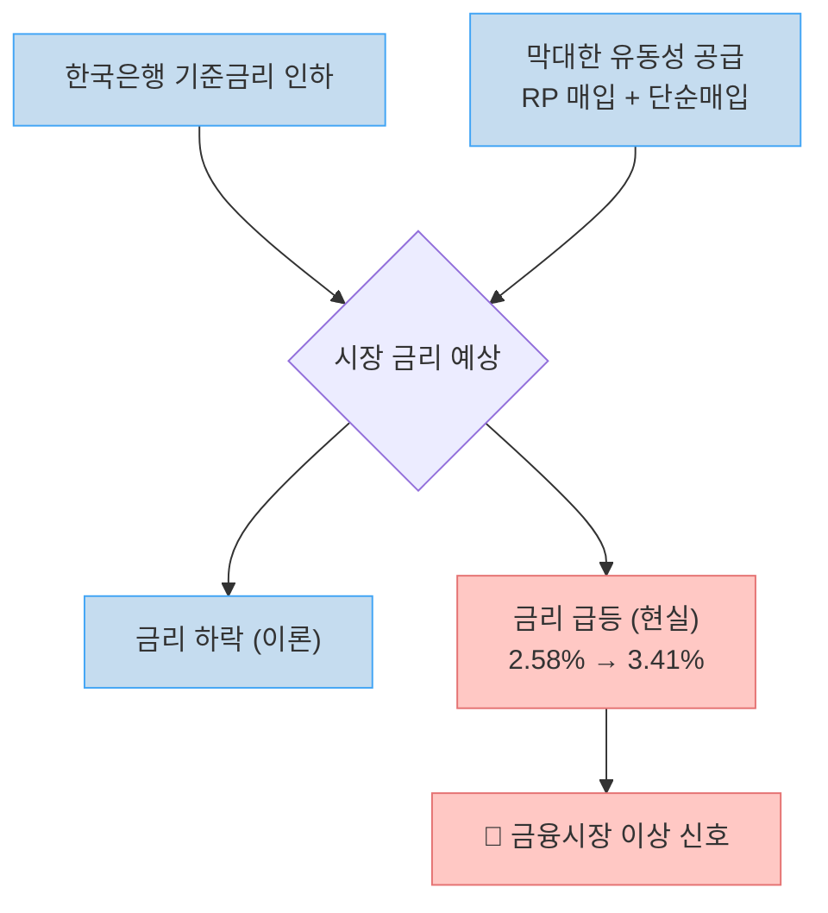

---

## 스텔스 양적완화의 실체: RP 매입 메커니즘

[https://youtu.be/yRd3_RGC1Oc?t=65](https://youtu.be/yRd3_RGC1Oc?t=65)에서 한국은행이 6개월 이상 조용히 시행해 온 '스텔스 양적완화'의 구조를 설명한다.

### 양적완화(QE)와 RP 매입의 차이

**양적완화(QE)**는 중앙은행이 돈을 찍어서 시중은행이 보유한 국채를 영구적으로 매입하는 방식이다. 미국 연준이 2008년 금융위기와 코로나 이후 시행했다. 시중에 돈이 영구적으로 공급된다.

**RP(환매조건부채권) 매입**은 조건이 있다. 7일 또는 14일 뒤에 은행이 돈을 다시 갚아야 한다. 중앙은행이 단기 자금을 빌려주는 방식으로, 엄밀히는 양적완화가 아니다.

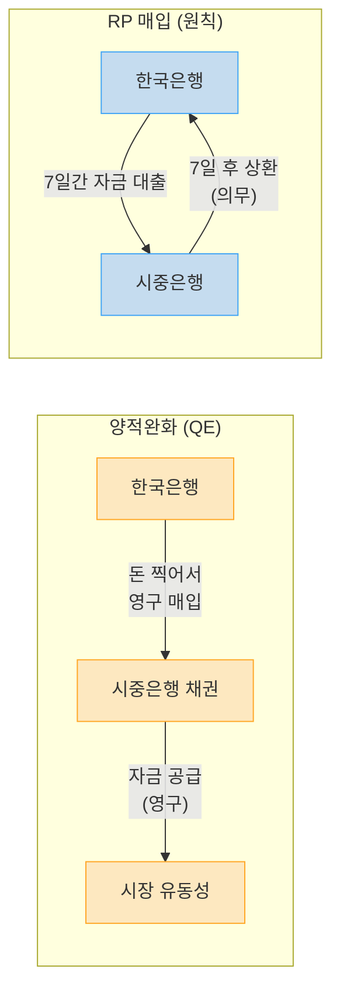

### 꼼수: 7일 무한 연장

[https://youtu.be/yRd3_RGC1Oc?t=100](https://youtu.be/yRd3_RGC1Oc?t=100)에서 핵심 메커니즘을 설명한다.

> "7일에 은행들이 갚아야 되는 날 다시 매입을 7일짜리를 해 준다. 그러면 다시 만기가 7일 연장되겠죠. 끝없이 7일을 연장하면 어떻게 될까요?"

7일 뒤 갚는 날, 한국은행이 다시 새로운 7일짜리 RP로 빌려주면 실질적으로 자금이 회수되지 않는다. 게다가 매번 빌려주는 금액을 늘려주면 시중 유동성은 계속 증가한다.

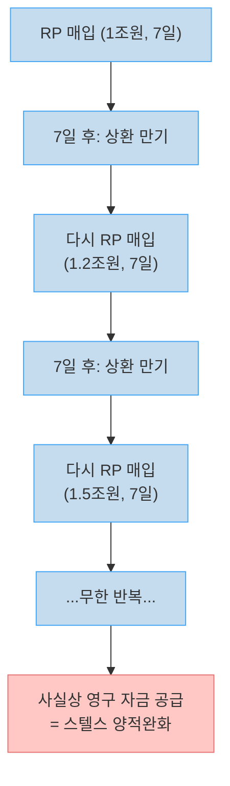

이 방식을 비판적으로 표현할 때 **스텔스 양적완화**, 가치 중립적으로는 **유사 양적완화**라고 부른다.

### 이창용 총재의 4월 30일 발언

[https://youtu.be/yRd3_RGC1Oc?t=180](https://youtu.be/yRd3_RGC1Oc?t=180)에서 한국은행의 방향성이 이미 공개적으로 제시됐음을 지적한다.

> "우리 한국도 선진국 중앙은행이 했던 것처럼 양적완화를 도입할 수 있을지, 도입하는 것이 바람직할지 등을 고민해야 될 시점입니다."

이 발언은 거센 비판을 받았다. '원화는 달러·유로 같은 국제통화가 아닌데 양적완화를 하면 튀르키예·아르헨티나처럼 통화가치가 붕괴된다'는 우려였다. 그러나 한국은행은 이 발언 이후부터 RP 매입을 본격적으로 확대했다.

---

## RP 매입 규모 급증과 통화승수 효과

[https://youtu.be/yRd3_RGC1Oc?t=290](https://youtu.be/yRd3_RGC1Oc?t=290)에서 분기별 규모 변화를 제시한다.

### 분기별 RP 잔액 추이

| 분기 | RP 잔액 | 변화 |
|-----|--------|-----|
| 2025년 1분기 | 0.5조원 | 기준 |
| 2025년 2분기 | 2조원 | +1.5조 |
| 2025년 3분기 | 4.5조원 | +2.5조 |
| 2025년 4분기 | 6.5조원(추정) | +2조 |

2024년 12월 계엄 사태를 계기로 '무제한 RP 매입'을 선언했고, 2025년 2월 비상사태 공식 종료 이후에도 잔액은 오히려 계속 늘었다.

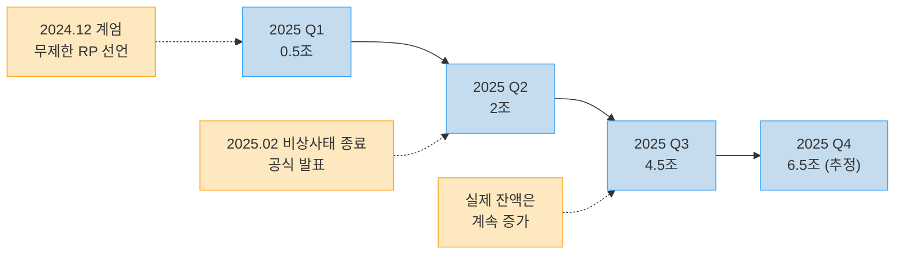

### 국고채 단순 매입: 진짜 본원통화 공급

[https://youtu.be/yRd3_RGC1Oc?t=370](https://youtu.be/yRd3_RGC1Oc?t=370)에서 12월 8일 조치의 핵심을 짚는다.

RP는 그래도 이론상 7~14일 후 환매가 있다. 그런데 **국고채 단순 매입**은 다르다. '단순'이라는 용어의 의미는 '환매 조건 없이 영구 보유'다. 돈을 찍어서 시중에 영구 공급하는 것이다. 12월 8일에 한국은행은 1조 5천억 원어치 국고채를 단순 매입했다.

### 통화승수 계산: 80~112조원의 효과

[https://youtu.be/yRd3_RGC1Oc?t=430](https://youtu.be/yRd3_RGC1Oc?t=430)에서 통화승수를 적용한 실질 효과를 계산한다.

한국은행이 돈을 찍어 은행에 공급하면, 그 돈은 은행에서 은행으로 이동하면서 신용 창출이 일어난다. 고교 경제 교과서의 '신용창출' 개념이다.

한국의 통화승수는 일반적으로 **14**다. 1조원을 공급하면 시중에 14조원의 통화량 증가 효과가 생긴다.

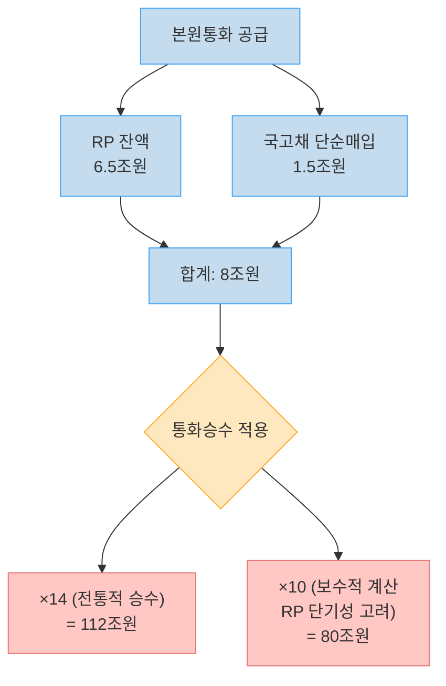

> "RP라는 건 7일짜리 14일짜리인데 그게 어떻게 본원 통화 늘린 거랑 똑같냐라고 분명히 변명을 할 수 있겠죠. 이걸 고려해 준다면 10 정도 곱하는 게 맞을 것 같습니다. 그러면 80조원을 살포한 효과가 일어납니다." ([https://youtu.be/yRd3_RGC1Oc?t=450](https://youtu.be/yRd3_RGC1Oc?t=450))

RP의 단기성을 감안해서 보수적으로 10배를 적용해도 **80조원**, 상시적 연장을 고려하면 **112조원**이 시중에 풀린 셈이다.

---

## 에버그리닝 효과와 도덕적 해이

[https://youtu.be/yRd3_RGC1Oc?t=490](https://youtu.be/yRd3_RGC1Oc?t=490)에서 이 막대한 유동성이 어디로 흘러가는지를 설명한다.

### 에버그리닝(Evergreening) 효과란

> "죽어야 될 빚을 한국은행이 돈을 무지막지하게 뿌리게 되면 억지로 살려내서 언제나 푸른 것처럼 위장할 수가 있게 됩니다. 그래서 좀비처럼 PF 대출을 살려내는 그런 효과가 있거든요." ([https://youtu.be/yRd3_RGC1Oc?t=500](https://youtu.be/yRd3_RGC1Oc?t=500))

에버그리닝(Evergreening)은 '항상 푸르다'는 뜻이다. 실제로는 부실한 대출·기업이 유동성 공급 덕분에 겉으로 멀쩡해 보이는 상태를 말한다. 비판적 표현으로는 **좀비 효과**라고도 한다.

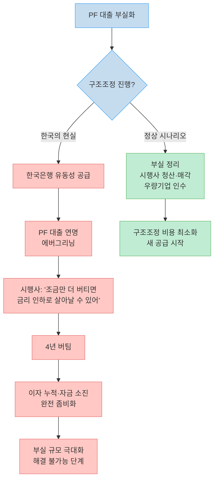

### 도덕적 해이의 구조

[https://youtu.be/yRd3_RGC1Oc?t=540](https://youtu.be/yRd3_RGC1Oc?t=540)에서 채권 시장의 도덕적 해이를 지적한다.

은행 입장에서는 PF 대출이 부실화되더라도 독촉할 이유가 없어진다. '한국은행이 막대한 돈을 풀어서 언젠가 막아 줄 것'이라는 기대가 형성되었기 때문이다. 빚 독촉 대신 계속 살려두는 것이 합리적 선택이 된다.

대한민국의 채권 시장이 "불신이 가득한" 상태가 된 것은 이 도덕적 해이의 결과다.

### 부작용: 환율과 부동산

[https://youtu.be/yRd3_RGC1Oc?t=570](https://youtu.be/yRd3_RGC1Oc?t=570)에서 유동성 폭증의 직접적 부작용을 설명한다.

**환율**: 원화 가치가 하락해 환율이 급등한다. 현재 1,470원대에서 외환보유고로 방어 중이다.

**강남 부동산**: 지난 4년간 통화량은 21% 증가했지만 강남 공급은 겨우 2% 늘었다. 통계 기준을 바꾸는 경우에도 15% 증가다. 정부 정책으로 2%를 추가 공급해봤자 돈이 15% 늘어난 상황에서 집값이 내려올 수가 없다.

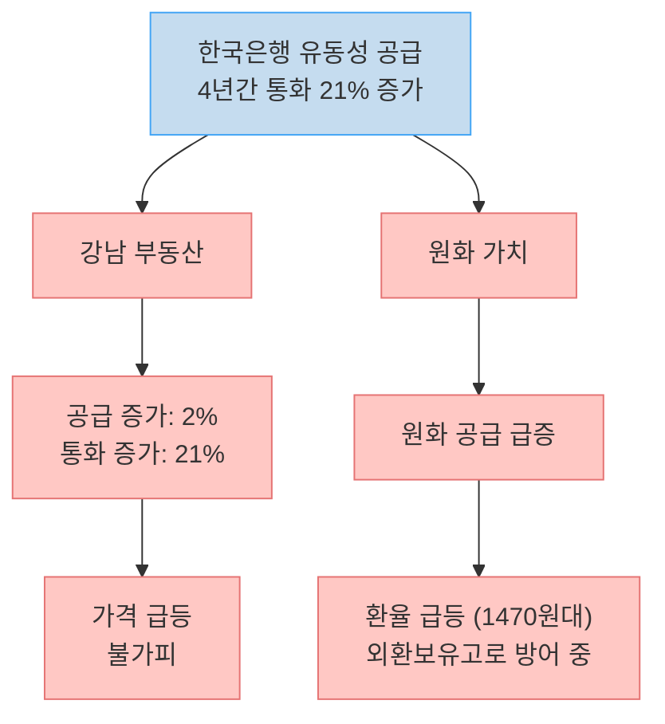

---

## 모든 것의 시작: 둔촌주공과 2022년 PF 사태

[https://youtu.be/yRd3_RGC1Oc?t=730](https://youtu.be/yRd3_RGC1Oc?t=730)에서 현재 상황의 근원을 추적한다.

> "모든 것은 둔촌일병 구하기에서 시작됩니다."

2022년은 미국을 비롯한 전 세계가 금리를 급격히 올리며 강도 높은 구조조정을 진행하던 시기였다. 이 시기 한국은 역방향으로 움직였다. 한국은행이 막대한 돈을 풀어 둔촌주공 재건축 프로젝트의 PF 대출을 지원했다.

### 2022년 조기 구조조정이 가능했다면

[https://youtu.be/yRd3_RGC1Oc?t=830](https://youtu.be/yRd3_RGC1Oc?t=830)에서 반사실적 분석을 제시한다.

당시 PF 부실 규모는 지금보다 훨씬 작았다. 초기 단계였기 때문에 시행사들이 공사를 포기하고 땅을 매각하면 어느 정도 원금 회수가 가능했다. 우량 회사가 싸게 땅을 인수해서 공사를 시작했다면 4년이 지난 지금쯤 이미 완공됐을 것이다.

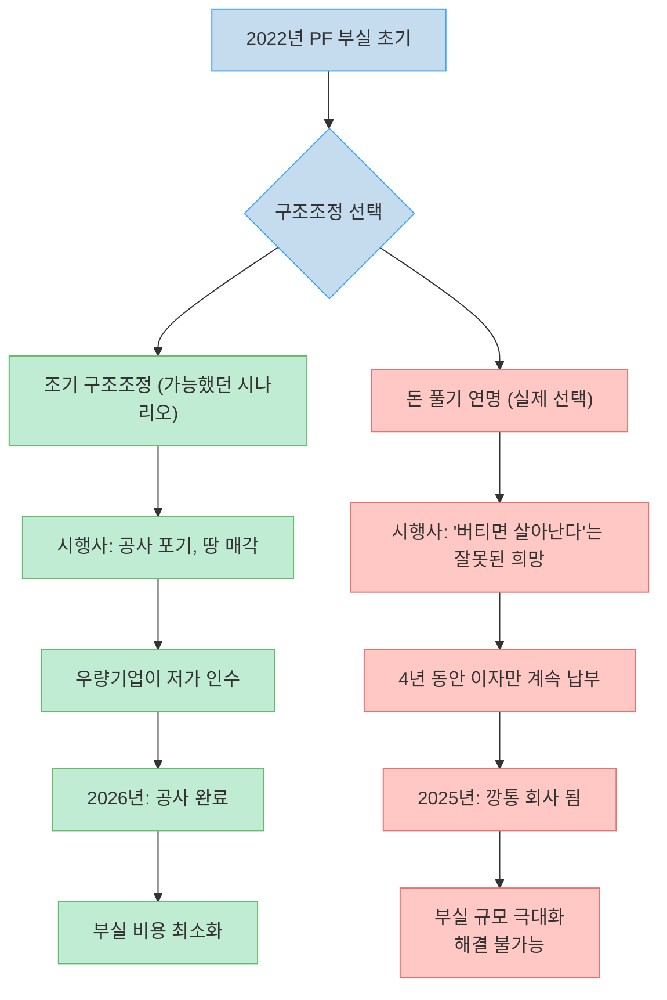

### 희망고문이 만든 좀비 시행사

[https://youtu.be/yRd3_RGC1Oc?t=900](https://youtu.be/yRd3_RGC1Oc?t=900)에서 4년 연명의 결과를 진단한다.

> "한국은행이 희망고문하면서 회사를 이제 완전히 거덜날 정도로 부실화시킨 겁니다."

한국은행이 계속 돈을 풀자 시행사들은 '1~2년만 버티면 금리도 인하되고 살아날 수 있다'는 잘못된 희망을 가졌다. 그 결과 4년 동안 갚지 않아도 될 이자를 내면서 자금을 소진했고, 이제는 금리가 내려가도, 공사비가 낮아져도 자금이 없어서 공사 자체를 시작할 수 없는 상태가 됐다. 망하면 마이너스가 나는 단계다.

---

## 돈을 풀어도 금리가 오르는 3가지 이유

[https://youtu.be/yRd3_RGC1Oc?t=640](https://youtu.be/yRd3_RGC1Oc?t=640)에서 금리 역설의 메커니즘을 세 가지로 분석한다.

### 1. 외국인 불신

외국인 투자자들은 한국은행이 미친 듯이 돈을 푸는 것을 보고 '뭔가 금융시장에 문제가 있으니까 이렇게 하는 것 아니냐'는 의심을 시작했다. 의심이 쌓이면 국채와 원화를 팔기 시작한다. 국채가 팔리면 국채 가격 하락 = 금리 상승이다.

### 2. 인플레이션 기대 상승

한국은행이 이렇게 막대하게 돈을 풀면 내년부터 물가가 본격적으로 오를 것이라는 기대가 형성된다. 물가 상승 기대가 있으면 채권 투자자들은 '물가가 오를 만큼 이자를 더 줘야 돈을 빌려 주겠다'고 요구한다. 이것이 장기 금리 상승 압력이 된다.

### 3. 단기 RP로는 장기 금리를 못 누른다

RP 매입은 단기 금리를 눌렀지만, 10년물 같은 장기 국채는 RP로 살 수 없다. 장기 금리가 급등하자 한국은행이 국고채 단순 매입으로 장기 국채까지 사들이기 시작했다. 그런데 그 발표 당일에도 금리가 뛰어올랐다.

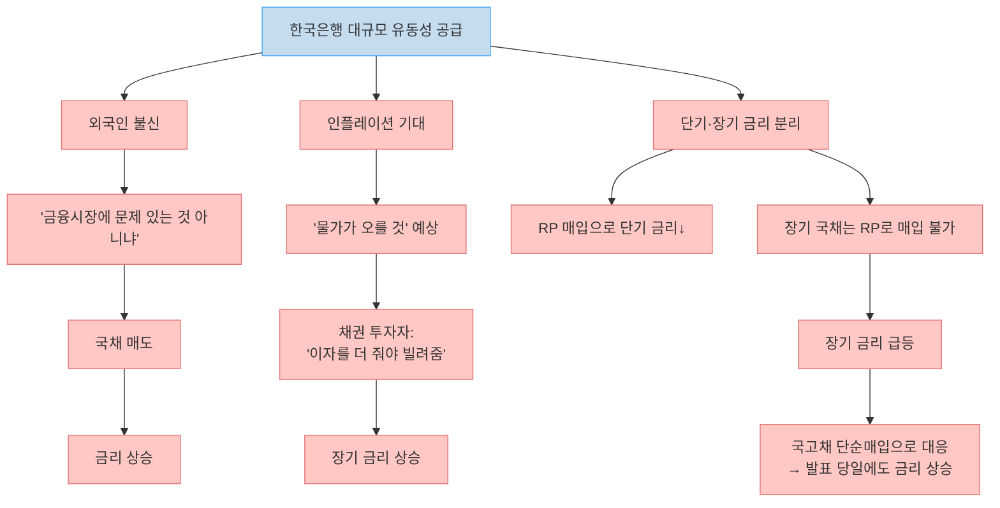

---

## 앞으로의 전망: 국민연금의 한계와 환율 방어선

### 국민연금의 한계

[https://youtu.be/yRd3_RGC1Oc?t=990](https://youtu.be/yRd3_RGC1Oc?t=990)에서 2026년 초의 단기 기대와 그 한계를 설명한다.

연말에는 국민연금이 국내 채권 투자 비율(23.6%)을 맞추기 위해 추가 매수 여력이 없다. 그러나 2026년 초가 되면 새로운 보험료 수입이 들어오면서 국내 채권을 살 여력이 생기고, 이것이 금리를 다소 안정시킬 수 있다.

그러나 [https://youtu.be/yRd3_RGC1Oc?t=1010](https://youtu.be/yRd3_RGC1Oc?t=1010)에서 그 한계를 지적한다.

> "2026년 국민연금 보험료 수입 예상치가 67조원에 불과합니다. 그런데 국민연금 보험료 67조원이 들어온다 하더라도 이 가운데 적어도 절반은 달러에 투자해야 되고 한국 채권에 투자할 수 있는 돈은 전체 수입 보험료에 1% 정도에 불과하거든요."

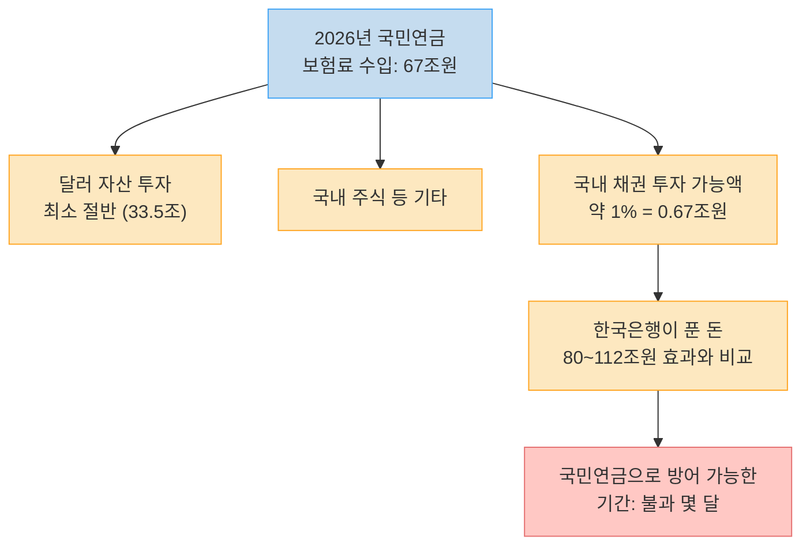

2026년 초 대한민국의 원화 환율, 금리, 주가가 모두 국민연금에 의존하는 구조가 된다. 외국인 투자자들은 이 사실을 안다. 그리고 그 방어 여력이 불과 몇 달짜리에 불과하다는 것도 계산할 수 있다.

### 위험의 예고편과 진짜 신호탄

[https://youtu.be/yRd3_RGC1Oc?t=1120](https://youtu.be/yRd3_RGC1Oc?t=1120)에서 두 단계의 위험 신호를 구분한다.

**예고편 (이미 진행 중)**: 한국은행이 돈을 더 찍겠다고 했는데도 금리가 오르는 현상. 10년물 국채금리가 2.58%에서 3.41%로 상승한 것이 여기에 해당한다.

**진짜 신호탄**: 환율 방어선이 무너지는 순간.

> "진짜로 위험이 오는 신호는 뭐냐? 환율 방어선이 무너지는 겁니다." ([https://youtu.be/yRd3_RGC1Oc?t=1120](https://youtu.be/yRd3_RGC1Oc?t=1120))

현재 외환보유고로 환율을 1,470원대에서 방어하고 있다. 이 방어선이 무너지면 그때가 진짜 위기다. 그 황금 같은 방어 시간에 구조조정을 해야 하는데, 지금처럼 '오늘 하루만 막아보겠다'는 방식으로는 몇 달을 버틸 수 없다.

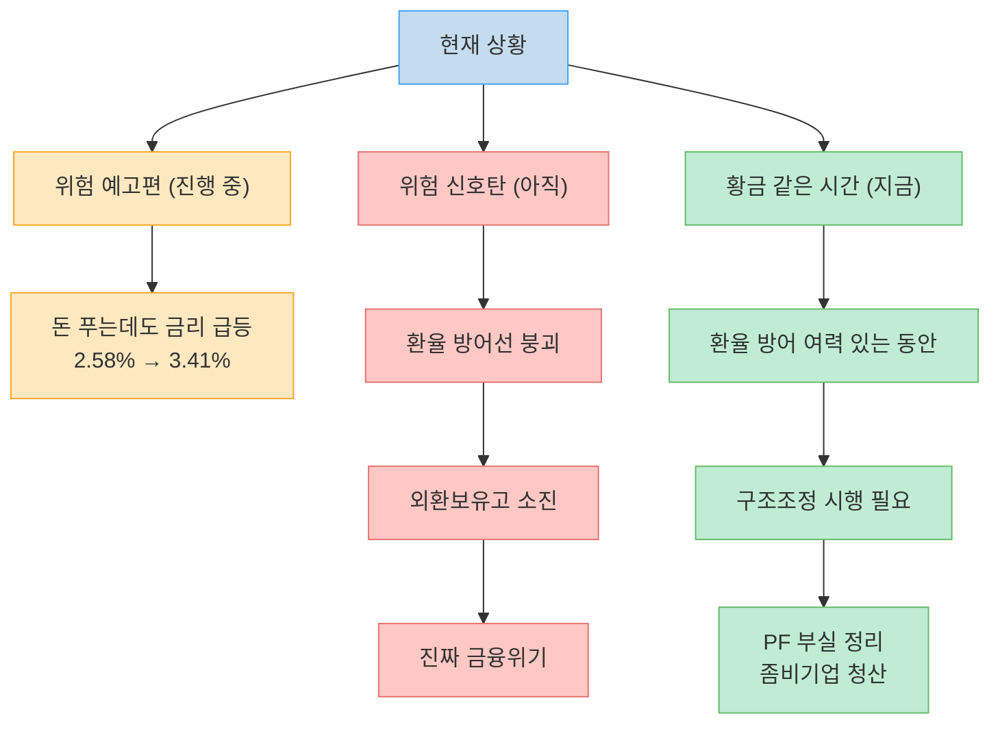

---

## 핵심 요약

| 항목 | 내용 |
|-----|------|
| **금리 역설** | 돈 풀었는데 10년물 국채금리 2.58% → 3.41% 급등 |
| **유사 양적완화 수단** | RP 매입 7일 무한 연장 + 국고채 단순매입 |
| **RP 잔액 추이** | Q1 0.5조 → Q2 2조 → Q3 4.5조 → Q4 6.5조 (추정) |
| **실질 통화 효과** | 8조원 본원통화 × 통화승수 = 80~112조원 |
| **에버그리닝 효과** | PF 부실 대출 연명, 은행 빚 독촉 포기, 도덕적 해이 |
| **원인** | 2022년 둔촌주공 구하기 위한 역주행 완화 |
| **PF 현황** | 시행사 4년 연명 → 이자 납부로 깡통 → 해결 불가 수준 |
| **금리 상승 이유** | 외국인 불신 + 인플레 기대 + 장기 금리 방어 불가 |
| **단기 기대** | 2026년 초 국민연금 매수 여력 (단 0.67조원 수준) |
| **위험 신호탄** | 환율 방어선 붕괴 |

---

## 결론

한국은행이 돈을 풀어도 금리가 오르는 현상은 시장 실패가 아니라, 시장이 올바른 신호를 보내고 있는 것이다. '돈 풀기로 PF 부실을 계속 덮겠다'는 한국은행의 전략에 대해 채권 시장과 외국인 투자자들이 불신을 가격에 반영하고 있다.

둔촌주공에서 시작된 PF 연명 정책은 이제 4년째에 접어들었고, 그 결과 부실 규모는 초기보다 훨씬 커졌다. 지금이라도 구조조정을 시작하지 않으면, 환율 방어선이 무너지는 순간 그동안 공급한 80~112조원 규모의 유동성이 독이 될 수 있다. 금리 급등은 그 위험의 예고편이다.
