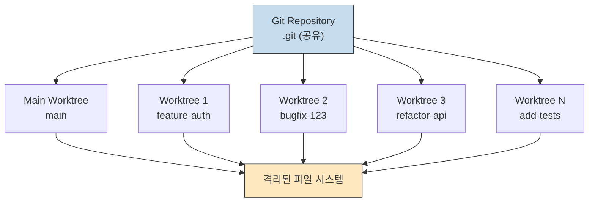
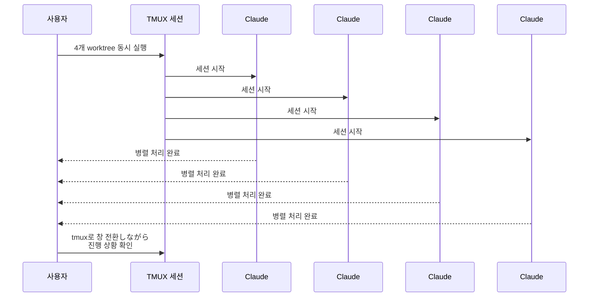
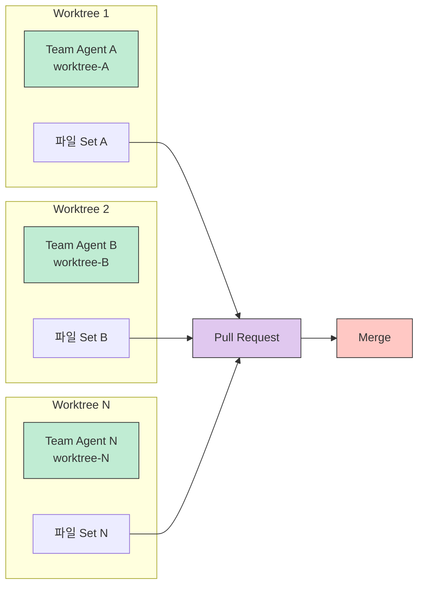

## 요약

Git Worktree와 Claude Code의 조합으로 파일 충돌, 브랜치 충돌, 파일 잠금 문제 없이 여러 작업을 병렬로 처리하는 방법을 소개합니다. 하나의 명령어로 격리된 작업 환경을 만들고, 여러 Claude Code 세션을 동시에 실행할 수 있습니다.

## 본문

Claude Code 세션 5개를 동시에 돌리고 있어요. 서로 코드 충돌? 없습니다. 브랜치 충돌? 없습니다. 파일 잠금? 없습니다. 비밀은 딱 한 줄이에요.

```bash
claude -w feature-auth --tmux
```

## Git Worktree란?

하나의 리포에서 여러 브랜치를 동시에 체크아웃하는 기능이에요. 폴더를 복사하는 게 아니라 Git이 관리하는 격리 공간을 만드는 거예요.

> "git clone 여러 번 하면 되잖아요?"
> 그럼 용량이 N배로 불어나요.
> worktree는 .git을 공유해요.
> **디스크 용량 거의 추가 없음.**



## Claude Code v2.1.50 업데이트

이번에 CLI에 빌트인 worktree 지원이 공식 추가됐어요. Desktop 앱에는 이미 있던 기능인데 CLI에도 드디어 왔습니다.

**사용법:**
```bash
claude -w 이름
```

이 한 줄이면 격리 환경에서 Claude가 실행돼요.

| 항목 | 값 |
|------|-----|
| 저장 위치 | `.claude/worktrees/이름/` |
| 브랜치 | `worktree-이름` 자동 생성 |
| 정리 | 변경 없으면 자동 삭제 |

## 병렬 작업의 실제 사용법

이렇게 쓰면 돼요.

```bash
claude -w feature-auth --tmux
claude -w bugfix-123 --tmux
claude -w refactor-api --tmux
claude -w add-tests --tmux
```

4개의 Claude가 각각 다른 작업을 병렬로 처리해요. tmux 창 전환하면서 진행 상황만 확인하면 됩니다.

> "혼자서 4명분 일을 하는 거네요?"
> 정확해요.
> **물리적으로 파일이 분리되어 있어서 충돌이 원천 차단돼요.**



## 서브에이전트 격리 모드

커스텀 에이전트 frontmatter에 한 줄만 추가하면 돼요.

```yaml
isolation: worktree
```

이러면 해당 에이전트가 호출될 때마다 자체 worktree에서 실행돼요. 대규모 코드 마이그레이션할 때 완벽해요.

- 작업 끝나고 변경 없으면 **자동 정리**
- 변경 있으면 worktree 경로랑 브랜치를 **반환**

## .worktreeinclude 파일

이게 숨은 핵심이에요.

새 worktree를 만들면 `.gitignore` 대상 파일이 없어요.
- `.env` 파일? 없습니다.
- 로컬 설정? 없습니다.

`.worktreeinclude` 파일에 이렇게 적어두면요.

```text
.env
.env.local
config/local.json
```

**새 worktree 생성 시 자동으로 복사해줘요.** 환경 변수 빠져서 삽질하는 일이 사라집니다.

## Agent Teams와의 조합

기존에 Agent Teams의 가장 큰 고민이 뭐였냐면요.

> **"파일 소유권 분리"**였어요.

팀원 A가 수정한 파일을 팀원 B가 덮어쓰면 끝이에요. worktree가 이걸 **근본적으로 해결**해요.

각 팀원이 자체 worktree에서 작업하면 **물리적으로 충돌이 불가능**해요.

> "그러면 머지는요?"
> 각자 브랜치에서 작업하고 PR로 합치면 돼요.
> Git이 원래 하던 일이에요.



## 정리

| 개념 | 설명 |
|------|------|
| `git worktree` | 하나의 리포, 여러 작업 공간 |
| `claude -w` | 한 줄로 격리 환경 생성 |
| `.worktreeinclude` | 환경 파일 자동 복사 |
| `isolation: worktree` | 에이전트 자동 격리 |

Claude Code 팀의 boris_cherny가 직접 이렇게 말했어요.

> "**3-5개 worktree를 동시에 띄우고 병렬 실행하라. 가장 큰 생산성 향상이다.**"

직접 해보시면 체감이 확실해요. **혼자서 팀 단위 작업이 가능**해집니다.

---

## 참고

- 원본: [Threads 포스트](https://www.threads.com/@qjc.ai/post/DVDEHdxkqdy)
- 작성자: [@qjc.ai](https://www.threads.com/@qjc.ai)
- 좋아요: 294 |返信: 30
