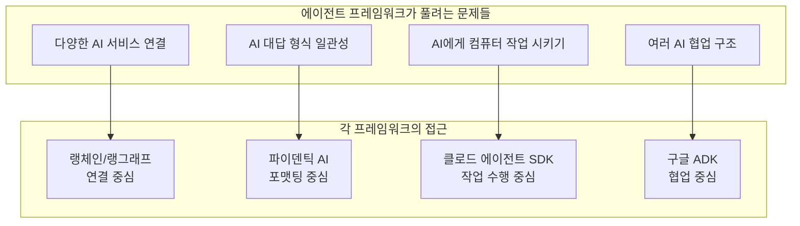
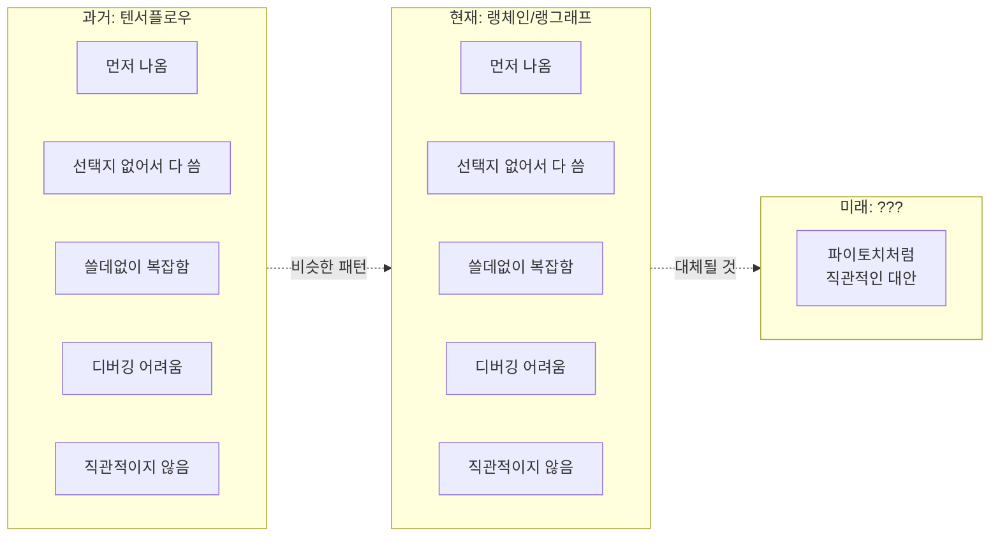
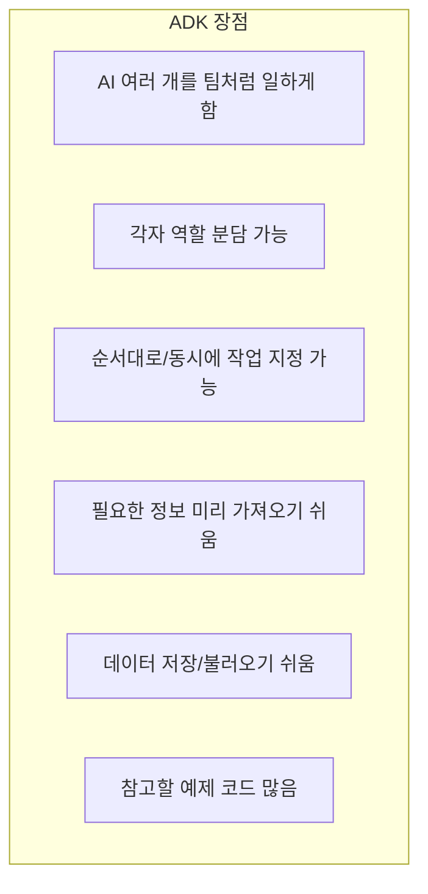
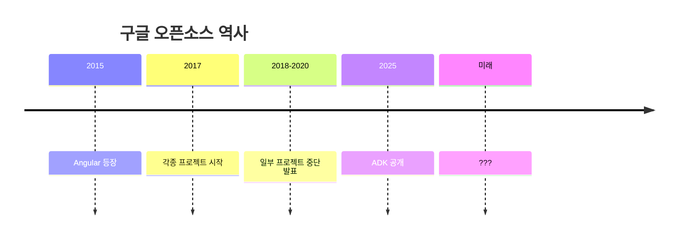
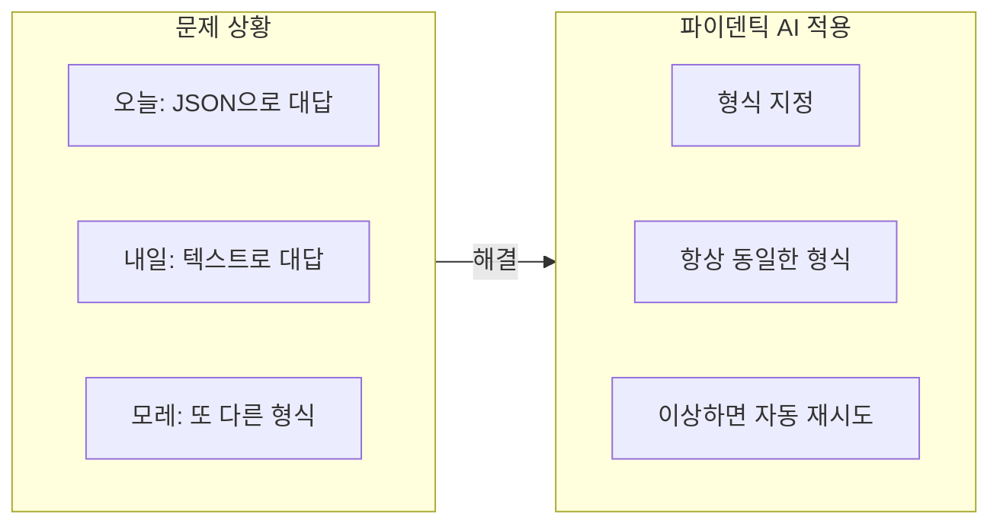
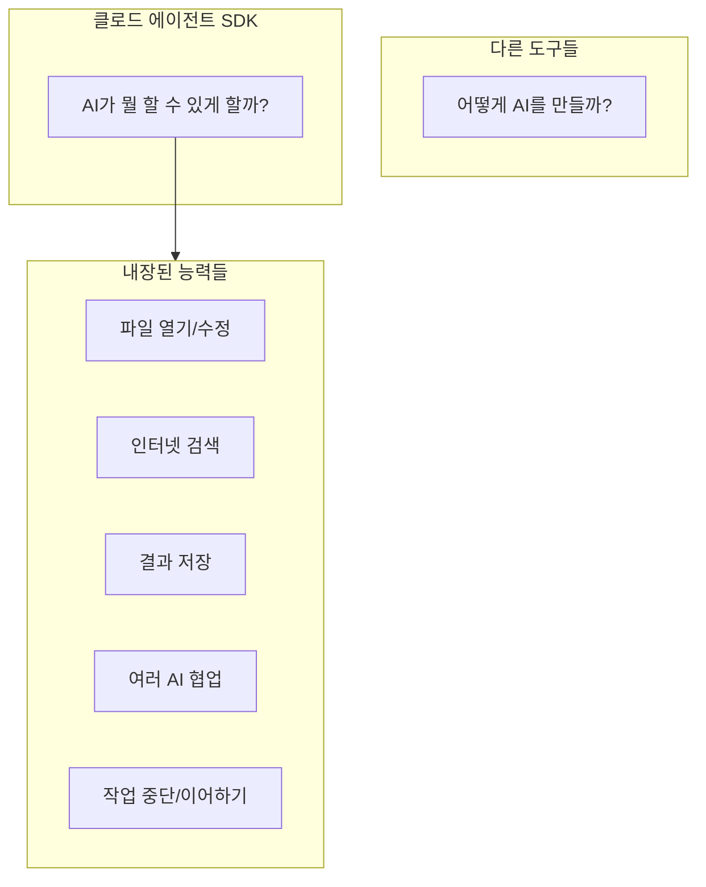
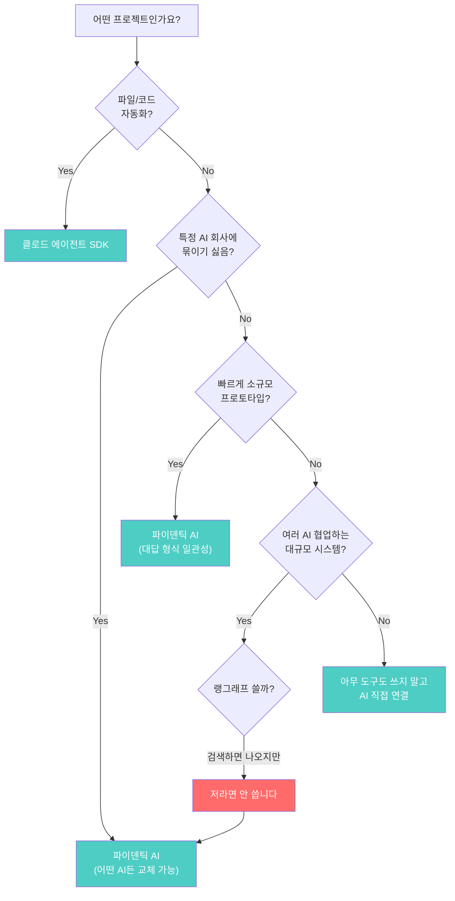
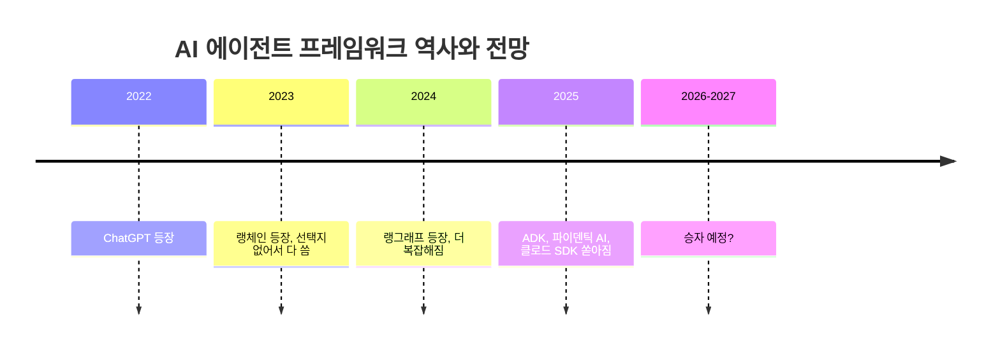
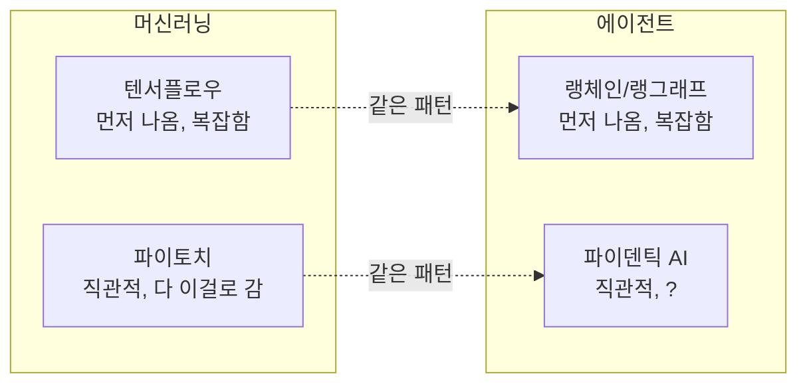

AI 에이전트를 만들려고 검색하면 정말 다양한 도구들이 터져 나옵니다. 랭체인, 랭그래프, 구글 ADK, 파이덴틱 AI, 클로드 에이전트 SDK까지. 하지만 이 중에서 아무거나 골라서 시작했다가 6개월 뒤에 갈아엎는 팀이 정말 많습니다. 겉보기엔 다 똑같아 보이지만, 속을 열어보면 완전히 다른 문제를 풀고 있기 때문입니다.

<!--more-->

## Sources

- [랭그래프 선택하셨나요? 저라면 안 씁니다 | 메이커 에반](https://www.youtube.com/watch?v=9gAaZPCJLyU)

## 왜 이렇게 많은 프레임워크가 생겼을까

2025년에 AI 관련 도구들이 한꺼번에 쏟아져 나왔습니다. 특히 에이전트 관련 프레임워크들이 그렇습니다. 문제는 이것들이 각자 완전히 다른 생각으로 만들어졌다는 점입니다.

"뭐가 제일 좋아요?"라는 질문 자체가 잘못된 것입니다. 각 도구가 풀려는 문제가 다르기 때문에, 상황에 맞는 도구를 선택해야 합니다.

## 랭체인 (LangChain): 검색하면 제일 먼저 나오지만

검색하면 제일 많이 나오고 튜토리얼도 제일 많습니다. AI 에이전트 만들기 영상을 보면 거의 다 여기서 시작합니다. 하지만 **새 프로젝트에서는 비추천**입니다.

### 왜 이렇게 많이 쓰일까

랭체인이 나온 게 ChatGPT가 처음 나왔을 때입니다. 그때는 AI 기능을 뭔가에 붙이려면 연결해 주는 도구가 필요했고 선택지가 없었습니다. 그러다 보니 다들 랭체인으로 시작했고 지금도 그 관성이 이어지고 있습니다.

### 실제 문제점들

실제로 쓰다 보면 다음과 같은 벽에 부딪힙니다:

| 문제 | 설명 |
|------|------|
| **용어 학습 부담** | 이 부분만 좀 바꾸고 싶은데 하면 알 수 없는 용어들을 계속 파야 함 |
| **디버깅 어려움** | 뭔가 잘못됐을 때 어디서 문제가 생겼는지 찾기가 너무 어려움 |
| **업데이트 호환성** | 업데이트하면 어제까지 잘 돌던 게 갑자기 안 됨 |
| **문서 품질** | 공식 설명서도 안 좋기로 유명. 읽다 보면 중간에 포기하게 됨 |

이게 한두 번이 아닙니다. 랭체인 서든 팀이라면 한 번씩 다 겪는 경험입니다.

## 랭그래프 (LangGraph): 더 복잡해진 해결책

랭체인 팀이 랭그래프를 만들었습니다. 더 복잡한 걸 할 수 있게 업그레이드한 버전입니다. 하지만 이것도 솔직히 **더 복잡합니다**.

### 복잡성의 문제

복잡한 걸 해결하겠다고 만든 건데, 그 과정에서 배워야 할 것들이 오히려 더 늘어났습니다. 간단한 것 하나 만드는데 코드가 너무 많습니다. 달걀 하나 삶는데 설명서가 열 페이지짜리인 느낌입니다.

### 직관성 부족

그래프 구조가 그렇게 직관적이지 않습니다. AI 개발자라면 텐서플로우를 떠올려 보세요:

딥러닝 초창기에 텐서플로우가 나왔고, 처음엔 선택지가 없으니까 다들 썼습니다. 근데 막상 써보면 쓸데없이 복잡하고 뭔가 잘못됐을 때 원인 찾기가 너무 힘들었습니다. 그 사이에 파이토치가 나왔고, 연구자들, 스타트업들, 결국 큰 회사들까지 다 파이토치로 갔습니다.

지금 AI 에이전트 프레임워크들이 딱 그 상황입니다. 랭체인이랑 랭그래프가 텐서플로우 자리라고 생각하면 됩니다.

### 추천

**이미 쓰고 있다면 유지보수만 하고, 새로 시작하는 거라면 다른 걸 보는 걸 추천합니다.**

## 구글 ADK: 아이디어는 좋지만

2025년에 구글이 공개한 도구입니다. 아이디어 자체는 나쁘지 않습니다.

### 장점

AI를 여러 개 만들어서 팀처럼 일하게 한다는 컨셉입니다. 각자 역할이 있고 어떤 건 순서대로, 어떤 건 동시에 일하게 할 수 있습니다.

### 문제점들

| 문제 | 설명 |
|------|------|
| **커스터마이징 어려움** | 조금이라도 내 양식대로 바꾸려고 하면 막힘 |
| **몽키패치 남발** | 정해진 틀에서 벗어나려면 임시방편 우회 코드가 엄청 필요 |
| **버그 많음** | 기본 기능인데 안 된다거나 어제 됐는데 오늘 안 됨 |

### 더 근본적인 문제: 구글의 오픈소스 신뢰도

구글이 만들었다는 거 자체가 신뢰가 안 갑니다. 구글은 오픈소스 도구를 만들어 놓고 나중에 조용히 손 떼버린 전적이 엄청 많습니다.

개발자들 사이에서 "구글이 만든 건 믿고 쓰기 좀 무섭다"는 얘기가 꽤 돕니다. ADK도 지금은 열심히 업데이트되지만 1, 2년 뒤에 어떻게 될지 장담을 못 합니다.

## 파이덴틱 AI (Pydantic AI): 가장 기대되는 선택

**AI의 대답 결과가 포매팅된 걸 받고 싶다면 파이덴틱 AI를 추천합니다.** 이게 제일 기대되는 도구입니다.

### 신뢰할 수 있는 팀

만든 팀이 개발자들 사이에서 꽤 신뢰받는 팀입니다. 좋은 도구를 만드는 사람들로 알려진 곳입니다.

### 풀려는 문제

AI가 맨날 다른 형식으로 대답하는 거 겪어 보셨죠? 오늘은 이렇게 대답하고 내일은 저렇게 대답합니다. 이걸 실제 서비스에 쓰면 굉장히 곤란합니다.

파이덴틱 AI는 "이 형식으로만 대답해"라고 딱 정해 놓으면 항상 그 형식으로만 나옵니다. 이상하게 대답하면 알아서 다시 합니다. 써본 사람들 반응이 "드디어 이런 게 나왔다"는 분위기입니다.

### 단점

| 단점 | 설명 |
|------|------|
| **사례 부족** | 최근에 나온 거라 큰 서비스에서 써 봤다는 사례가 많지 않음 |
| **검색 결과 부족** | 뭔가 막히면 검색해도 답이 잘 안 나옴 |
| **문서는 좋음** | 독스가 잘 돼 있어서 AI에게 독스를 주고 알아서 하라고 하면 잘함 |

## 클로드 에이전트 SDK: 다른 차원의 접근

이게 나머지 셋이랑 생각 자체가 좀 다릅니다.

### 다른 접근 방식

다른 도구들은 "어떻게 AI를 만들까"를 고민합니다. 클로드 에이전트 SDK는 "AI가 뭘 할 수 있게 할까"를 고민합니다.

### 클로드 코드 경험의 확장

클로드 코드를 써 보셨다면 이해가 빠를 것입니다. AI가 직접 파일을 열고 수정하고 인터넷 검색하고 결과를 저장하는 그 기능입니다.

"이 폴더에서 문제 찾아서 보고서 만들어 줘"라고 하면 AI가 직접 파일을 열고 내용을 읽고 문제를 찾아서 보고서를 만듭니다. 따로 기능을 만들어 줄 필요 없이 다 내장돼 있습니다.

### 단점

| 단점 | 설명 |
|------|------|
| **클로드 전용** | 클로드만 씀. 다른 AI로 바꿀 수 없음 |
| **유료 계정 필요** | 앤스로픽 유료 계정 없으면 못 씀 |
| **커스텀 기능 번거로움** | 내가 만든 기능을 붙이려면 좀 번거로운 방식으로 만들어야 함 |
| **진입장벽** | 다른 도구들보다 시작하기 어려움 |

### 추천 사용 사례

파일 작업이나 코드 관련 자동화할 때 추천합니다. 클로드 코드 경험이 그대로 들어온다고 보면 됩니다.

## 상황별 추천 정리

### 1. 빠르게 소규모 팀에서 만들어 보고 싶어요 + 대답이 일정하게 나오길 원해요

**→ 파이덴틱 AI 추천**

### 2. 여러 AI가 협업하는 큰 시스템, 실제 서비스에 올려야 해요

검색하면 랭그래프가 나오겠지만 **저라면 안 씁니다**. 나중에 고치는 것도 힘들고 팀 규모가 커야지 진짜 유의미하다고 생각합니다. 차라리 파이덴틱 AI로 직접 만드는 게 낫습니다.

### 3. 파일 다루거나 코드 관련 작업 자동화하고 싶어요

**→ 클로드 에이전트 SDK 추천**

다른 도구에서는 이런 기능을 직접 다 만들어야 하는데 여기선 그냥 있습니다.

### 4. 특정 AI 회사에 묶이기 싫어요, 나중에 바꿀 수도 있어요

**→ 파이덴틱 AI 추천**

어떤 AI든 갈아끼울 수 있습니다.

### 5. 아직 뭐가 필요한지도 모르겠어요

**→ 아무 도구도 쓰지 말고 AI를 직접 연결해서 써 보세요**

도구는 문제를 해결해 주기도 하지만 문제를 더 만들기도 합니다. 처음부터 무턱대고 에이전트 프레임워크를 쓰는 건 추천하지 않습니다.

## 트렌드 분석

### 랭체인의 현주소

랭체인이 지금도 많이 쓰이는 건 사실입니다. 하지만 그게 좋아서가 아니라 **먼저 나와서 다들 거기서 시작했기 때문**입니다.

AI 개발자들 커뮤니티에서 요즘 이런 글들이 자주 올라옵니다:
- "우리 팀이 랭체인을 버린 이유"
- "랭체인 없이 직접 만드는 게 낫다"

이게 소수 의견이 아닙니다.

### 텐서플로우-파이토치와 같은 패턴

텐서플로우 때랑 똑같이 흘러가고 있습니다. "텐서플로우 아니면 바보다"라는 분위기가 있었는데 결국 파이토치가 다 뒤집었습니다. 지금 랭체인/랭그래프가 딱 그 자리입니다.

### 아직 승자는 정해지지 않았다

파이덴틱 AI가 그 자리를 차지할 수도 있고, 아직 나오지 않은 뭔가가 나올 수도 있습니다. 지금 확실한 건 하나입니다:

> **나중에 갈아타기 어려운 선택을 지금 해버리면 후회할 가능성이 높습니다.**

## 핵심 요약

| 프레임워크 | 평가 | 추천 상황 |
|-----------|------|----------|
| **랭체인** | 새 프로젝트에서 쓸 이유 없음 | 기존 프로젝트 유지보수만 |
| **랭그래프** | 복잡하고 나중에 고통받을 수 있음 | 비추천 |
| **구글 ADK** | 버그 많고 구글이 언제 손 뗄지 모름 | 비추천 |
| **파이덴틱 AI** | 가장 기대되는 선택 | 대부분의 상황 |
| **클로드 에이전트 SDK** | 파일/코드 자동화 특화 | 클로드 기반 자동화 |

## 결론

2025년에 쏟아져 나온 AI 에이전트 프레임워크들은 각자 다른 문제를 풀고 있습니다. "뭐가 제일 좋아요?"라는 질문보다 "내 상황에 맞는 건 뭔가?"를 물어야 합니다.

**핵심 추천:**
- 파일/코드 자동화 + 클로드 기반 → **클로드 에이전트 SDK**
- 그 외 대부분 → **파이덴틱 AI**
- 아직 뭐가 필요한지 모름 → **아무 도구도 쓰지 말고 AI 직접 연결**

1, 2년 안에 AI 에이전트 도구의 승자가 정해질 것입니다. 그때까지는 **나중에 바꾸기 쉬운 선택**을 해야 합니다. 랭체인/랭그래프로 새 프로젝트를 시작하는 건 텐서플로우 시절의 선택을 지금 하는 것과 같습니다.
