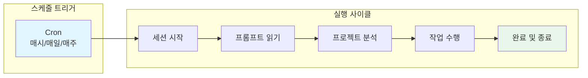
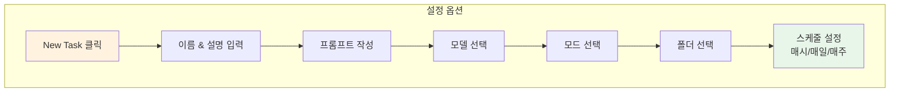
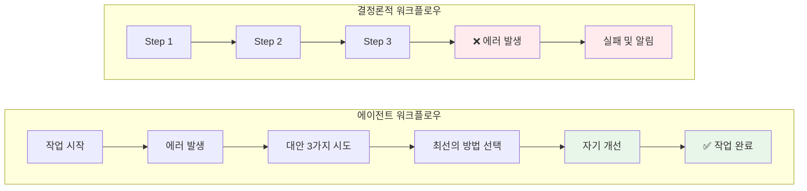
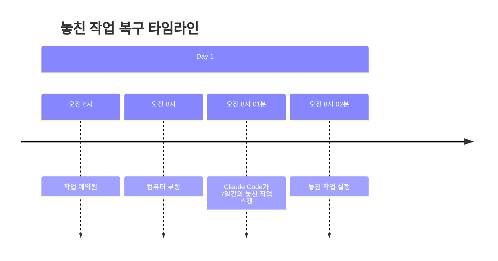
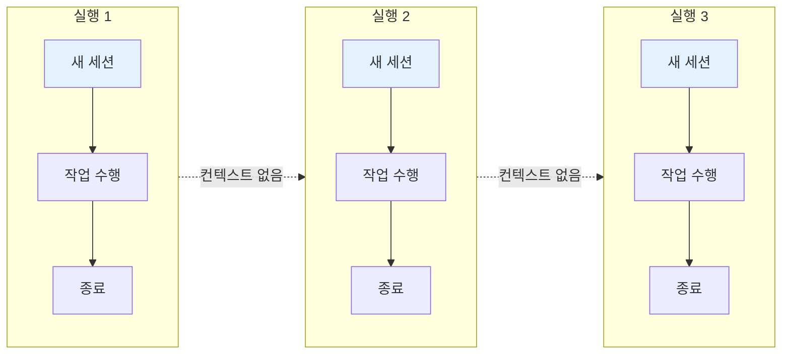
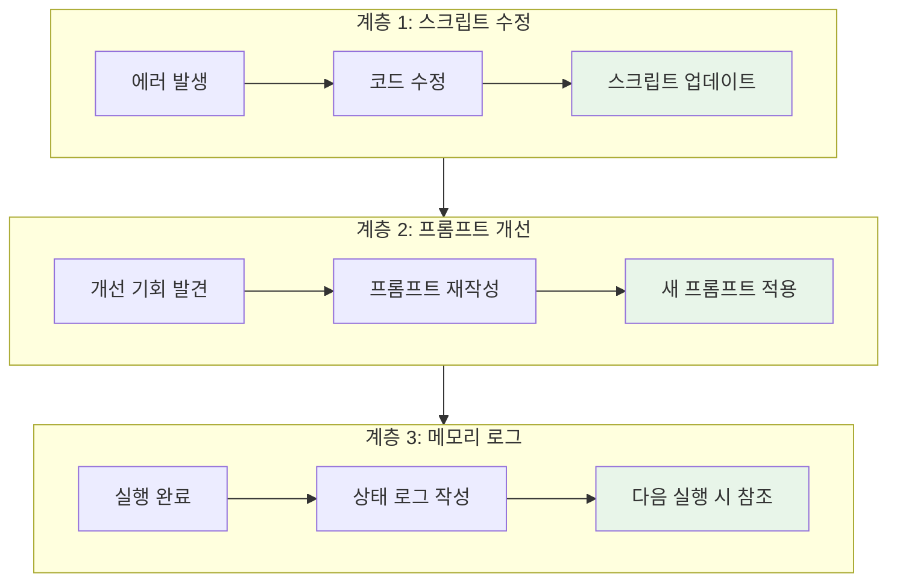
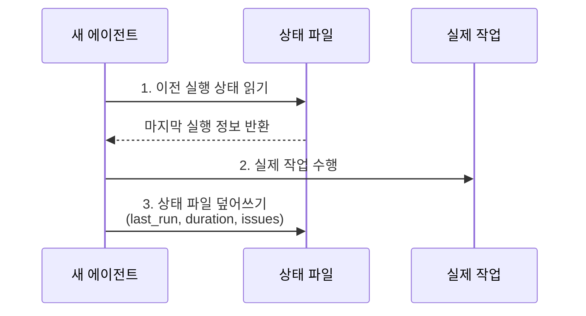
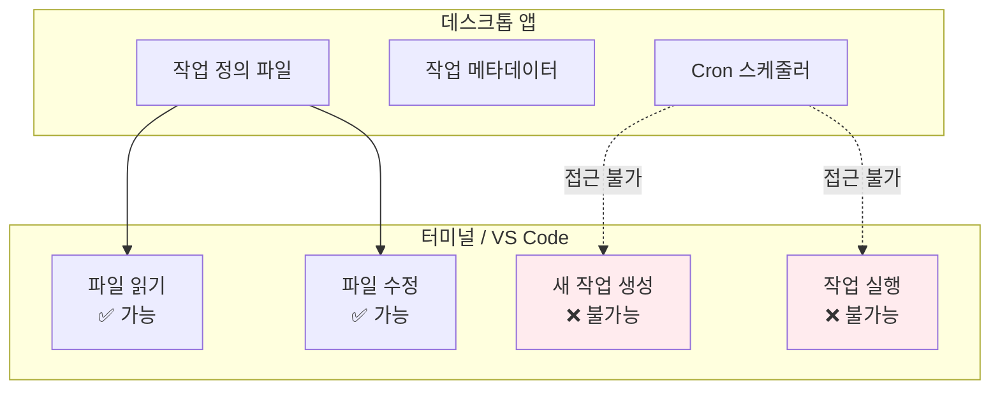
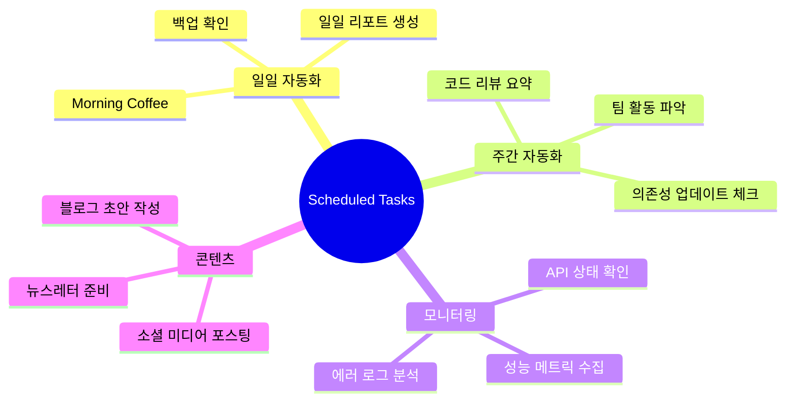

Claude Code가 이제 24/7 AI 직원이 되었습니다. Anthropic이 드디어 Claude Code에 **네이티브 Scheduled Tasks** 기능을 추가했기 때문입니다. 이 기능이 의미하는 바는 단순합니다. 여러분이 자고 있을 때도, 회의 중일 때도, Claude Code는 정해진 시간에 자동으로 깨어나 작업을 수행합니다.

기존에 구축한 모든 스킬, 워크플로우, 자동화가 이 한 번의 업데이트로 **10배 더 강력해졌습니다**. 그리고 설정은 놀라울 정도로 간단합니다.

<!--more-->

## Sources

- [Claude Code 2.0 Is Finally Here - Nate Herk | AI Automation](https://www.youtube.com/watch?v=BlNJFa3Btm8)

## Scheduled Tasks란 무엇인가

Scheduled Tasks는 Claude Code가 정해진 시간에 자동으로 세션을 시작하고, 프롬프트를 읽고, 프로젝트 파일들을 분석하며, 필요한 작업을 수행한 후 완료되면 종료하는 기능입니다.



이것이 기존의 결정론적(Deterministic) 워크플로우와 결정적으로 다른 점은 **Agentic**하다는 것입니다. Python 스크립트나 TypeScript 코드로 작성된 전통적인 자동화는 항상 1단계, 2단계, 3단계가 고정되어 있습니다. 에러가 발생하면 그냥 실패하고 알림만 보냅니다.

하지만 Claude Code의 Scheduled Tasks는 여러분이 대화할 때와 **동일한 방식**으로 작동합니다 ([영상 1:00](https://youtu.be/BlNJFa3Btm8?t=60)). 에러를 만나면 "그냥 시도해봤는데 안 됐어"라고 포기하지 않습니다. 대신 세 가지 대안을 시도해보고, 그중 가장 잘 작동한 것을 기억했다가 다음에는 같은 에러를 만나지 않도록 스스로를 개선합니다.

## 설정 방법

### 두 가지 접근 방식

Scheduled Tasks를 설정하는 방법은 두 가지입니다:

1. **Schedule 탭 사용**: 사이드바의 Schedule 탭 클릭 → New Task
2. **슬래시 커맨드 사용**: 기존 세션에서 `/schedule` 입력



### 실제 설정 예시: Morning Coffee

영상에서 소개된 **Morning Coffee** 스킬은 매일 아침 6시에 자동 실행되도록 설정할 수 있습니다. 이 스킬은 다음을 수행합니다:

- 하루 일정 계획
- 커밋먼트 확인
- 팀 활동 파악
- 프로젝트 상태 업데이트

설정 방법은 믿기 힘들 정도로 간단합니다:

> "Take a look at my morning coffee skill. I would like to turn this into a scheduled task that goes off every morning at 6am. Help me get this set up." ([영상 2:30](https://youtu.be/BlNJFa3Btm8?t=150))

이 프롬프트 하나로 Claude Code가 스킬을 읽고, 한두 개의 clarifying question을 물어본 후, 1분 내로 자동화가 완성됩니다.

## Agentic vs Deterministic 워크플로우

이 기능의 진정한 파워는 **Agentic** 특성에서 나옵니다.



### Agentic 워크플로우의 장점

| 특성 | 설명 |
|------|------|
| **Self-Healing** | 에러 발생 시 스스로 복구 시도 |
| **전체 프로젝트 컨텍스트** | 모든 파일에 접근 가능 |
| **도구 활용** | Claude Code의 모든 도구 사용 가능 |
| **자기 개선** | 성공/실패 경험을 통해 지속적으로 개선 |

### 결정론적 제어가 필요한 경우

완전한 제어가 필요하다면, Scheduled Task가 단순히 스크립트를 실행하도록 설정할 수도 있습니다. 이렇게 하면 100% 결정론적인 동작이 보장됩니다.

## 제한사항과 주의점

### 1. 컴퓨터가 켜져 있어야 함

가장 중요한 제한사항은 **컴퓨터가 켜져 있고 데스크톱 앱이 실행 중이어야** 한다는 것입니다. 컴퓨터를 끄면 자동화도 실행되지 않습니다.

하지만 희소식이 있습니다. 6시에 예약된 작업이 있었는데 8시에 컴퓨터를 켰다면, Claude Code는 **최대 7일 전까지** 놓친 작업을 확인하고 따라잡습니다 ([영상 3:00](https://youtu.be/BlNJFa3Btm8?t=180)). 물론 시간 민감한 작업에는 완벽하지 않지만, 이런 복구 기능이 있다는 것 자체가 유용합니다.



### 2. 무감독 실행으로 인한 위험

사용자 감독 없이 실행되므로, **권한 설정**이 중요합니다. 특히:

- GitHub 저장소에 대한 major change 방지
- 파일 삭제 명령 차단

영상에서 추천하는 방법 ([영상 3:30](https://youtu.be/BlNJFa3Btm8?t=210)):

> "How can I put this in your settings? Deny a bash command that does any deletes or removes."

이 프롬프트로 Claude Code가 삭제 관련 명령을 거부하도록 설정할 수 있습니다.

### 3. Stateless 특성

각 실행은 **완전히 새로운 세션**에서 이루어집니다. 이전 실행의 컨텍스트가 자동으로 전달되지 않습니다.



### 4. 수동 테스트 필수

새 작업을 만든 후 **반드시 수동으로 먼저 실행**해봐야 합니다. 그래야 권한 요청으로 멈추지 않는지 확인할 수 있습니다.

## 자기 개선 루프 구축하기

Stateless 특성을 극복하고 진정한 자율 개선 시스템을 만드는 방법이 있습니다.

### 3계층 개선 구조



### Lean 전략: 파일 하나로 컨텍스트 공유

Claude Code가 추천한 최적의 전략은 **작업당 하나의 파일**을 유지하는 것입니다 ([영상 5:00](https://youtu.be/BlNJFa3Btm8?t=300)):



이 방식이 append 로그보다 나은 이유는 간단합니다. 1,000번 실행했다고 1,000개의 로그가 쌓이지 않습니다. 항상 최신 상태만 유지됩니다.

### 프롬프트 구조 예시

```text
1. 먼저 status.md 파일을 읽어서 마지막 실행 상태 확인
2. 실제 작업 수행
3. 작업 완료 후 status.md 덮어쓰기 (현재 이슈, 상태 등)
```

## 알림 설정

### 데스크톱 앱 알림의 한계

데스크톱 앱에 기본 알림이 있지만, 영상에서 언급된 바와 같이 소리가 나지 않고 주의를 끌지 못한다고 합니다.

### Hook을 활용한 사운드 알림

Hook을 설정하면 세션이 완료될 때마다 사운드를 재생할 수 있습니다 ([영상 6:00](https://youtu.be/BlNJFa3Btm8?t=360)):

> "Set up a hook. I want you to play a sound every time you finish talking to me."

1분 내로 설정이 완료됩니다.

### 외부 메시징 연동

프롬프트 마지막에 다음과 같이 추가하면 ClickUp 등으로 메시지를 보낼 수 있습니다:

> "Once this is done, just shoot me a ClickUp message and say that this happened."

## 현재 플랫폼 제한

현재 Scheduled Tasks는 **데스크톱 앱에서만** 사용할 수 있습니다 ([영상 7:00](https://youtu.be/BlNJFa3Btm8?t=420)). 이유는 간단합니다. 모든 cron 로직과 메타데이터가 데스크톱 앱에 저장되기 때문입니다.



하지만 이것은 큰 문제가 아닙니다. VS Code에서 작업하면서 백그라운드에 데스크톱 앱을 열어두면, 모든 예약 작업이 정상적으로 실행됩니다.

Anthropic은 매우 빠르게 배포하고 있으므로, 곧 터미널과 IDE 확장에서도 이 기능을 사용할 수 있을 것으로 예상됩니다.

## 활용 시나리오



## 핵심 요약

| 항목 | 내용 |
|------|------|
| **기능** | Claude Code가 정해진 시간에 자동으로 작업 수행 |
| **설정 방법** | Schedule 탭 또는 `/schedule` 커맨드 |
| **필요 조건** | 데스크톱 앱 실행 중, 컴퓨터 켜짐 |
| **특징** | Agentic (자기 치유, 자기 개선 가능) |
| **제한** | Stateless, 권한 설정 필요, 데스크톱 앱만 지원 |
| **팁** | 수동 테스트 필수, Hook으로 알림 설정 |

## 결론

Claude Code의 Scheduled Tasks는 단순한 cron 작업 이상입니다. 이것은 진정한 **24/7 AI 직원**을 만드는 기능입니다. 기존 스킬과 워크플로우에 시간 차원을 더해, 여러분이 자고 있을 때도, 다른 일에 집중하고 있을 때도, 프로젝트가 계속 진화할 수 있습니다.

물론 아직 완벽하지 않습니다. 컴퓨터가 켜져 있어야 하고, 데스크톱 앱만 지원하며, stateless 특성을 직접 관리해야 합니다. 하지만 이것이 의미하는 방향성은 분명합니다. 우리는 "무엇이든 자동화할 수 있는" 시대에 접어들고 있습니다.

지금 바로 여러분의 프로젝트에서 가장 반복적인 작업 하나를 골라 Scheduled Task로 만들어 보세요. 그것이 하루 10분을 절약하든, 아니면 여러분이 잠든 사이 중요한 모니터링을 수행하든, 이 작은 시작이 큰 생산성 향상으로 이어질 것입니다.
