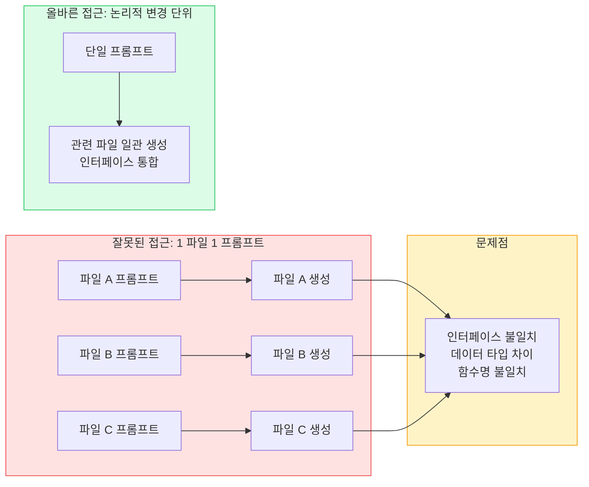
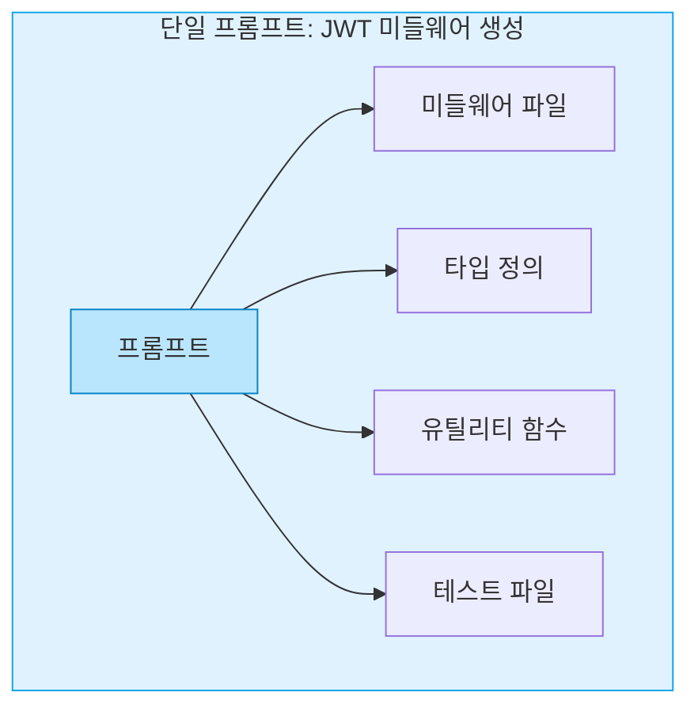
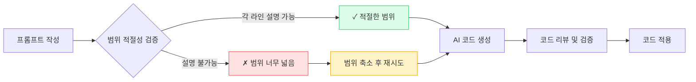
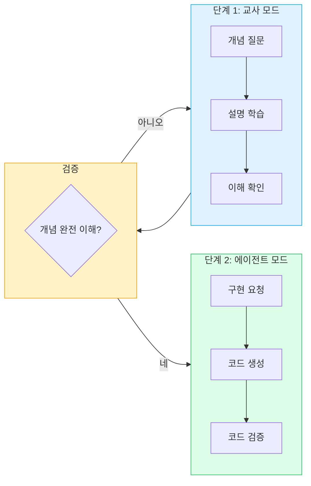
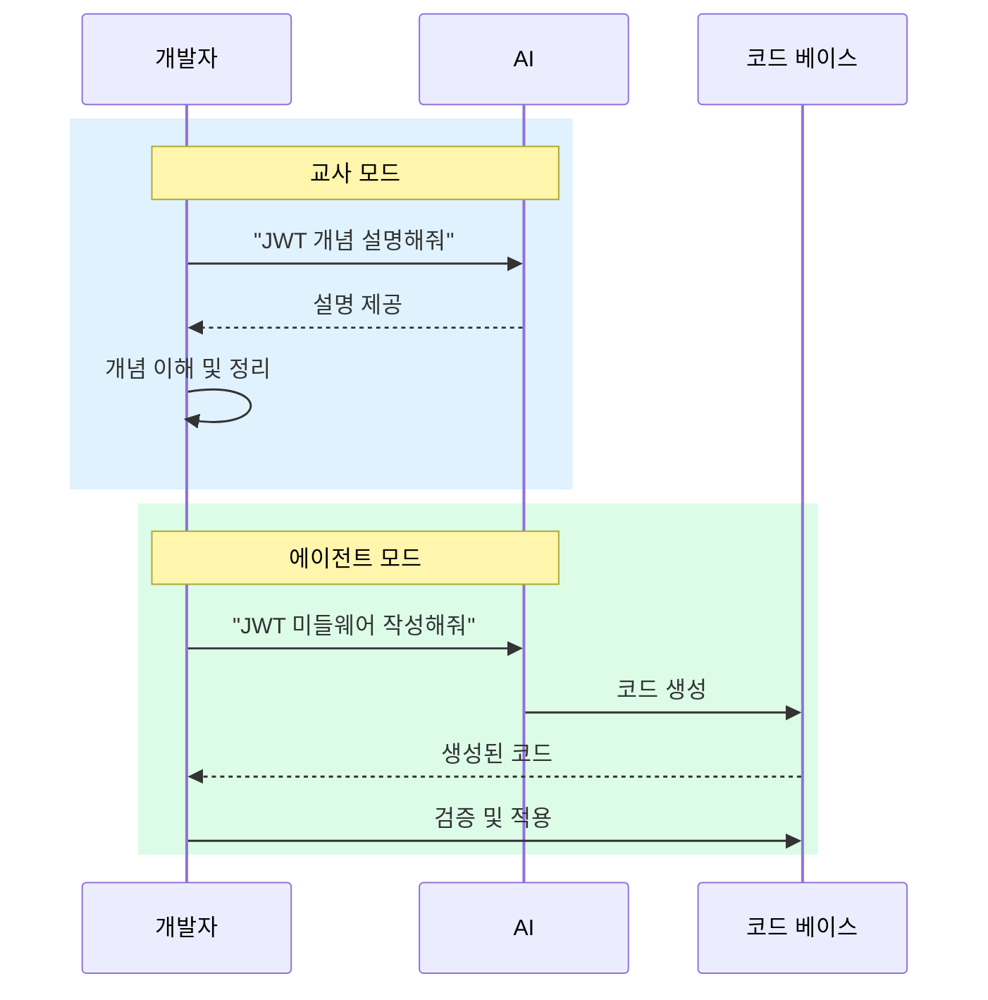
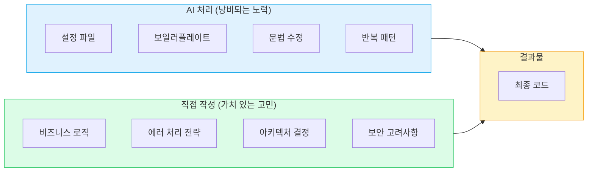
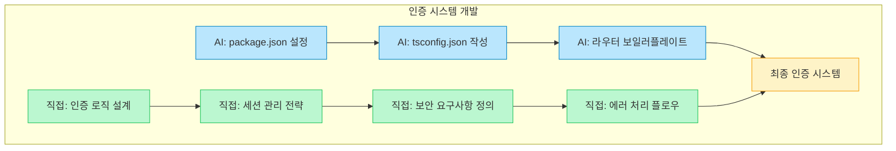
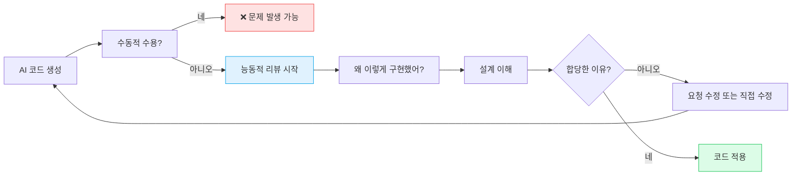
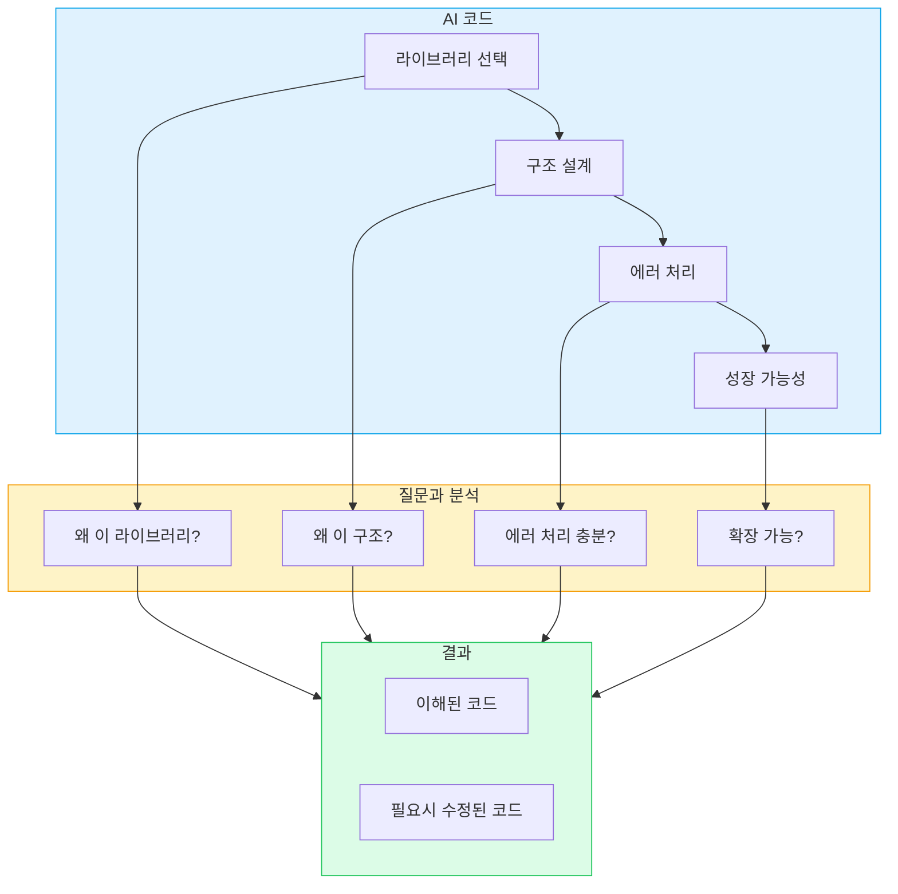
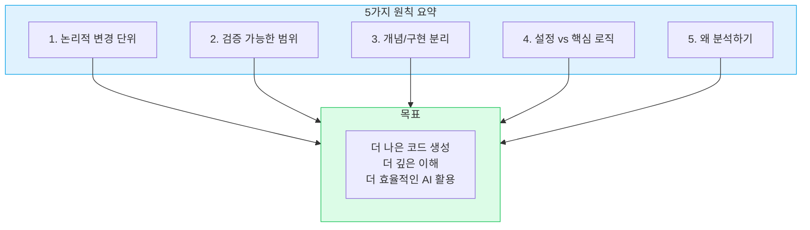

AI가 코드를 작성하는 시대에 개발자는 어떻게 프롬프트를 작성해야 할까요? 단순히 "이 코드 만들어줘"라고 요청하는 것으로는 충분하지 않습니다. 효과적인 AI 프롬프트 작성에는 명확한 원칙이 필요합니다. 이 글에서는 Clone Coder에서 소개하는 개발자를 위한 AI 프롬프트 작성 5가지 원칙을 정리합니다.

<!--more-->

## Sources

- https://www.clone-coder.com/blog/ai-prompt-tips-for-developers

## 개발자를 위한 AI 프롬프트 작성 5원칙

### 원칙 1: 프롬프트 단위는 논리적 변경, 파일이 아님

많은 개발자들이 "1 파일 = 1 프롬프트"라는 규칙을 따릅니다. 하지만 이 접근법은 문제가 있습니다. 각각의 파일마다 별도의 프롬프트를 작성하면, 파일 간 인터페이스가 일관되지 않을 수 있기 때문입니다.

대신 **하나의 논리적 변경 단위(logical change unit)** 를 기준으로 프롬프트를 범위화해야 합니다. 이는 좋은 git 커밋을 작성하는 원칙과 유사합니다.



하나의 프롬프트가 여러 파일에 걸쳐도 괜찮습니다. 중요한 것은 **하나의 목적을 공유하는가**입니다.

**예시:**
- ❌ "auth 파일 하나씩 만들어줘"
- ✅ "JWT 토큰 검증을 위한 Express 미들웨어를 만들어줘"

후자의 프롬프트는 관련된 파일들(미들웨어, 유틸리티, 타입 정의 등)을 하나의 논리적 변경으로 묶어서 생성하므로, 파일 간 일관성이 유지됩니다.



### 원칙 2: 검증 가능한 범위만 요청

프롬프트의 범위는 **당신이 이해하고 검증할 수 있는 수준**과 일치해야 합니다.

AI가 생성한 코드의 각 라인을 설명할 수 없다면, 프롬프트의 범위가 너무 넓은 것입니다.



검증 가능한 범위는 개발자의 경험 수준, 도메인 지식, 코드의 복잡도에 따라 달라집니다. 안전하게 작은 범위에서 시작하고, 익숙해지면 점진적으로 범위를 확장하세요.

**검증 체크리스트:**
- 생성된 각 함수의 역할을 설명할 수 있는가?
- 사용된 라이브러리의 의도를 이해하는가?
- 에러 처리 전략을 설명할 수 있는가?
- 보안 고려사항을 파악하는가?

### 원칙 3: 개념 질문과 구현 요청 분리

AI를 활용할 때 두 가지 모드를 구분해야 합니다.

**교사 모드(teacher mode):** 개념을 학습하고 이해하는 단계
**에이전트 모드(agent mode):** 구현 코드를 생성하는 단계

이 두 가지를 섞으면 안 됩니다. 먼저 개념을 충분히 이해한 후, 구현 요청을 해야 합니다.



**잘못된 예 (혼합 사용):**
```
"JWT가 뭔지 설명해주고, 동시에 JWT 인증 시스템 코드도 작성해줘"
```

**올바른 예 (분리 사용):**

먼저 개념 학습:
```
"JWT 인증의 개념과 작동 원리를 설명해줘"
```

개념 이해 후 구현 요청:
```
"방금 배운 JWT 인증 원리를 바탕으로, Express.js용 JWT 인증 미들웨어를 작성해줘"
```



### 원칙 4: AI에게 설정/문법 맡기고, 핵심 로직은 직접 작성

개발자의 시간을 낭비하는 작업과 가치 있는 고민을 해야 할 작업을 구분해야 합니다.

**AI에게 맡겨도 좋은 작업 (낭비되는 노력):**
- 설정 파일 작성
- 보일러플레이트 코드
- 문법 수정
- 스타일링
- 반복적인 패턴

**직접 작성해야 할 작업 (가치 있는 고민):**
- 비즈니스 로직 설계
- 에러 처리 전략
- 아키텍처 결정
- 보안 고려사항
- 사용자 경험 로직



**실제 적용 예시:**



이 분리의 핵심은 **AI는 도구로 활용하고, 개발자는 설계자로 남아있는 것**입니다. AI가 생성한 코드를 수동으로 수용하는 것이 아니라, 개발자의 의도와 전략을 AI가 구현하도록 유도해야 합니다.

### 원칙 5: 왜 이렇게 했는지 항상 분석하기

AI가 생성한 코드를 그대로 복사해서 붙여넣는 것은 수동적인 태도입니다. **능동적인 리뷰**를 통해 AI의 설계 선택을 이해하고 검증해야 합니다.



**질문 리스트:**
- "왜 이 라이브러리를 선택했어?"
- "왜 이 구조를 사용했어?"
- "이 에러 처리가 충분한가?"
- "이 코드의 성장 가능성은 어떻게?"



이 원칙을 통해 단순히 "생성된 코드"를 "이해한 코드"로 변환할 수 있습니다. AI를 블랙박스로 사용하는 것이 아니라, 협력자로 활용하는 것입니다.

---

## 핵심 요약

| 원칙 | 핵심 내용 |
|------|----------|
| 1. 논리적 변경 단위 | "1 파일 = 1 프롬프트" 대신 하나의 목적을 공유하는 논리적 변경 단위를 기준으로 범위화 |
| 2. 검증 가능한 범위 | 프롬프트 범위는 당신이 설명할 수 있는 수준과 일치해야 함 |
| 3. 개념/구현 분리 | 교사 모드(개념 학습)와 에이전트 모드(구현 요청)를 명확히 분리 |
| 4. 설정 vs 핵심 로직 | 설정/문법은 AI에게, 비즈니스 로직/아키텍처는 직접 작성 |
| 5. 왜 분석하기 | AI의 설계 선택을 질문하고 이해하여 코드를 수동 수용에서 능동적 검증으로 전환 |



---

## 결론

AI 프롬프트 작성은 단순한 기술이 아니라, AI와 효과적으로 협력하는 방법론입니다. 5가지 원칙을 통해 AI를 단순한 코드 생성 도구가 아니라, 개발자의 의도를 이해하고 구현하는 협력자로 활용할 수 있습니다.

기억하세요: AI가 생성한 코드는 출발점입니다. 당신의 분석, 이해, 그리고 의사결정을 거쳐 비로소 가치 있는 코드가 됩니다. AI와 함께 더 나은 코드를 작성하는 여정을 시작해보세요.
