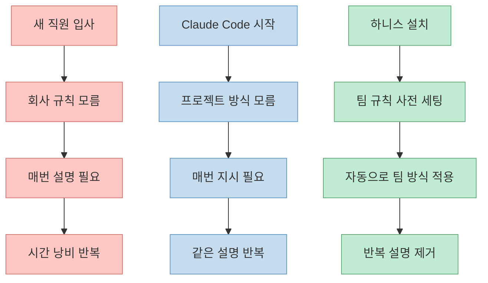
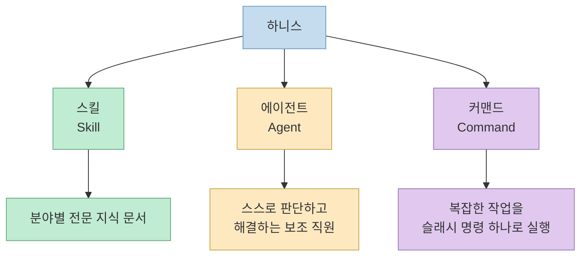
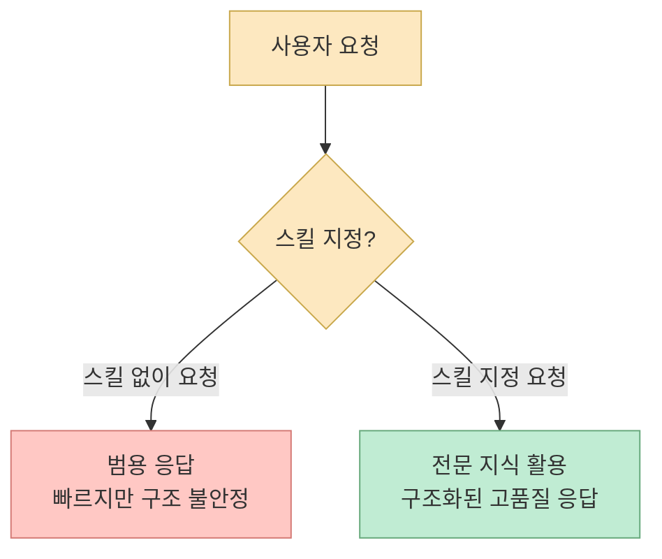
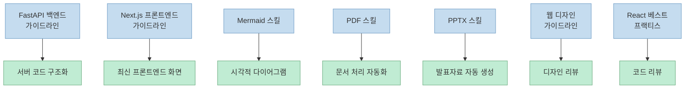
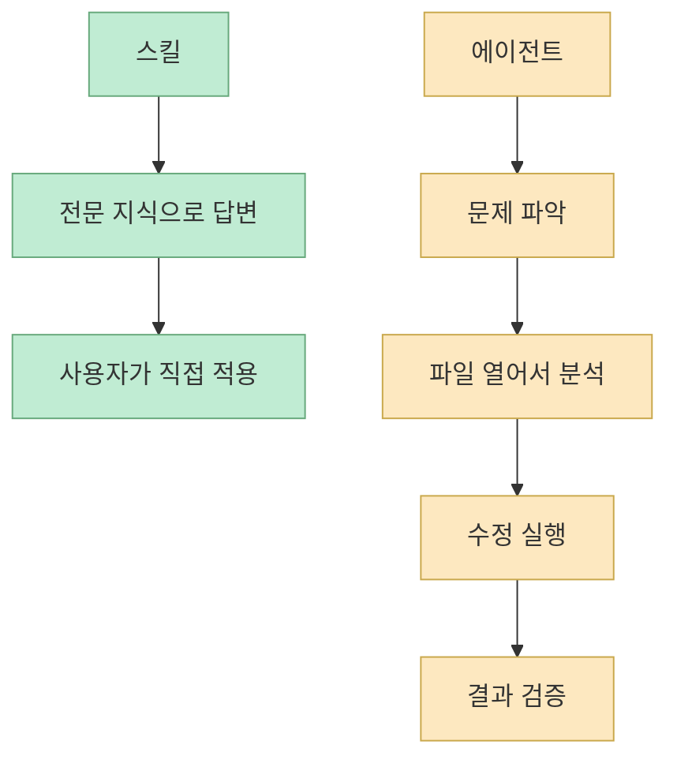
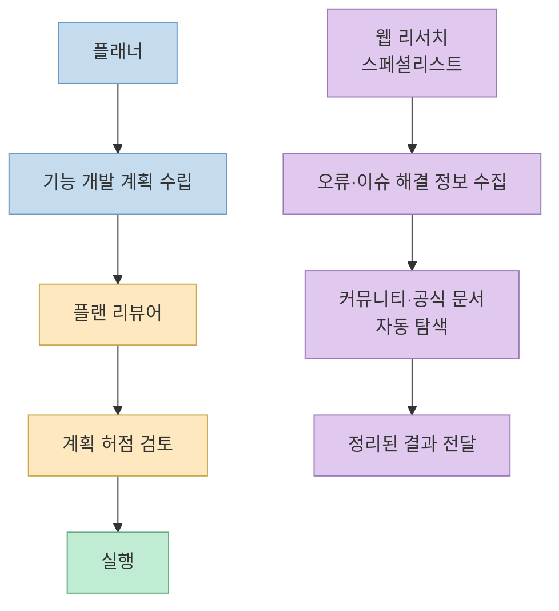
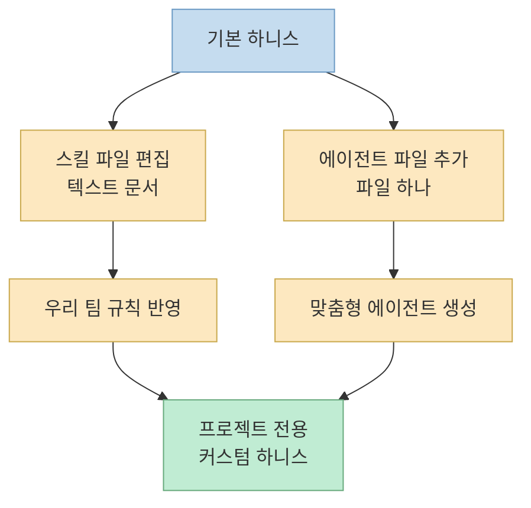

Claude Code는 범용 AI입니다. 무엇이든 할 수 있지만, 반대로 우리 프로젝트의 방식은 아무것도 모릅니다. **하니스** 는 이 문제를 해결합니다 — Claude Code에게 "우리 팀은 이렇게 일해"라고 미리 알려주는 보조 도구 체계입니다. 이 글에서는 메이커 에반의 하니스 공개 영상을 바탕으로, 하니스의 개념부터 스킬·에이전트·커맨드의 역할, 그리고 커스터마이징 방법까지 하나씩 정리합니다.

<!--more-->

## Sources

- [하니스 완전 공개 — Claude Code AI를 내 전담 직원으로 만드는 법](https://www.youtube.com/watch?v=8ExzWKXRLiM)

## 1. 하니스란 무엇인가

하니스를 이해하려면, 먼저 Claude Code가 가진 근본적인 한계를 알아야 합니다.

새 직원을 뽑았다고 생각해 보면 됩니다([영상 0:15](https://youtu.be/8ExzWKXRLiM?t=15)). 아무리 머리가 좋아도 첫날부터 알아서 일을 잘하지는 않습니다. "보고서는 이렇게 쓰고, 고객 응대는 이런 방식으로 하고, 이 상황에서는 이 사람한테 물어봐라"고 하나하나 알려줘야 합니다.

Claude Code도 똑같습니다. 기본적으로 무엇이든 할 수 있는 범용 AI이지만, 그 말은 반대로 **우리 프로젝트의 방식을 아무것도 모른다** 는 뜻이기도 합니다.

**하니스** 는 바로 이 문제를 해결합니다. Claude Code에게 "우리 팀은 이렇게 일해"를 미리 다 알려주는 시스템입니다. 한번 설치해 두면 매번 "우리 팀 방식대로 해 줘"라고 설명하지 않아도, 알아서 딱 맞게 작업해 줍니다.

핵심은 간단합니다. 하니스 = Claude Code를 **범용 AI가 아닌 우리 프로젝트 전담 전문가** 로 만드는 도구입니다.

## 2. 하니스의 3대 구성요소

하니스에서 알아야 할 것은 크게 세 가지입니다([영상 0:40](https://youtu.be/8ExzWKXRLiM?t=40)).

### 스킬 (Skill)

특정 분야의 전문 지식을 미리 담아둔 문서입니다. 일반 Claude가 동네 병원 의사라면, 스킬을 붙이면 **그 분야 전문의** 가 되는 것과 같습니다.

### 에이전트 (Agent)

"이거 해결해 줘"라고 하면, 혼자서 생각하고 → 관련 내용을 찾아보고 → 고치고 → 확인까지 다 해주는 전문 AI입니다. 시키면 알아서 끝까지 해주는 **보조 직원** 이라고 생각하면 됩니다.

### 커맨드 (Command)

자주 하는 복잡한 작업을 **슬래시 명령어 하나로 바로 실행** 하는 단축키입니다. 매크로 같은 것이라고 보면 됩니다.

## 3. 스킬 상세 — 7가지 전문 가이드북

스킬은 쉽게 말해서 Claude에게 주는 **분야별 전문 가이드북** 입니다([영상 1:08](https://youtu.be/8ExzWKXRLiM?t=68)). 사용 방법도 간단합니다 — Claude에게 말할 때 앞에 슬래시로 스킬 이름을 붙여주면 됩니다.

예를 들어 그냥 "회원 가입 만들어 줘"라고 하는 대신: `/fastapi-backend-guideline 회원 가입 만들어 줘`

이렇게 하면 Claude가 그 스킬에 담긴 전문 지식을 활용해서 응답합니다.

### 3-1. FastAPI 백엔드 가이드라인

서버 쪽 코드를 짤 때 쓰는 스킬입니다([영상 1:25](https://youtu.be/8ExzWKXRLiM?t=85)).

스킬 없이 그냥 물어보면 Claude가 빠르게 동작하는 코드를 만들어 주긴 합니다. 하지만 나중에 기능이 늘어나면 코드가 엉망이 되는 경우가 많습니다.

스킬이 있으면 달라집니다. 처음부터 **역할별로 깔끔하게 나눠서** 만들어 줍니다. 나중에 수정하기도 쉽고, 다른 사람이 봐도 이해하기 쉬운 코드가 나옵니다.

> 마치 서랍장에 물건을 대충 던져 넣는 것과, 양말은 양말칸·셔츠는 셔츠칸으로 정리하는 것의 차이입니다.

### 3-2. Next.js 프론트엔드 가이드라인

웹사이트 화면을 만들 때 쓰는 스킬입니다([영상 1:50](https://youtu.be/8ExzWKXRLiM?t=110)).

"로그인 화면 만들어 줘"라고 하면, 그냥 단순한 화면이 아니라 **최신 방식에 맞게 속도 빠르고 구조도 올바른 화면** 으로 만들어 줍니다. 최근 웹 개발 기술이 빠르게 바뀌면서 어떤 방식이 맞는 방식인지 헷갈리는 경우가 많은데, 이 스킬이 있으면 Claude가 알아서 올바른 방식으로 판단해 줍니다.

### 3-3. Mermaid 스킬

복잡한 내용을 그림으로 설명해야 할 때 쓰는 스킬입니다([영상 2:05](https://youtu.be/8ExzWKXRLiM?t=125)).

- "기능 흐름도 그려 줘" → 화살표 연결도
- "데이터 관계 보여 줘" → 관계도
- "서비스 구조 설명해 줘" → 구조도

글로만 설명하면 이해하기 어려운 내용을 시각적으로 보여줄 수 있어서, 팀원들한테 설명할 때 특히 유용합니다. Notion이나 GitHub에 붙여 넣으면 바로 그림으로 렌더링됩니다.

### 3-4. PDF 스킬

PDF 파일 관련 작업을 모두 할 수 있습니다([영상 2:25](https://youtu.be/8ExzWKXRLiM?t=145)).

- 글자 뽑아내기 (텍스트 추출)
- 페이지 쪼개기
- 여러 PDF 합치기
- 스캔 문서에서 글씨 인식하기 (OCR)

### 3-5. PPTX 스킬

보고서나 제안서를 반복적으로 만들어야 할 때 특히 효과적입니다([영상 2:35](https://youtu.be/8ExzWKXRLiM?t=155)). "이 내용으로 발표자료 만들어 줘"라고 하면, 코드로 PPT를 자동 생성해 줍니다.

### 3-6. 웹 디자인 가이드라인

화면을 다 만들고 나서 "디자인 리뷰해 줘"라고 하면([영상 2:50](https://youtu.be/8ExzWKXRLiM?t=170)):

- 색상 대비가 적절한지
- 여백은 충분한지

체크해 줍니다. 혼자 개발하다 보면 디자인 퀄리티를 검토해 줄 사람이 없는데, 이 스킬이 **디자인 리뷰어** 역할을 합니다.

### 3-7. React 베스트 프랙티스

React 코드를 리뷰하는 **코드 리뷰어** 역할을 합니다. 위의 웹 디자인 가이드라인과 함께 사용하면 디자인 + 코드 양쪽의 품질을 모두 검토할 수 있습니다.

## 4. 에이전트 상세 — 알아서 일하는 보조 직원

에이전트는 스킬과 근본적으로 다릅니다([영상 3:05](https://youtu.be/8ExzWKXRLiM?t=185)).

- **스킬** = "이 분야 전문 지식으로 답해 줘"
- **에이전트** = "이 문제 스스로 해결해 줘"

에이전트는 혼자서 관련 파일을 열어서 읽고 → 뭐가 문제인지 파악하고 → 고치고 → 제대로 됐는지까지 확인합니다. 중간에 사람한테 물어보지 않아도 됩니다.

### 4-1. 플래너 에이전트

새 기능을 만들기 전에 **계획 자체를 짜는** 역할입니다([영상 3:20](https://youtu.be/8ExzWKXRLiM?t=200)).

"사용자 기능 만들고 싶어"라고 하면:

- 어떤 파일을 어떤 순서로 만들어야 하는지
- 어디서 어디로 연결되는지
- 예상되는 위험 요소는 뭔지

까지 단계별로 정리해 줍니다. 이걸 보고 나서 시작하면, 중간에 방향이 흔들리는 일이 훨씬 줄어듭니다.

### 4-2. 플랜 리뷰 에이전트

플래너가 계획을 짜면, 플랜 리뷰어가 **그 계획을 검토** 합니다([영상 3:40](https://youtu.be/8ExzWKXRLiM?t=220)).

"이 계획 리뷰해 줘"라고 하면:

- 빠진 부분은 없는지
- 보안 문제는 없는지
- 나중에 문제될 게 없는지

하나하나 짚어줍니다. 혼자 짠 계획의 허점을 잡아주는 역할입니다. 계획이 부실하면 나중에 전부 뜯어고쳐야 하는 상황이 생기기 때문에, 이 검토 단계가 중요합니다.

### 4-3. 웹 리서치 스페셜리스트 에이전트

개발하다 막히는 부분이 생겼을 때 씁니다([영상 4:00](https://youtu.be/8ExzWKXRLiM?t=240)).

"이 오류 해결 방법 찾아줘"라고 하면:

- 개발자 커뮤니티
- Q&A 사이트
- 공식 이슈 게시판

같은 곳을 직접 돌아다니면서 관련 정보를 모아서 정리해 줍니다. 구글 검색을 대신 해주는 에이전트라고 보면 되는데, 여러 곳을 동시에 찾아보고 결과를 정리해서 가져오니까 직접 찾는 것보다 훨씬 빠르고 편합니다.

## 5. 커스터마이징 — 내 상황에 맞게 바꾸기

하니스를 그대로 써도 좋지만, **내 상황에 맞게 바꾸면 훨씬 강력** 합니다([영상 4:20](https://youtu.be/8ExzWKXRLiM?t=260)).

### 스킬 커스터마이징

우리 회사만의 규칙이 있다면, 스킬 파일을 열어서 **우리 팀 규칙을 추가** 하면 됩니다. 일반 텍스트 문서라 편집하기 쉽습니다.

### 에이전트 직접 생성

에이전트도 직접 만들 수 있습니다. 파일 하나만 추가하면 됩니다. 예를 들어:

- 우리 회사 방식으로 코드 검토를 해주는 에이전트
- 우리 서비스 특성에 맞는 디버거

같은 것도 만들 수 있습니다.

## 핵심 요약

| 구성요소 | 역할 | 핵심 비유 |
|---------|------|----------|
| **스킬** | 분야별 전문 지식 문서 | 동네 병원 의사 → 분야 전문의 |
| **에이전트** | 스스로 문제를 해결하는 AI | 지시하면 끝까지 해주는 보조 직원 |
| **커맨드** | 복잡한 작업의 슬래시 단축키 | 매크로 |

**주요 스킬 7가지:**
- FastAPI 백엔드 가이드라인 — 역할별 구조화된 서버 코드
- Next.js 프론트엔드 가이드라인 — 최신 방식의 올바른 화면 구조
- Mermaid — 흐름도·관계도·구조도 자동 생성
- PDF — 텍스트 추출·분할·합치기·OCR
- PPTX — 발표자료 자동 생성
- 웹 디자인 가이드라인 — 디자인 리뷰
- React 베스트 프랙티스 — 코드 리뷰

**주요 에이전트 3가지:**
- 플래너 — 기능 개발 전 계획 수립
- 플랜 리뷰어 — 계획의 허점 검토
- 웹 리서치 스페셜리스트 — 개발 오류·이슈 관련 정보 자동 수집

## 결론

Claude Code 하니스를 한 줄로 정리하면 이렇습니다([영상 4:40](https://youtu.be/8ExzWKXRLiM?t=280)): **Claude Code를 범용 AI가 아닌, 우리 프로젝트 전담 전문가로 만드는 도구** 입니다.

처음에는 설치하는 게 조금 번거롭게 느껴질 수 있습니다. 하지만 한번 해두면 그 이후에는 같은 설명을 반복하지 않아도 되고, 매번 일관된 결과물이 나와서 **장기적으로 시간이 훨씬 절약** 됩니다.

스킬 파일은 일반 텍스트 문서라 편집이 쉽고, 에이전트도 파일 하나로 만들 수 있으니, 기본 하니스를 설치한 뒤 자신의 프로젝트에 맞게 커스터마이징하는 것을 권장합니다.
