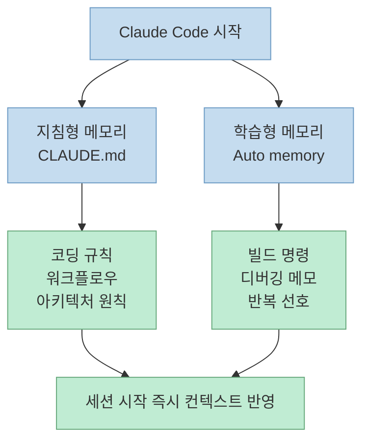
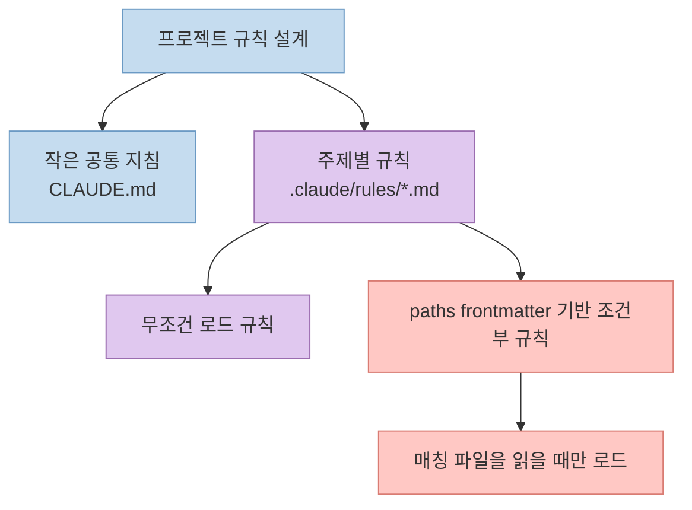
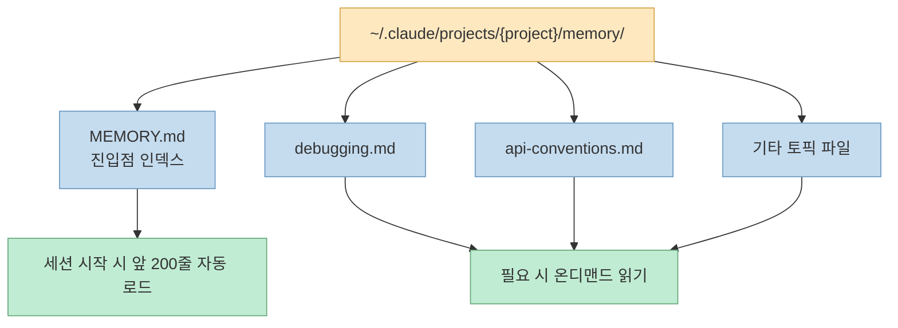
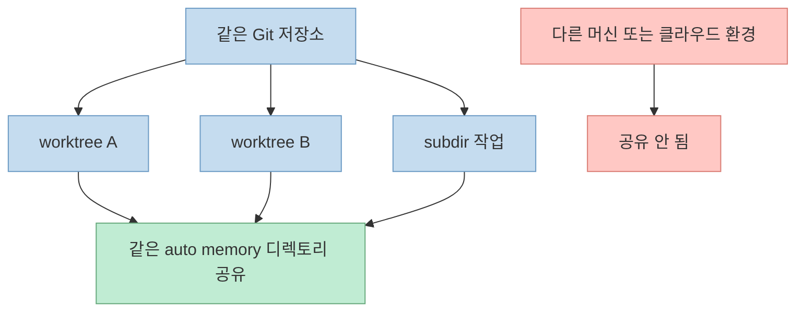

Claude Code의 메모리는 단순히 "대화를 기억한다" 수준이 아닙니다.<br>공식 문서 기준으로 보면 Claude Code는 **사람이 적는 지침형 메모리** 와 **Claude가 스스로 축적하는 자동 메모리** 를 분리해서 운영합니다.<br>이 글에서는 `CLAUDE.md`, `.claude/rules/`, `Auto memory`, `/memory` 명령까지 하나의 운영 체계로 연결해서 정리합니다.

<!--more-->

## Sources

- https://code.claude.com/docs/en/memory

## 1. Claude Code 메모리는 왜 두 종류로 나뉘는가

공식 문서의 출발점은 분명합니다.<br>Claude Code 세션은 매번 새로운 컨텍스트 윈도우로 시작하고, 그 공백을 메우는 방식이 두 가지라는 점입니다.

- `CLAUDE.md`: 사용자가 직접 쓰는 지속 지침
- Auto memory: Claude가 작업하면서 스스로 남기는 학습 노트

이 둘은 비슷해 보이지만 목적이 다릅니다.

- **`CLAUDE.md`** 는 "이 프로젝트에서 어떻게 행동해야 하는가"를 정하는 쪽에 가깝습니다.
- **Auto memory** 는 "이 프로젝트에서 일하다 보니 앞으로도 기억해 두면 좋은 사실"을 축적하는 쪽에 가깝습니다.

공식 비교표를 실무적으로 다시 해석하면 아래처럼 볼 수 있습니다.



중요한 포인트는 Claude가 둘 다 **"강제 설정"이 아니라 컨텍스트로 취급한다** 는 점입니다.<br>즉 설정 파일처럼 100% 기계적으로 집행되는 것이 아니라, 더 구체적이고 더 간결할수록 잘 따라갑니다.<br>그래서 Memory 설계에서 가장 중요한 원칙은 "많이 적는 것"이 아니라 **충돌 없이 짧고 검증 가능하게 적는 것** 입니다.

## 2. `CLAUDE.md`는 어디에 두고, 어떤 우선순위로 읽히는가

공식 문서는 `CLAUDE.md`를 여러 레벨에 둘 수 있다고 설명합니다.

- 조직 관리 정책: OS별 시스템 경로
- 프로젝트 지침: `./CLAUDE.md` 또는 `./.claude/CLAUDE.md`
- 사용자 지침: `~/.claude/CLAUDE.md`

핵심은 **더 구체적인 위치가 더 넓은 범위보다 우선한다** 는 점입니다.<br>예를 들어 개인 선호보다 프로젝트 규칙이 더 중요하고, 특정 하위 디렉토리의 규칙은 더 좁은 범위에서 더 강하게 작동합니다.


로드 방식도 실무적으로 꽤 중요합니다.

- 현재 작업 디렉토리에서 상위 디렉토리 방향으로 올라가며 `CLAUDE.md`를 찾습니다.
- 상위 경로의 `CLAUDE.md`는 세션 시작 시 로드됩니다.
- 현재 작업 디렉토리 아래에 있는 하위 디렉토리의 `CLAUDE.md`는 처음부터 다 읽지 않고, Claude가 그 경로의 파일을 실제로 읽을 때 로드됩니다.

이 구조 덕분에 대형 저장소에서도 모든 규칙을 한 번에 밀어 넣지 않고, 필요한 규칙만 늦게 불러오는 방식이 가능합니다.<br>문서가 `claudeMdExcludes` 설정을 별도로 설명하는 이유도 여기에 있습니다.<br>모노레포처럼 범위가 넓은 환경에서는 다른 팀의 `CLAUDE.md`까지 따라 들어오는 것을 막아야 할 때가 있기 때문입니다.

## 3. 큰 프로젝트에서는 `.claude/rules/`를 어떻게 써야 하나

문서가 `CLAUDE.md`만 강조하는 것처럼 보일 수 있지만, 실제 운영에서는 `.claude/rules/`가 더 중요해지는 구간이 빠르게 옵니다.<br>`CLAUDE.md` 하나에 모든 규칙을 넣기 시작하면 파일이 길어지고, 그만큼 컨텍스트 비용과 지시 일관성 문제가 같이 커지기 때문입니다.

공식 문서가 제안하는 해법은 두 가지입니다.

1. `@path/to/file` 형태로 추가 파일을 import하기
2. `.claude/rules/` 아래에 주제별 규칙 파일을 분리하기

특히 `.claude/rules/`의 장점은 **경로별로 규칙을 스코프할 수 있다** 는 점입니다.<br>예를 들어 `src/api/**/*.ts`에만 적용되는 API 규칙, `tests/**/*.ts`에만 적용되는 테스트 규칙을 따로 둘 수 있습니다.



이 패턴이 중요한 이유는 분명합니다.

- 공통 규칙은 항상 읽히게 유지할 수 있습니다.
- 세부 규칙은 필요한 파일에만 묶어서 컨텍스트 낭비를 줄일 수 있습니다.
- 팀 단위로 규칙 파일을 나누고 관리하기 쉬워집니다.

문서는 rules 디렉토리가 재귀적으로 탐색된다고 설명합니다.<br>즉 `frontend/`, `backend/`, `security/`처럼 서브디렉토리 구조를 잡아도 됩니다.<br>또한 symlink도 지원하므로 여러 프로젝트에 공통 규칙 묶음을 재사용하는 방식도 가능합니다.

## 4. Auto memory는 무엇을 저장하고, 어디에 쌓이는가

Auto memory는 사용자가 직접 작성하는 파일이 아니라 Claude가 세션 중에 스스로 축적하는 메모리입니다.<br>공식 문서는 여기서 중요한 경계선을 하나 명확히 긋습니다.<br>Claude는 **매 세션마다 반드시 저장하는 것이 아니라**, 미래 대화에 유용할 만한 정보만 골라서 저장합니다.

문서가 예시로 든 항목들은 아래와 같습니다.

- 빌드 명령
- 디버깅 인사이트
- 아키텍처 메모
- 코드 스타일 선호
- 반복적으로 드러난 워크플로우 습관

저장 위치는 `~/.claude/projects/<project>/memory/` 입니다.<br>그리고 이 메모리 디렉토리 구조는 아래처럼 구성됩니다.



여기서 실무적으로 특히 중요하게 봐야 할 문장들은 세 가지입니다.

첫째, **세션 시작 시 자동으로 로드되는 것은 `MEMORY.md`의 앞 200줄뿐** 입니다.<br>이 말은 `MEMORY.md`를 인덱스처럼 짧게 유지하고, 자세한 내용은 토픽 파일로 밀어내는 운영이 필요하다는 뜻입니다.

둘째, **토픽 파일은 시작할 때 자동 로드되지 않습니다**.<br>Claude가 필요할 때 일반 파일 읽기 도구처럼 읽어 옵니다.<br>즉 Auto memory도 사실상 "요약 인덱스 + 상세 문서" 구조입니다.

셋째, **Auto memory는 machine-local** 입니다.<br>문서 기준으로 이 메모리는 다른 머신이나 클라우드 환경과 자동 동기화되지 않습니다.<br>그래서 개인 노트북과 원격 개발 환경이 분리되어 있다면 동일한 기억을 공유한다고 가정하면 안 됩니다.

## 5. Auto memory의 경계: 무엇이 공유되고 무엇이 공유되지 않는가

이 문서에서 혼동하기 쉬운 부분은 "프로젝트별 메모리"와 "작업 디렉토리별 메모리"를 어떻게 이해해야 하느냐입니다.<br>문서 기준으로 Auto memory 디렉토리는 git repository를 기준으로 파생됩니다.<br>그래서 **같은 저장소 안의 worktree와 하위 디렉토리는 같은 auto memory 디렉토리를 공유** 합니다.

즉 다음처럼 해석하는 것이 맞습니다.

- 같은 git repo 안의 여러 worktree: 공유
- 같은 repo 아래 하위 디렉토리: 공유
- git repo 밖의 별도 프로젝트 루트: 별도 메모리
- 다른 머신: 공유되지 않음



이 차이는 운영 관점에서 꽤 큽니다.<br>예를 들어 로컬 worktree를 여러 개 써서 병렬 작업을 한다면 메모리도 함께 누적된다고 기대할 수 있습니다.<br>반대로 ephemeral container나 별도 원격 머신에서 실행하는 경우에는 같은 프로젝트라도 메모리가 이어지지 않을 수 있습니다.

또 문서는 subagent도 별도의 auto memory를 유지할 수 있다고 짧게 언급합니다.<br>즉 메인 에이전트와 서브에이전트가 메모리를 완전히 동일하게 공유한다고 단정하면 안 되고, 해당 기능을 별도로 설정하고 이해해야 합니다.

## 6. `/memory`, 설정 토글, 환경 변수는 어떻게 역할이 갈리는가

공식 문서는 메모리 관리 인터페이스를 세 층으로 설명합니다.

- `/memory` 명령
- `autoMemoryEnabled` 설정
- `CLAUDE_CODE_DISABLE_AUTO_MEMORY=1` 환경 변수

이 셋은 같은 기능처럼 보여도 운영 레벨이 다릅니다.

### `/memory` 명령의 역할

`/memory`는 현재 세션에서 로드된 `CLAUDE.md` 및 rules 파일 목록을 보여주고, auto memory on/off 토글과 auto memory 폴더 열기까지 제공합니다.<br>즉 단순 편집기가 아니라 **현재 어떤 메모리 레이어가 작동 중인지 점검하는 진입점** 입니다.

또 사용자가 "pnpm만 써라", "이 API 테스트는 Redis가 필요하다" 같은 내용을 기억하라고 요청하면 Claude는 이를 auto memory에 저장할 수 있고, 반대로 `CLAUDE.md`에 들어가야 하는 규칙은 명시적으로 "add this to CLAUDE.md"처럼 지시해야 한다고 문서는 설명합니다.

### 설정 파일과 환경 변수의 역할

설정 파일에서는 아래처럼 `autoMemoryEnabled`를 켜고 끌 수 있습니다.

```json
{
  "autoMemoryEnabled": false
}
```

환경 변수는 더 강한 레벨의 제어 수단입니다.

```bash
CLAUDE_CODE_DISABLE_AUTO_MEMORY=1
```

문서상 의미는 명확합니다.<br>자동 메모리를 잠깐 끄고 싶을 때는 세션 인터페이스나 설정이 유용하지만, 특정 실행 환경에서 확실히 차단해야 할 때는 환경 변수가 더 직접적인 스위치가 됩니다.

## 7. 문서가 권장하는 좋은 `CLAUDE.md` 작성법

이 페이지의 실전 가치가 가장 큰 부분은 사실 기능 소개보다도 **좋은 지침을 쓰는 법** 입니다.<br>문서는 `CLAUDE.md`가 설정이 아니라 컨텍스트이므로, 글쓰기 방식 자체가 성능에 영향을 준다고 설명합니다.

핵심 원칙은 아래 네 가지로 압축할 수 있습니다.

1. **짧게 유지하기**: 목표 크기는 200줄 이하
2. **구조화하기**: 헤더와 불릿으로 섹션을 나누기
3. **구체적으로 쓰기**: "잘 포맷하라" 대신 "2-space indentation"
4. **충돌 제거하기**: 상충하는 규칙을 주기적으로 정리하기

이 원칙은 단순한 문서 미학이 아니라 실제 동작 품질과 직결됩니다.<br>길고 추상적인 `CLAUDE.md`는 컨텍스트만 많이 먹고, 실제 행동 지침으로는 약해집니다.<br>반면 짧고 측정 가능한 문장은 Claude가 더 안정적으로 따르기 쉽습니다.

문서가 import 기능과 `.claude/rules/`를 같이 설명하는 이유도 이 때문입니다.<br>무조건 파일을 하나로 키우지 말고, 상시 필요한 지침과 조건부 지침을 분리하라는 뜻입니다.

## 실전 적용 포인트 / 핵심 요약

- Claude Code 메모리는 `CLAUDE.md`와 Auto memory의 이중 구조다.
- `CLAUDE.md`는 사람이 쓰는 지침이고, Auto memory는 Claude가 쌓는 학습 노트다.
- 큰 프로젝트에서는 `.claude/rules/`와 `paths` frontmatter로 규칙을 쪼개는 것이 효율적이다.
- Auto memory는 `~/.claude/projects/<project>/memory/`에 저장되며, `MEMORY.md` 앞 200줄만 세션 시작 시 자동 로드된다.
- 같은 git repo의 worktree와 하위 디렉토리는 메모리를 공유하지만, 다른 머신과 클라우드 환경까지 자동 공유되지는 않는다.
- `/memory`, 설정 파일, 환경 변수는 각각 점검 UI, 일반 토글, 강제 차단 스위치 역할을 가진다.

공식 문서를 실제 운영 원칙으로 번역하면 아래처럼 정리할 수 있습니다.

1. 프로젝트 루트의 `CLAUDE.md`에는 항상 필요한 최소 공통 규칙만 둡니다.
2. 세부 규칙은 `.claude/rules/`로 분리하고, 가능하면 `paths`를 써서 조건부 로드로 바꿉니다.
3. Auto memory의 `MEMORY.md`는 인덱스처럼 짧게 유지하고, 긴 메모는 토픽 파일로 내립니다.
4. 메모리가 "적용 안 된다"고 느껴질 때는 먼저 `/memory`로 실제 로드 상태를 확인합니다.
5. 개인 선호와 팀 규칙을 같은 파일에 섞기보다, 사용자 레벨과 프로젝트 레벨을 분리해서 충돌을 줄입니다.
6. 원격 환경이나 다른 머신에서 동일한 기억을 기대한다면, Auto memory가 아니라 버전 관리되는 `CLAUDE.md` 계열에 넣어야 합니다.

## 결론

Claude Code의 Memory는 "무엇이든 오래 기억하는 기능"이 아니라, **지침은 `CLAUDE.md` 계층으로 관리하고, 학습은 Auto memory로 축적하는 운영 시스템** 에 가깝습니다.<br>공식 문서를 그대로 따라가면 좋은 기본 원칙은 분명합니다.<br>상시 규칙은 짧고 명확하게, 조건부 규칙은 `.claude/rules/`로 분리하고, 반복적으로 드러나는 작업 지식은 Auto memory가 맡게 하는 구조가 가장 안정적입니다.
