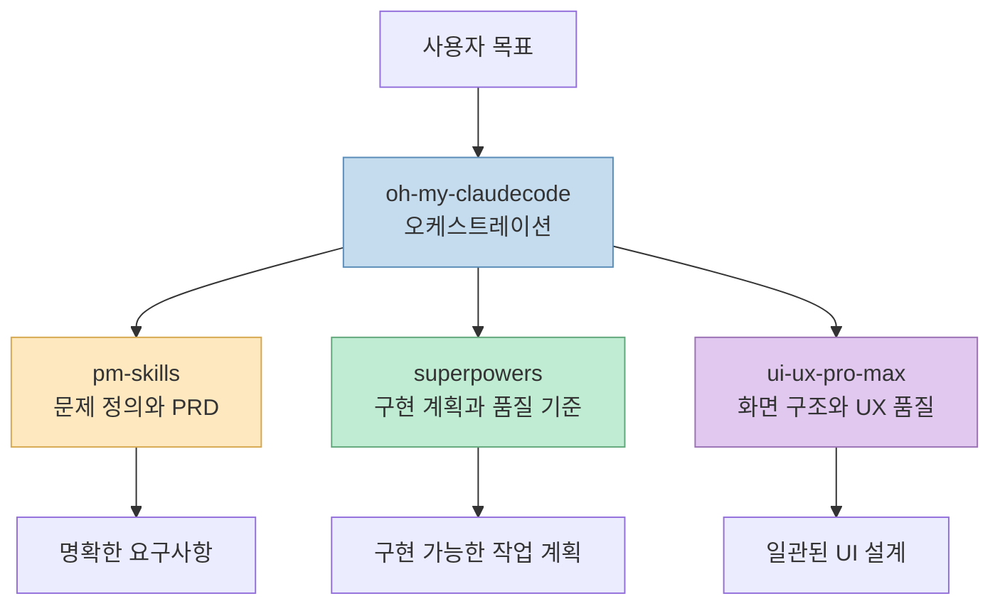
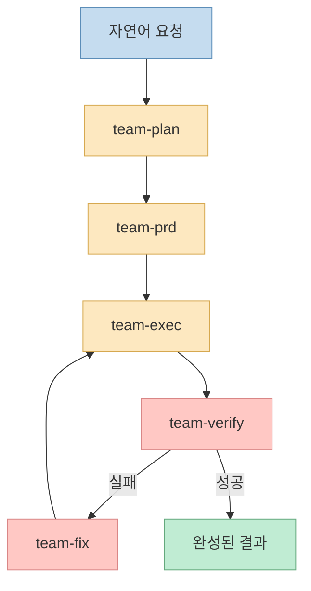
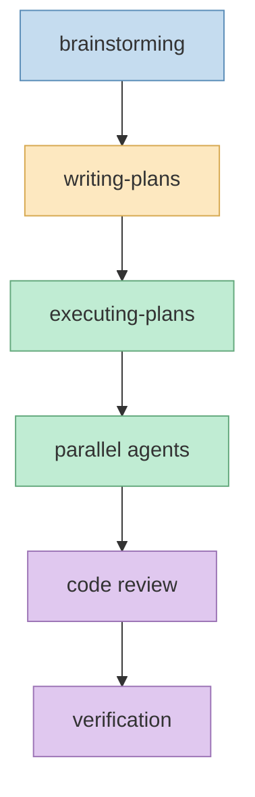
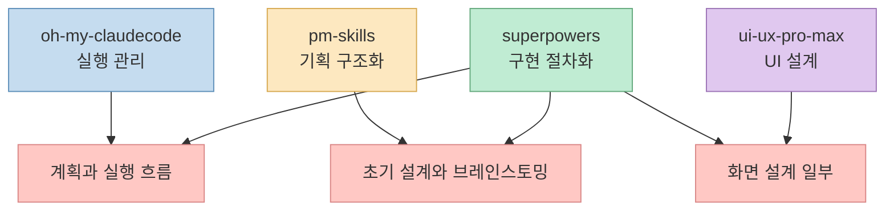
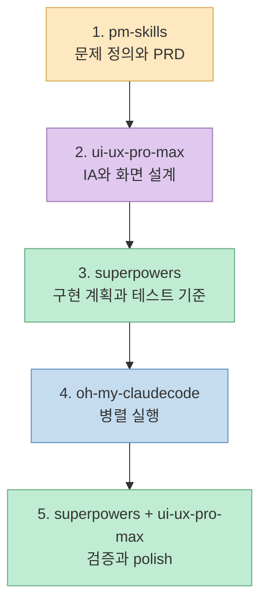

Claude Code에서 **oh-my-claudecode**, **pm-skills**, **superpowers**, **ui-ux-pro-max-skill** 을 같이 보면, 같은 종류의 도구 4개라기보다 서로 다른 층을 맡는 조합으로 이해하는 편이 훨씬 쉽습니다. 핵심은 "무엇이 더 좋은가"보다 "누가 어느 단계에서 책임을 지는가"를 분리해서 보는 것입니다.

<!--more-->

## Sources

- [GitHub - Yeachan-Heo/oh-my-claudecode](https://github.com/Yeachan-Heo/oh-my-claudecode)
- [GitHub - phuryn/pm-skills](https://github.com/phuryn/pm-skills)
- [GitHub - obra/superpowers](https://github.com/obra/superpowers)
- [GitHub - nextlevelbuilder/ui-ux-pro-max-skill](https://github.com/nextlevelbuilder/ui-ux-pro-max-skill)

## 먼저 한 장으로 보면

이 4개를 가장 쉽게 이해하는 방법은 "수평 비교"가 아니라 "작업 층위"로 보는 것입니다.



한 문장으로 줄이면 이렇습니다.

> **oh-my-claudecode** 가 전체 진행을 지휘하고, **pm-skills** 가 무엇을 만들지 정리하고, **superpowers** 가 어떻게 구현하고 검증할지 정하고, **ui-ux-pro-max** 가 화면 품질을 책임지는 조합입니다.

## 각각 무엇을 맡는가

### oh-my-claudecode: 상위 오케스트레이터

oh-my-claudecode는 Claude Code 위에서 여러 에이전트와 실행 단계를 굴리는 **상위 조정 레이어**에 가깝습니다. 핵심 가치는 특정 분야의 전문 지식 자체보다, 큰 작업을 쪼개고 적절한 역할에 할당하고 검증 루프를 돌리는 데 있습니다.

쉽게 말하면 다음과 같은 질문을 대신 맡습니다.

- 이 작업을 몇 단계로 나눌까
- 어떤 에이전트를 붙일까
- 병렬 실행이 가능한가
- 검증 실패 시 어디로 되돌릴까



따라서 OMC는 "똑똑한 구현 스킬"이라기보다, **다른 스킬과 워크플로우를 조직적으로 묶어 주는 운영 계층**으로 보는 편이 맞습니다.

### pm-skills: 기획 두뇌

pm-skills는 제품 기획과 운영에 필요한 프레임워크를 구조화해 둔 도구입니다. discovery, strategy, execution, launch, growth를 따라가며 아이디어를 PRD, 우선순위, 실험, 지표 같은 산출물로 바꾸는 데 강합니다.

즉 pm-skills가 잘하는 것은 다음과 같습니다.

| 질문 | pm-skills가 잘하는 일 |
|------|------------------------|
| 무엇을 만들어야 하지? | 문제 정의, 사용자, 가설 정리 |
| 무엇부터 해야 하지? | 우선순위와 MVP 범위 설정 |
| 이걸 문서로 남기려면? | PRD, GTM, 메트릭 설계 |

핵심은 코드를 더 잘 짜게 만드는 것이 아니라, **애초에 무엇을 왜 만들지 흔들리지 않게 정리하는 것**입니다.

### superpowers: 개발 방법론과 엔지니어링 운영체계

superpowers는 브레인스토밍, 계획 작성, 병렬 작업, 코드 리뷰, 검증 흐름을 강제하는 **범용 엔지니어링 프레임워크**에 가깝습니다. pm-skills가 제품 기획에 강하다면, superpowers는 설계를 구현 가능한 작업 단위로 바꾸고 품질 기준을 세우는 데 강합니다.



정리하면 superpowers는 다음 영역에서 빛납니다.

- 설계에서 구현 계획으로 넘어가는 구간
- 작업을 잘게 쪼개는 구간
- 테스트와 검증 기준을 넣는 구간
- 병렬 작업 후 리뷰를 거는 구간

### ui-ux-pro-max: UI/UX 특화 스킬

ui-ux-pro-max는 이름 그대로 화면 설계와 UX 품질을 끌어올리는 **도메인 특화 스킬**입니다. 정보 구조, 레이아웃, 컴포넌트 계층, 상태별 UI, 디자인 시스템 같은 질문에서 특히 강합니다.

즉 이 스킬은 일반적인 개발 방법론을 다루기보다, 다음을 더 잘 만듭니다.

- 어떤 화면이 필요한가
- 각 화면의 핵심 컴포넌트는 무엇인가
- 빈 상태, 오류 상태, 모바일 상태를 어떻게 보일까
- 디자인 톤과 시각적 위계를 어떻게 잡을까

그래서 ui-ux-pro-max는 superpowers와 겹쳐 보일 수 있어도 실제론 **설계의 범위가 더 시각적이고 더 구체적**입니다.

## 어디서 겹치고, 어디서 충돌할까

문제는 이 4개가 모두 "더 잘 일하게 만드는 도구"처럼 보인다는 점입니다. 하지만 실제 겹침은 일부 구간에만 집중됩니다.



대표적인 중복 지점은 세 군데입니다.

### 1. OMC vs superpowers

둘 다 계획, 병렬 실행, 리뷰, 검증을 이야기합니다. 하지만 결이 다릅니다.

- **OMC** 는 누가 무엇을 언제 할지 관리합니다.
- **superpowers** 는 어떻게 설계하고 구현하고 검증할지 규율을 줍니다.

즉 OMC는 팀장에 가깝고, superpowers는 팀의 개발 프로세스에 가깝습니다.

### 2. pm-skills vs superpowers

둘 다 초반에 계획을 세우는 것처럼 보이지만 목표가 다릅니다.

- **pm-skills** 는 "무엇을 왜 만들지"를 정리합니다.
- **superpowers** 는 "그걸 어떻게 안전하게 만들지"를 정리합니다.

그래서 둘을 같은 단계에 동시에 세게 걸면 문맥이 섞일 수 있지만, 앞뒤 순서로 붙이면 오히려 자연스럽습니다.

### 3. ui-ux-pro-max vs superpowers

둘 다 설계를 언급합니다. 다만 superpowers의 설계는 구현 가능한 시스템 설계에 가깝고, ui-ux-pro-max의 설계는 화면 구조와 UX 완성도에 가깝습니다. 즉 둘은 경쟁자라기보다 **서로 다른 종류의 설계**를 담당합니다.

## 가장 안정적인 역할 분담

실전에서는 다음처럼 역할을 고정하는 것이 가장 깔끔합니다.

| 도구 | 추천 역할 |
|------|-----------|
| **oh-my-claudecode** | 상위 진행 관리자, 병렬 실행과 검증 루프 |
| **pm-skills** | 문제 정의, 요구사항, PRD, 우선순위 |
| **superpowers** | 구현 계획, 테스트 기준, 코드 품질, 리뷰 |
| **ui-ux-pro-max** | IA, 화면 구조, 컴포넌트 계층, UX polish |

이렇게 두면 "누가 주도권을 잡아야 하는가"가 명확해집니다. 중요한 포인트는 **모두를 동시에 메인 드라이버로 세우지 않는 것**입니다.

## 실전 운영 순서

예를 들어 SaaS용 대시보드 웹앱을 만든다고 해보겠습니다. 이때 가장 좋은 흐름은 아래와 같습니다.



### 1단계: pm-skills로 문제와 요구사항 고정

처음부터 코드로 뛰어들지 말고, pm-skills로 제품 문제와 범위를 먼저 잠급니다.

```text
/discover B2B 팀용 업무 대시보드 SaaS 아이디어를 정리해줘. 핵심 사용자, 주요 문제, 가설, MVP 범위를 정의해줘.
```

```text
/write-prd 위 결과를 바탕으로 웹 기반 MVP PRD를 작성해줘. 기능 우선순위, 핵심 플로우, 비기능 요구사항 포함.
```

여기서 얻고 싶은 것은 코드가 아니라 **흔들리지 않는 입력 문서**입니다.

### 2단계: ui-ux-pro-max로 UX 구조 설계

PRD가 나왔다면 이제 화면 구조를 정의합니다.

```text
이 PRD를 바탕으로 관리자 대시보드 IA, 주요 화면 목록, 각 화면의 핵심 컴포넌트, UX 원칙을 설계해줘.
```

혹은 더 직접적으로 이렇게 말할 수 있습니다.

```text
Build a modern dashboard UI for this SaaS product. Define layout, navigation, cards, tables, filters, empty states, mobile behavior.
```

이 단계의 목표는 픽셀 수준의 완성본보다 **화면 체계와 상태 설계**를 만드는 것입니다.

### 3단계: superpowers로 구현 계획과 검증 기준 수립

이제 기획과 화면 설계를 실제 개발 계획으로 바꿉니다.

```text
이 PRD와 UI 설계를 바탕으로 구현 계획을 작성해줘.
기술 스택은 Next.js, TypeScript, Tailwind, shadcn/ui, Prisma, PostgreSQL.
작업을 작은 단위로 나누고, 각 단계별 테스트 기준도 포함해줘.
```

이 단계에서 superpowers가 강한 이유는 "할 일 목록"이 아니라 **실행 가능한 순서와 품질 기준**을 만들기 때문입니다.

### 4단계: OMC로 병렬 실행

계획이 충분히 구체적이 되면 OMC로 실제 구현을 병렬화합니다.

```text
/team 3:executor
다음 구현 계획을 기준으로 병렬 작업해줘.
1) 인증/권한
2) 대시보드 UI 컴포넌트
3) API 및 DB 스키마
각 작업 후 통합 검증까지 수행해줘.
```

또는 더 높은 수준에선 아래처럼도 가능합니다.

```text
autopilot: build the MVP based on the approved PRD, UI spec, and implementation plan
```

핵심은 OMC가 이 단계에서 **메인 드라이버**가 된다는 점입니다.

### 5단계: superpowers와 ui-ux-pro-max로 마무리 보정

OMC가 결과물을 뽑은 뒤에는 다시 두 축으로 품질을 다듬는 것이 좋습니다.

- **superpowers**: PRD 충족 여부, 테스트 누락, 코드 품질, 리팩터링 포인트
- **ui-ux-pro-max**: 시각적 위계, 간격, 상태 UI, 모바일 대응, 접근성

즉 실행은 OMC가 주도하더라도, 마감 품질은 여전히 도메인별 전문 스킬이 올려 줍니다.

## 바로 써먹을 수 있는 프롬프트 템플릿

아래처럼 단계별로 입력을 넘기면 충돌이 크게 줄어듭니다.

### 아이디어에서 PRD까지

```text
/discover AI 기반 회의록 정리 SaaS 아이디어를 구체화해줘.
대상 사용자, 핵심 문제, 경쟁 대안, MVP 기능, 가장 위험한 가설을 정리해줘.
```

```text
/write-prd 위 결과를 바탕으로 MVP PRD를 작성해줘.
핵심 유저 플로우, 주요 화면, 기능 우선순위, 성공 지표 포함.
```

### PRD에서 UX 구조까지

```text
이 PRD를 바탕으로 웹앱 UX 구조를 설계해줘.
정보구조, 주요 페이지, 컴포넌트 계층, 상태별 UI, 모바일 대응까지 정리해줘.
```

### UX 구조에서 구현 계획까지

```text
위 PRD와 UX 설계를 바탕으로 구현 계획을 작성해줘.
작업을 에픽, 태스크, 테스트 항목으로 나누고 Next.js 기준으로 제안해줘.
```

### 구현 계획에서 병렬 실행까지

```text
/team 4:executor
승인된 구현 계획을 기준으로 병렬 구현해줘.
프론트엔드, 백엔드, 데이터 모델, 테스트를 분리해서 진행하고 마지막에 통합 검증해줘.
```

### 마지막 품질 개선

```text
현재 결과물을 리뷰해서
1. PRD 불일치
2. UX 문제
3. 테스트 부족
4. 코드 품질 문제
를 수정해줘.
```

## 가장 흔한 실패 패턴

이 조합을 쓸 때 가장 많이 실패하는 방식은 **한 번에 모든 역할을 같은 프롬프트에 몰아넣는 것**입니다.

예를 들어 아래 같은 요청은 보기보다 위험합니다.

```text
이 서비스 기획하고 디자인하고 코드까지 다 만들어줘
```

이렇게 되면 각 도구가 동시에 메인 드라이버가 되려고 하면서 문맥이 섞입니다.

- pm-skills는 문제 정의를 붙잡고
- superpowers는 설계와 검증 규율을 붙잡고
- ui-ux-pro-max는 화면 구조를 붙잡고
- OMC는 전체 오케스트레이션을 시도합니다

결과적으로 각 도구의 장점은 살아나지 않고, 오히려 단계 경계가 무너집니다. 그래서 제일 중요한 운영 원칙은 **한 번에 다 시키지 말고, 산출물을 다음 단계의 입력으로 넘기는 것**입니다.

## 어떤 조합이 현실적인가

상황별로 보면 추천 조합은 조금씩 달라집니다.

| 상황 | 추천 조합 |
|------|-----------|
| 제품 기획부터 구현까지 전부 필요 | **OMC + pm-skills + superpowers + ui-ux-pro-max** |
| 프론트엔드/UI 중심 제품 | **OMC + superpowers + ui-ux-pro-max** |
| 문제 정의가 가장 중요한 초기 서비스 | **pm-skills + superpowers**, 필요 시 OMC 추가 |
| 빠르게 만들되 검증도 챙기고 싶음 | **OMC + superpowers** |

즉 항상 4개를 모두 같은 강도로 쓸 필요는 없습니다. 다만 제품형 개발에서는 4개 조합이 가장 자연스럽게 이어집니다.

예를 들면:

* pm-skills로 PRD 작성
* ui-ux-pro-max로 UX 설계
* superpowers로 구현 계획/테스트 기준만 뽑기
* OMC로 실제 병렬 구현
* 마지막 리뷰만 superpowers로 한 번 더

이런식으로 작업의 성격과 팀의 역량에 따라 이 조합을 유연하게 조절하는 것이 가장 현실적입니다.

## 핵심 요약

| 도구 | 한 줄 요약 | 가장 잘 쓰는 순간 |
|------|-------------|--------------------|
| **oh-my-claudecode** | 전체 팀을 굴리는 오케스트레이터 | 병렬 실행과 verify/fix 루프가 필요할 때 |
| **pm-skills** | 문제와 요구사항을 구조화하는 PM 프레임워크 | discovery, PRD, 우선순위가 필요할 때 |
| **superpowers** | 구현 계획과 품질 기준을 만드는 엔지니어링 방법론 | 설계, 구현 계획, 리뷰, 검증이 필요할 때 |
| **ui-ux-pro-max** | 화면과 UX 완성도를 끌어올리는 UI/UX 특화 스킬 | IA, 레이아웃, 컴포넌트, 상태 UI가 필요할 때 |

## 결론

Claude Code에서 이 4개를 가장 잘 묶는 방법은 단순 병행 사용이 아닙니다. **pm-skills로 기획을 굳히고, ui-ux-pro-max로 화면 구조를 만들고, superpowers로 구현 계획과 품질 기준을 세운 뒤, oh-my-claudecode로 병렬 실행하는 흐름**이 가장 안정적입니다.

이렇게 보면 네 도구는 서로 경쟁하는 관계가 아니라, 하나의 제품 개발 파이프라인에서 서로 다른 층을 맡는 조합입니다. 결국 중요한 것은 "무엇을 켤까"보다 "어느 단계에서 누구를 메인 드라이버로 세울까"입니다.
