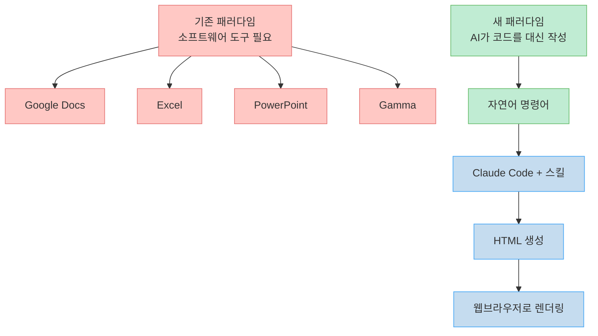
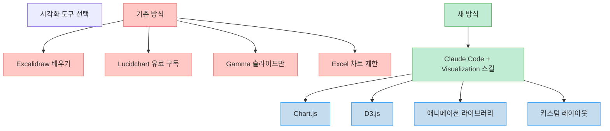
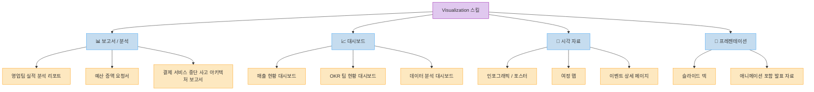
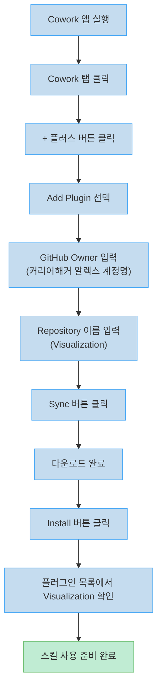
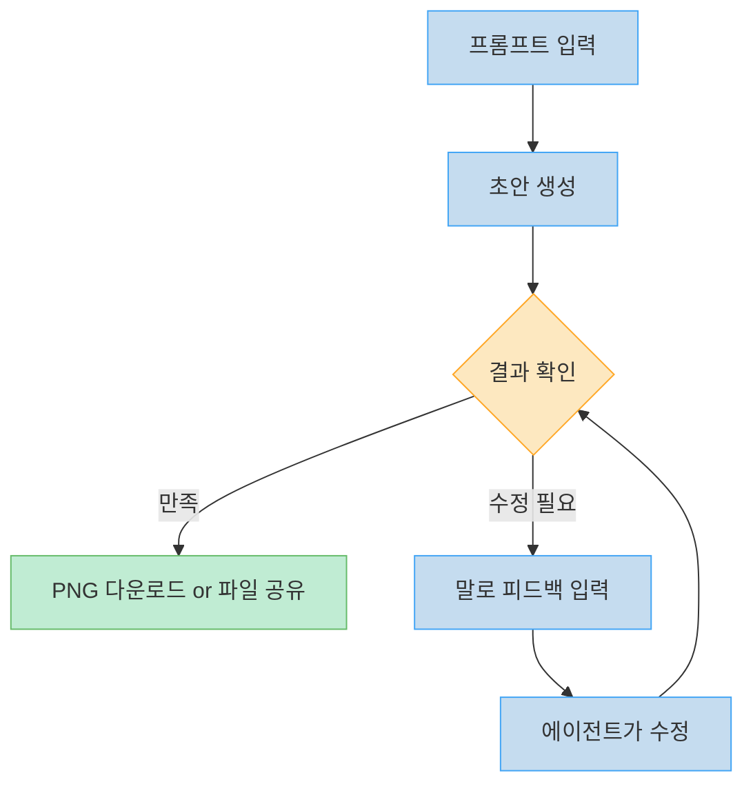
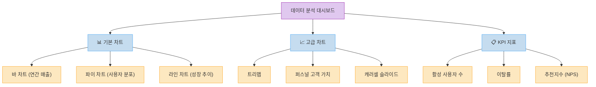
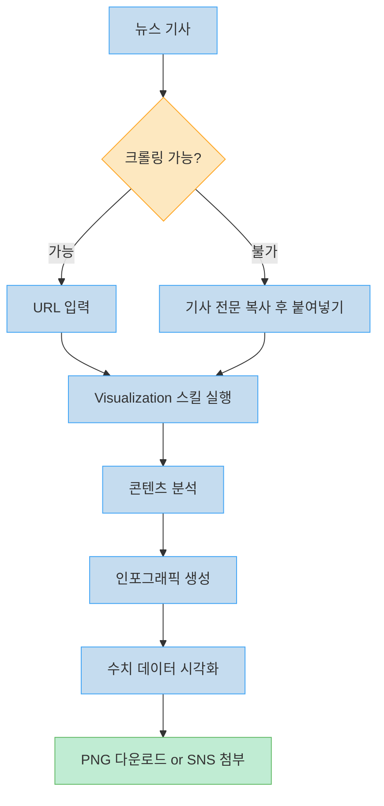
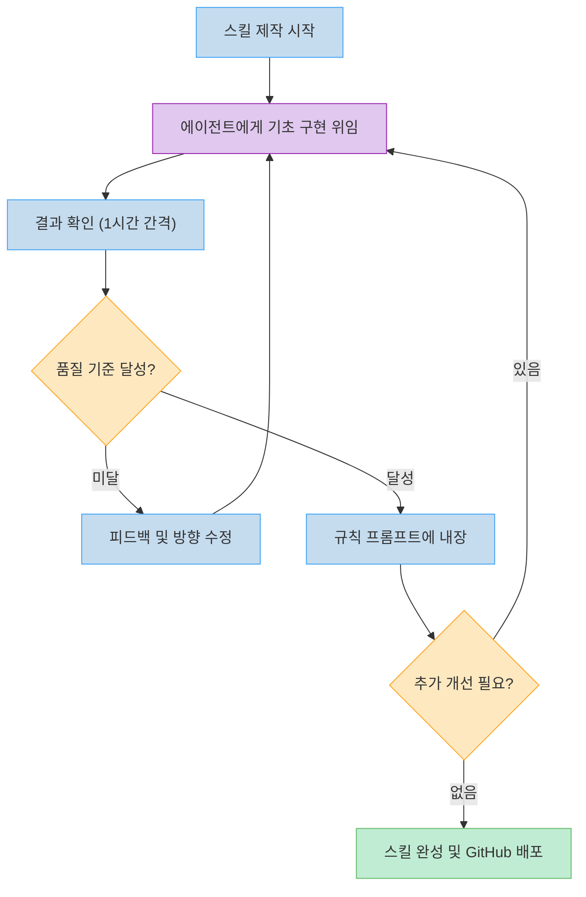

PPT 만드는 데 몇 시간이 걸린다. 감마(Gamma) 같은 도구를 써도 수동으로 다듬는 과정이 빠지지 않는다. 유료 구독이 필요하고, 그마저도 슬라이드만 만들 수 있다. 지금 소개할 Visualization 스킬 하나면 이 모든 상황이 바뀐다.

커리어해커 알렉스가 직접 제작한 이 스킬은 Claude Code에 설치하는 순간 자연어 명령어 하나로 PPT, 보고서, 대시보드, 인포그래픽, 이벤트 포스터까지 모두 HTML로 생성해 준다. 이 영상은 그 스킬의 설치 방법, 작동 원리, 실제 데모까지 처음부터 끝까지 보여준다.

<!--more-->

## Sources

- [클로드에 이 '스킬'을 설치하면 업무가 10배 빨라집니다 - 커리어해커 알렉스](https://youtube.com/watch?v=XbgPynBDPm4)

---

## 소프트웨어 패러다임의 변화: 왜 HTML이 PPT를 대체하는가

기존 소프트웨어가 존재했던 이유는 단 하나다. 모든 사람이 코딩을 할 수 없기 때문이다.

Google Docs, Excel, PowerPoint, Google Slides — 이 도구들은 모두 비개발자가 코드 없이도 문서, 표, 슬라이드를 만들 수 있도록 설계된 **제약의 산물**이다. 소프트웨어가 제공하는 기능의 범위 안에서만 작업이 가능하다는 근본적인 한계가 있다.

[https://youtu.be/XbgPynBDPm4?t=200](https://youtu.be/XbgPynBDPm4?t=200)에서 알렉스는 이 패러다임 변화를 명확하게 설명한다.

> "모든 소프트웨어는 코딩으로 만들어진 건데, 모두가 개발자가 아니니까 정형화된 틀을 만들어서 앱이나 웹사이트로 보여줬다. 이제는 누구나 프로그래머가 될 수 있는 시대다."

이제 AI가 코드를 대신 작성해 주기 때문에, 정형화된 도구가 필요 없어진다. 명령어 하나로 코드를 즉시 실행해서 웹사이트 형태의 시각 자료를 만들 수 있다.

### 웹브라우저가 최고의 캔버스인 이유

[https://youtu.be/XbgPynBDPm4?t=600](https://youtu.be/XbgPynBDPm4?t=600)에서 알렉스는 왜 결과물이 HTML인지 설명한다.

웹브라우저는 페이스북, 인스타그램, 구글 슬라이드 등 전 세계의 모든 시각 자료를 표현해야 하기 때문에, 어떤 전용 소프트웨어보다도 풍부하고 최적화된 시각화 라이브러리를 내장하고 있다. Chart.js, D3.js, 애니메이션 라이브러리 등 PPT 소프트웨어가 따라올 수 없는 수준의 표현력을 갖추고 있다.

Excalidraw, Lucidchart 같은 도구들을 각각 찾고 배우고 유료 구독을 유지할 필요가 없다. Claude Code 하나로 이 모든 도구의 기능을 대체할 수 있다.

더불어 PPT 앱의 기능에 제한될 필요가 없다. 다크 테마로 바꾸고 싶다면 말로 하면 된다. 특정 애니메이션을 넣고 싶다면 그냥 요청하면 된다.

---

## Visualization 스킬이란 무엇인가

[https://youtu.be/XbgPynBDPm4?t=60](https://youtu.be/XbgPynBDPm4?t=60)에서 스킬의 정의를 이렇게 설명한다.

> "스킬은 프롬프트 같은 거를 다운로드해서 내 클로드가 오늘 당장 쓸 수 있게 만들어주는 앱 같은 거다."

스킬은 단순한 프롬프트가 아니다. 프롬프트, 예제, 스크립트, 규칙이 패키지로 묶인 **앱 스토어의 앱**이다. 설치 후 명령어를 입력하면 스킬에 내장된 모든 로직이 실행되어 결과물이 나온다.

Visualization 스킬의 공식 설명은 다음과 같다:

> "Creates beautiful self-contained HTML — 어떤 프롬프트를 가지고 즉시 코드를 만들어서 렌더링할 수 있게 해주는 페이지를 만들어준다."

이 스킬로 만들 수 있는 결과물은 다음과 같다 ([https://youtu.be/XbgPynBDPm4?t=0](https://youtu.be/XbgPynBDPm4?t=0)):

스킬 안에는 예쁜 페이지를 만들기 위한 규칙들이 모두 담겨 있다. 여백 처리 방법, 컬러 그레이딩, 어떤 차트 라이브러리를 언제 사용할지 등의 지식이 프롬프트로 내장되어 있어, 사용자가 이 규칙들을 일일이 입력할 필요가 없다.

---

## Cowork 앱과 플러그인 설치 방법

터미널 기반의 Claude Code는 진입 장벽이 있다. 이를 해결하기 위해 [Cowork 앱](https://youtu.be/XbgPynBDPm4?t=350)이 등장했다. Chat, Cowork, Code 세 가지 모드를 번갈아 사용할 수 있는 GUI 앱으로, 비개발자도 Claude Code의 기능을 쉽게 활용할 수 있다.

Visualization 스킬 설치 절차는 다음과 같다:

설치 후 플러그인 목록에서 "Visualization — Created by Career Hacker Alex"가 나타나면 정상적으로 설치된 것이다.

### Anthropic 공식 플러그인 생태계

[https://youtu.be/XbgPynBDPm4?t=400](https://youtu.be/XbgPynBDPm4?t=400)에서 알렉스는 Anthropic이 직접 제공하는 플러그인 생태계를 소개한다.

Cowork의 플러그인 스토어는 **Claude를 위한 앱 스토어**라고 볼 수 있다. 현재 제공되는 공식 플러그인으로는 다음이 있다:

| 플러그인 | 용도 |
|---------|------|
| 데이터 스킬 | 데이터 분석 및 시각화 |
| 세일즈 스킬 | 영업 업무 자동화 |
| HR 스킬 | 인사 관련 업무 처리 |
| 엔지니어링 스킬 | 개발 업무 보조 |
| 리걸 스킬 | 법률 관련 사전 검토 |

예를 들어 미국에서 변호사를 선임하기 전에 리걸 스킬로 사전 검토를 받을 수 있다. 플러그인은 계속 추가되고 있으며, 커리어해커 알렉스처럼 개인이 만든 스킬도 GitHub를 통해 공유하고 배포할 수 있다.

---

## 실제 데모: 슬라이드 덱 생성과 피드백 수정

### 1단계: 초안 생성

[https://youtu.be/XbgPynBDPm4?t=700](https://youtu.be/XbgPynBDPm4?t=700)에서 첫 번째 데모를 시연한다.

Visualization 플러그인을 선택한 후 다음 프롬프트를 입력했다:

> "클로드 코드를 설명해주는 간단하지만 예쁜 슬라이드 자료 만들어줘"

결과: 타이틀 슬라이드, 핵심 기능, 활용 사례 등으로 구성된 슬라이드 덱이 생성되었다. 슬라이드에는 다음 기능이 자동으로 포함됐다:

- PNG 다운로드 버튼
- 프린트 버튼
- 라이트/다크 모드 전환 스위치
- 슬라이드 번호 표시

### 2단계: 피드백으로 수정

초안이 마음에 들지 않을 때는 말로 피드백을 주면 된다. [https://youtu.be/XbgPynBDPm4?t=900](https://youtu.be/XbgPynBDPm4?t=900)에서 다음과 같은 피드백을 입력했다:

> "슬라이드 덱이 깔끔하긴 한데 피드백을 주고 싶다. 첫 번째는 애니메이션을 조금 더 풍부하게 만들고, 차트 같은 것들을 그려 넣어 줬으면 좋겠다. 두 번째는 커리어해커 알렉스가 설명하는 클로드 코드라는 주제로 탈바꿈했으면 좋겠다. 세 번째는 슬라이드가 뒤로 돌아갈 때 렌더링이 안 되는 이슈가 있는데 그것도 고쳐줘."

결과: 오른쪽으로 스며드는 애니메이션이 추가되고, 테마가 "커리어해커 알렉스가 설명하는 클로드 코드"로 변경됐으며, 렌더링 버그도 수정됐다.

핵심은 **에이전트**를 쓴다는 점이다. 버튼 하나하나를 클릭해서 수동으로 고치는 방식이 아니라, 에이전트가 피드백을 이해하고 코드 전체를 다시 생성한다.

---

## 데이터 분석 대시보드와 다양한 활용

### 데이터 분석 대시보드

[https://youtu.be/XbgPynBDPm4?t=1100](https://youtu.be/XbgPynBDPm4?t=1100)에서 두 번째 데모를 시연한다.

> "Data Analysis Deck을 만들고 싶다. 실제로 쓸 수 있을 것 같은 데이터를 가지고 시각화해서 분석한 것을 보여줄 수 있는 원페이지를 만들어줬으면 좋겠다. Bar Chart도 있고 파이 차트도 있고 고급 차트들을 그려줬으면 좋겠다."

결과: SaaS 성장 분석 대시보드가 생성됐다. 연간 매출, 활성 사용자, 이탈률, 추천지수(NPS) 등 다양한 지표가 차트로 시각화됐다. 트리맵, 퍼스널 고객 가치 차트 등 고급 차트도 포함됐다.

### 컴포넌트 갤러리 활용

어떤 시각화를 원하는지 용어로 표현하기 어려울 때는 **컴포넌트 갤러리**를 참조하면 된다. 캐러셀(가로로 넘기는 슬라이드), 트리 뷰, 페이지네이션(10개씩 나눠 보여주기) 등의 UI 컴포넌트를 시각적으로 설명해 주는 웹사이트다. 원하는 것을 찾아서 "이렇게 만들어줘"라고 스크린샷과 함께 요청하면 된다.

### 이벤트 포스터 생성

[https://youtu.be/XbgPynBDPm4?t=1000](https://youtu.be/XbgPynBDPm4?t=1000)에서 이벤트 상세 페이지 데모를 보여준다.

> "내일 있을 커리어해커 알렉스의 구독자와의 만남을 소개하는 상세 페이지를 만들고 싶다. 내일 1시에 강남역에서 인터뷰가 있다. 이벤트 페이지야, 포스터 같은 거."

결과: 깔끔한 이벤트 상세 페이지가 생성됐다. 이후 "포스터로 바꿔줘", "슬라이드로 바꿔줘" 같은 후속 명령으로 형식을 변환할 수도 있다.

---

## 뉴스 기사 시각화와 콘텐츠 제작

[https://youtu.be/XbgPynBDPm4?t=1450](https://youtu.be/XbgPynBDPm4?t=1450)에서 실시간 뉴스를 시각화하는 데모를 보여준다.

경제 뉴스 기사를 찾은 후 "다음 뉴스를 시각화해서 만들어줘"라고 입력했다. 일부 웹사이트는 에이전트 크롤링을 막기도 하지만, 그럴 때는 기사 내용 전체를 복사해서 붙여넣기 하면 된다.

결과: "고유가·고물가·고금리 트리플 쇼크 위기" 인포그래픽이 생성됐다. 원유 가격 107달러 등 수치 데이터가 시각화되어, 기사 원문보다 오히려 읽기 쉬운 형태가 됐다.

알렉스는 실제로 스레드(Threads)에 포스트를 올릴 때 이 방식을 활용한다. "PPT, Excel, Google Docs 다 없어질 것 같다. HTML로 대체될 것이다"라는 주장의 첨부 자료도 Visualization 스킬로 만들었다.

---

## 스킬 제작 과정: 에이전트만으로 3일

[https://youtu.be/XbgPynBDPm4?t=1350](https://youtu.be/XbgPynBDPm4?t=1350)에서 스킬 제작 과정을 공개한다.

> "제가 직접 코드를 짠 거는 거의 하나도 없다. 처음부터 끝까지 에이전트로 짰다. 3일 동안 밤낮으로 1시간에 한 번씩 고치고 확인하고 결과물 보고 다시 고치고, 그거를 100번 이상 했다."

컴퓨터 앞에 앉아서 직접 코딩한 것이 아니라, 에이전트가 계속 돌아가도록 설정해 두고 주기적으로 결과를 확인하며 방향을 잡는 방식으로 제작했다. 스킬에 내장된 규칙들 — 여백 처리, 컬러 그레이딩, 차트 라이브러리 선택 등 — 도 모두 이 반복 과정에서 프롬프트로 정제됐다.

이 제작 과정 자체가 하나의 메시지다. 전문 개발자가 아니어도 에이전트를 올바른 방향으로 반복 수정하면 이런 도구를 만들 수 있다는 것이다.

---

## 핵심 요약

| 항목 | 내용 |
|-----|------|
| **스킬 정의** | 프롬프트 + 예제 + 스크립트가 패키지된 Claude Code용 앱 |
| **Visualization 스킬** | 자연어 명령어 → HTML 시각화 자료 생성 |
| **설치 방법** | Cowork 앱 → 플러그인 → GitHub 저장소 입력 → Sync |
| **결과물 형태** | Self-contained HTML (웹브라우저로 더블클릭해서 열기) |
| **활용 범위** | PPT, 대시보드, 인포그래픽, 이벤트 페이지, 뉴스 시각화 |
| **수정 방법** | 말로 피드백 → 에이전트가 전체 재생성 |
| **내보내기** | PNG 다운로드, 파일 공유, HTML 직접 배포 |
| **제작 방식** | 에이전트 100회 이상 반복 수정 |

---

## 결론

Visualization 스킬은 "AI가 코드를 대신 써주니까 전용 소프트웨어가 필요 없다"는 주장을 실제로 증명한다. PPT 앱이 제공하는 기능의 한계 안에 갇히지 않고, 웹브라우저가 가진 모든 시각화 능력을 말 한마디로 끌어쓸 수 있다.

특히 비개발자에게 이 스킬의 가치는 크다. Cowork 앱을 통해 터미널 없이도 설치하고 사용할 수 있으며, 결과물을 이미지로 다운로드해서 기존 문서에 삽입하는 방식으로 현재 업무 흐름에 자연스럽게 녹일 수 있다.

앞으로는 어떤 형태의 시각 자료가 필요하든 "이렇게 만들어줘"라는 말 한마디면 충분한 시대가 됐다.
