AI 코딩 에이전트(Claude Code, Cursor, Copilot 등)를 사용해 본 개발자라면 한 번쯤 경험했을 것입니다. 처음에는 놀라울 정도로 잘 동작하다가, 프로젝트가 커지면서 점점 품질이 떨어지는 현상 — **컨텍스트 로트(Context Rot)**. GSD(Get Shit Done)는 이 문제를 근본적으로 해결하기 위해 설계된 **메타 프롬프팅 & 컨텍스트 엔지니어링 시스템** 입니다. 단순한 프롬프트 템플릿이 아니라, AI 에이전트가 작업 전체 라이프사이클에서 컨텍스트를 구조화하고, 계획을 세우고, 검증까지 수행하도록 오케스트레이션하는 프레임워크입니다.

<!--more-->

## Sources

- https://github.com/gsd-build/get-shit-done (소스: http)
- https://raw.githubusercontent.com/gsd-build/get-shit-done/main/README.md (소스: http)
- https://raw.githubusercontent.com/gsd-build/get-shit-done/main/docs/USER-GUIDE.md (소스: http)

## GSD란 무엇인가

**GSD(Get Shit Done)** 는 AI 코딩 에이전트(Claude Code, OpenCode, Gemini CLI, Codex)를 위한 **메타 프롬프팅(meta-prompting), 컨텍스트 엔지니어링(context engineering), 스펙 기반 개발(spec-driven development) 시스템** 입니다. npm 패키지 `get-shit-done-cc`로 배포되며, `npx get-shit-done-cc@latest`로 설치할 수 있습니다.

GSD가 해결하는 핵심 문제는 **컨텍스트 로트** 입니다. LLM은 컨텍스트 윈도우가 채워질수록 품질이 저하됩니다. 프로젝트 초기에는 완벽한 코드를 생성하던 에이전트가, 작업이 누적되면서 이전 결정을 잊고, 일관성이 무너지고, 중복 코드를 생성합니다.

GSD의 해법은 간단하지만 강력합니다: **코드를 작성하기 전에 먼저 계획하고, 각 단계마다 신선한 컨텍스트를 사용하며, 작업 결과를 구조화된 파일에 기록** 합니다.

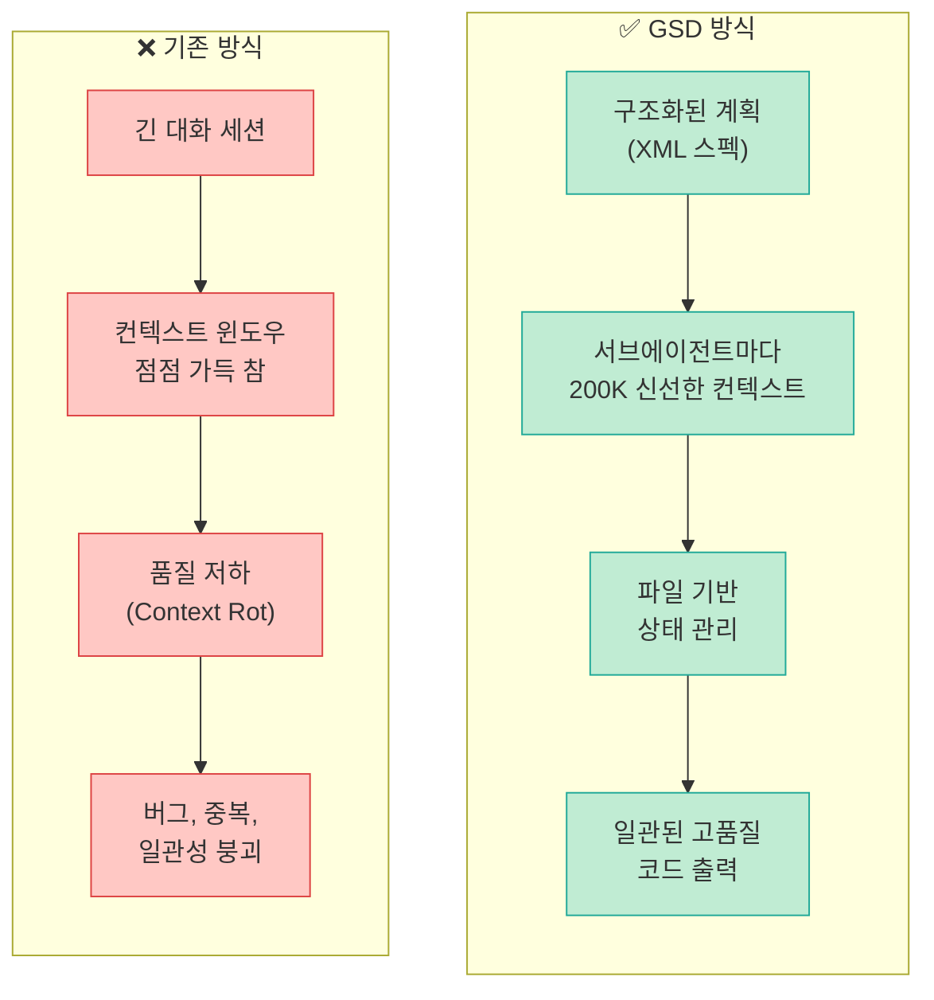

### 핵심 설계 원칙

GSD는 세 가지 핵심 원칙 위에 구축되었습니다:

1. **코드 작성 전에 계획(Plan Before Code)**: 모든 구현은 상세한 XML 기반 계획에서 시작합니다
2. **구조화된 컨텍스트(Structured Context)**: 프로젝트 상태를 파일 시스템에 기록하여 에이전트가 언제든 최신 상태를 읽을 수 있습니다
3. **전문 서브에이전트(Specialized Subagents)**: 각 작업 단계에 최적화된 에이전트가 신선한 컨텍스트로 작업합니다

## 코어 워크플로우

GSD의 개발 워크플로우는 **마일스톤 기반 순차 진행** 방식입니다. 각 단계는 이전 단계의 산출물에 의존하며, 명확한 진입/종료 조건을 가집니다.

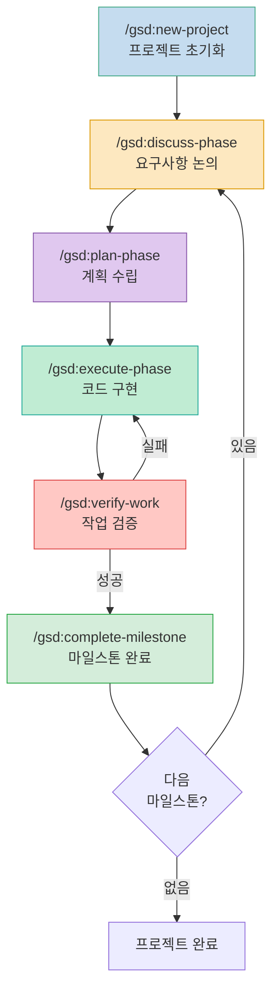

### 1단계: 프로젝트 초기화 (`/gsd:new-project`)

새 프로젝트를 시작하면 GSD는 `.planning/` 디렉토리를 생성하고, 핵심 컨텍스트 파일들을 초기화합니다:

- **PROJECT.md**: 프로젝트 개요, 기술 스택, 아키텍처 결정사항
- **REQUIREMENTS.md**: 기능 요구사항, 비기능 요구사항, 제약조건
- **STATE.md**: 현재 진행 상태, 완료된 마일스톤, 다음 단계
- **config.json**: 모델 프로파일, 워크플로우 토글, 깃 브랜칭 전략 등 설정

### 2단계: 논의 단계 (`/gsd:discuss-phase`)

사용자와 AI 에이전트가 **구조화된 대화** 를 통해 요구사항을 구체화합니다. 이 단계에서 에이전트는 질문을 던져 모호한 부분을 해소하고, 기술적 결정사항을 문서화합니다. 결과물은 REQUIREMENTS.md에 반영됩니다.

### 3단계: 계획 수립 (`/gsd:plan-phase`)

GSD의 핵심 차별점입니다. **리서처(Researcher) 에이전트** 가 코드베이스를 분석하고, **플래너(Planner) 에이전트** 가 XML 형식의 구조화된 계획을 수립합니다. 계획에는 각 단계의 파일 변경사항, 의존성, 검증 기준이 포함됩니다.

### 4단계: 코드 구현 (`/gsd:execute-phase`)

계획의 각 웨이브(Wave)를 순서대로 실행합니다. 독립적인 태스크는 **병렬 실행**, 의존성이 있는 태스크는 **순차 실행** 됩니다. 각 태스크 완료 시 자동으로 **원자적 깃 커밋(Atomic Git Commit)** 이 생성됩니다.

### 5단계: 작업 검증 (`/gsd:verify-work`)

**검증자(Verifier) 에이전트** 가 구현 결과를 계획과 대조하여 검증합니다. 실패 시 실행 단계로 되돌아갑니다.

### 6단계: 마일스톤 완료 (`/gsd:complete-milestone`)

모든 검증이 통과하면 마일스톤을 완료로 표시하고, STATE.md를 업데이트합니다.

## 컨텍스트 엔지니어링 아키텍처

GSD의 핵심은 **파일 시스템 기반 컨텍스트 관리** 입니다. LLM의 컨텍스트 윈도우에 의존하는 대신, 구조화된 파일에 모든 상태를 기록하고, 각 에이전트가 필요한 시점에 필요한 파일만 읽도록 설계되었습니다.

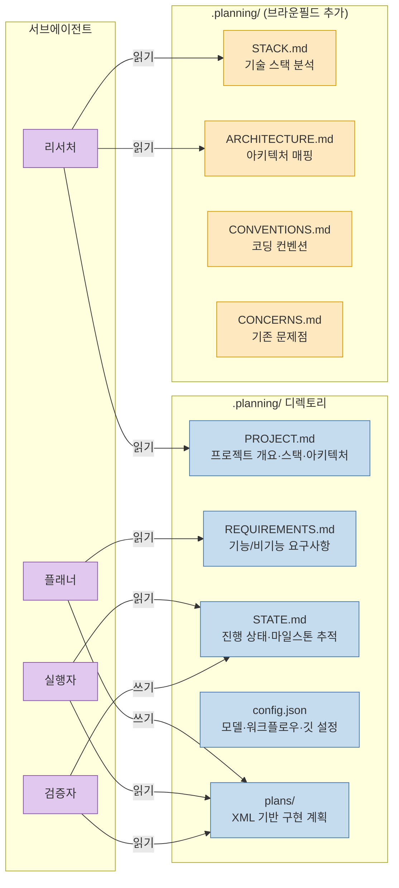

### 컨텍스트 파일 상세

| 파일 | 역할 | 생성 시점 | 주요 소비자 |
|------|------|-----------|-------------|
| **PROJECT.md** | 프로젝트 비전, 기술 스택, 핵심 아키텍처 결정 | `/gsd:new-project` | 모든 에이전트 |
| **REQUIREMENTS.md** | 기능/비기능 요구사항, 제약조건, 우선순위 | `/gsd:discuss-phase` | 플래너, 검증자 |
| **STATE.md** | 현재 마일스톤, 완료된 작업, 다음 단계 | 매 단계 자동 업데이트 | 오케스트레이터, 실행자 |
| **config.json** | 모델 프로파일, 워크플로우 토글, 깃 전략 | 설치 시 / 사용자 수정 | 오케스트레이터 |
| **plans/** | XML 형식 구현 계획 (마일스톤별) | `/gsd:plan-phase` | 실행자, 검증자 |

### XML 기반 계획 형식

GSD의 계획은 **XML 형식** 으로 구조화됩니다. XML을 선택한 이유는 LLM이 XML 태그를 다른 형식보다 정확하게 파싱하고 따르는 경향이 있기 때문입니다.

계획의 핵심 구조:

```xml
<plan>
  <milestone name="사용자 인증 시스템">
    <wave number="1" parallel="true">
      <task id="auth-model">
        <description>사용자 모델 및 인증 스키마 정의</description>
        <files>src/models/user.ts, src/schemas/auth.ts</files>
        <verification>타입 체크 통과, 스키마 검증 테스트</verification>
      </task>
      <task id="auth-utils">
        <description>JWT 토큰 유틸리티 구현</description>
        <files>src/utils/jwt.ts</files>
        <verification>토큰 생성/검증 단위 테스트</verification>
      </task>
    </wave>
    <wave number="2" parallel="false">
      <task id="auth-service" depends="auth-model,auth-utils">
        <description>인증 서비스 레이어 구현</description>
        <files>src/services/auth.ts</files>
        <verification>로그인/회원가입 통합 테스트</verification>
      </task>
    </wave>
  </milestone>
</plan>
```

각 `<wave>` 는 의존성 기반으로 그룹화되며, `parallel="true"` 인 웨이브 내의 태스크는 병렬 실행됩니다.

## 멀티 에이전트 오케스트레이션

GSD는 **씬 오케스트레이터(Thin Orchestrator) + 전문 서브에이전트** 패턴을 사용합니다. 메인 에이전트는 가벼운 조정자 역할만 하고, 실제 작업은 각각 **신선한 200K 토큰 컨텍스트** 를 가진 전문 서브에이전트가 수행합니다.

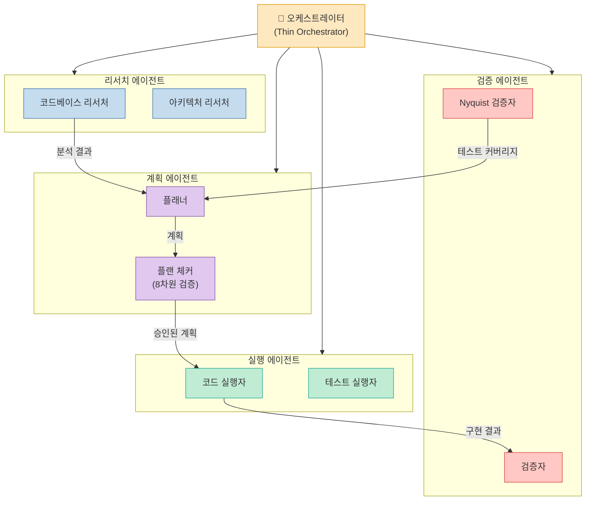

### 에이전트 유형별 역할

GSD는 **11가지 전문 에이전트** 를 정의하고, 각 에이전트에 모델 프로파일(quality/balanced/budget)에 따라 다른 LLM을 할당합니다:

| 에이전트 | 역할 | Quality | Balanced | Budget |
|----------|------|---------|----------|--------|
| **Orchestrator** | 워크플로우 조정 | Opus | Opus | Sonnet |
| **Researcher** | 코드베이스 분석 | Opus | Sonnet | Haiku |
| **Planner** | 계획 수립 | Opus | Opus | Sonnet |
| **Plan Checker** | 계획 8차원 검증 | Opus | Opus | Sonnet |
| **Executor** | 코드 구현 | Opus | Sonnet | Sonnet |
| **Verifier** | 결과 검증 | Opus | Sonnet | Haiku |
| **Discuss Agent** | 요구사항 대화 | Opus | Sonnet | Sonnet |
| **Quick Agent** | 빠른 일회성 작업 | Sonnet | Sonnet | Haiku |
| **Security Reviewer** | 보안 점검 | Opus | Opus | Sonnet |
| **Performance Analyst** | 성능 분석 | Opus | Sonnet | Haiku |
| **Nyquist Validator** | 테스트 커버리지 매핑 | Opus | Opus | Sonnet |

**Quality 프로파일** 은 거의 모든 에이전트에 Opus를 사용하여 최고 품질을 보장하지만 비용이 높고, **Budget 프로파일** 은 Haiku/Sonnet 위주로 빠르고 저렴하지만 복잡한 작업에서 품질이 떨어질 수 있습니다. **Balanced** 가 기본값으로, 계획 수립에는 Opus를, 실행에는 Sonnet을 사용하는 실용적 조합입니다.

### 신선한 컨텍스트의 중요성

각 서브에이전트가 **독립적인 200K 토큰 컨텍스트** 를 사용하는 것이 GSD의 핵심 차별점입니다. 일반적인 AI 코딩에서는 하나의 대화 세션에서 모든 작업을 수행하므로, 컨텍스트 윈도우가 점진적으로 오염됩니다. GSD는 각 에이전트가 필요한 컨텍스트 파일만 읽고, 작업 결과를 파일에 기록한 뒤 종료합니다. 다음 에이전트는 깨끗한 컨텍스트에서 시작하여 필요한 파일만 다시 읽습니다.

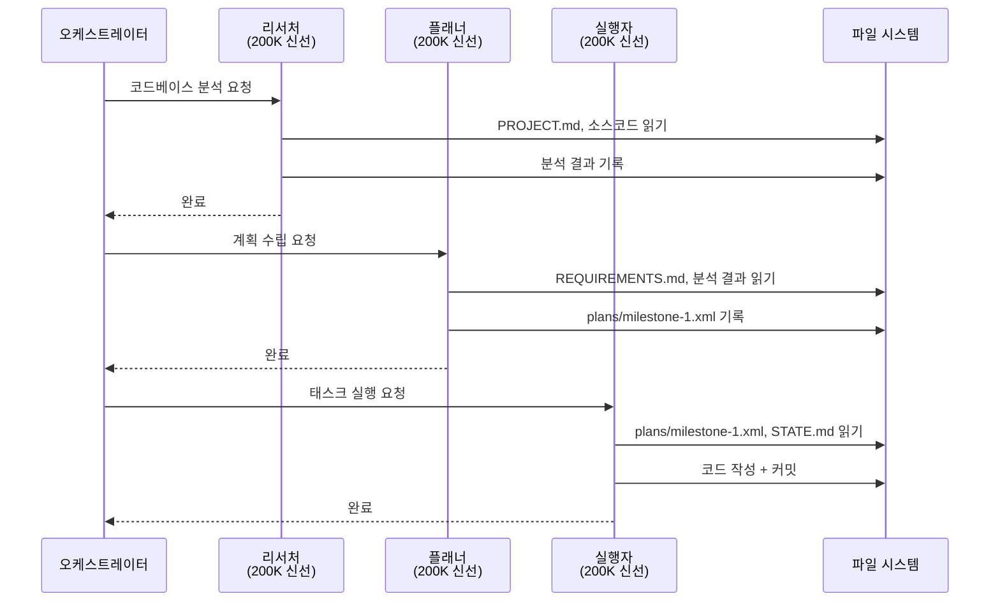

## 웨이브 실행 모델

GSD의 실행 단계는 **웨이브(Wave) 기반 병렬/순차 실행 모델** 을 사용합니다. 각 마일스톤의 계획은 여러 웨이브로 나뉘며, 웨이브 내부의 태스크는 의존성에 따라 병렬 또는 순차 실행됩니다.

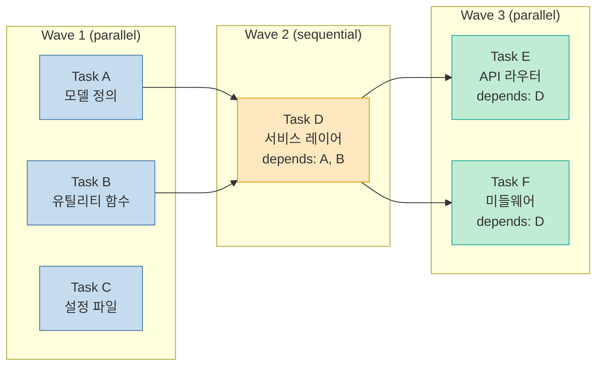

### 웨이브 실행 규칙

1. **Wave 내부**: `parallel="true"` 면 모든 태스크를 동시에 실행, `parallel="false"` 면 순서대로 실행
2. **Wave 간**: 이전 웨이브의 모든 태스크가 완료되어야 다음 웨이브로 진행
3. **의존성 검증**: `depends` 속성에 명시된 태스크가 완료되었는지 실행 전에 확인
4. **실패 처리**: 태스크 실패 시 해당 웨이브를 중단하고 오케스트레이터에 보고

### 원자적 깃 커밋 (Atomic Git Commits)

각 태스크가 성공적으로 완료되면, GSD는 자동으로 **원자적 깃 커밋** 을 생성합니다. 이는 다음과 같은 이점을 제공합니다:

- **롤백 용이성**: 문제 발생 시 특정 태스크 단위로 되돌릴 수 있음
- **변경 추적**: 각 커밋이 하나의 논리적 변경 단위에 대응
- **코드 리뷰 편의**: 리뷰어가 작은 단위로 변경사항을 확인 가능

깃 브랜칭 전략은 `config.json`에서 설정할 수 있으며, 세 가지 옵션을 지원합니다:

| 전략 | 설명 | 적합한 상황 |
|------|------|-------------|
| **none** | 현재 브랜치에 직접 커밋 | 개인 프로젝트, 빠른 프로토타이핑 |
| **phase** | 실행 단계마다 새 브랜치 생성 | 팀 프로젝트에서 단계별 리뷰 필요 시 |
| **milestone** | 마일스톤마다 새 브랜치 생성 | 대규모 프로젝트에서 기능 브랜치 전략 사용 시 |

## Nyquist 검증 아키텍처

GSD의 가장 독특한 기능 중 하나인 **Nyquist 검증** 은 신호 처리 이론의 나이퀴스트 정리에서 영감을 받았습니다. 나이퀴스트 정리가 "신호를 정확히 복원하려면 최소 2배의 샘플링 주파수가 필요하다"고 말하듯, Nyquist 검증은 **"코드를 작성하기 전에 충분한 테스트 커버리지 계획이 있어야 한다"** 는 원칙을 적용합니다.

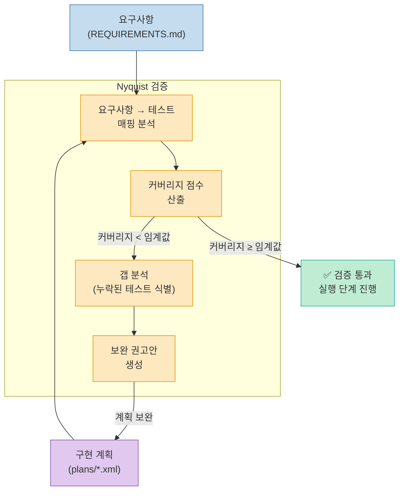

### Nyquist 검증의 동작 방식

1. **요구사항-테스트 매핑**: 각 요구사항 항목에 대응하는 테스트 계획이 있는지 분석
2. **커버리지 점수 산출**: 전체 요구사항 대비 테스트가 계획된 비율을 계산
3. **갭 분석**: 테스트 계획이 없는 요구사항을 식별
4. **보완 권고**: 누락된 테스트를 계획에 추가하도록 권고

### 플랜 체커의 8차원 검증

Nyquist 검증은 **플랜 체커(Plan Checker) 에이전트** 의 8차원 검증 중 하나입니다. 플랜 체커는 계획의 품질을 다음 8가지 차원에서 검증합니다:

1. **완전성(Completeness)**: 모든 요구사항이 계획에 반영되었는가
2. **일관성(Consistency)**: 태스크 간 모순이 없는가
3. **의존성(Dependencies)**: 태스크 간 의존성이 올바르게 정의되었는가
4. **실현가능성(Feasibility)**: 각 태스크가 기술적으로 구현 가능한가
5. **검증가능성(Verifiability)**: 각 태스크의 완료 기준이 명확한가
6. **보안(Security)**: 보안 관련 요구사항이 반영되었는가
7. **성능(Performance)**: 성능 영향이 고려되었는가
8. **Nyquist 커버리지**: 테스트 계획이 요구사항을 충분히 커버하는가

### 소급 검증 (`/gsd:validate-phase`)

이미 실행이 시작된 후에도 `/gsd:validate-phase` 명령으로 **소급 Nyquist 검증** 을 수행할 수 있습니다. 이는 다음 상황에서 유용합니다:

- 계획 단계에서 Nyquist 검증을 건너뛴 경우
- 실행 중 요구사항이 변경된 경우
- 기존 코드베이스의 테스트 커버리지를 평가하고 싶은 경우

## 브라운필드 프로젝트 지원

GSD는 새 프로젝트(그린필드)뿐 아니라 **기존 프로젝트(브라운필드)** 도 지원합니다. `/gsd:map-codebase` 명령은 기존 코드베이스를 분석하여 4개의 컨텍스트 파일을 자동 생성합니다.

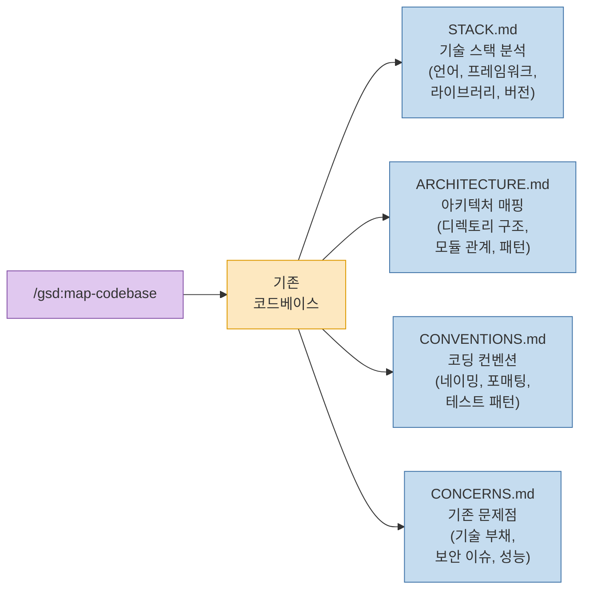

### 브라운필드 컨텍스트 파일 상세

- **STACK.md**: 사용 중인 언어, 프레임워크, 라이브러리, 버전 정보를 분석합니다. 패키지 매니저 파일(package.json, requirements.txt 등)과 설정 파일을 기반으로 기술 스택을 매핑합니다.

- **ARCHITECTURE.md**: 디렉토리 구조, 모듈 간 의존성, 사용 중인 아키텍처 패턴(MVC, 레이어드 등)을 문서화합니다. 새 코드를 작성할 때 기존 아키텍처와 일관성을 유지하는 데 핵심적인 역할을 합니다.

- **CONVENTIONS.md**: 네이밍 규칙, 코드 포매팅 스타일, 테스트 작성 패턴, 에러 처리 방식 등을 추출합니다. AI 에이전트가 기존 코드와 동일한 스타일로 새 코드를 작성하도록 가이드합니다.

- **CONCERNS.md**: 기술 부채, 알려진 버그, 보안 취약점, 성능 병목 등 기존 문제점을 식별합니다. 새 작업을 계획할 때 이 문제들을 악화시키지 않도록 주의를 기울일 수 있습니다.

## 퀵 모드 (Quick Mode)

모든 작업에 전체 워크플로우가 필요한 것은 아닙니다. **퀵 모드** 는 작은 변경사항이나 일회성 작업을 위한 간소화된 실행 경로입니다.

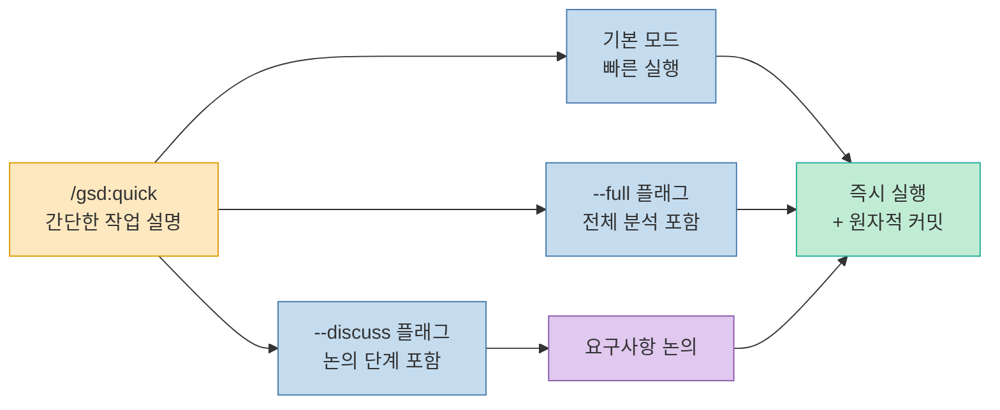

### 퀵 모드 플래그

| 플래그 | 설명 | 사용 예 |
|--------|------|---------|
| (없음) | 기본 — 빠른 실행 | `/gsd:quick 로그인 버튼 색상 파란색으로 변경` |
| `--full` | 전체 분석(리서치 + 계획) 포함 | `/gsd:quick --full 에러 처리 미들웨어 추가` |
| `--discuss` | 사용자 논의 단계 포함 | `/gsd:quick --discuss 검색 기능 UX 개선` |

퀵 모드에서도 **원자적 깃 커밋** 은 동일하게 적용됩니다. 작은 변경이라도 롤백 가능한 단위로 기록됩니다.

## 설정 시스템 (config.json)

GSD의 모든 동작은 `.planning/config.json`을 통해 세밀하게 제어할 수 있습니다.

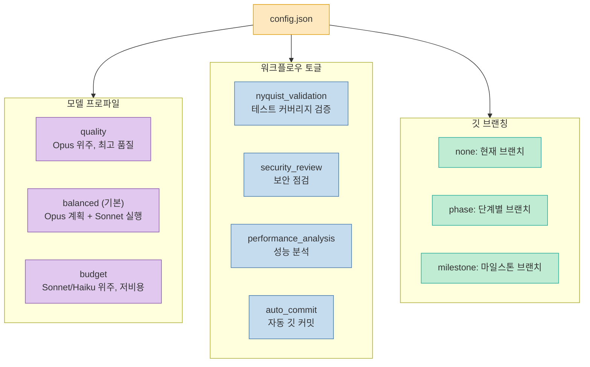

### Speed vs Quality 프리셋

프로젝트 상황에 따라 속도와 품질의 균형을 조절할 수 있습니다:

| 시나리오 | 모델 프로파일 | Nyquist | 보안 점검 | 성능 분석 | 브랜칭 |
|----------|--------------|---------|-----------|-----------|--------|
| **프로토타이핑** | budget | OFF | OFF | OFF | none |
| **일반 개발** | balanced | ON | OFF | OFF | phase |
| **프로덕션** | quality | ON | ON | ON | milestone |

**프로토타이핑** 에서는 비용을 최소화하고 빠르게 반복하는 것이 우선이므로 검증 단계를 최소화합니다. **프로덕션** 에서는 모든 검증을 활성화하고 최고 품질 모델을 사용합니다.

## 멀티 런타임 지원

GSD는 단일 AI 에이전트에 종속되지 않습니다. 다음 네 가지 런타임을 공식 지원합니다:

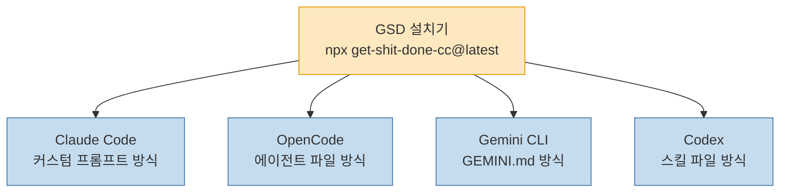

### 런타임별 설치 방식

| 런타임 | 설치 방식 | 설정 파일 |
|--------|-----------|-----------|
| **Claude Code** | 커스텀 프롬프트 주입 | `.claude/` 디렉토리 |
| **OpenCode** | 에이전트 설정 파일 | `.opencode/` 디렉토리 |
| **Gemini CLI** | GEMINI.md 파일 | `GEMINI.md` |
| **Codex** | 스킬 파일 | `skills/gsd-*/SKILL.md` |

설치기는 비대화형 모드도 지원합니다:

```bash
# 특정 런타임만 설치
npx get-shit-done-cc@latest --claude
npx get-shit-done-cc@latest --opencode
npx get-shit-done-cc@latest --gemini
npx get-shit-done-cc@latest --codex

# 모든 런타임 설치
npx get-shit-done-cc@latest --all

# 글로벌/로컬 설치
npx get-shit-done-cc@latest --global
npx get-shit-done-cc@latest --local
```

### 커뮤니티 포트

GSD의 인기로 커뮤니티 포트도 존재합니다:

- **gsd-opencode** (rokicool): OpenCode 전용 포크
- **gsd-gemini** (uberfuzzy, 아카이브됨): Gemini CLI 전용 포크

현재는 네이티브 멀티 런타임 지원이 내장되어 있어 별도 포크가 필요하지 않습니다.

## 설치 및 업데이트

### 설치

```bash
npx get-shit-done-cc@latest
```

대화형 설치기가 런타임 선택, 글로벌/로컬 설치 여부 등을 안내합니다.

### 업데이트 시 로컬 패치 보존

v1.17부터 설치기는 사용자가 로컬에서 수정한 파일을 **자동 백업** 합니다. 업데이트 시 수정 사항이 덮어씌워져도 `gsd-local-patches/` 디렉토리에 백업이 보관되며, `/gsd:reapply-patches` 명령으로 복원할 수 있습니다.

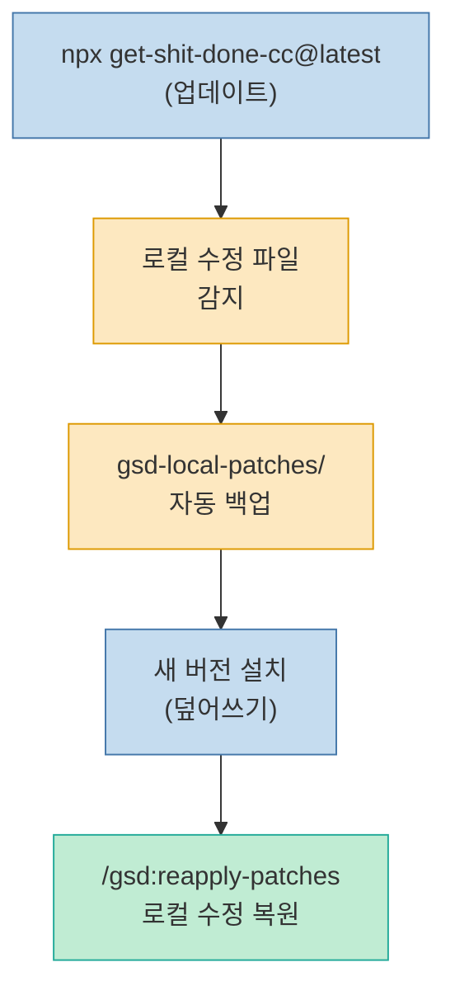

## 보안 고려사항

GSD는 보안을 워크플로우에 내장하는 접근 방식을 취합니다:

- **보안 리뷰 에이전트**: `config.json`에서 `security_review`를 활성화하면, 구현 후 전용 보안 리뷰 에이전트가 코드를 점검합니다
- **플랜 체커의 보안 차원**: 8차원 검증 중 보안 차원에서 계획 단계부터 보안 요구사항이 반영되었는지 확인합니다
- **CONCERNS.md**: 브라운필드 프로젝트에서 기존 보안 취약점을 식별하여 새 코드가 이를 악화시키지 않도록 합니다

## 전체 명령어 레퍼런스

| 명령어 | 설명 |
|--------|------|
| `/gsd:new-project` | 새 프로젝트 초기화, `.planning/` 디렉토리 생성 |
| `/gsd:discuss-phase` | 요구사항 논의 단계 시작 |
| `/gsd:plan-phase` | 구현 계획 수립 (리서치 → 계획 → 검증) |
| `/gsd:execute-phase` | 웨이브 기반 코드 구현 실행 |
| `/gsd:verify-work` | 구현 결과 검증 |
| `/gsd:complete-milestone` | 마일스톤 완료 처리 |
| `/gsd:quick` | 퀵 모드 (간단한 일회성 작업) |
| `/gsd:quick --full` | 퀵 모드 + 전체 분석 |
| `/gsd:quick --discuss` | 퀵 모드 + 논의 단계 |
| `/gsd:map-codebase` | 기존 코드베이스 분석 (브라운필드) |
| `/gsd:validate-phase` | 소급 Nyquist 검증 |
| `/gsd:reapply-patches` | 업데이트 후 로컬 수정사항 복원 |

## 프로젝트 파일 구조

GSD가 생성하고 관리하는 파일 구조는 다음과 같습니다:

```
.planning/
├── PROJECT.md              # 프로젝트 개요
├── REQUIREMENTS.md         # 요구사항 문서
├── STATE.md                # 진행 상태 추적
├── config.json             # 전체 설정
├── plans/                  # 마일스톤별 XML 계획
│   ├── milestone-1.xml
│   └── milestone-2.xml
├── STACK.md                # (브라운필드) 기술 스택
├── ARCHITECTURE.md         # (브라운필드) 아키텍처
├── CONVENTIONS.md          # (브라운필드) 코딩 컨벤션
└── CONCERNS.md             # (브라운필드) 기존 문제점

gsd-local-patches/          # (업데이트 시) 로컬 수정 백업
```

## 트러블슈팅 및 복구

### 자주 발생하는 문제

1. **컨텍스트 윈도우 초과**: GSD가 자동으로 서브에이전트를 사용하여 회피하지만, 매우 큰 파일을 직접 분석하는 경우 발생할 수 있습니다. 이 경우 파일을 분할하거나 리서처 에이전트에 분석을 위임하세요.

2. **계획 검증 실패**: 플랜 체커가 계획을 거부하면, 피드백을 반영하여 계획을 수정합니다. 8차원 중 어떤 차원에서 실패했는지 확인하고 해당 부분만 보완하세요.

3. **실행 중 태스크 실패**: 해당 웨이브가 중단되고 오케스트레이터에 보고됩니다. 실패 원인을 분석한 후 `/gsd:execute-phase`로 재실행할 수 있습니다.

4. **깃 충돌**: 브랜칭 전략을 사용하는 경우 머지 충돌이 발생할 수 있습니다. GSD는 충돌 해결을 사용자에게 위임합니다.

### STATE.md를 통한 복구

GSD의 모든 진행 상태는 STATE.md에 기록됩니다. 세션이 중단되거나 에이전트가 종료되어도, 다음 세션에서 STATE.md를 읽어 중단된 지점부터 재개할 수 있습니다. 이것이 파일 기반 컨텍스트 관리의 핵심 이점입니다.

## 커뮤니티 및 생태계

GSD는 활발한 커뮤니티를 보유하고 있습니다:

- **GitHub**: [gsd-build/get-shit-done](https://github.com/gsd-build/get-shit-done)
- **Discord**: [discord.gg/gsd](https://discord.gg/gsd)
- **X (Twitter)**: [@gsd_foundation](https://x.com/gsd_foundation)
- **제작자**: TÂCHES

또한 Solana 블록체인 기반의 **$GSD 토큰** 이 존재하여, 커뮤니티 거버넌스 및 생태계 참여 수단으로 활용되고 있습니다.

## 핵심 요약

1. **GSD는 컨텍스트 로트 문제를 해결** 합니다. LLM의 컨텍스트 윈도우 오염으로 인한 품질 저하를 파일 기반 상태 관리와 서브에이전트 패턴으로 근본적으로 해결합니다.

2. **"코드 전에 계획"이 핵심 원칙** 입니다. XML 형식의 구조화된 계획을 수립하고, 8차원 검증을 거친 뒤에야 코드 작성을 시작합니다.

3. **11종의 전문 서브에이전트** 가 각자 신선한 200K 컨텍스트로 작업합니다. 리서처, 플래너, 실행자, 검증자 등 역할이 분리되어 품질과 일관성을 보장합니다.

4. **Nyquist 검증** 은 코드 작성 전에 테스트 커버리지 계획을 강제합니다. 소급 검증(`/gsd:validate-phase`)도 가능합니다.

5. **웨이브 실행 모델** 은 의존성 기반 병렬/순차 실행으로 효율성을 극대화합니다. 각 태스크 완료 시 원자적 깃 커밋이 자동 생성됩니다.

6. **4가지 런타임(Claude Code, OpenCode, Gemini CLI, Codex)** 을 공식 지원하여 특정 에이전트에 종속되지 않습니다.

7. **브라운필드 프로젝트** 에서도 `/gsd:map-codebase`로 기존 코드를 분석하여 일관된 새 코드를 작성할 수 있습니다.

8. **설정 시스템** 으로 모델 프로파일, 워크플로우 토글, 깃 전략을 프로젝트에 맞게 세밀하게 조정할 수 있습니다.

## 결론

GSD는 "AI에게 코드를 시키면 알아서 잘 해주겠지"라는 순진한 기대에서 벗어나, **AI 코딩 에이전트를 체계적으로 관리하는 엔지니어링 프레임워크** 를 제시합니다. 컨텍스트 엔지니어링이라는 개념이 아직 낯설게 느껴질 수 있지만, AI 에이전트와 함께 일하는 모든 개발자에게 점점 더 중요해질 역량입니다.

특히 GSD가 보여주는 **"씬 오케스트레이터 + 전문 서브에이전트 + 파일 기반 상태 관리"** 패턴은, GSD 자체를 사용하지 않더라도 AI 코딩 워크플로우를 설계할 때 강력한 참고 모델이 됩니다. 프로젝트 규모가 커질수록, 그리고 AI 에이전트에 더 많은 작업을 위임할수록, 이러한 구조화된 접근법의 가치는 기하급수적으로 커집니다.

`npx get-shit-done-cc@latest` 한 줄로 시작할 수 있으니, AI 코딩의 다음 단계를 경험해 보시기 바랍니다.
