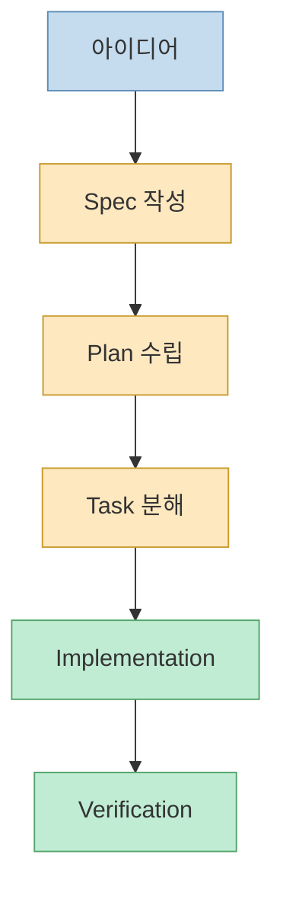
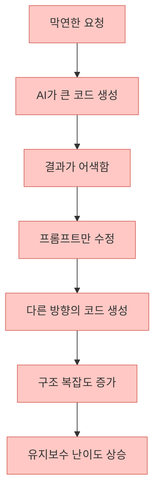
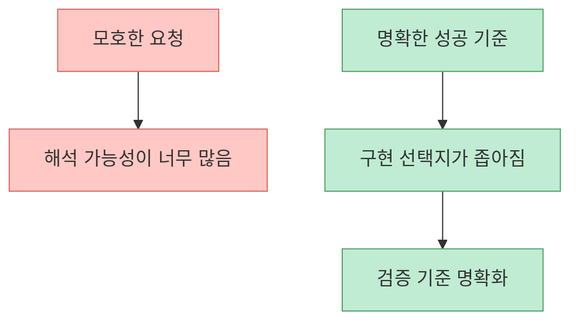
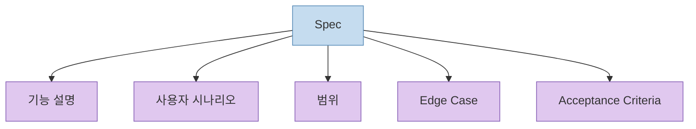
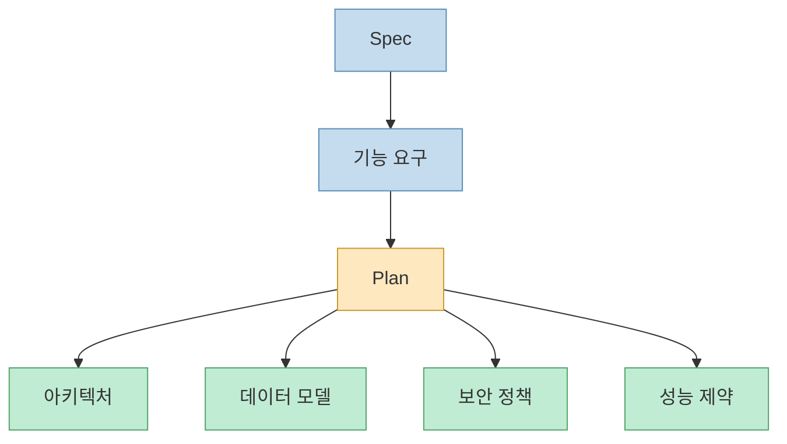
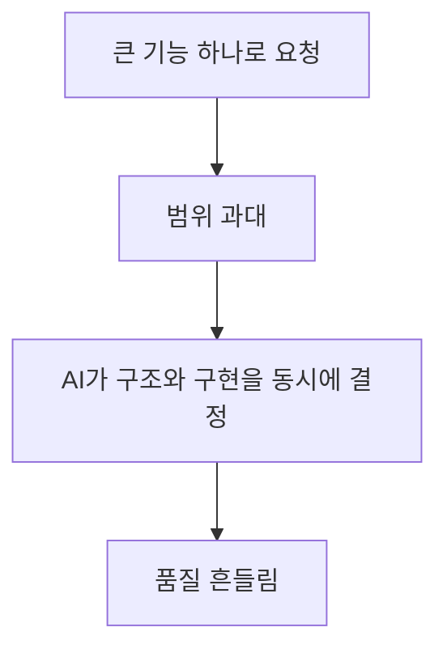
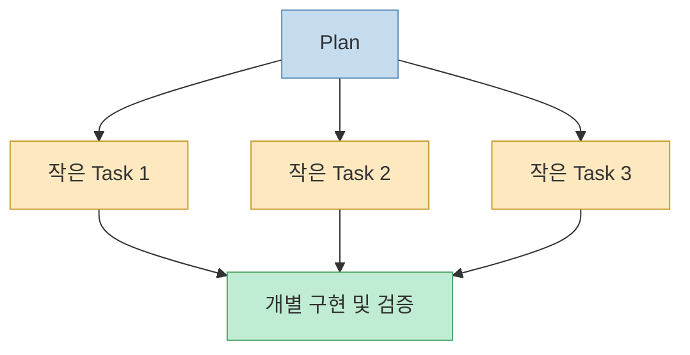
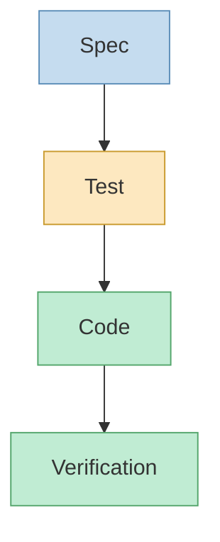
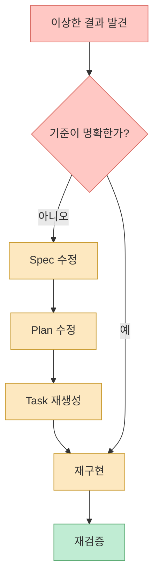

AI 코딩 도구가 좋아질수록 개발은 빨라집니다. 하지만 속도가 올라간다고 해서 프로젝트가 자동으로 좋아지지는 않습니다. 오히려 방향을 잃은 채 빠르게 달리면, 더 빨리 망가집니다.

바로 이 지점에서 많은 팀이 말하는 것이 **"Vibe Coding"** 입니다. 아이디어와 감각만으로 AI에게 계속 구현을 맡기는 방식입니다. 초기에는 놀라울 정도로 빠르지만, 프로젝트가 조금만 커져도 요구사항이 흔들리고 구조가 무너지기 시작합니다.

<!--more-->

이 문제를 해결하는 가장 현실적인 방법이 **Spec-Driven Development(SDD)** 입니다. 핵심은 단순합니다. **코드를 먼저 만들지 말고, Spec을 먼저 만든다.** 그리고 AI는 그 Spec을 벗어나지 않는 범위에서만 구현하게 만듭니다.



이 글에서는 왜 Vibe Coding만으로는 한계가 생기는지, 그리고 왜 **"Vibe -> Spec -> Plan -> Tasks -> Implementation -> Verification"** 순서가 AI 시대의 기본 개발 루프가 되어야 하는지 정리해보겠습니다.

## 왜 Vibe Coding만으로는 오래 못 가는가

Vibe Coding 자체가 나쁜 것은 아닙니다. 문제는 **감각만 있고 기준이 없을 때** 생깁니다. AI는 기본적으로 "가능한 구현"을 생성하지, "당신의 프로젝트에 가장 맞는 구현"을 자동으로 고정해주지는 않습니다.

실제 프로젝트에서 흔히 나타나는 증상은 비슷합니다.

- 요구사항이 대화 중간에 계속 바뀐다.
- 같은 기능을 다시 요청할 때마다 구현 방식이 달라진다.
- 지금만 돌아가는 코드가 쌓여 구조가 엉킨다.
- 테스트와 검증이 뒤로 밀리면서 유지보수 비용이 폭발한다.



즉, Vibe Coding의 핵심 문제는 모델 성능이 아니라 **통제 기준의 부재**입니다. AI가 똑똑해질수록 오히려 더 그럴듯한 잘못된 방향으로 멀리 갈 수 있습니다.

## 스펙 주도 개발의 핵심: "How"보다 "What"을 먼저 고정한다

스펙 주도 개발의 첫 단계는 구현이 아닙니다. **성공 상태를 먼저 정의하는 것**입니다.

예를 들어 이렇게 요청하면 문제가 생깁니다.

```text
로그인 기능 만들기
```

이 한 줄만 놓고도 AI는 수십 가지 구현을 만들 수 있습니다. 세션 방식, JWT 방식, 소셜 로그인 확장 가능성, 에러 처리 정책, 응답 속도 기준까지 모두 열려 있기 때문입니다.

반대로 이렇게 쓰면 결과가 달라집니다.

```text
사용자는 이메일과 비밀번호로 로그인할 수 있다.

조건
- 이메일 형식 검증
- 로그인 실패 시 에러 메시지 표시
- 로그인 성공 시 JWT 발급
- 세션 유지 24시간
- API 응답 2초 이하
```

여기서 중요한 점은 기술을 아직 고르지 않았다는 것입니다. 이 문장은 **어떻게 만들지**가 아니라 **무엇을 만족해야 하는지**를 고정합니다. 이것이 Spec의 출발점입니다.



## Spec은 AI와 사람이 함께 따르는 기준 문서다

좋은 Spec은 단순한 메모가 아닙니다. 프로젝트의 **Single Source of Truth** 역할을 해야 합니다. 즉, 사람이 리뷰할 때도 기준이 되고, AI가 구현할 때도 벗어나면 안 되는 경계가 됩니다.

실무에서는 보통 Spec에 다음 다섯 가지가 들어가면 충분히 강해집니다.

### 1. 기능 설명

기능이 무엇인지 한 문장으로 정의합니다.

```text
사용자는 이메일과 비밀번호로 로그인할 수 있다.
```

### 2. 사용자 시나리오

사용자가 어떤 흐름으로 기능을 사용해야 하는지 적습니다.

```text
1. 사용자가 로그인 페이지에 접속한다.
2. 이메일과 비밀번호를 입력한다.
3. 로그인 버튼을 누른다.
4. 인증 성공 시 대시보드로 이동한다.
```

### 3. 범위

무엇을 포함하고, 무엇을 이번 작업에서 제외하는지 적습니다. 이 항목이 있어야 AI가 자꾸 기능을 확장하지 않습니다.

```text
포함
- 이메일 로그인
- 비밀번호 검증
- JWT 발급

미포함
- OAuth 로그인
- 2FA 인증
```

### 4. Edge Case

정상 흐름만 쓰면 실제 구현은 흔들립니다. 예외 상황을 먼저 써야 테스트도 쉬워집니다.

```text
- 이메일 형식 오류
- 비밀번호 불일치
- 계정 비활성화
- 로그인 시도 5회 초과
```

### 5. Acceptance Criteria

이 기능이 끝났는지 판단하는 기준입니다. 이 항목이 없으면 AI는 "동작하는 것처럼 보이는 상태"를 완료로 착각합니다.

```text
- 로그인 성공 시 JWT 발급
- 로그인 실패 시 401 반환
- 이메일 형식 검증 수행
- 응답 시간 2초 이내
```



## Plan은 Spec을 기술 설계로 번역하는 단계다

Spec이 **무엇을 만들어야 하는지**를 정의했다면, Plan은 **어떻게 만들지**를 정의합니다. 여기서부터는 기술 스택, 경계, 데이터 모델, 성능 제약, 보안 정책처럼 구현에 필요한 결정을 명확히 씁니다.

예를 들어 로그인 기능 Plan은 이렇게 시작할 수 있습니다.

```text
Frontend
- Next.js
- React Server Components

Backend
- API Route

Database
- PostgreSQL

Authentication
- JWT
```

여기에 다음 항목이 붙으면 훨씬 강해집니다.

- 아키텍처 구조
- 데이터 모델
- 외부 API 연동 여부
- 보안 정책
- 성능 제약

Plan 단계의 목적은 "기술 결정을 미리 문서화해서 구현 중에 흔들리지 않게 만드는 것"입니다. 이 단계를 건너뛰면 AI는 구현하면서 설계까지 동시에 하려 하고, 그 순간 일관성이 깨집니다.



## 큰 기능은 Task로 잘게 쪼개야 AI가 방향을 잃지 않는다

Plan까지 작성했다면, 이제 그 내용을 **작은 작업 단위(Task)** 로 나눠야 합니다. 이 단계가 중요한 이유는, AI가 가장 흔히 실패하는 순간이 바로 너무 큰 범위를 한 번에 맡길 때이기 때문입니다.

좋은 Task는 보통 다음 조건을 만족합니다.

- 30분에서 2시간 안에 끝날 수 있다.
- 테스트 가능하다.
- 다른 작업과 독립적으로 검증할 수 있다.

로그인 기능이라면 이런 식으로 분해할 수 있습니다.

```text
1. User 테이블 생성
2. 이메일 형식 검증 로직 작성
3. 비밀번호 해시 처리 추가
4. 로그인 API 구현
5. JWT 발급 로직 구현
6. 로그인 화면 UI 작성
7. 로그인 테스트 작성
```

Task 분해의 목적은 단순히 일을 나누는 것이 아닙니다. **AI가 매번 하나의 명확한 목표만 보게 만드는 것**입니다.





## AI에게는 "전체 시스템"이 아니라 "현재 Task"만 구현시키는 편이 낫다

Vibe Coding에서 가장 흔한 실수가 이것입니다.

```text
로그인 시스템 전체 만들어줘
```

이 요청은 너무 넓습니다. AI는 화면, API, 예외 처리, 세션, 테스트, 보안 정책까지 한 번에 메우려 합니다. 결과적으로 코드 양은 많아지지만, 통제 가능성은 떨어집니다.

대신 이렇게 요청해야 합니다.

```text
현재 Task

로그인 API 구현

조건
- 이메일, 비밀번호 입력 처리
- bcrypt 검증
- JWT 발급
- 실패 시 401 반환
```

그리고 반드시 함께 요구해야 하는 출력이 있습니다.

```text
- 변경된 파일 목록
- 코드 설명
- 테스트 결과
```

이 세 줄이 중요한 이유는 단순합니다.

- 변경된 파일 목록이 있어야 범위가 커졌는지 알 수 있습니다.
- 코드 설명이 있어야 AI가 실제로 무엇을 했는지 검토할 수 있습니다.
- 테스트 결과가 있어야 구현이 끝난 것이 아니라 검증까지 끝났는지 확인할 수 있습니다.

## 테스트는 코드 뒤에 붙이는 것이 아니라 Spec에 연결해야 한다

스펙 주도 개발에서 테스트는 "나중에 붙이는 보완재"가 아닙니다. 처음부터 Spec과 연결되어 있어야 합니다.

예를 들어 Spec에 이렇게 적혀 있다고 해봅시다.

```text
로그인 실패 시 401 반환
```

그러면 테스트는 자연스럽게 이렇게 연결됩니다.

```ts
expect(response.status).toBe(401)
```

즉, 흐름은 다음 순서가 됩니다.



이 순서를 지키면 테스트가 "적당히 있는 척하는 문서"가 아니라, Spec을 실행 가능한 형태로 바꾸는 장치가 됩니다. 반대로 테스트가 Spec과 분리되면, 통과해도 진짜 요구사항을 만족하지 못하는 일이 자주 생깁니다.

## 결과가 이상할 때는 프롬프트보다 Spec을 먼저 고쳐야 한다

많은 팀이 AI 결과가 이상하면 이렇게 대응합니다.

```text
결과가 이상함
-> 프롬프트 수정
-> 또 이상함
-> 다시 프롬프트 수정
```

이 방식은 매번 표면만 만집니다. 기준 문서가 흔들린 상태에서 표현만 바꾸는 것이기 때문입니다.

스펙 주도 개발에서는 순서가 다릅니다.

```text
결과가 이상함
-> Spec 수정
-> Plan 수정
-> Task 재생성
-> 다시 구현
```

핵심은 **코드를 고치기 전에 기준을 먼저 고치는 것**입니다. 결과물은 기준의 반영이므로, 기준이 흐리면 결과도 흐릴 수밖에 없습니다.



## 바로 가져다 쓸 수 있는 간단한 Spec 템플릿

실무에서는 거대한 문서보다, 빠르게 반복 가능한 짧은 템플릿이 더 유용합니다. 다음 정도만 있어도 AI 코딩 품질이 크게 달라집니다.

```markdown
# Feature: 로그인

## 목표
사용자는 이메일과 비밀번호로 로그인할 수 있다.

## 사용자 시나리오
1. 로그인 페이지 접속
2. 이메일/비밀번호 입력
3. 로그인 버튼 클릭
4. 성공 시 대시보드 이동

## 범위
포함:
- 이메일 로그인
- 비밀번호 검증
- JWT 발급

미포함:
- OAuth
- 2FA

## Edge Cases
- 이메일 형식 오류
- 비밀번호 불일치
- 비활성 계정
- 5회 초과 시도

## Acceptance Criteria
- 성공 시 JWT 발급
- 실패 시 401 반환
- 이메일 형식 검증 수행
- 응답 시간 2초 이내
```

이 문서를 먼저 확정한 뒤, 그다음에만 Plan과 Task를 만들면 됩니다. 중요한 것은 문서 길이가 아니라 **검증 가능한 기준이 명확한가**입니다.

## 정리: AI 시대 개발자는 코드를 덜 쓰고, 기준을 더 잘 써야 한다

Vibe Coding은 분명 강력합니다. 빠르고, 시도 비용이 낮고, 아이디어를 바로 구현으로 밀어붙일 수 있습니다. 하지만 구조가 없으면 프로젝트는 금방 무너집니다.

그래서 AI 시대에는 다음 흐름을 기본값으로 삼는 편이 좋습니다.

1. 성공 기준 정의
2. Spec 작성
3. Plan 작성
4. Task 분해
5. Task 단위 구현
6. Spec 기반 테스트
7. Spec 수정 후 반복

한 문장으로 요약하면 이렇습니다.

> **Vibe Coding의 속도는 유지하되, 방향은 Spec으로 통제한다.**

이것이 스펙 주도 개발이 필요한 이유입니다. 결국 AI 코딩 시대의 경쟁력은 "얼마나 빨리 코드를 뽑느냐"보다, **얼마나 좋은 기준 문서를 먼저 만들 수 있느냐**에서 갈립니다.
