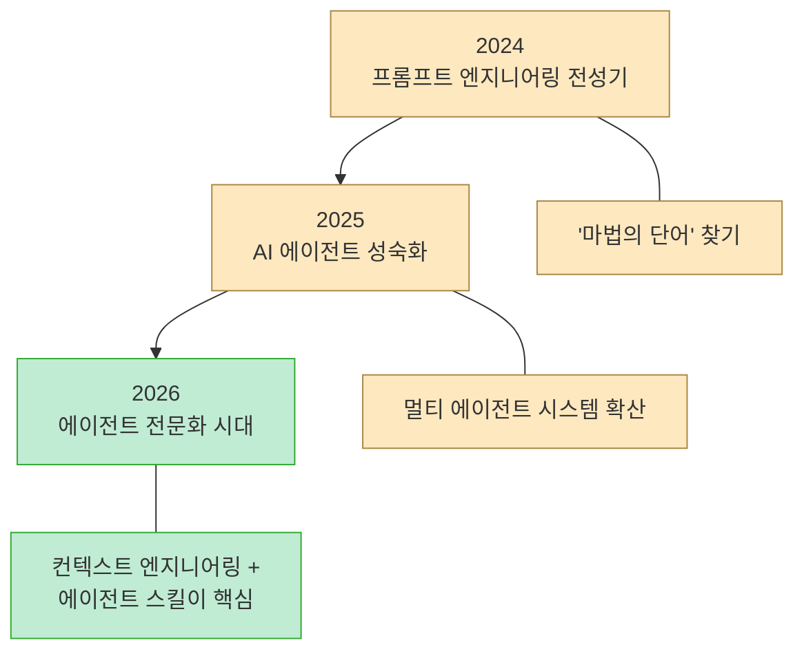
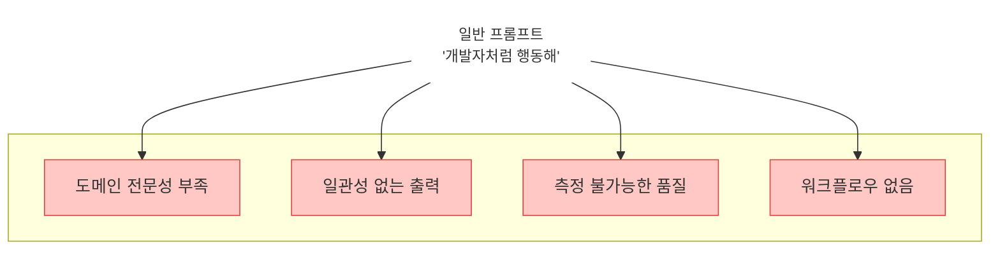
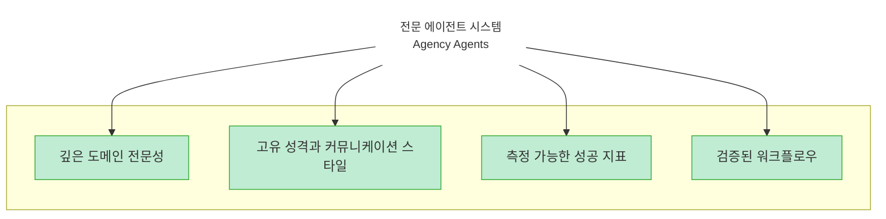
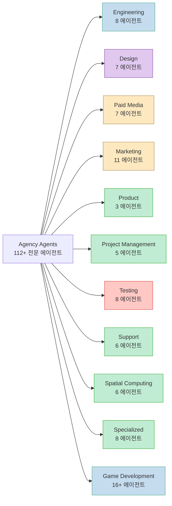
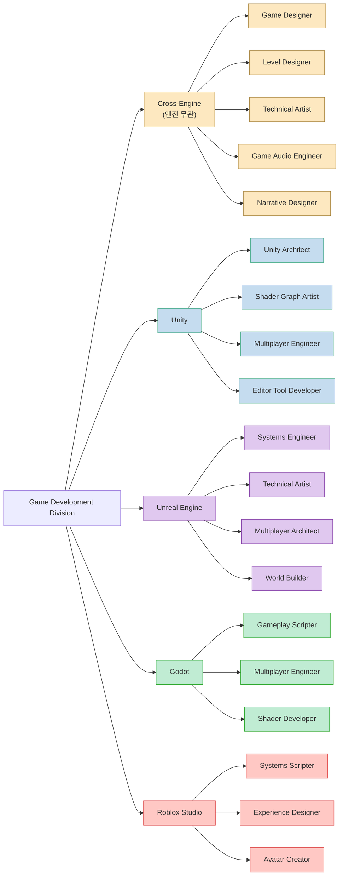
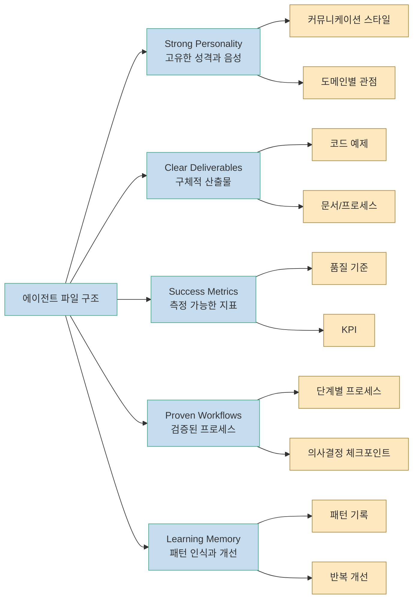
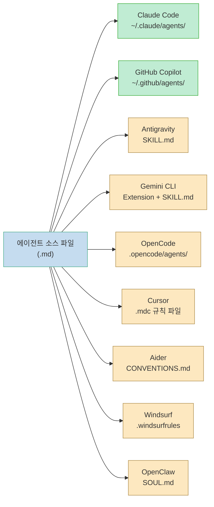
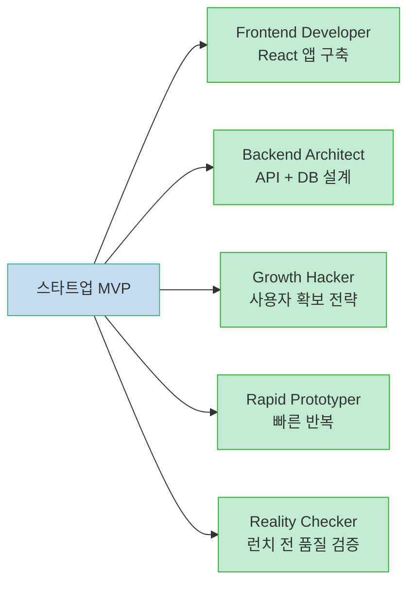
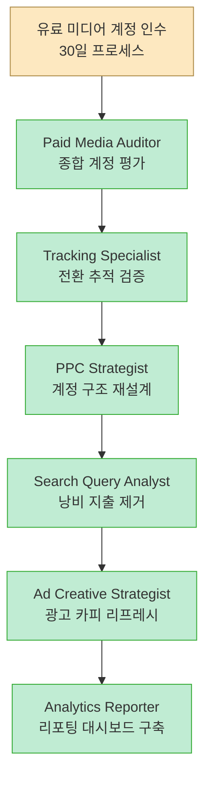
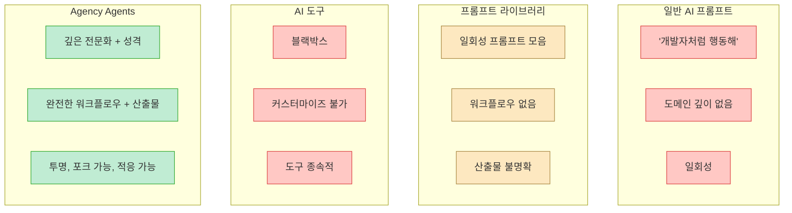

Reddit 커뮤니티에서 탄생해 수개월간 반복 개선된 **Agency Agents** 는 112개 이상의 전문화된 AI 에이전트 페르소나를 제공하는 오픈소스 프로젝트다. 단순한 프롬프트 템플릿이 아니라, 각 에이전트가 **고유한 성격** , **워크플로우** , **구체적인 산출물** , **성공 지표** 를 갖춘 완전한 에이전트 시스템이다. Claude Code, Cursor, Aider, Windsurf, Gemini CLI, OpenCode 등 주요 에이전틱 코딩 도구에서 즉시 사용할 수 있다.

<!--more-->

## Sources

- [msitarzewski/agency-agents (GitHub)](https://github.com/msitarzewski/agency-agents)

---

## 산업 트렌드: 범용 AI에서 전문 에이전트 시대로

Agency Agents를 이해하려면 먼저 업계의 큰 흐름을 짚어야 한다. 2025년 기업용 AI 지출에서 **수직적(Vertical) 전문 에이전트($10.8B)** 가 범용 AI($8.4B)를 처음으로 추월했다. 전문 에이전트 시스템은 범용 모델 대비 **배포 속도 90% 향상, 개발 비용 50% 절감** 이라는 실증적 이점이 보고되고 있다.



이제 프롬프트 엔지니어링은 "마법의 단어를 찾는 것"이 아니라, **커널 코드를 작성하는 것과 같은 엄격한 시스템 디자인** 으로 취급된다. 프롬프트가 "대화"라면, 에이전트 시스템은 "운영체제(OS)"에 해당한다. Agency Agents는 바로 이 전환점에서 탄생한 프로젝트다.

---

## 일반 프롬프트의 한계, 왜 전문 에이전트인가

AI 코딩 어시스턴트를 사용할 때 흔히 "개발자처럼 행동해" 같은 일반적인 프롬프트를 작성한다. 하지만 이런 범용 프롬프트는 **도메인 깊이가 부족** 하고, 일관된 품질을 보장하지 못한다. Agency Agents는 이 문제에 대한 근본적인 해법을 제시한다.





Agency Agents의 핵심 차별점은 다음 네 가지 설계 원칙에 있다:

- **전문화(Specialized)**: 범용 템플릿이 아닌, 각 도메인에 깊이 있는 전문성을 보유
- **성격 기반(Personality-Driven)**: 고유한 음성, 커뮤니케이션 스타일, 접근 방식
- **산출물 중심(Deliverable-Focused)**: 실제 코드, 프로세스, 측정 가능한 결과물
- **프로덕션 대응(Production-Ready)**: 실전에서 검증된 워크플로우와 성공 지표

> "Act as a developer" 같은 일반 프롬프트와 달리, 각 에이전트는 현실의 전문가처럼 **자기만의 관점** 과 **업무 방식** 을 가진다.

---

## 프로젝트 개요와 규모

Agency Agents는 `msitarzewski/agency-agents` GitHub 저장소로 관리되며, MIT 라이선스로 공개되어 있다. Reddit의 AI 에이전트 전문화 논의에서 탄생했으며, 공개 12시간 만에 50건 이상의 요청을 받았다.

| 항목 | 수치 |
|------|------|
| 전문 에이전트 수 | 112+ |
| 디비전(부서) | 11개 |
| 코드 라인 수 | 10,000+ |
| 지원 도구 | 9개 (Claude Code, Copilot, Cursor, Aider, Windsurf, Gemini CLI, Antigravity, OpenCode, OpenClaw) |
| 라이선스 | MIT |
| 커뮤니티 번역 | 중국어 간체 (100+ 에이전트 번역) |

---

## 11개 디비전 구조: 완전한 AI 에이전시

Agency Agents의 가장 두드러지는 특징은 실제 에이전시 조직처럼 **디비전(부서) 단위** 로 에이전트를 구성한다는 점이다. 각 디비전은 명확한 역할 경계를 가지며, 실제 프로젝트에서 팀을 조립하듯 필요한 에이전트를 골라 쓸 수 있다.



### Engineering Division (엔지니어링)

소프트웨어 개발의 핵심 역할을 담당하는 8개 에이전트로 구성된다:

| 에이전트 | 전문 영역 | 활용 시점 |
|---------|----------|----------|
| Frontend Developer | React/Vue/Angular, UI 구현, 성능 | 모던 웹앱, Core Web Vitals 최적화 |
| Backend Architect | API 설계, DB 아키텍처, 확장성 | 서버 시스템, 마이크로서비스 |
| Mobile App Builder | iOS/Android, React Native, Flutter | 네이티브 및 크로스플랫폼 모바일 |
| AI Engineer | ML 모델, 배포, AI 통합 | ML 기능, 데이터 파이프라인 |
| DevOps Automator | CI/CD, 인프라 자동화 | 파이프라인, 배포, 모니터링 |
| Rapid Prototyper | 빠른 POC, MVP | 해커톤, 빠른 반복 |
| Senior Developer | Laravel/Livewire, 고급 패턴 | 복잡한 구현, 아키텍처 결정 |
| Security Engineer | 위협 모델링, 보안 코드 리뷰 | 보안 아키텍처, 취약점 평가 |

### Design Division (디자인)

UI/UX 전문가 7명이 포진해 있다. 특히 **Whimsy Injector** 는 마이크로 인터랙션, 이스터에그 등 즐거움을 더하는 독특한 역할을 맡는다.

> "모든 장난스러운 요소는 기능적이거나 감정적 목적에 봉사해야 한다. 방해가 아닌 향상시키는 기쁨을 디자인하라." — **Whimsy Injector**

### Marketing Division (마케팅)

11개 에이전트가 플랫폼별로 특화되어 있다. Reddit Community Builder, TikTok Strategist, Xiaohongshu Specialist, WeChat Official Account Manager 등 **플랫폼별 전문가** 가 따로 존재한다는 점이 인상적이다.

> "Reddit에서 마케팅하는 게 아니다 — 브랜드를 대표하는 커뮤니티의 가치 있는 구성원이 되는 것이다." — **Reddit Community Builder**

### Testing Division (테스팅)

8개 에이전트가 QA의 전 영역을 커버한다. Evidence Collector는 스크린샷 기반 QA를, Reality Checker는 증거 기반 인증과 품질 게이트를, Accessibility Auditor는 WCAG 준수 감사를 담당한다.

> "코드를 테스트하는 것이 아니다 — 기본적으로 3-5개 이슈를 찾아내고, 모든 것에 시각적 증거를 요구한다." — **Evidence Collector**

### Game Development Division (게임 개발)

가장 세분화된 디비전으로, 엔진별로 특화된 에이전트를 제공한다:



Unity Architect는 ScriptableObjects와 DOTS/ECS를, Unreal Systems Engineer는 C++/Blueprint 하이브리드와 GAS(Gameplay Ability System)를, Godot Gameplay Scripter는 GDScript 2.0과 정적 타이핑을 전문으로 한다. 각 엔진의 고유한 아키텍처 패턴에 맞춤화된 전문성을 제공하는 것이 핵심이다.

### 기타 디비전

- **Paid Media Division** (7): PPC 전략, 검색 쿼리 분석, 트래킹 전문가 등 유료 광고 집행 전문
- **Product Division** (3): 스프린트 우선순위, 트렌드 리서치, 피드백 종합
- **Project Management Division** (5): 스튜디오 프로듀서, 프로젝트 셰퍼드, A/B 테스트 트래커
- **Support Division** (6): 고객 지원, 애널리틱스, 재무 추적, 인프라 유지보수, 법률 준수
- **Spatial Computing Division** (6): XR 인터페이스, visionOS, WebXR, Metal 엔지니어링
- **Specialized Division** (8): 에이전트 오케스트레이터, LSP/인덱스 엔지니어, Agentic Identity 아키텍트

---

## 에이전트 설계 철학: 5가지 핵심 원칙

각 에이전트 파일은 단순한 프롬프트가 아니라, 아래 5가지 요소를 모두 갖춘 **완전한 에이전트 시스템** 이다:



에이전트 파일의 실제 구조는 다음 항목을 포함한다:

1. **Frontmatter**: 이름, 설명, 색상 등 메타데이터
2. **Identity & Memory**: 에이전트의 정체성과 기억 체계
3. **Core Mission**: 핵심 임무 정의
4. **Critical Rules**: 도메인별 필수 규칙
5. **Technical Deliverables**: 코드 예제를 포함한 구체적 산출물
6. **Workflow Process**: 단계별 업무 프로세스
7. **Success Metrics**: 측정 가능한 성공 기준

이 구조 덕분에 에이전트는 단순히 "역할극"을 하는 것이 아니라, **실제 전문가가 업무를 수행하는 방식** 으로 동작한다.

---

## 멀티 도구 통합: 9개 에이전틱 코딩 도구 지원

Agency Agents의 또 다른 강점은 **단일 소스에서 다수의 도구로 변환** 할 수 있다는 점이다. 한 번 에이전트를 작성하면, 변환 스크립트를 통해 모든 주요 에이전틱 코딩 도구에서 사용할 수 있다.



### 도구별 통합 방식

| 도구 | 변환 필요 | 설치 경로 | 특징 |
|------|----------|----------|------|
| Claude Code | 없음 (네이티브) | `~/.claude/agents/` | `.md` 파일 직접 사용 |
| GitHub Copilot | 없음 (네이티브) | `~/.github/agents/` | `.md` 파일 직접 사용 |
| Antigravity | 변환 필요 | `~/.gemini/antigravity/skills/` | 에이전트별 `SKILL.md` |
| Gemini CLI | 변환 필요 | `~/.gemini/extensions/` | 확장 + 매니페스트 |
| OpenCode | 변환 필요 | `.opencode/agents/` | 프로젝트 스코프 |
| Cursor | 변환 필요 | `.cursor/rules/` | `.mdc` 규칙 파일 |
| Aider | 변환 필요 | `./CONVENTIONS.md` | 단일 파일 통합 |
| Windsurf | 변환 필요 | `./.windsurfrules` | 단일 파일 통합 |

### 설치 프로세스

설치는 2단계로 진행된다:

```bash
# 1단계: 모든 도구용 통합 파일 생성
./scripts/convert.sh

# 2단계: 대화형 설치 (시스템 자동 감지)
./scripts/install.sh
```

설치 스크립트는 시스템에 설치된 도구를 자동 감지하고, 체크박스 UI를 통해 원하는 도구만 선택하여 설치할 수 있다. 특정 도구만 타겟팅하는 것도 가능하다:

```bash
./scripts/install.sh --tool cursor
./scripts/install.sh --tool opencode
./scripts/install.sh --tool antigravity
```

CI/스크립트 환경에서는 비대화형 모드를 사용한다:

```bash
./scripts/install.sh --no-interactive --tool all
```

---

## 실전 활용 시나리오: 팀 조립 패턴

Agency Agents의 진정한 가치는 **시나리오별로 적합한 에이전트를 조합** 하여 가상 팀을 구성하는 데 있다. 프로젝트 README에서 제시하는 주요 시나리오를 살펴보자.

### 시나리오 1: 스타트업 MVP 빌드



5명의 전문 에이전트가 각 단계에서 전문성을 발휘하여 **빠른 출시와 품질을 동시에** 확보한다.

### 시나리오 2: 마케팅 캠페인 런칭

Content Creator, Twitter Engager, Instagram Curator, Reddit Community Builder, Analytics Reporter 5명이 **플랫폼별 전문 전략** 을 실행하며, 멀티채널 캠페인을 조율한다.

### 시나리오 3: 엔터프라이즈 기능 개발

Senior Project Manager가 스코핑을, Senior Developer가 복잡한 구현을, UI Designer가 디자인 시스템을, Experiment Tracker가 A/B 테스트를, Evidence Collector와 Reality Checker가 품질 게이트를 담당한다. **엔터프라이즈급 품질 보증 프로세스** 가 에이전트 조합으로 구현된다.

### 시나리오 4: 유료 미디어 계정 인수



6명의 에이전트가 순차적으로 투입되어 **30일 이내에 체계적인 계정 인수** 를 완료한다.

### 시나리오 5: 풀 에이전시 프로덕트 디스커버리

가장 야심찬 시나리오로, 8개 디비전이 **병렬로** 하나의 미션에 투입된다. Nexus Spatial Discovery Exercise 예제에서는 Product Trend Researcher, Backend Architect, Brand Guardian, Growth Hacker, Support Responder, UX Researcher, Project Shepherd, XR Interface Architect가 동시에 배치되어 시장 검증, 기술 아키텍처, 브랜드 전략, GTM, 지원 시스템, UX 리서치, 프로젝트 실행, 공간 UI 설계를 포괄하는 **종합 제품 청사진** 을 단일 세션에서 생산한다.

---

## 에이전트 성격의 실제: 인용으로 보는 개성

Agency Agents의 각 에이전트는 기계적 응답이 아닌, **독립적인 관점을 가진 전문가** 처럼 소통한다. 몇 가지 대표 인용을 통해 에이전트 성격의 깊이를 확인할 수 있다:

| 에이전트 | 인용 | 디비전 |
|---------|------|--------|
| Evidence Collector | "코드를 테스트하는 게 아니다 — 기본 3-5개 이슈를 찾고, 모든 것에 시각적 증거를 요구한다" | Testing |
| Reddit Community Builder | "Reddit에서 마케팅하는 게 아니다 — 브랜드를 대표하며 커뮤니티의 가치 있는 구성원이 되는 것" | Marketing |
| Whimsy Injector | "태스크 완료 불안을 40% 줄이는 축하 애니메이션을 추가하겠다" | Design |

이러한 성격 설정은 단순한 분위기 조성이 아니라, 에이전트가 **특정 관점에서 일관되게 의사결정** 하도록 유도하는 프레임워크다.

---

## 기존 접근 방식과의 차이점



| 비교 항목 | 일반 프롬프트 | 프롬프트 라이브러리 | AI 도구 | Agency Agents |
|----------|-------------|-----------------|--------|---------------|
| 전문성 | 범용 | 일부 특화 | 도구 내장 | 깊은 도메인 전문화 |
| 성격 | 없음 | 없음 | 없음 | 고유한 관점과 음성 |
| 워크플로우 | 없음 | 없음 | 내장 | 검증된 단계별 프로세스 |
| 산출물 | 불명확 | 가이드 수준 | 도구 의존 | 구체적 코드/문서 |
| 커스터마이즈 | 수동 편집 | 복사-붙여넣기 | 제한적 | 완전 포크/수정 가능 |
| 멀티 도구 | 도구별 재작성 | 도구별 재작성 | 단일 도구 | 9개 도구 자동 변환 |

---

## 빠른 시작 가이드

### 방법 1: Claude Code에서 직접 사용 (권장)

```bash
# 에이전트를 Claude Code 디렉토리로 복사
cp -r agency-agents/* ~/.claude/agents/

# Claude Code 세션에서 에이전트 활성화
# "Frontend Developer 에이전트를 사용해서 React 컴포넌트를 빌드해줘"
```

### 방법 2: 레퍼런스로 활용

에이전트 파일을 직접 탐색하며, 각 에이전트의 정체성, 워크플로우, 기술 산출물, 성공 지표를 참고하여 자신만의 에이전트를 구성한다.

### 방법 3: 다른 도구에서 사용

```bash
# 통합 파일 생성 후 대화형 설치
./scripts/convert.sh
./scripts/install.sh
```

---

## 기여 및 확장 방법

Agency Agents는 오픈소스 프로젝트로, 새 에이전트 추가, 기존 에이전트 개선, 성공 사례 공유가 가능하다.

새 에이전트를 추가하려면:

1. 저장소 포크
2. 적절한 카테고리에 새 에이전트 파일 생성
3. 에이전트 템플릿 구조를 따를 것:
   - Frontmatter (이름, 설명, 색상)
   - Identity & Memory
   - Core Mission
   - Critical Rules
   - Technical Deliverables + 코드 예제
   - Workflow Process
   - Success Metrics
4. PR 제출

커뮤니티 번역도 활발하다. 현재 중국어 간체(zh-CN) 버전이 100개 이상의 에이전트 번역과 9개의 중국 시장 전용 에이전트를 포함하여 관리되고 있다.

---

## 로드맵

프로젝트의 향후 계획은 다음과 같다:

- 대화형 에이전트 선택 웹 도구
- 에이전트 설계 비디오 튜토리얼
- 커뮤니티 에이전트 마켓플레이스
- 프로젝트 매칭용 에이전트 "성격 퀴즈"
- "이주의 에이전트" 쇼케이스 시리즈

이미 완료된 항목:
- 멀티 에이전트 워크플로우 예제
- 멀티 도구 통합 스크립트 (9개 도구)

---

## 핵심 요약

- **Agency Agents** 는 112개 이상의 전문화된 AI 에이전트 페르소나를 제공하는 MIT 라이선스 오픈소스 프로젝트
- 각 에이전트는 단순 프롬프트가 아닌, **고유 성격 + 워크플로우 + 산출물 + 성공 지표** 를 갖춘 완전한 시스템
- **11개 디비전** (엔지니어링, 디자인, 마케팅, 테스팅, 게임 개발 등)으로 구성, 실제 에이전시처럼 팀을 조립하여 사용
- Claude Code, Cursor, Aider, Windsurf, Gemini CLI 등 **9개 에이전틱 코딩 도구** 에서 자동 변환하여 사용 가능
- Reddit 커뮤니티에서 탄생, 12시간 만에 50건 이상 요청을 받으며 검증
- 게임 개발 디비전은 Unity, Unreal, Godot, Roblox **엔진별 전문 에이전트** 를 제공
- 각 에이전트의 **독립적 성격** 이 일관된 도메인 의사결정을 유도하는 프레임워크로 작동
- 에이전트 파일 구조가 표준화되어 있어 **커스터마이즈와 기여가 용이**

---

## 결론

AI 코딩 어시스턴트의 시대에서, "하나의 AI가 모든 것을 처리한다"는 접근은 한계에 도달하고 있다. Agency Agents는 **전문화된 에이전트의 조합이 범용 AI보다 우수한 결과를 낸다** 는 철학을 실체로 구현한 프로젝트다.

단순히 좋은 프롬프트를 모아놓은 것이 아니라, 각 에이전트가 자신만의 성격, 업무 방식, 품질 기준을 가진 **가상의 전문가 팀** 이다. 9개 도구로의 자동 변환 지원은 특정 도구에 종속되지 않고 에이전트 자산을 활용할 수 있게 한다.

스타트업 MVP를 빠르게 출시하든, 엔터프라이즈 기능을 체계적으로 개발하든, 마케팅 캠페인을 멀티채널로 집행하든 — 프로젝트의 성격에 맞는 전문가 팀을 **코드 한 줄 없이** 조립할 수 있다는 점이 이 프로젝트의 핵심 가치다.
