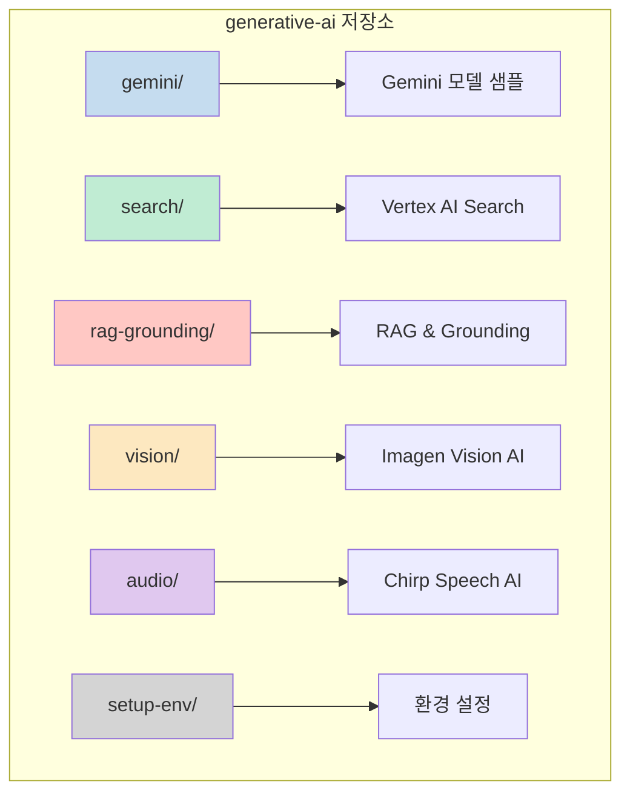
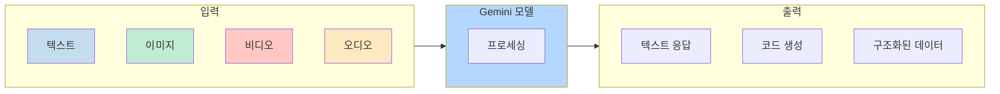
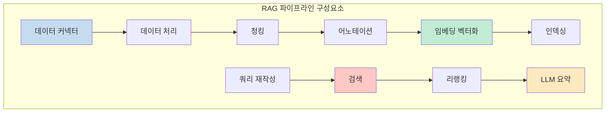
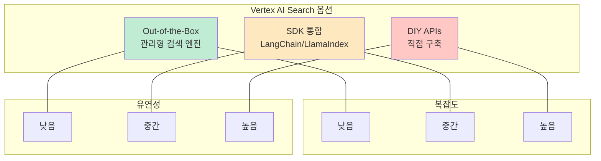
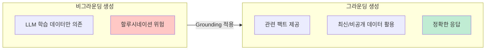
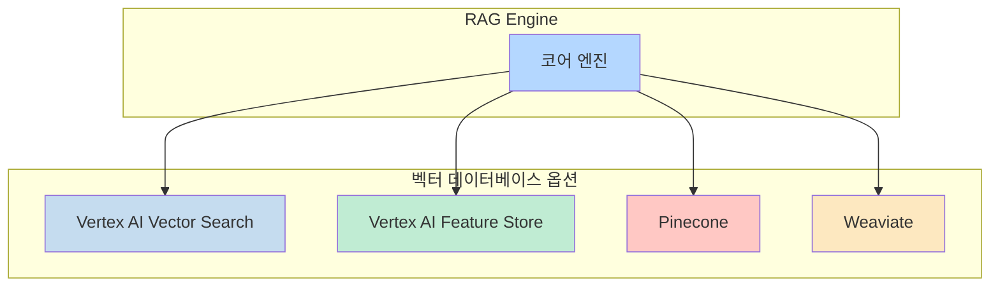
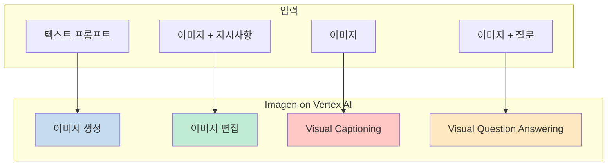
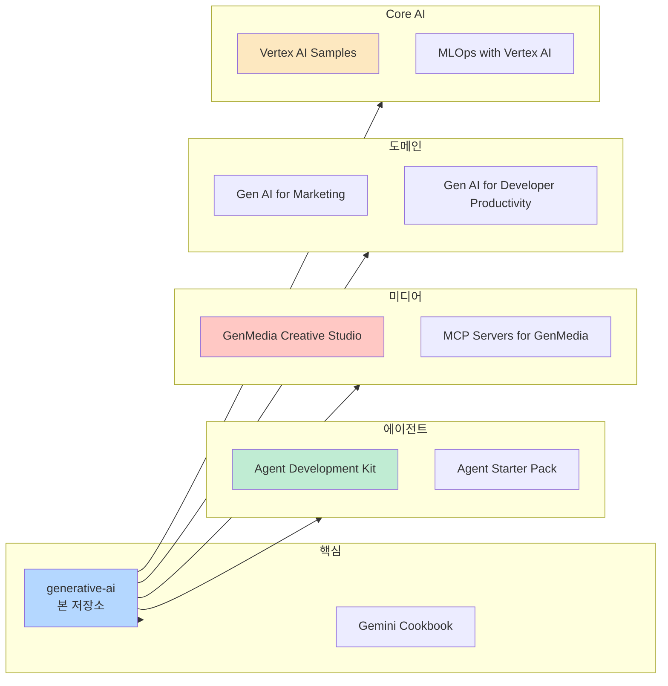
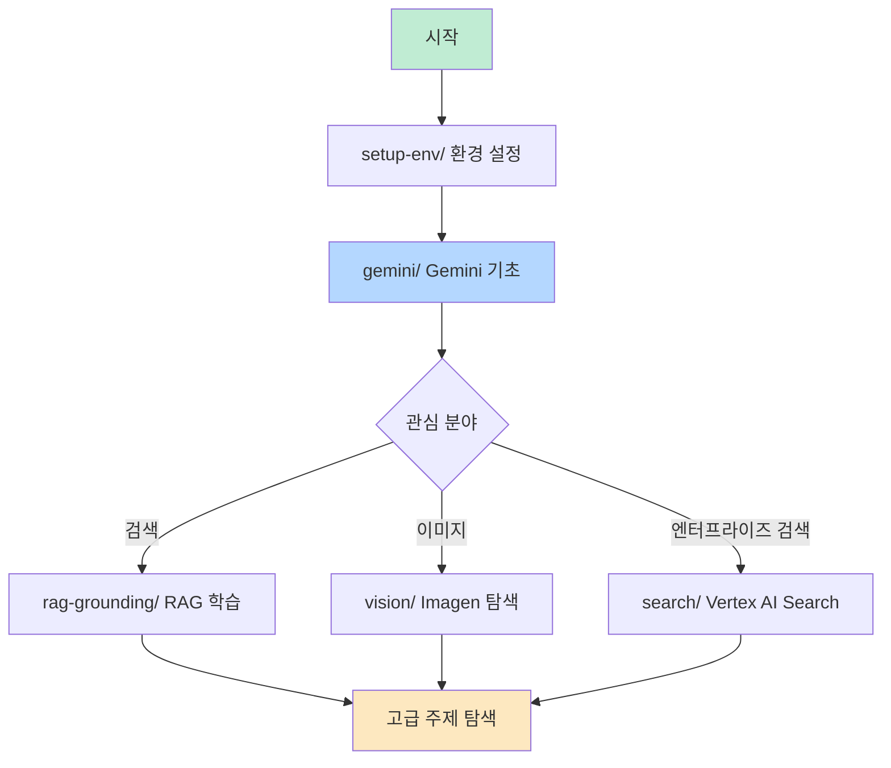

Google Cloud의 공식 Generative AI 저장소는 Vertex AI와 Gemini를 활용한 생성형 AI 개발을 위한 종합적인 리소스 모음입니다. 이 글에서는 저장소의 구조와 주요 기능, 활용 방법을 상세히 정리합니다.

<!--more-->

## Sources

- [GoogleCloudPlatform/generative-ai - GitHub](https://github.com/GoogleCloudPlatform/generative-ai)

## 저장소 개요

GoogleCloudPlatform/generative-ai 저장소는 Google Cloud Vertex AI에서 생성형 AI 워크플로를 사용, 개발, 관리하는 방법을 보여주는 노트북, 코드 샘플, 샘플 앱, 기타 리소스를 포함하고 있습니다. 최신 모델인 **Gemini 3.1 Pro** 출시에 맞춰 관련 노트북과 데모도 지속적으로 업데이트되고 있습니다.

### 저장소 구조

| 디렉토리 | 설명 |
| --- | --- |
| `gemini/` | Gemini 시작 노트북, 유즈케이스, Function Calling, 샘플 앱 |
| `search/` | Vertex AI Search를 활용한 검색 엔진 구축 (구 Enterprise Search) |
| `rag-grounding/` | RAG, Grounding 기법, 벡터 검색, 시맨틱 검색 |
| `vision/` | Imagen on Vertex AI - 이미지 생성, 편집, 캡셔닝, VQA |
| `audio/` | Chirp (Universal Speech Model) 기반 음성 AI |
| `setup-env/` | Google Cloud, Vertex AI Python SDK, 노트북 환경 설정 |

## Gemini 모델 활용

Gemini 디렉토리는 Google의 최신 멀티모달 모델인 Gemini를 활용하는 다양한 예제를 제공합니다.

### Gemini 주요 기능

**Gemini 1.5 Pro**는 **200만 토큰**의 입력 컨텍스트 윈도우를 지원하며, 이는 약 2,000 페이지 분량의 문서를 처리할 수 있는 용량입니다. 이를 통해:

- 대규모 문서 분석
- 멀티모달 추론 (텍스트, 이미지, 비디오, 오디오 동시 처리)
- 캐싱 기능으로 비용 최적화
- 긴 컨텍스트 윈도우와 RAG 결합 가능

## Vertex AI Search

Vertex AI Search는 수십 년간 축적된 Google의 정보 검색 전문 지식을 활용하여 엔터프라이즈급 검색 애플리케이션을 구축할 수 있는 관리형 서비스입니다.

### RAG 시스템 구축의 복잡성

RAG 시스템을 직접 구축하면 데이터 커넥터, 청킹, 임베딩, 인덱싱, 쿼리 재작성, 리랭킹, LLM 요약 등 많은 구성 요소를 개발하고 유지 관리해야 합니다. 대규모 트래픽과 빈번한 데이터 업데이트를 처리하는 것도 어려운 과제입니다.

### Vertex AI Search Out-of-the-Box 장점

Vertex AI Search는 이러한 복잡성을 해결하는 관리형 솔루션입니다:

| 기능 | 설명 |
| --- | --- |
| **내장 데이터 커넥터** | Cloud Storage, BigQuery, 웹사이트, Confluence, Jira, Salesforce, Slack 등 |
| **문서 레이아웃 파서** | 페이지 간 청크 조직, 임베디드 테이블 처리, 이미지 어노테이션, 헤딩 계층 메타데이터 추적 |
| **하이브리드 검색** | 키워드(Sparse) + LLM 기반(Dense) 임베딩 결합 |
| **신경 매칭** | 쿼리 의도와 문서 간 관계 학습으로 단순 유사도 검색 이상의 정확도 |
| **LLM 요약** | 인용 포함 요약 제공, 커스텀 LLM 명령 템플릿 지원 |

### 검색 옵션 비교

개발자는 자신의 개발 단계와 선호하는 오케스트레이션 프레임워크에 따라 Vertex AI Search의 Out-of-the-Box 기능을 사용하거나, SDK를 통한 커스터마이징, 또는 DIY API로 전체 RAG 애플리케이션을 직접 구축할 수 있습니다.

## RAG & Grounding

RAG(Retrieval Augmented Generation)와 Grounding은 LLM의 할루시네이션을 줄이고 정확성을 높이는 핵심 기법입니다.

### Grounding 개념

- **비그라운딩 생성**: LLM 학습 데이터에만 의존하여, 올바른 팩트가 없을 경우 할루시네이션 발생
- **Grounding**: LLM에 관련 팩트를 입력/프롬프트의 일부로 제공하여 최신 및 비공개 데이터 활용
- **RAG**: 검색을 통해 관련 팩트를 검색하여 LLM에 제공하는 기법

### RAG Engine

Vertex AI의 RAG Engine은 LLM 애플리케이션 개발을 위한 데이터 프레임워크입니다. 다양한 벡터 데이터베이스와 통합할 수 있습니다:

### RAG 품질 평가

저장소에서는 RAG 시스템 품질 평가를 위한 여러 노트북을 제공합니다:

| 노트북 | 설명 |
| --- | --- |
| `evaluate_rag_gen_ai_evaluation_service_sdk.ipynb` | Gen AI Evaluation Service SDK를 사용한 참조 기반/참조 없는 평가 |
| `ragas_with_gemini.ipynb` | RAGAS 프레임워크와 Gemini를 활용한 Q&A 평가 |
| `deepeval_with_gemini.ipynb` | DeepEval과 Pytest 통합으로 Gemini 성능 평가 |

## Vision AI (Imagen)

Vision 디렉토리는 Google Cloud의 Imagen 모델을 활용한 이미지 생성, 편집, 분석 예제를 제공합니다.

### Imagen 기능

**Imagen 3**는 최신 텍스트-이미지 생성 모델로, 고품질 이미지를 생성합니다.

### 주요 유즈케이스

- **이미지 생성**: 텍스트 프롬프트로 이미지 생성
- **이미지 편집**: 텍스트 지시사항으로 이미지 수정, 마스크 모드 지원
- **Visual Captioning**: 이미지 내용 설명 캡션 생성
- **Visual Question Answering**: 이미지에 대한 질문에 답변
- **고급 프롬프팅**: Imagen 2 결과 향상을 위한 프롬프팅 기법
- **Gemini + Imagen 결합**: 고품질 비주얼 에셋 생성
- **브로셔 제작**: Imagen을 활용한 크리에이티브 브로셔 디자인

## 관련 저장소 및 생태계

Google Cloud는 생성형 AI 개발을 지원하는 다양한 관련 저장소를 운영합니다:

### 주요 관련 저장소

| 저장소 | 설명 |
| --- | --- |
| **Agent Development Kit (ADK) Samples** | ADK 기반 에이전트 샘플 - 단순 봇부터 복잡한 멀티 에이전트까지 |
| **Agent Starter Pack** | 프로덕션 준비된 Gen AI 에이전트 템플릿 모음 |
| **Gemini Cookbook** | Gemini 관련 심화 예제 |
| **Vertex AI GenMedia Creative Studio** | 생성형 미디어 파운데이션 모델 + 커스텀 워크플로 체험 |
| **MCP Servers for GenMedia** | 에이전트에 생성형 미디어 도구 제공 |
| **Vertex AI Samples** | Vertex AI 핵심 기능 샘플 |
| **MLOps with Vertex AI** | Vertex AI 기반 MLOps |

## 시작하기

### 환경 설정

`setup-env/` 디렉토리에서 다음을 확인할 수 있습니다:

1. **Google Cloud 프로젝트 설정**
2. **Vertex AI Python SDK 설치**
3. **노트북 환경 설정** (Google Colab, Vertex AI Workbench)

### 추천 시작 경로

## 핵심 요약

1. **종합 리소스**: GoogleCloudPlatform/generative-ai는 Gemini, Vertex AI Search, RAG, Vision AI 등 생성형 AI 개발에 필요한 모든 샘플 코드와 노트북을 포함
2. **Gemini 3.1 Pro**: 최신 모델 지원과 200만 토큰 컨텍스트 윈도우로 대규모 문서 처리 가능
3. **Vertex AI Search**: Out-of-the-Box 솔루션으로 복잡한 RAG 파이프라인 없이도 Google 품질의 검색 엔진 구축 가능
4. **RAG Engine**: 다양한 벡터 데이터베이스(Vector Search, Pinecone, Weaviate 등)와 통합 가능한 관리형 RAG 프레임워크
5. **Imagen Vision AI**: 이미지 생성, 편집, 캡셔닝, VQA를 포함한 종합 비전 AI 기능
6. **평가 도구**: RAGAS, DeepEval 등 다양한 프레임워크를 활용한 RAG 품질 평가 노트북 제공
7. **에이전트 생태계**: Agent Development Kit과 Agent Starter Pack으로 프로덕션급 에이전트 개발 가속화

## 결론

GoogleCloudPlatform/generative-ai 저장소는 Google Cloud에서 생성형 AI를 개발하려는 개발자에게 필수적인 리소스입니다. Gemini의 강력한 멀티모달 기능부터 Vertex AI Search의 관리형 검색 솔루션, 그리고 RAG와 Grounding 기법까지, 엔터프라이즈급 AI 애플리케이션 구축에 필요한 모든 것이 체계적으로 정리되어 있습니다.

특히 RAG 시스템의 복잡성을 관리형 서비스로 해결하는 Vertex AI Search와, 다양한 벡터 데이터베이스와 통합 가능한 RAG Engine은 개발 생산성을 크게 높여줍니다. 저장소의 노트북과 샘플 코드를 직접 실행해보면서 Google Cloud의 생성형 AI 역량을 빠르게 익힐 수 있습니다.
