"유튜브는 레드오션이다. AI 채널은 이제 끝물이다"라는 말을 한 번쯤 들어보셨을 겁니다. 하지만 과연 정말 그럴까요? 2026년 현재 소리 소문 없이 폭발적으로 성장하고 있는 AI 채널들의 데이터를 직접 보면 이야기가 완전히 달라집니다.

<!--more-->

## Sources
- [https://www.youtube.com/watch?v=CEGe3Og1l_0](https://www.youtube.com/watch?v=CEGe3Og1l_0) - [극비] 2026년 AI 유튜브는 '이 장르'가 다 먹습니다 블루오션 빨리 선점하세요
- [https://www.youtube.com/watch?v=BLTdSwwJPNc](https://www.youtube.com/watch?v=BLTdSwwJPNc) - AI 활용해 경제학 유튜브 쉽게 만드는 방법 | 프로그램 무료 제공

## 2026년 AI 유튜브 현황: 폭발적인 성장 데이터

한국 채널인 "한 눈의 심리학"은 개설한 지 고작 한 달밖에 안 되었습니다. 업로드한 영상은 단 8개에 불과한데, 구독자는 이미 2만 명 가까이 되었고 누적 조회수는 70만을 넘어섰습니다. 보수적으로 잡아도 이 채널의 최소 월 수익은 3,000달러, 원화로 약 400만 원이 넘습니다.[^1]

[^1]: [https://youtu.be/CEGe3Og1l_0?t=10](https://youtu.be/CEGe3Og1l_0?t=10)

글로벌 시장으로 눈을 돌리면 "Norse"라는 채널이 있습니다. 개설한 지 고작 7개월밖에 안 되었고 업로드한 영상은 단 40개입니다. 하지만 구독자는 이미 8만 명을 돌파했고 누적 조회수는 천만 뷰를 달성했습니다. 예상 월 수익은 1,000만 원에 달합니다.[^2]

[^2]: [https://youtu.be/CEGe3Og1l_0?t=30](https://youtu.be/CEGe3Og1l_0?t=30)

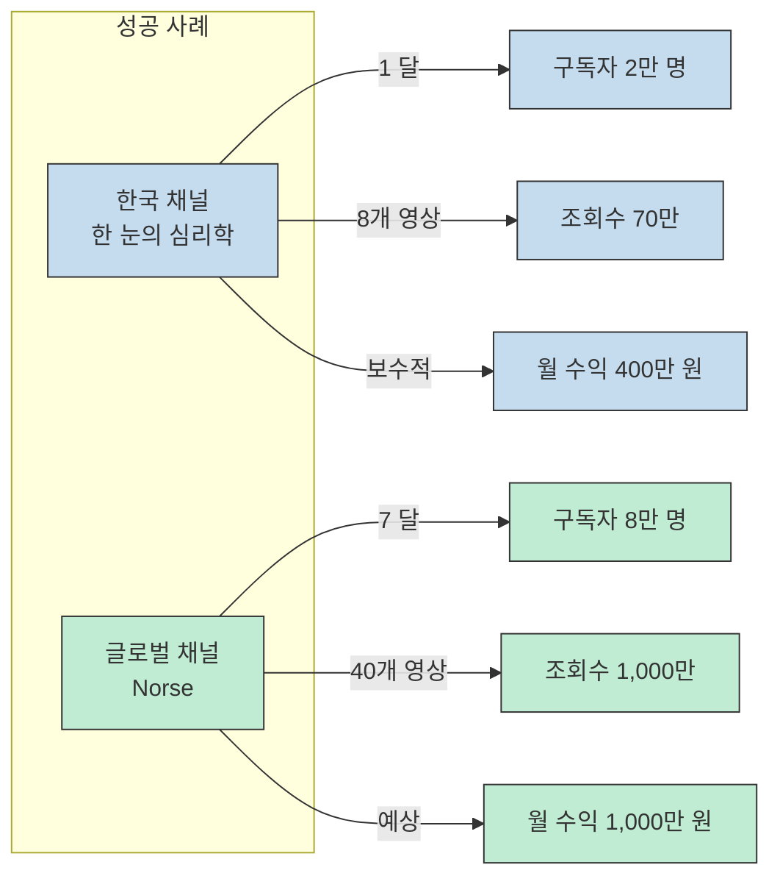

이 성공한 채널들의 공통점은 명확합니다. 첫째, 얼굴이 나오지 않습니다. 둘째, 제작비가 영원입니다. 셋째, 100% AI 툴로만 제작됩니다.[^3]

[^3]: [https://youtu.be/CEGe3Og1l_0?t=45](https://youtu.be/CEGe3Og1l_0?t=45)

하지만 여러분이 지금 당장 ChatGPT를 켜서 대본을 쓰고 영상을 만든다면 99% 확률로 실패합니다. 2026년 유튜브 알고리즘은 AI가 대충 만든 저질 콘텐츠를 걸러내는데 혈안이 되어 있기 때문입니다.[^4]

[^4]: [https://youtu.be/CEGe3Og1l_0?t=55](https://youtu.be/CEGe3Og1l_0?t=55)

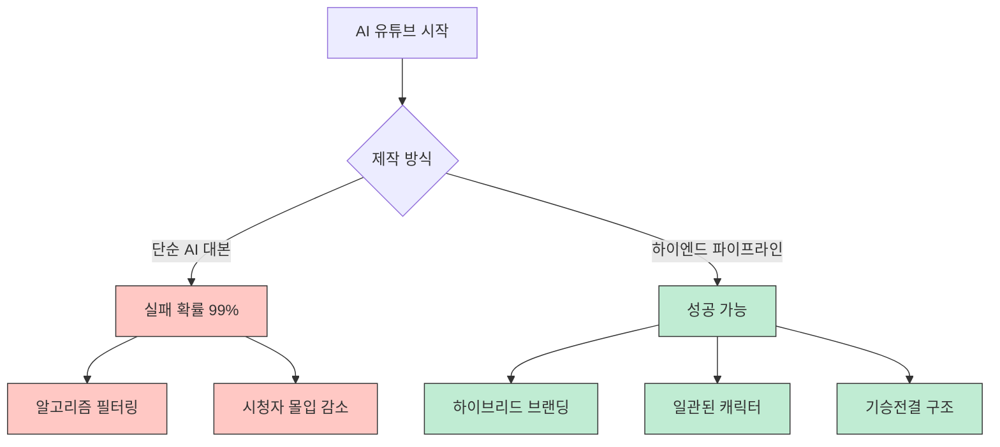

## 하이엔드 AI 심리학 채널 파이프라인

### 단계 1: 채널 브랜딩과 판 짜기

우리는 단순한 명언 채널이 아닌, 심리학과 자기 개발이 결합된 고단가 니치를 공략합니다. 이 분야는 광고 단가가 매우 높고 시청자의 체류 시간이 상당히 깁니다.[^5]

[^5]: [https://youtu.be/CEGe3Og1l_0?t=65](https://youtu.be/CEGe3Og1l_0?t=65)

먼저 채널명을 결정해야 합니다. AI에게 다음과 같이 명령을 내리세요:

> "심리학 및 동기 부여, 니치에 맞는 독창적이고 기억하기 쉬운 유튜브 채널 이름 20개를 생성하고 그 근거를 명확하게 달아줘. SEO 친화적이고 신뢰감을 주는 이름이어야 해."[^6]

[^6]: [https://youtu.be/CEGe3Og1l_0?t=75](https://youtu.be/CEGe3Og1l_0?t=75)

다음은 로고와 배너입니다. 디자이너를 고용할 필요가 없습니다. AI에게 다음과 같이 요청하세요:

> "채널명을 텍스트로 포함하고 깨끗하고 전문적인 심리학 스타일의 미니멀한 브랜드 로고를 만들어 줘."[^7]

[^7]: [https://youtu.be/CEGe3Og1l_0?t=95](https://youtu.be/CEGe3Og1l_0?t=95)

단시간 만에 전문 심리학 채널의 브랜드 로고가 탄생합니다.

### 단계 2: 샌드위치 프롬프트 기법으로 고퀄리티 대본 작성

많은 초보자들이 여기서 실수합니다. "심리학 영상 대본을 써줘"라고 대충 AI에게 말하죠. 그러면 AI는 누구나 다 뻔히 아는 소리를 늘어놓습니다.[^8]

[^8]: [https://youtu.be/CEGe3Og1l_0?t=110](https://youtu.be/CEGe3Og1l_0?t=110)

여기서는 **샌드위치 프롬프트 기법**을 사용합니다. 인간의 기획 사이에 AI를 끼워넣는 방식입니다.

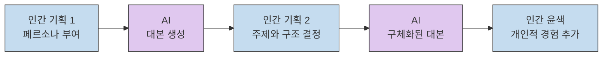

**스텝 1: 페르소나 부여**

AI에게 다음과 같이 명령하세요:

> "너는 구독자 100만 명을 보유한 심리학 전문 유튜버이자 10년차 방송 작가야. 시청자의 심리를 꿰뚫어 보는 통찰력 있는 대본을 써야 해."[^9]

[^9]: [https://youtu.be/CEGe3Og1l_0?t=120](https://youtu.be/CEGe3Og1l_0?t=120)

더 상세하게 작성해야 퀄리티 높은 유튜브 대본이 나옵니다:

- 시청 지속 시간을 위해 **기승전결** 구조로 세팅
- 영상에 3지점의 솔루션을 배치하여 원클릭 유도
- 정보에 대한 신뢰감을 제공하기 위해 해당 내용에 대한 신빙성이 높은 책이나 논문 등의 팩트를 함께 추출[^10]

[^10]: [https://youtu.be/CEGe3Og1l_0?t=125](https://youtu.be/CEGe3Og1l_0?t=125)

그리고 다음과 같이 형식을 지정하세요:

- 대본은 코드 블록으로 추출
- 줄당 50자가 넘으면 두 줄 박음 적용
- 순수하게 대본만 3,000자 이상 출력[^11]

[^11]: [https://youtu.be/CEGe3Og1l_0?t=135](https://youtu.be/CEGe3Og1l_0?t=135)

이렇게 하는 이유는, 그냥 뽑아 달라고 하면 구성이나 두레이션, 화면 효과 등을 모두 한꺼번에 붙여서 나오기 때문에 대본만을 가지고서 후속 이미지나 비디오 프롬프트를 추출하기가 복잡해지기 때문입니다.

**스텝 2: 주제와 구조**

주제는 바이럴 검증이 된 것으로 가야 합니다. 최근 인기 있는 주제 중 하나는 "생일을 아무렇지 않게 넘기는 사람들의 심리"입니다.[^12]

[^12]: [https://youtu.be/CEGe3Og1l_0?t=150](https://youtu.be/CEGe3Og1l_0?t=150)

이 주제에 대해 AI에게 아이디어를 요청하세요:

> "생일을 평범한 날처럼 생각하는 사람들의 심리 같은 주제로 아이디어를 다섯 개 제안해 줘. SEO에 특화되고 킹할 만한 소재를 찾아줘."[^13]

[^13]: [https://youtu.be/CEGe3Og1l_0?t=155](https://youtu.be/CEGe3Og1l_0?t=155)

선택한 아이디어를 바탕으로 대본을 생성하면 약 4,000자 정도의 대본이 나옵니다. 발표 시간으로 환산하면 약 9분 정도로, 처음 만들기에 적합한 길이입니다.[^14]

[^14]: [https://youtu.be/CEGe3Og1l_0?t=170](https://youtu.be/CEGe3Og1l_0?t=170)

**중요한 팁: 인간의 터치**

AI가 써준 대본을 그대로 읽지 마세요. 기계적인 말투를 빼야 합니다. 직접 읽어보면서 "아, 저도 예전에 이랬습니다" 같은 개인적인 경험담을 한두 줄씩 추가하세요. 그러면 구독자들은 공감을 통해 더욱더 영상에 몰입하게 됩니다.[^15]

[^15]: [https://youtu.be/CEGe3Og1l_0?t=180](https://youtu.be/CEGe3Og1l_0?t=180)

### 단계 3: 시각화와 마스터 캐릭터 전략

대부분의 AI 채널들은 여기서 망합니다. 컷마다 캐릭터 얼굴이 계속 바뀌기 때문입니다. 시청자는 여기서 몰입을 깨고 나가버립니다.[^16]

[^16]: [https://youtu.be/CEGe3Og1l_0?t=195](https://youtu.be/CEGe3Og1l_0?t=195)

그렇기 때문에 **마스터 캐릭터**를 만들어서 일관성을 유지하는 전략을 써야 합니다. 돈 한 푼 들이지 않고 만들 수 있습니다.

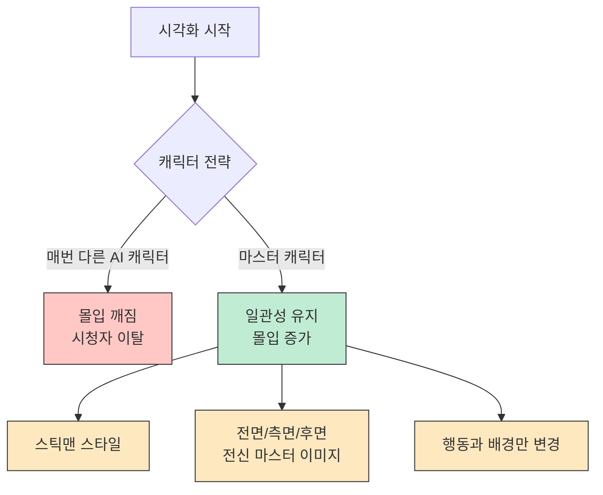

**스틱맨 캐릭터의 이점**

경제학 AI 채널에서 많이 사용하는 졸라맨 캐릭터는 명확한 이유가 있습니다:

1. **일관성**: AI로 여러 개의 캐릭터를 만들면 각각의 특징이 강해 일관성이 깨지기 쉽습니다. 하지만 졸라맨처럼 단순한 캐릭터는 조금씩 달라져도 사람들이 같은 캐릭터로 인지합니다.[^17]

[^17]: [https://youtu.be/CEGe3Og1l_0?t=210](https://youtu.be/CEGe3Og1l_0?t=210)

2. **특장점 명확**: 단순한 형태라 특장점이 상당히 명확합니다.

**마스터 캐릭터 만들기**

구글에서 "stickman"으로 검색하면 다양한 졸라맨 캐릭터가 나옵니다. 원하는 스타일을 골라 AI에 첨부한 후 다음과 같이 명령하세요:

> "이 캐릭터의 전면, 후면, 측면, 전신이 모두 나온 마스터 캐릭터를 만들어 줘."[^18]

[^18]: [https://youtu.be/CEGe3Og1l_0?t=220](https://youtu.be/CEGe3Og1l_0?t=220)

그다음 만든 대본을 이미지 프롬프트로 변환하세요. 그러면 모든 장면에 대한 이미지 프롬프트가 출력됩니다. 여기서 순수하게 이미지 프롬프트만 남겨야 합니다.[^19]

[^19]: [https://youtu.be/CEGe3Og1l_0?t=230](https://youtu.be/CEGe3Og1l_0?t=230)

### 단계 4: Auto-Whisk로 이미지 대량 생성

컷이 약 90개가 나오는데, 일일이 수동으로 이미지를 뽑기에는 시간이 너무 오래 걸립니다. **Auto-Whisk**라는 크롬 확장 프로그램을 사용하면 자동으로 처리할 수 있습니다.[^20]

[^20]: [https://youtu.be/CEGe3Og1l_0?t=250](https://youtu.be/CEGe3Og1l_0?t=250)

**Auto-Whisk 사용법**

1. 구글에서 "autowhisk"를 검색하여 설치
2. 확장 프로그램에서 Auto-Whisk 아이콘 클릭
3. 버전 7.5.12 선택 후 "autowhisk" 클릭
4. 구글의 **Whisk**로 자동 이동
5. 프로젝트를 열고 마스터 이미지를 피사체에 넣기
6. AI에서 출력한 프롬프트를 Auto-Whisk에 복사
7. "Start" 후 "on project" 클릭[^21]

[^21]: [https://youtu.be/CEGe3Og1l_0?t=255](https://youtu.be/CEGe3Og1l_0?t=255)

그러면 90장의 이미지가 완전히 자동으로 출력되고 저장됩니다. 스타일은 그대로 유지된 채 행동과 배경만 바뀝니다. 이것만으로도 많은 부분이 자동화됩니다.[^22]

[^22]: [https://youtu.be/CEGe3Og1l_0?t=275](https://youtu.be/CEGe3Og1l_0?t=275)

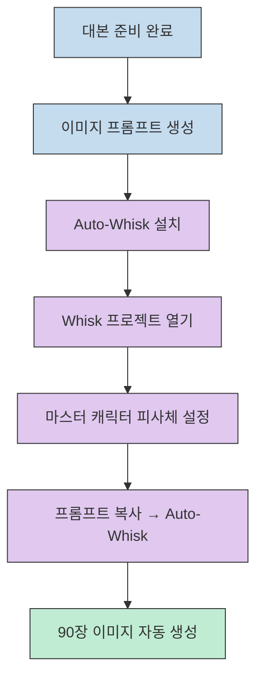

### 단계 5: Runway로 움직임 추가

이미지가 준비되면 이제 움직임을 줄 차례입니다. 구글에서 "Runway"를 검색하여 이미지 탭으로 이동하세요.

**중요한 꿀팁**: Runway를 쓸 때는 설정에서 **자동 비디오 생성 기능을 반드시 꺼주세요**. 그렇지 않으면 이미지를 올리자마자 AI가 제멋대로 영상을 만들어서 크레딧이 날아갑니다.[^23]

[^23]: [https://youtu.be/CEGe3Og1l_0?t=290](https://youtu.be/CEGe3Og1l_0?t=290)

두 가지 방법이 있습니다:

1. **수동 방식**: 이미지를 한 장씩 업로드하고 AI에서 비디오 프롬프트로 변환해서 적용
2. **자동 방식**: 설정을 켜고 이미지만 넣으면 자동으로 영상 생성 (변수값 존재)[^24]

[^24]: [https://youtu.be/CEGe3Og1l_0?t=300](https://youtu.be/CEGe3Og1l_0?t=300)

90개 영상을 일일히 만들기에는 자동 방식이 훨씬 편리하지만, 예상했던 방향과 다른 영상이 만들어질 수 있다는 점을 꼭 참고하세요.

이렇게 하면 6초짜리 고퀄리티 영상 클립이 뚝딱뚝딱 만들어집니다.[^25]

[^25]: [https://youtu.be/CEGe3Og1l_0?t=310](https://youtu.be/CEGe3Og1l_0?t=310)

### 단계 6: AI 음성과 편집

**AI 음성 도구**

다양한 툴이 있습니다:

- **글로브 AI 스튜디오**: 기본
- **일레븐 랩스**: 영문 추천
- **슈퍼톤**: 한글 추천
- **타이캐스트**: 한글 추천[^26]

[^26]: [https://youtu.be/CEGe3Og1l_0?t=320](https://youtu.be/CEGe3Og1l_0?t=320)

이런 서비스들은 처 가입할 때 무료 크레딧이 주어지기 때문에 원하는 만큼 처음에 영상을 생성해 볼 수 있습니다. 무료 크레딧이 다 떨어지면 새로운 계정으로 가입하면 됩니다.[^27]

[^27]: [https://youtu.be/CEGe3Og1l_0?t=325](https://youtu.be/CEGe3Og1l_0?t=325)

한국어 AI는 슈퍼톤을 주로 사용합니다. 다양한 톤을 들어본 후 원하시는 스타일의 AI를 선택하세요. AI가 써준 스크립트를 붙여넣고 생성하기 버튼을 누르면 실제 성우와 다르지 않는 퀄리티의 오디오가 완성됩니다.[^28]

[^28]: [https://youtu.be/CEGe3Og1l_0?t=330](https://youtu.be/CEGe3Og1l_0?t=330)

**비디오 편집: CapCut**

구글에서 "CapCut"을 검색하여 가입하세요. 처 사용할 때 무료로 다양한 기능을 사용할 수 있습니다.[^29]

[^29]: [https://youtu.be/CEGe3Og1l_0?t=340](https://youtu.be/CEGe3Og1l_0?t=340)

1. 새 프로젝트로 열기
2. 만든 비디오 클립을 순서대로 올리기
3. 비디오에 맞게 오디오를 타임라인에 맞춰 조정
4. 배경 음악 추가 (유튜브 스튜디오의 저작권 없는 음악 사용)
5. 전환 효과나 효과음 추가[^30]

[^30]: [https://youtu.be/CEGe3Og1l_0?t=345](https://youtu.be/CEGe3Og1l_0?t=345)

배경 음악은 유튜브 스튜디오에서 "저작권 표시 필요 없음"으로 필터링하여 사용하세요.[^31]

[^31]: [https://youtu.be/CEGe3Og1l_0?t=355](https://youtu.be/CEGe3Og1l_0?t=355)

전환 효과로는 밀기, 클립, 플래시, 휙익 효과 등을 1.4배속으로 넣어주면 더 몰입감을 더할 수 있습니다. 작은 사운드 디테일들이 영상 퀄리티를 전문가 수준으로 끌어올립니다.[^32]

[^32]: [https://youtu.be/CEGe3Og1l_0?t=360](https://youtu.be/CEGe3Og1l_0?t=360)

**자막**

CapCut의 자동 캡션 기능을 쓰면 1분 만에 자막이 달립니다. 폰트는 가독성이 높은 고딕체를 추천하고, 중요한 단어는 노란색이나 빨간색으로 포인트를 잡아 시선을 집중시키세요.[^33]

[^33]: [https://youtu.be/CEGe3Og1l_0?t=370](https://youtu.be/CEGe3Og1l_0?t=370)

## 자동화 스토리보드 제작 도구

경제학과 심리학 유튜브가 유행하면서 많은 사람이 Whisk를 활용한 제작 방법을 소개합니다. 하지만 사용하기 더 쉬운 커스텀 도구가 있습니다.[^34]

[^34]: [https://youtu.be/BLTdSwwJPNc?t=5](https://youtu.be/BLTdSwwJPNc?t=5)

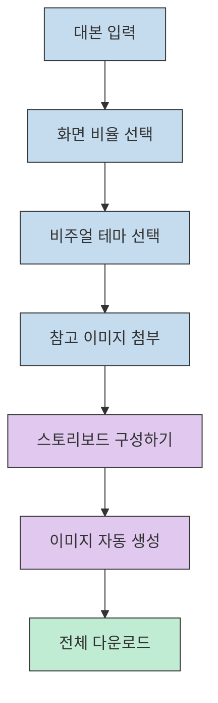

### 커스텀 도구 사용법

브라우저에 도구를 드래그하면 실행됩니다. 우측 상단에 **Gemini API 키**를 입력하고 검색하면 사용 가능한 모델들이 나옵니다. 가장 기본적인 Gemini 2.5 Flash부터 Nano Banana까지 선택할 수 있습니다.[^35]

[^35]: [https://youtu.be/BLTdSwwJPNc?t=15](https://youtu.be/BLTdSwwJPNc?t=15)

**사용 순서**

1. 유튜브 대본 문서에 사용할 대본 입력
2. 화면 비율 선택
3. 비주얼 테마 선택 (현실적인 한국 카툰, 본 캐릭터 등 3가지 옵션)
   - 원치 않으면 프롬프트 직접 입력 가능
4. 스타일 레퍼런스로 참고할 만한 이미지 넣기
5. "스토리보드 구성하기" 클릭[^36]

[^36]: [https://youtu.be/BLTdSwwJPNc?t=25](https://youtu.be/BLTdSwwJPNc?t=25)

각 시나리오에 맞는 이미지가 만들어지는데, 원하는 이미지가 안 나올 수 있어 이미지를 하나하나 클릭해서 생성하도록 했습니다. 동시에 "전체 이미지 생성"과 "전체 다운로드" 기능도 추가했습니다.[^37]

[^37]: [https://youtu.be/BLTdSwwJPNc?t=35](https://youtu.be/BLTdSwwJPNc?t=35)

### Gemini API 키 설정

도구를 사용하기 위해서는 Gemini API 키가 필요합니다. 구글 AI 스튜디오에서 다음 순서로 생성하세요:

1. "Get API Key" 클릭
2. 우측 상단 "Create API Key" 클릭
3. 키 이름 작성 후 "Create" 클릭[^38]

[^38]: [https://youtu.be/BLTdSwwJPNc?t=45](https://youtu.be/BLTdSwwJPNc?t=45)

생성된 API 키는 무료 등급입니다. 원활한 사용을 위해 결제 설정을 눌러 카드 연결을 하면 **Tier 1** 유료 등급으로 바뀝니다. 생성된 API 키 옆에서 네모난 아이콘을 클릭하면 복사됩니다.[^39]

[^39]: [https://youtu.be/BLTdSwwJPNc?t=50](https://youtu.be/BLTdSwwJPNc?t=50)

**중요 경고**: API 키는 외부로 노출되면 다른 사람들이 사용할 수 있기 때문에 절대 외부로 노출하지 마세요. 만약 노출되었다면 API 키 우측의 3선을 클릭하여 삭제하고 다시 만들어서 사용하세요.[^40]

[^40]: [https://youtu.be/BLTdSwwJPNc?t=55](https://youtu.be/BLTdSwwJPNc?t=55)

### 편집 완성 가이드

다운로드 받은 이미지 중 처음 들어갈 이미지 세 개 정도는 **동영상**으로 만드세요. 영상의 첫 시작을 동영상으로 시작해야 시청자들의 이목을 더 집중시킬 수 있고, 단순 이미지만 사용하는 것은 창작자의 노력이 적게 들어간 것으로 판단할 수 있기 때문에 최소한의 보호 조치입니다.[^41]

[^41]: [https://youtu.be/BLTdSwwJPNc?t=65](https://youtu.be/BLTdSwwJPNc?t=65)

**Kling AI로 동영상 생성**

1. Kling AI에서 "Generate" 클릭
2. 이미지 넣기
3. 이미지에 맞는 동작을 한글로 입력 (한글 인식도 잘 됨)
4. 생성 후 다운로드[^42]

[^42]: [https://youtu.be/BLTdSwwJPNc?t=70](https://youtu.be/BLTdSwwJPNc?t=70)

**AI 음성: TyeCast**

일레븐 랩스 또는 타이캐스트를 추천합니다. 캐릭터를 선정하고 대본을 입력한 후 꼭 한 번 전체 음성을 들어보세요. 대본과 음성이 어색하지 않아야 시청자의 집중력을 높일 수 있습니다.[^43]

[^43]: [https://youtu.be/BLTdSwwJPNc?t=75](https://youtu.be/BLTdSwwJPNc?t=75)

**CapCut에서 편집**

1. 완성된 음성과 동영상 이미지 불러오기
2. 음성 넣고 음성에 맞는 동영상 넣기
3. 필요한 이미지 넣기[^44]

[^44]: [https://youtu.be/BLTdSwwJPNc?t=80](https://youtu.be/BLTdSwwJPNc?t=80)

### 줌인(Zoom-in) 효과

경제학 영상을 보면 이미지나 동영상이 점차 확대되는 것을 볼 수 있습니다. 이를 전문 용어로 **줌인 효과**라고 합니다.

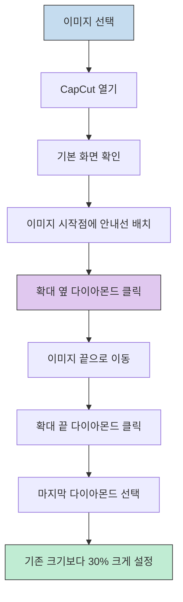

**줌인 효과 적용 방법**[^45]

[^45]: [https://youtu.be/BLTdSwwJPNc?t=85](https://youtu.be/BLTdSwwJPNc?t=85)

1. 이미지나 동영상을 클릭하면 CapCut에서 기본 화면이 나옴
2. 안내선을 이미지에 처 두기
3. 확대 옆에 있는 다이아몬드 클릭
4. 이미지 끝으로 가서 확대 끝에 있는 다이아몬드 버튼 한 번 더 클릭
5. 맨 끝에 있는 다이아몬드 클릭
6. 기존에 설정된 크기보다 **30%만 크게** 설정

이렇게 만들면 유튜브에서 자주 보이는 경제학 심리학 영상 스타일이 완성됩니다.

## Gemini Canvas로 자신만의 웹 앱 만들기

여러분이 직접 커스텀 도구를 만들어 보고 싶지 않나요? Gemini의 **Canvas** 기능을 활용하면 가능합니다.

### Gemini Canvas 사용법

Gemini 첫 화면에서 "도구"를 클릭하면 "Canvas"라는 기능이 있습니다. 이 기능은 우리가 원하는 기능을 말만 하면 Gemini가 스스로 생각해서 디자인부터 기능까지 만들어 주는 메뉴입니다.[^46]

[^46]: [https://youtu.be/BLTdSwwJPNc?t=100](https://youtu.be/BLTdSwwJPNc?t=100)

API 키만 있으면 만들 수 있는 서비스를 말해보세요. 예를 들면:

> "유튜브 API 키를 활용해서 실시간으로 떡상하는 유튜브 동영상을 찾아주고 내가 입력하는 검색어에 따라 조회수순으로 정렬될 수 있도록 해 줘."[^47]

[^47]: [https://youtu.be/BLTdSwwJPNc?t=105](https://youtu.be/BLTdSwwJPNc?t=105)

Canvas가 알아서 생각해서 앱의 디자인과 기능을 만들어 줍니다. 처음에는 잘 못 만들 수 있지만, 두 번 세 번 수정을 하다 보면 결국 원하는 수준까지 만들어 줍니다.

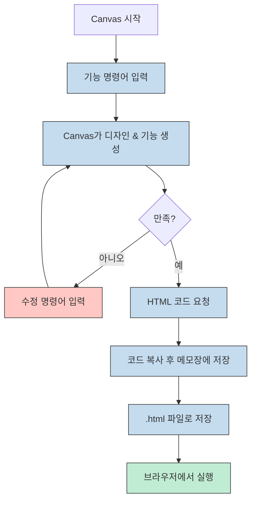

Canvas 작업을 할 때는 **빠른 모델보다 사고 모델로 작업하는 것**을 추천합니다. 다만 사고 모델은 무료로 사용할 수 있는 양이 적기 때문에 유료로 사용하는 분들이 유리합니다.[^48]

[^48]: [https://youtu.be/BLTdSwwJPNc?t=110](https://youtu.be/BLTdSwwJPNc?t=110)

### 기능 추가 수정

만들어진 앱에 기간 필터를 추가하려면 다음과 같이 명령하세요:

> "기간에 따라 콘텐츠를 검색할 수 있도록 메뉴를 추가해 줘. 기간은 1일, 일주일, 한 달, 1년으로 구분해 줘."[^49]

[^49]: [https://youtu.be/BLTdSwwJPNc?t=115](https://youtu.be/BLTdSwwJPNc?t=115)

Canvas가 스스로 생각해서 이미 만들어진 앱을 다시 한번 만듭니다.

### 웹 앱으로 내보내기

앱을 메모장에 코드로 붙여 넣을 수 있는 형태로 만들어야 합니다:

> "지금 만들어진 앱을 메모장에 붙여서 .html 형태로 저장할 수 있도록 구성을 수정해 줘."[^50]

[^50]: [https://youtu.be/BLTdSwwJPNc?t=120](https://youtu.be/BLTdSwwJPNc?t=120)

코드가 수정되고, `<!DOCTYPE html>`로 되어 있으면 정상적으로 코드가 만들어진 것입니다.

**웹 앱 저장 방법**[^51]

[^51]: [https://youtu.be/BLTdSwwJPNc?t=125](https://youtu.be/BLTdSwwJPNc?t=125)

1. `Ctrl+A`로 전체 복사
2. 메모장 열기
3. 코드 붙여 넣기
4. 파일 이름 작성 후 확장자를 `.html`로 저장
5. 인터넷 브라우저에서 파일 열기

이렇게 만든 검색 앱은 웹 브라우저에서 실행 가능한 형태로 완성됩니다.

## 전체 파이프라인 다이어그램

지금까지 설명한 전체 과정을 시각화하면 다음과 같습니다.

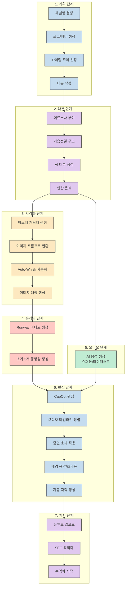

## 도구 비교표

주요 사용 도구들의 특징을 비교해 보겠습니다.

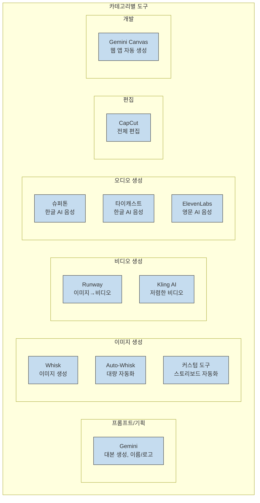

## 핵심 요약

### 성공하는 AI 유튜브 채널의 핵심 원칙

1. **고단가 니시 선정**: 심리학, 경제학 같은 광고 단가가 높고 체류 시간이 긴 카테고리 공략[^52]

[^52]: [https://youtu.be/CEGe3Og1l_0?t=65](https://youtu.be/CEGe3Og1l_0?t=65)

2. **일관된 브랜딩**: 마스터 캐릭터 전략으로 시청자의 몰입 유지[^53]

[^53]: [https://youtu.be/CEGe3Og1l_0?t=195](https://youtu.be/CEGe3Og1l_0?t=195)

3. **샌드위치 프롬프트**: 인간의 기획-실행-인간의 윤색 사이클로 고퀄리티 콘텐츠 생성[^54]

[^54]: [https://youtu.be/CEGe3Og1l_0?t=110](https://youtu.be/CEGe3Og1l_0?t=110)

4. **기승전결 구조**: 시청 지속 시간을 위한 명확한 구조와 3지점 솔루션 배치[^55]

[^55]: [https://youtu.be/CEGe3Og1l_0?t=125](https://youtu.be/CEGe3Og1l_0?t=125)

5. **인간의 터치**: 개인적 경험담 추가로 기계적 말투 제거, 공감 유도[^56]

[^56]: [https://youtu.be/CEGe3Og1l_0?t=180](https://youtu.be/CEGe3Og1l_0?t=180)

### 무료 자동화 도구 활용법

1. **Auto-Whisk**: 90장 이미지를 자동으로 생성하여 시간 단축[^57]

[^57]: [https://youtu.be/CEGe3Og1l_0?t=250](https://youtu.be/CEGe3Og1l_0?t=250)

2. **커스텀 스토리보드 도구**: 대본에서 이미지까지 원클릭 자동화[^58]

[^58]: [https://youtu.be/BLTdSwwJPNc?t=25](https://youtu.be/BLTdSwwJPNc?t=25)

3. **Gemini Canvas**: 명령어만으로 웹 앱 자동 생성[^59]

[^59]: [https://youtu.be/BLTdSwwJPNc?t=100](https://youtu.be/BLTdSwwJPNc?t=100)

### 실전 팁

- 무료 크레딧이 다 떨어지면 새로운 계정으로 가입하여 계속 사용[^60]

[^60]: [https://youtu.be/CEGe3Og1l_0?t=325](https://youtu.be/CEGe3Og1l_0?t=325)

- API 키는 절대 외부 노출 금지, 노출 시 즉시 삭제 후 재생성[^61]

[^61]: [https://youtu.be/BLTdSwwJPNc?t=55](https://youtu.be/BLTdSwwJPNc?t=55)

- 첫 3개 컷은 동영상으로 제작하여 최소한의 창작자 노력 증명[^62]

[^62]: [https://youtu.be/BLTdSwwJPNc?t=65](https://youtu.be/BLTdSwwJPNc?t=65)

- 줌인 효과로 이미지를 30% 확대하여 경제학 영상 스타일 완성[^63]

[^63]: [https://youtu.be/BLTdSwwJPNc?t=85](https://youtu.be/BLTdSwwJPNc?t=85)

## 결론

처음에는 세네 시간, 혹은 6~7시간이 걸릴 수 있습니다. 하지만 이런 방법을 차차 반복하고 연습하다 보면 과정이 한두 시간 내로 금방 끝나게 됩니다.[^64]

[^64]: [https://youtu.be/CEGe3Og1l_0?t=400](https://youtu.be/CEGe3Og1l_0?t=400)

다른 사람들이 "AI 영상은 끝물이다"라고 불평할 때, 누군가는 오늘 밤 이 방법으로 첫 번째 영상을 올리고 자신만의 브랜드나 수익화를 시작하고 있습니다.[^65]

[^65]: [https://youtu.be/CEGe3Og1l_0?t=405](https://youtu.be/CEGe3Og1l_0?t=405)

결국 중요한 것은 이런 툴이나 도구가 아니라 **실행력**입니다. 완벽한 준비가 아니라, 지금 당장 시작하는 것부터가 성공의 첫걸음입니다.

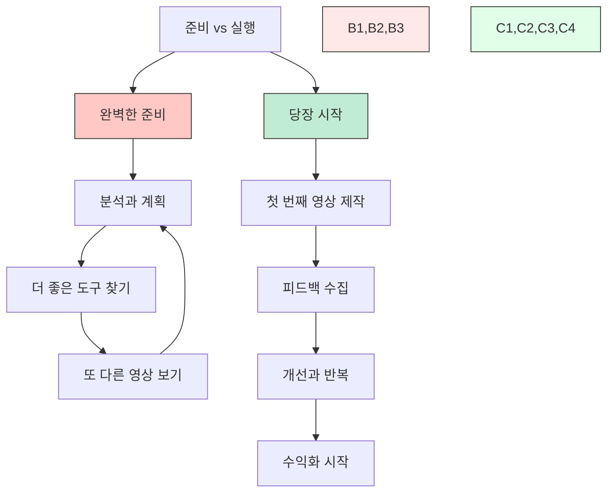
