클로드 코드를 사용하면 반복적인 작업을 자동화하는 스킬(Skill)을 만들 수 있습니다. 이번 글에서는 클로드 코드의 스킬을 활용해 HTML 기반 웹 PPT를 만드는 방법과, 이를 플러그인으로 패키징해 팀원들과 공유하는 마켓플레이스 배포 과정까지 다룹니다.

<!--more-->

## Sources

- [클로드 코드로 PPT 만들기: 스킬 제작부터 마켓플레이스 배포까지 - 짐코딩](https://www.youtube.com/watch?v=yey_9vhLRmY)

---

## 왜 HTML 기반 웹 PPT인가?

엔트로픽 공식 문서에서 제공하는 PPTX 스킬은 PPT 파일을 생성해주지만 몇 가지 단점이 있습니다.

**PPTX 스킬의 한계** ([영상 0:49](https://youtu.be/yey_9vhLRmY?t=49)):
- 퀄리티가 아쉬움
- 생성 속도가 느림
- 파일 포맷을 HTML 웹으로 변경하고 싶어도 PPT 파일로 생성됨

**HTML 기반 웹 PPT의 장점**:
- 퀄리티가 높음
- 생성 속도가 빠름
- 슬라이드 제작 시간이 크게 단축됨

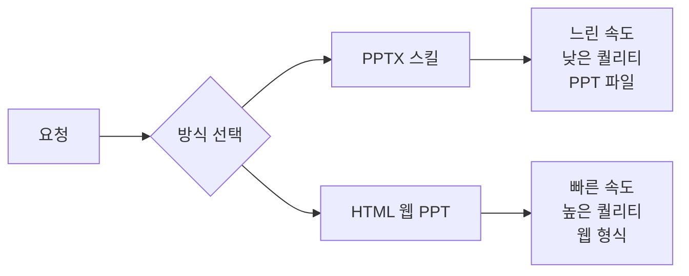

---

## 스킬 크리에이터 스킬 소개

스킬을 직접 만들어 본 분들은 알겠지만, 공식 문서를 보면서 구조를 맞추는 것이 은근히 까다롭습니다.

**스킬 제작의 어려운 점들** ([영상 1:25](https://youtu.be/yey_9vhLRmY?t=85)):
- 스킬.md 파일은 몇 줄이 적당한지
- 스킬 발동 조건은 어떻게 작성해야 하는지
- 워크플로우 단계는 어떤 식으로 잡아야 하는지

**스킬 크리에이터 스킬의 역할** ([영상 1:50](https://youtu.be/yey_9vhLRmY?t=110)):
- 공식 문서의 스킬 스펙과 모범 사례를 자동으로 반영
- 스킬 구조를 신경 쓸 필요 없이 원하는 기능에만 집중 가능
- 최적의 스킬 구조를 자동 생성
- 새 스킬 생성뿐 아니라 기존 스킬 개선에도 활용 가능

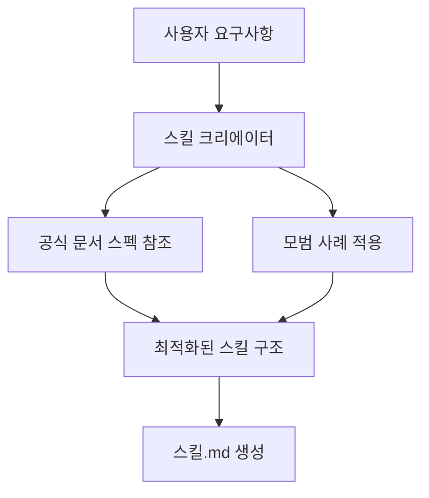

---

## 엔트로픽 공식 마켓플레이스 확인하기

엔트로픽은 공식 플러그인 마켓플레이스를 직접 관리합니다.

**마켓플레이스 구조** ([영상 2:50](https://youtu.be/yey_9vhLRmY?t=170)):
- **내부 플러그인**: 엔트로픽이 직접 만들고 관리 (스킬 크리에이터, 피처 데브, 프론트엔드 디자인 등)
- **외부 플러그인**: 파트너사나 커뮤니티가 만든 것 (컨텍스트, 기터, 슬랙, 슈퍼베이스 등)

**플러그인 명령어로 확인하기** ([영상 3:20](https://youtu.be/yey_9vhLRmY?t=200)):

```bash
/plugin
```

플러그인 관련 탭들이 나타납니다:

| 탭 | 설명 |
|---|---|
| 디스커버 | 설치 가능한 플러그인 탐색 (현재 480개 이상) |
| 인스톨드 | 설치된 플러그인 목록 관리 |
| 마켓플레이스 | 플러그인 배포 설정 |
| 에러 | 플러그인 로딩/실행 오류 확인 |

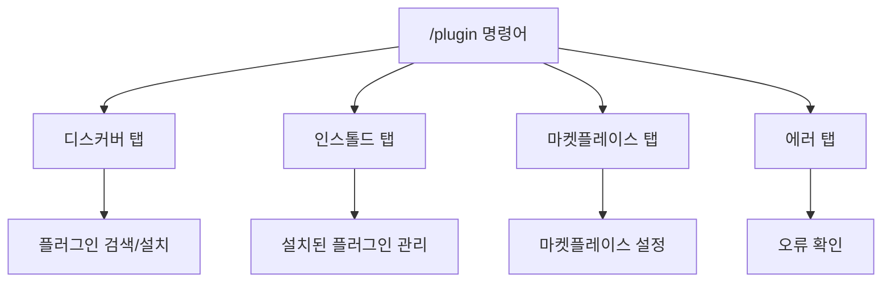

---

## 리서치: 서브 에이전트 병렬 활용

스킬을 만들기 전에 먼저 리서치가 필요합니다. 이때 클로드 코드의 서브 에이전트를 병렬로 활용하면 효율적입니다.

**핵심 원칙** ([영상 4:50](https://youtu.be/yey_9vhLRmY?t=290)):
> 어떤 문제를 해결할 때는 바로 구현하는 것보다 **분석 → 수집 → 계획 → 구현** 순서로 접근하는 것이 중요합니다.

**서브 에이전트 병렬 리서치** ([영상 5:15](https://youtu.be/yey_9vhLRmY?t=315)):
- 여러 에이전트가 동시에 각각 다른 주제를 리서치
- 순수 HTML, CSS, 자바스크립트만으로 웹 기반 슬라이드 구현 방법 조사
- Reveal.js 같은 라이브러리는 참고만 하고 최종은 순수 바닐라로 구현

**프롬프트 작성 팁** ([영상 5:50](https://youtu.be/yey_9vhLRmY?t=350)):
- 컨트롤+G 단축키로 프롬프트를 텍스트 편집기에서 열어 수정 가능
- 네 줄 이상 텍스트를 붙여 넣으면 자동으로 축약 표시됨

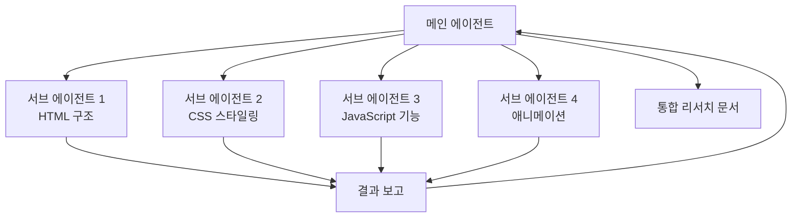

---

## 서브 에이전트 vs 에이전트 팀 차이점

이 두 개념을 헷갈려하는 분들이 많아 명확히 정리합니다.

**서브 에이전트** ([영상 6:50](https://youtu.be/yey_9vhLRmY?t=410)):
- 각자 독립된 컨텍스트에서 작업
- 서브 에이전트끼리는 서로 대화할 수 없음
- 작업 완료 후 메인 에이전트에게 보고
- 메인 에이전트가 결과를 종합

**에이전트 팀** ([영상 7:10](https://youtu.be/yey_9vhLRmY?t=430)):
- 팀원들끼리 서로 메시지를 주고받을 수 있음
- 상대방 결과에 반박하면서 협업 가능
- 서로 대화하면서 협업하는 방식

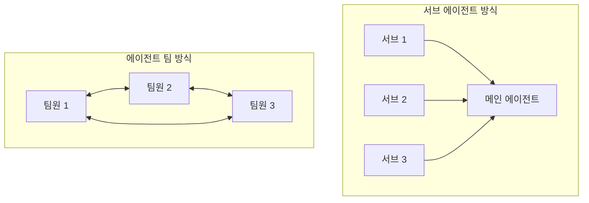

| 구분 | 서브 에이전트 | 에이전트 팀 |
|---|---|---|
| 컨텍스트 | 독립적 | 공유 가능 |
| 상호 통신 | 불가능 | 가능 |
| 협업 방식 | 메인이 종합 | 서로 논의 |
| 적합한 용도 | 독립적 작업 분할 | 협의가 필요한 작업 |

---

## 리서치 결과 검토 및 수정

리서치가 완료되면 다음 파일들이 생성됩니다 ([영상 7:40](https://youtu.be/yey_9vhLRmY?t=460)):
- `research.md`: 네 개 주제의 리서치 결과를 통합 정리한 문서
- `research_sample.html`: 리서치된 모든 패턴이 적용된 샘플 파일

**중요한 점** ([영상 8:30](https://youtu.be/yey_9vhLRmY?t=510)):
> AI 도구가 리서칭 작업을 수행하지만, 여전히 결과를 검토하고 방향을 지시하는 것은 우리의 몫입니다.

**수정 요청 예시** ([영상 9:00](https://youtu.be/yey_9vhLRmY?t=540)):
- 참고 자료 파일 제공 가능
- 원하는 디자인을 캡처해서 붙여 넣기 가능
- "샘플 페이지는 10여 개로, 페이지 이동 시 한 페이지 단위로 이동하도록 요청" 같은 구체적 수정 가능

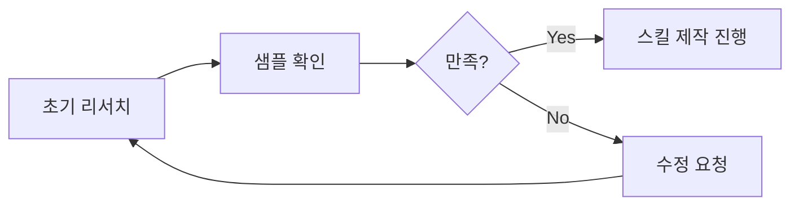

---

## 스킬 크리에이터로 PPT 스킬 생성

리서치 자료가 준비되었으면 스킬 크리에이터를 활용해 스킬을 생성합니다.

**요청 방법** ([영상 10:00](https://youtu.be/yey_9vhLRmY?t=600)):
1. 스킬 크리에이터 스킬 사용
2. 순수 HTML, CSS, 자바스크립트로 웹 프레젠테이션을 만드는 스킬 생성 요청
3. 원하는 기능 구체적으로 명시
4. 리서치 자료와 샘플 파일을 참고 자료로 추가

**프롬프트 구성**:
```
@research.md @research_sample.html 참고해서
순수 HTML, CSS, JavaScript로 웹 프레젠테이션을 만드는 스킬 생성
[원하는 기능 목록]
```

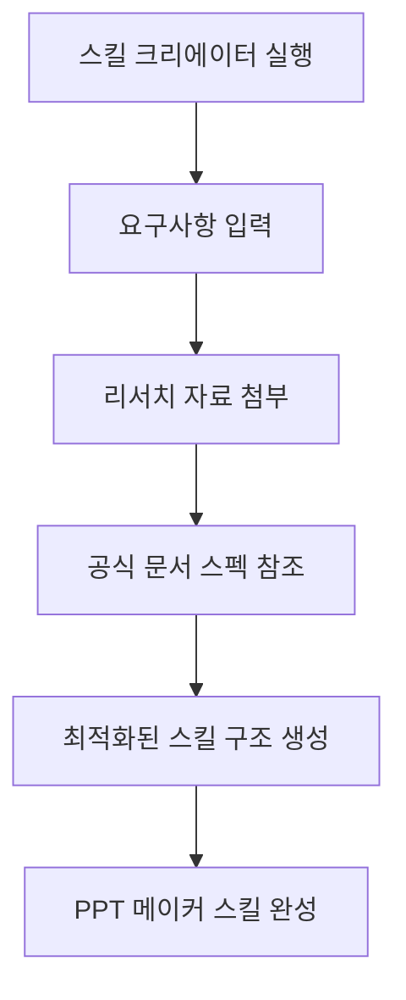

---

## PPT 스킬로 슬라이드 만들기

스킬이 생성되면 바로 슬라이드를 만들 수 있습니다.

**중요한 원칙** ([영상 11:00](https://youtu.be/yey_9vhLRmY?t=660)):
> 하나의 문제를 한꺼번에 해결하려고 하면 안 됩니다. 컨펌을 하면서 완성해 나가세요.

**단계적 접근** ([영상 11:15](https://youtu.be/yey_9vhLRmY?t=675)):
- 총 40장의 PPT가 필요하다면 한 번에 만들지 말 것
- 먼저 시안으로 3개 정도 생성 요청
- 스타일 지정 (예: 다크 배경, 콘텐츠 중앙 정렬)
- 확인 후 점진적으로 확장

**생성 결과 예시** ([영상 11:45](https://youtu.be/yey_9vhLRmY?t=705)):
- 골드 테마
- 시안 테마
- 바이올렛 컬러
- 리서치에 맞게 웹 PPT 완성

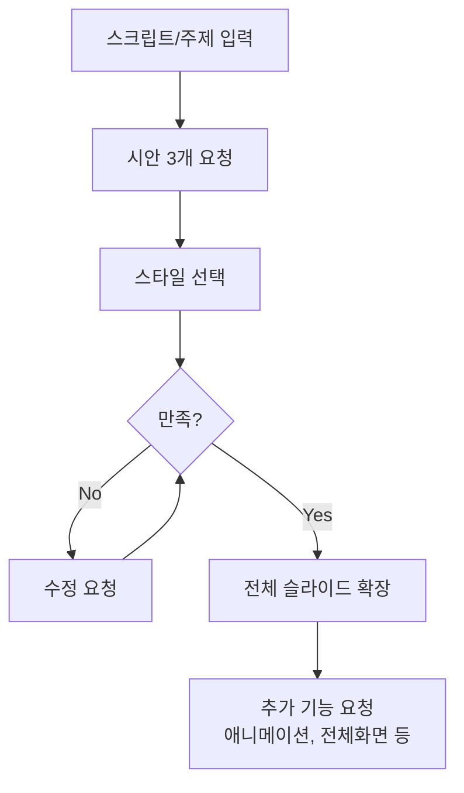

---

## 스킬, 플러그인, 마켓플레이스 개념 정리

이 세 가지를 헷갈려하는 분들이 많아 명확히 정리합니다.

**스킬 (Skill)** ([영상 12:50](https://youtu.be/yey_9vhLRmY?t=770)):
- 업무 매뉴얼
- 현재 프로젝트에서만 사용 가능
- 예: PPT 메이커 스킬

**플러그인 (Plugin)** ([영상 13:00](https://youtu.be/yey_9vhLRmY?t=780)):
- 스킬, 서브 에이전트, 훅, MCP 등을 묶는 패키지
- 다른 프로젝트에서도 사용 가능
- 팀원들과 공유 가능

**마켓플레이스 (Marketplace)** ([영상 13:15](https://youtu.be/yey_9vhLRmY?t=795)):
- 플러그인을 모아 놓은 저장소
- 앱스토어와 같은 개념
- 등록된 플러그인을 검색하고 설치 가능

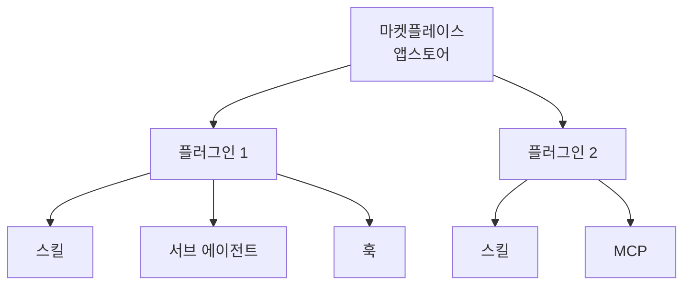

---

## 플러그인 만들기

스킬을 플러그인으로 만들어 배포할 수 있습니다.

**플러그인 폴더 구조** ([영상 13:45](https://youtu.be/yey_9vhLRmY?t=825)):

```
ppt-maker-plugin/
├── .claude/
│   └── plugin.json
└── skills/
    └── ppt-maker.md
```

**plugin.json 내용**:
```json
{
  "name": "PPT Maker",
  "description": "HTML 기반 웹 PPT 생성",
  "version": "1.0.0",
  "author": {
    "name": "작성자명"
  }
}
```

**주의사항** ([영상 14:20](https://youtu.be/yey_9vhLRmY?t=860)):
- `author` 필드는 문자열이 아닌 **객체 타입**으로 작성해야 오류가 발생하지 않음

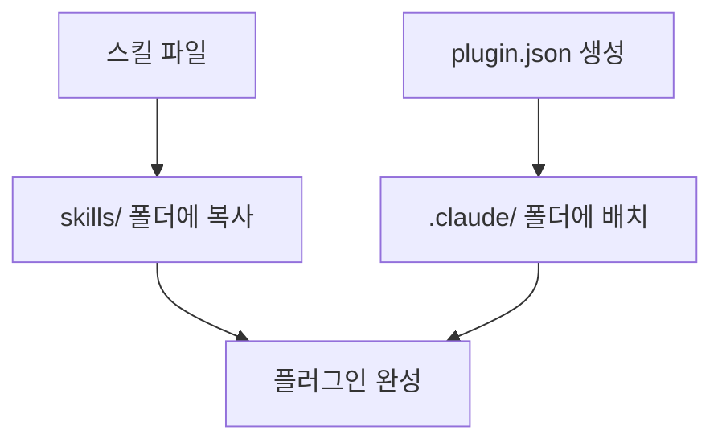

---

## 마켓플레이스 만들기

플러그인을 배포할 마켓플레이스를 만듭니다.

**마켓플레이스 폴더 구조** ([영상 14:50](https://youtu.be/yey_9vhLRmY?t=890)):

```
my-marketplace/
├── .claude/
│   └── marketplace.json
└── plugins/
    └── ppt-maker-plugin/
        ├── .claude/
        │   └── plugin.json
        └── skills/
            └── ppt-maker.md
```

**marketplace.json 내용**:
```json
{
  "name": "My Marketplace",
  "owner": {
    "name": "소유자명"
  },
  "plugins": ["ppt-maker-plugin"]
}
```

**핵심 구조 포인트** ([영상 15:20](https://youtu.be/yey_9vhLRmY?t=920)):
- 마켓플레이스 루트 `.claude/` 안에는 `marketplace.json`
- 플러그인 안 `.claude/` 안에는 `plugin.json`

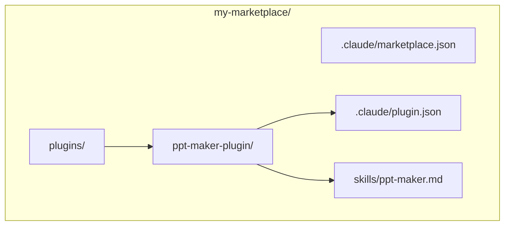

---

## GitHub에 마켓플레이스 배포하기

마켓플레이스를 GitHub에 업로드하면 다른 사람들이 사용할 수 있습니다.

**배포 과정** ([영상 15:50](https://youtu.be/yey_9vhLRmY?t=950)):
1. Git 초기화
2. 커밋 진행
3. GitHub에 푸시

**다른 프로젝트에서 설치하기** ([영상 16:20](https://youtu.be/yey_9vhLRmY?t=980)):
```bash
/plugin marketplace add github-사용자명/리포지토리명
```


---

## 플러그인 설치 및 사용

마켓플레이스를 추가한 후 플러그인을 설치합니다.

**설치 과정** ([영상 16:30](https://youtu.be/yey_9vhLRmY?t=990)):
1. `/plugin` 명령어 실행
2. 마켓플레이스 탭으로 이동
3. 추가한 마켓플레이스 선택
4. 원하는 플러그인 설치 (프로젝트 스코프)

**설치 확인**:
- `.claude/settings.json` 파일에 플러그인 정보 추가됨
- 클로드 코드 재실행 후 `/ppt-maker` 입력하면 스킬 사용 가능

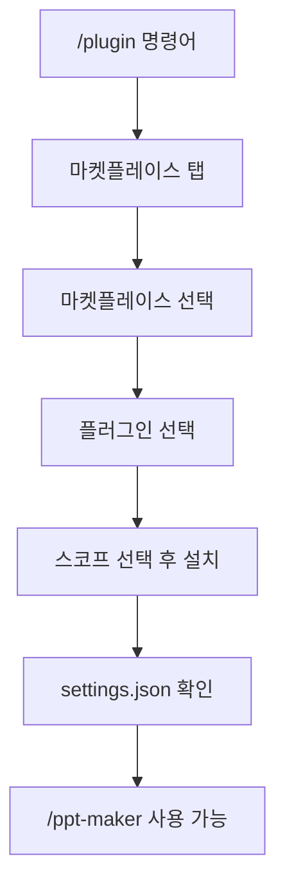

---

## 플러그인의 진짜 장점: 업데이트 관리

플러그인 시스템의 가장 큰 장점은 업데이트 관리가 편하다는 것입니다.

**업데이트 프로세스** ([영상 17:30](https://youtu.be/yey_9vhLRmY?t=1050)):
1. 플러그인 개선 (예: 더 뛰어난 UI)
2. GitHub에 푸시
3. 설치한 팀원들은 업데이트만 진행하면 됨

**자동 업데이트 설정** ([영상 17:50](https://youtu.be/yey_9vhLRmY?t=1070)):
- "Enable Auto Update" 옵션 켜두면 클로드 코드 실행 시 자동으로 최신 버전 확인
- 기본적으로 꺼져 있으므로 필요 시 활성화 필요

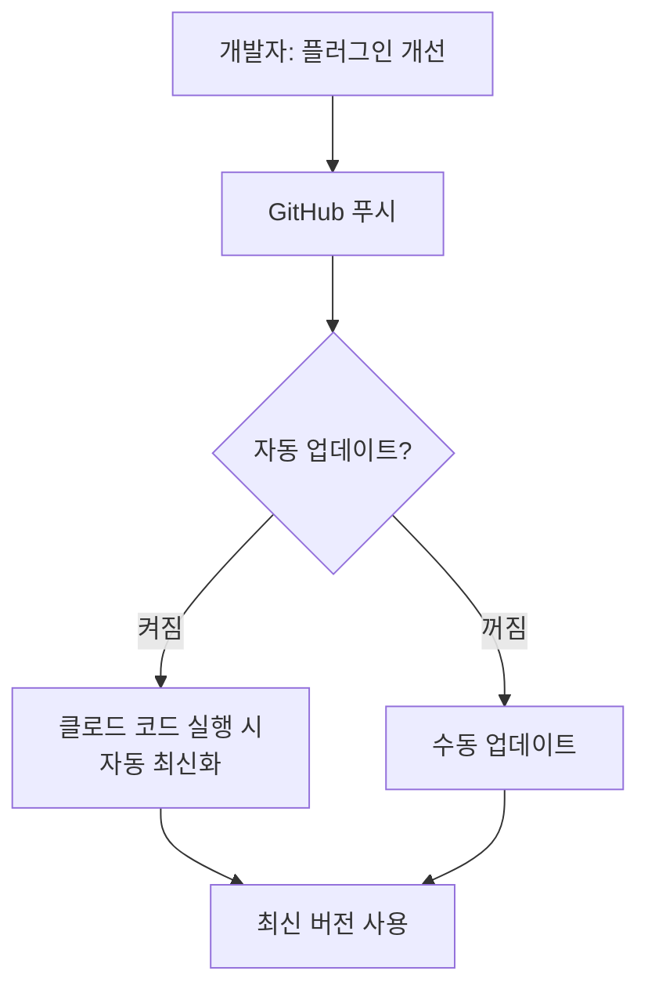

**기존 방식 vs 플러그인 방식**:

| 구분 | 스킬만 공유 | 플러그인 공유 |
|---|---|---|
| 업데이트 시 | 복사-붙여넣기 필요 | 업데이트만 진행 |
| 버전 관리 | 어려움 | 자동 가능 |
| 팀 전체 적용 | 번거로움 | 한 번에 가능 |

---

## 핵심 요약

1. **HTML 웹 PPT 장점**: PPTX 스킬보다 퀄리티가 높고 속도가 빠름
2. **스킬 크리에이터**: 공식 문서 스펙과 모범 사례를 자동 반영해 최적화된 스킬 생성
3. **병렬 리서치**: 서브 에이전트로 독립적인 주제를 동시에 조사 가능
4. **서브 에이전트 vs 에이전트 팀**: 서브 에이전트는 독립적 작업, 에이전트 팀은 상호 협업
5. **플러그인 구조**: `.claude/plugin.json` + `skills/` 폴더
6. **마켓플레이스 구조**: `.claude/marketplace.json` + `plugins/` 폴더
7. **자동 업데이트**: Enable Auto Update 옵션으로 최신 버전 자동 적용

---

## 결론

클로드 코드의 스킬 시스템을 활용하면 반복적인 PPT 제작 작업을 효율적으로 자동화할 수 있습니다. 특히 HTML 기반 웹 PPT는 퀄리티와 속도 면에서 기존 방식보다 뛰어납니다.

플러그인과 마켓플레이스를 통해 팀원들과 공유하면, 업데이트 관리가 자동으로 이루어져 팀 전체의 생산성이 향상됩니다. 한 번 잘 만들어 놓으면 어디서든 재사용할 수 있고, 자동 업데이트를 켜두면 변경 사항도 자동으로 반영됩니다.

스킬 크리에이터를 활용하면 공식 문서의 복잡한 스펙을 신경 쓰지 않고도 최적화된 스킬을 만들 수 있으니, 직접 스킬을 만들어 보고 싶은 분들에게 강력히 추천합니다.
