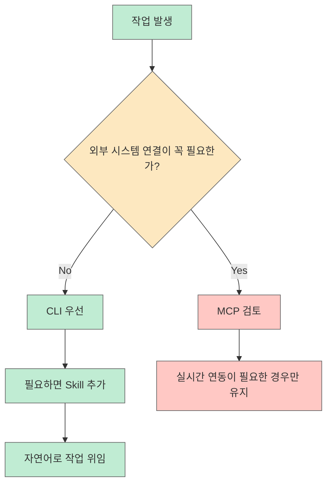
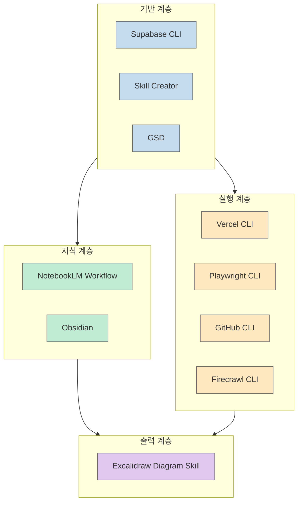
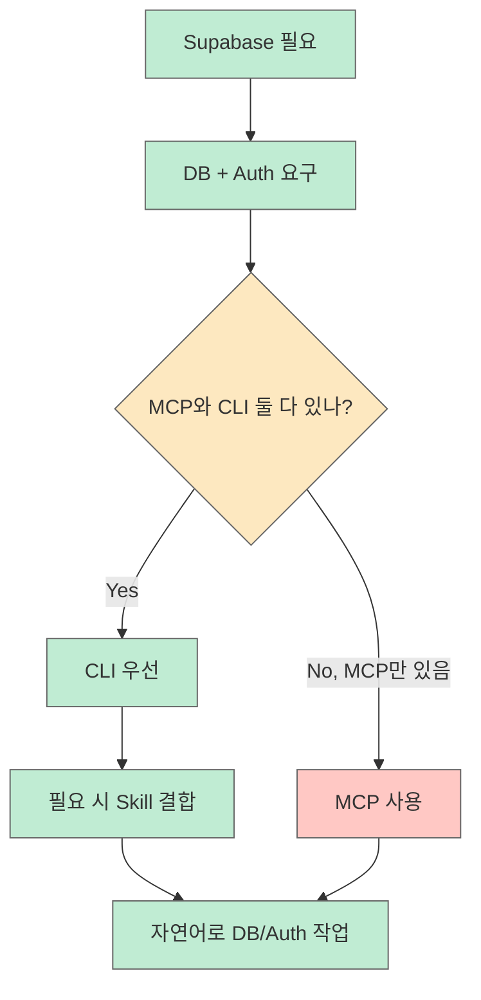
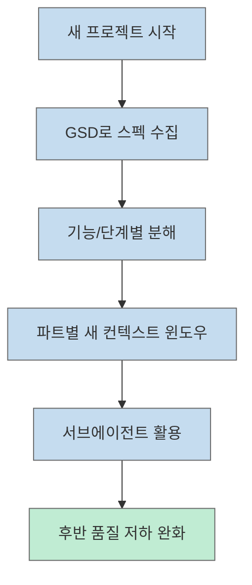
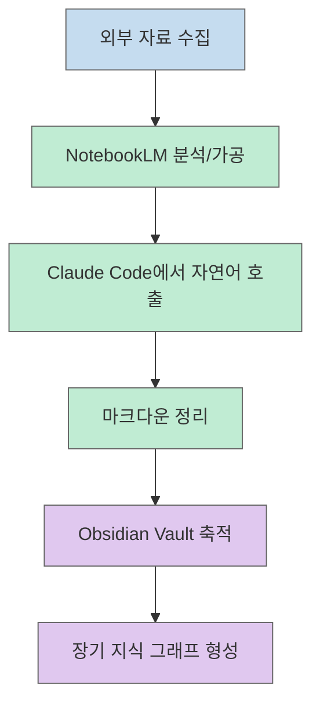
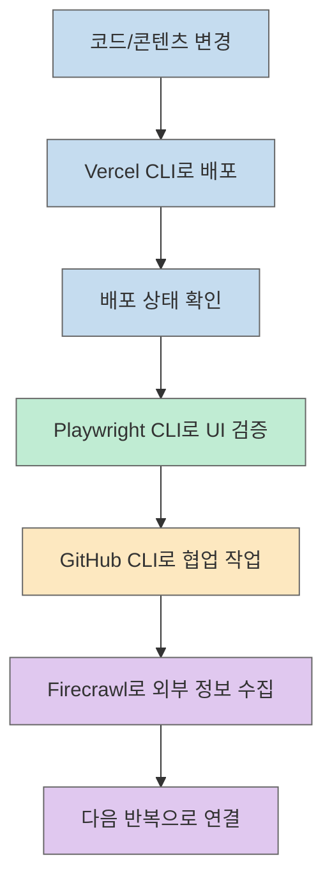
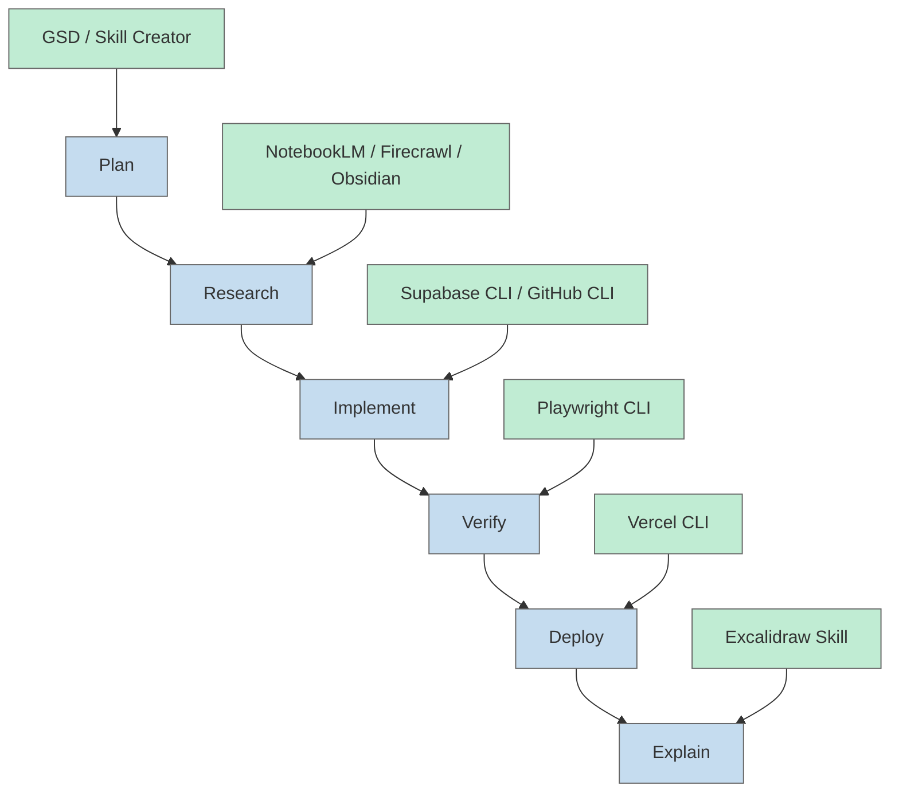

Claude Code 주변 생태계는 너무 빨리 커지고 있습니다. MCP, CLI, 스킬, 프레임워크가 동시에 쏟아지다 보니 무엇을 붙여야 실제 생산성이 올라가는지 판단하기가 점점 어려워졌습니다. 이번 글은 YouTube 영상 한 편을 바탕으로, **이 발표자 기준에서** "도구를 많이 붙이는 것"보다 "CLI와 스킬을 조합해 작업 흐름을 단순화하는 것"이 왜 더 중요하게 다뤄지는지 정리한 글입니다.

<!--more-->

## Sources

- [프로젝트 생산성을 10배 높여주는 Claude Code 플러그인 10선](https://www.youtube.com/watch?v=E3CUMPzrsCM)

아래 본문에 넣은 타임스탬프는 수집한 전사 위치를 기준으로 잡은 **대략적 시작 지점** 입니다. 정확한 초 단위 인용보다는 각 주제가 시작되는 흐름을 빠르게 다시 찾는 용도로 보는 편이 좋습니다. 본문 설명은 노이즈가 있는 자동 전사를 바탕으로 재구성한 **요약·해설 중심의 패러프레이즈** 이며, 직역 인용문이 아닙니다.

---

## 이 영상의 핵심은 "도구 10개" 보다 "도구를 고르는 기준"이다

영상은 10개의 도구를 소개하지만, 더 중요한 메시지는 따로 있습니다. 발표자는 Supabase MCP를 소개한 직후 **실제로는 Supabase CLI를 쓰는 편이 낫다** 고 방향을 틀고, 대부분의 경우 **MCP보다 CLI를 우선하고 여기에 스킬을 붙이는 조합** 이 더 실용적이라고 설명합니다 ([영상 3:58](https://youtu.be/E3CUMPzrsCM?t=238), [영상 5:55](https://youtu.be/E3CUMPzrsCM?t=355)).

이 판단 기준이 중요한 이유는 간단합니다. 터미널 안에서 이미 돌아가고 있는 Claude Code에게는 외부 연결 레이어를 하나 더 얹는 것보다, **직접 실행 가능한 CLI와 그 CLI를 잘 쓰게 만드는 스킬** 을 주는 편이 오버헤드가 적다고 발표자는 봅니다. 즉, 이 영상은 단순한 추천 목록이 아니라 발표자가 생각하는 2026년형 Claude Code 작업 공간의 운영 기준을 제시합니다.

## 10개 도구를 한 번에 보는 지도

영상에서 소개한 10개 도구를 단순히 나열하면 정신없어 보이지만, 실제로는 4개의 층으로 정리할 수 있습니다.

| 구분 | 도구 | 역할 |
|---|---|---|
| 백엔드/기반 | Supabase CLI, Skill Creator | 데이터베이스/인증 작업과 스킬 제작 고도화 |
| 작업 오케스트레이션 | GSD 프레임워크 | 스펙 기반 개발, 컨텍스트 윈도우 관리 |
| 리서치/지식 관리 | NotebookLM 연결 도구, Obsidian | 조사, 정리, 개인 지식 축적 |
| 실행/검증/산출 | Vercel CLI, Playwright CLI, GitHub CLI, Firecrawl CLI, Excalidraw Diagram Skill | 배포, 브라우저 자동화, GitHub 작업, 스크래핑, 시각화 |

이 구조로 보면 영상이 말하는 포인트가 더 선명해집니다. **Claude Code를 강하게 만드는 것은 단일 킬러 기능 하나가 아니라, 계획-리서치-실행-출력 흐름이 끊기지 않게 이어지는 도구 조합** 입니다.

## 1. Supabase: MCP를 소개하지만 결론은 CLI다

영상의 첫 출발점은 Supabase입니다. 이유는 명확합니다. 많은 프로젝트가 결국 **데이터베이스와 인증** 에 부딪히기 때문입니다. 발표자는 Supabase가 넉넉한 무료 티어를 제공하고, 오픈소스 기반이며, 데이터 저장과 인증을 함께 다룰 수 있다는 점을 강조합니다 ([영상 1:03](https://youtu.be/E3CUMPzrsCM?t=63)).

하지만 진짜 포인트는 그다음에 나옵니다. 발표자는 잠깐 솔직하게 말하겠다며 **Supabase MCP를 굳이 쓸 필요는 없고, 대신 Supabase CLI를 쓰는 편이 더 낫다** 고 말합니다 ([영상 5:55](https://youtu.be/E3CUMPzrsCM?t=355)). 이 대목은 단순한 취향 문제가 아닙니다.

왜냐하면 Claude Code가 이미 터미널 안에서 작동하고 있다면,

- MCP는 별도 연결 레이어를 추가하고
- CLI는 터미널에서 바로 실행 가능하며
- Skill은 해당 CLI를 더 잘 쓰도록 행동 지침을 보강합니다.

즉 Supabase 사례는 **"외부 시스템을 붙일 때 먼저 CLI가 있는지 보고, 그다음 스킬이 있는지 확인하라"** 는 원칙의 대표 예시입니다. 데이터베이스 생성, 스키마 수정, 인증 설정 같은 작업을 자연어로 지시하더라도, 내부적으로는 결국 이 원칙이 생산성을 좌우합니다.

## 2. Skill Creator: 스킬을 만드는 단계도 이제 측정의 대상이 된다

두 번째 도구는 Anthropic의 **Skill Creator** 입니다. 발표자는 이 도구를 단순히 "스킬을 만들어 주는 도구"로 설명하지 않고, **기존 스킬을 수정하고 개선하며 성능을 측정할 수 있는 도구** 로 설명합니다 ([영상 6:06](https://youtu.be/E3CUMPzrsCM?t=366), [영상 7:15](https://youtu.be/E3CUMPzrsCM?t=435)).

이게 중요한 이유는 커스텀 스킬이 그동안 꽤 감각적인 작업이었기 때문입니다. "이 스킬이 더 좋아진 것 같긴 한데 정말 그런가?" 같은 질문에 답하기 어려웠습니다. 그런데 Skill Creator는 이 부분을 **AB 테스트와 개선 루프** 로 바꿉니다.

즉, 2026년의 Claude Code 스킬 운영은 다음 단계로 넘어갑니다.

- 예전: 스킬을 만들고 감으로 평가
- 이제: 스킬을 만들고, 수정하고, 비교하고, 성능을 확인

이 변화는 꽤 큽니다. Claude Code의 결과 품질이 도구 자체보다도 **어떤 스킬을 어떤 구조로 붙였는지** 에 더 크게 좌우되는 상황에서, 스킬 자체를 실험 가능한 단위로 만드는 도구가 등장한 셈이기 때문입니다.

## 3. GSD: Claude Code 위에 올라가는 오케스트레이션 레이어

세 번째는 GSD(Get Shit Done) 계열 프레임워크입니다. 영상에서는 이 도구를 **Claude Code 위에 얹는 오케스트레이션 레이어** 로 설명하고, 특히 새 프로젝트를 시작할 때 스펙 기반 개발의 가드레일을 더 강하게 제공한다고 말합니다 ([영상 8:18](https://youtu.be/E3CUMPzrsCM?t=498), [영상 8:44](https://youtu.be/E3CUMPzrsCM?t=524)).

발표자가 여기서 강조하는 포인트는 두 가지입니다.

첫째, 프로젝트를 **기능 단위와 단계 단위로 더 잘게 나눌 수 있다** 는 점입니다. 둘째, 계획의 새로운 파트를 실행할 때마다 **새 컨텍스트 윈도우를 사용하는 구조** 를 통해 후반부로 갈수록 출력 품질이 떨어지는 문제를 줄인다는 점입니다.

결국 GSD는 Claude Code 자체를 대체하는 것이 아니라, Claude Code를 **계획 가능한 시스템** 으로 바꾸는 도구에 가깝습니다. 작업량이 커질수록 중요한 것은 "잘 코딩하는 모델"보다 "문제를 어떤 단위로 쪼개고 어떤 순서로 실행하느냐" 인데, GSD는 그 부분을 보완합니다.

## 4. NotebookLM + Obsidian: Claude Code를 리서처이자 개인 비서로 쓰는 조합

네 번째와 다섯 번째 도구는 함께 봐야 더 의미가 있습니다. 하나는 NotebookLM 연결 도구이고, 다른 하나는 Obsidian입니다.

### NotebookLM 연결 도구: 조사와 산출물을 Claude Code 안으로 당겨오기

발표자는 NotebookLM 연결 도구를 자신의 **리서치 워크플로우 핵심** 이라고 설명합니다 ([영상 9:37](https://youtu.be/E3CUMPzrsCM?t=577), [영상 9:48](https://youtu.be/E3CUMPzrsCM?t=588)). 핵심 메시지는 이렇습니다.

- NotebookLM이 잘하는 리서치와 요약을
- Claude Code 터미널 안에서 자연어 기반으로 호출하고
- 분석, 인포그래픽, 슬라이드, 플래시카드, 팟캐스트 같은 산출물까지 연결할 수 있다

즉 Claude Code를 단순 코딩 에이전트가 아니라 **리서치 오케스트레이터** 로 쓰는 방식입니다. 특히 공식 API가 없어도 CLI와 스킬을 연결해 NotebookLM 기능을 끌어오는 점이 흥미롭습니다. 이건 "공식 SDK가 없으면 통합도 없다"는 사고방식을 깨는 사례이기도 합니다.

### Obsidian: 방대한 마크다운 컨텍스트를 정리하는 개인 지식 저장소

다섯 번째 도구 Obsidian은 전형적인 코딩 프로젝트보다 **개인 비서/개인 지식 관리** 쪽에 더 잘 맞는다고 설명합니다 ([영상 11:00](https://youtu.be/E3CUMPzrsCM?t=660)). 이유는 단순합니다.

- 일반 코드베이스는 텍스트 문서 그래프가 핵심이 아니지만
- 개인 지식 저장소는 문서 간 연결과 축적이 핵심입니다.

그래서 Obsidian은 Claude Code와 함께 쓸 때, 마크다운 파일이 계속 쌓이는 환경에서 큰 가치를 가집니다. 폴더를 Vault로 잡고, 그 폴더에서 Claude Code를 실행한 뒤, 문서 작성 시 Obsidian 규칙을 따르도록 지시하면 된다는 설명도 실전적입니다.

두 도구를 같이 보면 흐름이 더 분명합니다. **NotebookLM은 외부 자료를 구조화하고, Obsidian은 그 구조화된 결과를 장기 지식으로 축적하는 층** 입니다.

## 5. Vercel, Playwright, GitHub, Firecrawl: 실행 자동화의 실전 도구들

여섯 번째부터 아홉 번째 도구는 Claude Code가 실제로 **배포하고, 검증하고, 외부 웹을 읽고, GitHub와 상호작용하는 실행 계층** 을 구성합니다.

### Vercel CLI: 배포를 자연어 루프 안으로 넣기

Vercel CLI는 배포를 쉽게 만들기 위한 도구로 소개됩니다 ([영상 12:06](https://youtu.be/E3CUMPzrsCM?t=726)). 발표자는 여기에 공식 스킬까지 조합하면, 프로젝트를 수정할 때마다 **배포 상태를 확인하는 루프** 를 만들 수 있다고 설명합니다.

포인트는 배포 자체보다도, 배포를 Claude Code의 반복 루프 안에 넣는 데 있습니다. 즉 구현이 끝난 뒤 사람이 Vercel 대시보드로 가는 대신, Claude Code가 수정 → 배포 → 상태 확인 흐름을 더 자연스럽게 이어가게 만드는 것입니다.

### Playwright CLI: 브라우저 자동화를 검증 루틴으로 만들기

일곱 번째 도구는 Playwright CLI입니다. 발표자는 이것을 Claude Code의 **브라우저 자동화 능력을 강화하는 도구** 로 설명하고, UI 테스트, 폼 제출 테스트, 수동 클릭 반복을 대신해 준다고 말합니다 ([영상 13:01](https://youtu.be/E3CUMPzrsCM?t=781)).

이 부분이 중요한 이유는 AI 코딩 생산성의 병목이 코드 생성 자체보다 **검증의 반복 비용** 인 경우가 많기 때문입니다. 브라우저에서 직접 확인해야 하는 일을 Playwright로 넘기면, Claude Code는 단지 코드를 작성하는 것이 아니라 실제 화면 행동까지 재현하는 작업 루프를 갖게 됩니다.

또한 발표자가 언급한 시각적 대시보드 기능은 헤드리스 실행 중에도 에이전트가 무엇을 하는지 보이게 만들어 줍니다. 즉 Playwright는 단순한 자동화가 아니라 **관찰 가능한 자동화** 를 제공하는 셈입니다.

### GitHub CLI: 코딩 이후의 버전 관리 구간을 줄이기

여덟 번째 도구는 GitHub CLI입니다. 영상에서는 GitHub에서 수동으로 하던 많은 일을 CLI로 가져와, 코딩부터 푸시, 협업 흐름까지 한 자리에 모을 수 있다고 설명합니다 ([영상 14:24](https://youtu.be/E3CUMPzrsCM?t=864)).

이 도구의 장점은 Claude Code가 이미 Git 개념을 잘 알고 있다는 점과 맞물립니다. 즉 추가 스킬이 없어도 일정 수준 이상 활용 가능하고, 필요하다면 Skill Creator로 워크플로우에 맞는 스킬을 덧붙일 수도 있습니다. Claude Code가 강해지는 순간은 코드를 작성할 때가 아니라, **코드 작성 이후의 수작업 컨텍스트 전환이 사라질 때** 인데 GitHub CLI가 바로 그 전환 비용을 줄입니다.

### Firecrawl CLI: 웹 검색보다 한 단계 깊은 스크래핑과 크롤링

아홉 번째 도구는 Firecrawl CLI입니다. 발표자는 이것을 단순 웹 스크래퍼가 아니라, **AI 에이전트에 맞게 데이터를 가져오는 웹 수집 도구** 로 설명합니다 ([영상 15:06](https://youtu.be/E3CUMPzrsCM?t=906), [영상 15:30](https://youtu.be/E3CUMPzrsCM?t=930)).

특히 scrape, crawl, map, search 같은 핵심 동작을 Claude Code가 상황에 맞게 골라 쓸 수 있다는 점을 강조합니다. 사용자가 각각의 차이를 완벽히 이해하지 못해도, Claude Code가 적절한 실행 경로를 고를 수 있게 스킬이 보조하는 구조입니다.

이 도구가 흥미로운 이유는 **리서치 자동화가 브라우저 검색을 넘어서 구조화된 데이터 수집으로 이동하고 있다는 점** 을 보여주기 때문입니다. 경쟁사 분석, 문서 사이트 변화 추적, 근거 기반 리서치처럼 사람이 반복하기엔 지루한 작업을 Claude Code가 더 체계적으로 수행하도록 돕습니다.

## 6. Excalidraw Diagram Skill: 설명 가능한 결과물을 만드는 마지막 층

열 번째 도구는 Excalidraw Diagram Skill입니다. 발표자는 이 스킬을 최근 가장 좋아하는 도구 중 하나라고 말하며, **자연어로 다이어그램을 만들 수 있게 해 준다** 는 점을 높게 평가합니다 ([영상 16:03](https://youtu.be/E3CUMPzrsCM?t=963), [영상 16:26](https://youtu.be/E3CUMPzrsCM?t=986)).

이 도구가 중요한 이유는 Claude Code 활용이 점점 **코드를 만드는 단계** 에서 끝나지 않기 때문입니다. 팀에 설명하고, 발표하고, 구조를 공유하고, 의사결정을 기록하는 단계까지 연결되어야 진짜 생산성이 올라갑니다. Excalidraw 스킬은 그 마지막 구간을 자동화합니다.

발표자가 말한 활용법도 실전적입니다. Claude Code에게 그냥 그림을 그려 달라고 하는 것이 아니라, **지식이 정리된 디렉토리나 설명 자료를 함께 가리켜 주고 그 내용을 바탕으로 다이어그램을 만들게 하는 방식** 이 더 좋다는 것입니다. 즉 도식화도 결국 컨텍스트 품질의 문제입니다.

이 점에서 Excalidraw 스킬은 앞에서 나온 NotebookLM, Obsidian, Firecrawl과 자연스럽게 이어집니다. 먼저 자료를 모으고, 정리하고, 구조를 만들고, 마지막에 그 구조를 사람에게 설명 가능한 시각물로 바꾸는 것입니다.

## 결국 이 영상이 말하는 3가지 운영 원칙

이 10개 도구를 전부 설치하라는 뜻으로 받아들이면 오히려 핵심을 놓치기 쉽습니다. 영상이 주는 실질적인 메시지는 다음 세 가지로 요약할 수 있습니다.

### 1) MCP보다 먼저 CLI를 확인하라

특히 같은 서비스를 MCP와 CLI 둘 다로 붙일 수 있다면, 발표자는 거의 본능적으로 **CLI 쪽을 먼저 선택하라** 고 말합니다 ([영상 3:58](https://youtu.be/E3CUMPzrsCM?t=238)). 적어도 이 영상의 운영 원칙에서는, 이것이 터미널 안에 이미 존재하는 Claude Code의 실행 환경과 더 잘 맞는다고 보는 셈입니다.

### 2) CLI만 주지 말고 Skill까지 같이 붙여라

Supabase, NotebookLM, Vercel, Firecrawl 사례에서 반복해서 나오는 메시지는 **도구를 설치하는 것만으로는 부족하고, 그 도구를 Claude Code가 더 일관되게 쓰도록 스킬을 붙여야 한다** 는 점입니다 ([영상 9:48](https://youtu.be/E3CUMPzrsCM?t=588), [영상 12:06](https://youtu.be/E3CUMPzrsCM?t=726), [영상 15:06](https://youtu.be/E3CUMPzrsCM?t=906)). 도구는 손이고, 스킬은 그 손의 습관에 가깝습니다.

### 3) 도구 하나보다 흐름 전체를 설계하라

GSD는 계획과 컨텍스트를, NotebookLM과 Firecrawl은 리서치를, Playwright와 Vercel은 검증과 배포를, Excalidraw는 결과물 설명을 담당합니다. 이건 각각의 기능이 아니라 **하나의 연속된 작업 흐름** 입니다. 결국 Claude Code의 성능은 모델 성능만큼이나 작업 공간 설계에 의해 결정됩니다.

## 핵심 요약

1. 이 영상의 진짜 메시지는 **도구 목록** 보다 **도구 선택 기준** 에 있습니다.
2. Supabase 사례가 보여주듯, 2026년 Claude Code 환경에서는 같은 기능이면 **MCP보다 CLI가 우선** 입니다.
3. 하지만 CLI만으로는 부족하고, Claude Code가 도구를 잘 쓰도록 **Skill을 함께 붙이는 운영 방식** 이 중요합니다.
4. GSD는 계획과 컨텍스트 관리, NotebookLM과 Obsidian은 리서치와 지식 축적, Vercel·Playwright·GitHub·Firecrawl은 실행 계층, Excalidraw는 결과 설명 계층을 담당합니다.
5. 결국 생산성은 도구 수가 아니라 **계획 → 리서치 → 구현 → 검증 → 배포 → 설명** 이 하나의 루프로 연결되는지에 달려 있습니다.

## 결론

Claude Code 생태계는 계속 커질 것이고, 앞으로도 새로운 MCP, 새로운 CLI, 새로운 스킬이 끝없이 등장할 겁니다. 그래서 더 중요한 것은 "무엇이 더 많으냐"가 아니라 **무엇이 현재 내 작업 흐름을 가장 단순하게 만들고, 컨텍스트 전환을 가장 적게 만들며, 검증까지 가장 매끄럽게 이어 주느냐** 입니다.

이 영상은 적어도 발표자의 관점에서 그 기준을 꽤 명확하게 보여 줍니다. **CLI를 우선 검토하고, Skill로 습관을 보강하고, 필요할 때만 프레임워크와 외부 연결을 추가하라** 는 메시지입니다. Claude Code를 잘 쓰는 팀이 결국 잘 설계된 작업 공간을 가진 팀이라는 점을 다시 확인하게 해 주는 영상이었습니다.
