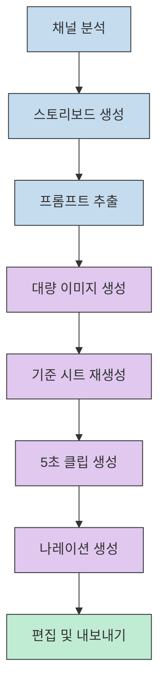
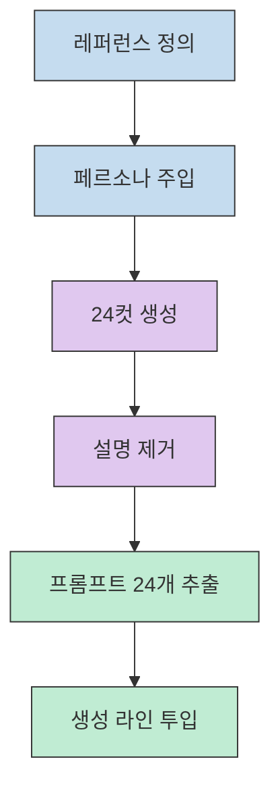
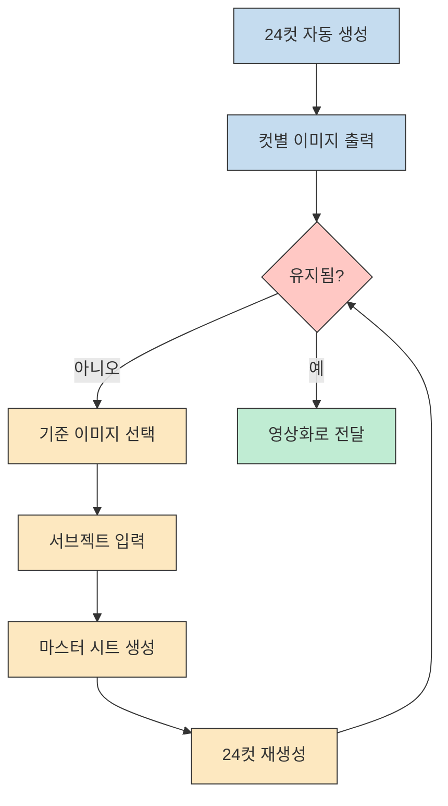
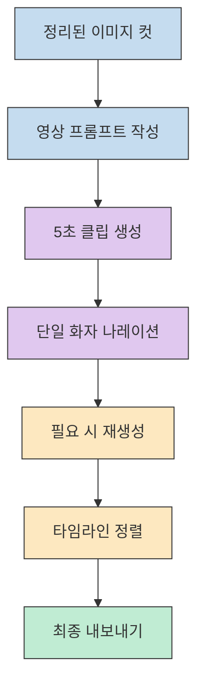
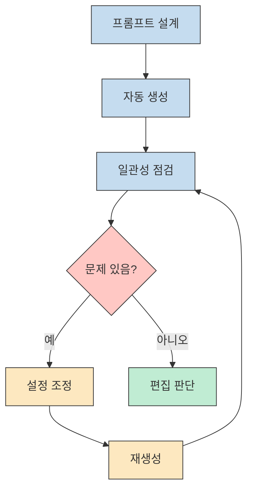

이 영상의 핵심은 "무료 툴을 몇 개 안다"가 아닙니다. 오히려 **기획 프롬프트를 구조화하고, 이미지 생성을 자동화하고, 캐릭터 일관성을 다시 고정한 뒤, 마지막에 영상·음성·편집을 한 줄로 이어 붙이는 생산 라인** 을 만드는 데 있습니다. 발표자는 이를 통해 유료 강의나 고정 구독 비용 없이도 AI 영상 채널을 굴릴 수 있다고 주장합니다. [근거 영상](https://youtu.be/tqEDfr1FJ7Y?t=10)

물론 이 주장을 그대로 "완전 무비용, 완전 자동"으로 받아들이면 곤란합니다. 영상 안에서도 크레딧 낭비를 막기 위해 설정을 꺼야 한다고 말하고, 마음에 안 드는 컷이나 어색한 음성은 다시 생성해야 한다고 여러 번 강조합니다. 그래서 이 글은 과장된 마케팅 문구를 반복하는 대신, **이 영상이 실제로 제시한 자동화 체인과 그 안의 병목** 을 단계별로 해부해 보겠습니다. [근거 영상](https://youtu.be/tqEDfr1FJ7Y?t=353)

<!--more-->

## Sources

- https://www.youtube.com/watch?v=tqEDfr1FJ7Y

## 1) 이 영상이 말하는 "0원 공장"은 사실상 파이프라인 설계다

영상 도입부는 상당히 공격적입니다. Kling, Midjourney, ElevenLabs, Runway 같은 익숙한 유료 도구 구독료를 나열한 뒤, 이를 모두 0원으로 만들 수 있다고 선언합니다. 이어서 구독자 수와 누적 조회수가 빠르게 오른 예시 채널을 보여주면서, 지브리풍 뮤직비디오 스타일 콘텐츠가 실제로 트래픽을 만들 수 있다고 강조합니다. 여기서 중요한 건 "툴 하나"가 아니라, **참조 채널을 보고 성공 구조를 역으로 분해한 다음 생산 공정으로 치환한다** 는 프레임입니다. [근거 영상](https://youtu.be/tqEDfr1FJ7Y?t=10) [근거 영상](https://youtu.be/tqEDfr1FJ7Y?t=29)

즉 이 영상의 메시지는 "무료 이미지 생성 툴 추천"이 아닙니다. 발표자는 처음부터 끝까지 하나의 공장을 설명합니다. 기획에서 컷 분해를 만들고, 그 컷을 자동 생성 라인에 태우고, 다시 일관성 보정 공정을 거친 뒤, 영상 프롬프트·나레이션·편집으로 넘깁니다. 무료라는 단어는 앞에 붙어 있지만, 실질적 차별점은 **반복 가능한 작업 단위를 얼마나 세밀하게 쪼개서 기계에 맡기느냐** 에 있습니다. [근거 영상](https://youtu.be/tqEDfr1FJ7Y?t=80)

## 2) Gemini 단계의 핵심은 "좋은 문장"이 아니라 "기계가 돌릴 수 있는 데이터"다

기획 단계에서 발표자가 가장 먼저 비판하는 것은 한 줄 프롬프트입니다. 그는 초보자가 "대충 한 줄"로 요청하기 때문에 실패한다고 말하면서, Gemini에 전문 시나리오 작가이자 아트디렉터라는 페르소나를 먼저 주입하는 샌드위치 프롬프트 방식을 제안합니다. 여기서 중요한 포인트는 캐릭터 정의, 영상 길이, 컷 수, 시각 질감 제약을 미리 넣어 두는 것입니다. 그래야 모델이 즉흥적으로 예쁜 문장을 뱉는 대신, 2분짜리 뮤직비디오를 24개의 5초 신으로 분해한 구조화된 결과를 낼 수 있습니다. [근거 영상](https://youtu.be/tqEDfr1FJ7Y?t=95) [근거 영상](https://youtu.be/tqEDfr1FJ7Y?t=150)

하지만 발표자는 여기서 한 번 더 정제 과정을 넣습니다. 생성된 스토리보드를 그대로 쓰지 않고, 장면 번호나 설명을 제거한 뒤 **이미지 생성용 프롬프트 24개만 따로 추출** 합니다. 이 부분이 특히 중요합니다. 이 영상의 흐름에서는 긴 스토리보드를 바로 자동 생성에 넣지 않고, **장면별 입력값으로 다시 잘게 쪼갠 뒤 자동화 라인에 투입** 하기 때문입니다. 그래서 여기서 말하는 자동화는 "한 번에 끝내는 마법"이 아니라, **초안을 반복 실행 가능한 입력 데이터로 다시 정리하는 과정** 에 더 가깝습니다. [근거 영상](https://youtu.be/tqEDfr1FJ7Y?t=170)

## 3) Whisk 단계의 진짜 과제는 대량 생성이 아니라 캐릭터 일관성 복구다

이제 추출된 24개 프롬프트는 크롬 확장 프로그램과 Whisk 조합으로 넘어갑니다. 발표자는 특정 버전의 확장 프로그램을 골라야 스크립트 충돌을 피할 수 있다고 말하고, Whisk 화면에서 텍스트 입력창에 장면 프롬프트들을 넣은 뒤 자동으로 생성·저장까지 반복하는 흐름을 보여 줍니다. 여기까지 보면 "방치형 공장"처럼 보이지만, 영상은 바로 다음 순간 이 흐름의 약점을 드러냅니다. 자동 생성된 이미지들은 컷마다 얼굴과 옷 디테일이 흔들리고, 그 결과 시청 몰입이 깨진다고 설명합니다. [근거 영상](https://youtu.be/tqEDfr1FJ7Y?t=182) [근거 영상](https://youtu.be/tqEDfr1FJ7Y?t=233)

그래서 발표자가 넣는 보정 공정이 마스터 캐릭터 시트입니다. 먼저 수십 장 중 가장 마음에 드는 한 장을 고른 뒤, 그 이미지를 일반 레퍼런스가 아니라 **서브젝트 슬롯** 에 넣고, 정면·후면·측면·전신을 포함한 설계도를 다시 그리게 합니다. 그리고 이 마스터 시트를 다시 서브젝트 기준 이미지로 넣은 채 24컷 자동 생성을 재실행합니다. 발표자는 이 과정을 거치면 캐릭터 외형과 의상이 90% 이상 일치한다고 말합니다. 즉, Whisk 자체가 마법처럼 일관성을 해결한다기보다, **대량 생성 이전에 기준 캐릭터를 한 번 더 정규화하는 보정 루프** 가 들어가야 결과가 안정됩니다. [근거 영상](https://youtu.be/tqEDfr1FJ7Y?t=264) [근거 영상](https://youtu.be/tqEDfr1FJ7Y?t=304)

## 4) Grok·Google AI Studio·CapCut 구간은 "자동화의 마지막 20%"를 사람이 붙잡는 단계다

이미지가 정리되면 발표자는 Gemini로 각 장면에 맞는 영상 생성용 프롬프트를 다시 쓰게 하고, 이를 Grok 쪽으로 넘깁니다. 여기서 재미있는 점은 그가 곧바로 "자동 비디오 생성" 옵션을 꺼야 한다고 경고한다는 것입니다. 이유는 단순합니다. 설정이 켜져 있으면 이미지를 올리는 순간 AI가 제멋대로 영상을 만들어 크레딧을 낭비하기 때문입니다. 다시 말해, 영상은 무료 자동화를 말하지만 실제 운영 포인트는 **어디를 자동으로 돌리고 어디서 자동화를 꺼야 손실이 줄어드는가** 에 더 가깝습니다. 이후에는 일관성 있게 만든 이미지를 한 컷씩 넣어 5초 분량의 클립을 만듭니다. [근거 영상](https://youtu.be/tqEDfr1FJ7Y?t=336) [근거 영상](https://youtu.be/tqEDfr1FJ7Y?t=353) [근거 영상](https://youtu.be/tqEDfr1FJ7Y?t=420)

나레이션 단계도 비슷합니다. 발표자는 Google AI Studio에서 프롬프트를 넣고, 결과로 나온 나레이션과 스타일 지시문을 싱글 스피커 오디오 항목에 복사해 넣는 흐름을 보여 줍니다. 한국어 음성을 원하면 추가 지시를 붙이라고 설명하고, 실제로 호흡과 억양이 살아 있는 음성을 시연합니다. 동시에 더 좋은 품질이 필요하면 Superton을 쓰되, 중간중간 어색한 보이스 구간이 나오면 계속 재생성해야 한다고 덧붙입니다. 즉 오디오는 "한 번 생성하고 끝"이 아니라, **샘플 청취와 재생성까지 포함한 검수 공정** 으로 취급해야 합니다. [근거 영상](https://youtu.be/tqEDfr1FJ7Y?t=434) [근거 영상](https://youtu.be/tqEDfr1FJ7Y?t=454) [근거 영상](https://youtu.be/tqEDfr1FJ7Y?t=462) [근거 영상](https://youtu.be/tqEDfr1FJ7Y?t=501) [근거 영상](https://youtu.be/tqEDfr1FJ7Y?t=514)

마지막 합성은 CapCut입니다. 발표자는 이미지·영상·오디오를 타임라인에 순서대로 얹고 내보내기만 하면 된다고 설명합니다. 이 흐름만 놓고 보면, 앞부분에서 만든 여러 자동화 산출물을 최종 시청 경험으로 묶는 단계가 바로 편집입니다. 그래서 이 파이프라인의 마무리는 AI 모델 하나가 아니라, **여러 조각난 결과물을 한 편의 영상 리듬으로 배열하는 편집 결정** 에서 이뤄진다고 읽을 수 있습니다. [근거 영상](https://youtu.be/tqEDfr1FJ7Y?t=586) [근거 영상](https://youtu.be/tqEDfr1FJ7Y?t=606) [근거 영상](https://youtu.be/tqEDfr1FJ7Y?t=784)

## 5) 이 워크플로우에서 정말 배워야 할 것은 "실행력"보다 병목 관리다

영상의 마지막 메시지는 "복잡한 코딩 지식보다 실행력이 중요하다"로 정리됩니다. 이 말은 절반만 맞습니다. 실제로 영상을 따라가 보면 병목은 분명합니다. 프롬프트를 어떻게 데이터화할지, 자동 생성 결과 중 무엇을 기준 이미지로 삼을지, Grok에서 어느 설정을 꺼야 할지, 오디오의 어색한 구간을 몇 번이나 재생성할지, 최종 편집에서 무엇을 버릴지 같은 판단은 전부 사람 몫입니다. 따라서 이 워크플로우의 실질적 교훈은 "그냥 실행하라"가 아니라, **어떤 단계가 불안정한지 빨리 발견하고 그 단계만 다시 태우는 운영 감각이 필요하다** 는 쪽에 가깝습니다. [근거 영상](https://youtu.be/tqEDfr1FJ7Y?t=176) [근거 영상](https://youtu.be/tqEDfr1FJ7Y?t=304) [근거 영상](https://youtu.be/tqEDfr1FJ7Y?t=521) [근거 영상](https://youtu.be/tqEDfr1FJ7Y?t=784)

이 점에서 이 영상은 생각보다 솔직합니다. 그는 카카오톡 방에 프롬프트와 워크플로를 공유하겠다고 말하지만, 정작 영상 안에서 반복해서 보여주는 것은 "좋은 기준 이미지를 고르기", "자동 생성 옵션 끄기", "마음에 안 들면 재생성하기" 같은 운영적 개입입니다. 결국 무료 AI 영상 제작의 진입장벽은 도구 가격이 아니라, **반복 생성 라인을 설계하고 실패 지점을 교정하는 습관** 에 있습니다. [근거 영상](https://youtu.be/tqEDfr1FJ7Y?t=264) [근거 영상](https://youtu.be/tqEDfr1FJ7Y?t=353) [근거 영상](https://youtu.be/tqEDfr1FJ7Y?t=797)

## 핵심 요약

- 이 영상의 "0원 자동화"는 단일 툴 추천이 아니라 `기획 -> 이미지 프롬프트 추출 -> 대량 생성 -> 일관성 보정 -> 영상화 -> 음성 생성 -> 편집` 으로 이어지는 생산 라인 제안입니다. [근거 영상](https://youtu.be/tqEDfr1FJ7Y?t=80)
- Gemini 단계의 핵심은 멋진 문장을 얻는 것이 아니라, 24개의 5초 장면으로 분해된 실행 가능한 작업 큐를 만드는 것입니다. [근거 영상](https://youtu.be/tqEDfr1FJ7Y?t=150)
- Whisk 단계의 병목은 속도가 아니라 캐릭터 일관성 붕괴이며, 이를 해결하기 위해 서브젝트 슬롯과 마스터 시트 재생성 루프가 들어갑니다. [근거 영상](https://youtu.be/tqEDfr1FJ7Y?t=264) [근거 영상](https://youtu.be/tqEDfr1FJ7Y?t=304)
- Grok과 오디오 구간은 완전 자동보다 설정 제어와 재생성이 더 중요합니다. 자동 비디오 생성 옵션을 끄고, 음성 품질이 어색하면 다시 뽑는 식의 운영이 필요합니다. [근거 영상](https://youtu.be/tqEDfr1FJ7Y?t=353) [근거 영상](https://youtu.be/tqEDfr1FJ7Y?t=514)
- 마지막 품질은 CapCut 같은 편집 단계에서 결정됩니다. AI가 만든 조각들을 한 편의 영상처럼 느껴지게 만드는 것은 결국 사람의 배열과 선택입니다. [근거 영상](https://youtu.be/tqEDfr1FJ7Y?t=586)

## 결론

이 영상이 흥미로운 이유는 "무료 AI 툴 모음"을 보여줘서가 아닙니다. 오히려 무료 툴만으로도 꽤 긴 제작 체인을 만들 수 있다는 점, 그리고 그 체인이 실제로는 **재가공과 교정 루프** 에 기대어 굴러간다는 점을 선명하게 보여주기 때문입니다.

그래서 이 영상을 보고 바로 배워야 할 것은 특정 서비스 이름이 아닙니다. 진짜 핵심은, 장면을 얼마나 잘 쪼개는지, 기준 이미지를 어떻게 세우는지, 어느 구간에서 자동화를 끄는지, 어색한 결과를 몇 번까지 다시 돌릴지 같은 운영 설계입니다. 이 영상의 결말도 결국 같은 방향을 가리킵니다. 제작비 0원이라는 문구보다 중요한 것은, **실패 지점을 통제하면서 끝까지 돌릴 수 있는 자동화 파이프라인을 만들 수 있느냐** 입니다. [근거 영상](https://youtu.be/tqEDfr1FJ7Y?t=795)

<!--
Evidence notes
- claim: The video opens by framing paid AI video tooling costs and pitching a zero-cost alternative pipeline | transcript/time marker: "클링 월 25달러... 합계 연간 100만 원" / 00:10-00:22 | video url: https://youtu.be/tqEDfr1FJ7Y?t=10 | confidence: high
- claim: The presenter uses example channels to argue that Ghibli-style AI videos can attract views and subscribers | transcript/time marker: "모칼 뮤직... 코지브리키친" / 00:29-00:55 | video url: https://youtu.be/tqEDfr1FJ7Y?t=29 | confidence: high
- claim: The overall flow is positioned as a full automation pipeline rather than a single-tool trick | transcript/time marker: "무료 생성형 AI들을 조합한 자동화 파이프라인" / 01:20 | video url: https://youtu.be/tqEDfr1FJ7Y?t=80 | confidence: high
- claim: The planning stage uses a sandwich prompt and persona injection in Gemini to generate a structured storyboard | transcript/time marker: "샌드위치 프롬포트" / 01:35-01:53 | video url: https://youtu.be/tqEDfr1FJ7Y?t=95 | confidence: high
- claim: Gemini is instructed to output 24 scenes for a 120-second storyboard with narration and image prompts | transcript/time marker: "정확히 24개의 신 총 120초" / 02:30-02:39 | video url: https://youtu.be/tqEDfr1FJ7Y?t=150 | confidence: high
- claim: The second prompt extracts only the image-generation prompts as machine-runnable data | transcript/time marker: "순수한 이미지 프로포트 데이터 24개" / 02:50-02:56 | video url: https://youtu.be/tqEDfr1FJ7Y?t=170 | confidence: high
- claim: Auto-Whisk plus a specific extension version is presented as the mass-generation engine | transcript/time marker: "오토스크... 버전 7.5-5-1" / 03:02-03:18 | video url: https://youtu.be/tqEDfr1FJ7Y?t=182 | confidence: medium
- claim: Automatically generated images suffer from character consistency drift across scenes | transcript/time marker: "얼굴이 좀 미묘하게 다르고 옷의 디테일이 바뀌어" / 03:53-03:59 | video url: https://youtu.be/tqEDfr1FJ7Y?t=233 | confidence: high
- claim: The fix is to place the chosen image in the subject slot and generate a multi-view master sheet | transcript/time marker: "서브젝트 슬롯... 정면 후면 측면 전신 샷" / 04:24-04:40 | video url: https://youtu.be/tqEDfr1FJ7Y?t=264 | confidence: high
- claim: Re-running generation from the master sheet is said to produce 90%+ visual consistency | transcript/time marker: "의상이 90% 이상 일치" / 05:00-05:11 | video url: https://youtu.be/tqEDfr1FJ7Y?t=300 | confidence: high
- claim: Grok is used for image-to-video, but auto video generation should be turned off to avoid wasted credits | transcript/time marker: "자동 비디오 생성 활성화 버튼을 꺼 주세요" / 05:36-06:11 | video url: https://youtu.be/tqEDfr1FJ7Y?t=336 | confidence: high
- claim: The resulting clip length is described as a natural 5-second moving shot | transcript/time marker: "자연스럽게 움직이는 5초짜리 영상을" / 07:00-07:03 | video url: https://youtu.be/tqEDfr1FJ7Y?t=420 | confidence: high
- claim: Google AI Studio is used to generate narration via the single-speaker audio flow, with Korean as an option | transcript/time marker: "싱글 스피커 오디오 항목... 한글 음성" / 07:14-07:45 | video url: https://youtu.be/tqEDfr1FJ7Y?t=434 | confidence: high
- claim: Superton is recommended as a higher-quality option, but awkward segments still require regeneration | transcript/time marker: "슈퍼톤이 가장 안정적인 퀄리티... 재생성을" / 08:21-08:44 | video url: https://youtu.be/tqEDfr1FJ7Y?t=501 | confidence: high
- claim: CapCut is the final assembly step where image, video, and audio are arranged on a timeline and exported | transcript/time marker: "캡컷... 타임라인... 내보내기" / 09:46-10:15 | video url: https://youtu.be/tqEDfr1FJ7Y?t=586 | confidence: high
- claim: The closing message emphasizes execution, workflow sharing, and channel launch rather than coding complexity | transcript/time marker: "복잡한 코딩 지식 필요가 없습니다... 워크플로우" / 13:04-13:18 | video url: https://youtu.be/tqEDfr1FJ7Y?t=784 | confidence: high
- claim: The ending frames the outcome as a choice to act now and start a channel using the workflow | transcript/time marker: "오늘 당장이 방식으로 채널을 개설하고" / 13:17-13:19 | video url: https://youtu.be/tqEDfr1FJ7Y?t=795 | confidence: high
-->
