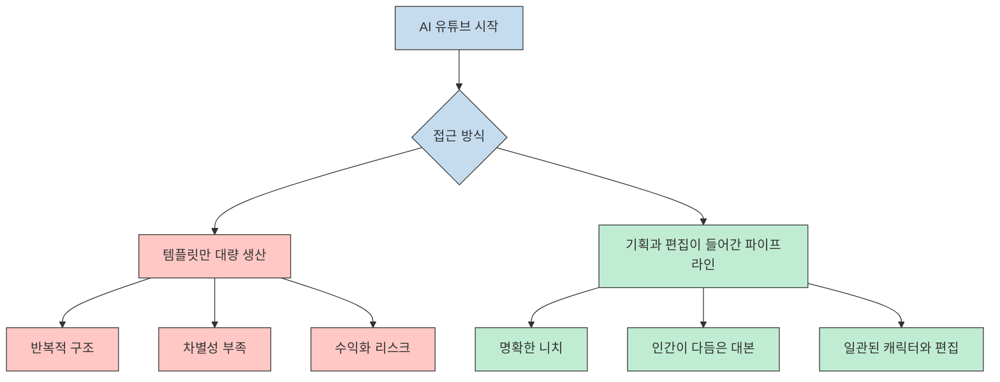
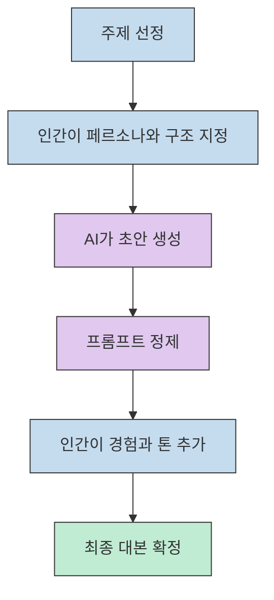
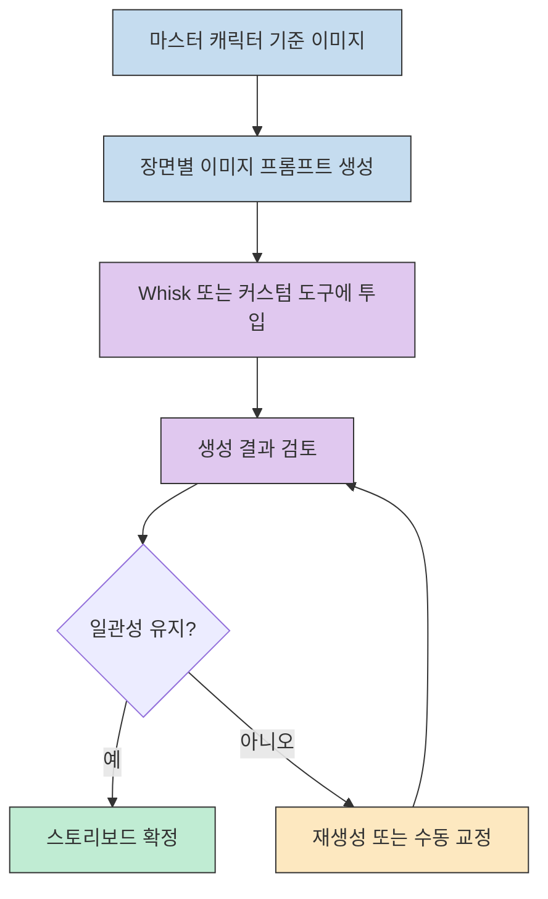
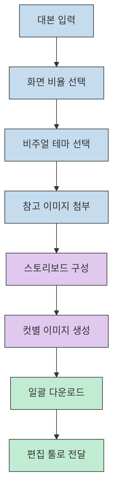
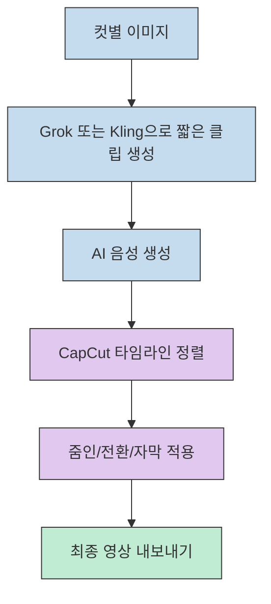
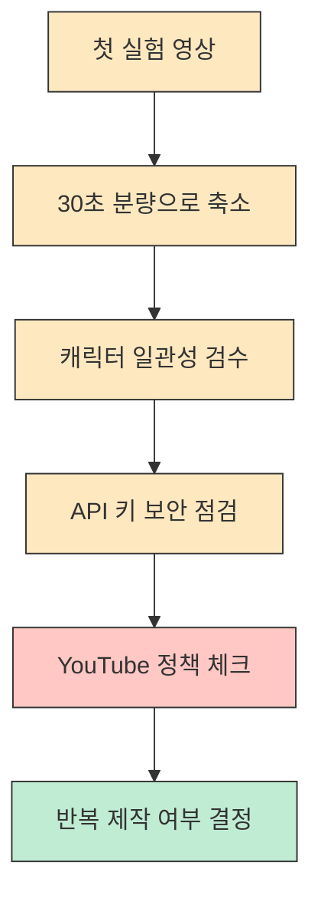

2026년의 AI 유튜브를 이야기할 때 가장 흔한 오해는 두 가지입니다. 첫째, "이제 레드오션이라 늦었다"는 말입니다. 둘째, "결국 돈 쓰는 사람이 이긴다"는 말입니다. 이번에 묶어 본 네 편의 영상은 이 두 주장에 동시에 반박합니다. 다만 중요한 조건이 하나 있습니다. 무료 툴을 쓴다고 해서 자동으로 성공하는 것이 아니라, **기획 - 대본 - 시각 일관성 - 영상화 - 편집 - 정책 대응**이 한 묶음으로 돌아가야 한다는 점입니다.[^1][^2]

이 글은 각 영상을 따로 요약하지 않습니다. 대신 네 소스를 하나의 제작 스택으로 다시 조립합니다. 어떤 부분은 제작자 경험담으로 받아들여야 하고, 어떤 부분은 공식 문서로 교차 검증할 수 있는지도 함께 나눠서 보겠습니다.

<!--more-->

## Sources

- [https://www.youtube.com/watch?v=tqEDfr1FJ7Y](https://www.youtube.com/watch?v=tqEDfr1FJ7Y) - AI Astra, 지브리풍 무료 자동화 파이프라인과 Auto-Whisk 기반 대량 생성
- [https://www.youtube.com/watch?v=2DOKwpzkarU](https://www.youtube.com/watch?v=2DOKwpzkarU) - 알리도콜센터, Grok 중심의 초보자/시니어 친화형 이미지-투-비디오 입문
- [https://www.youtube.com/watch?v=CEGe3Og1l_0](https://www.youtube.com/watch?v=CEGe3Og1l_0) - AI Astra, 심리학/경제학형 블루오션 채널 전략과 마스터 캐릭터 운영
- [https://www.youtube.com/watch?v=BLTdSwwJPNc](https://www.youtube.com/watch?v=BLTdSwwJPNc) - 게으른 유튜버, Gemini API 기반 스토리보드 자동화 도구와 편집 팁

## 왜 아직도 AI 유튜브가 기회처럼 보이는가

네 영상이 공통으로 밀고 있는 메시지는 단순합니다. 얼굴을 드러내지 않는 채널이어도, 심리학이나 경제학처럼 체류 시간이 길고 광고 단가가 높은 주제를 잡으면 빠르게 성장할 수 있다는 것입니다. 실제로 한 영상은 개설 1개월 내 2만 명 수준까지 도달한 사례와 해외 채널의 천만 뷰 사례를 들면서 "아직 끝나지 않았다"는 논리를 폅니다. 하지만 여기서 바로 따라야 할 결론은 "누구나 월 1,000만 원을 벌 수 있다"가 아니라, **성과 수치는 creator-reported 사례로 읽고, 구조적 교훈만 추출해야 한다**는 것입니다.[^3]

동시에 공식 YouTube 정책은 2025년부터 반복적이고 대량 생산된 콘텐츠를 "inauthentic content"로 더 명확하게 규정하고 있습니다. 즉, 템플릿만 돌린 영상, 거의 차이가 없는 대량 복제형 영상, 이미지 슬라이드쇼 수준의 저변형 콘텐츠는 수익화 대상에서 밀려날 수 있습니다. 이 지점이 중요합니다. 이번 네 소스가 가치 있는 이유는 "무료 툴 소개"가 아니라, 왜 사람 손이 마지막에 반드시 들어가야 하는지를 계속 강조하기 때문입니다.[^4]

이번 네 편을 한 줄로 요약하면 이렇습니다. **성공 포인트는 툴이 아니라 파이프라인의 결합 방식**입니다. 심리학/경제학형 고단가 니치를 정하고, AI가 잘하는 반복 생성은 극대화하되, 인간이 잘하는 공감과 구조화와 최종 편집은 남겨 두는 방식입니다.[^5]

## 대본 단계: 샌드위치 프롬프트와 인간 편집이 왜 핵심인가

가장 먼저 정리해야 할 것은 대본입니다. AI Astra 영상 두 편은 공통으로 "심리학 영상 대본 써줘" 같은 한 줄 요청이 실패의 출발점이라고 말합니다. 대신 페르소나를 먼저 심고, 기승전결 구조와 시청 지속 시간 장치를 강제하고, 필요하다면 책이나 논문 같은 신뢰 보조 재료까지 함께 요구하는 식의 샌드위치 프롬프트를 제안합니다. 핵심은 AI를 만능 작가로 두는 것이 아니라, 인간 기획의 중간 엔진으로 쓰는 것입니다.[^6][^7]

여기서 흥미로운 점은 지브리풍 자동화 영상도 같은 구조를 반복한다는 것입니다. 뮤직비디오형 영상을 만들 때도 먼저 캐릭터 설정, 장면 길이, 전체 컷 수 같은 제약을 고정한 뒤, 스토리보드를 뽑고, 다시 불필요한 설명을 제거해 순수 이미지 프롬프트만 추출합니다. 즉, 장르가 심리학이든 뮤직비디오든 공통 규칙은 같습니다. **처음 프롬프트는 창의성을 여는 용도이고, 두 번째 프롬프트는 기계가 반복 실행하기 좋은 데이터로 정제하는 용도**입니다.[^8]

그리고 네 영상 가운데 가장 현실적인 조언은 "사람의 터치"입니다. AI가 작성한 문장을 그대로 읽으면 전달력은 있어도 몰입감은 떨어집니다. 반대로 개인 경험 한두 줄, 감정이 실리는 연결 문장, 시청자가 자기 이야기처럼 느끼게 하는 질문을 넣으면 같은 정보라도 체류 시간이 달라집니다. YouTube 정책의 관점에서도 이 차이는 작지 않습니다. 단순 TTS 낭독과, 해석과 구조화와 화자의 의도가 담긴 대본은 완전히 다른 결과를 만듭니다.[^4][^9]

실무적으로는 이 단계에서 이미 채널 차별화가 시작됩니다. 2026년에는 이미지 생성, 음성 생성, 짧은 영상 생성 자체는 상향 평준화되고 있습니다. 그래서 경쟁력은 "어떤 툴을 썼는가"보다, **어떤 문제의식을 어떤 순서로 말하게 했는가**로 옮겨갑니다. 네 영상이 모두 다른 툴을 말해도 비슷한 결론으로 수렴하는 이유가 여기에 있습니다.[^10]

## 시각화 단계: 마스터 캐릭터, Whisk, 그리고 자동 스토리보드

다음 병목은 시각 일관성입니다. 많은 AI 유튜브 영상이 티가 나는 이유는 컷이 바뀔 때마다 얼굴, 옷, 색감, 구도가 흔들리기 때문입니다. AI Astra는 이 문제를 해결하기 위해 "마스터 캐릭터"를 먼저 만든 뒤, 전면 - 측면 - 후면 - 전신 기준 이미지를 고정하고 나서 프롬프트 생성을 이어가는 방식을 보여 줍니다. 심리학 채널 사례에서는 일부러 스틱맨처럼 단순한 캐릭터를 쓰는 이유까지 설명하는데, 디테일이 적을수록 일관성 관리가 쉬워지기 때문입니다.[^11]

여기서 Google Whisk를 보는 시각은 조금 조정할 필요가 있습니다. 공식 소개에 따르면 Whisk는 subject, scene, style 이미지를 받아 Gemini가 이를 설명문으로 풀고, 다시 Imagen 3로 이미지를 생성하는 구조입니다. 중요한 것은 Google이 직접 "exact replica"가 아니라 **subject의 essence를 포착하는 도구**라고 설명한다는 점입니다. 즉, Whisk는 아이디어 탐색과 빠른 변형에는 강하지만, 완전한 캐릭터 고정 장치로 믿고 들어가면 어긋날 수 있습니다. 그래서 영상 제작 관점에서는 Whisk 하나로 끝내기보다, 마스터 캐릭터 기준 이미지를 먼저 만들고, 필요하면 여러 번 재생성하거나 수동 선별 단계를 두는 편이 더 현실적입니다.[^12]

게으른 유튜버 영상은 이 단계를 더 제품화된 방식으로 보여 줍니다. 대본, 화면 비율, 비주얼 테마, 참고 이미지를 넣으면 스토리보드를 구성하고 전체 이미지를 생성/다운로드하는 커스텀 툴을 제시합니다. 이 접근은 Whisk 자체를 대체한다기보다, **Whisk형 작업을 한 단계 더 래핑한 생산성 계층**으로 이해하는 편이 정확합니다. 특히 한 장씩 생성/선별할지, 전체 생성으로 밀어붙일지 선택지를 주는 점은 실전형 워크플로우에 가깝습니다.[^13]

여기서 Gemini Canvas가 연결됩니다. 공식 Canvas 소개에 따르면 Canvas는 프롬프트만으로 공유 가능한 앱이나 게임, 웹 페이지 같은 프로토타입을 몇 분 안에 만들어 주는 공간입니다. 이 말은 곧, 영상 제작자가 원하는 UI를 갖춘 "나만의 스토리보드 생성기"나 "유튜브 분석기"를 직접 코드 없이 뼈대까지 만드는 것이 가능하다는 뜻입니다. 네 번째 영상이 보여준 HTML 내보내기, 기간 필터 추가, UI 재수정 같은 흐름은 바로 이 Canvas식 반복 제작 문화와 맞닿아 있습니다.[^14][^15]

## 모션과 편집 단계: Grok, Kling, CapCut을 어떻게 나눠 쓸 것인가

이미지가 준비되면 다음 단계는 정지 이미지를 영상처럼 보이게 만드는 것입니다. 여기서 네 영상은 서로 다른 난이도의 경로를 제공합니다. 가장 쉬운 진입은 Grok입니다. 사진 한 장을 넣고 짧은 시간 안에 움직이는 장면을 뽑아내는 흐름, 마지막 프레임을 저장해 다음 컷의 시작점으로 이어붙이는 방식, 가족 사진이나 손주 사진처럼 개인 사진을 짧은 영상으로 바꾸는 사용례는 AI 영상 제작의 진입 장벽을 확실히 낮춥니다. 특히 시니어 친화적 설명이 많아 "처음부터 툴 체인을 다 익히지 말고 우선 한 컷을 움직여 보라"는 접근으로 읽을 수 있습니다.[^16]

반면 블루오션/경제학형 영상들은 더 생산적인 방향을 택합니다. 이미지 컷 수가 많아지면, 장면별 프롬프트를 비디오 프롬프트로 바꾸고, Kling이나 Grok 같은 이미지-투-비디오 계층으로 넣어 짧은 클립을 뽑은 다음, 이를 CapCut에서 연결하는 식입니다. 여기서 중요한 건 "모든 컷을 영상으로 만들 필요는 없다"는 점입니다. 게으른 유튜버 영상이 초반 3컷 정도만 동영상으로 시작하라고 말하는 이유는, 초반 몰입만 확보해도 나머지 정적 컷의 체감 품질이 달라지기 때문입니다.[^17][^18]

오디오도 같은 원리입니다. 영문이면 ElevenLabs, 한글이면 슈퍼톤이나 타이캐스트를 추천하는 식으로 소스마다 차이가 있지만, 실제 교훈은 단 하나입니다. **대본과 음성이 어색하면 영상 전체가 싼 티가 난다**는 것입니다. 그래서 음성은 생성 자체보다 검수와 재생성이 중요합니다. 실제 영상에서도 여러 톤을 들어 보고 고르는 과정, 어색한 구간은 다시 만드는 과정이 반복적으로 강조됩니다.[^19]

마지막 편집에서는 CapCut의 줌인 효과가 자주 언급됩니다. 경제학/심리학 채널에서 많이 보이는 "이미지가 서서히 확대되는 느낌"은 거창한 모션 그래픽이 아니라, 시작과 끝에 키프레임을 주고 최종 크기를 약 30% 키우는 방식으로도 충분히 구현됩니다. 중요한 것은 효과 자체보다, **정적인 컷에 미세한 운동을 넣어 지루함을 늦추는 것**입니다.[^20]

결국 이 단계의 핵심은 도구 선택보다 역할 분리입니다. Grok은 입문과 빠른 실험에 좋고, Kling은 더 본격적인 짧은 클립 생성에 맞고, CapCut은 전체를 한 편의 영상처럼 느껴지게 만드는 접착제 역할을 합니다. 한 툴로 모든 것을 해결하려고 할수록 결과가 흔들리고, 단계별로 툴을 나누면 오히려 무료 혹은 저비용 조합으로도 완성도가 올라갑니다.[^21]

## 실전 적용 포인트

실제로 따라 할 때는 네 영상을 모두 한 번에 복제하려고 하면 오히려 실패합니다. 가장 작은 단위로 쪼개는 편이 좋습니다.

첫째, 채널 실험 단계에서는 `주제 1개 + 대본 1개 + 캐릭터 1개 + 30초 분량`만 만드세요. 처음부터 90컷짜리 대량 생성 파이프라인으로 가면, 무엇이 병목인지도 모른 채 시간만 씁니다. 둘째, Whisk나 커스텀 스토리보드 도구에서 나온 이미지는 반드시 "일관성 검수"를 거치세요. 공식 설명대로 Whisk는 essence를 잡는 도구이지 복제기가 아니기 때문입니다.[^12]

셋째, API 키는 콘텐츠 제작 효율보다 먼저 보안 대상으로 보아야 합니다. Gemini API 공식 문서는 AI Studio에서 키를 만들고, `x-goog-api-key` 헤더로 인증하며, 실제 운영에서는 환경 변수 `GEMINI_API_KEY` 사용을 권장합니다. 또 더 이상 쓰지 않거나 노출된 키는 삭제하는 것이 보안 모범 사례라고 명시합니다. 네 번째 영상의 "노출되면 삭제 후 재생성" 경고는 이 공식 가이드와 정확히 맞아떨어집니다.[^15][^22]

넷째, 수익화 목표가 있다면 가장 늦게 볼 문서는 YouTube 정책이 아니라 가장 먼저 볼 문서여야 합니다. YouTube는 원본성, 비대량성, 실질적 차별화, 시청자 가치 제공을 기준으로 채널을 봅니다. 즉, AI 채널의 성공은 "AI를 썼느냐"가 아니라 **AI를 써서도 여전히 사람에게 볼 이유를 제공하느냐**에 달려 있습니다.[^4]

## 핵심 요약

- 네 영상이 공통으로 말하는 성공 공식은 "무료 툴"이 아니라 **기획 - 시각 일관성 - 짧은 영상화 - 편집 - 정책 대응**의 결합입니다.[^1][^3]
- 대본 단계에서는 샌드위치 프롬프트와 인간 윤색이 필수입니다. AI 초안만으로는 차별화가 부족하고, YouTube 정책상으로도 취약합니다.[^4][^6]
- 시각 단계에서는 마스터 캐릭터가 핵심이며, Whisk는 빠른 리믹스와 탐색에 강하지만 exact replica 도구로 보면 안 됩니다.[^11][^12]
- 모션 단계에서는 Grok, Kling, CapCut을 역할별로 나눠 쓰는 편이 현실적입니다. 모든 컷을 영상으로 만들기보다 초반 몰입 컷부터 확보하는 것이 효율적입니다.[^17][^20]
- Gemini Canvas와 커스텀 도구는 2026년 AI 유튜브의 차별화를 "툴 사용"에서 "툴 자체를 나에게 맞게 묶는 능력"으로 바꾸고 있습니다.[^14][^15]

## 결론

이 네 편의 영상을 하나로 합치면, 2026년의 AI 유튜브는 더 이상 "어떤 생성 모델이 최고인가"의 싸움이 아니라는 점이 선명해집니다. 중요한 것은 어떤 니치를 잡고, 어떤 캐릭터와 톤을 유지하며, 어디까지 자동화하고 어디서 사람 손을 넣을지 결정하는 운영 설계입니다.

그래서 진짜 블루오션은 툴 목록 바깥에 있습니다. Whisk, Grok, Gemini Canvas, Kling, CapCut은 모두 수단일 뿐이고, 채널을 살리는 것은 결국 **시청자가 다음 영상도 보고 싶게 만드는 구조**입니다. 무료 도구로도 시작할 수 있지만, 무료라서 성공하는 것은 아닙니다. 구조가 있기 때문에 시작할 가치가 생기는 것입니다.

[^1]: [https://youtu.be/CEGe3Og1l_0?t=3](https://youtu.be/CEGe3Og1l_0?t=3)
[^2]: [https://youtu.be/tqEDfr1FJ7Y?t=15](https://youtu.be/tqEDfr1FJ7Y?t=15)
[^3]: [https://youtu.be/CEGe3Og1l_0?t=10](https://youtu.be/CEGe3Og1l_0?t=10), [https://youtu.be/CEGe3Og1l_0?t=30](https://youtu.be/CEGe3Og1l_0?t=30), [https://youtu.be/CEGe3Og1l_0?t=45](https://youtu.be/CEGe3Og1l_0?t=45)
[^4]: [https://support.google.com/youtube/answer/1311392](https://support.google.com/youtube/answer/1311392)
[^5]: [https://youtu.be/CEGe3Og1l_0?t=65](https://youtu.be/CEGe3Og1l_0?t=65)
[^6]: [https://youtu.be/CEGe3Og1l_0?t=120](https://youtu.be/CEGe3Og1l_0?t=120), [https://youtu.be/CEGe3Og1l_0?t=125](https://youtu.be/CEGe3Og1l_0?t=125)
[^7]: [https://youtu.be/CEGe3Og1l_0?t=150](https://youtu.be/CEGe3Og1l_0?t=150), [https://youtu.be/CEGe3Og1l_0?t=180](https://youtu.be/CEGe3Og1l_0?t=180)
[^8]: [https://youtu.be/tqEDfr1FJ7Y?t=15](https://youtu.be/tqEDfr1FJ7Y?t=15)
[^9]: [https://youtu.be/CEGe3Og1l_0?t=180](https://youtu.be/CEGe3Og1l_0?t=180)
[^10]: [https://youtu.be/BLTdSwwJPNc?t=100](https://youtu.be/BLTdSwwJPNc?t=100), [https://youtu.be/2DOKwpzkarU?t=1](https://youtu.be/2DOKwpzkarU?t=1)
[^11]: [https://youtu.be/CEGe3Og1l_0?t=195](https://youtu.be/CEGe3Og1l_0?t=195), [https://youtu.be/CEGe3Og1l_0?t=210](https://youtu.be/CEGe3Og1l_0?t=210), [https://youtu.be/CEGe3Og1l_0?t=220](https://youtu.be/CEGe3Og1l_0?t=220)
[^12]: [https://blog.google/innovation-and-ai/models-and-research/google-labs/whisk/](https://blog.google/innovation-and-ai/models-and-research/google-labs/whisk/)
[^13]: [https://youtu.be/BLTdSwwJPNc?t=15](https://youtu.be/BLTdSwwJPNc?t=15), [https://youtu.be/BLTdSwwJPNc?t=25](https://youtu.be/BLTdSwwJPNc?t=25), [https://youtu.be/BLTdSwwJPNc?t=35](https://youtu.be/BLTdSwwJPNc?t=35)
[^14]: [https://gemini.google/overview/canvas/](https://gemini.google/overview/canvas/)
[^15]: [https://youtu.be/BLTdSwwJPNc?t=100](https://youtu.be/BLTdSwwJPNc?t=100), [https://youtu.be/BLTdSwwJPNc?t=115](https://youtu.be/BLTdSwwJPNc?t=115), [https://youtu.be/BLTdSwwJPNc?t=120](https://youtu.be/BLTdSwwJPNc?t=120)
[^16]: [https://youtu.be/2DOKwpzkarU?t=1](https://youtu.be/2DOKwpzkarU?t=1), [https://youtu.be/2DOKwpzkarU?t=497](https://youtu.be/2DOKwpzkarU?t=497)
[^17]: [https://youtu.be/BLTdSwwJPNc?t=65](https://youtu.be/BLTdSwwJPNc?t=65), [https://youtu.be/BLTdSwwJPNc?t=70](https://youtu.be/BLTdSwwJPNc?t=70)
[^18]: [https://youtu.be/CEGe3Og1l_0?t=290](https://youtu.be/CEGe3Og1l_0?t=290), [https://youtu.be/CEGe3Og1l_0?t=300](https://youtu.be/CEGe3Og1l_0?t=300)
[^19]: [https://youtu.be/CEGe3Og1l_0?t=320](https://youtu.be/CEGe3Og1l_0?t=320), [https://youtu.be/BLTdSwwJPNc?t=75](https://youtu.be/BLTdSwwJPNc?t=75)
[^20]: [https://youtu.be/BLTdSwwJPNc?t=85](https://youtu.be/BLTdSwwJPNc?t=85), [https://youtu.be/CEGe3Og1l_0?t=370](https://youtu.be/CEGe3Og1l_0?t=370)
[^21]: [https://youtu.be/2DOKwpzkarU?t=1](https://youtu.be/2DOKwpzkarU?t=1), [https://youtu.be/BLTdSwwJPNc?t=80](https://youtu.be/BLTdSwwJPNc?t=80)
[^22]: [https://ai.google.dev/gemini-api/docs/api-key](https://ai.google.dev/gemini-api/docs/api-key)
