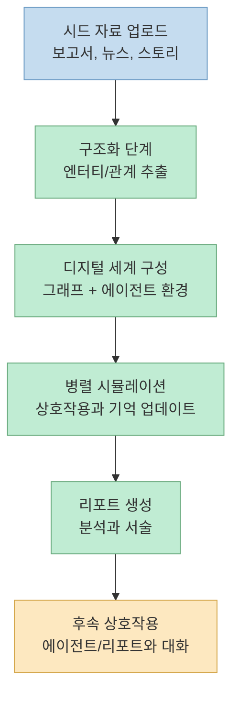
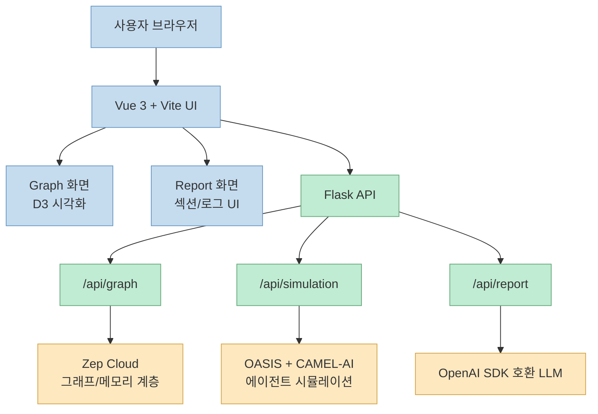
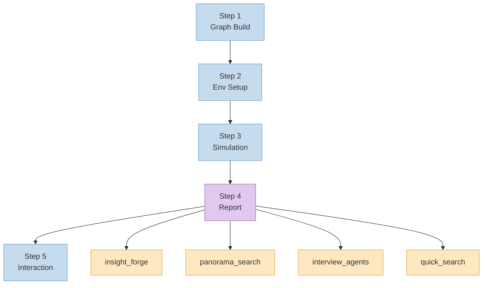
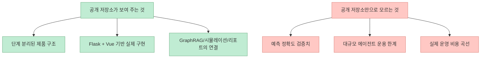

`MiroFish-Ko`는 저장소 소개 문구만 보면 꽤 과감합니다. "무엇이든 예측한다" 는 표현을 전면에 두고, 뉴스나 정책 초안, 금융 신호 같은 현실 세계의 시드 정보를 넣으면 수천 개의 에이전트가 상호작용하는 병렬 디지털 세계를 만들어 미래를 리허설할 수 있다고 설명합니다. 공개 저장소 기준으로 보면 이 프로젝트는 단순한 챗봇이 아니라, 입력 문서를 그래프와 에이전트 환경으로 바꾸고 시뮬레이션을 돌린 뒤 보고서와 후속 상호작용까지 이어지는 **멀티 에이전트 예측 애플리케이션** 으로 읽는 편이 더 정확합니다.

<!--more-->

## Sources

- https://github.com/ByeongkiJeong/MiroFish-Ko
- https://raw.githubusercontent.com/ByeongkiJeong/MiroFish-Ko/main/README.md
- https://raw.githubusercontent.com/ByeongkiJeong/MiroFish-Ko/main/package.json
- https://raw.githubusercontent.com/ByeongkiJeong/MiroFish-Ko/main/frontend/package.json
- https://raw.githubusercontent.com/ByeongkiJeong/MiroFish-Ko/main/backend/pyproject.toml
- https://raw.githubusercontent.com/ByeongkiJeong/MiroFish-Ko/main/backend/app/__init__.py
- https://raw.githubusercontent.com/ByeongkiJeong/MiroFish-Ko/main/frontend/src/components/GraphPanel.vue
- https://raw.githubusercontent.com/ByeongkiJeong/MiroFish-Ko/main/frontend/src/components/Step4Report.vue
- https://raw.githubusercontent.com/ByeongkiJeong/MiroFish-Ko/main/docker-compose.yml
- https://raw.githubusercontent.com/ByeongkiJeong/MiroFish-Ko/main/.env.example

## 1) MiroFish-Ko가 풀려는 문제: "질문에 답하는 AI"가 아니라 "세계를 굴려 보는 AI"

README가 가장 먼저 강조하는 지점은 이 프로젝트의 단위가 단일 응답이 아니라는 점입니다. 사용자는 데이터 분석 보고서나 이야기 텍스트 같은 시드 자료를 넣고, 자연어로 예측 요구사항을 적습니다. 그다음 시스템은 이를 기반으로 병렬 디지털 세계를 만들고, 그 안에서 다수의 에이전트가 상호작용하도록 구성합니다. 즉 입력과 출력의 모양이 일반적인 RAG 질의응답과 다릅니다. 입력은 문서 + 요구사항이고, 출력은 답변 한 줄이 아니라 **시뮬레이션 결과 리포트와 상호작용 가능한 환경** 입니다.

이 접근이 흥미로운 이유는 예측 문제를 "정답 맞히기"가 아니라 "사회적 전개를 미리 돌려 보기"로 다시 정의하기 때문입니다. README는 현실 세계의 시드 정보에서 고충실도 병렬 디지털 세계를 구성한다고 설명하고, 공개 UI도 이를 뒷받침합니다. 프런트엔드에는 그래프 구축, 환경 설정, 시뮬레이션, 리포트, 심화 상호작용으로 이어지는 5단계 컴포넌트가 분리되어 있고, 그래프 패널은 엔터티와 관계를 D3로 시각화하며, 리포트 패널은 섹션별 생성 로그와 도구 호출 흔적까지 보여 줍니다. 제품이 "대답하는 모델"보다 "단계를 따라 굴러가는 시스템"으로 설계되어 있다는 뜻입니다.

다만 여기서 한 가지는 분리해서 봐야 합니다. README의 "무엇이든 예측"은 제품 포지셔닝이고, 공개 저장소가 바로 그 범용성을 증명하는 것은 아닙니다. 공개 코드가 분명히 보여 주는 것은 **문서 기반 다중 에이전트 시뮬레이션 제품을 만들려는 구조** 이고, 모든 도메인에서 정확한 예측 성능을 입증했다는 근거까지는 아닙니다. 이 차이를 구분해 읽는 것이 중요합니다.

## 2) 공개 저장소로 본 실제 구조: Flask 백엔드, Vue 프런트엔드, 그리고 GraphRAG 중심 파이프라인

공개 파일 기준으로 구조는 꽤 명확합니다. 루트 `package.json`은 `npm run dev`로 프런트엔드와 백엔드를 함께 띄우고, `frontend/package.json`은 Vue 3 + Vite + Vue Router + D3 조합을 보여 줍니다. 백엔드 `pyproject.toml`은 Flask, flask-cors, OpenAI SDK, Zep Cloud, `camel-oasis`, `camel-ai`, PyMuPDF, pydantic을 의존성으로 선언합니다. 즉 이 프로젝트는 "에이전트 시뮬레이션 연구 코드" 하나가 아니라, **웹 UI + API 서버 + LLM/메모리/시뮬레이션 엔진을 묶은 애플리케이션** 입니다.

특히 `backend/app/__init__.py`를 보면 애플리케이션 팩토리에서 세 개의 블루프린트를 등록합니다.

- `/api/graph`
- `/api/simulation`
- `/api/report`

이 분리는 README의 5단계 설명과 잘 맞습니다. 그래프 구축은 시드에서 엔터티와 관계를 뽑아 세계의 뼈대를 만드는 단계이고, 시뮬레이션은 그 뼈대 위에서 에이전트를 움직이는 단계이며, 리포트는 결과를 사람이 읽을 수 있는 예측 문서로 바꾸는 단계입니다. 프런트엔드 쪽 컴포넌트 이름도 `Step1GraphBuild.vue`, `Step2EnvSetup.vue`, `Step3Simulation.vue`, `Step4Report.vue`, `Step5Interaction.vue`로 나뉘어 있어 이 흐름을 제품 UI에 그대로 반영하고 있습니다.

여기서 눈에 띄는 설계 포인트는 GraphRAG와 장기 기억을 비교적 분리된 구성요소처럼 다룬다는 점입니다. README는 그래프 구축 단계에서 GraphRAG를 언급하고, 그래프 패널 UI는 "GraphRAG 장·단기 메모리 실시간 업데이트 중"이라는 문구를 직접 보여 줍니다. 또한 백엔드 의존성에는 `zep-cloud`가 들어 있습니다. 즉 이 프로젝트는 텍스트를 바로 프롬프트에 밀어 넣는 단순 RAG보다는, **엔터티와 관계를 오래 유지하면서 시뮬레이션 중에도 기억 상태가 누적되는 구조를 지향하는 것처럼 보입니다**.

## 3) 워크플로우를 제품화한 방식: 그래프 구축에서 리포트 작성까지 단계가 분리되어 있다

README의 워크플로우는 5단계로 정리되어 있지만, 공개 UI를 보면 이 단계가 단순한 설명용 슬라이드가 아니라 실제 인터페이스 분리 기준이라는 점이 보입니다.

1. 그래프 구축
2. 환경 설정
3. 시뮬레이션
4. 리포트 생성
5. 심화 상호작용

이 구조의 장점은 각 단계를 독립적으로 관찰하고 통제할 수 있다는 데 있습니다. 예를 들어 그래프 패널은 엔터티 타입 범례, 관계 라벨 표시 토글, 노드/엣지 상세 패널을 포함합니다. 사용자는 단순히 "예측 결과가 맞나"만 보는 것이 아니라, **세계가 어떻게 구성되었는지** 를 먼저 확인할 수 있습니다. 예측 시스템에서 이 부분은 꽤 중요합니다. 입력 문서가 잘못 그래프화되면 그 뒤 시뮬레이션이 아무리 정교해도 결과 품질이 흔들릴 가능성이 크기 때문입니다.

보고서 생성 단계도 흥미롭습니다. `Step4Report.vue`에는 `insight_forge`, `panorama_search`, `interview_agents`, `quick_search` 같은 내부 도구 이름이 노출되어 있습니다. 이는 ReportAgent가 최종 문장을 바로 찍는 방식이 아니라, 여러 검색/분석 도구를 호출하면서 섹션을 단계적으로 생성한다는 뜻입니다. 다시 말해 MiroFish의 리포트는 단순 요약문이 아니라 **시뮬레이션 결과를 탐색하는 에이전트형 작성 파이프라인의 산물** 로 보입니다.

이런 구성이 뜻하는 바는 분명합니다. MiroFish-Ko는 예측을 한 번의 초거대 모델 호출로 끝내지 않고, **구조화 -> 환경화 -> 실행 -> 분석 -> 상호작용** 으로 쪼갠 뒤 UI에서 그 진행을 노출하는 방식으로 신뢰성을 확보하려고 합니다. 적어도 공개 저장소가 보여 주는 철학은 "블랙박스 예언기"보다 "관찰 가능한 시뮬레이션 시스템"에 더 가깝습니다.

## 4) 이 프로젝트의 기술 선택이 말해 주는 것: 범용 SaaS가 아니라 연구형 제품에 가깝다

설치 가이드를 보면 사전 요구사항으로 Node.js 18+, Python 3.11/3.12, `uv`가 필요하고, `.env`에는 LLM API 키와 Zep API 키를 직접 넣어야 합니다. README는 OpenAI SDK 호환 API를 받도록 설명하면서 Alibaba Qwen-plus를 권장하고, 초기에는 시뮬레이션 라운드를 40 미만으로 시작하라고 적습니다. 이 문구 하나만 봐도 비용과 실행 시간이 완전히 무시되는 제품은 아니라는 사실을 알 수 있습니다.

또한 배포 경로도 두 가지입니다. 하나는 소스 코드 기반 실행(`npm run setup:all`, `npm run dev`)이고, 다른 하나는 Docker Compose 실행입니다. `docker-compose.yml`은 `3000`과 `5001` 포트를 바로 노출하고, 업로드 디렉터리를 볼륨으로 마운트합니다. 즉 사용성 측면에서는 웹앱이지만, 운영 방식은 아직 **개발자 친화적 셀프호스팅 도구** 에 가깝습니다.

기술 스택 선택도 그 방향성과 잘 맞습니다.

- 프런트엔드: Vue 3 + Vite + D3
- 백엔드: Flask + CORS + Pydantic
- 기억/그래프: Zep Cloud
- 시뮬레이션 엔진: `camel-oasis`, `camel-ai`
- 모델 연결: OpenAI SDK 호환 API

이 조합은 대규모 엔터프라이즈 프레임워크보다 실험 속도와 구성 유연성을 우선한 선택으로 보입니다. Flask는 경량 API 조립에 유리하고, Vue + Vite는 인터랙티브 UI를 빠르게 만들기 좋으며, D3는 그래프 구조를 시각적으로 설명하는 데 적합합니다. 즉 MiroFish-Ko는 "예측 이론"만 내세우는 프로젝트가 아니라, 실제로 사용자가 그래프와 로그와 보고서를 보며 실험할 수 있는 **연구용 제품 인터페이스** 를 갖추려는 흔적이 분명합니다.

## 5) 공개 정보 기준에서 보이는 강점과 아직 남는 불확실성

공개 저장소 기준에서 가장 설득력 있는 강점은 **개념과 구현이 같은 방향을 보고 있다는 점** 입니다. README가 말하는 단계와 실제 UI 컴포넌트 분해가 일치하고, 백엔드 블루프린트도 그 구조를 반영합니다. 그래프 패널은 관계와 엔터티를 보여 주고, 리포트 패널은 에이전트형 분석 도구의 호출 흔적을 보여 줍니다. 적어도 제품 데모를 위해 서사만 만든 프로젝트처럼 보이지는 않습니다.

반면 여전히 공개 저장소만으로는 단정하기 어려운 부분도 있습니다. 첫째, 예측 정확도가 어떤 벤치마크에서 검증되었는지는 보이지 않습니다. 둘째, README가 말하는 "수천 개 에이전트" 규모가 어떤 하드웨어 조건에서 얼마나 안정적으로 동작하는지도 공개 정보만으로는 판단하기 어렵습니다. 셋째, 비용 구조 역시 모델 선택과 라운드 수에 크게 좌우될 텐데, 현재 README는 Qwen-plus 권장과 초기 라운드 제한 정도만 힌트로 제공합니다.

그래서 이 프로젝트를 읽는 가장 좋은 방식은 두 극단을 피하는 것입니다. 하나는 README의 비전을 그대로 성능 증명으로 받아들이는 것이고, 다른 하나는 데모 중심 프로젝트라고 과소평가하는 것입니다. 공개 코드가 실제로 보여 주는 것은, MiroFish-Ko가 **군집 지능 기반 시뮬레이션 예측을 웹 제품 형태로 운영하려는 꽤 구체적인 시도** 라는 점입니다.

## 실전 적용 포인트

1. 멀티 에이전트 제품을 설계할 때는 추론 모델 하나보다 `graph`, `simulation`, `report`처럼 단계를 API 경계로 나누는 방식이 디버깅과 UI 설명 가능성을 높이는 데 도움이 될 수 있습니다.
2. 예측이나 시뮬레이션 계열 제품이라면 결과 텍스트만 보여 주기보다, MiroFish-Ko처럼 그래프 구조와 생성 로그를 함께 노출하는 편이 중간 상태를 검증하는 데 유리할 수 있습니다.
3. 장기 기억과 관계 그래프가 핵심이라면 단순 벡터 검색보다 GraphRAG와 메모리 계층을 함께 두는 설계가 더 잘 맞을 가능성이 있습니다.
4. 리포트 생성을 하나의 프롬프트로 끝내지 않고 도구 호출 기반 섹션 생성으로 나누면, 분석 파이프라인을 제품 기능으로 드러내기 쉬워집니다.
5. 다만 이런 구조는 비용과 실행 시간이 커질 수 있으므로, README처럼 권장 모델과 초기 라운드 수를 함께 제시하는 운영 가이드가 필수입니다.

## 핵심 요약

- `MiroFish-Ko`는 한국어 중심 공개 포크이며, 공개 저장소만 봐도 예측 시뮬레이션 웹앱 형태로 읽히는 구조를 갖추고 있습니다.
- 핵심 아이디어는 문서와 요구사항을 넣고, 그래프와 에이전트 환경을 구성한 뒤, 시뮬레이션과 리포트 생성을 거쳐 미래 전개를 리허설하는 것입니다.
- 공개 구현은 Flask 백엔드, Vue/Vite 프런트엔드, Zep Cloud, `camel-oasis`, OpenAI SDK 호환 LLM 연결 위에 놓여 있습니다.
- 제품적으로 가장 인상적인 부분은 그래프 시각화와 ReportAgent 로그처럼 중간 상태를 보여 주는 UI가 존재한다는 점입니다.
- 반면 공개 저장소만으로는 예측 정확도, 대규모 운용성, 실제 비용 구조까지 검증되었다고 말할 수는 없습니다.

## 결론

MiroFish-Ko를 흥미롭게 만드는 것은 "예측한다" 는 선언 자체보다, 그 선언을 **그래프 구축 -> 환경 설정 -> 시뮬레이션 -> 리포트 -> 상호작용** 이라는 제품 흐름으로 구체화했다는 점입니다. 공개 저장소 기준으로만 보더라도 이 프로젝트는 군집 지능과 에이전트 시뮬레이션을 한 화면짜리 데모가 아니라 워크벤치 형태를 지향하는 구현으로 읽힙니다.

즉 아직 검증해야 할 성능 질문은 남아 있지만, 공개 저장소 스냅샷과 README, 주요 소스 파일만 놓고 봐도 MiroFish-Ko는 "LLM에게 미래를 물어보는 앱"이 아니라 **미래 시나리오를 구조화하고 굴려 보고 다시 읽는 시스템** 으로 이해하는 편이 가장 정확합니다.

다만 이 평가는 어디까지나 공개 저장소, README, 설정 파일, 주요 컴포넌트와 서비스 코드에 근거한 구조 분석입니다. 실제 운영 안정성이나 예측 정확도, 대규모 에이전트 운용 성능까지 검증한 평가는 아니라는 점은 분명히 전제해야 합니다.
