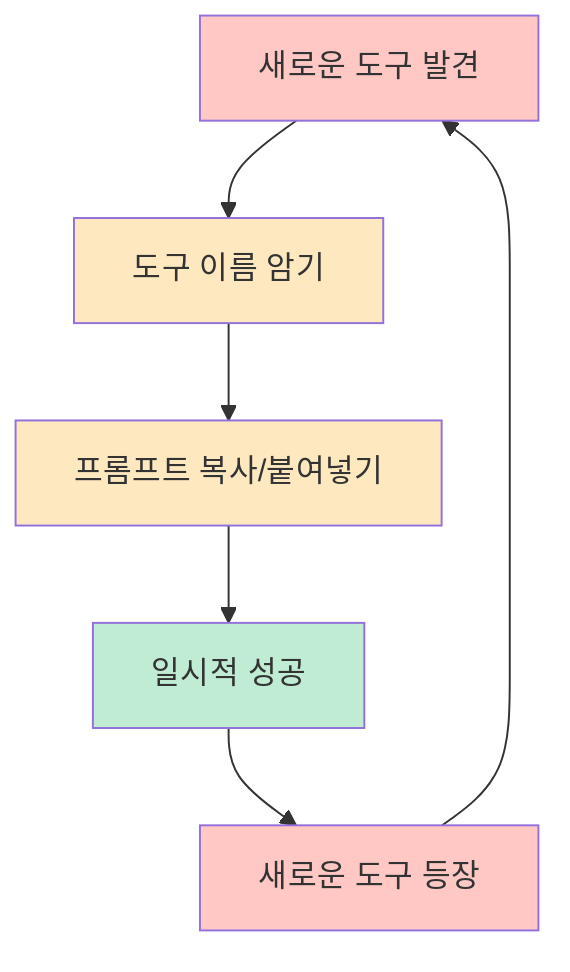
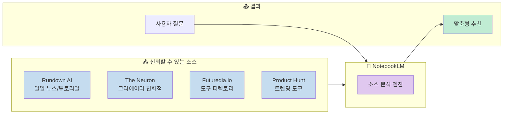
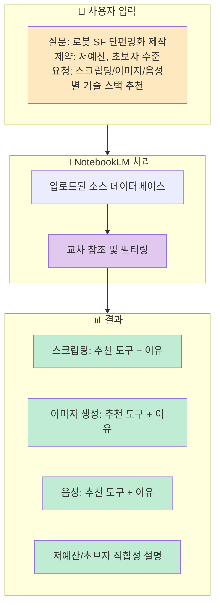
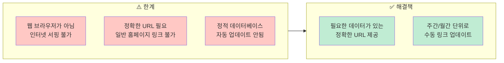
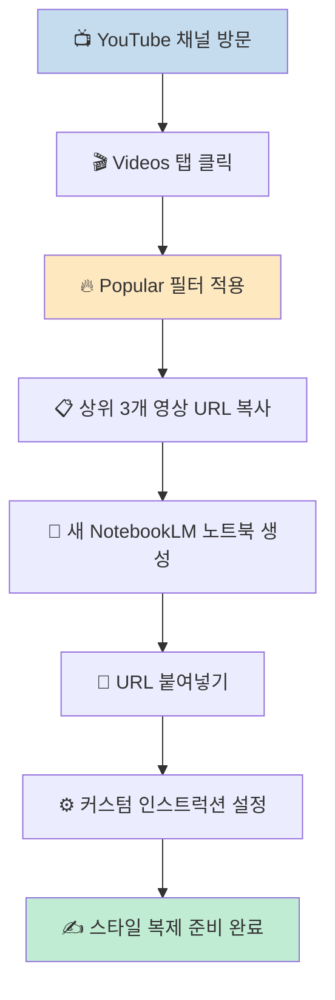
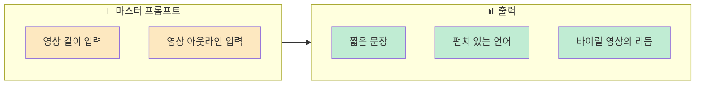
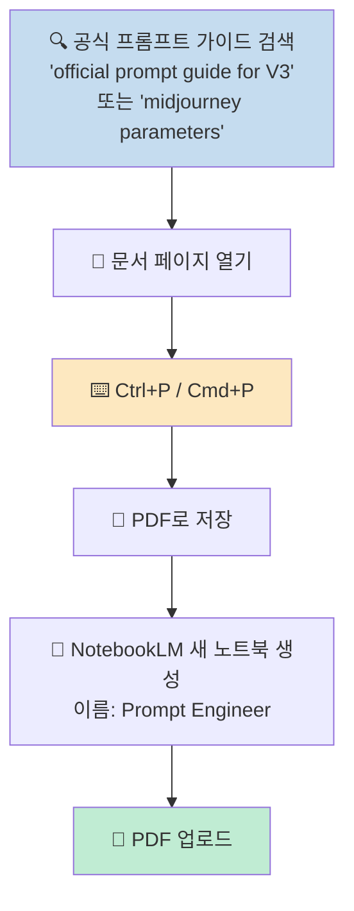
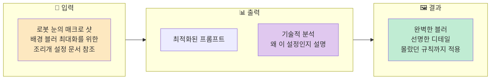
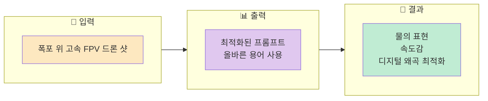
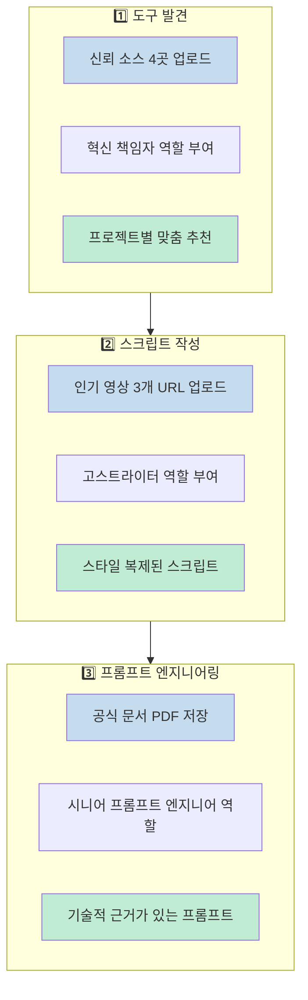

매일 쏟아지는 새로운 AI 도구와 프롬프트 가이드를 따라가느라 지치셨나요? 월요일에 마스터한 도구가 금요일이면 구식이 되는 느낌, 익숙하실 겁니다. 이 글에서는 Google NotebookLM을 활용해 **도구를 자동으로 발견하고, 프롬프트를 자동으로 작성해주는 시스템**을 구축하는 방법을 소개합니다.

<!--more-->

## Sources

- [NotebookLM: I Built a "Prompt Engineer" (Free & Unlimited) - Tool Drop](https://www.youtube.com/watch?v=CJ8sfAIyzk8)

## 왜 '목록'이 아니라 '시스템'이 필요한가

대부분의 AI 콘텐츠는 도구 이름을 나열합니다. "이 도구 써보세요", "최신 프롬프트는 이겁니다". 하지만 이런 접근에는 문제가 있습니다.

**"도구 이름만 암기하고 있으면 이미 지고 있는 것입니다."** ([영상 00:20](https://youtu.be/CJ8sfAIyzk8?t=20))

필요한 것은 또 다른 목록이 아닙니다. 필요한 것은 **시스템**입니다. 물고기를 한 마리 잡아주는 게 아니라, 낚시배를 만들어주는 접근이 필요합니다.

## 1단계: 도구 발견 시스템 구축하기

### NotebookLM의 핵심 원리

Google NotebookLM을 열고 새 노트북을 생성합니다. 이 시스템의 핵심은 **신뢰할 수 있는 소스**를 공급하는 것입니다.

**"대부분의 AI 문제는 환각입니다. AI는 추측합니다. 우리는 추측을 원하지 않습니다."** ([영상 01:00](https://youtu.be/CJ8sfAIyzk8?t=60))

### 추천 소스 4곳

| 소스 | 특징 | 용도 |
|------|------|------|
| **Rundown AI** | 일일 뉴스와 튜토리얼 제공 | 효율적이지만 매일 읽기엔 양이 많음 |
| **The Neuron** | 크리에이터 친화적 | 임팩트에 집중, 과장된 hype 지양 |
| **Futuredia.io** | 수천 개 도구 디렉토리 | 수동 정렬 불가능한 방대한 데이터 |
| **Product Hunt** | 당일 트렌딩 도구 | 실시간 인기 파악 |

### 커스텀 인스트럭션 설정

소스만 추가하면 AI는 사서 역할만 합니다. 텍스트를 요약만 할 뿐이죠. **전문가**로 만들려면 행동을 변경해야 합니다.

**Configure Chat → Custom Instructions에 입력:**

> Act as a head of innovation for a creative agency. You have access to the latest industry newsletters provided in the sources. Your goal is to synthesize this information.

이제 AI는 자신의 역할을 알게 됩니다. ([영상 02:30](https://youtu.be/CJ8sfAIyzk8?t=150))

### 실전 예시: 로봇 SF 단편영화 프로젝트

**입력 프롬프트:**

> I am working on a sci-fi short film about robots. Constraints are low-budget beginner skill level. Based on the uploaded list, recommend the best tech stack. Break it down by scripting, image, gen, and voice. Explain why it fits my constraints. ([영상 03:00](https://youtu.be/CJ8sfAIyzk8?t=180))

**결과:** AI는 추측하지 않습니다. 우리가 구축한 데이터베이스를 교차 참조합니다. 특정 도구를 제안하고, 왜 저렴한지, 왜 쉬운지 설명합니다. 노이즈를 필터링한 결과입니다.

### NotebookLM의 한계와 해결책

**NotebookLM은 웹 브라우저가 아닙니다.** 인터넷을 서핑하지 않고 특정 문서를 분석합니다. ([영상 04:00](https://youtu.be/CJ8sfAIyzk8?t=240))

**ROI 계산:**
- 링크 업로드: **30초**
- 500개 뉴스레터 읽기: **10시간**

추가 단계가 있지만, 수학적으로 계산해보면 확실히 효율적입니다. ([영상 04:40](https://youtu.be/CJ8sfAIyzk8?t=280))

## 2단계: 고스트라이터 시스템 구축하기

이제 어떤 도구를 사용할지 알게 되었습니다. 다음 문제는 **사용하는 방법**입니다.

### 문제: AI 스크립트는 로봇처럼 들린다

대부분의 사람들이 AI로 스크립트를 작성하지만, 결과물은 기계적입니다. 개인 고스트라이터를 만들어 봅시다.

### 스타일 클로닝 워크플로우

**"아이디어를 훔치는 것이 아닙니다. 톤을 분석하는 것입니다."** ([영상 05:00](https://youtu.be/CJ8sfAIyzk8?t=300))

### 고스트라이터 커스텀 인스트럭션

**Configure Chat → Custom Instructions:**

> You are a professional ghost writer. Analyze the tone, pacing, and vocabulary of the source text. Your goal is to replicate this style for new topics. ([영상 05:40](https://youtu.be/CJ8sfAIyzk8?t=340))

이제 AI는 어시스턴트가 아니라 작가가 됩니다.

### 마스터 프롬프트 구조

**입력:**
1. 영상 길이 입력
2. 영상 아웃라인 입력

**출력 예시:**

> "Look at your browser tabs right now. Seriously, look at them. If you've got 50 windows open and your computer fan sounds like it's about to take off, stay with me because we need to talk."

- 짧은 문장 사용
- 펀치 있는 언어
- 바이럴 영상의 리듬 모방

**"소스 보이스에 99% 정확하게 일치합니다."** 복잡한 모델을 훈련할 필요 없이 올바른 참고 자료만 제공하면 됩니다. ([영상 06:20](https://youtu.be/CJ8sfAIyzk8?t=380))

## 3단계: 시니어 프롬프트 엔지니어 시스템 (Secret Sauce)

이것이 **가장 큰 장벽**입니다. 도구도 있고 스크립트도 있는데, 이미지 생성기가 원하는 대로 작동하지 않습니다.

### 공식 문서를 PDF로 저장하기

**"웹사이트는 변경됩니다. 링크는 깨집니다. 영구적인 매뉴얼을 원합니다."** ([영상 07:00](https://youtu.be/CJ8sfAIyzk8?t=420))

**예시 도구:**
- **Nano Banana Pro** - 이미지 생성
- **V3 (VO3)** - 비디오 생성

### 프롬프트 엔지니어 커스텀 인스트럭션

**Configure Chat → Custom Instructions:**

> Act as a senior prompt engineer. Always reference the uploaded technical documentation. Provide the prompt and the technical reasoning. ([영상 07:40](https://youtu.be/CJ8sfAIyzk8?t=460))

**핵심:** 물고기만 받는 게 아니라, 낚시하는 법도 알아야 합니다.

### 실전 예시 1: 이미지 생성 (Nano Banana Pro)

**입력 프롬프트:**

> Based on the guides, create a prompt for a macro shot of a robotic eye. Use the documentation to find the correct aperture settings for maximum background blur. ([영상 08:00](https://youtu.be/CJ8sfAIyzk8?t=480))

**결과:**
- 프롬프트 제공
- 기술적 분석 제공 (왜 이 설정인지)
- **"블러는 완벽합니다. 디테일은 선명합니다. 존재조차 몰랐던 규칙을 따랐습니다."**

### 실전 예시 2: 비디오 생성 (V3/VO3)

**입력 프롬프트:**

> Based on VO3 guides, I need a prompt for a high-speed FPV drone shot above a waterfall. ([영상 08:40](https://youtu.be/CJ8sfAIyzk8?t=500))

**결과:**
- 올바른 용어를 사용한 프롬프트 블록
- 드론 근접으로 인한 디지털 왜곡 예측
- AI가 이를 최적화

**"개발자보다 매뉴얼을 더 잘 아는 전용 엔진을 구축했습니다."** ([영상 08:50](https://youtu.be/CJ8sfAIyzk8?t=500))

## 전체 워크플로우 요약

## 핵심 요약

| 단계 | 목표 | 핵심 액션 | 결과 |
|------|------|-----------|------|
| **1단계** | 도구 발견 | 신뢰 소스 4곳 + 혁신 책임자 역할 | 노이즈 필터링된 맞춤 추천 |
| **2단계** | 스크립트 작성 | 인기 영상 3개 + 고스트라이터 역할 | 99% 정확한 스타일 복제 |
| **3단계** | 프롬프트 엔지니어링 | 공식 문서 PDF + 시니어 엔지니어 역할 | 기술적 근거가 있는 최적화 프롬프트 |

**세 가지 커스텀 인스트럭션:**

1. **도구 발견:** "Act as a head of innovation for a creative agency..."
2. **고스트라이터:** "You are a professional ghost writer. Analyze the tone, pacing, and vocabulary..."
3. **프롬프트 엔지니어:** "Act as a senior prompt engineer. Always reference the uploaded technical documentation..."

## 결론

이 워크플로우의 핵심은 **AI에게 올바른 역할과 올바른 참고 자료를 제공하는 것**입니다. NotebookLM은 웹을 검색하는 것이 아니라 우리가 공급한 문서를 분석합니다. 따라서:

1. **신뢰할 수 있는 소스**를 선별하여 업로드하세요
2. **명확한 역할**을 커스텀 인스트럭션으로 정의하세요
3. **공식 문서를 PDF로 저장**하여 영구적인 참고 자료를 만드세요

이 시스템은 무료이고 무제한입니다. 문서만 다운로드하면 됩니다. 그 다음은 기계가 작업하게 하세요. 그것이 효율적으로 일하는 방법입니다.
