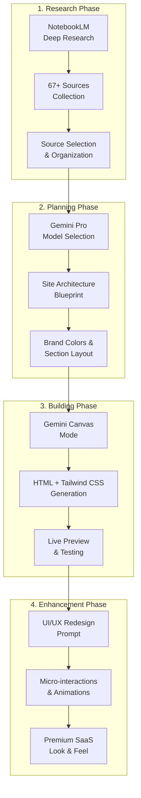
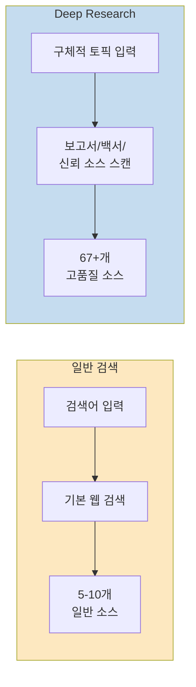
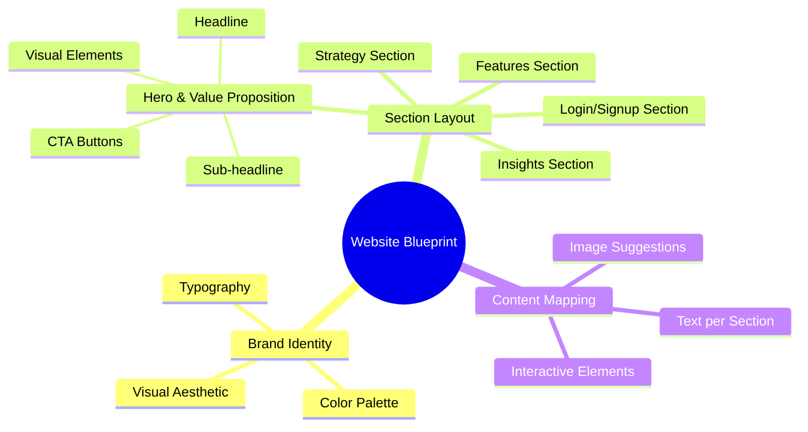
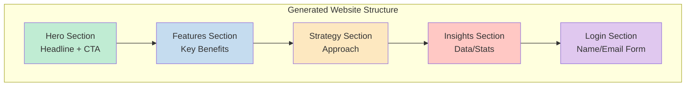
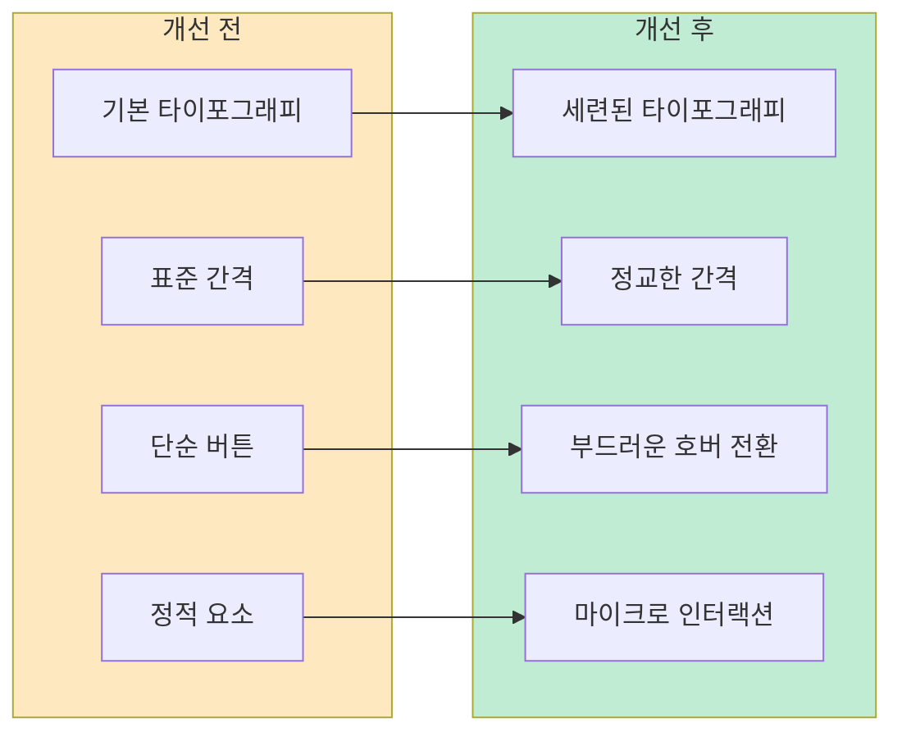
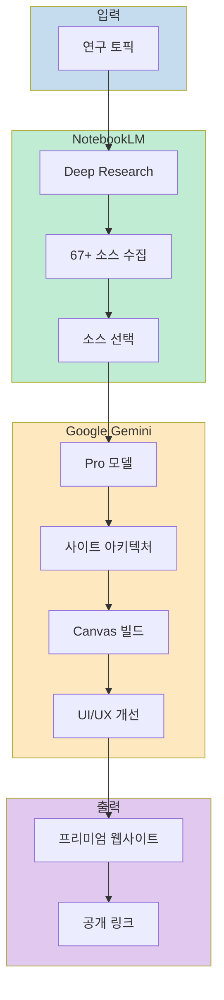

많은 사람들이 NotebookLM을 단순히 문서 요약 도구로, Google Gemini를 질문답변 도구로만 사용합니다. 하지만 이 두 도구를 결합하면, 연구 노트를 수천 달러를 들여 제작한 것 같은 프리미엄 SaaS 스타일 웹사이트로 변환할 수 있습니다. 이 글에서는 코드를 한 줄도 작성하지 않고 NotebookLM의 깊은 연구 데이터를 Gemini Canvas로 변환하는 전체 워크플로우를 단계별로 살펴봅니다.

<!--more-->

## Sources

- [Convert NotebookLM Into Stunning Website (No Coding Required) - Gurru Tech Solutions](https://www.youtube.com/watch?v=-iCBETPQkuo)

## 워크플로우 개요

전체 프로세스는 다음과 같은 4단계로 구성됩니다.



각 단계에서 AI가 수행하는 역할과 사용자가 해야 할 작업이 명확히 구분됩니다. 사용자는 프롬프트를 통해 방향을 제시하고, AI는 실행을 담당합니다.

## 1단계: NotebookLM Deep Research로 고품질 소스 수집

### Deep Research 옵션의 중요성

일반 검색과 달리, NotebookLM의 Deep Research 옵션은 표면적인 정보가 아닌 심층적인 콘텐츠를 수집합니다.



Deep Research는 다음과 같은 유형의 소스를 스캔합니다:

- **상세 보고서 (Detailed Reports)**: 업계 분석, 시장 조사 보고서
- **백서 (White Papers)**: 기술 문서, 연구 논문
- **신뢰할 수 있는 소스 (Trusted Sources)**: 검증된 출처의 공식 문서

실제 예시에서 "How small businesses and startups can leverage artificial intelligence to scale operations and increase efficiency in 2026"라는 구체적인 토픽으로 Deep Research를 실행했을 때, 약 **67개의 고품질 소스**가 수집되었습니다. 5개나 10개가 아닌 67개라는 점이 중요합니다.

### 소스 선택 및 관리

수집된 소스는 다음과 같이 관리할 수 있습니다:

1. **Sources 탭**에서 각 소스를 개별적으로 검토
2. **마크/언마크** 기능으로 노트북에 포함할 소스 선택
3. 최종 선택된 소스는 자동으로 노트북에 추가되어 정리된 상태로 저장

이 과정에서 사용자는 노트북에 포함될 콘텐츠를 완전히 통제할 수 있습니다.

## 2단계: Gemini로 웹사이트 아키텍처 설계

### Gemini와 NotebookLM 연동

NotebookLM에서 설정한 노트북은 Gemini에서 직접 참조할 수 있습니다. 연동 방법은 다음과 같습니다:

1. Google Gemini 열기
2. NotebookLM에서 생성한 동일한 노트북 선택
3. Gemini가 노트북 콘텐츠를 직접 로드

### Pro 모델 선택 이유

코드 생성을 포함한 고급 작업을 위해서는 **Pro 모델**을 선택해야 합니다. Pro 모델은 더 강력한 추론 능력을 제공하며, 특히 다음 단계에서 코드를 생성할 때 중요한 역할을 합니다.

### 웹사이트 블루프린트 생성 프롬프트

첫 번째 프롬프트는 매우 의도적이어야 합니다:

```
I have attached my notebook containing my website assets.
Before writing any code, act as a senior web architect.
Analyze the notebook and propose a detailed site map and
section-by-section structure for a single page website.
Also specify what content goes into each section and
suggest a color palette based on my brand guidelines.
```

이 프롬프트의 핵심 요소:

| 요소 | 설명 |
|------|------|
| `Before writing any code` | 즉시 코드를 작성하지 말고 먼저 구조 설계 |
| `act as a senior web architect` | 전문가 관점에서 접근 |
| `detailed site map` | 전체 사이트 구조 요청 |
| `section-by-section structure` | 각 섹션별 세부 구조 |
| `color palette based on brand guidelines` | 브랜드에 맞는 색상 팔레트 |

### 생성되는 블루프린트 내용

Gemini가 생성하는 블루프린트에는 다음이 포함됩니다:



예를 들어, **Section 1: Hero & Value Proposition**에는 다음이 포함됩니다:

- 헤드라인 텍스트
- 서브헤드라인 텍스트
- 시각적 요소
- 콘텐츠 블록
- CTA(Call to Action) 버튼

대부분의 사람들이 이 단계를 건너뛰고 바로 코딩을 시작하지만, **먼저 구조를 설계하는 것은 모든 것을 바꿉니다**. 명확한 청사진이 있으면 후속 작업의 품질이 크게 향상됩니다.

## 3단계: Gemini Canvas로 웹사이트 빌드

### Canvas 모드 전환

구조 설계가 완료되면 Gemini Canvas 모드로 전환합니다. Canvas 모드는 코드를 실시간으로 생성하고 미리보기를 제공하는 특별한 인터페이스입니다.

### 웹사이트 생성 프롬프트

```
This structure looks perfect. Now act as an expert web developer.
Generate the complete website code based on the agreed structure.
Use the exact text from the notebook.
Write everything as a single HTML file using Tailwind CSS.
Include smooth scrolling and interactive hover effects.
```

프롬프트의 기술적 요구사항:

| 요구사항 | 설명 |
|----------|------|
| `single HTML file` | 모든 코드를 하나의 파일로 통합 |
| `Tailwind CSS` | 유틸리티 퍼스트 CSS 프레임워크 사용 |
| `exact text from notebook` | 노트북의 원본 텍스트 활용 |
| `smooth scrolling` | 부드러운 스크롤 효과 |
| `interactive hover effects` | 호버 인터랙션 |

### 실시간 웹사이트 생성

Gemini Canvas는 전체 웹사이트 코드를 눈앞에서 실시간으로 생성합니다. 생성이 완료되면 다음 기능을 사용할 수 있습니다:

1. **Source Code 보기**: 전체 HTML/CSS 코드 검토
2. **Preview 클릭**: 라이브 웹사이트 미리보기

### 생성된 웹사이트 구조



미리보기에서 확인할 수 있는 특징:

- **UI가 깔끔함**: 전문적인 디자인
- **색상 팔레트가 브랜드와 일치**: 일관된 브랜드 아이덴티티
- **완전한 반응형**: 모바일/데스크톱 최적화
- **바로 사용 가능한 최적화**: 추가 설정 불필요

### 공유 기능

**Share** 버튼을 클릭하면 공개 링크가 생성됩니다:

1. Share 클릭 → 공개 링크 생성
2. 링크 복사 → 새 탭에서 붙여넣기
3. 전체 화면으로 웹사이트 로드

애니메이션은 부드럽고, UI는 프리미엄 느낌을 줍니다. 모든 것이 의도한 대로 작동합니다.

## 4단계: UI/UX 디자인 고도화

대부분의 사람들은 여기서 멈추지만, 한 단계 더 나아갈 수 있습니다.

### UI/UX 리디자인 프롬프트

```
Act as a senior UI/UX designer.
Redesign this website to look like a modern SaaS platform.
Improve typography, spacing, animations, and visual hierarchy.
```

이 프롬프트는 Gemini가 UX 관점에서 전체 디자인을 재작업하게 합니다.

### 개선되는 요소



개선 후 눈에 띄는 변화:

| 요소 | 개선 내용 |
|------|----------|
| **카드 호버** | 미세한 애니메이션 효과 |
| **타이포그래피** | 더 세련되고 정교한 폰트 |
| **간격 (Spacing)** | 더 타이트하고 깔끔한 레이아웃 |
| **버튼** | 부드러운 호버 전환 효과 |
| **로그인 섹션** | 마이크로 인터랙션 추가 |
| **상단 네비게이션** | 리퀴드 글래스 스타일 효과 |

**리퀴드 글래스 스타일 효과 (Liquid Glass Style Effect)**는 상단 네비게이션에 적용되며, 전체적으로 프리미엄하고 현대적인 느낌을 줍니다. 이는 잘 자금을 지원받은 SaaS 제품에서 기대할 수 있는 디자인 퀄리티입니다.

## 전체 워크플로우 요약



최종적으로 달성한 것:

| 단계 | 도구 | 결과물 |
|------|------|--------|
| 연구 | NotebookLM | 구조화된 지식 베이스 |
| 설계 | Gemini | 웹사이트 청사진 |
| 빌드 | Gemini Canvas | 완전한 웹사이트 코드 |
| 고도화 | Gemini (UI/UX) | 프리미엄 디자인 |

이 워크플로우의 핵심은 **빈 페이지나 지루한 문서를 보는 대신, 지식 베이스를 인터랙티브하고 현대적이며 실제로 인상적인 것으로 변환**했다는 점입니다.

## 핵심 요약

1. **NotebookLM Deep Research**는 일반 검색과 달리 보고서, 백서, 신뢰 소스를 스캔하여 67개 이상의 고품질 소스를 수집합니다.

2. **Gemini Pro 모델**을 사용하면 노트북 콘텐츠를 분석하여 브랜드 색상, 섹션 레이아웃, 콘텐츠 매핑이 포함된 상세한 웹사이트 블루프린트를 생성할 수 있습니다.

3. **Gemini Canvas**에서는 Tailwind CSS를 사용하는 단일 HTML 파일로 전체 웹사이트를 생성하며, 부드러운 스크롤과 호버 효과가 기본 포함됩니다.

4. **UI/UX 리디자인 프롬프트**를 통해 타이포그래피, 간격, 애니메이션, 시각적 계층을 개선하고 리퀴드 글래스 효과와 같은 프리미엄 디자인 요소를 추가할 수 있습니다.

5. **공개 링크 생성** 기능을 통해 완성된 웹사이트를 즉시 공유할 수 있습니다.

## 결론

NotebookLM과 Gemini를 결합하면 연구 노트에서 프로덕션급 웹사이트로의 변환이 완전히 AI에 의해 구동됩니다. 이 워크플로우는 코딩 지식이 없는 사용자도 전문적인 웹사이트를 제작할 수 있게 하며, 디자인 의사결정도 AI의 도움을 받아 수행할 수 있습니다. 특히 스타트업이나 소규모 비즈니스에서 빠르게 프로토타입이나 랜딩 페이지를 제작해야 할 때 유용한 접근법입니다.
