OpenRAG는 문서 지식 기반 AI 응용 프로그램을 구축하기 위한 종합적인 RAG(Retrieval-Augmented Generation) 플랫폼입니다. Langflow의 시각적 워크플로우 빌더, OpenSearch의 확장 가능한 검색 엔진, Docling의 강력한 문서 처리 기능을 하나로 통합하여 개발자가 복잡한 RAG 시스템을 신속하게 구축할 수 있도록 지원합니다.

이 글에서는 OpenRAG의 핵심 아키텍처, 주요 기능, 그리고 실제 구현 방법을 살펴보겠습니다.

<!--more-->

## Sources

- [OpenRAG GitHub Repository](https://github.com/langflow-ai/openrag)
- [Langflow Documentation](https://langflow.org)
- [OpenSearch Documentation](https://opensearch.org)
- [Docling Documentation](https://github.com/docling-project/docling)

## RAG 아키텍처 이해

RAG(Retrieval-Augmented Generation)는 대규모 언어 모델(LLM)의 응답 품질을 향상시키기 위해 외부 지식 베이스에서 관련 정보를 검색하여 컨텍스트에 포함하는 패턴입니다. 전통적인 RAG 아키텍처는 다음과 같은 구성 요소로 이루어집니다.

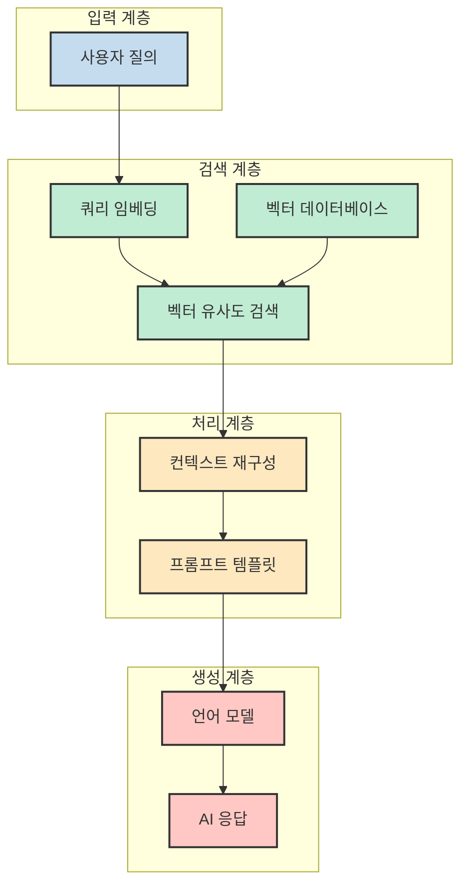

### 기본 RAG 패턴

기본 RAG 패턴은 사용자 질의를 임베딩하고, 벡터 데이터베이스에서 유사한 문서 청크를 검색한 후, 이를 LLM 프롬프트에 컨텍스트로 제공합니다.

### 하이브리드 검색 RAG

하이브리드 검색 RAG는 밀도 높은 벡터 유사도 검색과 키워드 기반 검색(BM25)을 결합하여 검색 정확도를 높입니다. 이는 의미적 유사성과 정확한 키워드 매칭을 모두 활용합니다.

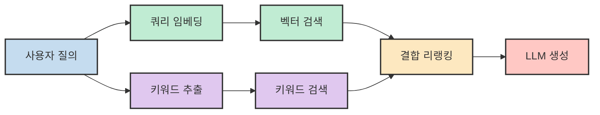

### 에이전트 RAG

에이전트 RAG는 단순 검색을 넘어, 에이전트가 검색 여부를 결정하고 다단계 검색을 수행할 수 있도록 합니다. 이를 통해 더 복잡한 질의에 대해 반복적 검색과 추론이 가능합니다.

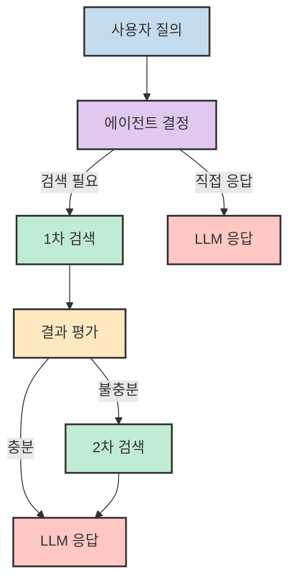

## OpenRAG 핵심 아키텍처

OpenRAG는 다음과 같은 핵심 구성 요소로 이루어진 통합 플랫폼을 제공합니다.

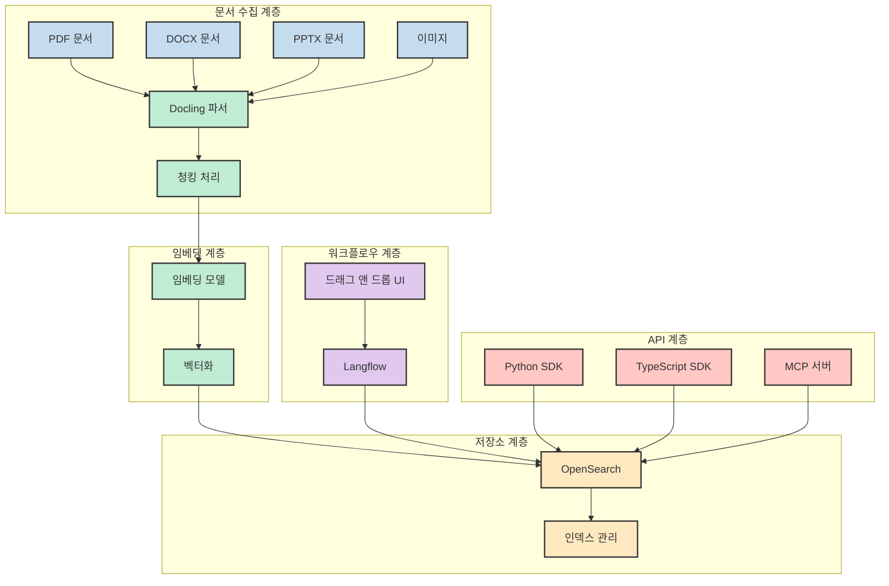

## Langflow 시각적 워크플로우 빌더

OpenRAG의 핵심 특징 중 하나는 Langflow 기반의 시각적 워크플로우 빌더입니다. Langflow는 개발자가 코드를 작성하지 않고도 드래그 앤 드롭 방식으로 복잡한 AI 워크플로우를 구성할 수 있게 해줍니다.

### Langflow 워크플로우 구성 요소

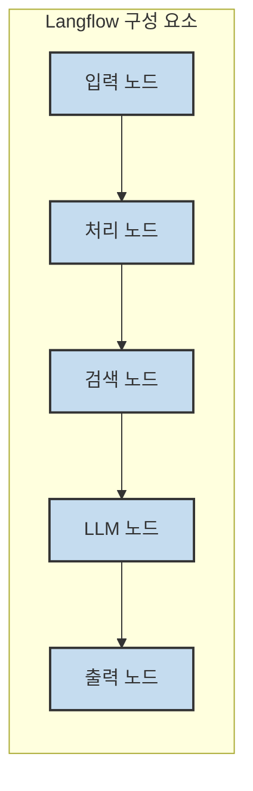

### 문서 수집 워크플로우

Langflow를 사용하면 문서 수집 파이프라인을 시각적으로 설계할 수 있습니다.

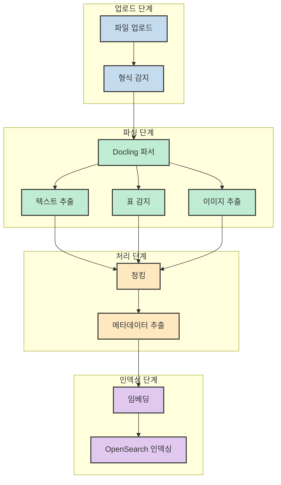

### RAG 검색 워크플로우

검색 및 생성 워크플로우 역시 시각적으로 구성할 수 있습니다.

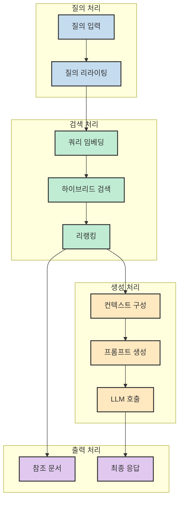

## OpenSearch 엔터프라이즈 검색

OpenRAG는 OpenSearch를 기본 검색 엔진으로 사용합니다. OpenSearch는 확장 가능한 오픈 소스 검색 및 분석 엔진으로, 엔터프라이즈급 시맨틱 검색 기능을 제공합니다.

### OpenSearch k-NN 플러그인

OpenSearch의 k-NN(k-Nearest Neighbors) 플러그인은 벡터 유사도 검색을 위한 고성능 엔진을 제공합니다.

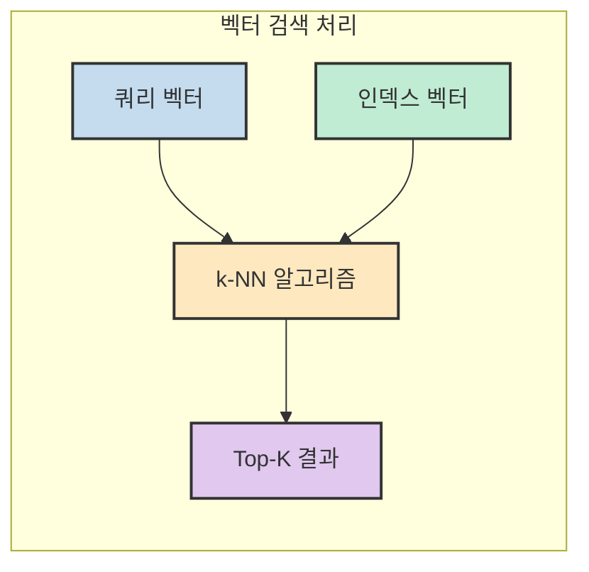

### 하이브리드 검색 구현

OpenSearch는 벡터 검색과 키워드 검색을 결합한 하이브리드 검색을 지원합니다.

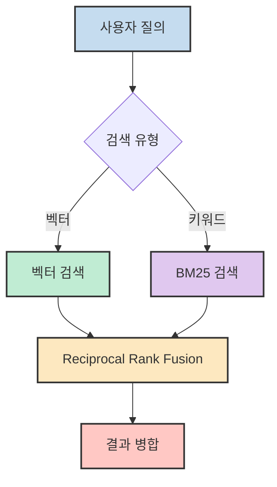

### 확장성

OpenSearch의 수평 확장 기능을 통해 대규모 문서 세트도 효율적으로 처리할 수 있습니다.

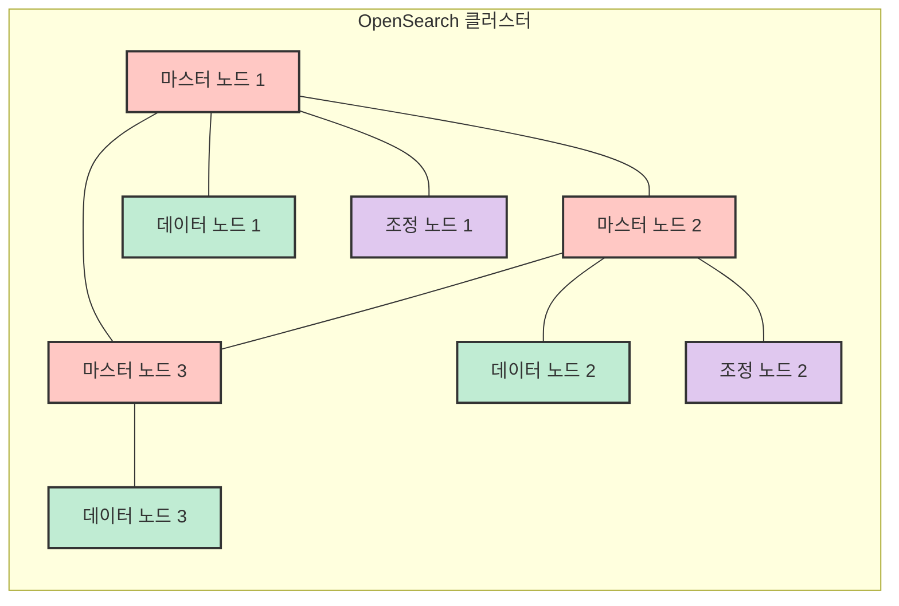

## Docling 문서 처리

Docling은 PDF, DOCX, PPTX, 이미지 등 다양한 형식의 문서를 처리하는 강력한 파이썬 라이브러리입니다. OpenRAG는 Docling을 통해 문서 수집 파이프라인을 제공합니다.

### 지원 문서 형식

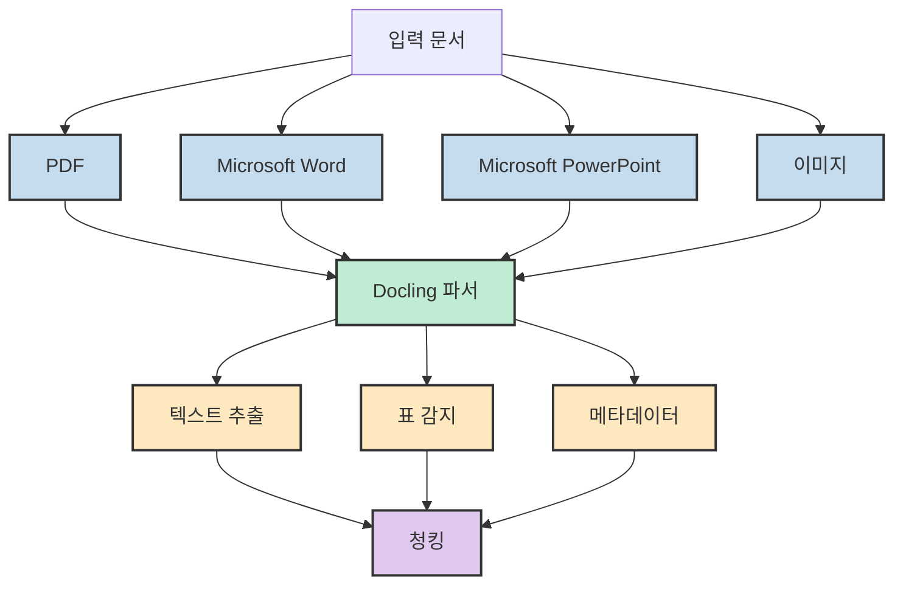

### 레이아웃 이해

Docling은 문서의 레이아웃 구조를 이해하여 표, 이미지, 제목 등을 정확하게 식별할 수 있습니다.

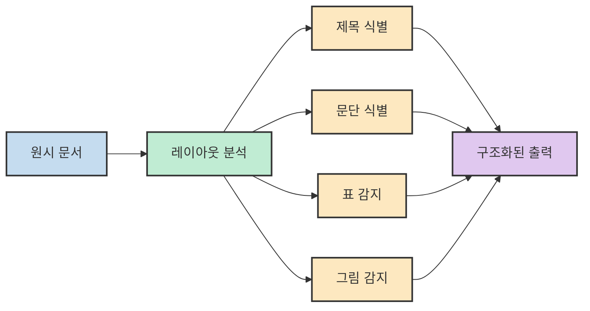

## MCP 통합

OpenRAG는 MCP(Model Context Protocol)를 통해 AI 개발 환경과 통합될 수 있습니다.

### Cursor IDE 통합

Cursor IDE에서 OpenRAG MCP 서버를 구성하면, 코드 작성 중 문서 검색 및 AI 응답을 직접 활용할 수 있습니다.

```json
{
  "mcpServers": {
    "openrag": {
      "command": "uvx",
      "args": ["openrag-mcp"],
      "env": {
        "OPENRAG_URL": "http://localhost:3000",
        "OPENRAG_API_KEY": "your_api_key_here"
      }
    }
  }
}
```

### Claude Desktop 통합

Claude Desktop에서도 동일한 MCP 구성을 사용하여 로컬 문서 검색 및 AI 응답을 활용할 수 있습니다.

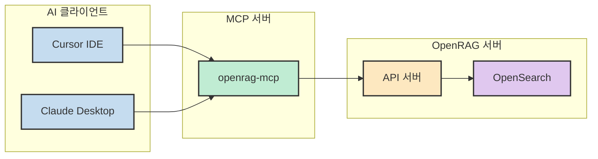

## SDK 사용

OpenRAG는 Python과 TypeScript/JavaScript SDK를 공식적으로 제공합니다.

### Python SDK

```python
import asyncio
from openrag_sdk import OpenRAGClient

async def main():
    async with OpenRAGClient() as client:
        response = await client.chat.create(message="RAG이란 무엇인가?")
        print(response.response)

if __name__ == "__main__":
    asyncio.run(main())
```

### TypeScript SDK

```typescript
import { OpenRAGClient } from "openrag-sdk";

const client = new OpenRAGClient();

async function main() {
  const response = await client.chat.create({
    message: "RAG이란 무엇인가?"
  });
  console.log(response.response);
}

main();
```

### SDK 아키텍처

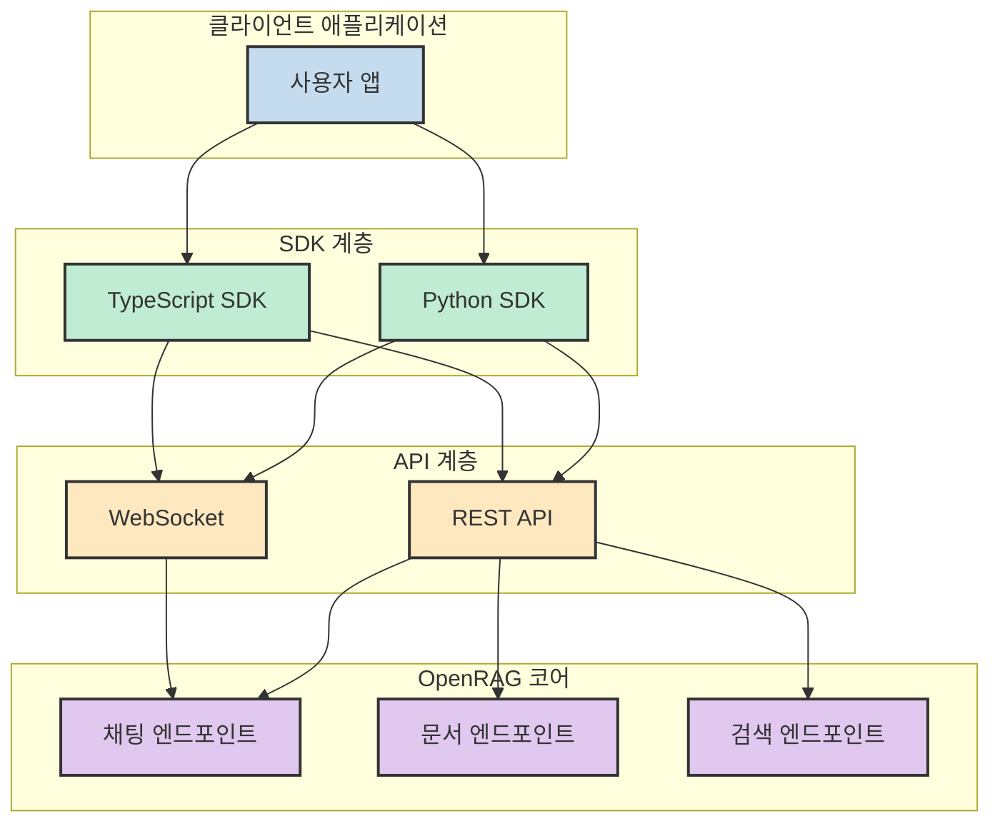

## 에이전트 워크플로우

OpenRAG는 고급 에이전트 워크플로우 기능을 지원합니다. 이를 통해 복잡한 질의에 대해 다단계 검색과 추론이 가능합니다.

### 에이전트 검색 흐름

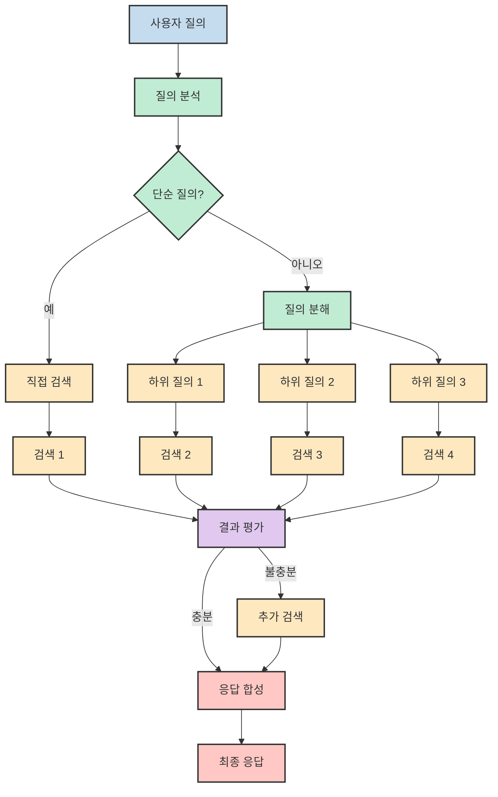

### 리랭킹

검색 결과의 품질을 향상시키기 위해 리랭킹 단계를 적용할 수 있습니다.

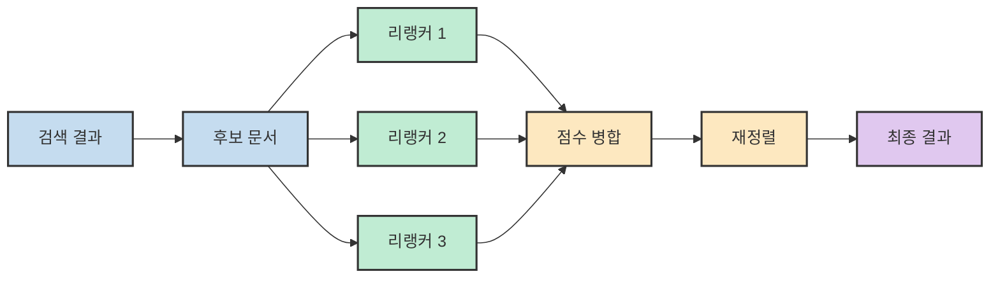

## 배포 및 확장

OpenRAG는 `uv` 패키지 매니저를 사용하여 간편하게 실행할 수 있으며, 컨테이너화를 통해 쉽게 배포할 수 있습니다.

### 실행 방법

```bash
# uv를 사용한 실행
uvx openrag

# 또는 직접 설치 후 실행
pip install openrag
openrag serve
```

### 아키텍처 확장

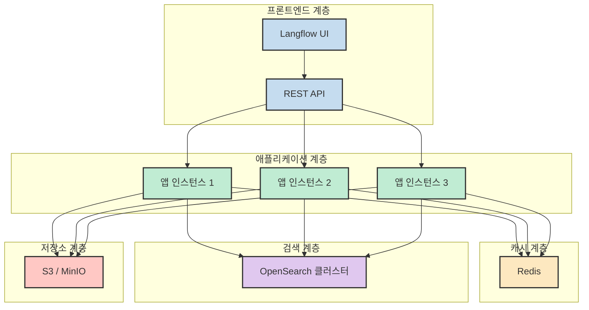

## 핵심 요약

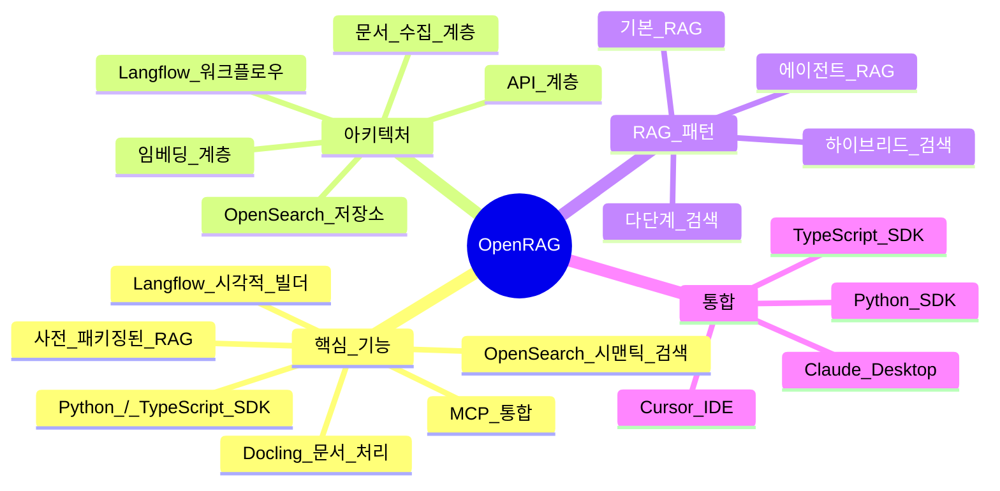

| 기능 | 설명 | 기술 |
|------|------|------|
| 문서 수집 | PDF, DOCX, PPTX, 이미지 처리 | Docling |
| 시맨틱 검색 | 벡터 기반 유사도 검색 | OpenSearch k-NN |
| 하이브리드 검색 | 벡터 + 키워드 결합 | BM25 + 리랭킹 |
| 시각적 빌더 | 드래그 앤 드롭 워크플로우 | Langflow |
| AI 통합 | MCP 프로토콜 지원 | Cursor, Claude Desktop |
| SDK | 공식 개발 키트 | Python, TypeScript |

## 결론

OpenRAG는 RAG 애플리케이션 개발을 위한 종합적인 플랫폼입니다. Langflow의 시각적 워크플로우 빌더를 통해 복잡한 RAG 파이프라인을 직관적으로 구성할 수 있으며, OpenSearch의 확장 가능한 검색 엔진과 Docling의 강력한 문서 처리 기능이 결합되어 엔터프라이즈급 솔루션을 제공합니다.

MCP를 통한 Cursor 및 Claude Desktop 통합은 개발 생산성을 크게 향상시키며, Python과 TypeScript SDK는 다양한 개발 환경에서 쉽게 활용할 수 있습니다. 에이전트 워크플로우와 리랭킹 같은 고급 기능을 통해 더 정교한 AI 응용 프로그램을 구축할 수 있습니다.

OpenRAG를 활용하면 개발자는 복잡한 RAG 시스템을 신속하게 구축하고, 문서 지식 기반 AI 서비스를 효율적으로 제공할 수 있습니다.
