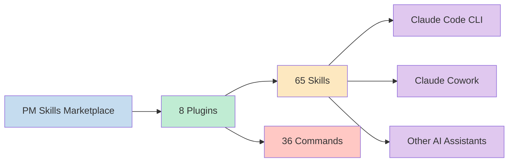
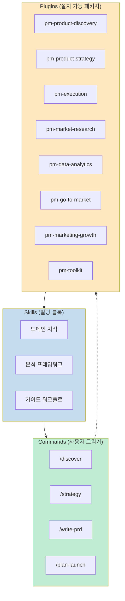
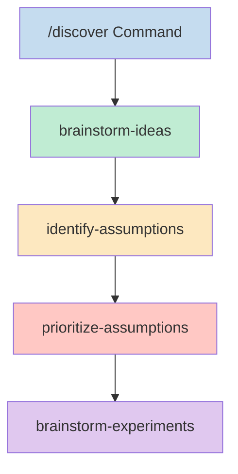
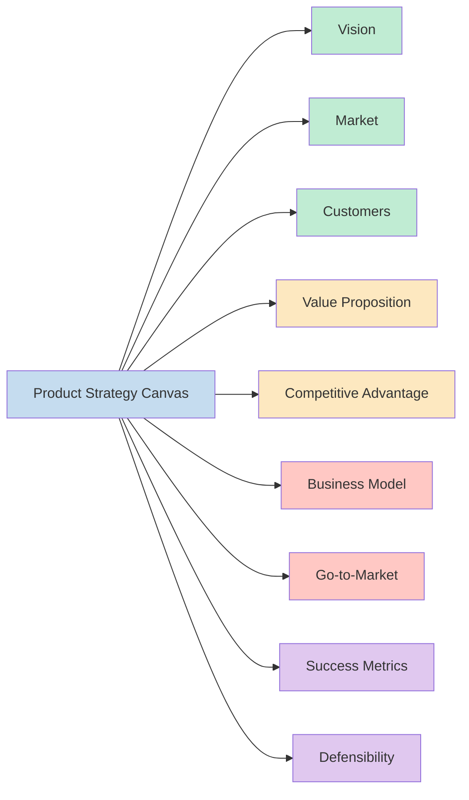
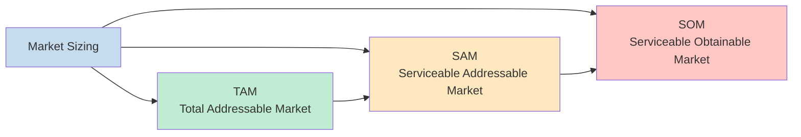
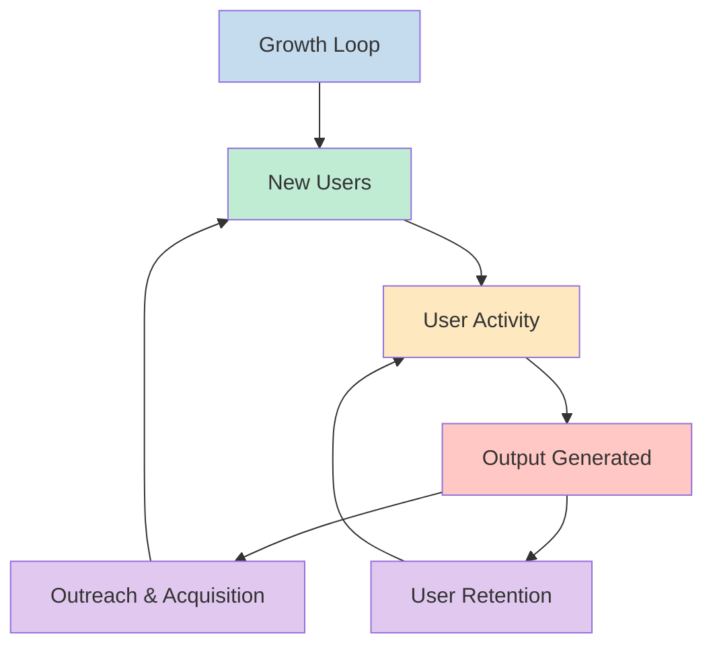
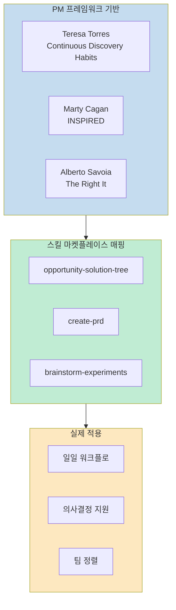

제품 관리자(PM)가 Claude AI를 활용할 때, 단순한 텍스트 생성을 넘어 구조화된 프레임워크가 필요한 순간이 있습니다. **PM Skills Marketplace**는 이런 니즈를 정확히 겨냥한 오픈 소스 프로젝트입니다.

이 마켓플레이스는 발견(Discovery)부터 전략(Strategy), 실행(Execution), 시장 출시(Go-to-Market), 성장(Growth)까지 제품 관리의 전체 라이프사이클을 아우르는 **100개 이상의 스킬과 36개의 연결된 워크플로**를 제공합니다.

<!--more-->

## Executive Summary

PM Skills Marketplace는 검증된 제품 관리 프레임워크를 AI 워크플로로 통합한 오픈 소스 프로젝트로, 제품 관리자의 일일 업무 효율을 극대화합니다. 65개의 스킬과 36개의 연결된 커맨드는 제품 발견부터 전략, 실행, 시장 출시, 성장까지 전체 라이프사이클을 커버합니다. Teresa Torres의 Opportunity Solution Tree, Marty Cagan의 INSPIRED 원칙, Alberto Savoia의 The Right It 프레임워크 등 PM 분야의 가장 영향력 있는 사상가들의 작업이 Claude 스킬로 체계화되어 있어, 이론과 실무의 간극을 줄여줍니다.

## Sources

- https://github.com/phuryn/pm-skills

## Key Findings

- **구조화된 PM 워크플로**: 단순한 텍스트 생성이 아닌, 검증된 프레임워크 기반의 단계별 가이드 제공
- **전체 라이프사이클 커버리지**: 발견(Discovery) → 전략(Strategy) → 실행(Execution) → 시장 출시(GTM) → 성장(Growth)까지 모든 단계 지원
- **검증된 이론적 기반**: Teresa Torres, Marty Cagan, Alberto Savoia 등 12명 이상의 PM 사상가의 프레임워크 통합
- **유연한 통합**: Claude Code CLI와 Claude Cowork 모두 지원하며, 스킬 포맷은 다른 AI 도구에서도 호환 가능
- **오픈 소스 생태계**: MIT 라이선스로 커뮤니티 기여와 확장이 가능

## PM Skills Marketplace란?

PM Skills Marketplace는 Claude Code(CLI)와 Claude Cowork(데스크톱 앱)를 위한 **65개의 PM 스킬과 36개의 체이닝된 워크플로**를 8개의 플러그인으로 패키징한 오픈 소스 프로젝트입니다.

MIT 라이선스로 제공되며, Teresa Torres의 *Continuous Discovery Habits*, Marty Cagan의 *INSPIRED*, Alberto Savoia의 *The Right It* 등 검증된 PM 프레임워크를 Claude 스킬로 변형해 일일 워크플로에 통합할 수 있게 합니다.



## 작동 원리: Skills, Commands, Plugins

PM Skills Marketplace는 세 가지 핵심 구성 요소로 이루어져 있습니다.



### Skills (스킬)

스킬은 마켓플레이스의 기본 빌딩 블록입니다. 각 스킬은 Claude에게 특정 PM 작업을 위한 도메인 지식, 분석 프레임워크, 또는 가이드 워크플로를 제공합니다. 일부 스킬은 여러 커맨드가 공유하는 재사용 가능한 기반이 되기도 합니다.

스킬은 대화와 관련이 있을 때 자동으로 로드됩니다. 필요한 경우 `/plugin-name:skill-name` 또는 `/skill-name`으로 강제 로드할 수도 있습니다.

### Commands (커맨드)

커맨드는 `/command-name`으로 호출되는 사용자 트리거 워크플로입니다. 하나 이상의 스킬을 연결하여 엔드 투 엔드 프로세스를 만듭니다.

예를 들어 `/discover` 커맨드는 네 개의 스킬을 연결합니다:
- **brainstorm-ideas** → **identify-assumptions** → **prioritize-assumptions** → **brainstorm-experiments**

### Plugins (플러그인)

플러그인은 관련 스킬과 커맨드를 설치 가능한 패키지로 그룹화합니다. 각 플러그인은 하나의 PM 도메인(발견, 전략, 실행 등)을 다룹니다. 마켓플레이스를 설치하면 8개 플러그인이 모두 포함됩니다.

## 8개 플러그인 상세

### 1. pm-product-discovery (13 스킬, 5 커맨드)

아이디에이션, 실험, 가정 테스트, Opportunity Solution Tree, 인터뷰를 다룹니다.

**주요 스킬:**
- `brainstorm-ideas-existing/new` — 기존/신제품 아이디어에이션
- `brainstorm-experiments-existing/new` — 가정 테스트를 위한 실험 설계
- `identify-assumptions-existing/new` — VUVF + 전략/팀/Go-to-Market 가정 식별
- `prioritize-assumptions` — Impact × Risk 매트릭스로 가정 우선순위
- `opportunity-solution-tree` — Teresa Torres의 OST 구축

**주요 커맨드:**
- `/discover` — 전체 발견 사이클
- `/brainstorm` — 아이디어/실험 브레인스토밍
- `/triage-requests` — 피처 리퀘스트 분류 및 우선순위



### 2. pm-product-strategy (12 스킬, 5 커맨드)

비전, 비즈니스 모델, 가격 전략, 경쟁 환경 분석을 다룹니다.

**주요 스킬:**
- `product-strategy` — 9섹션 Product Strategy Canvas
- `startup-canvas` — Product Strategy + Business Model 통합
- `lean-canvas` — 스타트업용 Lean Canvas
- `business-model` — Business Model Canvas (9빌딩 블록)
- `pricing-strategy` — 가격 모델, 경쟁 분석, 지불 의사
- `swot-analysis` — SWOT 분석
- `pestle-analysis` — 거시 환경 분석
- `porters-five-forces` — 5 Forces 경쟁 분석

**주요 커맨드:**
- `/strategy` — 전체 Product Strategy Canvas
- `/business-model` — 비즈니스 모델 탐색
- `/pricing` — 가격 전략 설계
- `/market-scan` — 거시 환경 분석



### 3. pm-execution (15 스킬, 10 커맨드)

PRD, OKR, 로드맵, 스프린트, 회고, 릴리스 노트, 이해관계자 관리를 다룹니다.

**주요 스킬:**
- `create-prd` — 8섹션 PRD 템플릿
- `brainstorm-okrs` — 팀 레벨 OKR
- `outcome-roadmap` — 피처 리스트를 outcome 기반 로드맵으로 변환
- `sprint-plan` — 스프린트 플래닝
- `retro` — 스프린트 회고
- `user-stories` — 3C's & INVEST 기준 유저 스토리
- `job-stories` — When [situation], I want [motivation], so I can [outcome]
- `test-scenarios` — 해피 패스, 엣지 케이스, 에러 핸들링

**주요 커맨드:**
- `/write-prd` — PRD 작성
- `/plan-okrs` — OKR 브레인스토밍
- `/sprint` — 스프린트 라이프사이클 (plan|retro|release)

### 4. pm-market-research (7 스킬, 3 커맨드)

페르소나, 세분화, 여정 맵, 마켓 사이징, 경쟁사 분석을 다룹니다.

**주요 스킬:**
- `user-personas` — 리서치 데이터에서 페르소나 생성
- `market-segments` — 3-5개 고객 세그먼트 식별
- `customer-journey-map` — 단계별 여정 맵
- `market-sizing` — TAM, SAM, SOM (top-down & bottom-up)
- `competitor-analysis` — 경쟁사 강점/약점/차별화 기회

**주요 커맨드:**
- `/research-users` — 페르소나, 세분화, 여정 맵 생성
- `/competitive-analysis` — 경쟁 환경 분석
- `/analyze-feedback` — 피드백 감성 분석



### 5. pm-data-analytics (3 스킬, 3 커맨드)

SQL 생성, 코호트 분석, A/B 테스트 분석을 다룹니다.

**주요 스킬:**
- `sql-queries` — 자연어에서 SQL 생성 (BigQuery, PostgreSQL, MySQL)
- `cohort-analysis` — 리텐션 커브, 피처 도입, 참여 트렌드
- `ab-test-analysis` — 통계적 유의성, 샘플 사이즈, ship/extend/stop 권장

**주요 커맨드:**
- `/write-query` — 자연어에서 SQL 생성
- `/analyze-cohorts` — 코호트 분석
- `/analyze-test` — A/B 테스트 결과 분석

### 6. pm-go-to-market (6 스킬, 3 커맨드)

비치헤드 세그먼트, ICP, 메시징, 성장 루프, GTM 모션, 배틀카드를 다룹니다.

**주요 스킬:**
- `gtm-strategy` — 전체 GTM 전략
- `beachhead-segment` — 첫 비치헤드 시장 세그먼트 식별
- `ideal-customer-profile` — ICP 정의
- `growth-loops` — 지속 가능한 성장 루프 설계
- `gtm-motions` — GTM 모션 평가 (product-led, sales-led 등)

**주요 커맨드:**
- `/plan-launch` — 비치헤드에서 출시 계획까지 전체 GTM 전략
- `/growth-strategy` — 성장 루프 설계 및 GTM 모션 평가
- `/battlecard` — 경쟁 배틀카드 생성



### 7. pm-marketing-growth (5 스킬, 2 커맨드)

마케팅 아이디어, 포지셔닝, 벨류 프로포절, 네이밍, North Star 메트릭을 다룹니다.

**주요 스킬:**
- `marketing-ideas` — 창의적이고 비용 효율적인 마케팅 아이디어
- `positioning-ideas` — 경쟁사와 차별화되는 제품 포지셔닝
- `value-prop-statements` — 마케팅/세일즈/온보딩용 벨류 프로프 스테이트먼트
- `product-name` — 브랜드 값과 오디언스에 맞는 제품명 브레인스토밍
- `north-star-metric` — North Star + 인풋 메트릭 정의

**주요 커맨드:**
- `/market-product` — 마케팅 아이디어, 포지셔닝, 벨류 프로프, 제품명 브레인스토밍
- `/north-star` — North Star Metric 및 인풋 메트릭 정의

### 8. pm-toolkit (4 스킬, 5 커맨드)

이력서 검토, 법률 문서, 교정 등 PM 유틸리티를 다룹니다.

**주요 스킬:**
- `review-resume` — 10가지 베스트 프랙티스 기준 PM 이력서 검토
- `draft-nda` — 관할권 적절 NDA 초안
- `privacy-policy` — GDPR/CCPA 준수 프라이버시 정책
- `grammar-check` — 문법, 논리, 플로우 체크

**주요 커맨드:**
- `/review-resume` — 포괄적 PM 이력서 검토
- `/tailor-resume` — 특정 JD에 맞춘 이력서 맞춤화
- `/draft-nda` — NDA 초안 작성
- `/proofread` — 문법, 논리, 명확성 체크

## 설치 방법

### Claude Cowork (비개발자 추천)

1. **Customize** (좌측 하단) 열기
2. **Browse plugins** → **Personal** → **+** 클릭
3. **Add marketplace from GitHub** 선택
4. `phuryn/pm-skills` 입력

8개 플러그인이 자동 설치됩니다.

### Claude Code (CLI)

```bash
# Step 1: 마켓플레이스 추가
claude plugin marketplace add phuryn/pm-skills

# Step 2: 개별 플러그인 설치
claude plugin install pm-toolkit@pm-skills
claude plugin install pm-product-strategy@pm-skills
claude plugin install pm-product-discovery@pm-skills
claude plugin install pm-market-research@pm-skills
claude plugin install pm-data-analytics@pm-skills
claude plugin install pm-marketing-growth@pm-skills
claude plugin install pm-go-to-market@pm-skills
claude plugin install pm-execution@pm-skills
```

### 기타 AI 도구 (스킬만 지원)

`skills/*/SKILL.md` 파일은 유니버설 스킬 포맷을 따르므로 이 포맷을 읽는 모든 도구에서 작동합니다. `/slash-commands`는 Claude 전용입니다.

| 도구 | 사용법 | 지원 항목 |
| --- | --- | --- |
| **Gemini CLI** | 스킬 폴더를 `.gemini/skills/`로 복사 | 스킬만 |
| **OpenCode** | 스킬 폴더를 `.opencode/skills/`로 복사 | 스킬만 |
| **Cursor** | 스킬 폴더를 `.cursor/skills/`로 복사 | 스킬만 |
| **Codex CLI** | 스킬 폴더를 `.codex/skills/`로 복사 | 스킬만 |
| **Kiro** | 스킬 폴더를 `.kiro/skills/`로 복사 | 스킬만 |


## Detailed Analysis

### PM 프레임워크의 진화와 통합

PM Skills Marketplace의 진정한 가치는 개별 스킬이 아니라, 검증된 PM 프레임워크를 현대적인 AI 워크플로로 통합했다는 점입니다. 각 프레임워크는 제품 관리의 특정 측면을 체계화하고, 스킬 마켓플레이스는 이들을 상호 연결된 시스템으로 제공합니다.



### Teresa Torres와 Opportunity Solution Tree

Teresa Torres의 **Continuous Discovery Habits**는 현대 제품 발견(Discovery)의 가장 영향력 있는 프레임워크 중 하나입니다. 핵심 개념은 다음과 같습니다:

**기본 원리:**
- **지속적인 발견**: 제품 팀은 매주 최소 한 번 이상 고객 인터뷰를 수행해야 합니다
- **Opportunity Solution Tree (OST)**: 비전에서 솔루션으로 이어지는 논리적 연결망
- **가설 기반 접근**: 가정을 식별하고 우선순위를 정하여 실험으로 검증

**OST 구조:**
```
비전 (Vision)
  ↓
기회 (Opportunities) — 고객이 원하는 결과
  ↓
솔루션 (Solutions) — 기회를 해결할 방법
  ↓
실험 (Experiments) — 솔루션 검증 방법
```

PM Skills Marketplace에서 이 프레임워크는 `opportunity-solution-tree`, `brainstorm-experiments`, `identify-assumptions`, `prioritize-assumptions` 스킬로 구현됩니다.

### Marty Cagan의 INSPIRED와 제품 전략

Marty Cagan의 **INSPIRED**와 **TRANSFORMED**는 제품 관리의 현대적 표준을 정립했습니다. 핵심 원칙들은 다음과 같습니다:

**핵심 개념:**
- **문제 해결 focus**: 제품은 고객 문제를 해결해야 합니다
- **가치와 실행 가능성**: 좋은 제품은 가치 있고(Valuable), 실행 가능하다(Usability), 실행 가능한(Feasible), 비즈니스적으로 타당해야(Viable) 합니다
- **제품 팀 구조**: 이해관계자보다는 제품 팀에게 의사결정 권한 부여
- **아웃풋이 아닌 아웃컴**: 피처 출시가 아닌 비즈니스 임팩트 측정

PM Skills Marketplace의 `product-strategy`, `create-prd`, `brainstorm-okrs`, `outcome-roadmap` 스킬은 이 원칙들을 실무 워크플로로 변형합니다.

### Alberto Savoia의 The Right It

Alberto Savoia의 **The Right It**은 "무엇을 어떻게 만들지"보다 "무엇을 만들지"의 중요성을 강조합니다:

**핵심 개념:**
- **Pretotyping**: 아이디어를 프로토타이핑하기 전에 가장 저렴하게 테스트
- **Neurotics vs. Normals**: 초기 아답터와 일반 사용자 구분
- **The Right It vs. The Right Now**: 시장이 원하는 제품 vs 지금 당장 만들 수 있는 제품

`brainstorm-experiments`, `identify-assumptions`, `prioritize-assumptions` 스킬은 이 lean startup 접근을 구현합니다.

### AI 활용 PM 워크플로의 실제 적용

PM Skills Marketplace는 AI를 단순한 텍스트 생성 도구가 아니라, **구조화된 의사결정 파트너**로 활용합니다:

**전통적인 PM 작업 vs. AI 지원 작업:**

| 작업 | 전통적 방식 | AI 지원 방식 |
|------|------------|-------------|
| **발견** | 수동 인터뷰 정리, 맨털 모델링 | `/discover` 커맨드로 자동 OST 구축 |
| **전략** | 수일 전략 회의, 문서 작성 | `/strategy`로 9섹션 캔버스 즉시 생성 |
| **PRD 작성** | 빈 페이지부터 시작, 형식 고민 | `/write-prd`로 구조화된 템플릿 기반 작성 |
| **시장 분석** | 수동 경쟁사 리서치 | `/market-scan`으로 PESTLE, 5 Forces 자동 분석 |
| **OKR 계획** | 수일 브레인스토밍 | `/plan-okrs`로 즉시 OKR 제안 생성 |

**핵심 차별점:**
- **속도**: 수시간 걸리는 작업을 수분으로 단축
- **구조화**: 검증된 프레임워크 자동 적용
- **일관성**: 팀 전체가 같은 언어와 프로세스 사용
- **학습 곡선 감소**: 주니어 PM도 시니어 수준의 구조화된 산출물 생성

### Areas of Consensus

PM 커뮤니티에서 널리 합의된 사항들:

1. **아웃컴 중심 사고**: 피처가 아닌 비즈니스 임팩트 측정
2. **지속적인 발견**: 일회성 리서치가 아닌 지속적인 고객 학습
3. **데이터 기반 의사결정**: 직관이 아닌 실험과 데이터로 검증
4. **팀 권한 부여**: 이해관계자 승인보다는 제품 팀 자율성
5. **빠른 가정 테스트**: 완벽한 솔루션이 아닌 빠른 학습

### Areas of Debate

여전히 논쟁적인 주제들:

1. **최적 발견 빈도**: 주간 인터뷰가 모든 팀에 적합한가?
2. **OKR vs. KPI**: 어떤 메트릭 프레임워크가 더 효과적인가?
3. **Product-led vs. Sales-led**: 어느 GTM 모션이何时 적합한가?
4. **디자인 프리랜서 vs. 인하우스**: PM 팀에 디자인 리소스가 있어야 하는가?
5. **PM의 기술적 역량**: 엔지니어맍 배경이 필수적인가?

### Gaps and Further Research

PM Skills Marketplace와 AI 활용 PM 워크플로의 발전 방향:

**현재 한계:**
- AI 프레임워크 이해의 깊이: Claude는 구조를 제공하지만, 전략적 판단은 여전히 인간에게 달려있음
- 도메인 지식 통합: 특정 산업(핀테크, 헬스케어 등)의 규제와 특성은 별도 커스터마이징 필요
- 팀 정렬 도구: 현재 스킬은 개인 PM 워크플로에 최적화, 팀 단위 협업 기능 제한

**향후 연구 방향:**
1. **특화된 산업 스킬**: 핀테크, B2B SaaS, 마켓플레이스 등 도메인별 프레임워크
2. **팀 협업 기능**: 공유 OST, 협업 PRD, 팀 OKR 트래킹
3. **메트릭 자동 추적**: 데이터 소스와 연동하여 자동으로 코호트 분석 및 A/B 테스트 결과 해석
4. **다국어 및 현지화**: 글로벌 팀을 위한 다국어 프레임워크 지원
5. **기존 도구와 통합**: Jira, Linear, Amplitude 등과의 네이티브 통합

## 핵심 요약

| 항목 | 내용 |
|-----|------|
| **프로젝트** | PM Skills Marketplace (MIT 라이선스 오픈 소스) |
| **구성** | 65개 스킬, 36개 커맨드, 8개 플러그인 |
| **지원 도구** | Claude Code CLI, Claude Cowork, 기타 AI 도구 (스킬만) |
| **커버리지** | 발견 → 전략 → 실행 → 시장 조사 → 데이터 분석 → GTM → 마케팅/성장 → 툴킷 |
| **기반 프레임워크** | Teresa Torres (OST), Marty Cagan (INSPIRED), Alberto Savoia (The Right It) 등 12명 이상의 PM 사상가 |
| **설치 방법** | Cowork: 마켓플레이스에서 1클릭 설치 / CLI: 8개 플러그인 개별 설치 |
| **핵심 가치** | 검증된 PM 프레임워크를 AI 워크플로로 통합하여 구조화된 의사결정 지원 |
| **주요 차별점** | 단순 텍스트 생성이 아닌, 프레임워크 기반의 단계별 가이드 제공 |
| **활용 분야** | 발견, 전략, PRD 작성, 시장 분석, OKR 계획, GTM 전략, 성장 루프 설계 |
| **발전 방향** | 산업별 특화 스킬, 팀 협업 기능, 메트릭 자동 추적, 기존 도구 통합 |

## 결론

PM Skills Marketplace는 제품 관리자에게 "구조"를 제공합니다. 일반적인 AI가 텍스트를 생성하는 반면, 이 마켓플레이스는 검증된 PM 프레임워크를 단계별 워크플로로 제공하여 **더 나은 제품 의사결정**을 내릴 수 있게 합니다.

책장에 꽂혀있는 Teresa Torres, Marty Cagan, Alberto Savoia의 지혜를 일일 업무 흐름에 통합하고 싶다면, 이 프로젝트를 직접 사용해보세요. 깃허브 스타도 잊지 않고 눌러주세요.
