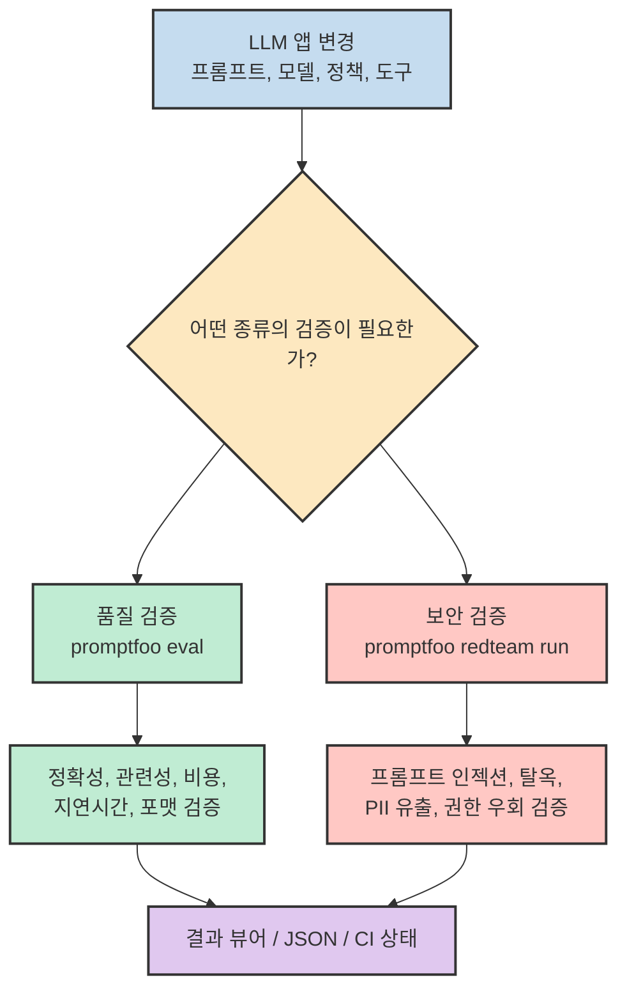
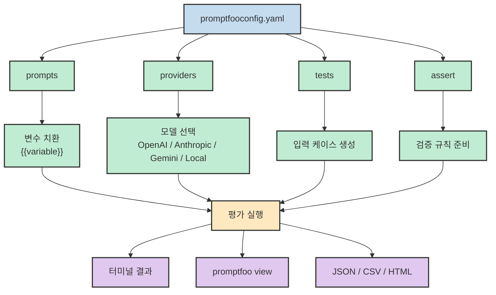
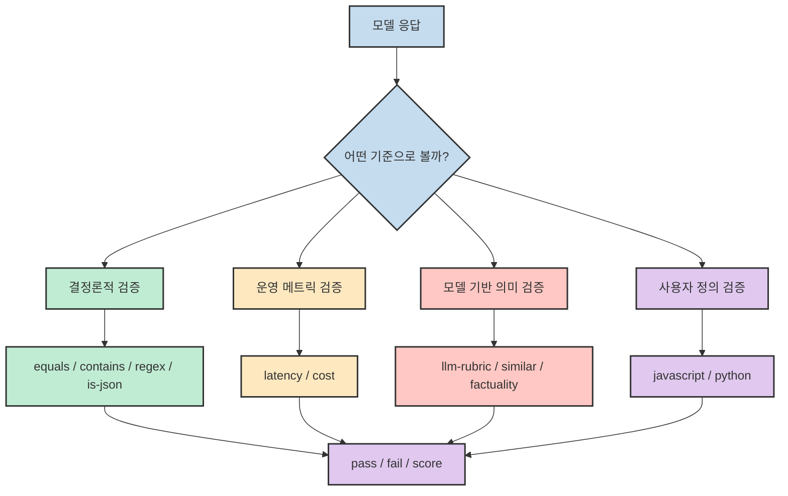
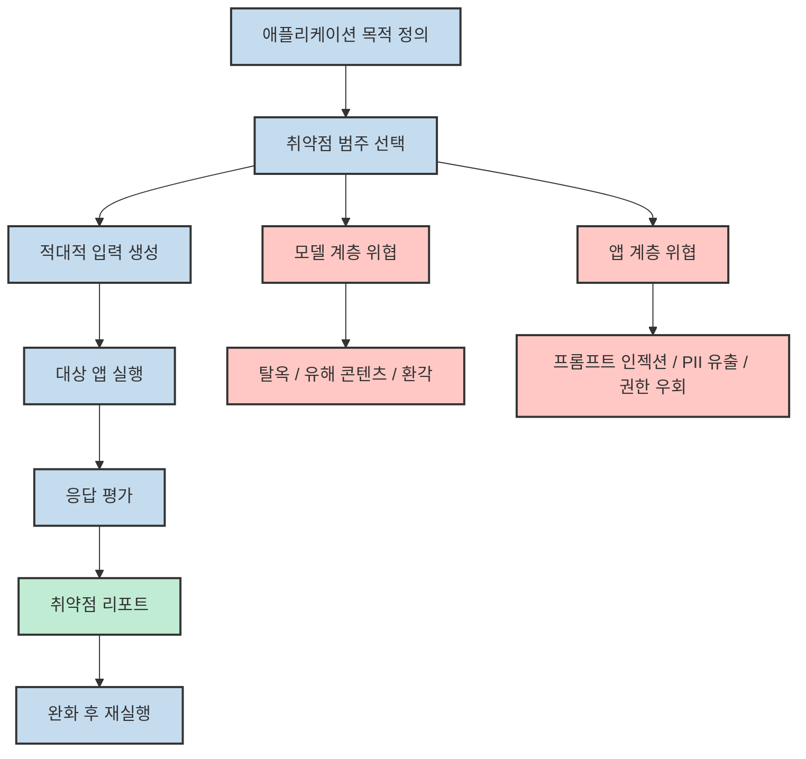
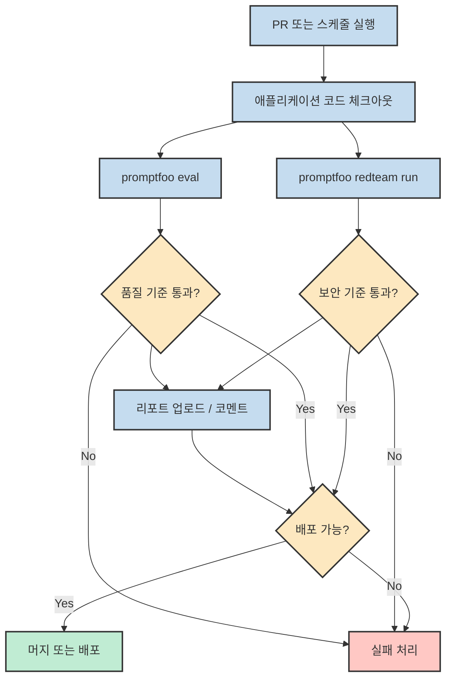

LLM 기능을 제품에 붙이기 시작하면 금방 같은 문제가 반복됩니다.<br>프롬프트가 정말 좋아졌는지, 모델을 바꾸면 회귀가 생기는지, RAG나 에이전트가 위험한 입력에서 무너지는지, 이 세 가지를 사람 눈으로만 계속 확인하기가 어렵습니다.<br>**Promptfoo** 는 바로 이 지점을 겨냥합니다. 프롬프트 품질 평가와 보안 레드팀을 YAML 설정과 CLI 중심으로 묶어서, "감으로 확인하는 LLM 개발"을 "반복 가능한 테스트"로 바꾸는 도구입니다.

이 글에서는 Promptfoo를 단순한 프롬프트 비교기가 아니라, **`eval` 과 `redteam` 이라는 두 개의 운영 루프를 가진 LLM 테스트 하니스** 로 보는 관점으로 정리합니다.

<!--more-->

## Sources

- [GitHub - promptfoo/promptfoo](https://github.com/promptfoo/promptfoo)
- [Promptfoo Docs - Intro](https://www.promptfoo.dev/docs/intro/)
- [Promptfoo Docs - Getting Started](https://www.promptfoo.dev/docs/getting-started/)
- [Promptfoo Docs - Assertions & Metrics](https://www.promptfoo.dev/docs/configuration/expected-outputs/)
- [Promptfoo Docs - LLM Providers](https://www.promptfoo.dev/docs/providers/)
- [Promptfoo Docs - Red Teaming](https://www.promptfoo.dev/docs/red-team/)
- [Promptfoo Docs - CI/CD Integration](https://www.promptfoo.dev/docs/integrations/ci-cd/)

## Promptfoo를 어떻게 봐야 하나

Promptfoo의 공식 소개는 꽤 명확합니다. GitHub README와 공식 문서는 모두 Promptfoo를 **LLM 앱을 평가하고(red-team 포함) 운영 전에 검증하는 오픈소스 CLI 및 라이브러리** 로 설명합니다. 여기서 중요한 점은 "프롬프트를 한 번 비교해 보는 도구"가 아니라, **변경이 생길 때마다 다시 돌릴 수 있는 테스트 루프** 를 제공한다는 점입니다.

실제로 Promptfoo 문서의 중심에는 두 개의 명령이 반복해서 등장합니다.

1. `promptfoo eval` - 프롬프트, 모델, 테스트 케이스 조합을 돌려 품질과 비용, 지연시간, 사실성 같은 결과를 본다.
2. `promptfoo redteam run` - 적대적 입력을 만들어 보안 취약점과 정책 위반 가능성을 스캔한다.

즉 Promptfoo는 "좋은 답을 잘 만드는가"와 "위험한 입력에서 무너지지 않는가"를 같은 운영 레이어에서 다루게 해 줍니다.



## `eval` 워크플로우: 프롬프트를 테스트 가능한 자산으로 바꾸기

Promptfoo의 기본 흐름은 `promptfooconfig.yaml` 파일을 중심으로 돌아갑니다. [Getting Started](https://www.promptfoo.dev/docs/getting-started/) 문서는 `init --example getting-started` 로 샘플 프로젝트를 만든 뒤, `eval` 과 `view` 를 순서대로 실행하는 가장 작은 루프를 보여 줍니다.

```bash
npx promptfoo@latest init --example getting-started
cd getting-started
npx promptfoo@latest eval
npx promptfoo@latest view
```

이 흐름이 좋은 이유는 구조가 단순하기 때문입니다. Promptfoo는 보통 아래 네 가지를 분리해서 다룹니다.

- `prompts`: 실제로 비교하거나 검증할 프롬프트
- `providers`: 어떤 모델/엔드포인트에서 돌릴지
- `tests`: 입력 변수와 테스트 케이스
- `assert`: 출력이 만족해야 할 조건

결국 Promptfoo는 **프롬프트 x 모델 x 테스트 케이스** 의 곱집합을 실행한 다음, 결과를 사람이 읽기 쉬운 뷰로 정리합니다. 여기에 `assert` 를 정의하면 자동 판정 가능한 메트릭과 pass/fail 기준까지 붙일 수 있고, 그렇지 않으면 웹 UI에서 수동 검토 중심으로 볼 수도 있습니다.



가장 단순한 예시는 아래처럼 쓸 수 있습니다.

```yaml
# yaml-language-server: $schema=https://promptfoo.dev/config-schema.json
description: Translation quality smoke test

prompts:
  - "Convert the following English text to {{language}}: {{input}}"

providers:
  - openai:gpt-5-mini
  - anthropic:messages:claude-opus-4-6
  - google:gemini-3-pro-preview

tests:
  - vars:
      language: French
      input: Hello world
    assert:
      - type: contains
        value: "Bonjour"
  - vars:
      language: Spanish
      input: Where is the library?
    assert:
      - type: icontains
        value: "biblioteca"
```

이런 선언형 구성이 중요한 이유는, 프롬프트를 코드처럼 다루게 해 주기 때문입니다. 프롬프트 문구를 바꾸거나 모델을 교체할 때, 결과가 좋아졌는지 나빠졌는지 같은 질문을 **재현 가능한 입력 집합** 으로 다시 확인할 수 있습니다.

## 어설션과 메트릭: "좋아 보인다"를 자동 판정으로 바꾸는 층

Promptfoo가 단순 로그 수집기가 아닌 이유는 `assert` 층에 있습니다. 공식 [Assertions & Metrics](https://www.promptfoo.dev/docs/configuration/expected-outputs/) 문서를 보면, assertions는 선택 사항이지만, 넣기 시작하면 문자열 포함 여부 같은 결정론적 검증부터 LLM 루브릭 기반 평가, JavaScript/Python 사용자 정의 검증까지 상당히 넓게 다룰 수 있습니다.

실전에서 특히 유용한 조합은 보통 세 부류입니다.

1. **형식 검증** - `equals`, `contains`, `regex`, `is-json`
2. **운영 메트릭 검증** - `latency`, `cost`
3. **의미 검증** - `llm-rubric`, `similar`, `factuality`, `answer-relevance`

이 구조 덕분에 Promptfoo는 "정답 문자열이 들어갔는가" 같은 좁은 테스트만 하는 것이 아니라, **응답 품질과 운영 비용을 함께 본다** 는 점이 강합니다.



예를 들어 FAQ 봇을 평가한다면 아래처럼 만들 수 있습니다.

```yaml
defaultTest:
  assert:
    - type: llm-rubric
      value: "답변은 질문과 직접 관련이 있고 장황하지 않아야 한다"
    - type: latency
      threshold: 3000
    - type: cost
      threshold: 0.002

tests:
  - vars:
      question: "환불 정책이 어떻게 되나요?"
    assert:
      - type: contains
        value: "환불"
```

이 방식은 QA 팀, 프롬프트 작성자, 애플리케이션 엔지니어가 서로 다른 관점을 한 파일에 녹여낼 수 있게 합니다. 문자열 조건은 개발자가 적고, 비즈니스 루브릭은 PM이나 도메인 담당자가 정하고, 비용/지연시간은 운영 기준으로 넣는 식입니다.

## 프로바이더 추상화: 모델 비교를 설정 레벨에서 처리한다

Promptfoo의 또 다른 강점은 [Providers](https://www.promptfoo.dev/docs/providers/) 문서가 보여주듯, 특정 벤더에 갇히지 않는다는 점입니다. OpenAI, Anthropic, Google, Bedrock, Ollama, LocalAI 같은 주요 경로뿐 아니라, 파일 기반 Python/JavaScript provider, HTTP API, MCP, WebSocket, webhook 등까지 설정 레벨에서 다룹니다.

이 말은 곧 "모델 비교"나 "벤더 교체"를 애플리케이션 코드 변경이 아니라 **평가 설정 변경** 으로 먼저 검토할 수 있다는 뜻입니다.

```yaml
providers:
  - openai:gpt-5
  - anthropic:messages:claude-opus-4-6
  - google:gemini-2.5-pro
  - ollama:chat:llama3.3
  - file://path/to/custom_provider.py
```

또한 Promptfoo는 CLI에서 provider를 바로 덮어쓸 수 있어서, 동일한 테스트 세트를 유지한 채 후보 모델만 바꾸는 실험도 쉽습니다.

```bash
promptfoo eval -r google:gemini-3-pro-preview google:gemini-2.5-pro
```

이 부분이 중요한 이유는 LLM 제품 개발에서 흔히 생기는 문제 때문입니다. 모델 후보가 늘어나면 비교 기준도 함께 늘어나야 하는데, 기준을 코드 밖으로 빼 두지 않으면 비교가 매번 즉흥적으로 흘러갑니다. Promptfoo는 이 비교 기준을 YAML과 assert 계층으로 고정합니다.

## `redteam` 워크플로우: 품질 테스트와 보안 테스트를 분리한다

Promptfoo의 [Red Teaming](https://www.promptfoo.dev/docs/red-team/) 문서는 이 도구를 단순 eval 프레임워크로만 보면 절반만 본 것이라고 말해 줍니다. 문서가 강조하는 핵심은, LLM 앱의 취약점은 모델 자체뿐 아니라 애플리케이션 계층에서도 발생한다는 점입니다. 운영 관점에서도 redteam은 일반 eval과 완전히 같은 루프라기보다, **적대적 입력 생성 -> 실행 -> 평가 -> 리포트** 라는 보안 점검 흐름에 더 가깝고, `promptfoo redteam run` 은 이 과정을 단축해서 실행하는 진입점으로 보는 편이 정확합니다.

예를 들면 이런 구분입니다.

- **모델 계층 위협**: 탈옥, 유해 콘텐츠, 편향, 환각, 훈련 데이터 기반 PII 노출
- **애플리케이션 계층 위협**: 간접 프롬프트 인젝션, RAG 문맥 기반 PII 유출, 권한 우회, 도구 악용, 데이터 유출

이 구분이 실무적으로 중요한 이유는 대부분의 팀이 모델 가중치를 직접 다루지 않고, API와 툴 체인을 엮은 앱을 운영하기 때문입니다. Promptfoo 문서도 그래서 **대부분의 개발자와 AppSec 팀에게는 블랙박스 방식의 애플리케이션 레이어 테스트가 더 실용적** 이라고 설명합니다.



Red team 쪽에서 Promptfoo가 제공하는 추상화는 대략 다음과 같습니다.

- **plugins**: 어떤 취약점 범주를 노릴지 지정
- **strategies**: 어떤 방식으로 공격을 전개할지 지정
- **target/purpose**: 이 앱이 무엇을 하는지, 무엇을 지켜야 하는지 설명

공식 문서에는 MCP 보안 테스트나 에이전트 보안 테스트 예시도 들어가 있습니다. 즉 Promptfoo는 단순히 "이 프롬프트가 욕설을 내뱉는가"만 보는 것이 아니라, **도구 사용, 메모리, 권한 범위, 컨텍스트 오염** 같은 문제까지 평가 대상으로 끌어올립니다.

아래처럼 설정할 수 있습니다.

```yaml
providers:
  - id: anthropic:messages:claude-3-haiku-20240307
    config:
      mcp:
        enabled: true
        server:
          url: https://your-mcp-server.example.com/mcp

prompts:
  - |
    You are a customer support agent for Acme.
    {{prompt}}

redteam:
  purpose: |
    고객 지원을 수행하되 내부 정보 노출이나 무단 접근을 허용하면 안 된다.
  plugins:
    - pii
    - bfla
    - bola
    - sql-injection
    - mcp
  strategies:
    - basic
    - best-of-n
    - jailbreak
```

여기서 핵심은 "우리 앱은 무엇을 하면 안 되는가"를 설정으로 명시할 수 있다는 점입니다. 이 덕분에 보안 테스트가 추상적인 구호가 아니라, PR과 릴리즈 직전에 실제로 돌릴 수 있는 실행 단위가 됩니다.

## 왜 CI/CD에 잘 붙는가

Promptfoo가 실무에서 특히 좋은 부분은 eval과 redteam 모두가 **CLI 기준으로 작동** 한다는 점입니다. 즉 사람이 UI에서 수동으로 눌러야 하는 과정이 아니라, 파이프라인에 그대로 넣기 쉽습니다. 다만 공식 [CI/CD 문서](https://www.promptfoo.dev/docs/integrations/ci-cd/) 를 보면 두 흐름의 빈도는 조금 다릅니다. `eval` 은 PR 게이트로 붙이기 좋고, `redteam` 은 스케줄 실행이나 보안 체크포인트, 수동 점검처럼 더 무거운 검증으로 운영하는 경우가 많습니다.



가장 작은 형태는 아래처럼 시작할 수 있습니다. 실제 CI에서는 Node.js 실행 환경과 각 provider용 API 키를 GitHub Secrets 또는 환경 변수로 함께 넣어야 합니다.

```yaml
name: promptfoo-checks

on:
  pull_request:
  schedule:
    - cron: "0 2 * * *"

jobs:
  eval:
    runs-on: ubuntu-latest
    steps:
      - uses: actions/checkout@v4
      - run: npm ci
      - run: npx promptfoo@latest eval -c promptfooconfig.yaml -o results.json

  redteam:
    runs-on: ubuntu-latest
    steps:
      - uses: actions/checkout@v4
      - run: npm ci
      - run: npx promptfoo@latest redteam run
```

이렇게 분리하는 것이 좋은 이유는 품질 회귀와 보안 회귀가 서로 다른 실패 원인을 갖기 때문입니다. 프롬프트 문구 개선 실험은 eval에서 잡히고, 새 도구 연결이나 RAG 변경은 redteam에서 문제가 드러날 가능성이 높습니다. 그래서 실무에서는 eval을 더 자주 돌리고, redteam은 릴리즈 전후나 정기 스캔, 보안 이슈 대응 시점에 깊게 돌리는 방식이 자연스럽습니다.

## Promptfoo가 잘 맞는 팀과 한계

Promptfoo는 특히 아래 같은 팀에 잘 맞습니다.

- 프롬프트를 자주 바꾸는데, 품질 비교가 늘 주관적으로 흐르는 팀
- 여러 모델 후보를 놓고 비용/지연시간/품질을 같이 보고 싶은 팀
- RAG, 에이전트, MCP, 툴 호출이 들어가면서 공격 표면이 넓어진 팀
- 릴리즈 전에 최소한의 AI 품질 게이트와 보안 게이트를 두고 싶은 팀

반대로 Promptfoo가 만능은 아닙니다.

1. **좋은 테스트 케이스가 없으면 결과도 약합니다.** Promptfoo는 프레임워크이지, 도메인 지식을 자동으로 발명해 주는 도구는 아닙니다.
2. **LLM 기반 평가에는 비용이 듭니다.** `llm-rubric` 같은 강력한 메트릭은 편하지만, 운영 기준을 잘 잡아야 합니다.
3. **redteam은 목적 정의가 중요합니다.** 취약점 범주와 앱의 금지 행동을 명확히 적지 않으면, 보안 리포트가 넓고 얕아질 수 있습니다.

그래도 이 한계는 오히려 장점과 연결됩니다. Promptfoo는 "마법처럼 자동 평가"를 약속하기보다, **무엇을 테스트할지 구조화하게 만드는 도구** 에 가깝습니다.

## 핵심 요약

1. **Promptfoo는 eval과 redteam이라는 두 개의 루프를 가진 LLM 테스트 하니스** 다.
2. `promptfooconfig.yaml` 에 `prompts`, `providers`, `tests`, `assert` 를 선언해 프롬프트를 반복 가능한 테스트 대상으로 만든다.
3. 문자열 검증뿐 아니라 비용, 지연시간, 사실성, 루브릭 기반 품질 평가까지 한 워크플로우에서 다룰 수 있다.
4. 모델 계층 위협과 애플리케이션 계층 위협을 분리해서 볼 수 있어서, RAG·에이전트·MCP 같은 실제 앱 보안 테스트에 특히 잘 맞는다.
5. CLI 중심 구조라서 PR 체크, 스케줄 스캔, 품질 게이트 같은 CI/CD 자동화에 붙이기 쉽다.

## 결론

Promptfoo의 핵심 가치는 "프롬프트를 더 잘 쓰게 해 주는 도구"라는 데만 있지 않습니다.<br>더 중요한 가치는 **LLM 앱의 변경을 테스트 가능한 변경으로 바꾸는 운영 습관** 에 있습니다.<br>`eval` 은 품질과 회귀를 관리하고, `redteam` 은 생성-실행-평가-리포트에 가까운 보안 점검 흐름으로 공격 표면을 살핍니다. 이 둘을 같은 설정 중심 흐름 안에 두기 때문에, Promptfoo는 프롬프트 엔지니어링 도구라기보다 LLM 애플리케이션용 테스트 인프라에 더 가깝습니다.

LLM 제품이 커질수록 중요한 것은 "모델이 똑똑한가"보다 "변경을 검증할 수 있는가"입니다.<br>그 기준에서 보면 Promptfoo는 꽤 설득력 있는 선택지입니다. 특히 이미 PR, CI, 릴리즈 파이프라인이 있는 팀이라면 더 그렇습니다.
