웹 스크래핑은 데이터 수집의 핵심 기술이지만, 정적 페이지와 동적 페이지, 다양한 anti-bot 시스템 등으로 인해 복잡도가 계속 증가하고 있습니다. 이러한 복잡성을 해결하기 위해 등장한 **Scrapling**은 단일 요청부터 대규모 크롤링까지 처리하는 적응형 웹 스크래핑 프레임워크를 제공합니다.

<!--more-->

## Sources

- https://github.com/D4Vinci/Scrapling.git

## Scrapling이란?

**Scrapling**은 Python 기반의 적응형 웹 스크래핑 프레임워크로, 단순한 단일 요청부터 대규모 크롤링 작업까지 처리할 수 있는 통합 솔루션입니다. BSD-3-Clause 라이선스로 제공되며, 현재 GitHub에서 28.4k stars, 2.1k forks를 기록할 만큼 개발자들 사이에서 인기를 얻고 있습니다.

### 주요 특징

Scrapling의 핵심 가치는 "적응형(Adaptive)"에 있습니다. 상황에 따라 최적의 전략을 자동으로 선택하고, 다양한 fetching 방식과 파싱 기술을 유연하게 활용할 수 있습니다.

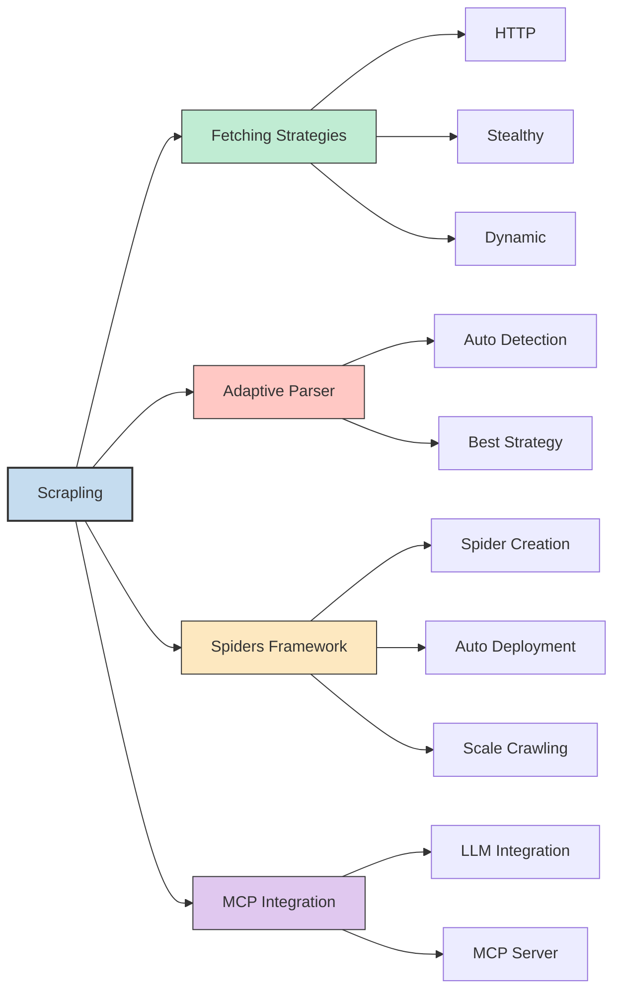

## 핵심 기술 아키텍처

### Fetching 전략

Scrapling은 세 가지 fetching 전략을 제공하여 상황에 맞는 최적의 방법을 선택할 수 있습니다.

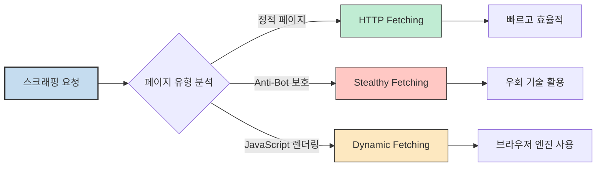

#### HTTP Fetching

가장 기본적인 fetching 방식으로, 정적 페이지에 적합합니다. 빠르고 효율적이며 리소스 소모가 적습니다.

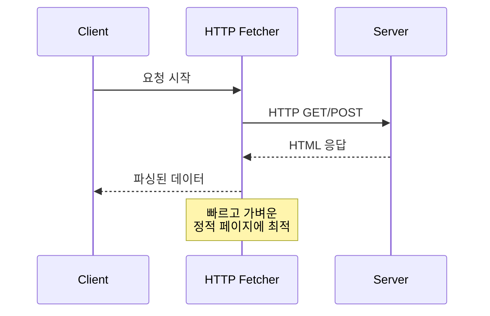

#### Stealthy Fetching

Anti-bot 시스템을 우회하는 고급 기술을 활용합니다. User-Agent 스위핑, 요청 패턴 무작위화, 프록시 지원 등의 기능을 제공합니다.

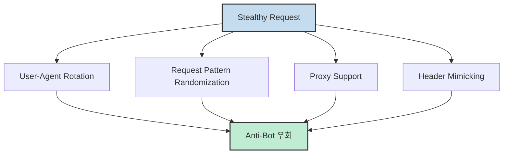

#### Dynamic Fetching

JavaScript가 필요한 동적 페이지를 처리하기 위해 실제 브라우저 엔진을 활용합니다. Playwright 같은 도구와 통합하여 SPA(Single Page Application)도 스크래핑할 수 있습니다.

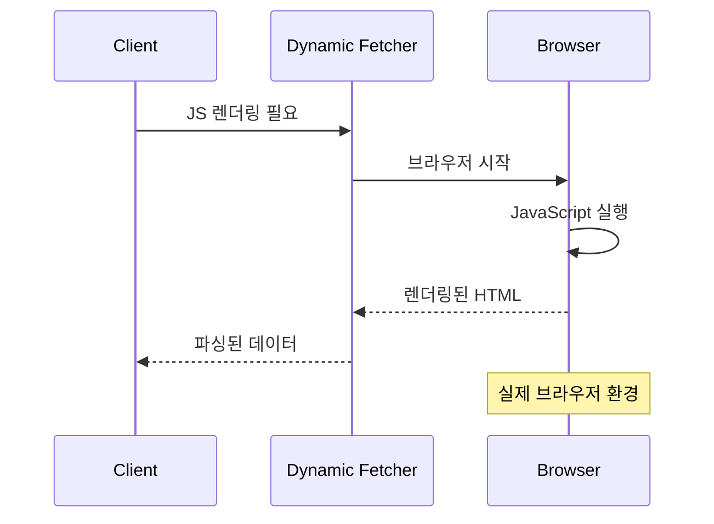

### Adaptive Parser

Scrapling의 적응형 파서는 자동으로 최적의 파싱 전략을 선택합니다. HTML 구조를 분석하고 가장 효율적인 선택자와 추출 방법을 결정합니다.

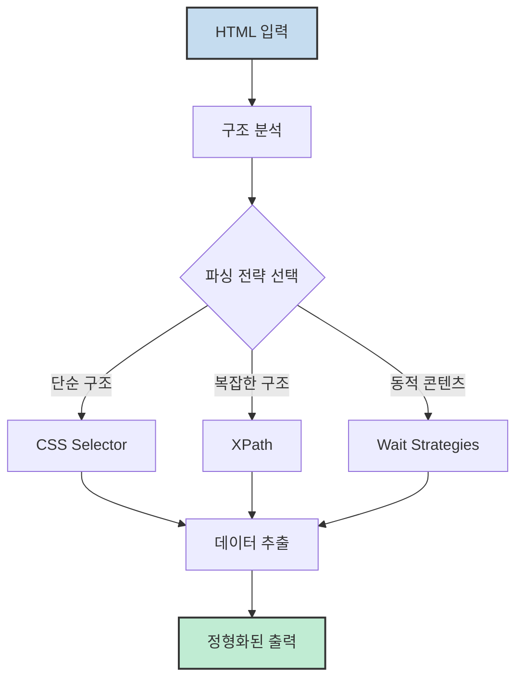

### Spiders Framework

Scrapling의 진정한 힘은 Spiders Framework에서 발휘됩니다. Spider를 생성하고 배포하며, 자동으로 여러 페이지를 크롤링할 수 있습니다.

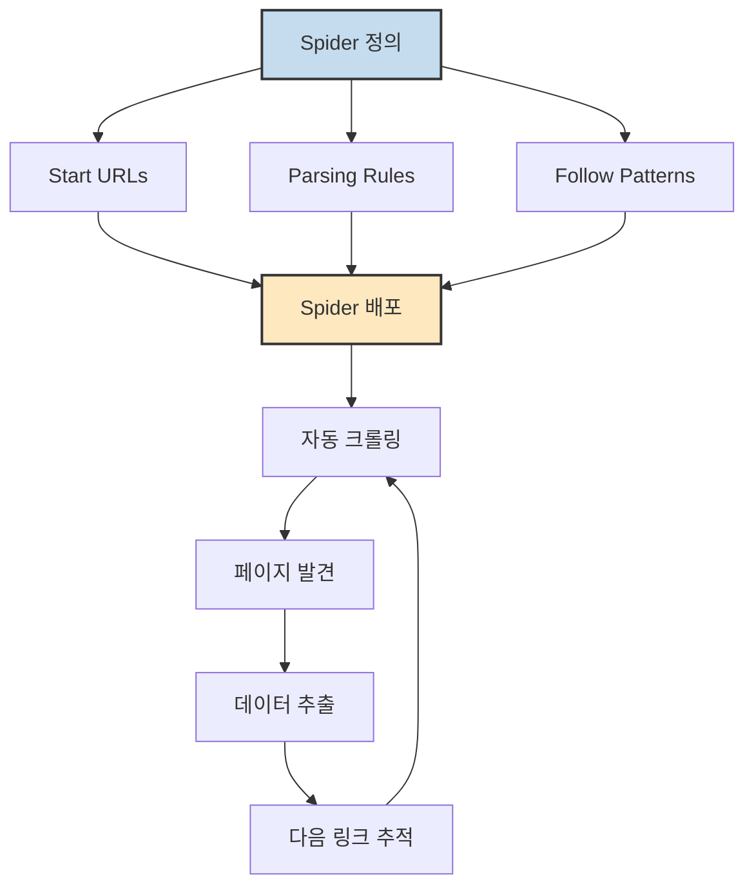

Spider의 핵심 기능:

- **자동 링크 추적**: 정의한 패턴에 따라 자동으로 다음 페이지를 찾습니다
- **분산 처리**: 대규모 크롤링을 위한 병렬 처리 지원
- **에러 복구**: 실패한 요청을 자동으로 재시도합니다
- **데이터 파이프라인**: 추출한 데이터를 변환하고 저장하는 파이프라인을 제공합니다

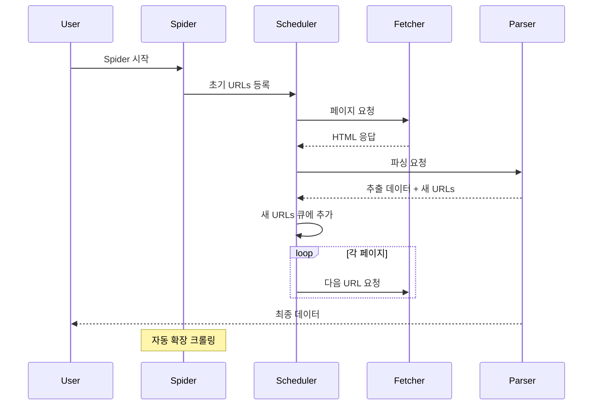

## 설치 및 빠른 시작

### 설치

Scrapling은 pip를 통해 간단하게 설치할 수 있습니다.

```bash
pip install scrapling
```

### 기본 사용 예시

간단한 HTTP fetching 예시:

```python
from scrapling import Fetcher

# 기본 HTTP fetching
fetcher = Fetcher()
result = fetcher.get('https://example.com')
print(result.text)
```

Stealthy fetching으로 anti-bot 우회:

```python
from scrapling import StealthyFetcher

# Anti-bot 우회
fetcher = StealthyFetcher()
result = fetcher.get('https://protected-site.com')
print(result.text)
```

Dynamic fetching으로 JavaScript 렌더링 처리:

```python
from scrapling import DynamicFetcher

# JavaScript 렌더링 필요한 페이지
fetcher = DynamicFetcher()
result = fetcher.get('https://spa-site.com')
print(result.text)
```

## 성능 벤치마크

Scrapling은 벤치마크에서 BeautifulSoup과 Parsel보다 현저히 빠른 성능을 보여줍니다.

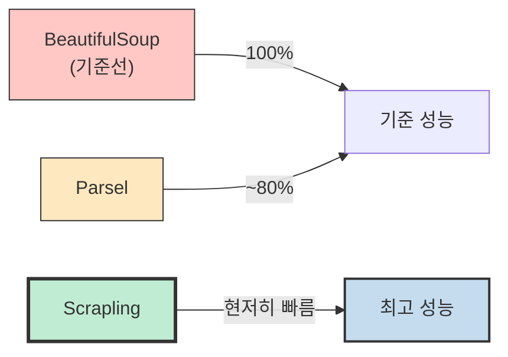

성능 향상의 주요 원인:

- **비동기 처리**: 효율적인 비동기 I/O 활용
- **최적화된 파서**: 불필요한 처리를 최소화하는 맞춤형 파서
- **커넥션 풀링**: HTTP 연결 재사용으로 오버헤드 감소
- **적응형 전략**: 상황에 맞는 최적의 방법 자동 선택

## MCP 서버 통합

Scrapling은 MCP (Model Context Protocol) 서버와 통합하여 LLM (Large Language Model)과 쉽게 연동할 수 있습니다. 이를 통해 AI 에이전트가 실시간 웹 데이터를 수집하고 활용할 수 있습니다.

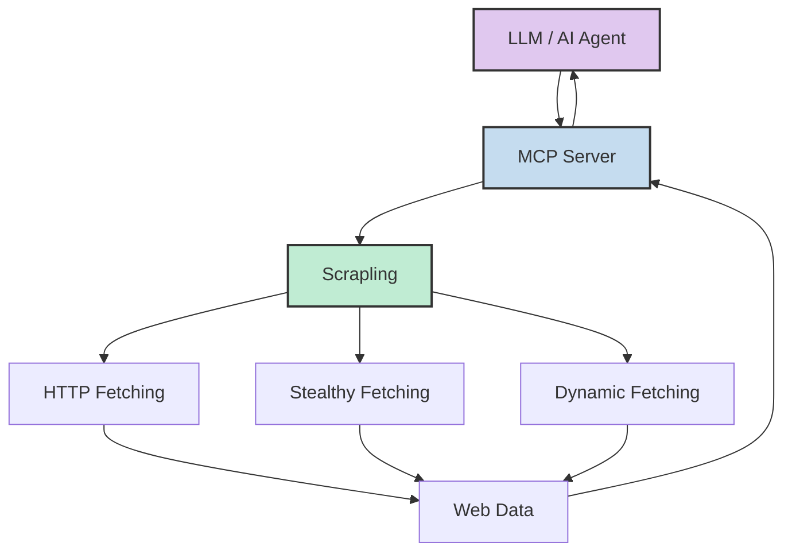

MCP 통합의 장점:

- **실시간 데이터**: LLM이 최신 웹 정보에 접근 가능
- **자동화된 스크래핑**: AI 에이전트가 자율적으로 데이터 수집
- **구조화된 출력**: LLM이 바로 활용할 수 있는 정형 데이터 제공

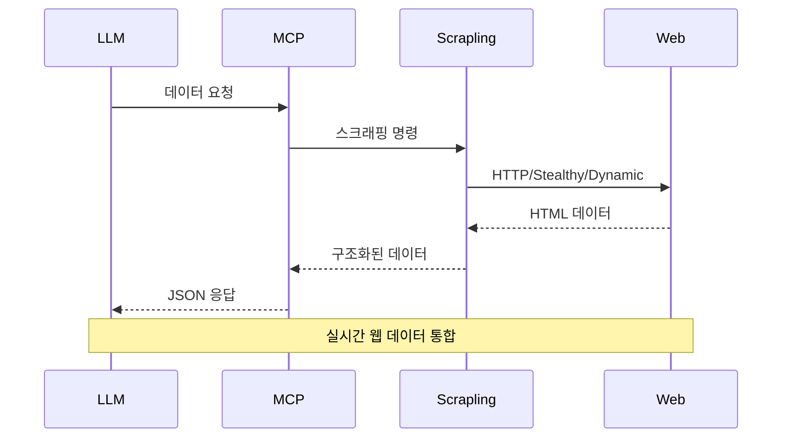

## 핵심 요약

| 항목 | 내용 |
|-----|------|
| **프로젝트** | Scrapling - 적응형 웹 스크래핑 프레임워크 |
| **라이선스** | BSD-3-Clause |
| **인기도** | 28.4k stars, 2.1k forks |
| **핵심 기능** | HTTP/Stealthy/Dynamic Fetching, Adaptive Parser, Spiders Framework |
| **설치** | `pip install scrapling` |
| **성능** | BeautifulSoup, Parsel보다 현저히 빠름 |
| **LLM 통합** | MCP 서버를 통한 AI 에이전트 연동 지원 |

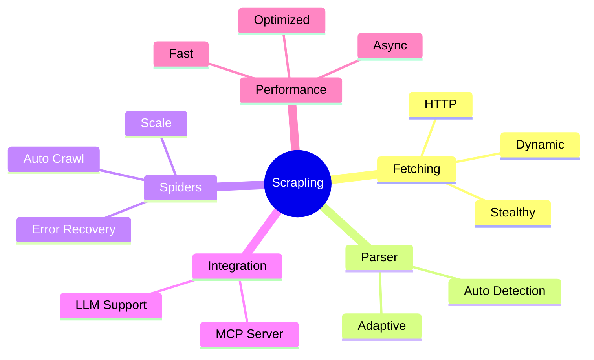

## 결론

Scrapling은 단순한 스크래핑 라이브러리를 넘어, **상황에 적응하는 지능형 프레임워크**입니다. 정적 페이지부터 동적 SPA, anti-bot 보호 사이트까지 다양한 환경에서 최적의 전략을 자동으로 선택하여 효율적인 데이터 수집을 가능하게 합니다.

특히 Spiders Framework와 MCP 통합은 단순한 스크래핑을 넘어 **자율적인 데이터 수집 에이전트** 구축을 가능하게 하며, LLM과의 결합을 통해 AI 기반 데이터 분석 파이프라인 구축에도 활용할 수 있습니다.

웹 스크래핑 프로젝트를 계획 중이라면, Scrapling은 강력하고 유연한 선택지가 될 것입니다.
