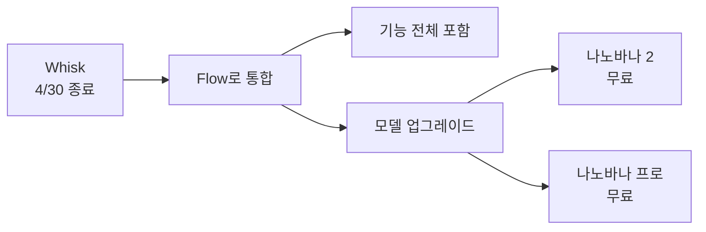
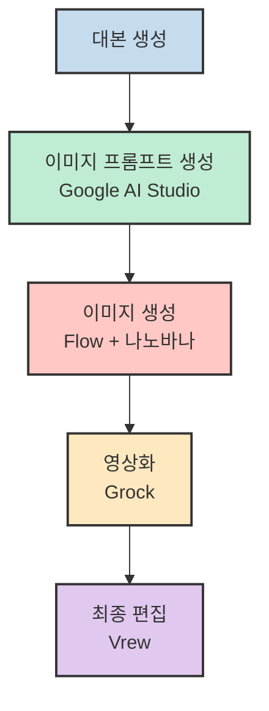
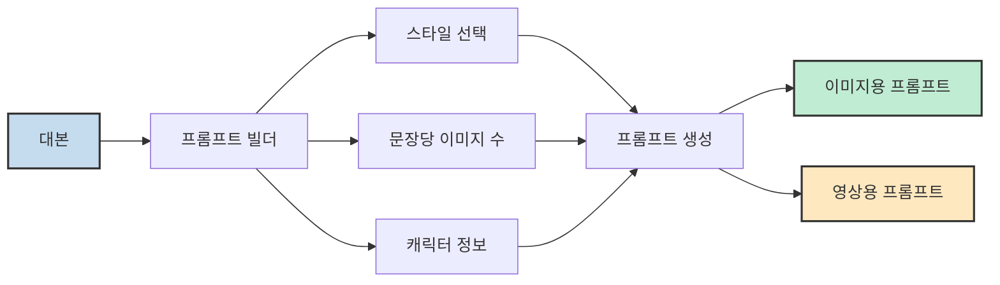
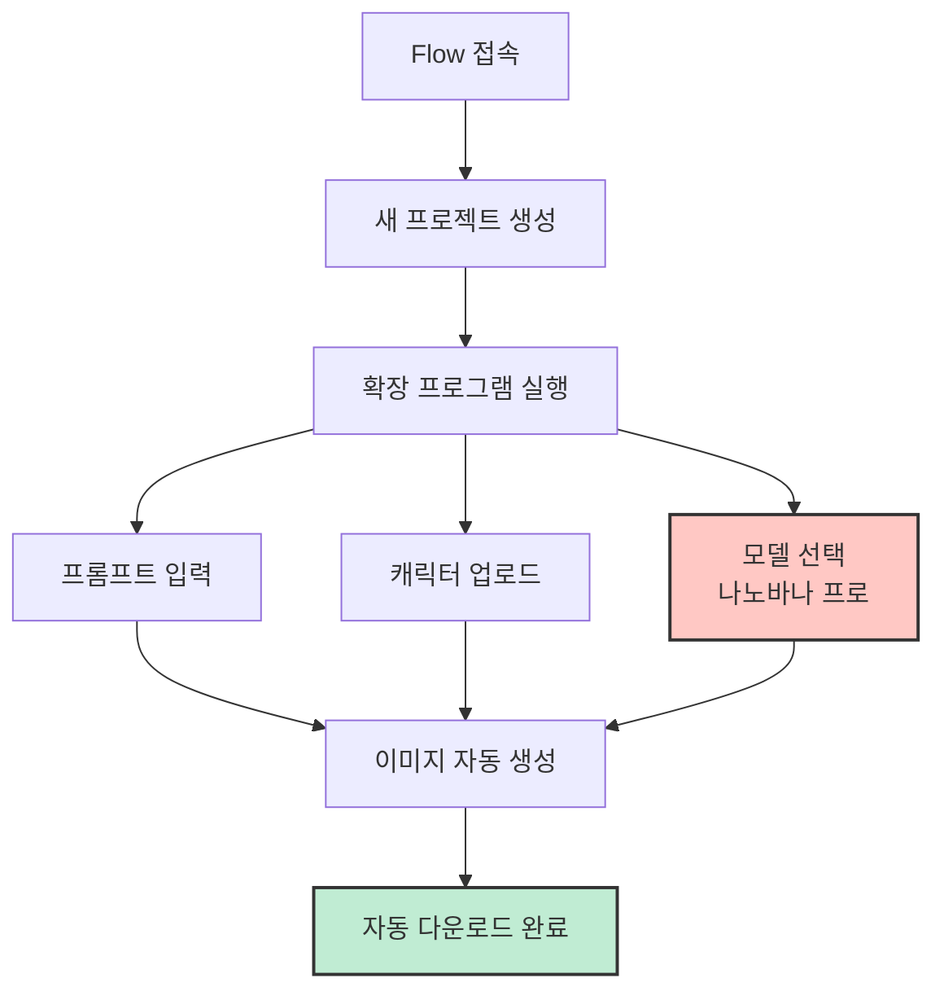
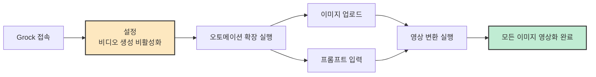
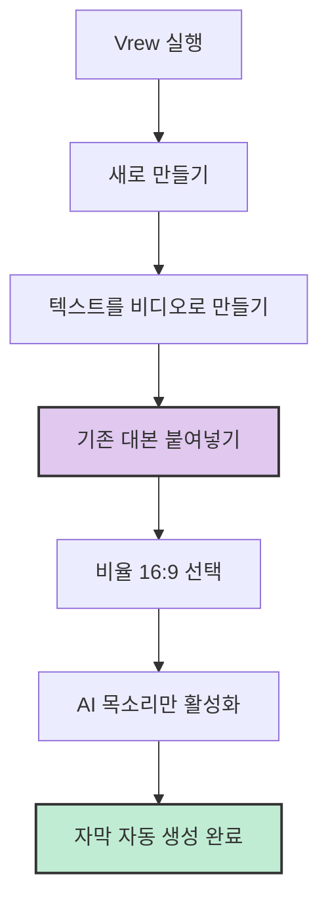
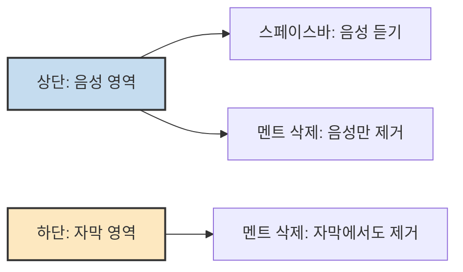
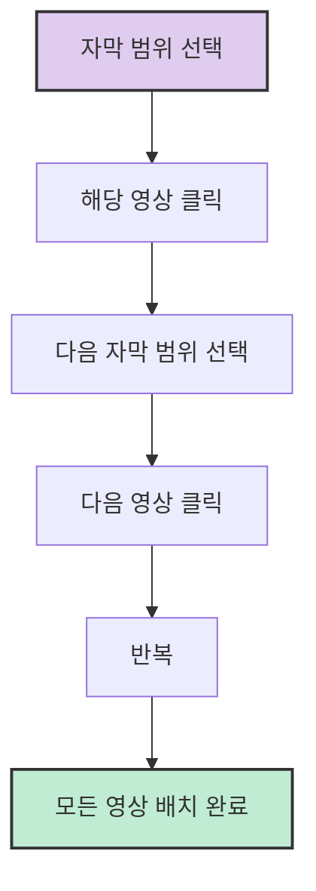
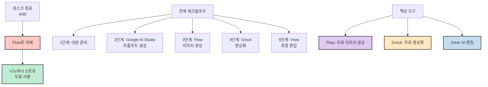

요즘 AI로 롱폼 영상을 만드는 크리에이터들이 많습니다. 하지만 직접 실행해 보면 생각보다 손이 많이 갑니다. 대본을 써야 하고, 이미지 프롬프트를 하나하나 작성해야 하고, 이미지를 한 장씩 생성해서 일일이 저장해야 할 뿐만 아니라 영상 편집까지 하려면 반나절이 금방 갑니다.

자동화를 원하는 분들이 많지만, 자동화는 오래 걸리는 부분에 생산성을 올리는 게 목적이어야지 "바이브 코딩으로 프로그램 만들기" 자체가 목적이 되면 안 됩니다. 주객전도입니다.

이 글에서는 직접 사용하고 있는 최적의 무료 조합을 안내합니다. 복잡한 설정 없이 이 순서대로 따라하면 롱폼 영상 하나가 빠르게 완성됩니다.

<!--more-->

## Sources

- [위스크 종료 후 대안 + 브루 조합 | 무료로 AI 롱폼 영상 자동 제작](https://youtu.be/N53Ykw3XjSk) - 라핀 | AI 자동화 바이브코딩

## 관련 링크

| 도구 | 링크 |
|------|------|
| Vrew (Vrew) 신규가입 | [vrew.ai/ko/signup](https://vrew.ai/ko/signup?aff=Lapin) |
| Flow 전용 확장앱 | [lapin.ai.kr](https://lapin.ai.kr/board/flow-image-generator) |
| 프롬프트 빌더 | [lapin.ai.kr](https://lapin.ai.kr/board/flow-prompt-generator) |
| Grock 오토메이션 | [Chrome Web Store](https://chromewebstore.google.com/detail/grock-automation) |
| Google Flow | [labs.google/fx](https://labs.google/fx/ko/tools/flow) |
| 라핀 스튜디오 | [lapin.ai.kr](https://lapin.ai.kr/products/longform) |
| Google AI Studio | [aistudio.google.com](https://aistudio.google.com) |

## 위스크 종료와 Flow로의 전환

위스크는 2026년 4월 30일에 중지됩니다. 기존 위스크 사용자들, 특히 위스크 오토메이션 확장 프로그램에 의존하던 분들은 막막할 수 있습니다. 하지만 걱정할 필요 없습니다.

위스크는 Flow와 합쳐지게 되며, Flow에서는 위스크의 기능이 전부 포함되어 있고 모델 자체도 더 업그레이드되었습니다. [출처](https://youtu.be/N53Ykw3XjSk?t=60)

Flow에서는 총 세 가지 모델을 선택할 수 있습니다:

| 모델 | 특징 | 크레딧 |
|------|------|--------|
| 이미젠 | 기존 위스크 모델 | 유료 |
| 나노바나 2 | 기본 모델 | 0 크레딧 |
| 나노바나 프로 | 고급 모델 | 0 크레딧 |

나노바나 2와 나노바나 프로 모두 생성 시 0 크레딧이 사용됩니다. 즉, **공짜로 이미지를 만들 수 있습니다.** 위스크를 쓰던 분들은 오히려 더 좋아진 셈입니다. [출처](https://youtu.be/N53Ykw3XjSk?t=80)

## 전체 워크플로우 개요

오늘 소개할 워크플로우는 다음과 같이 4단계로 구성됩니다:

## 1단계: 대본 준비

대본 생성 방법은 각자의 노하우가 있겠지만, 이 워크플로우에서는 [라핑 스튜디오](https://lapin.ai.kr/products/longform)에서 주제만 입력하면 영상까지 한 번에 나오는 프로그램을 사용하여 대본을 먼저 분리해서 사용합니다. [출처](https://youtu.be/N53Ykw3XjSk?t=120)

이 글에서는 대본이 이미 준비되어 있다고 가정하고 다음 단계로 넘어갑니다.

## 2단계: 이미지 프롬프트 생성 (Google AI Studio)

이미지 프롬프트 생성은 자주 이용하는 AI에서 해도 되지만, [Google AI Studio](https://aistudio.google.com)를 사용하는 데는 이유가 있습니다.

Google AI Studio의 컨텍스트 창은 최대 200만 토큰이라서 대본이 길어도 통째로 입력할 수 있습니다. [출처](https://youtu.be/N53Ykw3XjSk?t=120)

프롬프트 빌더를 [이 링크](https://lapin.ai.kr/board/flow-prompt-generator)에서 무료로 사용할 수 있습니다. 다음을 설정합니다:

1. **스타일 선택**: 원하는 이미지 스타일
2. **문장당 이미지 수**: 몇 문장당 한 이미지로 만들지
3. **캐릭터 등장 여부**: 캐릭터 정보 입력

설정을 선택하면 프롬프트가 자동 생성됩니다.

이 프롬프트는 **이미지용 프롬프트**와 **영상화용 프롬프트** 두 가지를 동시에 생성해 줍니다.

대본이 5,000자, 1만 자 이상으로 길면 한 번에 생성할 수 없으므로, 20개씩 끊어서 출력되도록 프롬프트가 작성되어 있습니다. 20개 출력하고 파일을 작성한 뒤 멈추면 계속 입력하면 이어서 계속 생성합니다. [출처](https://youtu.be/N53Ykw3XjSk?t=160)

## 3단계: 이미지 생성 (Flow + 나노바나)

이제 [Google Flow](https://labs.google/fx/ko/tools/flow)로 넘어가서 이미지를 생성합니다.

### Flow 설정

1. [Flow 전용 확장앱](https://lapin.ai.kr/board/flow-image-generator)을 다운로드합니다.
2. 새 프로젝트를 만들고 확장 프로그램을 실행합니다.
3. 복사한 프롬프트를 입력합니다 (상단의 "이미지 프롬프트" 텍스트는 제거).
3. 캐릭터를 사용할 경우 캐릭터 이미지를 업로드합니다.
   - 주의: 캐릭터 첨부 시 미리 캐릭터를 한 번 업로드해야 합니다.
4. 모델을 선택합니다:
   - 롱폼 영상이므로 가로 모드 선택
   - 모델: 나노바나 프로 사용 (0 크레딧)
5. 랜덤 딜레이: 프롬프트 입력 속도 (너무 짧게 하지 않는 것 추천)

확장 프로그램이 자동으로 캐릭터 정보를 불러오고, 프롬프트를 넣고, 이미지를 생성한 뒤 다운로드까지 완료합니다. 예시로는 13장의 이미지가 생성되었습니다. [출처](https://youtu.be/N53Ykw3XjSk?t=180)

## 4단계: 영상화 (Grock)

이제 Grock에서 이미지를 영상으로 변환합니다. [Grock 오토메이션 확장앱](https://chromewebstore.google.com/detail/grock-automation)은 크롬 웹 스토어에서 설치할 수 있습니다.

### Grock 설정

1. Grock에 접속하고 좌측 하단의 로고를 선택합니다.
2. 설정에서 **비디오 생성 활성화를 끕니다** (이미지 업로드 시 바로 영상 생성을 예방).
3. [Grock 오토메이션 확장 프로그램](https://chromewebstore.google.com/detail/grock-automation)을 실행합니다.

### 확장 프로그램 설정

- **기본 모드**: 프레임을 비디오로
- **비율**: 16:9
- **자동 다운로드 품질**: 720p
- 설정 저장

### 이미지 업로드 및 영상화

1. Flow에서 생성한 이미지를 업로드합니다.
2. Google AI Studio에서 생성한 영상용 프롬프트를 복사하여 입력합니다.
3. 이미지가 순서대로 입력되었는지 확인합니다 (역순인 경우 수동 변경).
4. 실행을 누르면 모든 이미지가 영상으로 변환됩니다.

### 왜 영상화를 하나?

이미지만 나열된 영상은 AI 스팸으로 분류될 확률이 높습니다. 각 이미지를 영상 클립으로 변환하여 자연스러운 영상 흐름을 만듭니다. [출처](https://youtu.be/N53Ykw3XjSk?t=220)

**주의사항**: Grock는 무료로 영상화할 수 있지만 한도가 정해져 있습니다. 하지만 하루가 지나면 리셋되므로, 영상화할 영상이 많다면 다음 날까지 기다리거나 유료로 전환하는 것을 추천합니다.

### 계정 관리 팁

Flow 확장, Grock 확장 모두 자동화 도구이므로 사용 제한에 대비해 **부계정으로 진행하는 것을 추천합니다**. 24시간 풀로 놀리는 것이 아니라 적당한 간격으로 사용하면 큰 문제가 없습니다.

## 5단계: 최종 편집 (Vrew)

Vrew는 AI 영상 편집 프로그램으로, 자막 자동 생성은 CapCut보다 훨씬 성능이 좋습니다. 아직 설치하지 않으셨다면 [공식 사이트](https://vrew.ai)에서 무료로 다운로드하고 설치할 수 있습니다. [출처](https://youtu.be/N53Ykw3XjSk?t=250)

### Vrew 시작

1. Vrew를 실행합니다.
2. "새로 만들기" → "텍스트를 비디오로 만들기"를 누릅니다.
3. "스타일 없이 바로 시작하기"를 선택합니다.

### 대본 입력

이미 생성해 둔 대본을 복사하여 붙여넣습니다.

- **화면 비율**: 16:9 선택
- **AI 목소리**: 무료 모델도 괜찮은 퀄리티, 커스텀 목소리도 사용 가능
- 나머지 기능은 전부 끄는 것을 추천

### 자막 및 편집 기능

Vrew에는 편리한 편집 기능들이 있습니다:

**영역 구분**:
- 상단: 음성 영역
- 하단: 자막 영역

**자동 줄 나누기**:
- 좌측 상단 "편집" → "자동 줄 나누기"
- 최대 글자수 조절 후 나누기 버튼 클릭
- AI가 자동으로 자막 길이 수정

**서식 변경**:
- 상단 "서식" → 글자 색상, 폰트 일괄 변경
- 위치도 상단에서 일괄 조절 가능

**직접 줄 바꾸기**:
- 음성에서 원하는 부분에서 엔터 → 자막과 줄바꿈
- 백스페이스 → 자막 달라붙기

### 영상 삽입

1. 상단 "삽입" → "이미지 비디오" 클릭
2. "PC에서 불러오기"로 Grock에서 생성한 영상 모두 선택
3. 대본과 매칭하여 영상 배치

두 문장마다 영상을 생성했으므로, 해당 범위를 선택하고 영상을 배치합니다. 범위 선택이 귀찮다면 하나의 영상에 넣은 뒤 늘려도 됩니다.

### 내보내기

잔여 수정을 마친 뒤:
1. 우측 상단 "내보내기" 클릭
2. "영상 파일", "모든 신", "모든 클립" 한 번 내보내기
3. 우측 하단에서 영상 내보내기 진행

## Vrew 플랜 비교

무료 플랜으로도 기능을 전부 사용할 수 있습니다. AI 목소리, 자동 자막, 텍스트-비디오 만들기 전부 가능합니다. [출처](https://youtu.be/N53Ykw3XjSk?t=420)

| 플랜 | 특징 | AI 목소리 한도 | 워터마크 |
|------|------|----------------|----------|
| 무료 | 기능 전체 사용 | 월 1만 자 (약 2-3편) | 있음 |
| 라이트 | 워터마크 제거 | 월 10만 자 | 없음 |
| 스탠다드 | 대량 제작 | 월 50만 자 | 없음 |

### 플랜 추천

- **월 2-3편 이하**: 무료 플랜 충분
- **월 10-20편**: [라이트 플랜](https://vrew.ai/ko/signup?aff=Lapin)
- **매일 업로드**: 스탠다드 플랜

어필리에이트 코드로 가입하면 라이트 플랜 기준 AI 목소리 사용량이 10만 자에서 15만 자로 5만 자 추가됩니다 (연간 플랜에만 적용, 월간 플랜에는 미적용). [출처](https://youtu.be/N53Ykw3XjSk?t=420)

## 확장 프로그램 설치 방법

### Grock 오토메이션 확장

크롬 웹 스토어에서 받을 수 있습니다: [Grock 오토메이션](https://chromewebstore.google.com/detail/grock-automation)

1. 우측 상단 확장 프로그램 → 확장 프로그램 관리
2. 좌측 "크롬 웹 스토어" 클릭
3. "그록 오토" 검색
4. 추가 클릭

### Flow 전용 확장 앱

이 확장 프로그램은 직접 만든 것이라 크롬 웹 스토어에 없습니다. [여기](https://lapin.ai.kr/board/flow-image-generator)에서만 받을 수 있습니다. [출처](https://youtu.be/N53Ykw3XjSk?t=480)

1. 파일 다운로드 후 압축 해제
2. 확장 프로그램 탭에서 좌측 "개발자 모드" 켜기
3. "압축 해제된 확장 프로그램 로드" 클릭
4. 압축 해제된 폴더 선택
5. 추가 확인

설치된 확장 프로그램은 핀을 고정하여 사용합니다. 로고를 눌러 사용하고, 사용하지 않을 때는 "측면 패널 닫기"를 누르면 됩니다. 삭제하면 바로 제거됩니다.

## 핵심 요약

1. **위스크 대안**: Flow로 전환하면 나노바나 2와 나노바나 프로 모델이 0 크레딧으로 사용 가능
2. **전체 워크플로우**: 대본 → Google AI Studio(프롬프트) → Flow(이미지) → Grock(영상화) → Vrew(편집)
3. **Google AI Studio**: 200만 토큰 컨텍스트 창으로 긴 대본도 통째로 처리 가능
4. **Flow 확장**: 프롬프트 한 번에 입력 → 자동 이미지 생성 및 다운로드
5. **Grock 오토메이션**: 이미지를 영상 클립으로 변환하여 AI 스팸 방지
6. **Vrew**: 자막 자동 생성 성능이 뛰어나고 편리한 편집 기능 제공
7. **플랜 선택**: 월 2-3편은 무료, 10-20편은 라이트, 매일 업로드는 스탠다드
8. **계정 관리**: 사용 제한 대비 부계정 사용 권장

## 결론

위스크가 종료되지만 Flow, Grock, Vrew 조합을 통해 완전 무료로 AI 롱폼 영상을 자동 제작할 수 있습니다. 주제 입력부터 최종 영상까지 사람이 직접 작업하는 부분은 상당히 적고, 나머지는 전부 AI가 자동으로 처리합니다.

각 단계마다 전용 확장 프로그램을 활용하면 복잡한 설정 없이도 빠르게 영상을 완성할 수 있습니다. 적당한 간격으로 사용하며 부계정을 활용하면 사용 제한 문제도 해결할 수 있습니다.
