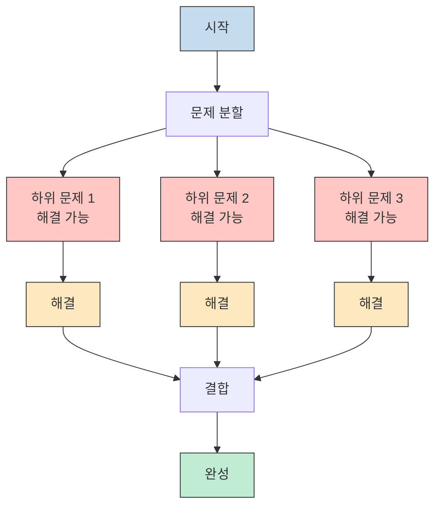
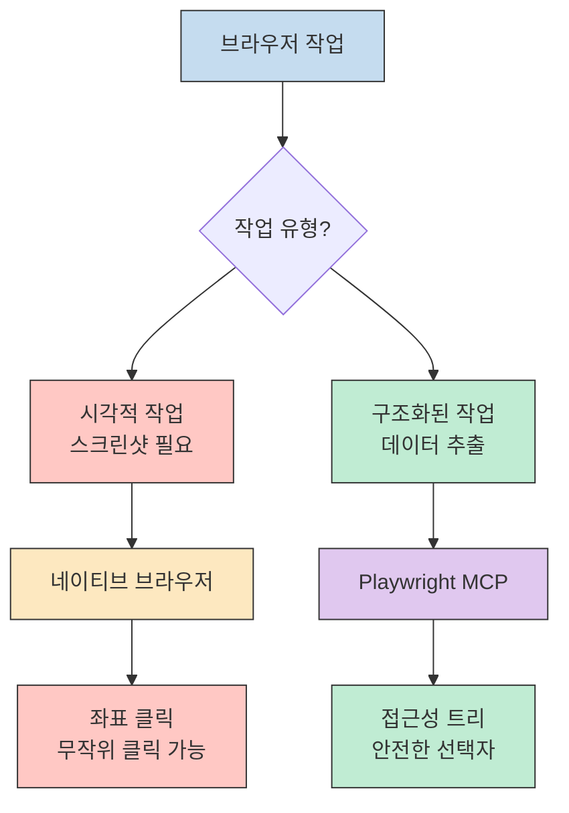
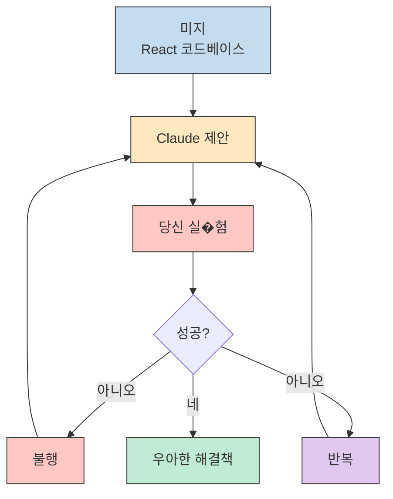
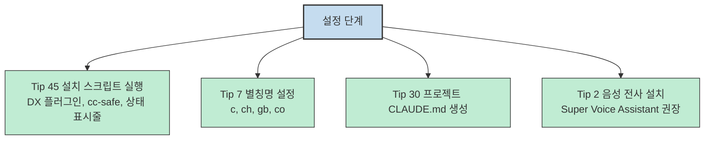

Claude Code는 Anthropic의 공식 CLI 도구로, 개발자들이 AI를 효율적으로 활용할 수 있게 해줍니다. 이 글에서는 ykdojo가 정리한 45가지 꿀팁을 한글로 요약하고, 한국 개발자에게 가장 유익한 부분을 집중적으로 다뤕니다.

이 글의 출처: [ykdojo/claude-code-tips](https://github.com/ykdojo/claude-code-tips)

<!--more-->

## 왜 Claude Code 꿀팁이 중요할까요?

Claude Code는 단순한 AI 챗봇이 아닙습니다. 개발자의 작업 환경에 깊이 통합된 "제2의 뇌"입니다. 꿀팁을 통해 얻을 수 있는 주요 혜택:

- **반복 작업 자동화**: Git 관리, 테스트 실행, 문서 작성 등을 AI가 대처
- **맥락 컨텍스트 관리**: 프로젝트 간 컨텍스트 전달, 대화 이력 검색, 컴팩션
- **언어 독립적**: 한국어/영어 상관없이 모든 꿀팁 적용 가능
- **비용 효율**: 대화 전략을 통해 토큰 사용량 최적화

이제 카테고리별로 꿀팁을 정리해보겠습니다.

## 카테고리 전체 구조

```mermaid
flowchart TD
    Start[Claude Code 꿀팁] --> Setup[기본 설정<br/>6개 꿀팁]
    Start --> Context[컨텍스트 관리<br/>4개 꿀팁]
    Start --> Git[Git & GitHub<br/>4개 꿀팁]
    Start --> Workflow[워크플로우 최적화<br/>5개 꿀팁]
    Start --> Browser[브라우저 연동<br/>4개 꿀팁]
    Start --> Terminal[터미널 효율<br/>3개 꿀팁]
    Start --> Writing[작문 & 문서<br/>3개 꿀팁]
    Start --> Automation[고급 자동화<br/>5개 꿀팁]
    Start --> Testing[테스트 & 검증<br/>3개 꿀팁]
    Start --> Personal[개인화 & 학습<br/>4개 꿀팁]
    Start --> Safety[안전 & 추상화<br/>4개 꿀팁]

    style Start fill:#c5dcef,stroke:#333,stroke-width:2px
    style Setup fill:#c0ecd3,stroke:#333,stroke-width:2px
    style Context fill:#ffc8c4,stroke:#333,stroke-width:2px
    style Git fill:#fde8c0,stroke:#333,stroke-width:2px
    style Workflow fill:#e0c8ef,stroke:#333,stroke-width:2px
    style Browser fill:#c5dcef,stroke:#333,stroke-width:2px
    style Terminal fill:#c0ecd3,stroke:#333,stroke-width:2px
    style Writing fill:#ffc8c4,stroke:#333,stroke-width:2px
    style Automation fill:#fde8c0,stroke:#333,stroke-width:2px
    style Testing fill:#e0c8ef,stroke:#333,stroke-width:2px
    style Personal fill:#c5dcef,stroke:#333,stroke-width:2px
    style Safety fill:#c0ecd3,stroke:#333,stroke-width:2px
```



## 카테고리 1: 기본 설정 & 명령어 (6개 꿀팁)

### 포함된 꿀팁
- **Tip 0**: 상태 표시줄 커스터마이징
- **Tip 1**: 필수 슬래시 명령어 학습
- **Tip 7**: 터미널 별칭명 설정
- **Tip 25**: CLAUDE.md vs 스킬 vs 플러그인 차이
- **Tip 44**: DX 플러그인 설치
- **Tip 45**: 빠른 설정 스크립트

### 가장 유용한 꿀팁

#### 1. Tip 0: 상태 표시줄 (Status Line)

한 줄로 현재 상태를 파악할 수 있습니다:

```bash
# 터미널에서 다음과 같은 정보가 표시됩니다:
# [opus4.5] main [3✓] 14.2k/200k [====== ] 71%
#  모델 | 브랜치 | 수정 중 파일 | 토큰 사용량 | 진도 바
```

**유용한 이유**:
- Git 브랜치와 수정 중 파일 수를 실시간 확인
- 토큰 사용량과 제한을 시각적으로 파악
- 10가지 컬러 테마 지원

#### 2. Tip 1: 필수 슬래시 명령어

```bash
/usage      # 토큰 사용량과 제한 확인
/mcp        # MCP 서버 관리
/stats      # 활동 그래프 보기
/chrome     # 브라우저 자동화 토글
```

#### 3. Tip 7: 터미널 별칭명 설정

```bash
# .zshrc 또는 .bashrc에 추가
alias c='claude'
alias ch='open -a "Google Chrome"'
alias gb='open -a "GitHub Desktop"'
alias co='open -a "Visual Studio Code"'
```

한 글자로 빠르게 접속하여 시간을 절약합니다.

### 한국 개발자에게 필요한 이유

- 상태 표시줄로 Git 상태를 즉시 확인
- 별칭명으로 영어 명령어 입력 시간 감소
- DX 플러그인의 `/dx:gha` 명령어로 GitHub Actions 분석 (오픈 소스 프로젝트에 유용)

---

## 카테고리 2: 컨텍스트 관리 (4개 꿀팁)

### 포함된 꿀팁
- **Tip 5**: AI 컨텍스트는 우유와 같습니다 (신선할 때 최상)
- **Tip 8**: 수동으로 컨텍스트 컴팩션
- **Tip 13**: 대화 이력 검색
- **Tip 23**: 대화 포크/하프-클론

### 가장 유용한 꿀팁

#### 1. Tip 8: 인계인 문서 (HANDOFF.md)

새로운 대화를 시작하기 전에 HANDOFF.md를 만듭니다:

```markdown
# HANDOFF.md

## 목표
페이지네이션 컴포넌트를 개발

## 진행 사항
- 레이아웃 기본 구조 완성
- 스타일링 시스템 구현 중

## 성공한 것들
- CSS Grid 사용으로 레이아웃 구현
- 반응형 디자인 적용

## 실패한 것들
- 이미지 최적화 방법 아직 모름
- 브라우저 호환성 문제 발생

## 다음 단계
1. 이미지 최적화 방법 조사
2. 브라우저 호환성 테스트
```

#### 2. Tip 23: 대화 포크/하프-클론

특정 시점에서 새로운 UUID로 브랜치를 만듭니다. 하프-클론은 후반부만 유지하여 컨텍스트 크기를 줄입니다.

### 한국 개발자에게 필요한 이유

- HANDOFF 패턴으로 영어/한글 컨텍스트 전환 시 매끄름없음
- 하프-클론으로 토큰 사용량 감소 (API 사용자 비용 고려)

---

## 카테고리 3: Git & GitHub 통합 (4개 꿀팁)

### 포함된 꿀팁
- **Tip 4**: Git과 GitHub CLI 전문가처럼 사용하기
- **Tip 16**: Git 워크트리로 병렬 작업
- **Tip 26**: 인터랙티브 PR 리뷰
- **Tip 29**: Claude Code를 DevOps 엔지니어처럼

### 가장 유용한 꿀팁

#### 1. Tip 4: GitHub CLI 마스터리

```bash
# 좋은 패턴
git config --global commit.gpgSign false
gh pr create --draft  # 머저 PR 생성 후 리뷰

# 피해야 할 패턴
git config --global push.default simple  # auto-push 활성화하지 않음
```

**이유**: 자동 커밋과 자동 풀은 유용하지만, 자동 푸시는 위험합니다. 머저 PR로 리뷰 후 머지하는 것이 안전합니다.

#### 2. Tip 16: Git 워크트리

```bash
# 같은 리포지터리의 다른 브랜치를 다른 디렉토리에서 작업
git worktree add -b feature-new ../workspace-feature-new
git worktree add -b hotfix ../workspace-hotfix

# 각 워크트리에서 별렬로 작업 가능
cd ../workspace-feature-new
# 작업...

cd ../workspace-hotfix
# 핫픽스 작업...
```

#### 3. Tip 29: GitHub Actions 분석

```bash
# CI 실패 원인 자동 조사
/dx:gha https://github.com/user/repo/actions/runs/12345

# 다음을 자동으로 수행:
# - 실패한 커밋 확인
# - 플래키 패턴 감지
# - 깨진 커밋 식별
```

### 한국 개발자에게 필요한 이유

- GitHub Actions 디버깅은 언어에 관계없이 보편적
- 인터랙티브 PR 리뷰는 언어 상관없이 효율적
- 워크트리로 같은 코드베이스에서 병렬 개발 가능 (팀 프로젝트에서 흔함)

---

## 카테고리 4: 워크플로우 최적화 (5개 꿀팁)

### 포함된 꿀팁
- **Tip 3**: 큰 문제를 작은 문제로 분할
- **Tip 9**: 자율 작업을 위한 작성-테스트 사이클
- **Tip 17**: 장기 작업에 대한 수동 지수적 백오프
- **Tip 39**: 계획을 세우고 빠르게 프로토타입
- **Tip 41**: 자동화의 자동화

### 가장 유용한 꿀팁

#### 1. Tip 3: 문제 분할 (Problem Breakdown)

대신 A→B, 다음 A→A1→A2→A3→B로 나눕니다.



**예시**: "로그인 기능 구현" 대신
1. 사용자 모델 생성
2. 데이터베이스 스키마 설계
3. API 엔드포인트 생성
4. 프론트엔드 인터페이스 개발
5. 테스트

#### 2. Tip 9: 작성-테스트 사이클

자율 작업(예: `git bisect`)에 필수적입니다.

```bash
# tmux 패턴
tmux new-session -s git-bisect

# 1. 테스트 작성
# 2. 테스트 실행
git bisect start bad good
git bisect run npm test

# 3. 결과 확인
# 4. 다음 단계 반복
```

#### 3. Tip 17: 지수적 백오프 (Exponential Backoff)

장기 작업 상태를 체크할 때, 간격을 증가시켜 토큰를 절약:

```bash
# 나쁜 패턴 (비효율)
while ! job_complete; do
    sleep 30
done

# 좋은 패턴 (지수적 백오프)
intervals=(60 120 240 480)  # 1분, 2분, 4분, 8분
for interval in "${intervals[@]}"; do
    if job_complete; then break; fi
    sleep $interval
done
```

### 한국 개발자에게 필요한 이유

- 문제 분할(Tip 3)은 프로그래밍 언어나 자연어 상관없이 작동
- 작성-테스트 사이클(Tip 9)은 모든 개발 워크플로우에 필수
- 자동화 마인드셋(Tip 41)은 생산성 향상에 보편적 적용

---

## 카테고리 5: 브라우저 연동 & 연구 (4개 꿀팁)

### 포함된 꿀팁
- **Tip 9**: 자율 작업을 위한 작성-테스트 사이클 (Playwright 포함)
- **Tip 11**: 차단된 사이트에 Gemini CLI 폴백
- **Tip 27**: Claude Code를 연구 도구로 사용
- **Tip 10**: Cmd+A와 Ctrl+A는 친구

### 가장 유용한 꿀팁

#### 1. Tip 9: Playwright MCP

Playwright MCP는 접근성 트리(구조화된 데이터)를 중심으로, 스크린샷은 좌표를 사용합니다.



**권장**: 시각적 작업이 아니면 Playwright를 선호하세요.

#### 2. Tip 11: Reddit을 통한 Gemini CLI

```bash
# 차단된 사이트에 접속하기 위한 스킬 패턴
# Gemini CLI로 Reddit에서 데이터 가져오기
gemini "https://www.reddit.com/r/programming"
```

### 한국 개발자에게 필요한 이유

- 연구 능력(Tip 27)은 언어 상관없이 작동(한글/영어 문서 등)
- Cmd+A(Tip 10)는 언어별 복사-붙이넣기 문제 우회
- Gemini CLI 폴백(Tip 11)으로 전 세계 웹 콘텐츠 접속

---

## 카테고리 6: 터미널 효율 (3개 꿀팁)

### 포함된 꿀팁
- **Tip 6**: 터미널 출력을 내보내기
- **Tip 10**: Cmd+A와 Ctrl+A는 친구
- **Tip 24**: realpath로 절대 경로 얻기
- **Tip 38**: 입력 박스 박스와 편집

### 가장 유용한 꿀팁

#### 1. Tip 6: 터미널 출력

```bash
# 방법 1: /copy 명령어
/copy

# 방법 2: pbcopy (macOS)
echo "텍스트" | pbcopy

# 방법 3: 파일에 쓰고 편집기로 열기
cat output.txt > /tmp/result.txt
code /tmp/result.txt

# 방법 4: URL을 브라우저에서 열기
echo "https://example.com" | xargs open
```

#### 2. Tip 38: 입력 박스 단축

```bash
Ctrl+A    # 라인 시작으로 이동
Ctrl+E    # 라인 끝으로 이동
Option+Left # 단어 앞으로 이동
Option+Right # 단어 뒤로 이동
Ctrl+W/C/K/U/L # 단어 삭제
Ctrl+G     # 외부 편집기로 열기
+Enter     # 새 줄 삽입
Ctrl+V     # 이미지 붙이넣기
```

### 한국 개발자에게 필요한 이유

- 터미널 단축(Tip 38)은 언어 설정 상관없이 작동
- 복사-붙이넣기 패턴(Tips 6, 10)은 인코딩/클립보드 문제 회피
- realpath(Tip 24)은 한글이 포함된 경로에 유용

---

## 카테고리 7: 작문 & 문서 (3개 꿀팁)

### 포함된 꿀팁
- **Tip 18**: Claude Code를 작문 도구로 사용
- **Tip 19**: Markdown이 최고
- **Tip 30**: CLAUDE.md를 간단하게 유지하고 정기적 검토
- **Tip 20**: Notion을 사용하여 링크 보존

### 가장 유용한 꿀팁

#### 1. Tip 18: 작문 워크플로우

1. 컨텍스트 제공
2. 음성으로 지시사항 전달
3. 줄별로 반복: "좋아요, 같이 봅시다"
4. 좌우 분할: 터미널 왼쪽, 편집기 오른쪽

#### 2. Tip 19: Markdown 선호

```bash
# 가장 효율적인 형식
# 1. Markdown으로 작성
# 2. 필요하면 플랫폼으로 변환

# 복사가 어려울 때
# Notion → 복사 → 붙이넣기
```

### 한국 개발자에게 필요한 이유

- 작문 도구(Tip 18)는 한글 콘텐츠 작성에 유용
- Markdown 워크플로우(Tip 19)는 플랫폼 간 서식 보존
- Notion 링크 보존(Tip 20)은 붙이넣기 시 링크 깨짐 방지

---

## 카테고리 8: 고급 자동화 (5개 꿀팁)

### 포함된 꿀팁
- **Tip 2**: 음성으로 Claude Code와 대화
- **Tip 21**: 장기 위험 작업에 컨테이너 사용
- **Tip 22**: Claude Code를 더 잘 쓰는 법 = 써보는 법
- **Tip 34**: 많은 테스트를 작성하고 TDD 사용
- **Tip 37**: 개인화된 소프트웨어 시대가 왔습니다

### 가장 유용한 꿀팁

#### 1. Tip 21: 컨테이너

```bash
# 위험/실험적 작업에 대해
docker run --rm -it \
  --dangerously-skip-permissions \
  -v $(pwd):/workspace \
  your-image

# SafeClaw로 격리된 세션 관리
```

#### 2. Tip 2: 음성 입력

```bash
# 지역 음성 전사 (지원되는 옵션)
# - Superwhisper, MacWhisper, Super Voice Assistant

# 이어폰(earbuds)을 통한 Whisper
```

### 한국 개발자에게 필요한 이유

- 음성 입력(Tip 2)은 언어 상관없이 작동
- 개인화된 도구(Tip 37)는 한글 특화 워크플로우에 맞춤 제작 가능
- TDD(Tip 34)는 언어 상관없이 보편적 적용

---

## 카테고리 9: 테스트 & 검증 (3개 꿀팁)

### 포함된 꿀팁
- **Tip 9**: 자율 작업을 위한 작성-테스트 사이클
- **Tip 28**: 출력 검증 방법 마스터하기
- **Tip 36**: 백그라운드에서 bash 명령과 서브에이전트 실행

### 가장 유용한 꿀팁

#### 1. Tip 28: 검증 방법

1. 테스트를 작성하고 좋게 보이는지 확인
2. 시각적 Git 클라이어트 사용(GitHub Desktop)
3. Claude Code 스스로 검증 요청("모든 것을 이중 체크하세요")

#### 2. Tip 36: 백그라운드 실행

```bash
# 장기 실행 명령을 백그라운드로 이동
Ctrl+B

# BashOutput로 나중에 확인
```

### 한국 개발자에게 필요한 이유

- 테스트 전략(Tips 9, 28)은 언어 독립적
- 백그라운드/서브에이전트 패턴(Tip 36)은 보편적 적용
- 검증 방법은 주요 언어 상관없이 모든 코드베이스에 작동

---

## 카테고리 10: 개인화 & 학습 (4개 꿀팁)

### 포함된 꿀팁
- **Tip 12**: 본인 워크플로우에 투자
- **Tip 22**: Claude Code를 더 잘 쓰는 법 = 써보는 법
- **Tip 33**: 승인된 명령어 감사
- **Tip 42**: 지식을 공유하고 기여할 수 있는 곳에 기여
- **Tip 43**: 계속 학습하세요!

### 가장 유용한 꿀팁

#### 1. Tip 22: 10억 토큰 규칙 (Billion Token Rule)

"10,000 시간 규칙" 대신 "10억 토큰 규칙"으로 대체하세요. 많은 토큰을 소비하여 AI 직관을 키우세요. Opus 4.5로는 여러 세션을 돌리기에 충분히 저렴합니다.

#### 2. Tip 12: 워크플로우 투자

```bash
# 개인화된 도구 제작
# - 음성 전사 앱
# - 상태 표시줄 스크립트
# - 시스템 프롬프트 최적화
```

### 한국 개발자에게 필요한 이유

- 10억 토큰 규칙(Tip 22)은 모든 언어 사용자에게 보편적
- 지식 공유(Tip 42)는 한글 말하는 사용자를 포함한 전 세계 커뮤니티에 혜택
- 감사 도구(Tip 33)는 우발적 데이터 손실 방지(언어 독립적 위험)

---

## 카테고리 11: 안전 & 추상화 (4개 꿀팁)

### 포함된 꿀팁
- **Tip 33**: 승인된 명령어 감사
- **Tip 35**: 미지를 두려워하지 마세요; 반복적 문제 해결
- **Tip 31**: Claude Code를 보편적 인터페이스로
- **Tip 32**: 올바른 추상화 레벨 선택은 모든 것입니다

### 가장 유용한 꿀팁

#### 1. Tip 33: 명령어 안전

```bash
# cc-safe는 위험 패턴 검지
cc-safe ~/projects

# 또는
npx cc-safe

# 감지되는 패턴:
# - rm -rf
# - sudo
# - git reset --hard
# - docker run --privileged
```

#### 2. Tip 35: 대담한 문제 해결

React 전문가가 아니어도 React 코드베이스를 파헤치는 예시:



#### 3. Tip 32: 추상화 레벨

이진법이 아닙니다. 일회성 프로젝트에는 바이브 코딩도 괜찮습니다. 다른 때는 깊이 파헤칩니다(파일 구조, 함수, 라인).

**빙산화 은유**: 상단을 날아다니, 필요할 때 깊이 다이빅니다.

### 한국 개발자에게 필요한 이유

- 대담한 문제 해결(Tip 35)은 기술적 전문가나 언어 상관없이 작동
- 보편적 인터페이스 개념(Tip 31)은 모든 로컬 작업에 적용
- 추상화 스펙트럼(Tip 32)은 과잉 고민과 부족한 고민 사이 균형 유지

---

## 한국 개발자를 위한 상위 15개 꿀팁

| 순위 | 꿀팁 | 카테고리 | 중요성 |
|------|-----|----------|---------|
| 1 | Tip 0: 커스텀 상태 표시줄 | 기본 설정 | 한 줄로 Git 브랜치 + 토큰 사용량 표시 |
| 2 | Tip 7: 터미널 별칭명 | 기본 설정 | `c`, `ch`, `gb`, `co` 단축으로 막대한 시간 절약 |
| 3 | Tip 3: 문제 분할 | 워크플로우 최적화 | 보편적 디버깅 전략, 언어 독립적 |
| 4 | Tip 22: 10억 토큰 규칙 | 개인화 & 학습 | AI 학습 최고의 법 - 토큰을 소비하고 비용을 걱정하지 마세요 |
| 5 | Tip 16: Git 워크트리 | Git & GitHub | 다른 디렉토리에서 병렬 브랜치 작업 |
| 6 | Tip 8: 인계인 문서 | 컨텍스트 관리 | 대화 간 컨텍스트 연속성 |
| 7 | Tip 1: 필수 슬래시 명령어 | 기본 설정 | `/usage`, `/mcp`, `/stats`로 모니터링 |
| 8 | Tip 9: 작성-테스트 사이클 | 워크플로우 최적화 | `git bisect` 같은 자율 작업에 필수 |
| 9 | Tip 34: TDD 워크플로우 | 고급 자동화 | 실패하는 테스트 먼저 작성 → 커밋 → 구현 |
| 10 | Tip 2: 음성 입력 | 고급 자동화 | 타이핑보다 빠르고, 오타에도 작동 |
| 11 | Tip 29: GitHub Actions `/dx:gha` | Git & GitHub | CI 실패 자동 조사 |
| 12 | Tip 19: Markdown 선호 워크플로우 | 작문 & 문서 | 보편적 형식, 모든 플랫폼으로 변환 가능 |
| 13 | Tip 21: 위험 작업에 컨테이너 | 고급 자동화 | `--dangerously-skip-permissions`로 안전 실험 |
| 14 | Tip 30: CLAUDE.md 위생 | 작문 & 문서 | 팽창 방지, 지시사항 현재 유지 |
| 15 | Tip 10: Cmd+A/Ctrl+A 패턴 | 터미널 효율 | AI 접근 문제를 보편적으로 우회 |

---

## 한국 개발자를 위한 핵심 패턴

### 1. 언어 독립적 기법

대부분 꿀팁은 한글/영어 콘텐츠 상관없이 작동합니다:
- 문제 분할 (Tip 3)
- Git 워크플로우 (Tips 4, 16, 26, 29)
- 테스트 전략 (Tips 9, 28, 34)
- 브라우저 자동화 (Tips 9, 11)
- 터미널 단축 (Tips 38, 24)

### 2. 컨텍스트 관리

언어 전환 시 중요합니다:
- 인계인 문서 (Tip 8)
- 신선한 대화 (Tip 5)
- 포크/하프-클론 (Tip 23)
- 컨텍스트 컴팩션 (Tip 8)

### 3. 연구 & 문서화
- 보편적 연구 능력 (Tip 27)
- Markdown 워크플로우 (Tips 19, 20)
- CLAUDE.md 위생 (Tip 30)

### 4. 안전 우선
- 명령어 감사 (Tip 33)
- 컨테이너 격리 (Tip 21)
- 승인된 명령어 검토

---

## 추천 시작 경로

### 1단계: 설정 (1주차)



1. Tip 45 설치 스크립트 실행 → DX 플러그인, cc-safe, 상태 표시줄 설치
2. 별칭명 설정 (Tip 7): `c`, `ch`, `gb`, `co`
3. 프로젝트 수준 CLAUDE.md 생성 (Tip 30)
4. 음성 전사 설치 (Tip 2): Super Voice Assistant 권장

### 2단계: 핵심 워크플로우 (2-3주차)

1. Cmd+A/Ctrl+A 패턴 연습 (Tip 10)
2. `/usage`로 토큰 모니터링 (Tip 1)
3. 인계인 문서 사용 시작 (Tip 8)
4. 공통 작업에 음성 입력 시도 (Tip 2)

### 3단계: 고급 기법 (4주차 이상)

1. Git 워크트리 실� (Tip 16)
2. 문제 분할 연습 (Tip 3)
3. GitHub Actions `/dx:gha` 학습 (Tip 29)
4. TDD 워크플로우 시도 (Tip 34)

### 4단계: 숙련 (지속)

1. "10억 토큰" 소비 (Tip 22)
2. 지식 공유 (Tip 42)
3. 커뮤니티에서 계속 학습 (Tip 43)
4. 승인된 명령어 정기적 감사 (Tip 33)

---

## 기술 용어 한글 번역

| 영어 용어 | 한글 문맥 |
|--------------|-----------|
| Status line | 상태 표시줄 (git 브랜치, 토큰 사용량 등 표시) |
| Slash commands | 슬래시 명령어 (`/usage`, `/mcp` 등) |
| Context window | 컨텍스트 윈도우 (Opus 4.5의 경우 200k 토큰) |
| Git worktree | Git 워크트리 (다른 디렉토리에서 병렬 작업) |
| Handoff document | 인계인 문서 (대화 간 컨텍스트 전달) |
| Exponential backoff | 지수적 백오프 (1분, 2분, 4분... 체크) |
| Vibe coding | 바이브 코딩 (직감으로 코딩) |
| TDD | 테스트 주도 개발 (실패하는 테스트 먼저 작성) |
| Draft PR | 초안 PR (머지 전 리뷰) |
| Containerized | 컨테이너화된 (격리된 환경) |
| Auto-compact | 자동 컴팩션 (컨텍스트 자동 요약) |
| Fork/clone | 포크/클론 (대화 복제) |
| MCP | Model Context Protocol |
| Lazy-load | 지연 로딩 (필요할 때만 로드) |
| Attribution | 저작권 표시 (Co-Authored-By 등) |

---

## 결론

모든 45가지 꿀팁은 실용적이며 한국 개발자에게 적용 가능합니다. 핵심 테마:

1. **설정 투자** - 초기 설정에 투자한 시간이 배당금을 지불합니다 (Tips 0, 7, 45)
2. **컨텍스트 위생** - 대화 길이와 연속성 관리 (Tips 5, 8, 23)
3. **보편적 패턴** - 언어나 도메인 상관없이 작동하는 기법 (Tips 3, 10, 22)
4. **안전 우선** - 감사와 컨테이너를 통한 실수 방지 (Tips 21, 33)
5. **커뮤니티 참여** - 에코시스템에서 학습과 기여 (Tips 42, 43)

이 꿀팁들은 기본 설정부터 고급 자동화까지 발전하며, 스킬 개발을 위한 명확한 경로를 제공합니다. 한글 개발자로서 이 꿀팁을 적극적으로 적용하여 생산성을 향상하고 AI와 협업하는 법을 익혀보세요!
