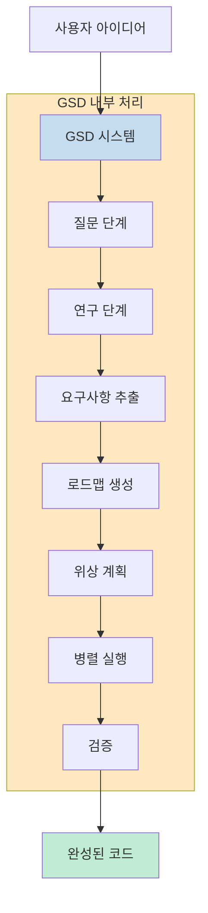
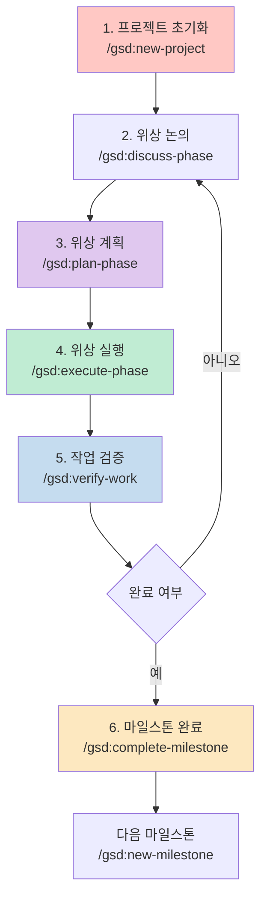
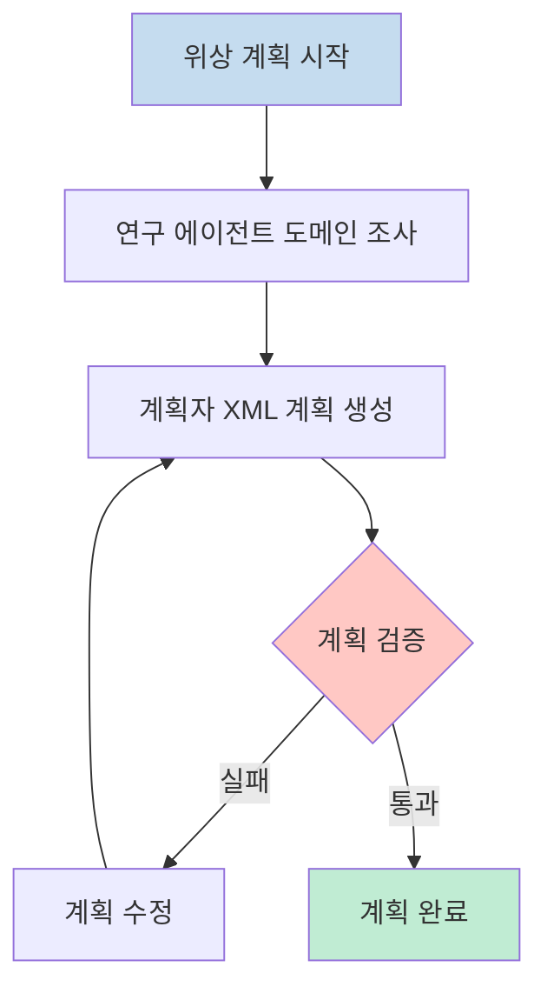
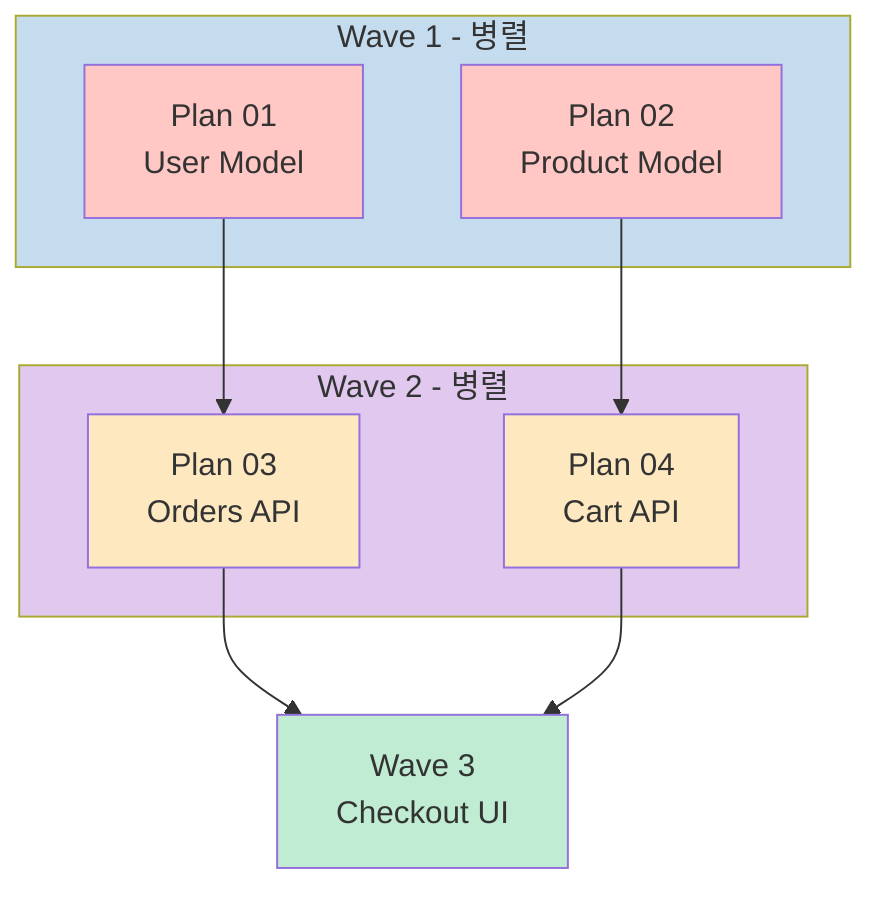
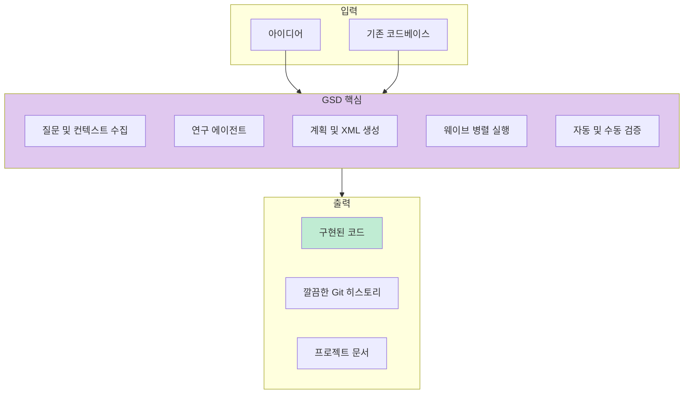

GSD(Get Shit Done)는 AI 기반 코드 개발의 신뢰성을 높이기 위해 설계된 메타 프롬프팅, 컨텍스트 엔지니어링, 스펙 기반 개발 시스템입니다. 클로드 코드를 주축으로 하며, OpenCode, Gemini CLI, Codex 등 다양한 AI 코드 어시스턴트를 지원합니다.

<!--more-->

## Sources

- [GitHub - gsd-build/get-shit-done](https://github.com/gsd-build/get-shit-done)

## 컨텍스트 로트 문제 해결

AI 코드 개발에서 흔히 발생하는 문제 중 하나는 **컨텍스트 로트(Context Rot)** 입니다. 대화가 길어질수록 AI의 맥락 윈도우가 채워지면서 품질이 저하되는 현상입니다. 사용자가 원하는 대로 코드가 생성되지 않고, 불일치한 결과물이 나오는 문제가 발생합니다.

GSD는 이 문제를 시스템 레벨에서 해결합니다. 복잡성은 시스템 내부에 숨기고, 사용자에게는 간단한 몇 가지 명령어만 제공합니다.



## 설치 방법

GSD는 npm을 통해 설치할 수 있습니다.

```bash
npx get-shit-done-cc@latest
```

설치 시 선택 가능한 옵션:

1. **런타임** — Claude Code, OpenCode, Gemini, Codex, 또는 전체
2. **위치** — 전체(모든 프로젝트) 또는 로컬(현재 프로젝트만)

비대화형 설치가 필요한 경우 Docker, CI, 스크립트에서 다음과 같이 사용합니다:

```bash
# Claude Code
npx get-shit-done-cc --claude --global   # ~/.claude/에 설치
npx get-shit-done-cc --claude --local    # ./.claude/에 설치

# OpenCode
npx get-shit-done-cc --opencode --global

# Gemini CLI
npx get-shit-done-cc --gemini --global

# Codex
npx get-shit-done-cc --codex --global
npx get-shit-done-cc --codex --local

# 모든 런타임
npx get-shit-done-cc --all --global
```

### 권장 설정

GSD는 마찰 없는 자동화를 위해 설계되었습니다. 클로드 코드를 다음 플래그와 함께 실행하는 것을 권장합니다:

```bash
claude --dangerously-skip-permissions
```

이 플래그를 사용하지 않으려면 프로젝트의 `.claude/settings.json`에 세분화된 권한 설정을 추가할 수 있습니다:

```json
{
  "permissions": {
    "allow": [
      "Bash(date:*)",
      "Bash(echo:*)",
      "Bash(cat:*)",
      "Bash(ls:*)",
      "Bash(mkdir:*)",
      "Bash(wc:*)",
      "Bash(head:*)",
      "Bash(tail:*)",
      "Bash(sort:*)",
      "Bash(grep:*)",
      "Bash(tr:*)",
      "Bash(git add:*)",
      "Bash(git commit:*)",
      "Bash(git status:*)",
      "Bash(git log:*)",
      "Bash(git diff:*)",
      "Bash(git tag:*)"
    ]
  }
}
```

## 핵심 워크플로우

GSD의 개발 워크플로우는 6단계로 구성됩니다.



### 1. 프로젝트 초기화

```bash
/gsd:new-project
```

하나의 명령어로 완전한 흐름이 실행됩니다:

1. **질문** — 아이디어를 완전히 이해할 때까지 질문합니다 (목표, 제약사항, 기술 선호도, 예외 케이스)
2. **연구** — 도메인을 조사하는 병렬 에이전트를 생성합니다 (선택 사항이지만 권장)
3. **요구사항** — v1, v2, 범위 밖 내용을 추출합니다
4. **로드맵** — 요구사항에 매핑된 위상을 생성합니다

생성되는 파일: `PROJECT.md`, `REQUIREMENTS.md`, `ROADMAP.md`, `STATE.md`, `.planning/research/`

### 2. 위상 논의

```bash
/gsd:discuss-phase 1
```

이 단계는 구현 전 사용자의 의도를 구체화하는 과정입니다.

시스템이 위상을 분석하고 빈 영역을 식별합니다:

* **시각적 기능** → 레이아웃, 밀도, 상호작용, 빈 상태
* **API/CLI** → 응답 형식, 플래그, 오류 처리, 상세 수준
* **콘텐츠 시스템** → 구조, 톤, 깊이, 흐름
* **조직 작업** → 그룹화 기준, 명명, 중복, 예외

선택한 각 영역에 대해 만족할 때까지 질문합니다. 출력물인 `CONTEXT.md`는 다음 두 단계에 직접 사용됩니다:

1. **연구자가 읽음** — 조사할 패턴을 알 수 있음
2. **계획자가 읽음** — 결정된 사항을 알 수 있음

생성되는 파일: `{phase_num}-CONTEXT.md`

### 3. 위상 계획

```bash
/gsd:plan-phase 1
```

시스템은 다음을 수행합니다:

1. **연구** — CONTEXT.md 결정에 따라 구현 방법을 조사합니다
2. **계획** — XML 구조로 2-3개의 원자적 작업 계획을 생성합니다
3. **검증** — 계획이 요구사항을 충족하는지 확인하고 통과할 때까지 반복합니다

각 계획은 새로운 컨텍스트 윈도우에서 실행할 수 있을 만큼 작습니다.



생성되는 파일: `{phase_num}-RESEARCH.md`, `{phase_num}-{N}-PLAN.md`

### 4. 위상 실행

```bash
/gsd:execute-phase 1
```

시스템은 다음을 수행합니다:

1. **웨이브로 계획 실행** — 가능한 경우 병렬, 의존성 있는 경우 순차적
2. **계획별 새 컨텍스트** — 구현용 순수 200k 토큰, 누적된 가비지 없음
3. **작업별 커밋** — 각 작업이 자체 원자적 커밋을 가짐
4. **목표대로 검증** — 코드베이스가 위상 약속을 전달하는지 확인

#### 웨이브 실행

계획은 의존성에 따라 "웨이브"로 그룹화됩니다. 각 웨이브 내에서 계획은 병렬로 실행됩니다. 웨이브는 순차적으로 실행됩니다.



웨이브의 중요성:

* 독립적 계획 → 동일 웨이브 → 병렬 실행
* 의존적 계획 → 후속 웨이브 → 의존성 대기
* 파일 충돌 → 순차적 계획 또는 동일 계획

"수직 슬라이스"가 "수평 계층"보다 더 잘 병렬화되는 이유입니다.

생성되는 파일: `{phase_num}-{N}-SUMMARY.md`, `{phase_num}-VERIFICATION.md`

### 5. 작업 검증

```bash
/gsd:verify-work 1
```

이 단계는 실제로 작동하는지 확인하는 과정입니다.

자동화된 검증은 코드가 존재하고 테스트가 통과하는지 확인합니다. 하지만 기능이 사용자가 예상한 대로 작동하는지 확인할 수는 없습니다. 이 단계가 바로 그 역할을 합니다.

시스템은 다음을 수행합니다:

1. **테스트 가능한 산출물 추출** — 이제 할 수 있어야 하는 것들
2. **하나씩 안내** — "이메일로 로그인할 수 있나요?" 예/아니오, 또는 문제 설명
3. **실패 자동 진단** — 원인을 찾는 디버그 에이전트 생성
4. **검증된 수정 계획 생성** — 즉시 재실행 준비

모든 것이 통과하면 진행합니다. 문제가 있으면 직접 디버그할 필요 없이 `/gsd:execute-phase`를 다시 실행하기만 하면 됩니다.

생성되는 파일: `{phase_num}-UAT.md`, 문제 발견 시 수정 계획

### 6. 반복 → 완료 → 다음 마일스톤

```bash
/gsd:discuss-phase 2
/gsd:plan-phase 2
/gsd:execute-phase 2
/gsd:verify-work 2
...
/gsd:complete-milestone
/gsd:new-milestone
```

**논의 → 계획 → 실행 → 검증** 루프를 마일스톤이 완료될 때까지 반복합니다.

논의 단계에서 더 빠른 입력을 원하면 `/gsd:discuss-phase <n> --batch`를 사용하여 하나씩 대답하는 대신 작은 그룹화된 질문 세트에 한 번에 답할 수 있습니다.

각 위상은 사용자 입력(논의), 적절한 연구(계획), 깨끗한 실행(실행), 인간 검증(검증)을 받습니다. 컨텍스트는 항상 신선하게 유지되고, 품질은 높게 유지됩니다.

모든 위상이 완료되면 `/gsd:complete-milestone`은 마일스톤을 보관하고 릴리스를 태그합니다.

그런 다음 `/gsd:new-milestone`은 다음 버전을 시작합니다 — `new-project`와 동일한 흐름이지만 기존 코드베이스용입니다. 다음에 무엇을 구축할지 설명하면 시스템이 도메인을 연구하고, 요구사항을 범위로 지정하며, 새로운 로드맵을 생성합니다. 각 마일스톤은 깨끗한 사이클입니다: 정의 → 구축 → 배포.

## 퀵 모드

```bash
/gsd:quick
```

전체 계획이 필요하지 않은 ad-hoc 작업용입니다.

퀵 모드는 더 빠른 경로로 GSD 보장(원자적 커밋, 상태 추적)을 제공합니다:

* **동일한 에이전트** — 계획자 + 실행자, 동일한 품질
* **선택적 단계 건너뛰기** — 연구 없음, 계획 검사자 없음, 검증자 없음
* **별도 추적** — 위상이 아닌 `.planning/quick/`에 존재

버그 수정, 작은 기능, 구성 변경, 일회성 작업에 사용합니다.

생성되는 파일: `.planning/quick/001-add-dark-mode-toggle/PLAN.md`, `SUMMARY.md`

## 왜 GSD가 효과적인가

### 컨텍스트 엔지니어링

클로드 코드는 필요한 컨텍스트를 제공하면 매우 강력합니다. 대부분의 사람들은 그렇게 하지 않습니다.

GSD가 이를 처리합니다:

| 파일 | 역할 |
| --- | --- |
| `PROJECT.md` | 프로젝트 비전, 항상 로드됨 |
| `research/` | 생태계 지식 (스택, 기능, 아키텍처, 함정) |
| `REQUIREMENTS.md` | 위상 추적 가능성이 있는 범위 지정된 v1/v2 요구사항 |
| `ROADMAP.md` | 가는 곳, 완료된 것 |
| `STATE.md` | 결정, 차단사항, 위치 — 세션 간 메모리 |
| `PLAN.md` | XML 구조의 원자적 작업, 검증 단계 |
| `SUMMARY.md` | 무슨 일이 일어났는지, 무엇이 변했는지, 기록에 커밋됨 |
| `todos/` | 나중 작업을 위한 아이디어 및 작업 캡처 |

크기 제한은 클로드의 품질이 저하되는 지점을 기준으로 합니다. 제한 내에 유지하면 일관된 우수성을 얻을 수 있습니다.

### XML 프롬프트 포맷팅

모든 계획은 클로드에 최적화된 구조화된 XML입니다:

```xml
<task type="auto">
  <name>Create login endpoint</name>
  <files>src/app/api/auth/login/route.ts</files>
  <action>
    Use jose for JWT (not jsonwebtoken - CommonJS issues).
    Validate credentials against users table.
    Return httpOnly cookie on success.
  </action>
  <verify>curl -X POST localhost:3000/api/auth/login returns 200 + Set-Cookie</verify>
  <done>Valid credentials return cookie, invalid return 401</done>
</task>
```

정확한 지침입니다. 추측이 없습니다. 검증이 내장되어 있습니다.

### 다중 에이전트 오케스트레이션

모든 단계는 동일한 패턴을 사용합니다: 얇은 오케스트레이터가 전문화된 에이전트를 생성하고, 결과를 수집하며, 다음 단계로 라우팅합니다.

| 단계 | 오케스트레이터 역할 | 에이전트 역할 |
| --- | --- | --- |
| 연구 | 조정, 발견 사항 제시 | 4개 병렬 연구자가 스택, 기능, 아키텍처, 함정 조사 |
| 계획 | 검증, 반복 관리 | 계획자가 계획 생성, 검사자가 검증, 통과할 때까지 루프 |
| 실행 | 웨이브 그룹화, 진행 추적 | 실행자가 병렬로 구현, 각각 신선한 200k 컨텍스트 |
| 검증 | 결과 제시, 다음 라우팅 | 검증자가 목표대로 코드베이스 확인, 디버거가 실패 원인 진단 |

오케스트레이터는 무거운 작업을 수행하지 않습니다. 에이전트를 생성하고, 기다리고, 결과를 통합합니다.

### 원자적 Git 커밋

각 작업은 완료 후 즉시 자체 커밋을 받습니다:

```
abc123f docs(08-02): complete user registration plan
def456g feat(08-02): add email confirmation flow
hij789k feat(08-02): implement password hashing
lmn012o feat(08-02): create registration endpoint
```

**장점:** Git bisect이 정확한 실패 작업을 찾습니다. 각 작업은 독립적으로 되돌릴 수 있습니다. 미래 세션의 클로드를 위한 명확한 기록입니다. AI 자동화 워크플로우에서 더 나은 관찰 가능성.

모든 커밋은 정밀하고, 추적 가능하며, 의미 있습니다.

## 설정 및 구성

GSD는 `.planning/config.json`에 프로젝트 설정을 저장합니다. `/gsd:new-project` 중에 구성하거나 나중에 `/gsd:settings`로 업데이트합니다.

### 핵심 설정

| 설정 | 옵션 | 기본값 | 제어 대상 |
| --- | --- | --- | --- |
| `mode` | `yolo`, `interactive` | `interactive` | 자동 승인 vs 각 단계에서 확인 |
| `granularity` | `coarse`, `standard`, `fine` | `standard` | 위상 세분성 — 범위가 얼마나 정교하게 분할되는지 (위상 × 계획) |

### 모델 프로필

각 에이전트가 사용하는 클로드 모델을 제어합니다. 품질과 토큰 소비의 균형을 맞춥니다.

| 프로필 | 계획 | 실행 | 검증 |
| --- | --- | --- | --- |
| `quality` | Opus | Opus | Sonnet |
| `balanced` (기본) | Opus | Sonnet | Sonnet |
| `budget` | Sonnet | Sonnet | Haiku |

프로필 전환:

```bash
/gsd:set-profile budget
```

### 워크플로우 에이전트

이들은 계획/실행 중에 추가 에이전트를 생성합니다. 품질을 높이지만 토큰과 시간을 추가합니다.

| 설정 | 기본값 | 역할 |
| --- | --- | --- |
| `workflow.research` | `true` | 각 위상 계획 전 도메인 연구 |
| `workflow.plan_check` | `true` | 실행 전 계획이 위상 목표를 달성하는지 검증 |
| `workflow.verifier` | `true` | 실행 후 필수 항목이 전달되었는지 확인 |
| `workflow.auto_advance` | `false` | 논의 → 계획 → 실행을 중단 없이 자동 연결 |

### Git 분기 전략

실행 중 GSD가 분기를 처리하는 방법을 제어합니다.

| 설정 | 옵션 | 기본값 | 역할 |
| --- | --- | --- | --- |
| `git.branching_strategy` | `none`, `phase`, `milestone` | `none` | 분기 생성 전략 |
| `git.phase_branch_template` | 문자열 | `gsd/phase-{phase}-{slug}` | 위상 분기용 템플릿 |
| `git.milestone_branch_template` | 문자열 | `gsd/{milestone}-{slug}` | 마일스톤 분기용 템플릿 |

**전략:**

* **`none`** — 현재 분기에 커밋 (기본 GSD 동작)
* **`phase`** — 위상당 분기 생성, 위상 완료 시 병합
* **`milestone`** — 전체 마일스톤용 하나의 분기 생성, 완료 시 병합

## 주요 명령어

### 핵심 워크플로우

| 명령어 | 역할 |
| --- | --- |
| `/gsd:new-project [--auto]` | 전체 초기화: 질문 → 연구 → 요구사항 → 로드맵 |
| `/gsd:discuss-phase [N] [--auto]` | 계획 전 구현 결정 캡처 |
| `/gsd:plan-phase [N] [--auto]` | 위상용 연구 + 계획 + 검증 |
| `/gsd:execute-phase <N>` | 모든 계획을 병렬 웨이브로 실행, 완료 시 검증 |
| `/gsd:verify-work [N]` | 수동 사용자 수락 테스트 |
| `/gsd:audit-milestone` | 마일스톤이 완료 정의를 달성했는지 확인 |
| `/gsd:complete-milestone` | 마일스톤 보관, 릴리스 태그 |
| `/gsd:new-milestone [name]` | 다음 버전 시작: 질문 → 연구 → 요구사항 → 로드맵 |

### 브라운필드

| 명령어 | 역할 |
| --- | --- |
| `/gsd:map-codebase` | new-project 전 기존 코드베이스 분석 |

### 위상 관리

| 명령어 | 역할 |
| --- | --- |
| `/gsd:add-phase` | 로드맵에 위상 추가 |
| `/gsd:insert-phase [N]` | 위상 사이에 긴급 작업 삽입 |
| `/gsd:remove-phase [N]` | 미래 위상 삭제, 재번호 매기기 |
| `/gsd:list-phase-assumptions [N]` | 계획 전 클로드의 의도된 접근 방식 확인 |
| `/gsd:plan-milestone-gaps` | 감사 결과 갭을 닫는 위상 생성 |

### 유틸리티

| 명령어 | 역할 |
| --- | --- |
| `/gsd:settings` | 모델 프로필 및 워크플로우 에이전트 구성 |
| `/gsd:set-profile <profile>` | 모델 프로필 전환 (quality/balanced/budget) |
| `/gsd:add-todo [desc]` | 나중을 위한 아이디어 캡처 |
| `/gsd:check-todos` | 보류 중인 todo 목록 |
| `/gsd:debug [desc]` | 지속 상태로 체계적 디버깅 |
| `/gsd:quick [--full] [--discuss]` | GSD 보장으로 ad-hoc 작업 실행 |
| `/gsd:health [--repair]` | `.planning/` 디렉토리 무결성 검증, `--repair`로 자동 복구 |

## 보안

GSD의 코드베이스 매핑 및 분석 명령은 파일을 읽어 프로젝트를 이해합니다. **클로드 코드의 거부 목록에 추가하여 비밀을 포함하는 파일을 보호**하세요:

```json
{
  "permissions": {
    "deny": [
      "Read(.env)",
      "Read(.env.*)",
      "Read(**/secrets/*)",
      "Read(**/*credential*)",
      "Read(**/*.pem)",
      "Read(**/*.key)"
    ]
  }
}
```

이는 어떤 명령을 실행하더라도 클로드가 이 파일을 읽는 것을 완전히 방지합니다.

## 핵심 요약

GSD는 AI 코드 개발의 신뢰성 문제를 해결하기 위해 설계된 시스템입니다.

**주요 특징:**

1. **컨텍스트 로트 해결** — 각 계획에 신선한 200k 토큰 제공으로 품질 저하 방지
2. **XML 구조화된 계획** — 정확한 지침과 내장된 검증
3. **다중 에이전트 오케스트레이션** — 연구, 계획, 실행, 검증을 위한 전문화된 에이전트
4. **웨이브 기반 병렬 실행** — 의존성 없는 계획을 동시에 실행
5. **원자적 Git 커밋** — 각 작업이 자체 커밋으로 추적 가능
6. **다양한 런타임 지원** — Claude Code, OpenCode, Gemini CLI, Codex



## 결론

GSD는 "바이브 코딩"의 불일치 문제를 시스템 레벨에서 해결합니다. 클로드 코드가 강력하다는 것은 이미 알고 있지만, 올바른 컨텍스트를 제공하면 훨씬 더 신뢰할 수 있습니다.

사용자가 원하는 것을 설명하면 시스템이 필요한 모든 것을 추출하고, 클로드 코드가 일하게 만듭니다. 기업 연극, 스프린트 세레모니, 스토리 포인트가 필요 없습니다. 효과적인 시스템일 뿐입니다.

사용자 경험에 따르면 다른 사양 기반 개발 도구보다 더 좋은 결과를 제공합니다. 29k 이상의 GitHub 스타와 2.4k 포크, 1,010개 이상의 커밋을 가진 활발한 프로젝트입니다.

AI가 코드를 작성하고, 사용자는 비전을 제공하는 간단한 워크플로우. 이것이 GSD의 핵심입니다.
