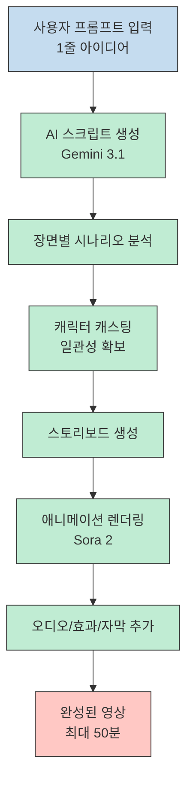
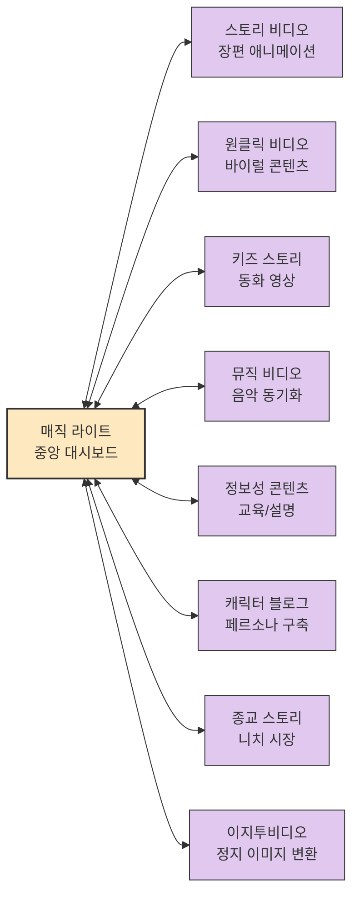
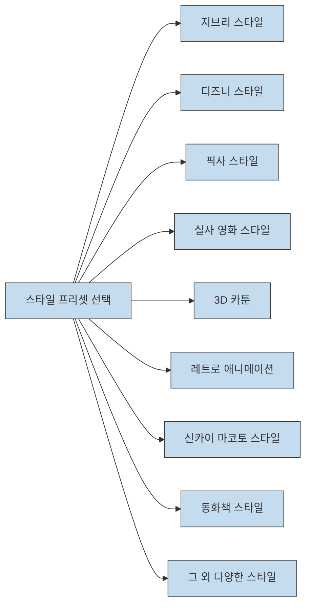
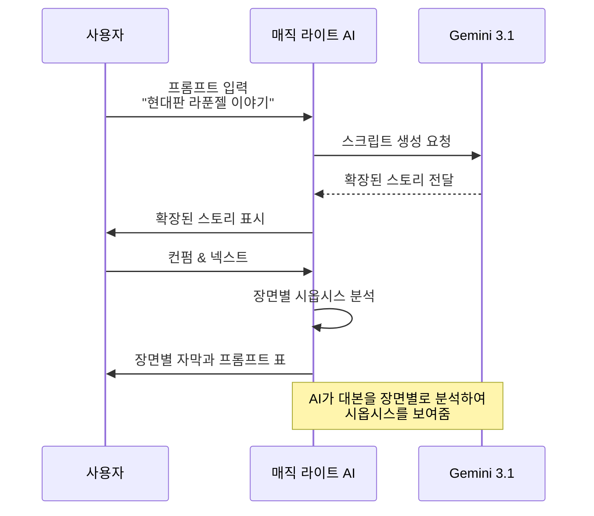
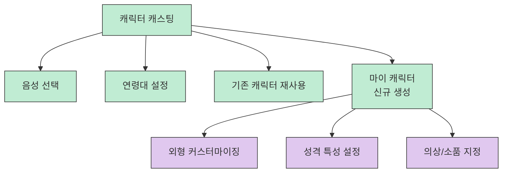
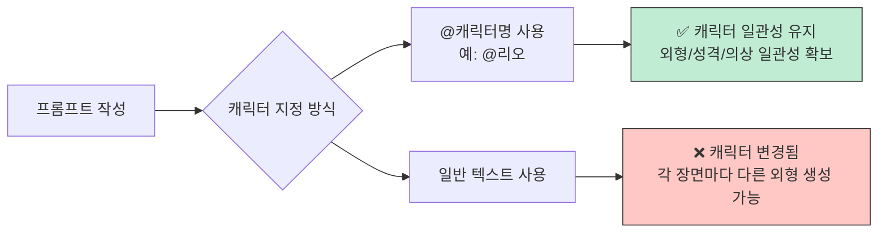
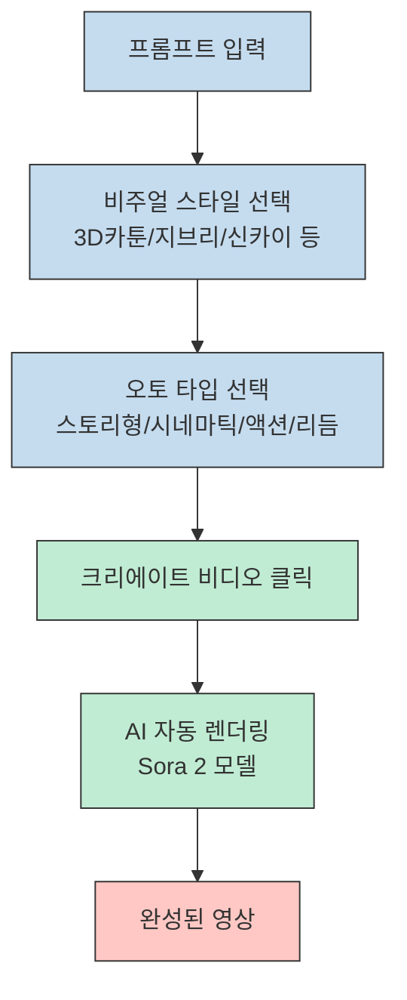
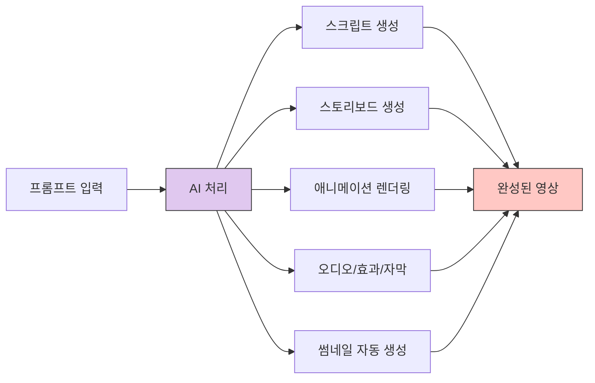

AI 영상 제작 도구가 폭발적으로 발전하고 있습니다. 이제 전문적인 애니메이션 스튜디오가 아니더라도, 한 줄의 프롬프트만으로 고품질 애니메이션을 제작할 수 있는 시대가 도래했습니다.

이 글에서는 **매직 라이트(Magic Light)** 라는 AI 툴을 통해 프롬프트 한 줄로 최대 50분 길이의 애니메이션을 만드는 방법을 상세히 설명합니다.

<!--more-->

## Sources

- https://youtu.be/XjouUSFRj7w

## 매직 라이트란 무엇인가?

매직 라이트는 AI 기반 영상 제작 플랫폼으로, 사용자가 제공하는 간단한 아이디어나 프롬프트를 통해 자동으로 스크립트를 작성하고, 애니메이션을 생성하며, 최종적으로 완성된 영상을 만들어내는 올인원 솔루션입니다.

기존 AI 영상 제작 툴들이 5초 단위의 짧은 클립만 생성할 수 있었던 것과 비교하면, 매직 라이트는 최대 50분 길이의 긴 영상을 한 번에 생성할 수 있어 생산성이 수백 배 향상됩니다.

## 매직 라이트의 8가지 핵심 기능

매직 라이트는 8가지 주요 기능을 제공하며, 각 기능은 서로 독립적이면서도 하나의 대시보드에서 데이터가 공유되어 높은 일관성을 유지합니다.

### 1. 스토리 비디오 (Story Video)
간단한 아이디어나 콘셉트 한 문장만 입력하면 AI가 알아서 **제미나이 3.1 모델**을 기반으로 전체 스크립트를 작성하고 장면을 구성합니다. 이는 감독 모드로 세부적인 디렉팅이 가능합니다.

### 2. 원클릭 비디오 (One-Click Video)
**소라 2 모델**을 탑재하여 편의성 면에서 우위를 점하며, 바이럴 콘텐츠에 최적화된 시스템입니다. 복잡한 설정 없이 한 번의 클릭으로 영상을 생성할 수 있습니다.

### 3. 키즈 스토리 (Kids Story)
클릭 한 번으로 최대 10분 길이의 어린이 동화 영상을 생성하며, 캐릭터의 일관성을 **95% 이상** 유지하는 알고리즘이 적용되어 있습니다.

### 4. 뮤직 비디오 (Music Video)
짧은 아이디어와 화풍 선택만으로 음악과 동기화된 고품질 비디오를 생성합니다.

### 5. 정보성 콘텐츠 (Informative Content)
단 몇 번의 클릭으로 완성도 높은 정보성 콘텐츠를 자동으로 생성하며, 신뢰감 있는 디테일한 화면 보정까지 한 번에 처리합니다.

### 6. 캐릭터 블로그 (Character Blog)
독창적인 AI 캐릭터를 생성하고 커스터마이징해서 자신만의 페르소나를 구축할 수 있습니다.

### 7. 종교 스토리 (Religious Story)
다양한 종교적 서사를 현대적인 영상미로 구현하여 니치 시장에서도 높은 시청 지속률을 확보할 수 있는 전문적인 템플릿을 제공합니다.

### 8. 이지투비디오 (Image to Video)
기존에 정지된 이미지를 소라 툴을 활용해서 영상으로 변환시키는 기능입니다.

## 스토리 비디오: 장편 애니메이션 제작 과정

스토리 비디오 기능을 사용하여 디즈니급 애니메이션을 만드는 전체 과정을 살펴보겠습니다.

### 1단계: 기본 설정

가장 먼저 메인 화면에서 **스토리 비디오** 아이콘을 클릭합니다. 결정해야 할 첫 번째 요소는 영상의 비율입니다.

| 목적 | 추천 비율 |
|------|-----------|
| 유튜브 롱폼 | 16:9 |
| 쇼츠/틱톡 | 9:16 |

비디오 언어 설정은 한국어도 지원하며, 영상의 브레인 역할을 할 스토리 모델을 선택해야 합니다. 가장 똑똑한 모델 중 하나인 **제미나이**를 설정하면 서사의 개연성이 작가 수준으로 올라갑니다.

### 2단계: 스타일 설정

스타일 모델은 매직 라이트의 높은 편의성 기능 중 하나입니다. 지브리 스타일부터 디즈니풍, 픽사, 실사 영화 같은 **20가지 이상의 프리셋**이 준비되어 있어 원하는 감성을 클릭 한 번으로 정의할 수 있습니다.

### 3단계: 영상 길이 설정

가장 주목할 점은 영상 길이 옵션입니다. **3분부터 무려 50분까지** 설정이 가능합니다. 기존 AI 툴들이 기본적으로 5초씩 끊어서 생성하던 방식과 비교하면 생산성이 수백 배 향상된 셈입니다.

### 4단계: 스크립트 생성

스크립트에는 스마트 스크립트와 베이직 스크립트 두 가지 모드가 있습니다.

- **스마트 스크립트**: 백지 상태에서 시작할 때, 아이디어 한 줄만 입력하면 AI가 확장된 스토리를 생성
- **베이직 스크립트**: 이미 준비된 대본이 있을 때 사용

예를 들어 "현대판 라푼젤 이야기"라는 짧은 아이디어만 입력하고 확장 버튼을 누르면 AI가 자동으로 상세한 스토리를 확장해 줍니다.

### 5단계: 시옵시스 및 장면 편집

컨펌과 넥스트를 누르면 AI가 대본을 장면별로 분석한 시옵시스를 보여줍니다. 각 장면의 자막과 상세 프롬프트가 표 형태로 나오며, 여기서 내용을 직접 수정하거나 장면을 합치고 나눌 수 있습니다.

특히 우측에 있는 **에디트 세팅** 메뉴는 중요한 기능입니다. 이곳에서는 장면의 시간대와 실내/외 공간 설정, 그리고 날씨까지 마우스 클릭으로 정할 수 있습니다. 감독이 현장에서 조명과 날씨를 조정하는 것과 똑같은 권한을 갖게 되는 셈입니다.

## 캐릭터 캐스팅과 일관성 유지

AI 영상 제작에서 가장 중요한 요소는 **캐릭터의 일관성** 확보입니다. 매직 라이트는 이를 위한 강력한 캐스팅 시스템을 제공합니다.

### 캐릭터 설정 옵션

캐릭터 캐스팅 단계에서는 다음과 같은 설정이 가능합니다:

- 캐릭터의 음성 선택
- 연령대 설정
- 기존에 만들어 둔 캐릭터 재사용
- 마이 캐릭터 메뉴에서 독창적인 주인공 직접 생성

### 캐릭터 일관성의 핵심: @ 기호 사용법

영상 전체에서 주인공 캐릭터의 일관성을 유지하는 가장 중요한 팁은 **골뱅이 기호(@)** 사용입니다.

프롬프트를 수정할 때 입력창에 `@캐릭터명` 형식으로 특정 캐릭터를 지정해야만 영상 전체에서 해당 캐릭터의 일관성이 유지됩니다. 이 간단한 규칙 하나가 영상의 완성도를 결정짓는 핵심 요소가 됩니다.

### 스토리보드 생성

넥스트 버튼을 누르면 스토리보드가 생성됩니다. 여기서는 복장 설정도 가능하고, 컷 중에 마음에 들지 않는 아이템 삭제도 가능합니다. 또한 컷이 이상하게 나왔다면 **재생성** 버튼을 눌러 해당 컷을 다시 만들 수 있습니다.

## 원클릭 비디오: 초보자를 위한 간편 모드

스토리 비디오가 디테일한 디렉팅이 가능한 감독 모드라면, **원클릭 비디오**는 단 한 번의 클릭으로 영상을 만들 수 있는 초보자 친화적 모드입니다.

### 원클릭 비디오의 특징

원클릭 비디오 메뉴의 가장 큰 특징은 복잡한 설정 단계가 완전히 제거되었다는 점입니다. 화면에서 다음과 같은 선택지를 제공합니다:

| 비주얼 스타일 | 특징 |
|--------------|------|
| 3D 카툰 | 입체적인 캐릭터와 배경 |
| 신카이 마코토 스타일 | 감성적이고 아름다운 배경 |
| 지브리 스타일 | 따뜻하고 편안한 느낌 |
| 레트로 애니메이션 | 빈티지한 감성 |
| 동화책 스타일 | 동화 같은 일러스트레이션 |

### 오토 버튼의 강점

매직 라이트 원클릭 비디오의 강점 중 하나는 **오토 버튼**입니다. 이 버튼을 누르면 동일한 프롬프트라도 콘텐츠의 성격에 따라 다양한 타입으로 영상의 호흡을 조절할 수 있습니다.

| 타입 | 용도 |
|------|------|
| 스토리형 | 이야기 중심의 서사형 영상 |
| 시네마틱형 | 영화 같은 분위기와 호흡 |
| 액션형 | 긴박한 추격전이나 액션 장면 |
| 리듬형 | 감성적인 뮤직 비디오 |

### 원클릭 비디오의 장단점

**장점:**
- 단 한 번의 클릭으로 전문 스튜디오 레벨의 퀄리티를 몇 분 만에 생성
- 시간 대비 퀄리티가 매우 높음
- 편집이 두려운 초보자에게 적합
- 매일매일 새로운 영상을 업로드해야 하는 쇼츠 크리에이터에게 유용

**단점:**
- 단 한 번의 클릭으로 생성하기 때문에 영상이 예상과는 다르게 튈 수 있음
- 세부적인 디렉팅이 어려움

### 썸네일 자동 생성

매직 라이트의 또 다른 강점은 유튜브 클릭률을 결정짓는 핵심 요소인 **썸네일까지 인공지능이 자동으로 생성**한다는 점입니다. 썸네일 역시 높은 퀄리티를 보여줍니다.

## 시간 효율성 비교

기존 방식과 매직 라이트를 활용한 방식의 시간 효율성을 비교해 보겠습니다.

| 작업 | 기존 방식 (1분 영상) | 매직 라이트 (1분 영상) |
|------|---------------------|------------------------|
| 스크립트 작성 | 30분 | 2분 (자동 생성) |
| 장면 분할 | 20분 | 0분 (자동) |
| 캐릭터 디자인 | 40분 | 5분 (선택 후 자동) |
| 각 장면 생성 | 90분 (5초 × 12장면) | 3분 (일괄 생성) |
| 편집 및 합성 | 30분 | 0분 (자동) |
| 썸네일 제작 | 15분 | 0분 (자동) |
| **총 작업 시간** | **약 225분 (3시간 45분)** | **약 10분** |

```mermaid
gantt
    title AI 영상 제작 시간 비교 (1분 영상 기준)
    dateFormat m
    axisFormat %m분

    section 기존 방식
    스크립트 작성      :30, g0
    장면 분할         :20, g0
    캐릭터 디자인     :40, g0
    각 장면 생성      :90, g0
    편집 및 합성      :30, g0
    썸네일 제작       :15, g0

    section 매직 라이트
    스크립트 생성      :2, m0
    장면 분할         :0, m0
    캐릭터 선택       :5, m0
    일괄 생성         :3, m0
    자동 편집         :0, m0
    썸네일 자동       :0, m0
```

## 활용 시나리오

매직 라이트는 다양한 콘텐츠 제작 시나리오에서 활용할 수 있습니다.

### 1. 쇼츠/릴스 크리에이터
- 매일 업로드해야 하는 양산형 콘텐츠 제작
- 원클릭 비디오 모드로 빠른 퀄리티 확보

### 2. 유튜버
- 롱폼 콘텐츠용 장면 영상 제작
- 지브리/디즈니 스타일의 브이로그 제작

### 3. 키즈 콘텐츠 크리에이터
- 동화책 형태의 교육용 영상
- 캐릭터 일관성이 중요한 시리즈 제작

### 4. 브랜드 마케터
- 브랜드 스토리텔링 영상
- 제품 홍보용 애니메이션

## 핵심 요약

| 항목 | 내용 |
|------|------|
| **매직 라이트란** | 프롬프트 한 줄로 최대 50분 애니메이션을 제작할 수 있는 AI 기반 영상 제작 플랫폼 |
| **핵심 기능** | 8가지 기능 (스토리 비디오, 원클릭 비디오, 키즈 스토리, 뮤직 비디오 등) |
| **스토리 모델** | 제미나이 3.1 기반으로 작가 수준의 서사 개연성 확보 |
| **애니메이션 모델** | 소라 2 모델 탑재, 고품질 렌더링 |
| **비율 지원** | 16:9 (유튜브 롱폼), 9:16 (쇼츠/틱톡) |
| **스타일 프리셋** | 지브리, 디즈니, 픽사, 실사 등 20가지 이상 |
| **캐릭터 일관성** | @ 기호 사용으로 95% 이상의 일관성 유지 |
| **시간 절약** | 기존 3시간 45분 작업을 10분으로 단축 (약 20배 효율화) |
| **썸네일** | AI 자동 생성으로 추가 작업 없이 고퀄리티 썸네일 확보 |

## 결론

매직 라이트는 AI 영상 제작의 패러다임을 바꾸는 혁신적인 툴입니다. 기존에는 불가능했던 **프롬프트 한 줄로 최대 50분짜리 애니메이션 제작**이 가능해지면서, 영상 제작의 진입 장벽이 크게 낮아졌습니다.

하지만 이런 유료 AI 툴들은 양날의 검이기도 합니다. 제작 전 철저한 기획을 하고 활용하면 무엇보다 효율적인 툴이 되지만, 아무 계획 없이 제작을 하게 되면 크레딧만 낭비하게 될 수 있습니다.

따라서 많은 기획과 아이디어 고민이 뒷받침된다면, 매직 라이트는 콘텐츠의 질과 효율성에 집중할 수 있는 강력한 도구가 될 것입니다. 콘텐츠 크리에이터로서 가장 중요한 것은 도구 자체가 아니라, 그 도구를 통해 어떤 가치를 전달할지에 대한 전략적 사고임을 잊지 말아야 할 것입니다.
