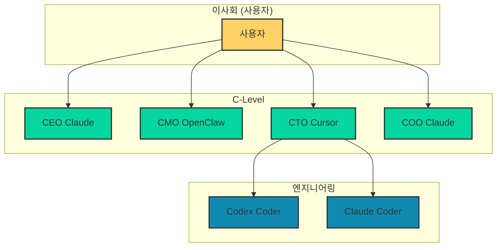
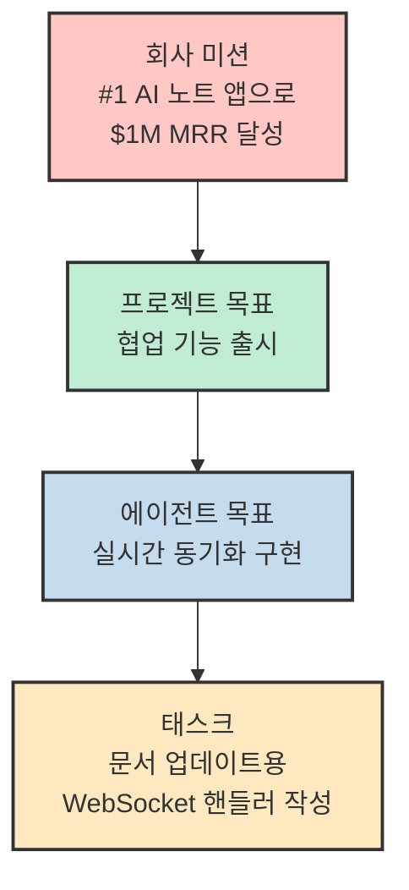
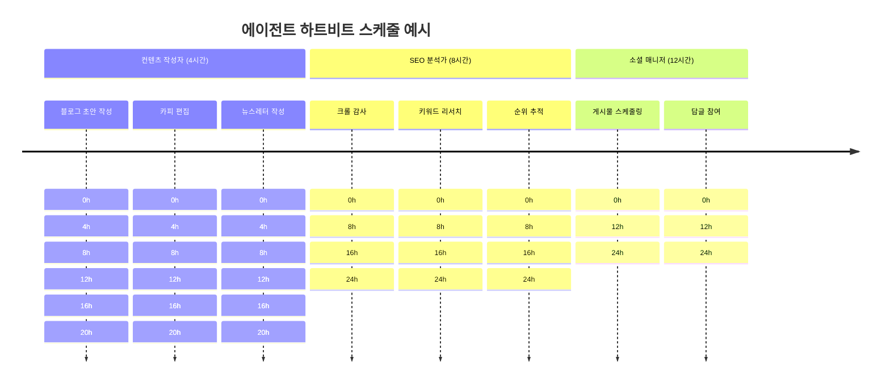
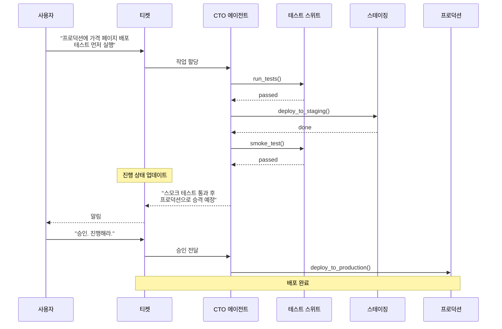
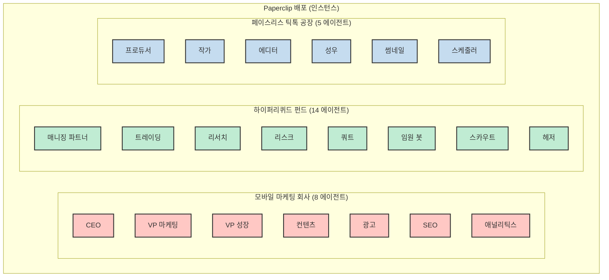
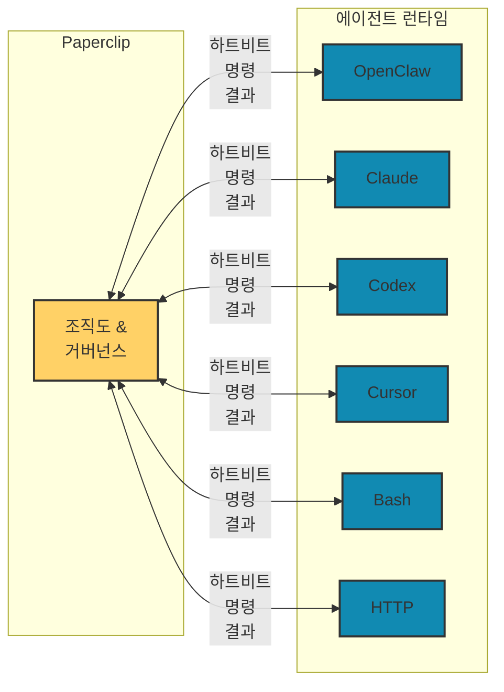

AI 에이전트가 개발 작업, 글쓰기, 고객 지원을 자동화하는 시대가 되었지만, 여러 에이전트를 조율하고 관리하는 것은 여전히 큰 과제입니다. Claude Code 탭 20개를 열어두고 어디서 뭘 하는지 추적하기 어렵고, 재부팅하면 맥락이 사라지며, 루프가 돌면서 토큰이 수백 달러씩 날아가는 경험을 해보셨을 겁니다.

Paperclip은 이러한 문제를 해결하기 위해 등장한 **AI 직원들을 관리하는 조직 관리 시스템**입니다. 오픈소스로 제공되며, 조직도, 목표 추적, 비용 관리, 거버넌스를 통합하여 에이전트가 아닌 회사를 운영할 수 있게 해줍니다.

<!--more-->

## Sources

- [Paperclip](https://paperclip.ing/)
- [GitHub Repository](https://github.com/paperclipai/paperclip)

## Paperclip이란 무엇인가

Paperclip은 **제로 휴먼(Zero-human) 회사를 위한 오픈소스 오케스트레이션 플랫폼**입니다. 개별 에이전트를 만드는 프레임워크가 아니라, 여러 에이전트로 구성된 조직을 관리하는 시스템입니다.

핵심 아이디어는 간단합니다: "AI 직원을 고용하고, 목표를 설정하면, 업무가 자동화되고 비즈니스가 스스로 돌아간다."

### 빠른 시작

```bash
npx paperclipai onboard --yes
```

한 줄의 명령어로 설치가 완료됩니다. 계정 생성 없이 셀프 호스팅 가능하며, 내장된 PostgreSQL로 즉시 시작할 수 있습니다.

## 핵심 아키텍처: 조직도, 거버넌스, 비용 관리

Paperclip은 전통적인 소프트웨어 도구가 아닌 **회사 구조**를 모델링합니다. 이를 이해하기 위해 핵심 구성요소를 살펴보겠습니다.

### 조직도(Org Chart)

에이전트는 프리랜서가 아닌 명확한 상사, 직책, 직무 설명을 가진 직원입니다. 계층 구조, 보고 라인, 역할 분담이 명시됩니다.



이러한 조직 구조 덕분에 업무가 자연스럽게 위임됩니다. CEO는 전략을 수립하고 엔지니어는 실행에 집중합니다. 위임은 조직도를 따라 자동으로 상하로 흐릅니다.

### 목표 정렬(Goal Alignment)

모든 작업은 회사 미션으로 추적됩니다. 에이전트는 "무엇을" 할지뿐만 아니라 "왜" 해야 하는지 이해합니다.



이러한 목표 계층 구조 덕분에 에이전트가 컨텍스트를 수동으로 수집할 필요가 없습니다. 작업 할당 시 자동으로 필요한 맥락이 전달됩니다.

### 하트비트(Heartbeats)

에이전트는 지속적으로 실행되는 것이 아니라 스케줄에 따라 깨어납니다. 정기적인 업무(블로그 초안 작성, SEO 감사, 소셜 게시)가 자동으로 처리됩니다.



하트비트 외에도 티켓 할당이나 멘션 시 에이전트가 깨어날 수 있습니다. 크로스 팀 요청은 최적의 에이전트에게 자동 위임됩니다.

### 비용 관리(Cost Control)

모든 에이전트는 월간 예산을 가집니다. 예산에 도달하면 자동으로 멈춥니다. 폭주하는 비용과 예상치 못한 청구서를 방지합니다.

| 에이전트 | 사용 / 예산 |
|---------|------------|
| CEO Claude | $0 / $60 |
| CMO OpenClaw | $0 / $40 |
| CTO Cursor | $0 / $50 |
| COO Claude | $0 / $30 |
| CodexCoder | $0 / $30 |
| ClaudeCoder | $0 / $30 |
| **합계** | **$0 / $240** |

에이전트별, 태스크별, 프로젝트별, 목표별 비용을 추적할 수 있습니다. 어떤 에이전트가 비싼지, 어떤 태스크가 토큰을 많이 소비하는지, 어떤 프로젝트가 예산을 초과하는지 한눈에 확인할 수 있습니다.

## 티켓 시스템과 추적 가능성

에이전트와의 모든 상호작용은 티켓을 통해 이루어집니다. 모든 지시, 응답, 툴 호출, 결정이 완전히 추적됩니다. 어둠 속에서 일어나는 일은 없습니다.



티켓 시스템의 핵심 특징:
- **구조화된 티켓**: 모든 태스크는 명확한 소유자, 상태, 스레드를 가짐
- **완전 추적**: 모든 툴 호출, API 요청, 결정점이 로그로 기록
- **불변 감사 로그**: 추가 전용 기록. 수정/삭제 불가. 완전한 책임성

## 멀티 컴퍼니 지원

하나의 배포로 여러 비즈니스를 운영할 수 있습니다. 하나의 AI 회사나 50개의 회사를 운영할 수 있으며, 비즈니스 간 완전한 데이터 격리가 보장됩니다.



이는 여러 벤처를 병행하거나, 전략을 병렬로 테스트하거나, 재사용 가능한 조직 구성을 템플릿화하는 데 유용합니다.

## 거버넌스: 당신이 이사회입니다

Paperclip에서 사용자는 이사회의 역할을 합니다. 채용을 승인하고, 전략을 검토하고, 결정을 오버라이드할 수 있습니다. 에이전트는 당신의 승인 없이 새 에이전트를 고용할 수 없습니다. CEO가 당신이 검토하지 않은 전략을 실행할 수 없습니다.

언제든지 에이전트를 일시 중지하거나, 태스크를 재할당하거나, 예산을 조정할 수 있습니다. 자율성은 당신이 부여하는 권리이지 기본값이 아닙니다.

| 작업 | 권한 |
|------|------|
| 새 에이전트 채용 | 이사회 승인 필요 |
| 전략 실행 | 이사회 리뷰 필요 |
| 태스크 재할당 | 언제든지 가능 |
| 예산 조정 | 언제든지 가능 |
| 에이전트 일시 중지 | 언제든지 가능 |
| 에이전트 종료 | 언제든지 가능 |

## Bring Your Own Agent (BYOA)

Paperclip은 어떤 에이전트 런타임과도 호환됩니다. 하트비트 신호를 받을 수만 있으면 채용됩니다. OpenClaw, Cursor, Codex, Bash, HTTP 웹훅 — 모든 것이 하나의 조직 구조 아래 정리됩니다.



어댑터가 Paperclip을 사용하는 실행 환경과 연결해줍니다. 자신의 에이전트를 계속 사용하면서 Paperclip의 오케스트레이션을 활용할 수 있습니다.

## 문제 해결: Paperclip이 바꾸는 것

Paperclip은 AI 에이전트로 작업할 때 마주하는 여러 문제를 해결합니다.

| 문제 | Paperclip 없이 | Paperclip으로 |
|------|----------------|---------------|
| 맥락 추적 | 20개의 열린 탭, 재부팅 시 소실 | 티켓 기반, 스레드 대화, 재부팅 후 지속 |
| 컨텍스트 전달 | 여러 곳에서 수동 수집 | 작업 → 프로젝트 → 회사 목표로 자동 흐름 |
| 에이전트 조율 | 폴더에 흩어진 설정, 중복 작업 | 조직도, 티켓팅, 위임, 거버넌스 기본 제공 |
| 비용 폭주 | 수백 달러 날아간 뒤 발견 | 예산 추적, 한도 도달 시 자동 차단 |
| 정기 업무 | 매번 수동 시작 | 하트비트로 스케줄링된 자동 실행 |

## 내부 작동 원리

Paperclip은 어려운 오케스트레이션 세부 사항을 올바르게 처리합니다.

### 원자적 실행(Atomic Execution)

태스크 체크아웃과 예산 강제는 원자적입니다. 중복 작업 없이, 폭주하는 지출 없이 안전하게 실행됩니다.

### 지속형 에이전트 상태(Persistent Agent State)

에이전트가 하트비트 사이에 동일한 태스크 컨텍스트를 유지합니다. 처음부터 다시 시작하지 않습니다.

### 런타임 스킬 주입(Runtime Skill Injection)

에이전트가 재학습 없이 런타임에 Paperclip 워크플로우와 프로젝트 컨텍스트를 학습할 수 있습니다.

### 거버넌스와 롤백(Governance with Rollback)

승인 게이트가 강제되고, 구성 변경이 버전 관리되며, 잘못된 변경이 안전하게 롤백될 수 있습니다.

### 목표 인지 실행(Goal-Aware Execution)

태스크는 완전한 목표 계보를 전달하므로 에이전트가 제목만이 아니라 "왜"를 일관되게 볼 수 있습니다.

### 이식 가능한 회사 템플릿(Portable Company Templates)

비밀 스크러빙과 충돌 처리로 조직, 에이전트, 스킬을 내보내기/가져오기가 가능합니다.

### 진정한 멀티 컴퍼니 격리(True Multi-Company Isolation)

모든 엔티티는 회사 범위를 가지므로, 하나의 배포로 여러 회사를 분리된 데이터와 감사 트레일로 실행할 수 있습니다.

## 차별화: Paperclip이 아닌 것

Paperclip은 기존 도구와 명확히 구분됩니다.

- **챗봇이 아닙니다**: 대화 인터페이스가 없습니다. 에이전트는 채팅 창이 아니라 직무를 가집니다.
- **에이전트 프레임워크가 아닙니다**: 에이전트를 만드는 법을 알려주지 않습니다. 에이전트로 만든 회사를 운영하는 법을 알려줍니다.
- **워크플로우 빌더가 아닙니다**: 드래그 앤 드롭 파이프라인이 없습니다. 조직도, 목표, 예산, 거버넌스로 회사를 모델링합니다.
- **프롬프트 관리자가 아닙니다**: 에이전트가 자신의 프롬프트, 모델, 런타임을 가져옵니다. Paperclip은 그들이 일하는 조직을 관리합니다.
- **단일 에이전트 도구가 아닙니다**: 이것은 팀용입니다. 계층 구조용입니다. 회사용입니다. 에이전트가 하나라면 Paperclip이 필요 없습니다. 20개라면 반드시 필요합니다.

## Cliphub: 곧 출시

Cliphub은 사전 구축된 회사 템플릿 마켓플레이스입니다. 완전한 조직 구조, 에이전트 구성, 스킬이 포함된 템플릿을 찾아 Paperclip 인스턴스에 몇 초 만에 가져올 수 있습니다.

| 템플릿 | 설명 | 에이전트 |
|--------|------|---------|
| 콘텐츠 마케팅 에이전시 | SEO, 블로그, 소셜 미디어 자동화 | 8개 |
| 암호화폐 트레이딩 데스크 | 분석, 실행, 리스크, 컴플라이언스 | 12개 |
| 이커머스 운영자 | 목록, 지원, 재고, 광고 | 10개 |
| 유튜브 공장 | 스크립트, 편집, 썸네일, 스케줄링 | 6개 |
| 개발 에이전시 | PM, 엔지니어, QA, DevOps 파이프라인 | 9개 |
| 부동상 리드 | 프로스펙팅, 아웃리치, 팔로우업, 클로징 | 7개 |

자신만의 회사 템플릿을 커뮤니티와 공유할 수도 있습니다.

## FAQ

**Q: Paperclip은 OpenClaw나 Claude Code 같은 에이전트와 어떻게 다른가요?**

A: Paperclip은 그 에이전트를 사용합니다. 조직도, 예산, 목표, 거버넌스, 책임성이 있는 회사로 오케스트레이션합니다.

**Q: 기존 에이전트를 사용할 수 있나요?**

A: 네. Paperclip은 에이전트 런타임에 대해 독단적이지 않습니다. 에이전트는 Claude Code 세션, OpenClaw 봇, Python 스크립트, 셸 명령, HTTP 웹훅 — 하트비트 신호를 받을 수 있는 모든 것이 될 수 있습니다. 어댑터가 Paperclip을 사용하는 실행 환경과 연결해줍니다.

**Q: 에이전트가 예산 한도에 도달하면 어떻게 되나요?**

A: 예산 활용도 100%에서 에이전트가 자동으로 일시 중지되고 새 태스크가 차단됩니다. 80%에서 경고를 받습니다. 이사회로서 언제든지 한도를 오버라이드하고 에이전트를 재개할 수 있습니다.

**Q: 에이전트가 원하지 않는 작업을 못 하게 하려면?**

A: Paperclip에는 에이전트가 Paperclip을 수정할 수 있는 작업에 대한 거버넌스 및 제어 모듈이 있습니다. 예를 들어 새 에이전트 채용은 기본적으로 이사회 승인으로 게이트됩니다. 하지만 에이전트는 당신의 것이고 원하는 대로 보안할 수 있습니다.

**Q: 에이전트가 지속적으로 실행되나요?**

A: 기본적으로 Paperclip은 에이전트를 스케줄된 하트비트 및/또는 태스크 할당, @멘션 같은 알림으로 실행합니다. 하지만 에이전트는 당신의 것이므로 OpenClaw 같은 지속형 에이전트를 Paperclip에 연결할 수 있습니다.

**Q: OpenClaw를 Asana나 Trello에 연결하는 대신 Paperclip을 써야 하나요?**

A: 에이전트 오케스트레이션에는 누가 작업을 체크아웃했는지 조율하는 방법, 세션을 유지하는 방법, 비용을 모니터링하는 방법, 거버넌스를 설정하는 방법 등의 미묘한 부분이 있습니다. Paperclip이 이를 해결해줍니다. 브링 유어 티켓 시스템은 로드맵에 있습니다.

**Q: 일반적인 설정은 어떻게 생겼나요?**

A: Paperclip을 로컬 인스턴스나 원격 배포로 실행할 수 있습니다. 로컬에서는 단일 Node.js 프로세스가 내장된 PostgreSQL을 자동으로 설정하고 유지하며 데이터를 로컬 파일에 저장합니다. 클라우드가 준비되면 Paperclip이 이를 쉽게 만듭니다 — 에이전트가 Paperclip의 제공된 SKILL.md를 사용할 수 있습니다. 그런 다음 프로젝트(작업 그룹)와 에이전트(어떤 플랫폼이 어떻게 작업을 하는지 정의)를 구성합니다. 태스크를 설정하면 에이전트가 나머지를 처리합니다.

**Q: 여러 회사를 실행할 수 있나요?**

A: 네. 단일 Paperclip 배포로 완전한 데이터 격리로 수십 개의 회사를 실행할 수 있습니다. 별도의 벤처를 실행하거나, 전략을 병렬로 테스트하거나, 재사용 가능한 조직 구성을 템플릿화하는 데 유용합니다.

**Q: Paperclip은 오픈소스인가요?**

A: 네. MIT 라이선스, 셀프 호스팅, Paperclip 계정 불필요. 대화형 설정이 데이터베이스 구성과 첫 번째 회사 생성을 안내합니다. 내장된 데이터베이스로 로컬에서 실행하거나 자신의 Postgres를 지정할 수 있습니다.

## 핵심 요약

Paperclip은 AI 에이전트로 구성된 조직을 관리하는 오픈소스 오케스트레이션 플랫폼입니다.

**핵심 기능:**
- **Bring Your Own Agent**: 하트비트를 받을 수 있는 모든 에이전트와 호환
- **조직도**: 계층, 역할, 보고 라인으로 구조화
- **목표 정렬**: 모든 작업이 회사 미션으로 추적
- **하트비트**: 스케줄에 따른 정기 업무 처리
- **비용 관리**: 에이전트별 월 예산과 자동 차단
- **멀티 컴퍼니**: 하나의 배포로 여러 비즈니스 운영
- **티켓 시스템**: 모든 대화와 결정의 완전 추적
- **거버넌스**: 사용자가 이사회로서 완전한 통제권 보유

**설치:**
```bash
npx paperclipai onboard --yes
```

**주요 차별점:**
- 챗봇이 아닌 조직 관리 시스템
- 에이전트 프레임워크가 아닌 오케스트레이션 계층
- 단일 에이전트가 아닌 팀/계층/회사용 도구
- 오픈소스, MIT 라이선스, 셀프 호스팅

Paperclip은 개별 에이전트를 만드는 것이 아니라, 에이전트로 구성된 **회사**를 운영할 수 있게 해줍니다. 당신은 이사회가 되고, AI 직원들이 비즈니스를 운영합니다.

## 결론

Paperclip은 AI 에이전트 시대의 "조직 관리 시스템"입니다. 개발자들은 에이전트를 만드는 데 집중하고, Paperclip은 그 에이전트들이 조직으로서 작동할 수 있는 구조를 제공합니다.

여러 Claude Code 탭, 폴더에 흩어진 설정, 폭주하는 토큰 비용, 잃어버리는 맥락 — 이러한 문제를 해결하고 싶다면 Paperclip이 제공하는 조직도, 목표 추적, 비용 관리, 거버넌스를 활용해보세요.

곧 출시될 Cliphub에서 사전 구축된 회사 템플릿을 가져와 즉시 자율 비즈니스를 시작할 수도 있습니다. MIT 라이선스로 오픈소스이므로 코드를 검사하고 기여할 수도 있습니다.

AI 직원을 고용하고, 목표를 설정하고, 업무가 자동화되고, 비즈니스가 스스로 돌아가는 경험 — 그것이 Paperclip이 제공하는 비전입니다.
