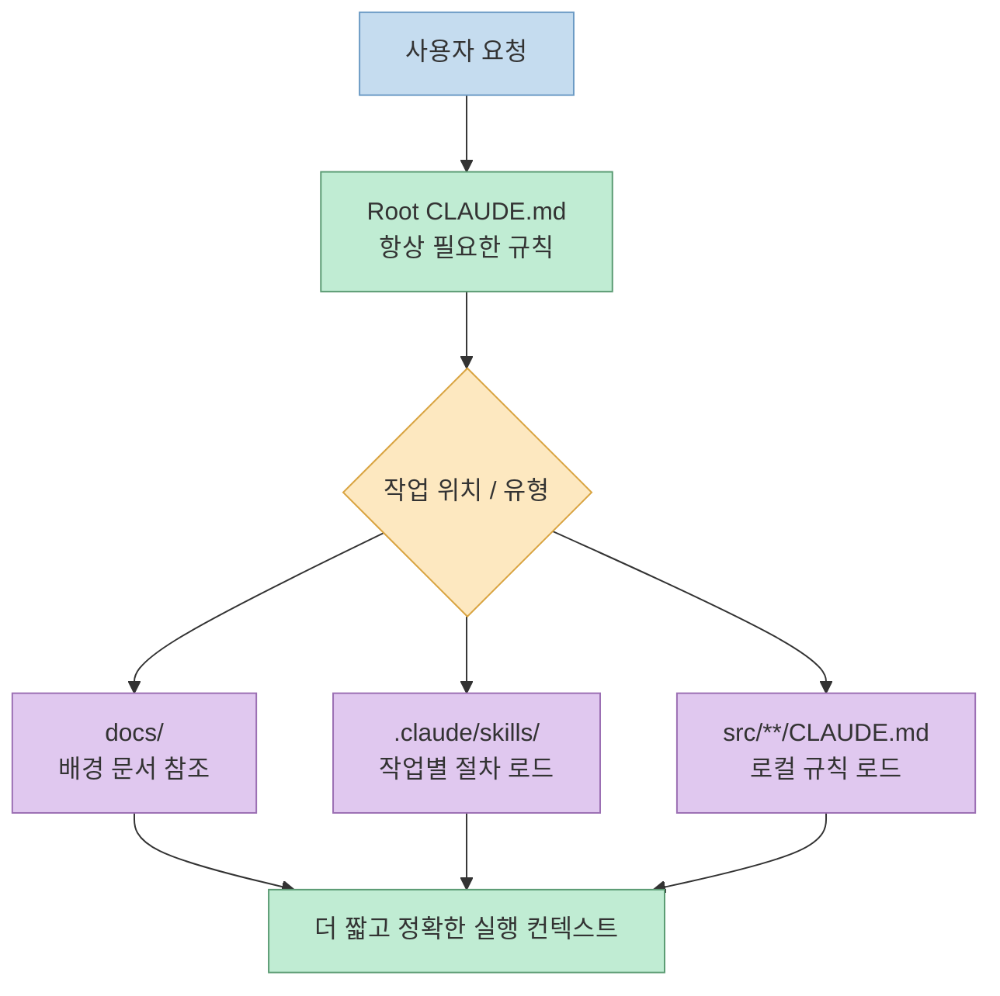
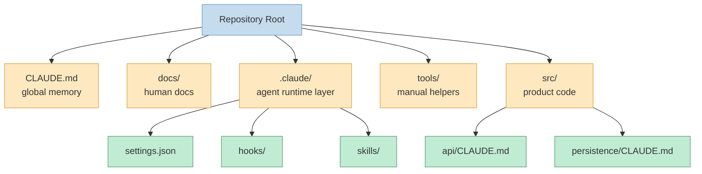
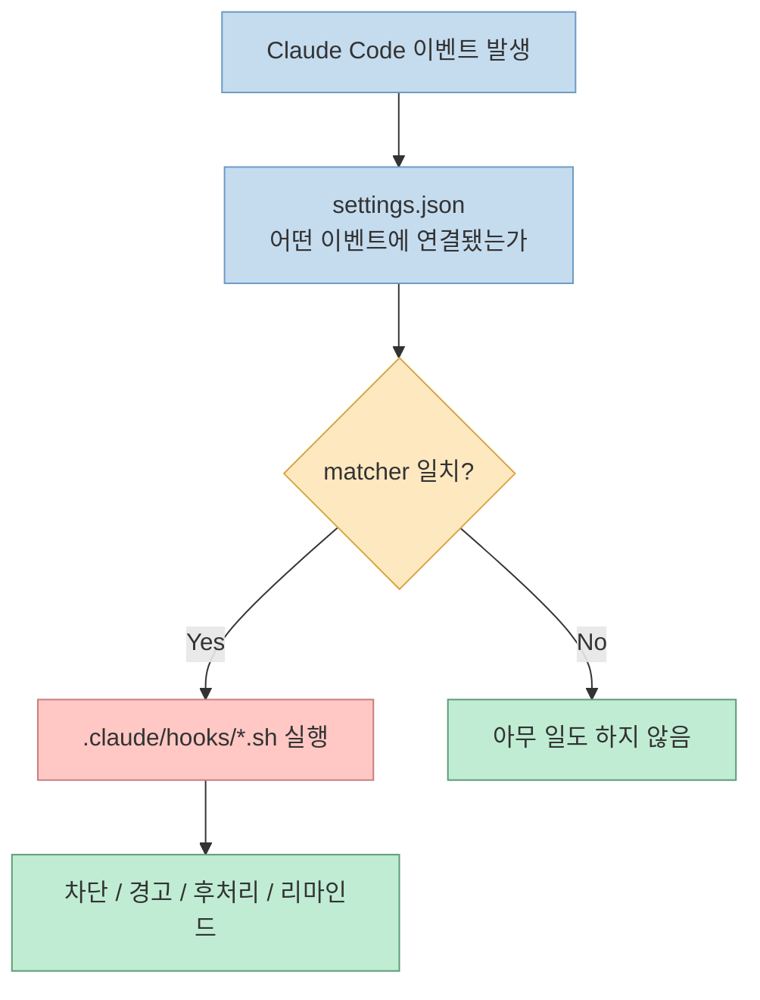
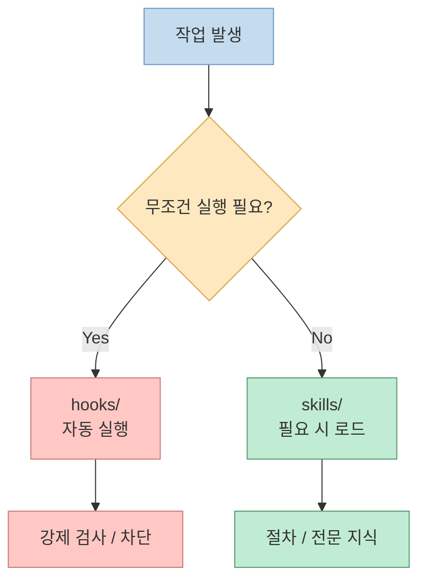
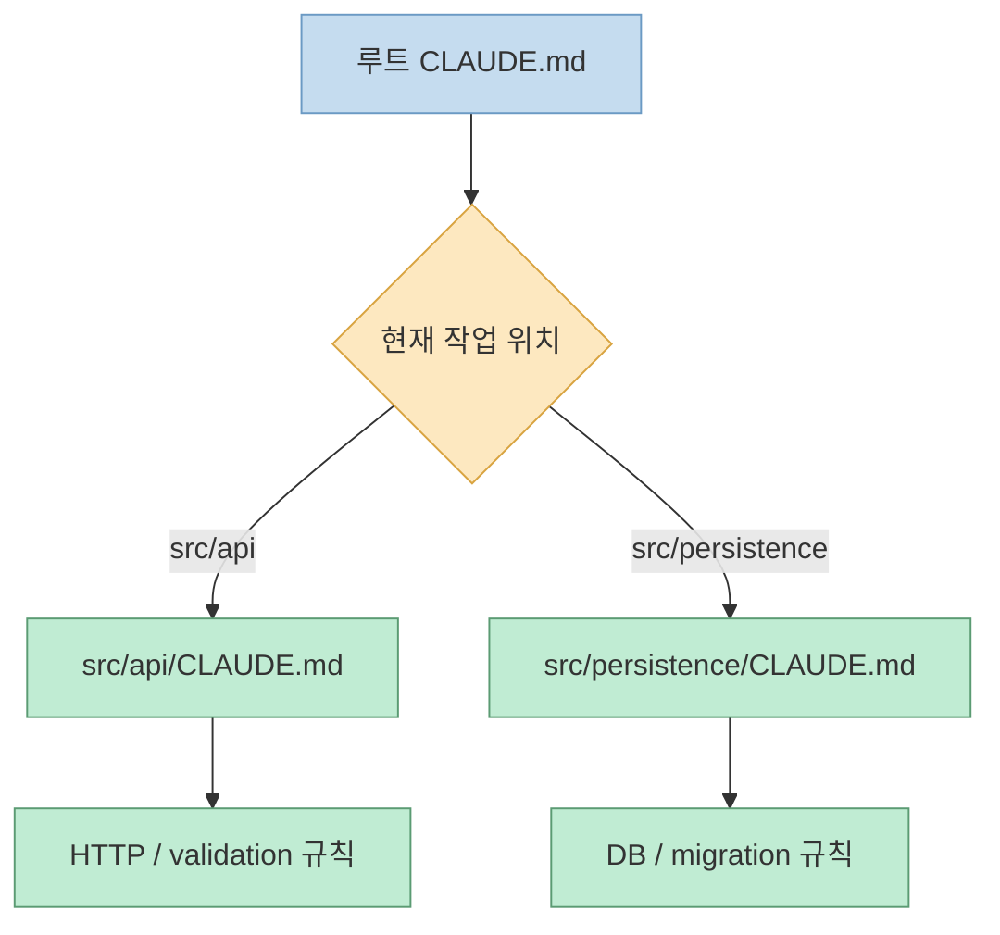

Claude Code를 조금만 깊게 써 보면 금방 부딪히는 문제가 있습니다. 규칙은 `CLAUDE.md`에 몰아넣고, 자동화는 훅에 넣고, 반복 작업은 스킬로 빼야 한다는 말은 알겠는데, 실제로 레포를 어떻게 나눠야 할지 애매합니다.<br>특히 프로젝트가 커질수록 "무엇을 항상 읽게 할지", "무엇을 필요할 때만 불러올지", "무엇을 문서로 남길지"가 섞이기 시작합니다.

이번 글은 `temp/claude-structor.md`의 간단한 구조 예시를 출발점으로, **실제로 운영 가능한 Claude Code 프로젝트 디렉터리 구조**로 확장한 버전입니다. 단순히 폴더 이름만 나열하지 않고, 각 폴더가 왜 필요한지, 어떤 파일을 넣어야 하는지, 그리고 바로 가져다 쓸 수 있는 샘플 예제까지 같이 정리합니다.

<!--more-->

## Sources

- https://code.claude.com/docs/en/extend
- https://code.claude.com/docs/en/best-practices
- https://code.claude.com/docs/en/skills
- https://code.claude.com/docs/en/hooks
- https://github.com/anthropics/skills
- https://www.humanlayer.dev/blog/writing-a-good-claude-md

## 1) 왜 폴더 구조가 중요한가

많은 팀이 처음에는 루트 `CLAUDE.md` 하나로 시작합니다. 초반에는 이 방식이 빠르지만, 프로젝트가 커지면 전역 규칙과 작업별 절차가 한 파일에 섞이면서 컨텍스트가 비대해집니다. 그 결과 에이전트는 항상 읽을 필요가 없는 정보까지 함께 보게 되고, 탐색 비용이 커집니다.

핵심은 폴더를 예쁘게 나누는 것이 아니라, **정보를 로딩되는 방식에 맞게 분리하는 것**입니다. 항상 필요한 것은 전역에 두고, 특정 작업에서만 필요한 것은 스킬이나 하위 `CLAUDE.md`로 내려야 합니다.



## 2) 추천 구조: 작은 전역 규칙 + 도메인별 분리

아래 구조는 Claude Code 프로젝트를 운영할 때 가장 설명력이 좋은 기본형입니다.

```text
claude_code_project/
│
├─ CLAUDE.md
├─ README.md
│
├─ docs/
│  ├─ architecture.md
│  ├─ decisions/
│  │  └─ 0001-use-postgres.md
│  └─ runbooks/
│     └─ local-dev.md
│
├─ .claude/
│  ├─ settings.json
│  ├─ hooks/
│  │  ├─ block-force-push.sh
│  │  └─ format-check.sh
│  └─ skills/
│     ├─ code-review/
│     │  └─ SKILL.md
│     ├─ refactor/
│     │  └─ SKILL.md
│     └─ release/
│        └─ SKILL.md
│
├─ tools/
│  ├─ scripts/
│  │  └─ bootstrap-dev.sh
│  └─ prompts/
│     └─ incident-retro.md
│
└─ src/
   ├─ api/
   │  ├─ CLAUDE.md
   │  └─ handlers/
   └─ persistence/
      ├─ CLAUDE.md
      └─ repositories/
```

이 구조를 한 줄로 요약하면 다음과 같습니다.

- `CLAUDE.md`: 항상 읽어야 하는 프로젝트 공통 규칙
- `docs/`: 사람이 읽는 배경 문서와 의사결정 기록
- `.claude/hooks`: 자동으로 실행되는 강제 검사
- `.claude/skills`: 필요할 때만 로드되는 작업별 플레이북
- `tools/`: 사람이 직접 실행하거나 복붙해서 쓰는 도구와 프롬프트
- `src/**/CLAUDE.md`: 특정 영역에서만 필요한 로컬 규칙



## 3) 루트 파일: `CLAUDE.md`와 `README.md`

### `CLAUDE.md`: 프로젝트의 전역 기억

루트 `CLAUDE.md`는 Claude Code가 세션 시작 시 자동으로 읽는 **최상위 컨텍스트 파일**입니다. 그래서 여기에 모든 걸 넣는 것이 아니라, "항상 필요한 것만" 넣는 게 중요합니다.

이 파일에는 보통 아래 정보가 들어갑니다.

- 프로젝트 목적
- 필수 빌드/테스트 명령
- 금지 사항
- 디렉터리 구조 지도
- 하위 문서 포인터

샘플 예제:

```md
# CLAUDE.md

## Project Overview
- B2B SaaS backend for invoice processing
- Main stack: Node.js, Fastify, PostgreSQL

## Commands
- Install: `pnpm install`
- Test: `pnpm test`
- Build: `pnpm build`

## Guardrails
- Never edit generated files in `src/generated`
- Never bypass migration checks

## Context Map
- API rules: `src/api/CLAUDE.md`
- Persistence rules: `src/persistence/CLAUDE.md`
- Architecture: `docs/architecture.md`
```

좋은 `CLAUDE.md`는 백과사전이 아니라 관제탑입니다. 상세 절차를 길게 쓰기보다, 어디를 더 읽어야 하는지 짧게 연결하는 편이 낫습니다.

### `README.md`: 사람을 위한 입구

`README.md`는 Claude보다 사람이 먼저 보는 파일입니다. 새 팀원, 외부 기여자, 미래의 나에게 "이 프로젝트를 어떻게 시작하는지"를 설명합니다.

샘플 예제:

````md
# Invoice Engine

## Quick Start
```bash
pnpm install
pnpm dev
```

## Documentation
- Architecture: `docs/architecture.md`
- ADRs: `docs/decisions/`
- Runbooks: `docs/runbooks/`
````

정리하면, `README.md`는 사람용 온보딩, `CLAUDE.md`는 에이전트용 온보딩입니다. 두 파일은 비슷해 보여도 역할이 다릅니다.

## 4) `docs/`: 배경 문서를 분리하는 공간

### `docs/architecture.md`

아키텍처 문서는 시스템의 큰 그림을 설명합니다. 에이전트가 추론에 참고할 수는 있지만, 상시 로드할 필요는 없습니다. 그래서 루트 `CLAUDE.md`에는 요약만 두고, 자세한 내용은 `docs/architecture.md`로 넘기는 구성이 좋습니다.

샘플 예제:

```md
# Architecture

## Core Flow
Client -> API -> Application Service -> Repository -> PostgreSQL

## Boundaries
- `src/api`: transport and request validation
- `src/persistence`: database access only
- `src/domain`: pure business rules
```

### `docs/decisions/`

이 폴더는 ADR(Architecture Decision Record) 저장소로 쓰면 좋습니다. "왜 이 기술을 선택했는지"가 남아 있으면, Claude Code가 리팩터링이나 확장 작업을 할 때 의도를 더 안정적으로 따라갑니다.

샘플 예제:

```md
# 0001 - Use PostgreSQL for transactional storage

## Status
Accepted

## Context
We need strong consistency for invoice status changes.

## Decision
Use PostgreSQL instead of DynamoDB.

## Consequences
- Easier relational reporting
- Strong transactional guarantees
```

### `docs/runbooks/`

Runbook은 장애 대응이나 운영 절차를 담는 폴더입니다. Claude Code가 운영 자동화를 만들거나 문제를 분석할 때 이 문서가 매우 유용합니다.

샘플 예제:

````md
# local-dev.md

## Start services
```bash
docker compose up -d
pnpm dev
```

## Reset local database
```bash
pnpm db:reset
pnpm db:seed
```
````

`docs/` 아래는 전부 "항상 읽게 하는 정보"가 아니라 "필요할 때 참조할 정보"라는 점이 중요합니다.

## 5) `.claude/`: 에이전트 런타임 계층

`.claude/`는 Claude Code 프로젝트에서 가장 운영적인 폴더입니다. 이 폴더 안에는 설정, 훅, 스킬처럼 **에이전트의 행동을 바꾸는 파일**이 들어갑니다.

### `.claude/settings.json`

여기에는 프로젝트 공유 설정을 둡니다. 예를 들어 훅 설정, 권한 정책, 플러그인 정보 같은 값이 들어갈 수 있습니다.

샘플 예제:

```json
{
  "hooks": {
    "PreToolUse": [
      {
        "matcher": "Bash",
        "hooks": [
          {
            "type": "command",
            "command": "\"$CLAUDE_PROJECT_DIR\"/.claude/hooks/block-force-push.sh"
          }
        ]
      }
    ]
  }
}
```

이 파일에는 "정책"을 넣고, 실제 로직은 훅 스크립트로 분리하는 편이 유지보수에 좋습니다.

### `.claude/hooks/`

이 폴더는 자동화와 강제 검사를 담습니다. 중요한 점은 hooks가 단순한 팁이 아니라, 특정 이벤트에서 **반드시 실행되는 장치**라는 것입니다.

조금 더 정확히 말하면, hooks는 "스크립트 파일을 모아 두는 폴더"라기보다 **Claude Code 라이프사이클에 개입하는 실행 레이어**입니다. 실제 개입 시점은 `.claude/settings.json`에 정의하고, `.claude/hooks/`에는 그때 호출할 스크립트를 넣는 구조가 기본입니다.

즉 역할 분리는 이렇게 이해하면 쉽습니다.

- `.claude/settings.json`: 언제 실행할지 정의
- `.claude/hooks/*.sh`: 실행 시 무엇을 할지 정의



실무에서 가장 많이 쓰는 이벤트는 아래 4개입니다.

| 이벤트 | 언제 실행되나 | 추천 용도 |
|---|---|---|
| `UserPromptSubmit` | 사용자가 프롬프트를 보낼 때 | 입력 정책 검사, 스킬 제안 |
| `PreToolUse` | 도구 실행 직전 | 위험 명령 차단, 권한 가드레일 |
| `PostToolUse` | 도구 실행 직후 | 포맷/정적 검사, 수정 파일 추적 |
| `Stop` | Claude가 응답을 마치기 직전 | 미완료 작업 리마인드, 완료 기준 점검 |

추천 용도:

- 위험 명령 차단
- 포맷/정적 검사 실행
- 세션 종료 전 체크리스트 알림
- 작업 상태 스냅샷/재주입 자동화

여기서 중요한 운영 포인트는 2가지입니다.

1. `PreToolUse`는 **실행 전 차단** 이라서 보안 가드레일에 적합합니다.
2. `PostToolUse`는 **이미 실행된 뒤** 라서 차단보다는 후처리에 적합합니다.

또 `matcher`는 정규식 기반 필터라는 점도 알아두면 좋습니다. 예를 들어 `Bash`, `Edit|Write`, `mcp__.*` 같은 패턴으로 특정 도구만 잡아낼 수 있습니다. 반면 `Stop`처럼 일부 이벤트는 matcher를 지원하지 않아서 넣어도 무시됩니다.

샘플 예제 0: 여러 이벤트를 한 번에 연결하는 `settings.json`

```json
{
  "hooks": {
    "PreToolUse": [
      {
        "matcher": "Bash",
        "hooks": [
          {
            "type": "command",
            "command": "\"$CLAUDE_PROJECT_DIR\"/.claude/hooks/block-force-push.sh"
          }
        ]
      }
    ],
    "PostToolUse": [
      {
        "matcher": "Write|Edit",
        "hooks": [
          {
            "type": "command",
            "command": "\"$CLAUDE_PROJECT_DIR\"/.claude/hooks/format-check.sh"
          }
        ]
      }
    ],
    "Stop": [
      {
        "hooks": [
          {
            "type": "command",
            "command": "\"$CLAUDE_PROJECT_DIR\"/.claude/hooks/remind-open-tasks.sh"
          }
        ]
      }
    ]
  }
}
```

샘플 예제 1: 위험한 Bash 명령 차단 (`PreToolUse`)

공식 문서 기준으로 command hook은 stdin으로 JSON 입력을 받습니다. 그래서 단순 문자열 매칭보다 `jq`로 실제 명령을 뽑아서 검사하는 방식이 더 안전합니다.

```bash
#!/usr/bin/env bash
set -euo pipefail

input="$(cat)"
command="$(printf '%s' "$input" | jq -r '.tool_input.command // empty')"

if printf '%s' "$command" | grep -Eq '(^|[[:space:]])(rm -rf /|git push --force)([[:space:]]|$)'; then
  printf 'Dangerous bash command blocked by project hook.\n' >&2
  exit 2
fi
```

여기서 `exit 2`는 "차단" 의미입니다. 반대로 일반 오류 코드는 경고 성격으로 처리되고 동작이 계속될 수 있습니다.

샘플 예제 2: 수정 직후 포맷/정적 검사 실행 (`PostToolUse`)

`PostToolUse`는 이미 수정이 끝난 뒤 실행되므로, "막는 용도"보다 "정리하고 알려주는 용도"에 더 잘 맞습니다.

```bash
#!/usr/bin/env bash
set -euo pipefail

pnpm prettier --check .
pnpm eslint .
```

이 예시는 가장 단순한 전역 검사 버전입니다. 프로젝트가 커지면 수정된 파일만 추적해서 검사하는 방식으로 바꿀 수 있지만, 초반에는 전체 검사로 시작하는 편이 구현과 운영이 단순합니다.

샘플 예제 3: 미완료 작업 리마인드 (`Stop`)

`Stop` 훅은 빌드 게이트처럼 너무 무겁게 시작하기보다, 먼저 "열린 작업이 남아 있으면 다음 액션을 상기시킨다" 수준으로 두는 편이 안전합니다.

```bash
#!/usr/bin/env bash
set -euo pipefail

tasks_file="$CLAUDE_PROJECT_DIR/docs/workflow/tasks.md"

if [ -f "$tasks_file" ] && grep -q -- '- \[ \]' "$tasks_file"; then
  jq -n '{
    continue: true,
    stopReason: "Open tasks remain in docs/workflow/tasks.md. Review them before closing the session."
  }'
fi
```

샘플 예제 4: 프롬프트로 완료 기준 판단 (`Stop`, `type: "prompt"`)

command hook이 규칙을 결정론적으로 검사하는 방식이라면, prompt hook은 **짧은 LLM 판단**이 필요한 경우에 적합합니다. 예를 들어 "정말 완료라고 말해도 되는가", "응답이 팀 규칙을 충족하는가" 같은 질문은 문자열 매칭보다 프롬프트 평가가 더 자연스러울 수 있습니다.

```json
{
  "hooks": {
    "Stop": [
      {
        "hooks": [
          {
            "type": "prompt",
            "prompt": "Decide whether the assistant can end the task now. Return JSON with {\"ok\": true|false, \"reason\": \"...\"}. Set ok=false if the response claims completion but there is no evidence of verification such as tests, build, or explicit manual checks."
          }
        ]
      }
    ]
  }
}
```

이 방식은 코드베이스를 직접 읽을 필요는 없지만, 단순 셸 규칙으로는 표현하기 어려운 **의미 기반 판단** 이 필요할 때 유용합니다. 반대로 실제 파일을 읽거나 테스트를 돌려야 하는 상황이라면 `type: "agent"` 쪽이 더 잘 맞습니다.

이런 식으로 `Stop`을 쓰면 "작업이 끝났는지"를 마지막에 한 번 더 점검할 수 있습니다. 다만 `Stop`은 정말 완료됐을 때만이 아니라 Claude가 응답을 마칠 때마다 발화할 수 있으므로, 처음부터 타입체크/빌드 같은 무거운 훅을 연결하면 피로도가 커질 수 있습니다.

실무적으로는 아래 순서가 가장 안정적입니다.

1. `PreToolUse`로 위험한 Bash 명령 차단
2. `PostToolUse`로 포맷/정적 검사 붙이기
3. `Stop`으로 가벼운 리마인드 추가
4. 의미 판단이 필요하면 `type: "prompt"` 훅 추가
5. 그 다음에야 빌드/테스트 게이트 같은 무거운 훅 검토

추가 주의점도 있습니다.

- `Stop`처럼 일부 이벤트는 matcher를 지원하지 않습니다.
- 설정 파일을 직접 수정해도 세션 중 즉시 반영되지 않을 수 있어, 재시작이나 `/hooks` 검토가 필요할 수 있습니다.
- 관리형 정책에서 `allowManagedHooksOnly`가 켜져 있으면 프로젝트 훅 자체가 로드되지 않을 수 있습니다.
- 알려진 이슈 때문에 `PreToolUse`의 차단 동작은 Bash 계열에서 특히 먼저 검증하는 편이 안전합니다.

훅은 "에이전트가 기억하길 기대하는 규칙"을 "실행으로 강제하는 규칙"으로 바꿔 줍니다.

### `.claude/skills/`

스킬은 반복 작업을 위한 재사용 플레이북입니다. `CLAUDE.md`가 얇아져야 하는 이유도 결국 여기에 있습니다. 특정 작업 절차를 루트 파일에 길게 쓰는 대신, 스킬 폴더로 빼서 필요할 때만 로드하게 만드는 겁니다.

샘플 구조:

```text
.claude/skills/
├─ code-review/
│  └─ SKILL.md
├─ refactor/
│  └─ SKILL.md
└─ release/
   └─ SKILL.md
```

샘플 예제: `code-review/SKILL.md`

```md
---
name: code-review
description: Review changed files for correctness, safety, and maintainability.
---

## When to use
- Before merge
- After a non-trivial refactor

## Checklist
1. Read changed files first
2. Look for security and performance regressions
3. Verify test coverage impact
4. Summarize issues by severity
```

샘플 예제: `release/SKILL.md`

```md
---
name: release
description: Prepare a production release with verification and notes.
---

## Steps
1. Run test and build commands
2. Check migration status
3. Generate release notes
4. Confirm deployment checklist
```

정리하면 `.claude/hooks`는 자동 실행, `.claude/skills`는 조건부 로드라는 차이가 있습니다.



## 6) `tools/`: 사람이 직접 쓰는 보조 도구 모음

Claude Code 프로젝트에서는 `.claude/`만큼이나 `tools/`도 중요합니다. 차이는 `tools/`가 자동 로딩 대상이 아니라는 점입니다. 이 폴더에는 사람이 명시적으로 실행하거나, 프롬프트를 복사해 쓰는 도구를 넣습니다.

### `tools/scripts/`

반복되는 셸 작업을 스크립트로 빼 두면, 훅과 스킬에서도 재사용하기 쉬워집니다.

샘플 예제:

```bash
#!/usr/bin/env bash
set -euo pipefail

pnpm install
pnpm db:migrate
pnpm dev
```

이런 `bootstrap-dev.sh`는 신규 팀원 온보딩, 로컬 환경 세팅, CI 전 검증에 재사용할 수 있습니다.

### `tools/prompts/`

여기는 긴 조사 프롬프트나 회고 프롬프트처럼, 코드가 아니라 텍스트 자산을 보관하는 곳입니다. 스킬로 만들기엔 과한데 반복 사용되는 문서는 이 폴더가 잘 맞습니다.

샘플 예제: `tools/prompts/incident-retro.md`

```md
# Incident Retrospective Prompt

Summarize the incident with:
- timeline
- root cause
- customer impact
- remediation items
- follow-up owners
```

즉, `tools/scripts`는 실행 가능한 도구, `tools/prompts`는 재사용 가능한 텍스트 도구라고 보면 됩니다.

## 7) `src/`: 제품 코드는 그대로 두되, 하위 `CLAUDE.md`로 맥락을 좁힌다

많은 팀이 놓치는 포인트가 바로 여기입니다. 루트 `CLAUDE.md` 하나에 모든 모듈 규칙을 넣는 대신, **모듈 가까이에 작은 `CLAUDE.md`를 두는 구조**가 훨씬 효율적입니다.

### `src/api/`

API 레이어는 보통 요청 검증, 인증, 응답 스키마, 에러 포맷 같은 규칙이 집중됩니다. 이 규칙을 루트 파일에 다 넣어 두면 다른 작업까지 불필요하게 영향을 받습니다.

샘플 예제: `src/api/CLAUDE.md`

```md
# API Module Rules

- Validate all inputs at the route boundary
- Keep handlers thin
- Business logic must live outside handlers
- Return errors in `{ code, message }` format

## See also
- `docs/architecture.md`
```

### `src/persistence/`

Persistence 레이어는 반대로 트랜잭션, 쿼리 패턴, migration 안전성 같은 규칙이 중요합니다.

샘플 예제: `src/persistence/CLAUDE.md`

```md
# Persistence Module Rules

- Repository layer only; no HTTP concerns
- All schema changes require migration files
- Prefer explicit transactions for multi-step writes
- Never mix raw SQL and ORM in the same repository method
```

이 방식의 장점은 분명합니다. API 수정 작업에서는 API 규칙만 읽고, DB 작업에서는 persistence 규칙만 읽게 됩니다. 같은 레포라도 작업 위치에 따라 필요한 컨텍스트가 달라지기 때문입니다.



## 8) 폴더별로 무엇을 넣어야 하는지 빠르게 보는 표

| 위치 | 넣어야 하는 것 | 넣지 말아야 하는 것 | 샘플 |
|---|---|---|---|
| `CLAUDE.md` | 전역 규칙, 필수 명령, 하위 문서 포인터 | 장문의 작업별 절차 | 테스트/빌드 명령, 하위 `CLAUDE.md` 링크 |
| `README.md` | 사람용 설치/실행 안내 | 에이전트 전용 금지 규칙 | quick start, docs 링크 |
| `docs/architecture.md` | 시스템 구조와 경계 | 세부 구현 절차 | 레이어 설명, 데이터 흐름 |
| `docs/decisions/` | 기술 선택 이유 | 휘발성 메모 | ADR 파일 |
| `docs/runbooks/` | 운영 절차, 장애 대응 | 코드 스타일 규칙 | 로컬 복구, 배포 체크리스트 |
| `.claude/settings.json` | 정책 연결점, 훅 설정 | 긴 스크립트 본문 | 훅 command 설정 |
| `.claude/hooks/` | 자동 검사, 차단 로직 | 사람 설명 위주의 문서 | `block-force-push.sh` |
| `.claude/skills/` | 반복 작업 절차, 전문 지식 | 전역 프로젝트 설명 | `code-review/SKILL.md` |
| `tools/scripts/` | 수동 실행 스크립트 | 프로젝트 정책 설명 | `bootstrap-dev.sh` |
| `tools/prompts/` | 재사용 프롬프트 텍스트 | 실행 강제 로직 | `incident-retro.md` |
| `src/**/CLAUDE.md` | 모듈 로컬 규칙 | 다른 모듈 규칙 | API/DB 전용 규칙 |

## 9) 이 구조를 실제로 운영할 때의 체크리스트

1. 루트 `CLAUDE.md`가 300~500줄을 넘기기 시작하면 분리 후보를 찾습니다.
2. 자동으로 강제해야 하는 규칙은 `.claude/hooks/`로 옮깁니다.
3. 반복 절차나 도메인 지식은 `.claude/skills/`로 이동합니다.
4. 특정 하위 디렉터리에서만 의미 있는 규칙은 `src/**/CLAUDE.md`에 둡니다.
5. "왜 이렇게 했는가"는 `docs/decisions/`로 남깁니다.
6. 사람이 자주 실행하는 셸 작업은 `tools/scripts/`에 둡니다.
7. 프롬프트 자산은 `tools/prompts/`에 분리합니다.

## Practical Takeaways

- 좋은 Claude Code 프로젝트 구조는 "폴더를 많이 만드는 구조"가 아니라 "정보를 로딩 방식에 맞게 나누는 구조"입니다.
- `CLAUDE.md`는 얇고 강해야 합니다. 상세 절차를 다 넣지 말고, 하위 문서와 스킬로 보내는 편이 좋습니다.
- hooks는 기억에 의존하는 규칙을 실행으로 강제하는 곳입니다.
- skills는 반복 작업을 재사용 가능한 플레이북으로 만드는 곳입니다.
- `src/**/CLAUDE.md`는 프로젝트가 커질수록 효과가 커집니다. 모듈 가까이에 규칙을 두면 불필요한 전역 컨텍스트를 줄일 수 있습니다.
- `docs/`, `tools/`, `.claude/`를 구분하면 사람용 문서, 수동 도구, 에이전트 런타임 자산이 자연스럽게 분리됩니다.

## Conclusion

결국 Claude Code 프로젝트 구조의 핵심은 **전역 기억, 조건부 절차, 자동 강제, 도메인 로컬 규칙**을 서로 다른 위치에 분리하는 것입니다. `CLAUDE.md` 하나에 모든 걸 밀어 넣는 순간부터 성능과 유지보수성이 같이 흔들리기 시작합니다.<br>반대로 루트 `CLAUDE.md`는 짧게 유지하고, `docs/`, `.claude/`, `tools/`, `src/**/CLAUDE.md`로 책임을 나누면 에이전트와 사람 모두에게 읽기 쉬운 프로젝트가 됩니다.
