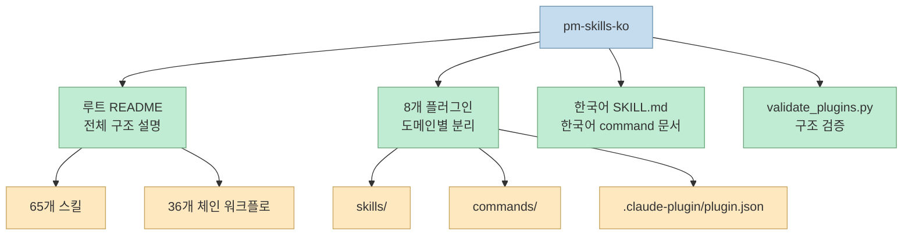
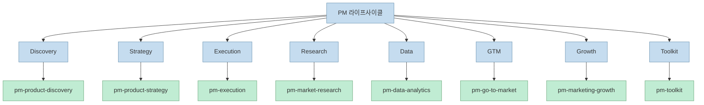
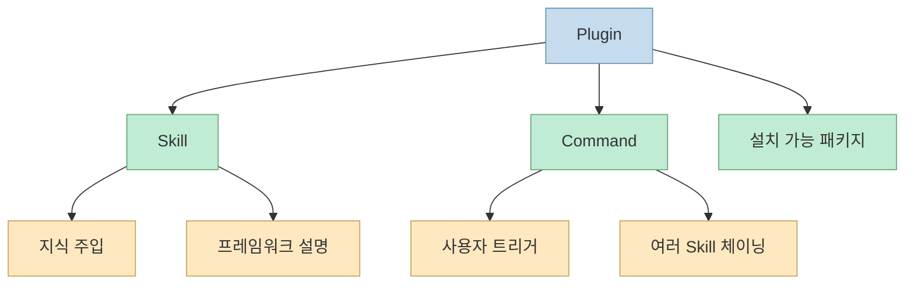
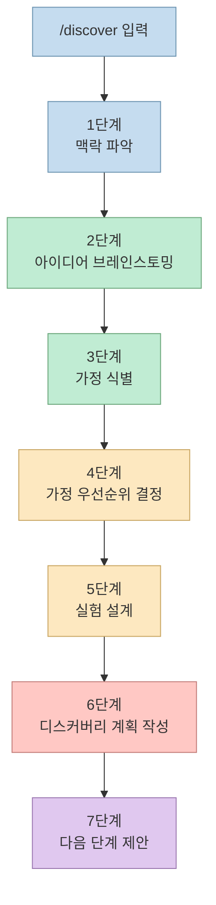
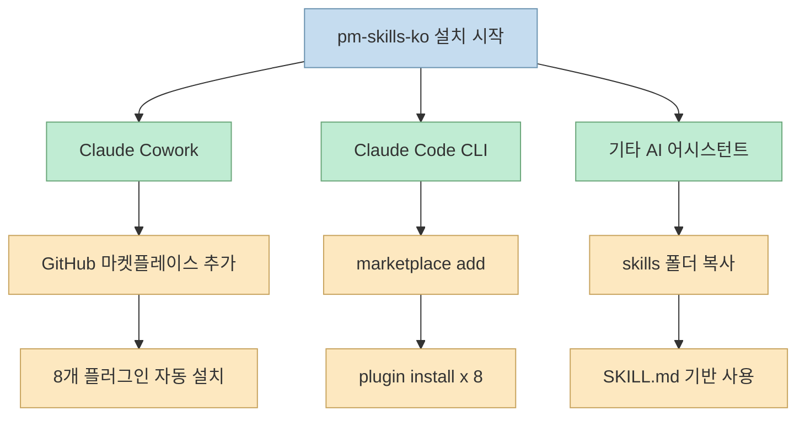
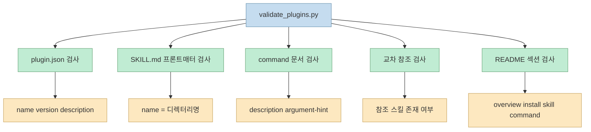

`lucas-flatwhite/pm-skills-ko` 는 단순히 README만 한국어로 바꾼 저장소가 아닙니다. README, 플러그인 README, 커맨드 문서, SKILL 문서, 그리고 `validate_plugins.py` 까지 함께 보면, 이 저장소는 원본 `pm-skills` 를 한국어 사용자에게 바로 설치하고 실행할 수 있는 **플러그인 컬렉션**으로 재구성한 형태에 가깝습니다.

특히 흥미로운 지점은 세 가지입니다. 첫째, 루트 README가 전체 구조를 한 번에 설명하고, 둘째, 각 플러그인이 `skills/`, `commands/`, `.claude-plugin/plugin.json` 을 갖춘 독립 패키지처럼 정리되어 있으며, 셋째, 검증 스크립트가 이 구조가 실제 Claude Code 플러그인 규약에 맞는지 점검한다는 점입니다.

<!--more-->

## Sources

- https://github.com/lucas-flatwhite/pm-skills-ko
- https://raw.githubusercontent.com/lucas-flatwhite/pm-skills-ko/main/README.md
- https://raw.githubusercontent.com/lucas-flatwhite/pm-skills-ko/main/pm-product-discovery/README.md
- https://raw.githubusercontent.com/lucas-flatwhite/pm-skills-ko/main/pm-product-discovery/commands/discover.md
- https://raw.githubusercontent.com/lucas-flatwhite/pm-skills-ko/main/pm-product-discovery/skills/opportunity-solution-tree/SKILL.md
- https://raw.githubusercontent.com/lucas-flatwhite/pm-skills-ko/main/pm-product-discovery/.claude-plugin/plugin.json
- https://raw.githubusercontent.com/lucas-flatwhite/pm-skills-ko/main/pm-execution/README.md
- https://raw.githubusercontent.com/lucas-flatwhite/pm-skills-ko/main/validate_plugins.py

## 이 저장소를 "한국어 번역본" 이상으로 봐야 하는 이유

루트 README는 이 프로젝트를 **"8개 플러그인에 걸쳐 65개의 PM 스킬과 36개의 체인 워크플로우"** 로 소개합니다. 여기서 중요한 것은 번역 대상이 단순 설명문이 아니라, Claude Code와 Cowork에서 바로 호출되는 **스킬 + 커맨드 + 플러그인 구조 전체** 라는 점입니다.

또 README는 원본 저장소와 한국어 번역 저장소를 함께 명시합니다. 즉, 이 프로젝트의 핵심 가치는 "새로운 PM 프레임워크를 발명했다" 가 아니라, 원본 `pm-skills` 의 구조와 의도를 유지한 채 한국어 사용자가 바로 읽고 설치하고 실행할 수 있게 **현지화된 배포 형태** 를 만든 데 있습니다.

## 저장소 구조는 PM 업무 흐름 자체를 플러그인으로 쪼개 놓았다

README와 각 플러그인 README를 같이 보면 저장소는 PM 라이프사이클을 기준으로 나뉩니다. 예를 들어 `pm-product-discovery` 는 아이디에이션, 가정 검증, 인터뷰, OST를 다루고, `pm-execution` 은 PRD, OKR, 로드맵, 스프린트, 프리모템, 이해관계자 맵 같은 실행 단계의 산출물을 담당합니다.

이 분해 방식이 좋은 이유는 "스킬이 많다" 는 사실보다, **문제 공간을 플러그인 경계로 잘라 놨다** 는 데 있습니다. 디스커버리 단계에서 필요한 스킬과 실행 단계에서 필요한 스킬이 섞이지 않기 때문에, 사용자 입장에서는 어떤 도메인의 도구를 불러야 하는지 판단하기가 쉬워집니다.

이 구조는 README의 숫자만으로도 어느 정도 드러나지만, 플러그인 README를 보면 더 명확해집니다. `pm-product-discovery` 는 13개 스킬과 5개 커맨드, `pm-execution` 은 15개 스킬과 10개 커맨드를 명시합니다. 즉, 저장소는 "기능 목록"이 아니라 **업무 단계별 패키지 묶음** 으로 설계되어 있습니다.

## 핵심 단위는 SKILL 하나가 아니라 "Skill + Command + Plugin" 삼단 구조다

이 저장소를 읽을 때 가장 먼저 잡아야 하는 관점은 스킬 하나만 보면 전체가 안 보인다는 점입니다. README는 스킬을 기본 빌딩 블록으로, 커맨드를 사용자 트리거 워크플로로, 플러그인을 설치 가능한 패키지로 설명합니다.

샘플로 가져온 `pm-product-discovery/.claude-plugin/plugin.json` 을 보면 플러그인 메타데이터는 `name`, `version`, `description`, `author`, `keywords`, `homepage`, `license` 를 포함합니다. 반면 `opportunity-solution-tree/SKILL.md` 는 YAML 프론트매터에 `name` 과 `description` 을 두고, 그 아래에서 Teresa Torres의 OST 구조와 사용 지침을 설명합니다. 그리고 `commands/discover.md` 는 또 다른 프론트매터와 함께 여러 스킬을 어떤 순서로 연결할지 정의합니다.

즉, 각 레이어의 역할이 분명합니다.

- **Plugin**: 설치와 배포의 단위
- **Skill**: 특정 PM 작업을 위한 지식과 절차의 단위
- **Command**: 여러 스킬을 실제 사용자 흐름으로 묶는 실행 단위

이 삼단 구조 덕분에 저장소는 단순 프롬프트 모음집보다 훨씬 재사용성이 높습니다. 스킬은 독립적으로 읽히고, 커맨드는 그 스킬들을 묶고, 플러그인은 그것을 배포 가능한 단위로 감쌉니다.

## `/discover` 하나만 봐도 이 저장소가 "템플릿"이 아니라 "프로세스"라는 걸 알 수 있다

가장 좋은 예시는 `pm-product-discovery/commands/discover.md` 입니다. 이 문서는 `/discover` 를 단순 단일 프롬프트로 다루지 않고, 7단계 워크플로로 정의합니다.

문서에 따르면 `/discover` 는 먼저 기존 제품인지 신규 제품인지 맥락을 파악하고, 그다음 브레인스토밍, 가정 식별, 가정 우선순위 결정, 실험 설계, 디스커버리 계획 문서화, 다음 단계 제안 순으로 이어집니다. 이 흐름은 "아이디어를 내줘" 수준이 아니라, **디스커버리 작업을 PM식 절차로 밀어 넣는 실행 틀** 에 가깝습니다.

이 구조는 README의 "일반 AI는 텍스트를 주고, PM Skills는 구조를 준다" 는 문장을 구체적으로 증명합니다. 저장소가 제공하는 것은 결과물 한 덩어리가 아니라, **질문-판단-우선순위-실험** 이라는 PM 의사결정 순서를 강제하는 인터페이스입니다.

## 한국어판의 실질적인 가치는 "읽을 수 있음"보다 "그대로 실행할 수 있음"에 있다

한국어판의 가장 현실적인 장점은 설명문만 한국어인 것이 아니라, 플러그인 README와 SKILL.md, command 문서까지 한국어로 읽힌다는 데 있습니다. 예를 들어 `opportunity-solution-tree/SKILL.md` 는 Desired Outcome, Opportunities, Solutions, Experiments의 4단 구조를 한국어 설명과 함께 그대로 제공합니다.

이게 중요한 이유는 PM 프레임워크가 원래도 용어 의존성이 강하기 때문입니다. OST, JTBD, North Star, Pretotype 같은 개념은 단어를 안다고 바로 쓰기 어렵습니다. 그런데 이 저장소는 각 개념을 한국어로 설명하면서도, 문서 안에 **입력 요구 사항**, **실행 단계**, **출력 기대치** 를 함께 배치합니다. 즉, 번역이 단순 해설문이 아니라 **실행 가능한 작업 문서의 번역** 인 셈입니다.

또한 설치 경로도 한국어 사용자에게 맞춰 정리돼 있습니다. README는 Claude Cowork에서는 GitHub 마켓플레이스를 추가하면 8개 플러그인이 자동 설치된다고 설명하고, Claude Code CLI에서는 `claude plugin marketplace add lucas-flatwhite/pm-skills-ko` 이후 개별 플러그인을 설치하도록 안내합니다. 그리고 다른 AI 어시스턴트에 대해서는 `skills/*/SKILL.md` 가 범용 형식이므로 각 도구의 skills 디렉터리로 복사하면 된다고 안내합니다.

여기서 드러나는 핵심은 이 저장소가 한국어 PM 사용자에게 "번역문 제공"보다 한 단계 더 나아가, **도구별 설치 경로까지 포함한 운영 문서** 를 제공한다는 점입니다.

## 번역 품질을 넘어 플러그인 품질까지 체크하려는 흔적이 있다

`validate_plugins.py` 는 이 저장소가 단순 콘텐츠 번역 레벨에 머물지 않는다는 가장 강한 신호입니다. 이 스크립트는 각 플러그인에 대해 다음 항목을 검사합니다.

- `.claude-plugin/plugin.json` 의 필수 필드
- 스킬 문서의 YAML 프론트매터와 `name` / `description`
- 커맨드 문서의 프론트매터와 `argument-hint`
- 커맨드가 참조하는 스킬이 실제 같은 플러그인에 존재하는지 여부
- README 존재 여부와 주요 섹션 포함 여부

스크립트 상단 주석은 이 검증이 Anthropic의 plugin-dev README, agentskills.io 스펙, Claude Code plugin reference 를 기준으로 한다고 밝힙니다. 즉, 이 저장소는 "번역이 잘 되었는가" 만이 아니라 **플러그인 컬렉션으로서 깨지지 않는가** 를 함께 보려는 구조를 갖고 있습니다.

그리고 샘플 `plugin.json` 이 원작자 Paweł Huryn의 이름, 이메일, 홈페이지, MIT 라이선스를 그대로 유지하고 있다는 점도 중요합니다. 한국어판이 독자적으로 원작자를 가리기보다, **배포 단위 안에 저작권과 출처를 계속 남기는 방식** 으로 구성되어 있기 때문입니다.

## 실제로 도입할 때 기억해야 할 제한도 분명하다

README는 다른 AI 어시스턴트에서도 스킬 자체는 복사해서 사용할 수 있다고 안내하지만, 동시에 **커맨드(`/slash-commands`)는 Claude 전용** 이라고 분명히 적습니다. 이 말은 곧, 저장소의 가치를 100% 활용하려면 Claude 계열 플러그인/커맨드 시스템이 있는 환경이 가장 적합하다는 뜻입니다.

또 `/discover` 문서를 보면 결과물을 즉시 단정하지 않고 중간 체크포인트를 둡니다. 예를 들어 브레인스토밍 후에는 어떤 아이디어를 더 검증할지 고르게 하고, 가정 우선순위 단계 이후에는 무엇을 먼저 검증할지 다시 판단하게 합니다. 즉, 이 저장소는 PM 판단을 없애는 자동화 도구가 아니라, **판단 순서를 구조화하는 도구** 에 더 가깝습니다.

이 점은 도입 가이드에서 오히려 장점입니다. 무턱대고 답을 내놓는 PM 도우미보다, 질문과 검증을 순서대로 밀어주는 시스템이 실제 팀 워크플로에는 더 잘 맞기 때문입니다.

## 핵심 요약

| 항목 | 내용 |
| --- | --- |
| **저장소 성격** | 원본 `pm-skills` 를 한국어 사용자용 플러그인 컬렉션으로 옮긴 저장소 |
| **핵심 규모** | 8개 플러그인, 65개 스킬, 36개 체인 워크플로 |
| **핵심 구조** | Plugin(배포) + Skill(지식/절차) + Command(실행 흐름) |
| **대표 예시** | `/discover` 는 맥락 파악 → 브레인스토밍 → 가정 식별 → 우선순위 → 실험 → 계획 작성까지 연결 |
| **한국어판 가치** | README가 아니라 SKILL.md, command 문서, 설치 가이드까지 한국어로 제공 |
| **호환성** | Claude Cowork, Claude Code CLI 중심이며, 다른 도구는 스킬 복사 방식으로 일부 활용 가능 |
| **품질 장치** | `validate_plugins.py` 가 플러그인 메타데이터, 프론트매터, 교차 참조, README 섹션을 검사 |
| **출처/저작권 처리** | 샘플 `plugin.json` 은 원작자 정보와 MIT 라이선스를 유지 |

## 결론

`pm-skills-ko` 의 진짜 가치는 "PM 프레임워크를 한국어로 읽을 수 있다" 에서 끝나지 않습니다. 이 저장소는 원본 `pm-skills` 의 구조를 유지한 채, 한국어 문서화, 설치 경로, 플러그인 메타데이터, 검증 스크립트까지 함께 묶어 **바로 운영 가능한 한국어 PM 스킬 마켓플레이스** 로 만든 사례에 가깝습니다.

그래서 이 저장소는 번역 저장소이면서 동시에 좋은 레퍼런스 저장소이기도 합니다. Claude용 스킬 컬렉션을 다른 언어권이나 다른 조직 맥락으로 옮겨야 한다면, `pm-skills-ko` 는 무엇을 번역해야 하는지보다 **무엇을 구조로 유지해야 하는지** 를 먼저 보여주는 예시입니다.
