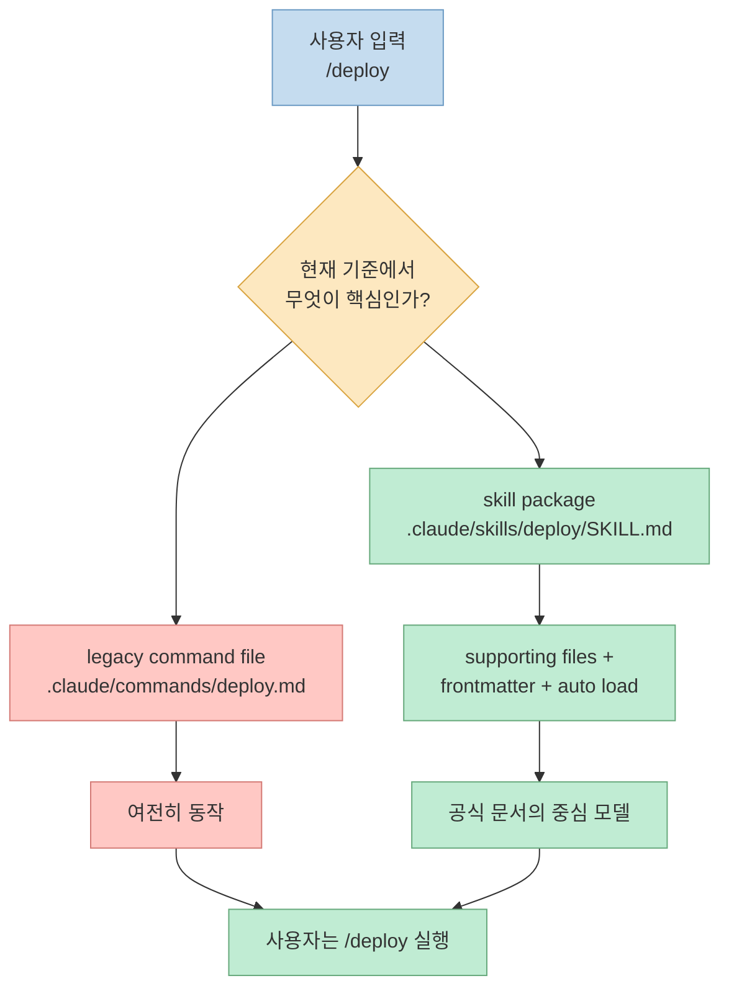
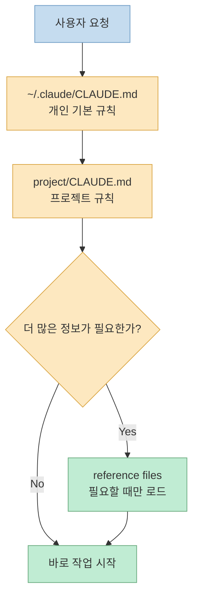
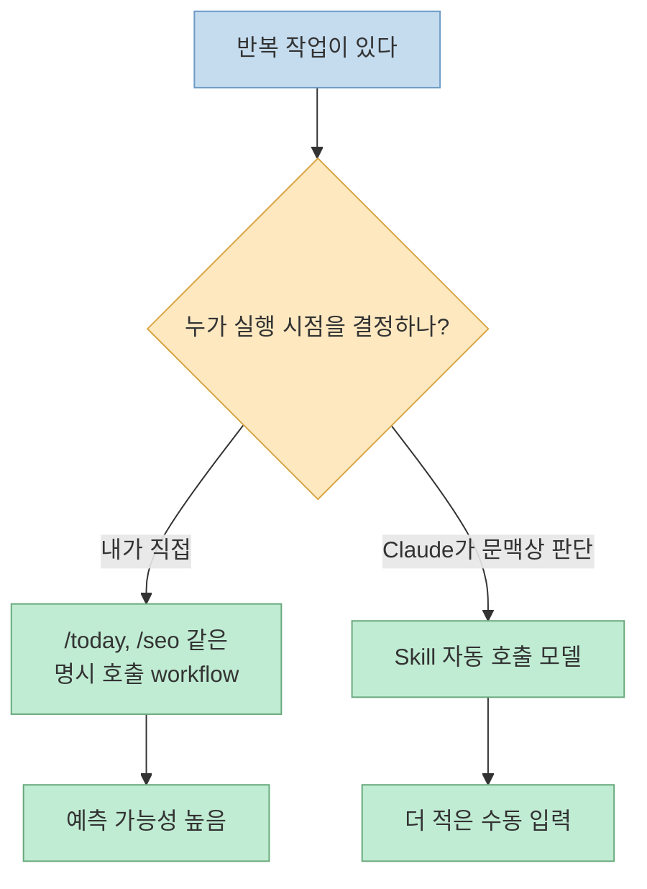
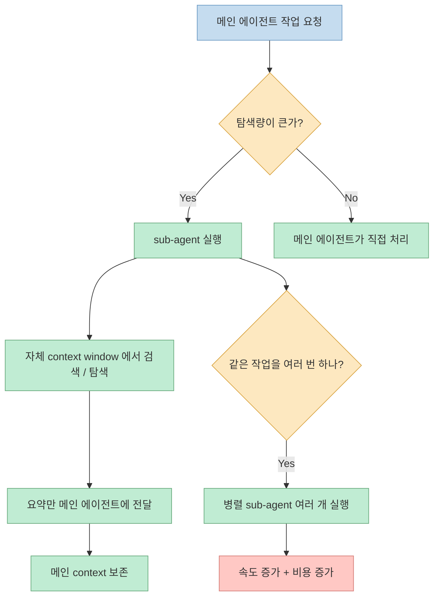
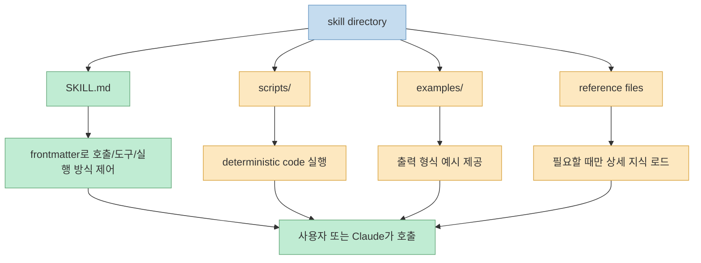
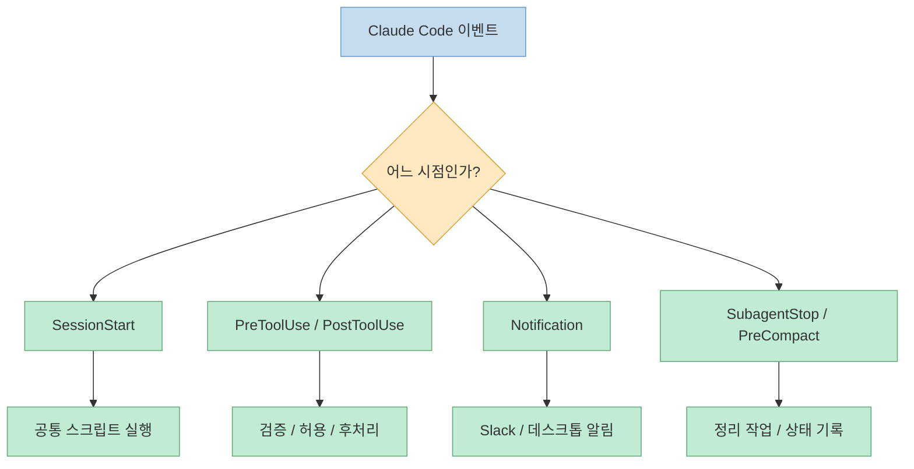
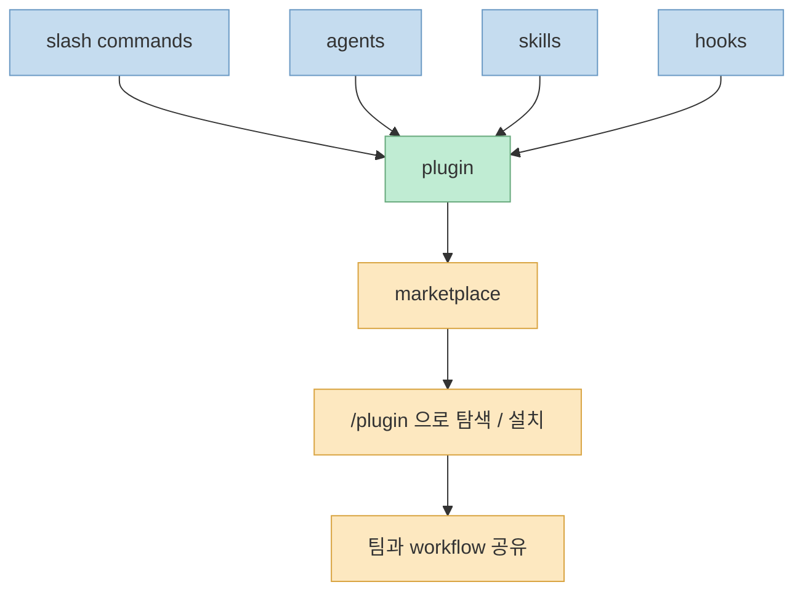

ProductTalk의 글은 Claude Code를 이루는 building block을 6개로 나눠 설명합니다. Markdown files, slash commands, agents, skills, hooks, plugins를 각각 언제 써야 하는지 사용자 관점에서 매우 잘 정리한 글입니다. 특히 "무엇을 어떤 상황에서 꺼내 써야 하는가"라는 실전 감각을 잡는 데 도움이 됩니다.

다만 한 가지는 반드시 최신 기준으로 보정해서 읽어야 합니다. ProductTalk 글은 slash commands를 독립 기능처럼 설명하지만, 현재 Anthropic 공식 문서는 **"Custom commands have been merged into skills"** 라고 명시합니다. 즉 지금은 "슬래시 커맨드 vs 스킬"을 완전히 분리해서 보기보다, **사용자가 `/` 로 호출하는 표면과 Skill 기반 실행 모델이 점점 하나로 합쳐지는 중** 이라고 이해하는 편이 더 정확합니다.

<!--more-->

## Sources

- https://www.producttalk.org/how-to-use-claude-code-features/
- https://code.claude.com/docs/en/slash-commands

## 1) 먼저 모델부터 바로잡기: 지금은 "slash commands" 보다 "skills" 중심으로 봐야 한다

ProductTalk 글은 slash commands를 "저장된 프롬프트와 절차의 단축키"로 설명합니다. 이 설명은 아직도 사용자 경험 차원에서는 유효합니다. 정기적으로 반복하는 작업을 `/today`, `/headlines`, `/seo` 처럼 명시적으로 부를 수 있다는 감각은 여전히 중요하기 때문입니다.

하지만 공식 문서는 더 이상 그 모델에서 멈추지 않습니다. 현재 `https://code.claude.com/docs/ko/slash-commands` 의 실제 페이지 제목은 **"Claude를 skills로 확장하기"** 이고, 첫머리에서 `SKILL.md` 파일을 만들면 Claude가 toolkit에 추가하고 관련 상황에서 자동으로 쓰거나 `/skill-name` 으로 직접 호출할 수 있다고 설명합니다. 즉 공식 모델의 중심은 이미 **Skill** 입니다.

결정적인 문장은 이것입니다. 공식 문서는 **"사용자 정의 명령어와 번들 skills를 포함합니다"** 라고 못 박습니다. 예전 `.claude/commands/deploy.md` 와 `.claude/skills/deploy/SKILL.md` 가 모두 `/deploy` 를 만들 수 있고, 기존 command 파일도 계속 동작하지만, Skills 쪽이 supporting files, frontmatter 제어, 자동 로딩 같은 기능을 더 제공합니다.

다만 이 문장을 너무 넓게 해석하면 안 됩니다. 공식 문서는 같은 페이지에서 `/help`, `/compact` 같은 built-in commands 는 별도 reference를 보라고 분리합니다. 즉 지금 Claude Code의 `/` 체계는 크게 두 층입니다. **built-in commands는 그대로 존재하고**, 사용자가 직접 만들거나 확장하는 custom slash workflow는 skills 쪽으로 수렴하고 있다고 보는 편이 정확합니다.

이 차이를 실무적으로 번역하면 다음과 같습니다.

- 예전 mental model: slash command = 저장된 prompt file
- 현재 official model: slash command = Skill을 부르는 사용자 인터페이스까지 포함한 표면
- 실제 확장 포인트: Skill 디렉터리, `SKILL.md`, supporting files, frontmatter, subagent 설정

그래서 이 글에서는 ProductTalk의 6개 building block 구분을 그대로 가져오되, slash commands 섹션은 최신 공식 문서 기준으로 다시 해석하겠습니다. 핵심은 "slash command가 사라졌다"가 아니라, **Custom Command 중심 설명만으로는 이제 Claude Code를 제대로 이해하기 어렵다** 는 점입니다.

## 2) Markdown files: Claude에게 장기 기억과 작업 맥락을 주는 가장 기본적인 레이어

ProductTalk가 첫 번째 building block으로 꼽는 것은 Markdown files 입니다. 이건 화려한 기능처럼 보이지 않지만, 실제로는 Claude Code 활용의 바닥을 깔아 주는 가장 중요한 요소입니다. 글의 표현을 빌리면, Claude가 나와 내 프로젝트, 내 작업 방식에 대해 더 많이 알수록 더 잘 도와줄 수 있기 때문입니다.

글은 특히 browser-based chat과의 차이를 강조합니다. 웹에서는 대화가 매번 새로 시작되기 때문에 파일 업로드/다운로드, 프로젝트 선택, 복붙이 반복됩니다. 반면 Claude Code는 파일 시스템에 직접 접근할 수 있으니, 대화에서 쌓인 맥락과 규칙을 markdown 파일로 저장해 다시 불러올 수 있습니다.

ProductTalk 글이 요약하는 핵심 메모리 구조는 3층입니다.

- `~/.claude/CLAUDE.md`: 모든 대화에 적용되는 개인 기본 설정
- `project/CLAUDE.md`: 프로젝트별 규칙과 선호
- reference files: 필요할 때만 불러오는 추가 문서

여기서 중요한 것은 **많이 넣는 것** 이 아니라 **필요한 것만 넣는 것** 입니다. ProductTalk도 CLAUDE.md 에 너무 많은 맥락을 몰아넣지 말라고 경고합니다. 항상 필요한 규칙만 CLAUDE.md 에 두고, 세부 배경 자료는 reference file로 분리해야 한다는 뜻입니다.

이 building block이 좋은 이유는 단순합니다. Claude를 더 똑똑하게 만드는 것이 아니라, **작업 시작 비용을 줄여 주기** 때문입니다. 매번 "나는 이런 톤으로 글을 쓰고, 이 프로젝트는 이런 구조고, 이 파일은 이런 목적이야"를 다시 설명하지 않아도 되면, 더 짧은 프롬프트로도 더 나은 결과가 나옵니다.

언제 써야 하냐고 묻는다면 답은 명확합니다. 반복해서 설명하는 프로젝트 배경, 작성 스타일, 도메인 규칙, 파일 참조 경로가 있을 때는 markdown files가 가장 먼저입니다. 반대로 "이번 한 번만 필요한 일회성 지시"까지 CLAUDE.md 에 넣기 시작하면, 기억 시스템이 아니라 잡동사니 창고가 됩니다.

## 3) Slash commands: 반복 작업을 내가 명시적으로 꺼내 쓰는 가장 쉬운 표면

ProductTalk는 slash commands를 "stored prompts and procedures" 의 단축키로 설명합니다. 이 정의가 여전히 좋은 이유는, 실제 사용자의 체감과 잘 맞기 때문입니다. 매일 반복하는 작업이 있고, 그때마다 내가 **정확히 이 workflow를 지금 실행해라** 라고 지시하고 싶다면 slash command만큼 직관적인 것이 없습니다.

글에서 나오는 `/today`, `/headlines`, `/seo`, `/competitive-research` 예시를 보면 이 차이가 선명합니다. `/headlines` 는 비교적 가벼운 브레인스토밍 작업이고, `/seo` 는 글 분석, 키워드 변형 생성, API 조회, 개선안 도출까지 이어지는 훨씬 복잡한 절차입니다. 즉 slash command는 단순 저장 프롬프트부터 꽤 긴 procedure까지 모두 담을 수 있습니다.

ProductTalk 글은 여기서 slash commands의 용도를 분명하게 짚습니다. "정기적으로 반복하고, 내가 직접 호출하고 싶고, Claude가 무엇을 언제 할지 내가 통제하고 싶을 때" slash commands가 좋다는 것입니다. 다시 말해 slash commands는 **수동 트리거형 자동화** 에 적합합니다.

다만 여기서 공식 문서 보정이 필요합니다. ProductTalk는 slash commands를 `~/.claude/commands/` 또는 `project/.claude/commands/` 에 저장되는 독립 building block처럼 설명하지만, Anthropic 공식 문서는 기존 `.claude/commands/` 파일이 계속 동작하는 것은 맞더라도 **새 모델의 중심은 Skill** 이라고 말합니다. 즉 지금은 slash command를 "직접 호출하는 사용자 인터페이스"로, Skill을 "그 뒤의 실행 단위"로 같이 이해하는 편이 좋습니다.

그래서 실전 판단은 이렇게 나누면 편합니다.

- 매일 쓰는 명시적 workflow: slash command처럼 `/name` 으로 부른다
- 그 workflow를 더 강하게 구조화하고 싶다: Skill로 승격한다
- Claude가 문맥상 알아서 쓰게 하고 싶다: Skill description과 frontmatter로 자동 호출 가능성을 연다

결론적으로 slash commands는 아직도 유용합니다. 하지만 이제는 "command 파일을 더 만들까?"보다 **"이 explicit workflow를 Skill 기반으로 어떻게 재설계할까?"** 를 먼저 고민하는 시대에 더 가깝습니다.

## 4) Agents: 컨텍스트 윈도우를 비우고, 같은 작업을 병렬로 돌리는 가속 장치

ProductTalk가 agents에서 가장 강조하는 것은 멋진 자율성보다 **컨텍스트 관리** 와 **병렬 실행** 입니다. 이 관점이 좋은 이유는 agents를 환상적으로 보지 않게 해 주기 때문입니다. 무엇이든 해결하는 마법 도우미가 아니라, main agent 대신 별도 컨텍스트에서 일하고 요약을 돌려주는 작업자라고 보면 훨씬 정확합니다.

ProductTalk 글은 Claude Code 안의 에이전트를 세 가지로 나눕니다.

1. Claude 자체
2. Claude가 필요할 때 띄우는 sub-agent
3. 사용자가 설계한 user-defined sub-agent

그리고 sub-agent가 하는 핵심 일은 두 가지라고 설명합니다.

- main context window를 더럽히지 않기
- 비슷한 작업을 여러 개 동시에 처리하기

이건 실제로 매우 중요합니다. 웹 검색, 코드베이스 탐색, 긴 문서 훑기 같은 작업을 main agent가 직접 하면 검색 결과와 중간 로그가 다 main context에 쌓입니다. ProductTalk가 지적하듯 context window가 커질수록 성능이 떨어질 수 있으므로, 탐색성 작업은 sub-agent에 넘기고 main agent는 요약만 받는 구조가 품질 유지에 유리합니다.

병렬성도 마찬가지입니다. 경쟁사 15곳 조사, 논문 여러 섹션 요약, 기사 여러 단락 fact-check 같은 작업은 순차보다 병렬이 훨씬 빠릅니다. 대신 ProductTalk는 토큰과 사용량이 빠르게 늘 수 있다고 경고합니다. 즉 agents는 **속도와 컨텍스트 품질을 사는 대신 비용을 더 쓰는 버튼** 입니다.

언제 써야 하냐고 묻는다면 답은 분명합니다. 대량 탐색, 병렬 조사, 요약 위임, 리뷰 분산, fact-check 분산이 필요할 때 agents가 강합니다. 반대로 아주 짧고 단순한 작업까지 다 agent로 쪼개면 오히려 오버헤드가 생깁니다.

## 5) Skills: prompt, context, code를 함께 묶는 휴대 가능한 패키지

ProductTalk는 skills를 "slash commands 같은 prompt/procedure를 담되, Claude가 직접 호출할 수도 있고, scripts도 묶을 수 있는 패키지"로 설명합니다. 그리고 이 점 때문에 web, desktop, Claude Code 사이를 가로질러 재사용할 수 있는 building block이라고 봅니다. 팀이 workflow를 공유하려 할 때 특히 매력적인 모델입니다.

공식 문서까지 함께 읽으면 skills의 의미가 더 선명해집니다. Anthropic는 skills를 단순 md 파일이 아니라 `SKILL.md` 를 entrypoint로 하는 디렉터리 단위로 설명합니다. 그리고 그 안에 supporting files, examples, scripts, reference docs를 둘 수 있게 설계합니다. 즉 skills는 재사용 prompt라기보다 **작은 workflow package** 에 가깝습니다.

또 공식 문서는 Skills가 legacy commands보다 더 많은 제어를 준다고 설명합니다.

- `disable-model-invocation`: Claude 자동 호출 금지
- `user-invocable`: `/` 메뉴 노출 여부 제어
- `allowed-tools`: 사용할 도구 제한
- `context: fork`: subagent 실행
- `agent`: 어떤 agent 타입으로 돌릴지 지정

이 frontmatter가 중요한 이유는, skills가 이제 단순 문서가 아니라 **호출 정책 + 실행 정책** 을 가진 객체가 됐기 때문입니다.

ProductTalk는 여기서 약간 회의적인 경험도 같이 공유합니다. 이론상 Claude가 자동으로 skills를 잘 써야 하지만, 실제로는 원하는 타이밍에 항상 잘 발동하지 않아 저자가 결국 `/process-notes` 같은 explicit command를 따로 만든 사례를 이야기합니다. 이 점도 중요합니다. skills는 강력하지만, 자동 발동 UX는 여전히 운영과 실험이 필요한 영역이라는 뜻입니다.

정리하면 skills는 언제 쓰면 좋을까요? 팀과 공유할 수 있는 재사용 workflow가 필요하고, scripts까지 묶고 싶고, web/desktop/CLI를 가로질러 같은 작업 단위를 쓰고 싶을 때 가장 빛납니다. 반대로 "내가 명령 시점을 완전히 통제하고 싶다"면 explicit slash command 감각이 여전히 더 편할 수 있습니다.

## 6) Hooks: LLM의 가변성을 줄이고 반드시 실행되는 자동화를 붙이는 장치

ProductTalk가 hooks를 설명하는 방식은 아주 실용적입니다. LLM은 같은 지시를 받아도 매번 조금씩 다르게 수행할 수 있는데, 어떤 작업은 그렇게 하면 안 됩니다. 항상 같은 시점에, 같은 방식으로, 빠짐없이 실행되어야 하는 일이 있습니다. 그때 필요한 것이 hooks 입니다.

ProductTalk는 hook 종류를 꽤 자세히 나열합니다. `PreToolUse`, `PermissionRequest`, `PostToolUse`, `UserPromptSubmit`, `Notification`, `Stop`, `SubagentStop`, `PreCompact`, `SessionStart`, `SessionEnd` 같은 이벤트에 deterministic code를 연결할 수 있다고 설명합니다. 즉 hooks는 prompt engineering이 아니라 **event-driven automation** 입니다.

저자가 드는 예시도 실용적입니다. 날짜 계산 스크립트를 `/today` 나 `/generate-research-digest` 안에서 반복 실행하는 대신, Tasks 폴더 세션이 시작될 때 자동 실행되는 `SessionStart` hook으로 옮길 수 있다고 설명합니다. 이 패턴의 핵심은 공통 전처리를 command마다 복붙하지 않는 것입니다.

hooks의 용도는 크게 네 가지로 요약할 수 있습니다.

- 세션 시작 시 공통 컨텍스트/스크립트 주입
- tool 실행 전후 강제 검증
- 알림 전달 자동화
- subagent 종료나 compact 직전 같은 이벤트 대응

언제 hooks를 써야 할까요? "Claude가 가끔은 하고 가끔은 안 해도 되는 일"이 아니라, **항상 같은 타이밍에 반드시 실행되어야 하는 일** 이 있을 때입니다. 즉 hooks는 creativity가 아니라 consistency를 위해 씁니다.

## 7) Plugins: 내가 만든 workflow를 다른 사람도 설치해서 쓰게 만드는 배포 포맷

ProductTalk는 plugins와 marketplaces가 처음 보면 매우 헷갈리는 개념이라고 솔직하게 말합니다. 그런데 실제 의미는 생각보다 단순합니다. plugin은 slash commands, agents, skills, hooks 같은 building block을 묶은 꾸러미이고, marketplace는 그런 plugin들을 모아 둔 출처입니다.

글은 기술적으로 plugin과 marketplace가 결국 public Git repository 위에 서 있다고 설명합니다. Claude Code는 여기에 `/plugin` 인터페이스를 얹어, 내부에서 marketplace를 추가하고 discover 탭으로 plugin을 탐색할 수 있게 만든 셈입니다. Anthropic의 공개 marketplace를 `/plugin marketplace add anthropics/claude-plugins-official` 로 붙이는 예시도 소개합니다.

plugin이 좋은 이유는 배포 단위가 되기 때문입니다. 나만 쓰는 `/seo` 나 개인 hooks를 넘어, 팀 전체가 같은 workflow 묶음을 설치하게 만들 수 있습니다. 즉 plugin은 building block 자체라기보다 **building block distribution layer** 에 가깝습니다.

다만 ProductTalk가 강하게 경고하는 부분도 중요합니다. plugin 안에는 skills와 hooks를 통해 code가 포함될 수 있으니, 모르는 코드를 그대로 설치해 실행해서는 안 됩니다. 공유 편의성은 높지만, 그만큼 검토 책임도 커집니다.

## 8) 그래서 어떤 상황에서 무엇을 써야 할까

여기까지를 한 줄씩 다시 실무 언어로 번역하면 아래와 같습니다.

| building block | 언제 쓰면 좋은가 | 핵심 장점 | 주의할 점 |
| --- | --- | --- | --- |
| Markdown files | 프로젝트 맥락과 규칙을 오래 유지하고 싶을 때 | 매번 설명하는 비용 감소 | CLAUDE.md 과적재 금지 |
| Slash commands | 내가 직접 반복 workflow를 실행하고 싶을 때 | 예측 가능성, 명시적 통제 | 이제는 Skill 모델과 함께 봐야 함 |
| Agents | 탐색량이 많거나 병렬화가 필요할 때 | context 보호, 속도 향상 | 토큰/사용량 증가 |
| Skills | prompt + context + code를 패키지로 공유하고 싶을 때 | 휴대성, 자동 호출 가능성, 스크립트 번들 | 자동 발동 품질은 아직 운영이 필요 |
| Hooks | 반드시 같은 시점에 동일하게 실행돼야 할 일이 있을 때 | deterministic automation | 잘못 걸면 전역 부작용 |
| Plugins | workflow 묶음을 다른 사람과 공유할 때 | 설치/배포 단위 | 포함 코드 리뷰 필요 |

제가 보기에는 ProductTalk 글의 가장 큰 장점은 이 선택 기준을 사용자 친화적으로 설명한다는 데 있습니다. 그리고 최신 공식 문서를 덧붙이면, 그 선택 기준은 이제 한 단계 더 단순해집니다. 즉 "slash command를 만들까? skill을 만들까?"보다 먼저 **"이 workflow를 명시 호출형으로 둘지, skill 패키지로 올릴지, hook으로 강제할지, agent로 분산할지"** 를 고르는 식으로 사고해야 합니다.

## 핵심 요약

- ProductTalk의 6개 분류는 Claude Code를 처음 구조적으로 이해하는 데 매우 좋은 입문 프레임입니다.
- Markdown files는 기억과 맥락, slash commands는 명시 호출형 반복 작업, agents는 context 관리와 병렬화, hooks는 deterministic automation, plugins는 공유와 배포를 맡습니다.
- 최신 공식 문서 기준으로는 **Custom commands가 skills와 통합** 되었으므로, slash commands를 독립 개념으로만 이해하면 최신 모델을 놓치게 됩니다.
- 지금은 slash command를 "사용자 입력 표면", Skill을 "workflow package" 로 함께 보는 편이 가장 정확합니다.
- Skills의 강점은 supporting files, scripts, frontmatter, cross-platform portability에 있고, hooks의 강점은 반드시 실행되는 이벤트 자동화에 있습니다.
- 결국 Claude Code의 building block은 경쟁 관계가 아니라 조합 관계입니다. 좋은 workflow는 이들을 적절히 섞어 만듭니다.

## 결론

ProductTalk 글을 읽고 나면 Claude Code의 기능 지형도가 한 번에 잡힙니다. 그리고 Anthropic의 최신 공식 문서를 함께 읽으면 그 지형도 위에서 무엇이 중심축으로 이동하고 있는지도 보입니다. 지금의 중심축은 분명 slash commands 자체보다 **skills-first execution model** 쪽입니다.

그래서 앞으로 Claude Code를 설계할 때는 이렇게 묻는 편이 좋습니다. "이 기능이 slash command냐 skill이냐"보다 **"이 작업은 기억으로 해결할까, 명시 호출형 workflow로 둘까, agent로 분산할까, skill package로 승격할까, hook으로 강제할까, plugin으로 배포할까"** 를 먼저 고르는 것입니다. 그 질문에 익숙해질수록 Claude Code는 단순한 채팅 도구가 아니라, 꽤 정교한 작업 운영체제로 바뀌기 시작합니다.
