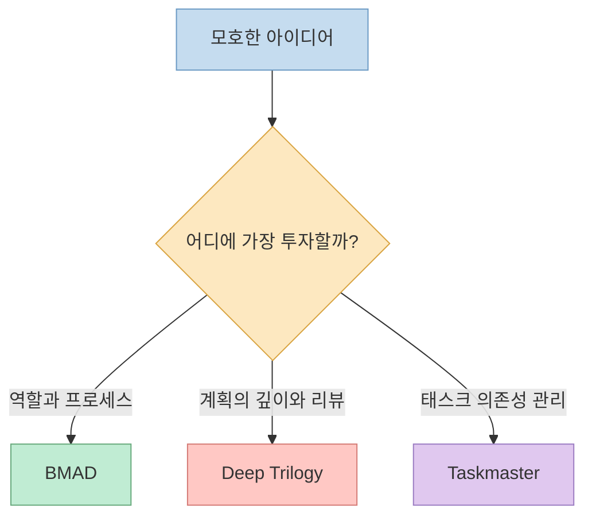
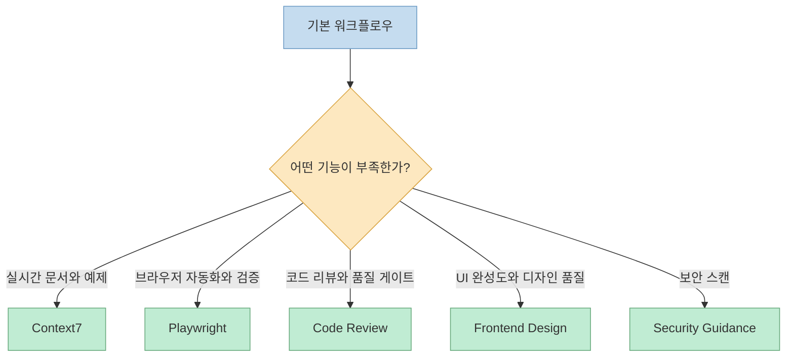
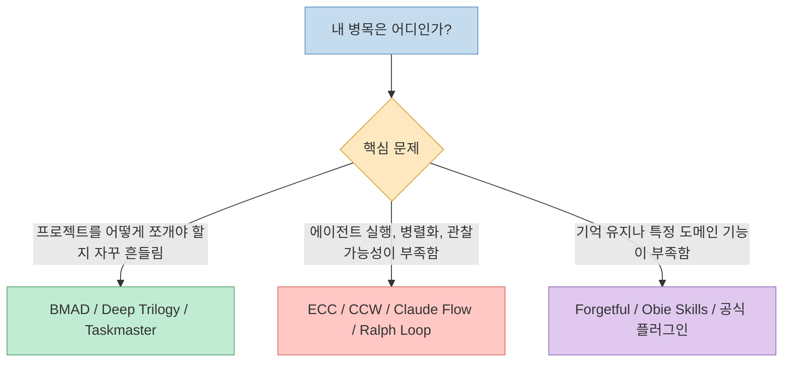

Claude Code 생태계를 조금만 깊게 파고들면 금방 비슷한 질문에 부딪힌다. `GSD`, `oh-my-claudecode`, `Superpowers` 말고도 쓸 만한 프레임워크가 이렇게 많은데, **도대체 무엇이 무엇을 대신하는지** 가 잘 보이지 않는다.

핵심은 "최고의 프레임워크 하나"를 찾는 것이 아니다. 각 시스템은 **프로젝트를 어떻게 분해하는지**, **실행을 어떻게 오케스트레이션하는지**, **부족한 기능을 어떤 스킬과 도구로 메우는지** 에서 차이가 난다.

이 글은 그 관점에서 비슷한 계열의 10가지를 한 번에 정리한다. 비교 기준은 `GSD`, `oh-my-claudecode`, `Superpowers` 이고, 이번 글에서 다루는 10개는 그 주변에서 자주 같이 거론되는 선택지들이다.

<!--more-->

## Sources

- [bmad-code-org/BMAD-METHOD](https://github.com/bmad-code-org/BMAD-METHOD)
- [piercelamb/deep-project](https://github.com/piercelamb/deep-project)
- [piercelamb/deep-plan](https://github.com/piercelamb/deep-plan)
- [piercelamb/deep-implement](https://github.com/piercelamb/deep-implement)
- [eyaltoledano/claude-task-master](https://github.com/eyaltoledano/claude-task-master)
- [affaan-m/everything-claude-code](https://github.com/affaan-m/everything-claude-code)
- [catlog22/Claude-Code-Workflow](https://github.com/catlog22/Claude-Code-Workflow)
- [ruvnet/ruflo](https://github.com/ruvnet/ruflo)
- [obie/skills](https://github.com/obie/skills)

## 먼저 지형부터 보면

```mermaid
flowchart TD
    A["프로젝트 분해와 기획 계층"] --> A1["BMAD"]
    A --> A2["Deep Trilogy"]
    A --> A3["Taskmaster"]

    B["오케스트레이션과 실행 계층"] --> B1["ECC"]
    B --> B2["CCW"]
    B --> B3["Claude Flow / Ruflo"]
    B --> B4["Ralph Loop"]

    C["특화 스킬과 보강 계층"] --> C1["Obie Skills"]
    C --> C2["Forgetful"]
    C --> C3["Anthropic 공식 플러그인"]

    D["비교 기준"] --> D1["GSD"]
    D --> D2["oh-my-claudecode"]
    D --> D3["Superpowers"]

    classDef planning fill:#c5dcef,stroke:#6b9ac4,color:#333
    classDef orchestration fill:#c0ecd3,stroke:#67a97c,color:#333
    classDef addons fill:#fde8c0,stroke:#d9a441,color:#333
    classDef baseline fill:#e0c8ef,stroke:#9b7cc2,color:#333

    class A,A1,A2,A3 planning
    class B,B1,B2,B3,B4 orchestration
    class C,C1,C2,C3 addons
    class D,D1,D2,D3 baseline
```

가장 먼저 해야 할 일은 이들을 한 줄로 세워 비교하지 않는 것이다. 실제로는 같은 층에 서 있는 도구들이 아니라, 서로 다른 계층에서 병목을 푸는 시스템에 가깝다.

이렇게 보면 구조가 단순해진다.

- `BMAD`, `Deep Trilogy`, `Taskmaster` 는 **무엇을 만들고 어떤 순서로 갈지** 를 더 잘 다룬다.
- `ECC`, `CCW`, `Claude Flow`, `Ralph Loop` 는 **어떻게 실행하고 어떻게 반복할지** 에 더 강하다.
- `Obie Skills`, `Forgetful`, 공식 플러그인 생태계는 **부족한 도메인 전문성이나 메모리, 브라우저, 리뷰 능력** 을 보강한다.

## 빠르게 훑는 10개 비교표

| 시스템 | 분류 | 가장 강한 지점 | 이런 사람에게 맞음 |
|------|------|----------------|--------------------|
| **BMAD Method** | 프로젝트 분해 | 역할 기반 가상 애자일 팀 | 큰 프로젝트를 역할 중심으로 운영하고 싶은 팀 |
| **Deep Trilogy** | 계획 파이프라인 | 아이디어 → 계획 → 구현 3단 분리 | 계획 품질과 외부 LLM 교차 검증이 중요한 팀 |
| **Claude Task Master** | 태스크 관리 | 의존성 그래프와 순차 실행 | 컨텍스트를 태스크 단위로 강하게 관리하고 싶은 팀 |
| **Everything Claude Code** | 실행 최적화 | 모델 라우팅, 규칙, 품질 강제 | Claude Code 하니스를 통째로 최적화하고 싶은 사용자 |
| **Claude-Code-Workflow** | 멀티 CLI 오케스트레이션 | 여러 CLI와 대시보드 기반 운영 | Gemini, Qwen, Codex까지 함께 쓰고 싶은 사용자 |
| **Claude Flow / Ruflo** | 스웜 실행 | 대규모 병렬 에이전트 실행 | 공유 메모리 기반 스웜을 원하는 엔터프라이즈 성향 팀 |
| **Ralph Loop** | 자율 루프 | 반복 실행과 컨텍스트 리셋 | 잘 정의된 PRD를 오래 돌려 결과를 뽑고 싶은 사용자 |
| **Obie Skills** | 도메인 스킬 | Rails/Ruby 등 특화 스킬 마켓 | 특정 생태계에 깊은 스킬이 필요한 팀 |
| **Forgetful** | 영속 메모리 | 세션 간 지식 유지 | 메모리 공유가 병목인 멀티 에이전트 환경 |
| **Anthropic 공식 플러그인** | 기능 블록 | 브라우저, 문서, 리뷰, 보안 등 단일 기능 강화 | 범용 프레임워크 위에 부족한 능력을 덧대고 싶은 사용자 |

## 1. 프로젝트 분해와 계획에 강한 계열

이 계열은 공통적으로 "바로 코딩하지 말고 먼저 구조를 세우자"는 철학을 가진다. 다만 깊이와 방식은 꽤 다르다.

### BMAD Method

BMAD는 12개 이상 전문 에이전트로 구성된 **가상 애자일 팀**에 가깝다. Analyst, PM, Architect, Scrum Master, Developer, QA처럼 역할이 분명하게 나뉘고, 프로젝트 라이프사이클 전체를 그 역할 분담 위에 얹는다.

초안에서 특히 눈에 띄는 포인트는 세 가지다.

- **Scale-Domain-Adaptive**: 작은 버그부터 엔터프라이즈 시스템까지 복잡도에 따라 접근을 조절한다.
- **Party Mode**: 여러 에이전트 페르소나를 한 세션에서 토론시키는 식의 활용이 가능하다.
- **역할 중심 운영**: GSD처럼 단계 중심으로 보기보다, 사람 조직을 시뮬레이션한 구조에 가깝다.

그래서 BMAD는 `GSD` 보다 더 **애자일 프로세스 자체** 를 전면에 내세운다. 반대로 소규모 프로젝트에서는 오버헤드가 쉽게 커질 수 있다.

### The Deep Trilogy

Deep Trilogy는 `deep-project`, `deep-plan`, `deep-implement` 로 이어지는 **3단 파이프라인**이다. 아이디어를 인터뷰와 분해로 정리하고, 그다음 계획을 깊게 만들고, 마지막에 구현으로 넘기는 구조가 선명하다.

이 계열의 가장 큰 차별점은 **Multi-LLM Review** 다. 계획 단계에서 Gemini나 ChatGPT 같은 외부 LLM에 독립 리뷰를 요청해 블라인드 스팟을 줄이는 접근이 핵심이다.

즉 이 시스템은 `Superpowers` 보다 더 **계획 단계의 깊이** 에 투자하고, `GSD` 보다 더 **외부 모델 교차 검증** 을 전면에 둔다. 품질을 높이기 좋은 대신, 속도와 단순함은 희생된다.

### Claude Task Master

Taskmaster는 이름 그대로 **AI 에이전트의 PM** 같은 위치다. PRD를 받아 태스크를 분해하고, 의존성 그래프를 만들고, 복잡도를 평가한 뒤 하나씩 넘겨 준다.

핵심 강점은 "무엇을 먼저 해야 하는가"를 자동으로 잡아 준다는 점이다.

- 의존성 체인을 정리해 실행 순서를 잡는다.
- 태스크를 하나씩 다루게 해서 컨텍스트를 깔끔하게 유지한다.
- Hooks로 다음 단계 진행을 자동화할 수 있다.

따라서 Taskmaster는 `oh-my-claudecode` 같은 실행 엔진의 대체재라기보다, 그 위나 앞단에서 붙는 **태스크 운영 계층** 으로 보는 편이 맞다.

## 2. 실행과 오케스트레이션에 강한 계열

이 그룹은 계획보다 **운영체계** 에 더 가깝다. 에이전트를 어떻게 나누고, 어떤 모델을 붙이고, 실패 시 어디로 되돌리고, 관찰가능성을 어떻게 확보할지가 핵심 질문이다.

### Everything Claude Code (ECC)

ECC는 단순한 스킬 모음이 아니라 **Claude Code 하니스 전체를 최적화하는 시스템** 으로 읽는 편이 맞다. 초안 기준으로 16개 에이전트, 65개 스킬, 40개 커맨드를 갖고 있고, Smart Model Routing, Continuous Learning, AgentShield, Plankton 통합 같은 요소가 묶여 있다.

요약하면 ECC는 이런 팀에 맞다.

- 복잡도에 따라 모델을 자동 라우팅하고 싶다.
- 보안 스캔과 품질 강제를 작업 흐름 안에 넣고 싶다.
- 장기 세션에서 메모리와 패턴 재사용을 자동화하고 싶다.

`GSD` 가 프로젝트 흐름을 정리한다면, ECC는 그 흐름이 올라가는 **실행 하니스의 성능과 규칙** 을 정리한다.

### Claude-Code-Workflow (CCW)

CCW는 JSON 기반 멀티 에이전트 케이던스와 멀티 CLI 오케스트레이션을 함께 가져간다. 자연어로 "Gemini로 분석해줘"처럼 말하면 적절한 CLI를 호출하는 **Semantic CLI Invocation** 과, 이벤트 기반 **Beat Model** 이 핵심이다.

즉 CCW는 `oh-my-claudecode` 와 가까운 영역에 서 있지만, 더 시각적이고 도구 통합적인 느낌이 강하다.

- Gemini, Qwen, Codex 같은 복수 CLI를 깊게 통합한다.
- Terminal Dashboard로 실행 상태를 시각적으로 모니터링한다.
- CodexLens 같은 로컬 시맨틱 검색 기능을 제공한다.

단점은 자연스럽다. 설치와 초기 셋업이 가볍지 않고, 시스템을 온전히 이해하려면 학습 비용이 든다.

### Claude Flow / Ruflo

Ruflo는 **멀티 에이전트 스웜 플랫폼** 으로 이해하면 된다. 64개 특화 에이전트, CRDT 기반 공유 메모리, Stream-JSON chaining, 30개 에이전트 병렬 실행 같은 요소는 분명히 엔터프라이즈 지향적이다.

이 시스템이 강한 곳은 명확하다.

- 병렬성이 매우 큰 작업
- 에이전트 간 지식 공유가 중요한 워크플로우
- 감사 추적과 관찰가능성이 중요한 환경

반대로 소규모 프로젝트에서 쓰면 `Superpowers` 나 `GSD` 보다 훨씬 무겁게 느껴질 가능성이 높다. 토큰 비용과 설정 비용 모두 큰 편이기 때문이다.

### Ralph Loop

Ralph Loop는 위 시스템들과 조금 결이 다르다. 핵심은 **루프 자체** 다. Git을 메모리 레이어처럼 쓰고, 반복마다 클린 컨텍스트를 확보하면서 작업을 계속 진행한다.

초안에서는 두 가지 변형이 대비된다.

- Bash 원본: 반복마다 새 Claude 프로세스를 스폰해 완전히 새 컨텍스트로 간다.
- 공식 플러그인: Stop Hook 기반으로 같은 세션 안에서 재진입한다.

그래서 Ralph는 `GSD` 같은 상위 파이프라인 안에 들어갈 수도 있고, `oh-my-claudecode` 같은 오케스트레이터의 한 모드처럼 붙을 수도 있다. 강점은 Context Rot 완화, 약점은 **잘 쓰인 PRD에 대한 높은 의존성** 이다.

## 3. 특화 능력을 덧붙이는 계열

이 그룹은 혼자서 전체 프레임워크를 대체하기보다, 기존 시스템의 빈 칸을 메운다. 그래서 실제 실무에서는 오히려 체감 가치가 아주 클 때가 많다.

### Obie Skills

Obie Skills는 Rails/Ruby 생태계를 중심으로 한 **도메인 특화 스킬 마켓**에 가깝다. `better-stimulus`, `mcp-oauth-setup` 같은 스킬처럼 범용 프레임워크가 잘 못하는 생태계별 깊이를 채우는 역할이다.

즉 이 프로젝트의 포인트는 "큰 프레임워크"가 아니라, **실전 검증된 특정 분야의 기술 지식 묶음** 이라는 점이다.

### Forgetful

Forgetful은 AI 에이전트용 **영속 메모리 계층** 으로 이해하면 가장 깔끔하다. 세션 간 맥락 유지, 여러 에이전트 간 동일 메모리 접근, 시맨틱 검색 기반 리트리벌이 핵심 가치다.

그래서 이 도구는 단독 프레임워크라기보다 다음과 같은 조합에서 빛난다.

- `GSD` 와 붙여 상태 파일 이상의 메모리 계층을 만들기
- `oh-my-claudecode` 와 붙여 여러 에이전트의 지식 공유 강화하기
- `ECC` 와 붙여 메모리 관련 자동화를 보완하기

### Anthropic 공식 플러그인 생태계

공식 플러그인 생태계는 프레임워크라기보다 **기능 특화 블록 세트** 다. 초안에서 언급된 `Frontend Design`, `Context7`, `Code Review`, `Playwright`, `Security Guidance`, `Chrome DevTools`, `Figma MCP`, `Linear` 같은 도구들은 각각 특정 능력을 크게 끌어올린다.

이 계열이 중요한 이유는 분명하다. 거대한 상위 프레임워크를 또 하나 도입하지 않아도, 현재 쓰는 시스템 위에 필요한 능력만 선택적으로 덧댈 수 있기 때문이다.

## 무엇을 골라야 하나

이쯤 되면 중요한 것은 이름이 아니라 **내가 지금 어떤 실패를 가장 자주 겪는가** 다. 범위가 흔들리는지, 실행 오케스트레이션이 약한지, 메모리가 부족한지, 품질 게이트가 비어 있는지에 따라 답이 갈린다.

실전에서는 아래처럼 고르면 큰 방향은 잘 맞는다.

| 상황 | 추천 출발점 |
|------|-------------|
| **역할을 분리한 애자일 팀처럼 운영하고 싶다** | **BMAD Method** |
| **계획 품질과 외부 LLM 교차 검증이 중요하다** | **Deep Trilogy** |
| **태스크 의존성과 순서를 강하게 통제하고 싶다** | **Taskmaster** |
| **Claude Code 하니스를 통째로 최적화하고 싶다** | **ECC** |
| **여러 CLI와 모델을 같이 묶고 싶다** | **CCW** |
| **대규모 병렬 스웜이 필요하다** | **Claude Flow / Ruflo** |
| **클린 컨텍스트 루프가 가장 중요하다** | **Ralph Loop** |
| **특정 도메인 스킬이 부족하다** | **Obie Skills** |
| **세션 간 메모리 공유가 필요하다** | **Forgetful** |
| **현재 프레임워크 위에 기능만 추가하고 싶다** | **공식 플러그인 생태계** |

## 핵심 요약

- `BMAD`, `Deep Trilogy`, `Taskmaster` 는 **프로젝트를 분해하고 계획하는 방식** 에 차이를 만든다.
- `ECC`, `CCW`, `Claude Flow`, `Ralph Loop` 는 **실행 하니스와 운영 구조** 에 차이를 만든다.
- `Obie Skills`, `Forgetful`, 공식 플러그인은 **기존 시스템의 빈 칸을 메우는 보강재** 에 가깝다.
- 따라서 `GSD`, `oh-my-claudecode`, `Superpowers` 와 "누가 더 좋나"를 묻기보다, **지금 내 워크플로우의 병목이 어디인가** 를 먼저 보는 편이 훨씬 정확하다.

## 결론

Claude Code 생태계는 더 이상 하나의 프레임워크가 모든 문제를 해결하는 단계가 아니다. 오히려 **분해 시스템**, **오케스트레이션 시스템**, **특화 스킬과 도구** 를 어떻게 조합하느냐가 실제 생산성과 품질을 결정한다.

그래서 가장 실용적인 접근은 하나를 맹목적으로 고르는 것이 아니라, 기준점을 세우는 것이다. 장기 프로젝트 운영은 `GSD`, 멀티 에이전트 오케스트레이션은 `oh-my-claudecode`, 품질 규율은 `Superpowers` 를 기준선으로 두고, 그 주변에 이번 글의 10개를 병목별로 붙이면 선택이 훨씬 쉬워진다.
