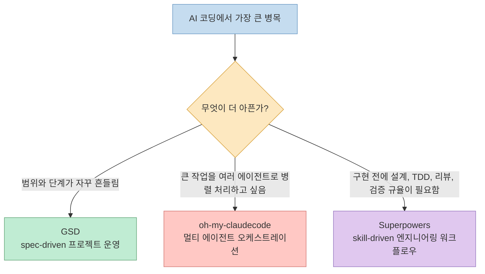
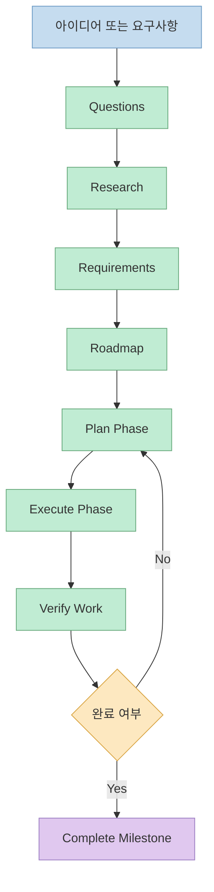
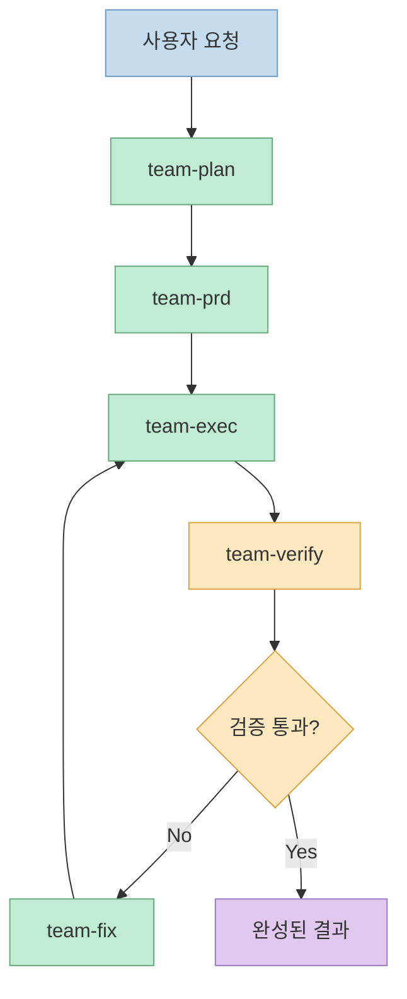
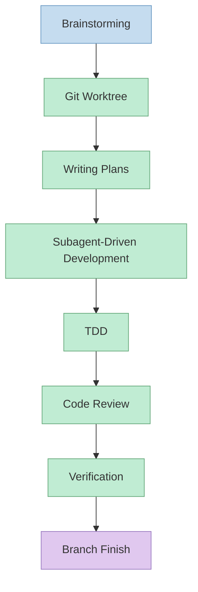
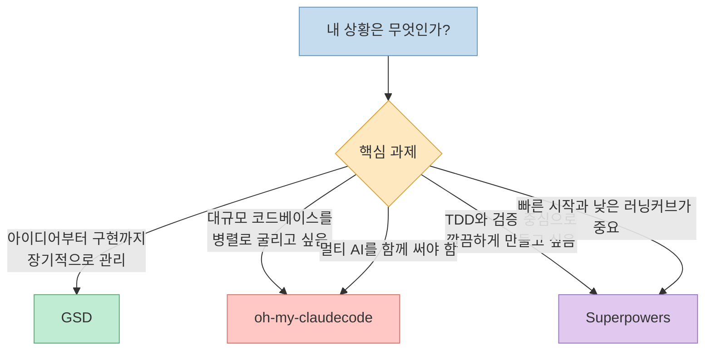
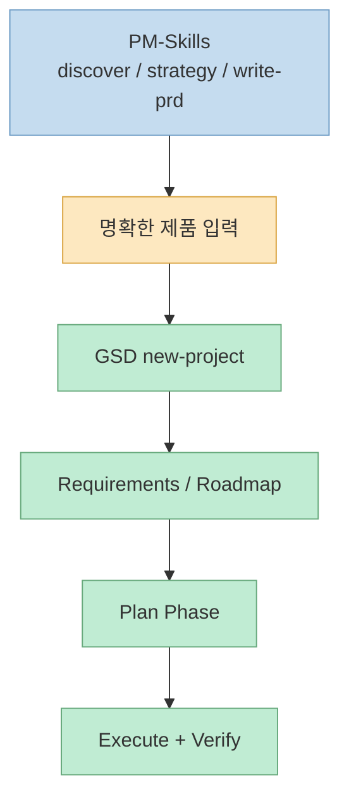
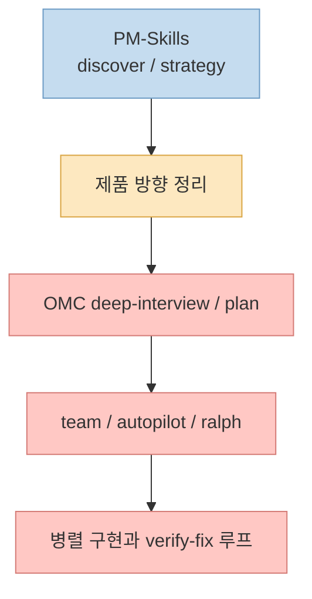
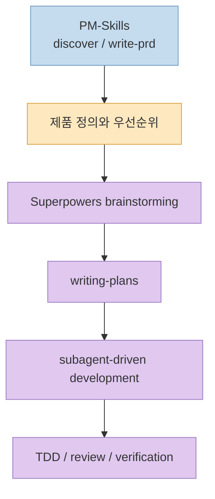

`temp/agent.md` 초안을 블로그 글 형식으로 다시 풀어 쓰면, 핵심 질문은 단순합니다. **GSD**, **oh-my-claudecode**, **Superpowers** 중 무엇이 더 강하냐가 아니라, **각 도구가 개발 파이프라인의 어느 병목을 풀도록 설계되었느냐** 입니다.

셋 다 "AI 코딩을 더 잘하게 해 주는 프레임워크"처럼 보이지만 실제로는 결이 다릅니다. GSD는 **스펙과 단계 관리**, oh-my-claudecode는 **멀티 에이전트 오케스트레이션**, Superpowers는 **스킬 기반 워크플로우와 품질 규율**에 더 가깝습니다. 여기에 **PM-Skills**를 붙이면 기획-실행 연결성이 달라집니다.

<!--more-->

## 한눈에 먼저 보면

세 도구를 같은 축에서 보면 자꾸 헷갈립니다. 오히려 "어떤 종류의 혼란을 줄이느냐"로 보면 훨씬 선명해집니다.

짧게 줄이면 이렇습니다.

| 프레임워크 | 한 줄 요약 | 가장 강한 구간 |
|------|------|------|
| **GSD** | 프로젝트를 spec-driven 파이프라인으로 고정 | 장기 프로젝트, 단계 관리, 컨텍스트 로트 완화 |
| **oh-my-claudecode** | 여러 에이전트를 팀처럼 굴리는 상위 조정 계층 | 병렬 실행, verify/fix 루프, 멀티 AI 활용 |
| **Superpowers** | 작업 전에 생각하고, 계획하고, 테스트하고, 검증하게 만드는 규율 | 설계, 구현 계획, TDD, 코드 리뷰, 검증 |

## GSD: 프로젝트를 스펙과 마일스톤으로 고정하는 시스템

GSD(Get Shit Done)의 핵심은 "코드를 잘 쓰게 한다"보다 **프로젝트를 흔들리지 않게 만든다** 에 더 가깝습니다. 아이디어를 받은 뒤 질문, 연구, 요구사항, 로드맵, 계획, 실행, 검증으로 이어지는 선형 파이프라인을 만들고, 그 흐름을 파일과 상태로 남깁니다.

특히 GSD가 강조하는 것은 **Context Rot** 문제입니다. 세션이 길어질수록 컨텍스트가 더러워지고 품질이 떨어지는 현상을 막기 위해, 작업을 잘게 나누고 새 컨텍스트에서 실행하는 구조를 기본값으로 둡니다. 그래서 GSD는 ad-hoc 자동완성 도구보다는 **작업 운영 체계**에 더 가깝습니다.

### GSD의 강점

- 프로젝트 비전, 요구사항, 로드맵, 상태 파일이 분리되어 장기 작업 추적이 쉽습니다.
- 각 작업을 비교적 원자적으로 쪼개기 때문에 세션이 바뀌어도 복구가 쉽습니다.
- wave 기반 병렬 실행과 atomic commit 철학 덕분에 큰 작업을 통제하기 좋습니다.
- "무엇을 만들고 있는가"가 문서로 남기 때문에 장기적인 정렬 비용이 낮습니다.

### GSD의 한계

- 커맨드와 단계 개념이 많아서 처음엔 학습 비용이 분명히 있습니다.
- 빠른 즉흥 작업에는 다소 무겁게 느껴질 수 있습니다.
- 멀티 AI 오케스트레이션이나 화려한 실시간 가시성은 OMC 쪽이 더 강합니다.

결론적으로 GSD는 **MVP부터 장기 프로젝트까지 한 줄기 파이프라인으로 끌고 가고 싶은 사람**에게 가장 잘 맞습니다. 특히 "요구사항이 자꾸 흔들리고, 이전 세션의 결정을 잊고, 구현은 했는데 왜 이렇게 했는지 남지 않는다"는 문제가 큰 팀에서 강합니다.

## oh-my-claudecode: 여러 에이전트를 팀처럼 굴리는 오케스트레이션 레이어

oh-my-claudecode는 GSD처럼 스펙 파일 구조를 강하게 밀기보다, **에이전트 팀을 굴리는 운영 계층**으로 이해하는 편이 정확합니다. 핵심은 자연어 요청을 받아 planner, executor, verifier, fixer 같은 역할을 분리하고, 필요하면 Codex나 Gemini까지 섞어 병렬 처리하는 데 있습니다.

그래서 OMC의 질문은 대체로 이쪽입니다. "이걸 누가 맡을까", "몇 명을 병렬로 돌릴까", "검증이 실패하면 어디로 되돌릴까", "단일 리드로 갈까 팀 모드로 갈까" 같은 질문입니다.

### OMC의 강점

- 32개 특화 에이전트와 다양한 실행 모드로 큰 작업을 병렬화하기 좋습니다.
- Claude, Codex, Gemini를 묶는 multi-AI 오케스트레이션이 강점입니다.
- HUD, 알림, 자동 재개 같은 운영 보조 기능이 풍부합니다.
- "ralph", "ultrawork", "team"처럼 반복 검증이나 대규모 처리에 특화된 모드가 분명합니다.

### OMC의 한계

- 전체 시스템 복잡도가 높아서 내부를 이해하려고 하면 오히려 부담이 큽니다.
- tmux 기반 워커나 여러 실행 모드는 환경 의존성이 있습니다.
- 자체 기획/계획 기능이 꽤 강해서 다른 프레임워크와 섞을 때 역할 충돌이 생기기 쉽습니다.

즉 OMC는 **대규모 코드베이스, 병렬 작업, 멀티 AI 오케스트레이션**에서 가장 빛납니다. 반대로 "나는 혼자서 작은 기능 몇 개만 안정적으로 만들면 된다"면, 오히려 과한 장비가 될 수도 있습니다.

## Superpowers: 생각-계획-구현-리뷰를 강제하는 skill 기반 워크플로우

Superpowers는 OMC처럼 멀티 에이전트 플랫폼 자체를 전면에 내세우기보다, **작업을 수행하는 방식에 규율을 주는 스킬 프레임워크**에 가깝습니다. 브레인스토밍, worktree, plan, subagent-driven development, TDD, code review, verification을 하나의 습관으로 묶어 줍니다.

이 프레임워크의 강점은 "바로 구현 들어가기"를 막는 데 있습니다. 무엇을 만들지, 왜 그렇게 나눌지, 어떤 테스트로 검증할지, 어떤 기준으로 완료를 선언할지를 먼저 생각하게 만듭니다. 그래서 생산성보다 느려 보일 때도 있지만, **품질과 재작업 비용** 측면에서는 오히려 더 빨라질 수 있습니다.

### Superpowers의 강점

- 구현 전에 설계와 계획을 강제해서 섣부른 코딩을 줄여 줍니다.
- TDD, 리뷰, verification이 workflow 안에 녹아 있어 품질 기준이 높습니다.
- 스킬 단위로 포터블해서 팀 간 재사용과 습관화가 쉽습니다.
- worktree와 subagent를 전제로 하기 때문에 격리와 검증 루프가 자연스럽습니다.

### Superpowers의 한계

- 프로젝트 전체 로드맵, 마일스톤, 상태 관리 체계는 GSD보다 약합니다.
- 대규모 병렬 오케스트레이션은 OMC 쪽이 더 강력합니다.
- 규율이 많기 때문에 "빨리 아무거나 찍고 보자"는 스타일과는 잘 맞지 않습니다.

그래서 Superpowers는 **품질 중심 개발**, **TDD 중심 팀**, **구현 전에 충분히 생각하고 싶은 엔지니어**에게 특히 잘 맞습니다.

## 강점과 약점을 한 표로 정리하면

### 강점

| GSD | oh-my-claudecode | Superpowers |
|-----|------------------|-------------|
| Context Rot 완화에 강한 spec-driven 구조 | 멀티 에이전트 팀 운영과 병렬 처리에 강함 | TDD, 리뷰, 검증 중심 품질 규율이 강함 |
| 장기 프로젝트의 단계 관리가 쉬움 | 멀티 AI 오케스트레이션 가능 | 스킬 단위 워크플로우 재사용이 쉬움 |
| requirements-roadmap-state 연결이 선명함 | 다양한 실행 모드와 운영 도구가 풍부함 | 구현 전에 사고와 계획을 강제함 |
| atomic commit, wave execution 철학이 명확함 | HUD, 알림, 자동 재개 같은 운영 기능 제공 | worktree, subagent, review 루프가 자연스럽게 연결됨 |

### 약점

| GSD | oh-my-claudecode | Superpowers |
|-----|------------------|-------------|
| 진입 시 학습 곡선이 있음 | 시스템 복잡도가 높음 | 장기 프로젝트 관리 기능은 상대적으로 약함 |
| 가벼운 단발성 작업에는 무겁게 느껴질 수 있음 | tmux 및 다중 실행 환경에 대한 이해가 필요할 수 있음 | 대규모 병렬 오케스트레이션 자체는 핵심 장점이 아님 |
| 멀티 AI 운영 기능은 제한적 | 토큰 사용량이 커질 수 있음 | 프로젝트 전체 상태와 마일스톤 관리 체계는 빈약함 |

## 어떤 시나리오에서 무엇을 고를까

실무에서는 "무조건 하나"보다 **어떤 실패를 줄이고 싶은가**가 더 중요합니다.

| 시나리오 | 추천 |
|----------|------|
| **솔로 개발자가 MVP를 체계적으로 만들고 싶다** | **GSD** |
| **기존 대규모 코드베이스를 병렬로 리팩터링하고 싶다** | **oh-my-claudecode** |
| **TDD와 코드 품질을 최우선으로 두고 싶다** | **Superpowers** |
| **Claude, Codex, Gemini를 같이 굴리고 싶다** | **oh-my-claudecode** |
| **실행 전에 충분히 생각하고 검증하고 싶다** | **Superpowers** |
| **장기 로드맵과 마일스톤을 붙잡고 싶다** | **GSD** |

## PM-Skills를 붙이면 평가가 어떻게 달라지나

여기서 중요한 포인트가 하나 더 있습니다. 세 프레임워크 모두 제품 기획을 아주 깊게 책임지지는 않습니다. 그래서 **PM-Skills** 같은 PM 전용 스킬 세트를 붙이면, "무엇을 만들지"와 "어떻게 만들지" 사이 연결이 좋아집니다.

### GSD + PM-Skills: 가장 자연스러운 연결

이 조합이 가장 강한 이유는 역할 분담이 선명하기 때문입니다. PM-Skills가 discovery, strategy, PRD를 담당하고, GSD가 그것을 requirements, roadmap, plan, execute로 받아 구현 파이프라인에 태웁니다. 즉 앞단의 제품 사고와 뒷단의 프로젝트 운영이 거의 끊김 없이 이어집니다.

이 조합은 특히 **PM 출신 창업자**, **제품 주도형 MVP**, **장기적 범위 통제가 중요한 팀**에 잘 맞습니다. 단점은 문서 체계가 두 겹이 되기 쉽다는 점이므로, 실제 운용에서는 PM-Skills 산출물을 GSD 입력으로 흘려보내는 단방향 흐름이 가장 깔끔합니다.

### oh-my-claudecode + PM-Skills: 방향성은 좋아지지만 역할 중복이 있다

OMC는 자체적으로 deep-interview, planning, orchestration 계층이 강합니다. 그래서 PM-Skills를 붙이면 분명 방향성은 좋아지지만, GSD보다 **기획 레이어 중복**이 더 생깁니다. 강점은 PM-Skills가 제품 관점을 잡아 주고, OMC가 그 이후 실행을 대규모로 분산한다는 점입니다.

이 조합은 **기술 리더가 팀 단위 AI 오케스트레이션을 돌릴 때** 강합니다. 다만 토큰 비용과 복잡성이 같이 커지므로, "기획은 PM-Skills, 실행은 OMC"처럼 주도권을 분명히 나누는 편이 좋습니다.

### Superpowers + PM-Skills: 가장 깔끔한 기획-품질 연결

Superpowers는 기획 프레임워크 그 자체보다는, 기획을 받아 **안전한 구현 프로세스**로 바꾸는 데 강합니다. 그래서 PM-Skills와 붙이면 역할이 비교적 덜 충돌합니다. PM-Skills가 제품 정의를, Superpowers가 브레인스토밍-플랜-TDD-리뷰를 맡는 식입니다.

이 조합은 **제품 감각은 챙기되 코드 품질을 특히 놓치고 싶지 않은 팀**에 적합합니다. 반대로 장기적인 로드맵 추적까지 기대하면 아쉬울 수 있습니다.

## 최종 궁합 매트릭스

| 조합 | 기획력 | 실행력 | 코드 품질 | 비용 효율 | 프로젝트 관리 | 종합 |
|------|--------|--------|----------|----------|---------------|------|
| **GSD + PM-Skills** | ⭐⭐⭐⭐⭐ | ⭐⭐⭐⭐⭐ | ⭐⭐⭐⭐ | ⭐⭐⭐⭐ | ⭐⭐⭐⭐⭐ | **가장 균형 좋음** |
| **oh-my-claudecode + PM-Skills** | ⭐⭐⭐⭐ | ⭐⭐⭐⭐⭐ | ⭐⭐⭐⭐ | ⭐⭐⭐ | ⭐⭐⭐⭐ | **대규모 실행에 강함** |
| **Superpowers + PM-Skills** | ⭐⭐⭐⭐ | ⭐⭐⭐⭐ | ⭐⭐⭐⭐⭐ | ⭐⭐⭐⭐⭐ | ⭐⭐⭐ | **품질 중심 팀에 적합** |

## 핵심 요약

- **GSD** 는 프로젝트를 spec-driven으로 고정하고 장기 실행을 관리하는 데 가장 강합니다.
- **oh-my-claudecode** 는 여러 에이전트와 여러 모델을 팀처럼 굴리는 오케스트레이션 능력이 핵심입니다.
- **Superpowers** 는 구현 전에 생각하고, 계획하고, 테스트하고, 검증하게 만드는 개발 규율이 본체입니다.
- **PM-Skills** 를 붙이면 세 프레임워크 모두 앞단 제품 정의가 좋아지지만, 가장 자연스러운 연결은 **GSD**, 가장 대규모 실행 친화적인 연결은 **oh-my-claudecode**, 가장 품질 중심 연결은 **Superpowers** 입니다.

## 결론

세 프레임워크를 같은 선에서 놓고 "누가 최고인가"를 묻기 시작하면 답이 자꾸 흐려집니다. 더 정확한 질문은 **"내가 지금 잃고 있는 것은 범위 통제인가, 병렬 실행인가, 품질 규율인가"** 입니다.

그 질문에 답하면 선택은 의외로 단순해집니다. **장기 프로젝트 운영은 GSD**, **대규모 멀티 에이전트 실행은 oh-my-claudecode**, **TDD와 검증 중심 개발은 Superpowers** 가 더 잘 맞습니다. 그리고 제품 기획의 앞단을 보강하고 싶다면, 세 경우 모두 **PM-Skills를 앞에 붙이는 방식**이 꽤 강력합니다.
