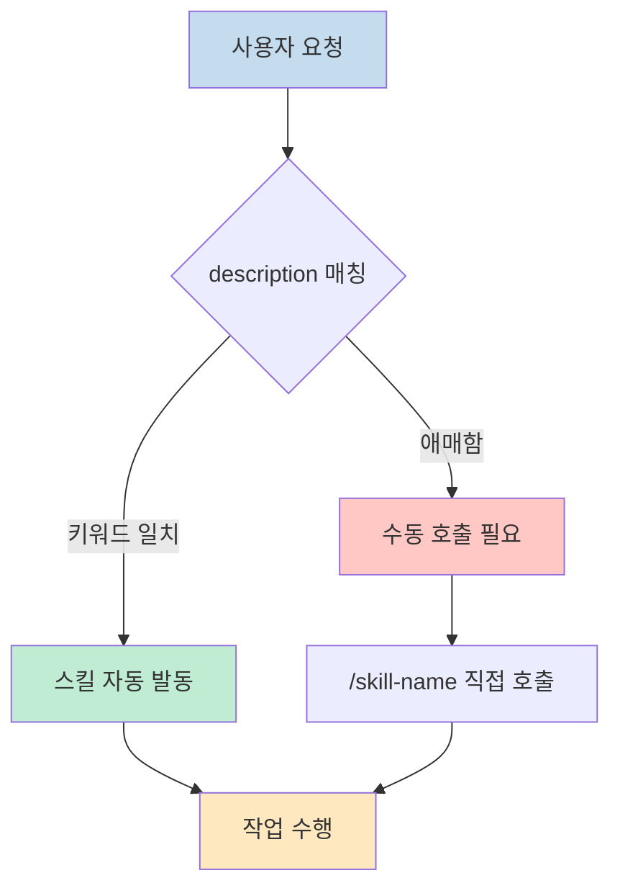
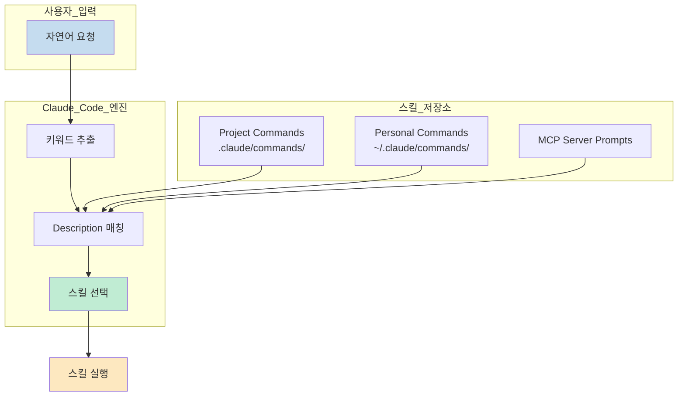
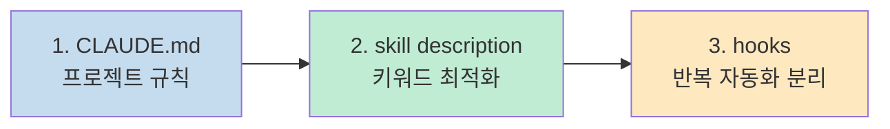
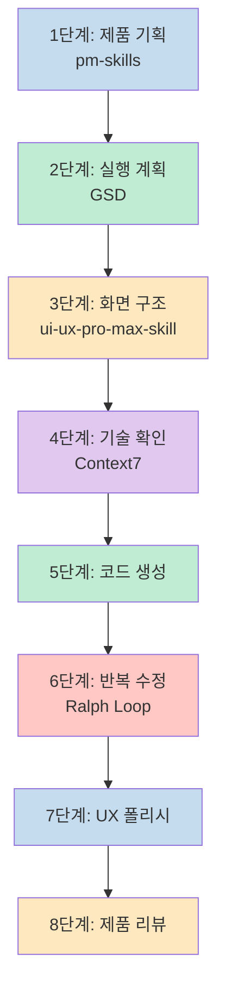
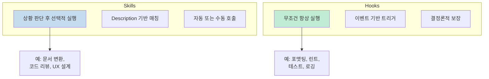
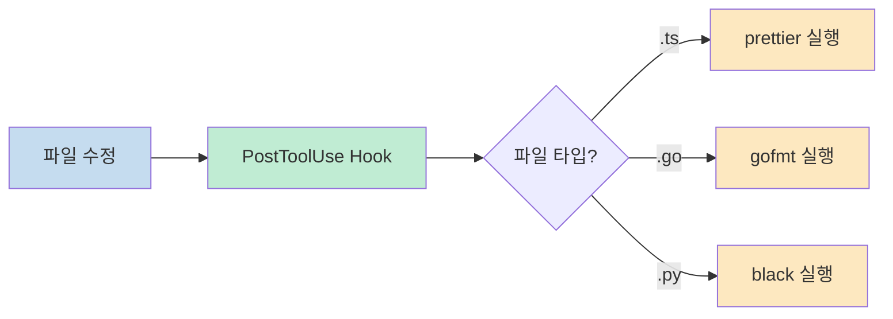
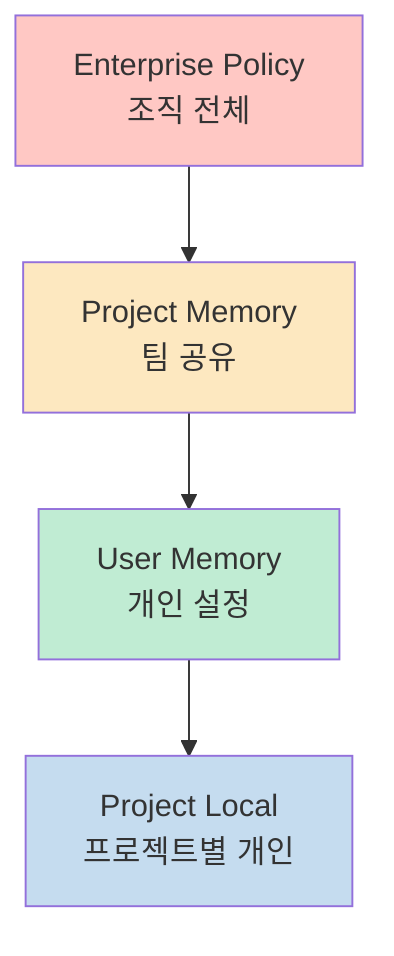

## 핵심 요약

**스킬 자동 발동은 '좋은 skill 설명 + 좋은 시작 프롬프트 + 적절한 프로젝트 메모리 + 필요한 곳만 수동 호출' 조합일 때 가장 잘 됩니다.**

Claude Code는 skill의 `description` 필드를 보고 언제 쓸지 판단합니다. 관련 있을 때 자동으로 로드하거나 `/skill-name`으로 직접 호출할 수 있습니다.



<!--more-->

## 스킬이 안 뜰 때 점검 순서

Anthropic 문서 기준으로 다음을 권장합니다.

1. **description에 자연스러운 키워드**를 넣기
2. skill이 목록에 보이는지 확인하기
3. 요청을 description과 더 가깝게 다시 말하기
4. 필요하면 `/skill-name`으로 직접 부르기

---

## 전체 아키텍처 이해하기

Claude Code의 스킬 시스템은 사용자 요청에서 키워드를 추출하고, 등록된 스킬들의 description과 매칭하여 가장 적절한 스킬을 선택합니다.



---

## 환경 세팅하기

세션이 시작될 때 Claude는 **새 컨텍스트**로 시작합니다. 대신 `CLAUDE.md`와 auto memory가 매 세션에 로드됩니다. Anthropic 문서도 이것들은 **강제 설정이 아니라 컨텍스트**라고 설명하므로, **짧고 구체적으로** 써야 잘 따릅니다.

### 해야 할 것 3개



### 1) 프로젝트 CLAUDE.md 만들기

Anthropic는 프로젝트 루트의 `CLAUDE.md` 또는 `.claude/CLAUDE.md`에 프로젝트 규칙을 두라고 권장합니다. `/init`으로 초안을 만들 수도 있습니다.

```md
# Project Overview
이 프로젝트는 개인 투자자를 위한 배당주 분석 웹앱이다.

# Workflow
- 제품 범위 정의가 필요한 요청은 pm-skills를 우선 사용한다.
- 화면 구조, 정보 우선순위, CTA, empty/loading/error state 설계는 ui-ux-pro-max-skill을 우선 사용한다.
- Next.js, Supabase, Tailwind, Prisma 등 라이브러리 구현 판단은 Context7을 우선 사용한다.
- 구현은 작은 task 단위로 진행한다.
- 각 구현 후 lint, typecheck, test를 확인한다.
- 반복 수정은 Ralph Loop 스타일로 한 번에 하나의 task만 처리한다.

# Coding Rules
- TypeScript strict 유지
- 과도한 추상화 금지
- 기능 추가보다 현재 task 완료 우선
- 변경 후 영향 파일 요약 제공
```

### 2) skill description 정리

`description`은 Claude가 skill을 언제 쓸지 판단하는 핵심 필드입니다.

```yaml
# pm-skills 예시
---
name: pm-skills
description: Define product goals, target users, MVP scope, priorities, success metrics, and feature tradeoffs when a request is about product planning, PRD, roadmap, requirements, or deciding what to build first
---

# ui-ux-pro-max-skill 예시
---
name: ui-ux-pro-max-skill
description: Design information architecture, screen hierarchy, CTA placement, form UX, loading, empty, and error states when the request is about UI structure, usability, UX review, or making a feature easier to use
---

# context7 예시
---
name: context7
description: Check current official documentation and recommended implementation patterns when working with frameworks, libraries, SDKs, auth, routing, deployment, APIs, or version-sensitive technical details
---
```

### 3) 반복 자동화는 hooks로 분리

lint/test/formatting처럼 "항상 해야 하는 것"은 hooks가 더 확실합니다. hooks는 LLM이 알아서 하길 기대하는 게 아니라 **결정론적으로 항상 실행**되게 합니다.

---

## 시작 프롬프트 작성법

### 나쁜 예

```text
배당주 앱 하나 만들어줘
```

너무 넓어서 어떤 skill을 써야 하는지 명확하지 않습니다.

### 좋은 예

```text
개인 투자자를 위한 배당주 분석 웹앱을 만들고 싶다.
먼저 제품 기획 관점에서 핵심 사용자, 핵심 문제, MVP 범위, 성공 기준을 정리해 줘.
아직 코드는 작성하지 말고 PRD 초안 형태로 정리해 줘.
```

이 문장은 **제품 기획, 핵심 사용자, MVP, 성공 기준, PRD** 같은 키워드를 포함하므로 **pm-skills의 description과 강하게 맞물립니다.**

---

## 실전 워크플로우 예시



### 단계 1: 제품 기획 시작

```text
개인 투자자를 위한 배당주 분석 웹앱을 만들고 싶다.
제품 기획 관점에서 다음만 정리해 줘.

- 핵심 사용자
- 사용자의 가장 큰 문제 3개
- 이 앱의 핵심 가치
- MVP 범위
- MVP에서 제외할 것
- 성공 기준

출력은 PRD 초안 형식으로 해 줘.
아직 코드는 작성하지 마.
```

**발동 키워드**: 제품 기획, 핵심 사용자, MVP, 성공 기준, PRD

### 단계 2: 기획 결과를 실행 계획으로

```text
방금 만든 PRD를 실제 개발 가능한 실행 계획으로 바꿔 줘.

다음을 포함해 줘.
- spec 초안
- 우선순위가 있는 기능 목록
- definition of done
- 1~2시간 단위로 쪼갠 task 목록
- 지금 바로 시작할 첫 작업 3개

범위는 MVP로 제한하고, 실행 가능한 수준으로 구체적으로 작성해 줘.
```

**발동 키워드**: 실행 계획, spec, definition of done, task 목록, MVP

### 단계 3: 화면 구조 설계

```text
이제 구현 전에 UX 관점으로 화면 구조를 먼저 설계해 줘.

다음을 정리해 줘.
- 전체 정보 구조
- 핵심 화면 3~5개
- 각 화면의 목적
- 각 화면의 주요 UI 요소
- CTA
- loading / empty / error state
- 모바일과 데스크톱 반응형 전략

예쁜 시안보다 사용자가 덜 헷갈리는 구조에 집중해 줘.
```

**발동 키워드**: UX 관점, 화면 구조, 정보 구조, CTA, loading/empty/error state

### 단계 4: 기술 구현 사실 확인

```text
이 프로젝트는 Next.js App Router, TypeScript, Tailwind, Supabase를 사용할 예정이다.
이제 최신 공식 문서 기준으로 다음 구현 방식을 확인해 줘.

- Next.js App Router에서 서버 컴포넌트와 클라이언트 컴포넌트 구분
- Supabase Auth 최신 권장 패턴
- route handler 사용 방식
- 환경 변수 처리
- 배포 시 자주 틀리는 부분

오래된 방식은 제외하고 현재 권장 패턴만 정리해 줘.
```

**발동 키워드**: 최신 공식 문서 기준, 권장 패턴, 오래된 방식 제외

### 단계 5: 첫 코드 생성

```text
지금부터는 구현 단계다.

아래 spec과 ui-plan을 기준으로,
이번에는 프로젝트 전체를 다 만들지 말고 첫 task만 수행해 줘.

task:
- 프로젝트 폴더 구조 생성
- 공통 레이아웃 구성
- 기본 라우트 생성
- 메인 대시보드 페이지 스켈레톤 작성

중요:
- 범위를 넘지 말 것
- 필요한 파일만 수정할 것
- 작업 후 변경 파일 목록과 요약 제공
```

### 단계 6: 반복 수정 루프

```text
이제부터는 반복 수행 모드로 작업해 줘.

목표:
현재 task를 완료하고 lint, typecheck, test를 통과시키는 것

반복 규칙:
1. 현재 가장 큰 문제 확인
2. 한 번에 하나만 수정
3. 수정 후 다시 검증
4. 남은 이슈를 progress에 기록
5. task 완료 조건을 만족하면 종료

기능 확장은 하지 말고 현재 task 완료에만 집중해 줘.
```

---

## 자동 발동률을 높이는 문장 패턴

### pm-skills용 패턴

- 제품 관점에서
- 핵심 사용자
- 사용자 문제
- MVP 범위
- PRD
- 성공 기준
- 우선순위
- 무엇을 먼저 만들지

### GSD용 패턴

- 실행 계획
- spec
- tasks
- definition of done
- 작업 단위로 쪼개기
- 바로 시작할 첫 작업
- 모호한 아이디어를 실행 가능하게

### ui-ux-pro-max-skill용 패턴

- 정보 구조
- 화면 구조
- CTA
- empty/loading/error state
- 사용성
- UX 리뷰
- 덜 헷갈리게
- 초보 사용자 기준

### Context7용 패턴

- 최신 공식 문서 기준
- 권장 패턴
- 오래된 방식 제외
- auth, routing, sdk, deploy

### Ralph Loop용 패턴

- 반복 수행
- 한 번에 하나의 task
- 검증 후 다음 단계
- progress 업데이트
- lint/typecheck/test 통과

---

## 자동 발동이 애매한 순간

이럴 때는 바로 수동 호출하는 게 낫습니다.

### 수동 호출이 더 좋은 경우

- 반드시 그 skill을 써야 할 때
- 결과 형식이 엄격해야 할 때
- 자동 선택이 자꾸 다른 skill로 새는 경우
- 프로젝트에 skill이 너무 많아 겹칠 때

```text
/pm-skills 개인 투자자를 위한 배당주 앱의 MVP를 정의해 줘
```

```text
/context7 Next.js App Router + Supabase Auth 최신 권장 구현 방식을 정리해 줘
```

---

## Hooks vs Skills 비교



### Skills

- **이 상황에서 이런 플레이북을 써라**
- LLM이 판단하여 선택
- 유연하지만 때로 놓칠 수 있음

### Hooks

- **무조건 실행돼야 할 자동화**
- 특정 이벤트에서 항상 실행
- 결정론적 보장

### Hooks가 적합한 작업



- 파일 수정 후 formatter 실행
- task 종료 후 lint/typecheck/test 실행
- 보호 파일 수정 차단
- 세션 시작 시 규칙 재주입
- 알림 및 로깅

---

## CLAUDE.md 메모리 계층 구조

Claude Code는 네 가지 메모리 위치를 계층적으로 관리합니다.



| 메모리 타입 | 위치 | 목적 |
|------------|------|------|
| **Enterprise policy** | `/etc/claude-code/CLAUDE.md` | 조직 전체 규칙 |
| **Project memory** | `./CLAUDE.md` | 팀 공유 프로젝트 규칙 |
| **User memory** | `~/.claude/CLAUDE.md` | 모든 프로젝트에 적용되는 개인 설정 |
| **Project local** | `./CLAUDE.local.md` | 현재 프로젝트만의 개인 설정 (deprecated) |

---

## 최종 정리

### 가장 중요한 원칙 4가지

1. **skill description을 사용자가 실제 말하는 단어로 쓴다**
2. **첫 프롬프트를 그 skill의 description과 닮게 쓴다**
3. **CLAUDE.md에 워크플로우 우선순위를 짧고 구체적으로 적는다**
4. **자동이 애매하면 바로 `/skill-name`으로 강제한다**

### 추천 실전 운영 방식

```text
# 시작
개인 투자자를 위한 배당주 분석 웹앱을 만들고 싶다.
먼저 제품 기획 관점에서 핵심 사용자, 문제, MVP, 성공 기준을 PRD 초안으로 정리해 줘.

# 다음
이 PRD를 개발 가능한 spec, definition of done, task 목록으로 바꿔 줘.

# 다음
이제 구현 전에 UX 관점으로 화면 구조, CTA, empty/loading/error state를 설계해 줘.

# 다음
최신 공식 문서 기준으로 Next.js App Router와 Supabase Auth 구현 패턴을 정리해 줘.

# 다음
이제 첫 task만 구현해 줘. 범위를 넘지 말고 변경 파일 목록도 정리해 줘.

# 다음
현재 task를 완료하고 lint, typecheck, test를 통과시키는 반복 수행 모드로 작업해 줘.
```

각 단계의 목적이 선명해서 **자동 발동률이 올라갑니다.**

---

## 참고 자료

- [Extend Claude with skills - Claude Code Docs](https://docs.anthropic.com/en/docs/claude-code/slash-commands)
- [How Claude remembers your project - Claude Code Docs](https://docs.anthropic.com/en/docs/claude-code/memory)
- [Automate workflows with hooks - Claude Code Docs](https://docs.anthropic.com/en/docs/claude-code/hooks-guide)
- [Common workflows - Claude Code Docs](https://docs.anthropic.com/en/docs/claude-code/common-workflows)
