Claude를 사용하다 보면 "성공적으로 완료했습니다"라는 메시지를 자주 보게 됩니다. 하지만 실제로 테스트를 돌려보면 실패하거나 린트 에러가 발생하는 경우가 많습니다. 그러면 또다시 에러 메시지를 복사해서 Claude에 붙여넣고 "이거 에러 고쳐줘"라고 요청해야 합니다. 이 과정을 사람이 계속 붙어서 해야 하는 귀찮은 일이 발생합니다. [https://youtu.be/wz7oFfIR7LA?t=0](https://youtu.be/wz7oFfIR7LA?t=0)

이 문제를 해결하는 방법이 있습니다. 바로 **Ralph Loop**입니다.

<!--more-->

## Sources

- [클로드가 알아서 완벽하게 일 처리하게 만드는 법 - YouTube](https://www.youtube.com/watch?v=wz7oFfIR7LA)
- [PageAI-Pro/ralph-loop - GitHub](https://github.com/PageAI-Pro/ralph-loop)

## Ralph Loop란 무엇인가

Ralph Loop는 심슨 가족에 나오는 **Ralph Wiggum**이라는 캐릭터의 이름을 본따서 만든 장기 실행 AI 에이전트 루프입니다. [https://youtu.be/wz7oFfIR7LA?t=30](https://youtu.be/wz7oFfIR7LA?t=30)

Ralph는 뇌가 살짝 순수한 캐릭터지만 매우 행복해하고 계속해서 도전하는 특징이 있습니다. 이 친구의 핵심 특징은 **절대 멈추지 않는다**는 것입니다. 이것은 AI가 **며칠이고 코딩을 계속할 수 있게 해주는** 장기 실행 에이전트 루프를 구현합니다. [https://youtu.be/wz7oFfIR7LA?t=45](https://youtu.be/wz7oFfIR7LA?t=45)

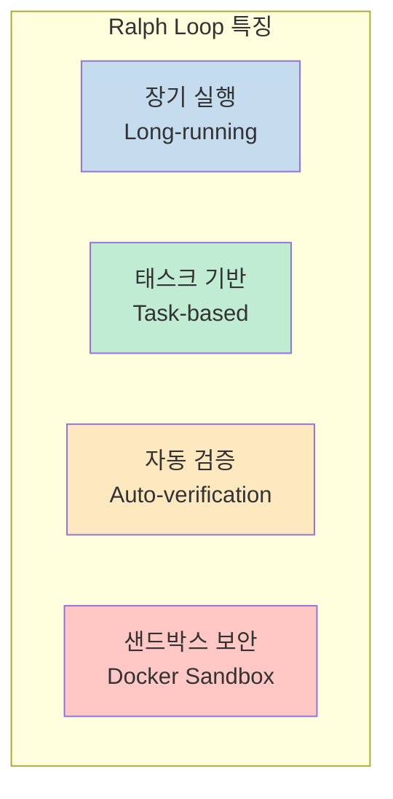

### 놀이터 비유

이 기법을 만든 개발자가 아주 좋은 비유를 했습니다. Ralph는 놀이터를 만드는 데 매우 적합합니다:

1. 맨 처음 놀이터를 만듭니다
2. 거기서 놀다가 멍투성이가 됩니다 (미끄럼틀에서 뛰어내렸거든요)
3. 미끄럼틀 옆에 표지판을 붙입니다 ("앉아서 내려가세요")
4. 다음번에는 Ralph가 표지판을 보고 앉아서 내려갑니다
5. 계속해서 표지판이 하나씩 늘어납니다

이렇게 무한 반복하면서 시도해 보고, 아파보고, 수정하면서 Ralph는 **완벽한 놀이터**를 만들 수 있게 됩니다. [https://youtu.be/wz7oFfIR7LA?t=55](https://youtu.be/wz7oFfIR7LA?t=55)

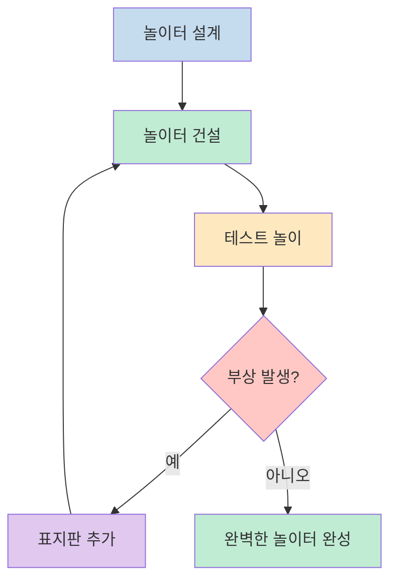

### 핵심 철학

Ralph Loop의 핵심 철학은 다음과 같습니다:

> **반복해서 완벽하게 만들어라. 처음부터 완벽을 추구하지 말고 계속 시도하면서 실패한 결과를 기반으로 발전시켜 나가라.**

이것은 **실패의 데이터를 통해 성공할 수 있다**는 것을 의미합니다. [https://youtu.be/wz7oFfIR7LA?t=120](https://youtu.be/wz7oFfIR7LA?t=120)

## Ralph Loop 동작 원리

### 핵심 동작 흐름

Ralph Loop의 핵심 동작은 다음과 같습니다:

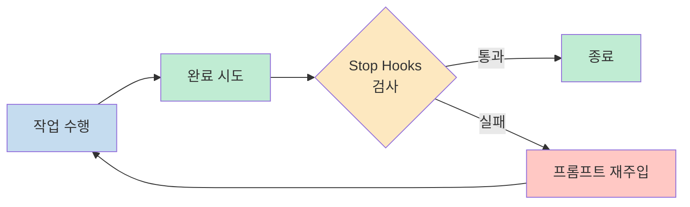

### 각 Iteration의 동작

각 iteration마다 Ralph는 다음 작업을 수행합니다:

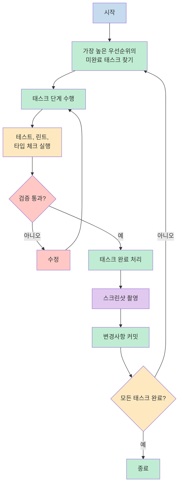

1. `.agent/tasks.json`에서 가장 높은 우선순위의 미완료 태스크를 찾습니다
2. `.agent/tasks/TASK-{ID}.json`에 정의된 태스크 단계를 수행합니다
3. 테스트, 린트, 타입 체크를 실행합니다
4. 태스크를 완료하고, 스크린샷을 찍고, 태스크 상태를 업데이트하고, 변경사항을 커밋합니다
5. 모든 태스크가 통과하거나 최대 iteration에 도달할 때까지 반복합니다

### Stop Hooks 메커니즘

**Stop Hooks**는 Claude 내에서 동작을 완료했을 때 특정 동작을 수행하는 규칙입니다. 이 규칙에서 특정 조건을 만족하는지를 확인합니다. [https://youtu.be/wz7oFfIR7LA?t=150](https://youtu.be/wz7oFfIR7LA?t=150)

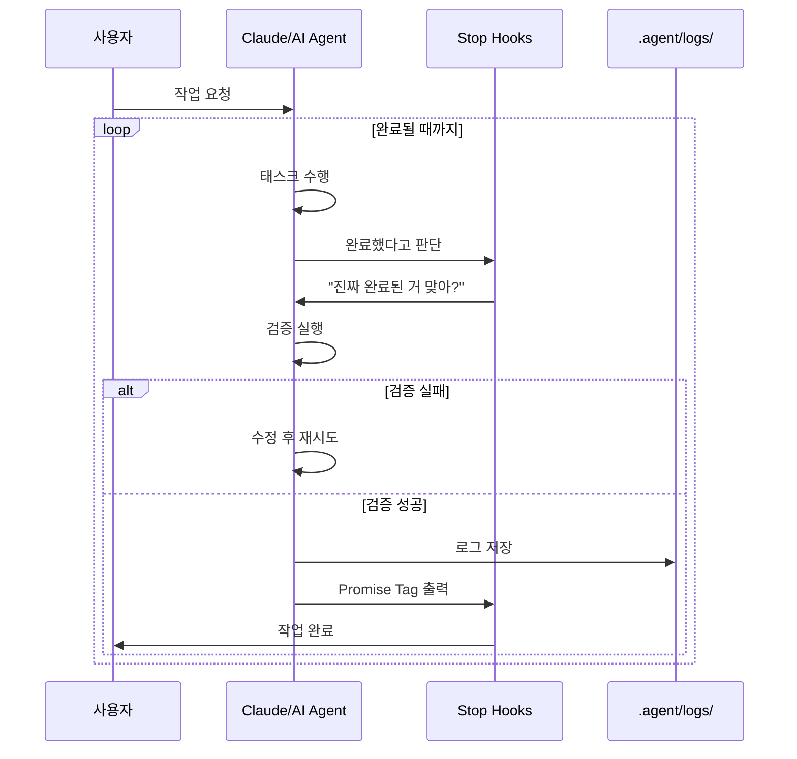

## Ralph Loop의 핵심 기능

### 주요 기능 목록

Ralph Loop는 단순한 반복문이 아니라 다음과 같은 풍부한 기능을 제공합니다:

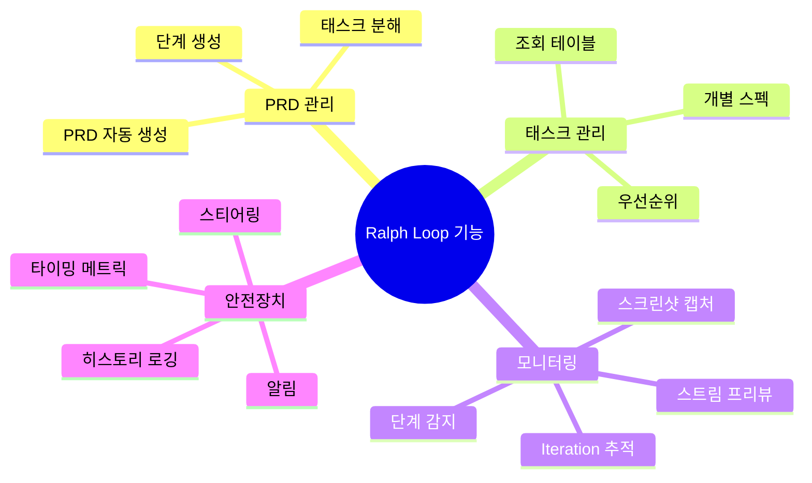

| 기능 | 설명 |
|------|------|
| **PRD 생성** | 요구사항에서 PRD와 태스크 목록 자동 생성 |
| **태스크 조회 테이블 생성** | PRD에서 태스크 조회 테이블 생성 |
| **태스크 분해 + 단계 생성** | 각 태스크를 관리 가능한 단계로 분해 |
| **Iteration 추적** | 타이밍과 함께 진행 상황 표시 |
| **스트림 프리뷰** | 에이전트의 라이브 출력 표시 |
| **단계 감지** | 현재 활동 식별 (Thinking, Implementing, Testing 등) |
| **스크린샷 캡처** | 현재 화면 캡처 |
| **알림** | 인간 입력이 필요할 때 알림 |
| **히스토리 로깅** | 각 iteration의 깨끗한 출력 저장 |
| **타이밍** | 각 iteration과 총 시간에 대한 타이밍 메트릭 |
| **스티어링** | 루프가 계속되기 전에 수행해야 할 중요 작업 우선 처리 |

### 다른 Ralph들과의 차별점

Ralph Loop는 다음과 같은 점에서 독특합니다:

- **해킹 가능한 스크립트** - 자신의 환경과 좋아하는 agentic AI CLI에 맞게 구성 가능
- **구조화되지 않은 요구사항을 덤프**하고 에이전트가 PRD와 태스크 목록을 생성
- **태스크 조회 테이블**과 개별 상세 단계 사용 → 수백 개의 태스크를 처리할 때 더 확장 가능
- **샌드박스로 보안 강화**
- **진행 상황과 통계 표시**로 작업 내용 모니터링 가능
- **자동화된 테스트와 스크린샷**을 태스크별로 작성하고 실행하도록 지시
- **관찰 가능성과 추적 가능성** 제공, 출력 스트림과 iteration별 전체 히스토리 로그 캡처

## 설치 및 설정

### Step 1: Ralph 설치

프로젝트 디렉토리에서 다음 명령어를 실행합니다:

```bash
npm install @pageai/ralph-loop
```

또는 Claude Code 내에서 플러그인으로 설치: [https://youtu.be/wz7oFfIR7LA?t=240](https://youtu.be/wz7oFfIR7LA?t=240)

```bash
/install ralph-loop claude-plugins-official
```

### Step 2: PRD + 태스크 목록 생성

`prd-creator` 스킬을 사용하여 요구사항에서 PRD를 생성합니다. Claude Code나 Cursor 등을 열고 요구사항을 프롬프트합니다:

```
Use the prd-creator skill to help me create a PRD and task list for the below requirements.

An app is already set up with React, Tailwind CSS and TypeScript.

Requirements:

- A SaaS product that helps users manage their finances.
- Target audience: Small business owners and freelancers.
- Core features:
  - Track income and expenses.
  - Create and send invoices.
  - Track payments and receipts.
  - Generate reports and insights.
- Use the shadcn/ui library for components.
- Integrate with Stripe for payments.
- Use Supabase for database.
```

**Pro tips:**

- 사용할 라이브러리와 프레임워크를 명시하세요
- 환경 변수(DB, API 키 등)를 `.env`에 저장하고 `.gitignore`에 추가하세요
- 사용자 흐름과 여정을 설명하세요
- 관련 문서와 UI 참조를 `/docs`에 추가하고 요구사항에서 언급하세요
- 최대한 자세히 설명하세요
- 자신의 언어로 작성해도 됩니다

### Step 3: Docker 샌드박스 설정

Docker 샌드박스 내에서 Claude를 인증합니다:

```bash
docker sandbox run claude .
```

그리고 지침에 따라 Claude Code에 로그인합니다.

> **중요**: `Bypass Permissions mode`에 "Yes"라고 답하세요. 이것이 Docker 샌드박스를 사용하는 정확한 이유입니다.

### Step 4: Ralph 실행

```bash
./ralph.sh -n 50 # 50회 iteration으로 Ralph Loop 실행
```

> 첫 번째 iteration은 샌드박스 환경이 올바르게 설정되었는지 확인하는 데 사용됩니다. 완료하는 데 약 5분이 소요됩니다.

## 사용법

### 기본 명령어

```bash
# 기본 에이전트 루프 실행 (기본값: 10회 iteration)
./ralph.sh

# 커스텀 iteration 제한으로 실행
./ralph.sh 5
./ralph.sh -n 5
./ralph.sh --max-iterations 5

# 정확히 한 번의 iteration 실행
./ralph.sh --once

# 도움말 표시
./ralph.sh --help
```

> NB: 스크립트를 실행 가능하게 만들려면 `chmod +x ralph.sh`를 실행해야 할 수 있습니다.

### Claude Code 내에서 사용

Ralph Loop 명령어는 다음 문법을 따릅니다:

```
/ralph-loop [프롬프트] --max-iteration [횟수] --completion-promise [완료 문구]
```

#### 옵션 설명

| 옵션 | 설명 |
|------|------|
| 프롬프트 | 할 일을 적어 주는 곳 |
| `--max-iteration` | 최대 몇 번 반복할지 (피드백 받고 얼마나 다시 제시도할지) |
| `--completion-promise` | 특정 문구를 출력하면 종료시키겠다는 의미 |

**중요**: 옵션들을 안 넣으면 무한 루프를 돌게 되는데, 그러면 토큰이 살살 녹을 것입니다. 웬만하면 최대 횟수를 적어 주는 것을 추천합니다. [https://youtu.be/wz7oFfIR7LA?t=300](https://youtu.be/wz7oFfIR7LA?t=300)

### 간단한 예제

```bash
/ralph-loop "할 일 목록을 위한 REST API를 구축해 주세요. 완료되면 DONE을 출력합니다" --max-iteration 50 --completion-promise DONE
```

이렇게 하면:
- 할 일 목록 REST API를 구축하라는 프롬프트
- 최대 50번까지 반복
- "DONE"이라는 문자를 출력하면 완료로 간주

## 디렉토리 구조

Ralph Loop는 다음과 같은 디렉토리 구조를 사용합니다:

```
.agent/
├── PROMPT.md           # 각 iteration마다 에이전트에 전송되는 프롬프트
├── tasks.json          # 태스크 조회 테이블 (필수)
├── tasks/              # 개별 태스크 스펙 (TASK-{ID}.json)
├── prd/
│   ├── PRD.md          # 제품 요구사항 문서
│   └── SUMMARY.md      # 각 iteration마다 에이전트에 전송되는 짧은 프로젝트 개요
├── logs/
│   └── LOG.md          # 진행 로그 (자동 생성)
├── history/            # Iteration 출력 로그
└── skills/             # 공유 스킬 (source of truth)
```

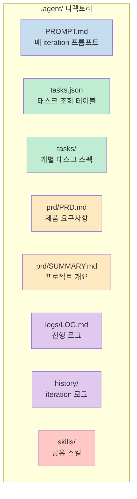

## Promise Tags와 Exit Codes

### Promise Tags

Ralph는 상태를 전달하기 위해 시맨틱 태그를 사용합니다:

| 태그 | 의미 |
|------|------|
| `<promise>COMPLETE</promise>` | 모든 태스크가 성공적으로 완료됨 |
| `<promise>BLOCKED:reason</promise>` | 에이전트가 인간의 도움이 필요함 |
| `<promise>DECIDE:question</promise>` | 에이전트가 결정이 필요함 |

### Exit Codes

| 코드 | 의미 |
|------|------|
| 0 | COMPLETE - 모든 태스크 완료 |
| 1 | MAX_ITERATIONS - 제한 도달 |
| 2 | BLOCKED - 인간 도움 필요 |
| 3 | DECIDE - 인간 결정 필요 |

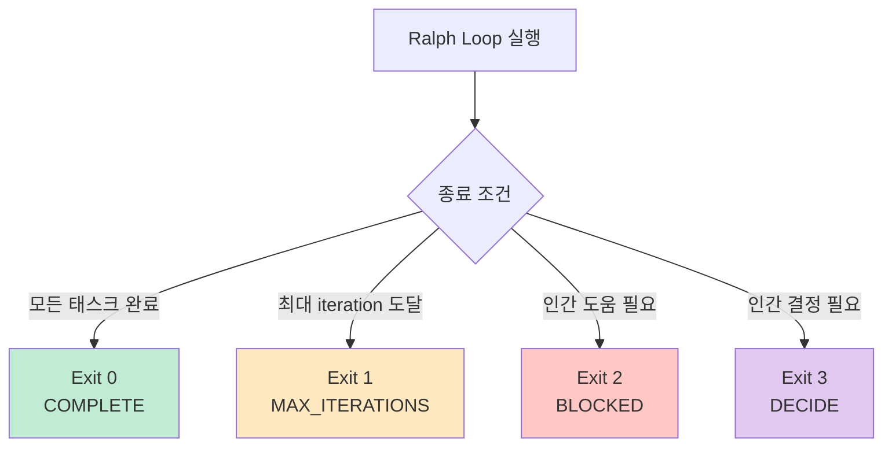

## 에이전트 스티어링

경우에 따라 에이전트가 어려움을 겪거나, 느려지거나, 차단기를 극복하지 못하는 것을 발견할 수 있습니다.

루프가 실행되는 동안 `.agent/STEERING.md` 파일을 편집하여 루프가 계속되기 전에 수행해야 할 중요한 작업을 추가할 수 있습니다.

에이전트는 각 iteration마다 이 파일을 확인하고 중요한 작업이 있으면 태스크를 건너뛰고 중요한 작업을 먼저 완료합니다.

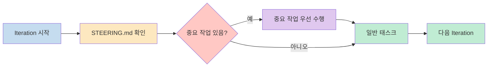

## Skills 시스템

Skills는 특화된 지식과 워크플로우를 제공하는 재사용 가능한 에이전트 기능입니다.

### 사용 가능한 Skills

| Skill | 설명 |
|-------|------|
| `component-refactoring` | React 컴포넌트 분할 및 리팩토링 패턴 |
| `e2e-tester` | End-to-end 테스트 워크플로우 |
| `frontend-code-review` | 코드 품질 및 성능 리뷰 가이드라인 |
| `frontend-testing` | 단위 및 통합 테스트 패턴 |
| `prd-creator` | Ralph용 PRD 및 태스크 분해 생성 |
| `skill-creator` | 새로운 스킬 생성 |
| `vercel-react-best-practices` | React/Next.js 성능 패턴 |
| `mysql` | MySQL/InnoDB 스키마, 인덱싱, 쿼리 튜닝 |
| `postgres` | PostgreSQL 모범 사례 및 쿼리 최적화 |
| `web-design-guidelines` | UI/UX 디자인 원칙 |

### Skills 디렉토리 구조

Skills는 `.agent/skills/`에서 여러 위치로 심볼릭 링크됩니다:

```
# Source of truth
.agent/skills/
    ├── component-refactoring/
    ├── e2e-tester/
    ├── postgres/
    └── ...

# Symlinks -> .agent/skills/*
.agents/skills/*
.claude/skills/*
.codex/skills/*
.cursor/skills/*
```

## 다양한 Agentic CLI 지원

Ralph Loop는 Claude Code뿐만 아니라 다양한 agentic AI CLI를 지원합니다:

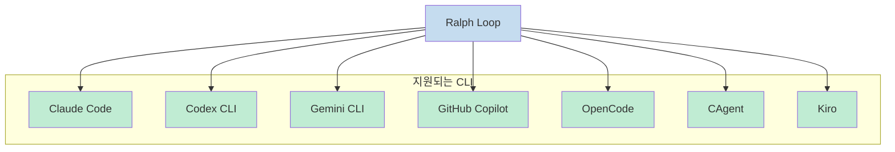

다른 agentic CLI를 사용하려면 `ralph.sh` 스크립트에서 `# This is the main command loop.` 부분을 찾아 수정합니다:

```bash
docker sandbox run codex . # for Codex CLI
docker sandbox run gemini . # for Gemini CLI
```

## 테스트 프레임워크 설정

### Playwright 설정 (E2E 테스트)

```typescript
import { defineConfig, devices } from '@playwright/test';

export default defineConfig({
  testDir: './tests',
  fullyParallel: true,
  globalTimeout: 30 * 60 * 1000,
  forbidOnly: !!process.env.CI,
  retries: process.env.CI ? 2 : 1,
  workers: process.env.CI ? 3 : 6,
  reporter: 'html',
  use: {
    baseURL: 'http://localhost:3000',
    trace: 'on-first-retry',
  },
  projects: [
    {
      name: 'chromium',
      use: { ...devices['Desktop Chrome'] },
    }
  ],
});
```

### Vitest 설정 (단위 테스트)

```typescript
import { defineConfig } from "vitest/config";
import react from "@vitejs/plugin-react";
import path from "path";

export default defineConfig({
  plugins: [react()],
  test: {
    environment: "node",
    globals: true,
    include: ["lib/**/*.test.ts", "lib/**/*.test.tsx"],
  },
  resolve: {
    alias: {
      "@": path.resolve(__dirname),
    },
  },
});
```

## Ralph Loop의 놀라운 성과

이 간단한 명령어만으로 다음과 같은 성과를 달성했다고 합니다: [https://youtu.be/wz7oFfIR7LA?t=210](https://youtu.be/wz7oFfIR7LA?t=210)

- **6개의 저장소**를 만들고
- **5만 달러의 계약**을 따내고
- **Curse**라는 프로그래밍 언어 자체를 만들었다

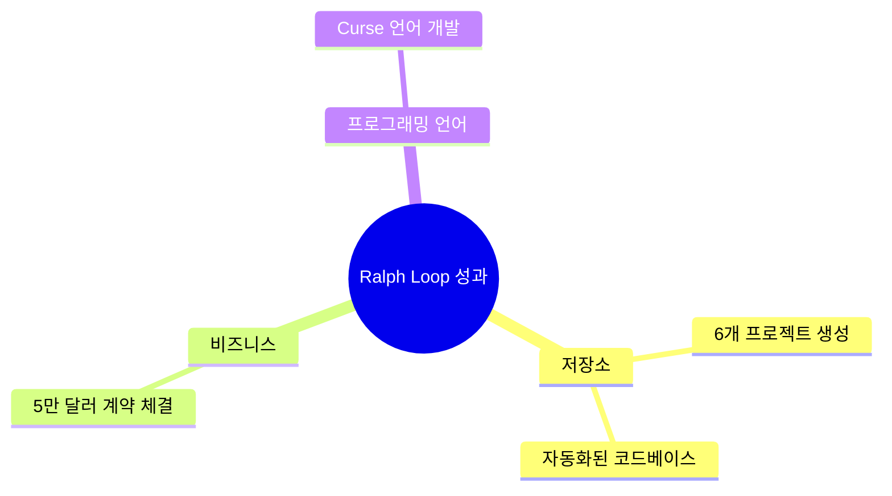

## 언제 사용하면 좋은가

Ralph Loop를 잘 사용하기 위한 판단 기준은 다음과 같습니다: [https://youtu.be/wz7oFfIR7LA?t=600](https://youtu.be/wz7oFfIR7LA?t=600)

### 적합한 작업

1. **명확한 성공 기준을 잘 갖춘 정의된 과제**
2. **자동으로 검증할 수 있는 작업** (테스트 실행, 린트 실행 등)
3. **정확한 방향성을 찔러 줄 수 있는 규칙이 있는 상황**

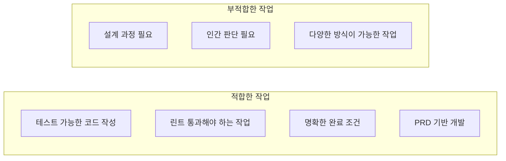

### 부적합한 작업

- 하나를 구현하는데 A, B, C라는 다양한 방식이 있다면 Ralph Loop는 어디로 가야 할지 정확히 모릅니다
- 인간의 판단이나 설계 과정이 필요한 작업에는 사용하지 않는 것이 좋습니다

## 주의사항

### 토큰 비용

Ralph Loop는 반복적으로 작업을 수행하므로 토큰 비용이 많이 들 수 있습니다. 댓글에서도 많은 사용자들이 비용에 대한 우려를 표했습니다:

- "다 좋은데 비용이 많이 들어서 손도 못대겠어요"
- "오푸스 쓰면 크일 날 듯.. 회사는 쓸 듯. 개인은 힘들 듯"
- "연습용으로 돌리기에는 설명만 들어도 비용이 녹는 소리가..."

### 검증 습관 기르기

물론 Ralph를 전적으로 믿어서는 안 됩니다. 항상 검증을 어떻게 하면 좋을지 고민해 보는 습관을 기르는 것이 좋습니다.

### 실패에서 배우기

Ralph Loop를 통해 다음과 같은 철학을 깨우칠 수 있습니다:

> 처음에는 그냥 마구잡이로 만들어 보세요. 그리고 실패했을 때마다 표지판을 옆에서 추가해 주면 됩니다. "통합 테스트를 추가해라", "연동할 때 플레이라이트 MCP를 이용해라"처럼 말이죠.

결국 이 실패들을 옆에서 보면서 올바른 검증을 할 수 있게 만든다면, **반복을 통해 완벽을 만들 수 있습니다**.

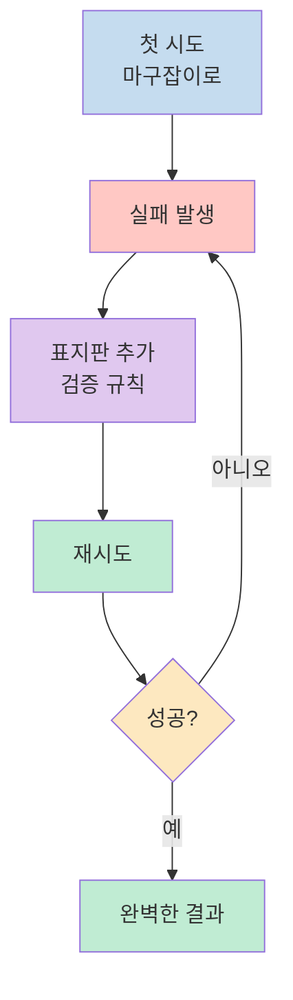

## 지속적인 개발

Ralph가 태스크를 구현하면서 일부 조정, 기능 또는 버그 수정이 필요할 수 있습니다.

그러려면 `prd-creator` 스킬을 계속 사용하여 PRD와 태스크 목록을 업데이트해야 합니다.

예시:

```
I would like to expand the PRD / tasks with these tasks:

- there is a bug in X that should be fixed by doing Y
- create a new feature that implement Z

etc.
```

여러 태스크를 한 번에 추가해도 괜찮습니다.

## 핵심 요약

| 항목 | 내용 |
|------|------|
| **문제** | Claude가 "완료"라고 해도 실제로는 테스트 실패, 린트 에러 발생 |
| **해결책** | Ralph Loop로 자동 검증 및 수정 반복 |
| **핵심 철학** | 반복해서 완벽하게 만들어라. 처음부터 완벽을 추구하지 말 것 |
| **동작 원리** | 태스크 수행 → 검증 → 실패 시 재시도 → 완료 시 커밋 |
| **설치** | `npm install @pageai/ralph-loop` |
| **주요 옵션** | `--max-iterations`, `--once`, Promise Tags |
| **지원 CLI** | Claude, Codex, Gemini, Copilot, OpenCode 등 |
| **보안** | Docker 샌드박스 |
| **적합한 작업** | 명확한 성공 기준, 자동 검증 가능, PRD 기반 |
| **주의사항** | 토큰 비용 고려, 검증 습관 기르기 |

## 결론

Ralph Loop는 Claude가 "완료했다"고 판단했을 때 진짜로 완료되었는지 다시 한번 확인하고, 문제가 있으면 스스로 수정하는 장기 실행 자동화 워크플로우를 제공합니다.

핵심은 **"처음부터 완벽하지 않아도 된다"**는 것입니다. 실패할 때마다 검증 규칙(표지판)을 추가하면서 반복하다 보면, 결국 완벽한 결과에 도달할 수 있습니다.

Ralph Loop의 가장 큰 장점은:
- **Docker 샌드박스**로 보안 강화
- **PRD 자동 생성**으로 요구사항 관리
- **태스크 기반**으로 체계적인 진행
- **다양한 CLI 지원**으로 유연성 확보
- **Skills 시스템**으로 확장 가능

다만 토큰 비용을 고려하여 적절한 `--max-iterations`을 설정하고, 명확한 성공 기준이 있는 작업에 사용하는 것이 좋습니다. 인간의 판단이나 설계가 필요한 작업보다는 자동으로 검증할 수 있는 작업에 활용해 보세요.
