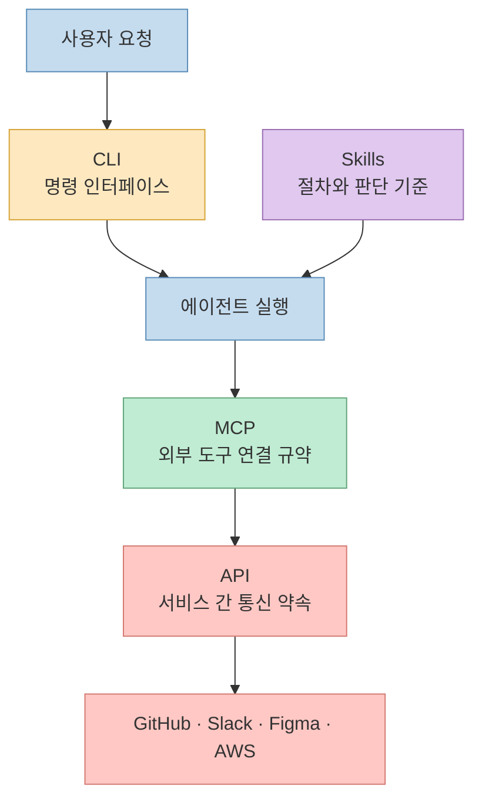
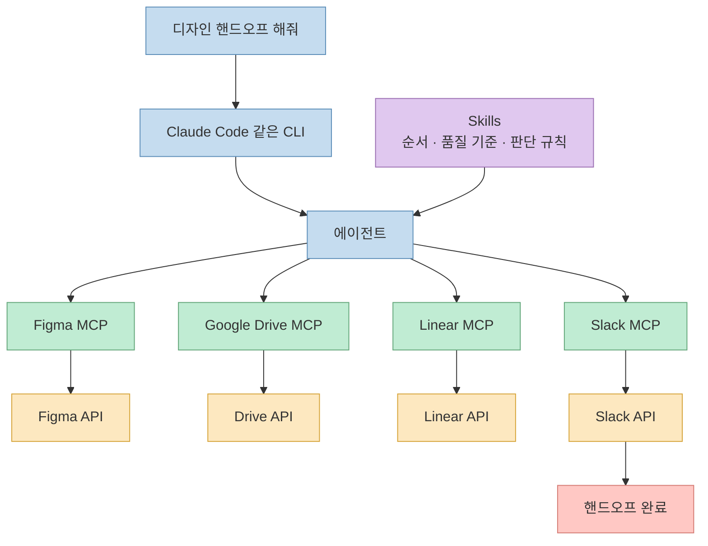

API, MCP, CLI, Skills 이야기가 한꺼번에 나오면 자주 생기는 오해가 있습니다. 하나가 다른 하나를 곧 대체할 것처럼 설명하거나, 서로 다른 층위의 개념을 한 줄 위에 올려놓고 우열을 가르는 식입니다. 이 글은 `unclejobs.ai` 의 Threads 포스트를 바탕으로, 네 개를 **경쟁 기술** 이 아니라 **서로 다른 문제를 맡는 레이어** 로 다시 정리한 메모입니다. 문서 확인 시점은 **2026-03-16** 입니다.

<!--more-->

## Sources

- https://www.threads.com/@unclejobs.ai/post/DV52lYnCRk_?xmt=AQF0LjtAlcgxjxNISmf7MbQcvKwNQr7MVcw4tiLoLjwR1FAg8Yg8v--zQvx6GrlI2C_SIXZp&slof=1
- https://www.scalekit.com/blog/mcp-vs-cli-use
- https://modelcontextprotocol.io
- https://skills.sh
- https://news.ycombinator.com/item?id=47208398

## 왜 이 논쟁이 자꾸 꼬이는가

원문이 짚는 핵심은 단순합니다. `MCP vs CLI` 같은 논쟁은 흥미롭지만, 애초에 비교 대상이 완전히 같은 축에 있지 않다는 점을 놓치면 대화가 계속 엇나갑니다. 예를 들어 API는 서비스 간 통신 규약이고, MCP는 AI가 외부 도구에 접근하는 연결 규약이며, CLI는 사용자가 명령하는 인터페이스이고, Skills는 에이전트가 일을 수행하는 절차적 지식입니다. 즉, 무엇을 연결하는지, 누가 조작하는지, 어떻게 일하는지, 무엇을 기반으로 통신하는지가 모두 다릅니다.

원문이 인용한 최근 논쟁도 여기서 출발합니다.

- Eric Holmes의 "MCP is dead. Long live the CLI" 류 주장처럼 **CLI가 더 단순하고 디버깅 가능성이 높다** 는 지적은 분명 타당합니다.
- 반대로 Slack이나 멀티테넌트 SaaS 맥락에서는 **프로토콜 수준의 권한 경계와 OAuth 관리** 가 필요하기 때문에 MCP가 더 자연스럽습니다.
- 그런데 이 둘만 놓고 보면, 정작 반복 작업의 품질과 절차를 고정하는 **Skills 레이어** 가 빠집니다.

결국 이 논쟁은 "무엇이 더 낫나"보다 **"각각 무엇을 담당하나"를 먼저 분리해야 풀린다** 는 것이 원문의 문제의식입니다.

## 네 개를 한 줄씩 다시 정의하면

원문 내용을 가장 짧게 줄이면 다음과 같습니다.

- **API**: 서비스와 서비스가 대화하는 약속
- **MCP**: AI가 외부 도구를 발견하고 호출하는 표준 통로
- **CLI**: 사람이 터미널에서 시스템을 조작하는 인터페이스
- **Skills**: 에이전트가 어떤 순서와 기준으로 일할지 배우는 지식 패키지

이 정의만 놓고 봐도, 네 개가 같은 층위가 아니라는 점이 바로 보입니다. API는 아래쪽 기반이고, MCP와 CLI는 도구 접근/조작 방식이며, Skills는 행동 품질과 절차를 담당합니다.

## 자동차 비유가 왜 잘 먹히는가

원문은 이 네 개를 자동차에 비유합니다.

- API = 엔진 내부의 피스톤
- MCP = 도로와 신호 체계
- CLI = 핸들과 페달
- Skills = 운전 교본

이 비유가 좋은 이유는, 서로를 대체하는 관계가 아님을 직관적으로 보여주기 때문입니다. 핸들이 엔진을 대체하지 않듯, CLI가 API를 대체하지 않습니다. 도로가 운전 교본을 대신하지 않듯, MCP가 Skills를 없애지 않습니다. 그리고 운전 교본이 있다고 해서 실제 도로 연결이 생기지는 않듯, Skills만으로 외부 서비스 접근 문제를 해결할 수도 없습니다.

즉 `MCP -> CLI로 진화한다` 혹은 `CLI가 Skills를 대체한다` 같은 말은, 비유대로 하면 "도로가 핸들이 된다" 혹은 "핸들이 운전 교본을 없앤다"는 식의 설명이 됩니다.

## 실제 작업에서는 네 레이어가 같이 돈다

원문이 든 예시는 "디자인 핸드오프 해줘" 같은 요청입니다. 이 한 문장 안에서도 네 레이어가 동시에 작동합니다.

1. **Skills** 가 먼저 절차를 정합니다. 예를 들어 "Figma에서 에셋 추출 -> Drive 업로드 -> Linear 태스크 생성 -> Slack 알림" 같은 순서를 에이전트에게 주입합니다.
2. **MCP** 가 실제 외부 도구 연결을 맡습니다. Figma MCP, Drive MCP, Linear MCP, Slack MCP 같은 식입니다.
3. 각 도구 뒤에서는 결국 **API** 가 실제 호출됩니다. Figma REST API, Slack API, Linear GraphQL API 등이 여기 해당합니다.
4. 사용자는 그 전체 흐름을 **CLI** 나 다른 에이전트 인터페이스에서 조작합니다.

포인트는 명확합니다. 한 작업 안에서 이 네 개가 **겹쳐서 협업** 하지, 하나가 등장하면 나머지가 사라지는 식으로 움직이지 않습니다.

## 왜 CLI가 요즘 강하게 다시 주목받는가

원문은 CLI 쪽 주장의 힘도 꽤 공정하게 다룹니다. 특히 개인 개발자 자동화나 로컬 워크플로우에서는 CLI가 강한 이유가 분명합니다.

- **디버깅 투명성**: 같은 명령을 터미널에서 직접 재현하기 쉽습니다.
- **조합 가능성**: `jq`, `grep`, `awk` 같은 유닉스 도구와 자연스럽게 이어집니다.
- **기존 인증 재활용**: `gh`, `aws`, `kubectl` 등 기존 인증 상태를 그대로 활용할 수 있습니다.
- **토큰 효율성**: 원문이 인용한 Scalekit 벤치마크처럼, MCP보다 CLI가 비용과 신뢰성 측면에서 유리한 경우가 있습니다.

특히 "내 GitHub", "내 AWS", "내 리포지토리"를 자동화하는 **개인 워크플로우** 에서는 LLM이 이미 CLI 문법을 잘 안다는 점도 큰 이점입니다. 별도 스키마 주입 없이 `--help` 나 매뉴얼만 읽고도 꽤 잘 움직이기 때문입니다.

## 그런데 멀티테넌트 제품에서는 왜 MCP가 다시 필요해지나

원문이 흥미로운 지점은, 여기서 곧바로 MCP를 버리지 않는다는 점입니다. CLI가 강하다는 주장과, 그럼에도 MCP가 필요한 맥락이 있다는 주장을 동시에 가져갑니다.

대표적인 조건은 다음과 같습니다.

- **CLI가 없는 SaaS** 를 붙여야 할 때
- **사용자별 OAuth** 와 권한 경계를 엄격히 다뤄야 할 때
- **멀티테넌트 B2B 제품** 처럼 A회사 사용자와 B회사 사용자의 데이터가 엄격히 분리돼야 할 때
- **감사 로그** 와 구조화된 도구 경계가 필요할 때

개인 자동화에서는 `gh auth login` 하나로 끝나던 문제가, 제품이 되면 완전히 달라집니다. 누구의 토큰을 언제 쓰는지, 어떤 도구를 어느 테넌트 범위까지 허용할지, 재인증과 만료를 어떻게 관리할지 같은 문제가 생기기 때문입니다. 원문은 이 지점에서 MCP를 **개인 자동화의 경쟁자** 가 아니라 **제품 레벨 권한/연결 문제를 풀기 위한 프로토콜** 로 봅니다.

## 이 논쟁에서 가장 자주 빠지는 레이어가 Skills다

원문 전체에서 가장 중요한 메시지는 사실 여기입니다. `MCP vs CLI` 프레임만으로는, 에이전트가 **어떤 순서와 기준으로 작업해야 하는지** 를 설명할 수 없습니다.

- CLI만 있으면 매번 같은 작업 절차를 길게 설명해야 합니다.
- MCP만 있으면 외부 도구는 연결됐지만, 그 도구를 어떤 품질 기준으로 써야 하는지 모릅니다.
- Skills만 있으면 지식은 있어도 외부 서비스 접근 수단이 없습니다.

즉 Skills는 단순 프롬프트 템플릿이 아니라, "이 작업은 어떤 순서로, 어떤 예외 처리를 하고, 어떤 기준으로 완료 판정할지"를 고정하는 레이어입니다. 프롬프트를 매번 새로 쓰는 방식에서 한 단계 더 나아가, 반복되는 절차를 **재사용 가능한 작업 지식** 으로 바꾸는 역할을 합니다.

이 관점에서 보면 원문의 정리는 꽤 설득력 있습니다. `프롬프트 -> Skills` 는 같은 지식 레이어 안의 진화이고, `API -> MCP` 는 같은 연결 레이어 안의 진화이며, CLI는 여전히 별도의 인터페이스 축에 서 있습니다.

## 그래서 언제 무엇을 쓰면 되나

원문을 실무 기준으로 다시 압축하면 아래 표처럼 정리할 수 있습니다.

| 상황 | 우선 선택 | 이유 |
|------|-----------|------|
| GitHub, AWS, kubectl처럼 강한 CLI가 이미 있는 도구 | CLI | 비용이 낮고, 디버깅과 재현이 쉽고, 모델도 이미 잘 안다 |
| Notion, Linear, Figma처럼 CLI가 약하거나 없는 SaaS | MCP | 외부 서비스 연결을 표준화하기 쉽다 |
| 멀티테넌트 B2B 제품 | MCP | 유저별 OAuth, 권한 경계, 감사 로그가 중요하다 |
| 반복되는 복잡한 업무 절차 | Skills | 한 번 절차를 세팅하면 매번 설명을 줄일 수 있다 |
| 팀 공유형 AI 인프라 | HTTP 원격 MCP + Skills | 연결 계층과 행동 지식을 분리해 재사용하기 좋다 |

이 표에서 중요한 것은 **하나만 고르라는 표가 아니라는 점** 입니다. 실제로는 CLI를 기본 조작면으로 두고, 필요한 SaaS 연결에는 MCP를 붙이고, 반복 업무의 품질과 순서는 Skills로 고정하는 조합이 가장 자연스럽습니다.

## 핵심 요약

- API, MCP, CLI, Skills는 같은 축에서 경쟁하는 기술이 아니라 서로 다른 층위의 문제를 맡습니다.
- CLI는 특히 개인 자동화와 로컬 개발 워크플로우에서 강합니다.
- MCP는 멀티테넌트, OAuth, 권한 경계, SaaS 연결 같은 제품 레벨 문제에서 빛납니다.
- Skills는 반복 작업을 "도구를 아는 상태" 에서 "도구를 잘 쓰는 상태" 로 끌어올리는 레이어입니다.
- 따라서 올바른 질문은 "무엇이 무엇을 대체하나"가 아니라 "내 문제에서 어느 레이어를 먼저 설계해야 하나"에 가깝습니다.

## 결론

이 Threads 포스트의 결론을 한 문장으로 줄이면 이렇습니다. **도구를 연결하는 건 MCP의 일이고, 도구를 조작하는 건 CLI의 일이며, 도구를 잘 쓰는 건 Skills의 일이다.** 그 밑에는 언제나 API가 깔려 있습니다.

그래서 `MCP vs CLI` 같은 문장을 볼 때는 먼저 축을 분리해서 보는 편이 좋습니다. 개인 자동화인지, 팀용 제품인지, 외부 SaaS 연결이 필요한지, 반복 작업 품질을 고정해야 하는지에 따라 정답은 달라집니다. 레이어를 섞어서 보면 논쟁만 남고, 레이어를 분리해서 보면 설계가 시작됩니다.

---

*원본: [Threads @unclejobs.ai](https://www.threads.com/@unclejobs.ai/post/DV52lYnCRk_?xmt=AQF0LjtAlcgxjxNISmf7MbQcvKwNQr7MVcw4tiLoLjwR1FAg8Yg8v--zQvx6GrlI2C_SIXZp&slof=1)*
