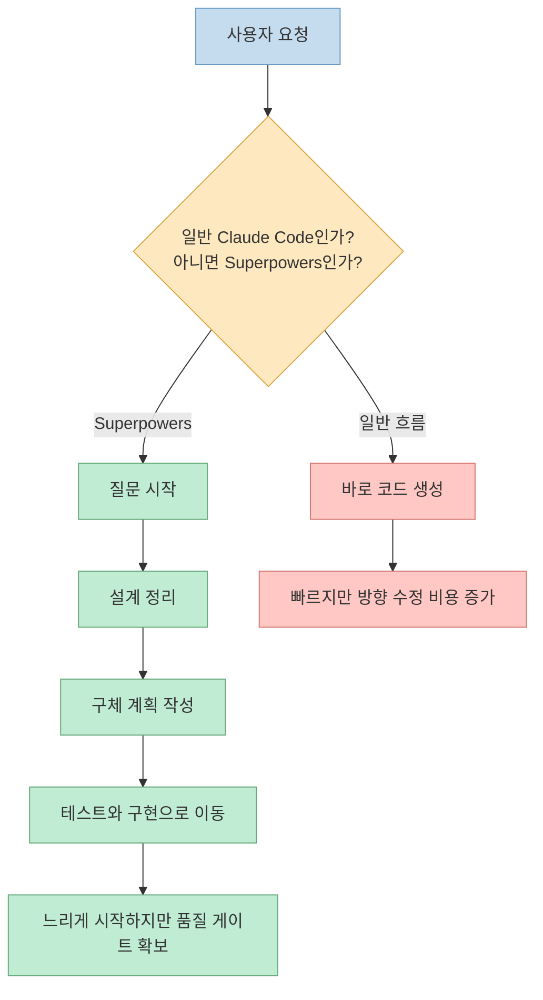
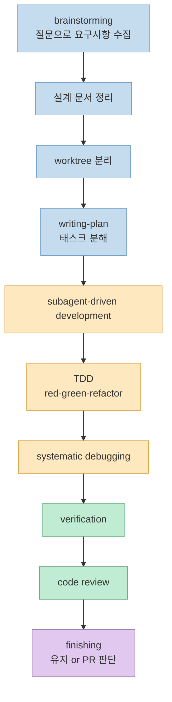
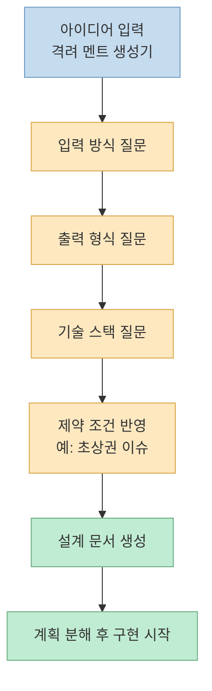
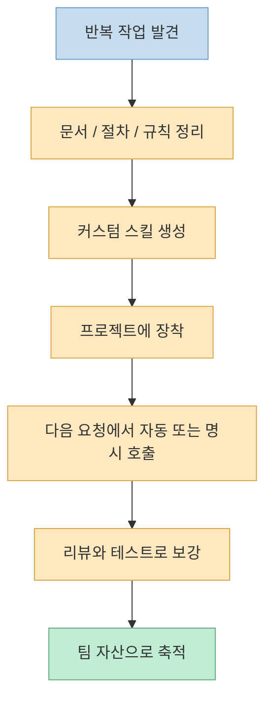

Claude Code를 오래 쓰다 보면 한 가지 패턴이 반복됩니다. 요청을 던지면 바로 코딩은 시작되는데, 질문이 부족하고 설계가 얕으면 결국 버그 수정과 방향 수정에 더 많은 시간을 쓰게 됩니다. 이 영상이 소개하는 `obra/superpowers` 의 핵심은 바로 그 지점을 바꾸는 데 있습니다. **"바로 구현" 대신 질문, 설계, 계획, 테스트, 리뷰를 먼저 강제하는 흐름을 스킬 프레임워크로 만든 것** 이라는 점이 핵심입니다. [근거 영상](https://youtu.be/308zzinIVSA?t=225)

영상은 이 프레임워크를 단순 프롬프트 모음이 아니라, Claude Code가 더 공학적인 방식으로 일하게 만드는 운영 체계로 설명합니다. 특히 왜 이런 구조가 나왔는지, 실제로 어떤 단계로 실행되는지, 그리고 언제 효과가 큰지를 데모와 함께 보여 준다는 점이 인상적입니다. [근거 영상](https://youtu.be/308zzinIVSA?t=12)

<!--more-->

## Sources

- https://www.youtube.com/watch?v=308zzinIVSA
- https://github.com/obra/superpowers

## 1) 왜 Superpowers는 "바로 코딩"보다 질문과 설계를 먼저 강제할까

영상이 가장 먼저 강조하는 포인트는 Superpowers가 감으로 만든 규칙 모음이 아니라는 점입니다. 발표자는 이 프레임워크가 로버트 치알디니의 설득 원칙과 관련 연구를 참고해, Claude가 스킬을 더 잘 따르도록 설계되었다고 설명합니다. 여기서 중요한 것은 심리학 자체보다, **모델이 규칙을 무시하기 쉬운 순간에 어떤 형식의 지시가 더 잘 먹히는지** 를 의도적으로 실험했다는 점입니다. [근거 영상](https://youtu.be/308zzinIVSA?t=12)

그래서 Superpowers의 출발점은 "좋은 프롬프트 한 번 쓰기"가 아닙니다. 오히려 Claude가 압박 상황에서도 스킬을 건너뛰지 않게 만들고, 질문과 계획을 먼저 하게 만드는 **행동 교정 장치** 에 가깝습니다. 영상에서 발표자는 일반 Claude Code가 곧장 구현으로 들어가기 쉬운 반면, Superpowers는 먼저 질문하고 설계하고 계획을 세운 다음 구현으로 내려간다고 설명합니다. [근거 영상](https://youtu.be/308zzinIVSA?t=225)

이 관점이 실무에서 중요한 이유는 분명합니다. AI 코딩의 실패는 "모델이 멍청해서" 보다 **잘못된 방향으로 너무 빨리 달려서** 생기는 경우가 많기 때문입니다. Superpowers는 그 비용을 줄이기 위해 초기 속도를 조금 희생하고, 대신 질문-계획-검증이라는 구조를 앞단에 끌어옵니다. [근거 영상](https://youtu.be/308zzinIVSA?t=225)

## 2) 영상이 보여 주는 핵심 워크플로: brainstorming -> plan -> subagents -> TDD -> review

영상에서 설명하는 Superpowers의 본체는 일련의 연결된 스킬 흐름입니다. 먼저 `brainstorming` 단계에서 무엇을 만들지, 입력 방식은 무엇인지, 결과물 형태는 어떤지 같은 질문을 통해 요구사항을 정리합니다. 그다음 설계 문서를 만들고, worktree를 분리한 뒤, `writing-plan` 류의 계획 단계에서 작업을 태스크 단위로 쪼갠 다음, `subagent-driven development` 와 TDD, 디버깅, verification, code review로 이어지는 흐름을 탑니다. [근거 영상](https://youtu.be/308zzinIVSA?t=225)

이 흐름의 핵심은 구현 자체보다도 **구현 직전에 무엇을 강제하느냐** 에 있습니다. 영상은 특히 TDD를 선택 사항이 아니라 강제되는 기본 규칙으로 설명합니다. 즉 테스트를 먼저 쓰고, 실패를 확인한 다음, 통과할 최소 코드만 구현하고, 이후 리팩터링으로 정리하는 레드-그린-리팩터 사이클이 기본값이라는 뜻입니다. 여기에 디버깅도 막연한 수정이 아니라 원인 분석, 범위 특정, 가설 검증, 수정과 재테스트의 절차로 묶여 있습니다. [근거 영상](https://youtu.be/308zzinIVSA?t=710)

이 워크플로가 좋은 이유는, 하나의 긴 대화에서 모든 단계를 한꺼번에 처리하는 대신 질문, 계획, 구현, 검증을 분리된 절차로 다루게 만들기 때문입니다. 영상에서도 서브에이전트와 병렬 작업, TDD, 검증, 리뷰가 하나의 흐름으로 연결된다고 설명합니다. 즉 Superpowers가 파는 가치는 단순 자동화가 아니라 **역할 분리와 품질 게이트가 있는 실행 구조** 입니다. [근거 영상](https://youtu.be/308zzinIVSA?t=225)

## 3) 설치와 데모가 보여 준 현실적인 포인트

설치 파트에서 영상은 Claude Code에서 Superpowers를 설치해 사용하는 흐름을 설명합니다. 그리고 설치 후 바로 안 보이는 경우가 있는데, 이때 중요한 포인트로 "껐다가 다시 켜야 한다" 는 점을 분명히 짚습니다. 이런 디테일은 사소해 보여도 실제 도입에서 가장 많이 막히는 지점이라서, 영상이 단순 소개가 아니라 실제 사용 경험을 바탕으로 설명하고 있다는 신호이기도 합니다. [근거 영상](https://youtu.be/308zzinIVSA?t=225)

이어지는 데모는 이 프레임워크가 어떤 식으로 요구사항을 구조화하는지 잘 보여 줍니다. 발표자는 하나의 웹 앱 아이디어를 던지고, Superpowers가 입력 방식, 생성 방식, 결과물 포맷, 이미지 생성 여부, 기술 스택, 다운로드 방식까지 질문하면서 설계를 밀어 올리는 장면을 보여 줍니다. 여기서 중요한 것은 결과가 아니라, **사용자의 막연한 아이디어를 설계 가능한 사양으로 바꾸는 질문 흐름** 입니다. [근거 영상](https://youtu.be/308zzinIVSA?t=710)

즉 이 데모의 포인트는 "AI가 앱 하나를 만들었다"가 아닙니다. 오히려 **좋은 질문이 좋은 설계를 만들고, 좋은 설계가 이후의 계획과 구현을 안정화한다** 는 점을 체감시키는 데 있습니다. 영상에서 발표자가 반복해서 강조하는 것도 바로 이 부분입니다. [근거 영상](https://youtu.be/308zzinIVSA?t=710)

## 4) 코드 리뷰와 커스텀 스킬 확장까지 이어지는 운영 모델

영상은 구현이 끝난 뒤에도 바로 종료하지 않습니다. 태스크가 끝날 때마다 코드 리뷰를 하고, 먼저 스펙 준수 여부를 확인한 뒤 그다음 코드 품질을 점검하는 2단계 리뷰 흐름을 설명합니다. 즉 Superpowers는 "만들기"보다 **완료를 판정하는 방식** 까지 프레임워크 안에 넣으려는 방향을 갖고 있습니다. [근거 영상](https://youtu.be/308zzinIVSA?t=710)

후반부에서 더 흥미로운 부분은 커스텀 스킬 확장 이야기입니다. 발표자는 조직이나 프로젝트에 맞는 코딩 컨벤션, 작업 절차, 새로운 도메인 지식을 스킬로 추가해 확장할 수 있다고 설명합니다. 다시 말해 Superpowers의 목적은 내장 스킬 몇 개를 잘 쓰는 데서 끝나지 않고, **팀이 원하는 운영 규칙을 스킬 형태로 계속 축적하는 것** 에 있습니다. [근거 영상](https://youtu.be/308zzinIVSA?t=1470)

이 지점이 중요한 이유는, 한 번 잘 동작한 절차를 다음에도 같은 품질로 재사용할 수 있기 때문입니다. 즉 Superpowers는 단발성 자동화보다도 **반복 가능한 팀 작업 방식을 자산화하는 구조** 에 더 가깝습니다. [근거 영상](https://youtu.be/308zzinIVSA?t=1470)

## 실전 적용 포인트

이 영상을 실무 관점에서 다시 번역하면, Superpowers는 작은 수정 몇 개를 빨리 끝내는 도구라기보다 **새 MVP를 시작하거나, 복잡한 기능을 추가하거나, 코드베이스 전체의 흐름을 다시 잡아야 할 때 더 빛나는 운영 프레임워크** 에 가깝습니다. 발표자도 단순한 자잘한 수정보다는 신규 프로젝트 시작, 피처 단위의 복잡한 기능 추가, 큰 범위의 코드 수정처럼 설계와 계획의 가치가 큰 작업에서 잘 맞는다고 설명합니다. [근거 영상](https://youtu.be/308zzinIVSA?t=1470)

반대로 아주 짧은 수정까지 모두 이 흐름으로 태우면 질문, 설계, 계획, TDD, 리뷰의 오버헤드가 더 크게 느껴질 수 있습니다. 그래서 이 프레임워크를 잘 쓰려면 "항상 켜 두는 만능 모드"로 보기보다, **복잡성 임계치를 넘는 순간에 켜는 구조화 도구** 로 이해하는 편이 맞습니다. [근거 영상](https://youtu.be/308zzinIVSA?t=1470)

## 핵심 요약

- Superpowers의 핵심은 Claude가 바로 구현에 들어가지 않고 질문, 설계, 계획을 먼저 하게 만드는 데 있습니다. [근거 영상](https://youtu.be/308zzinIVSA?t=225)
- 영상은 이 프레임워크가 brainstorming, worktree, planning, subagent-driven development, TDD, debugging, verification, code review를 하나의 흐름으로 묶는다고 설명합니다. [근거 영상](https://youtu.be/308zzinIVSA?t=225)
- 실제 데모의 포인트는 결과물보다도, 막연한 아이디어를 설계 가능한 요구사항으로 바꾸는 질문 흐름에 있습니다. [근거 영상](https://youtu.be/308zzinIVSA?t=710)
- 후반부는 커스텀 스킬을 통해 팀의 절차와 컨벤션을 재사용 가능한 자산으로 축적할 수 있다는 점을 보여 줍니다. [근거 영상](https://youtu.be/308zzinIVSA?t=1470)
- 따라서 Superpowers는 잔수정보다 복잡한 프로젝트나 기능 단위 작업에서 더 큰 효과를 내는 프레임워크로 보는 편이 정확합니다. [근거 영상](https://youtu.be/308zzinIVSA?t=1470)

## 결론

이 영상이 말하는 Superpowers의 본질은 "Claude를 더 똑똑하게 만드는 비밀 프롬프트"가 아닙니다. 오히려 **좋은 엔지니어링 습관을 질문, 계획, 테스트, 리뷰라는 순서로 강제하는 운영 시스템** 에 가깝습니다. 그래서 Claude Code를 이미 쓰고 있는데 결과 품질이 들쭉날쭉하다면, 모델 자체를 바꾸기보다 이런 구조적 워크플로를 도입하는 편이 더 큰 개선을 줄 수 있습니다. [근거 영상](https://youtu.be/308zzinIVSA?t=1470)

<!--
Evidence notes
- claim: Superpowers is presented as a Claude Code skills framework that starts with questions instead of immediate coding | transcript/time marker: "무조건 이제 질문부터 시작" / "클로드 코드용 스킬 프레임워크" / ~3:45 | video url: https://youtu.be/308zzinIVSA?t=225 | confidence: high
- claim: The framework design is explained through persuasion principles and research references around authority, consistency, and social proof | transcript/time marker: "권위의 원칙" / "일관성의 원칙" / "사회적 증거" / ~0:12 | video url: https://youtu.be/308zzinIVSA?t=12 | confidence: high
- claim: The workflow includes brainstorming, planning, worktree isolation, subagent-driven development, TDD, debugging, verification, and code review | transcript/time marker: "브레인스토밍" / "워크트리" / "라이팅 플랜" / "테스트 드리븐" / "베리피케이션" / ~3:45 and ~11:50 | video url: https://youtu.be/308zzinIVSA?t=225 | confidence: high
- claim: After installation, users may need to restart Claude Code for the framework to appear properly | transcript/time marker: "중요한 건 이제 껐다가 켜셔야 돼요" / early install explanation | video url: https://youtu.be/308zzinIVSA?t=225 | confidence: medium
- claim: The live demo turns a rough web app idea into a more concrete specification by asking about input, output, image generation, stack, and delivery choices | transcript/time marker: "어떤 걸 어떻게 개발" / "자유 텍스트" / "텍스트 플러스 공유 버튼" / "넥스트랑 버셀" / ~11:50 | video url: https://youtu.be/308zzinIVSA?t=710 | confidence: high
- claim: Code review is described as a two-step process of spec compliance and quality checks | transcript/time marker: "스펙 준수" / "코드 품질" / ~11:50 | video url: https://youtu.be/308zzinIVSA?t=710 | confidence: high
- claim: The framework supports creating or extending custom skills to encode team conventions and workflows | transcript/time marker: "스킬을 업그레이드" / "새로운 스킬을 만들 때" / ~24:30 | video url: https://youtu.be/308zzinIVSA?t=1470 | confidence: high
- claim: The presenter recommends this approach more for new MVPs, complex features, or broad changes than for very small edits | transcript/time marker: "신규로 MVP 프로젝트" / "피처 단위" / "전체적인 코드 수정" / ~24:30 | video url: https://youtu.be/308zzinIVSA?t=1470 | confidence: high
-->
