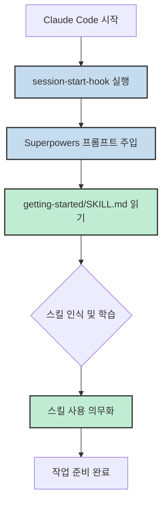
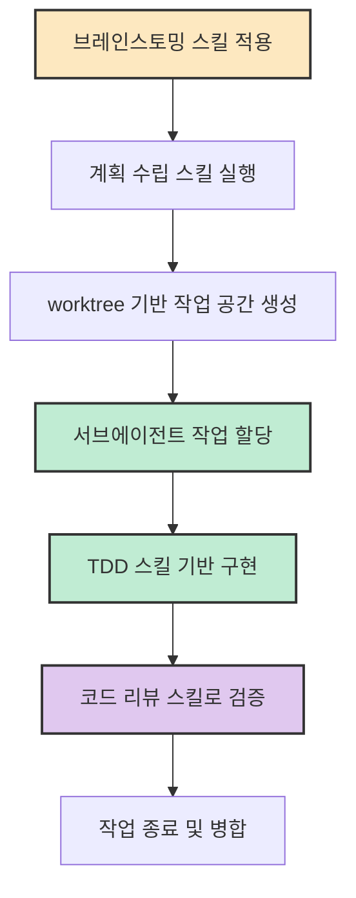
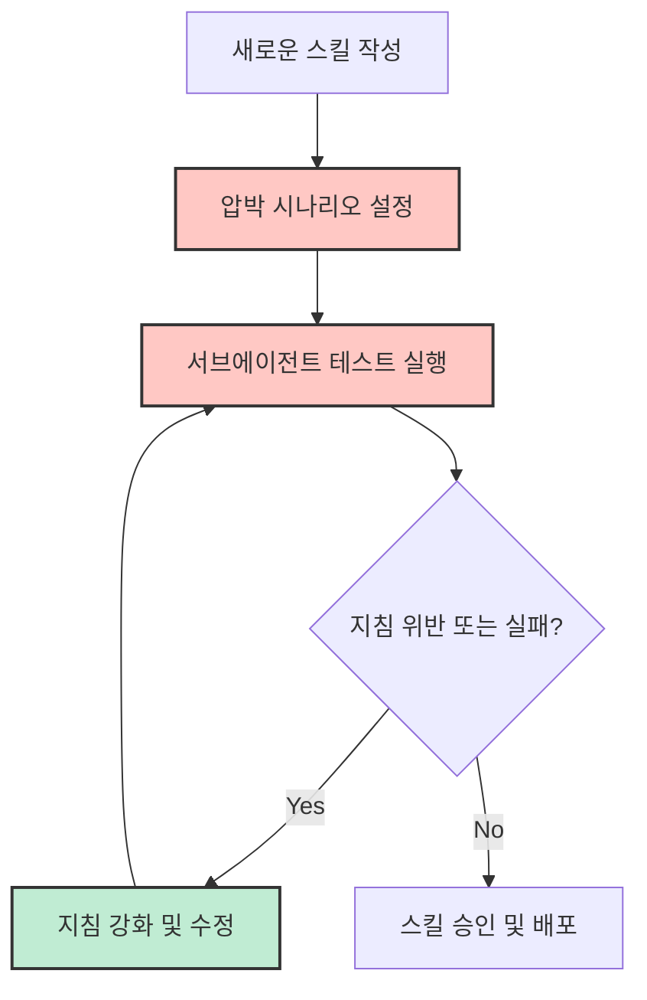
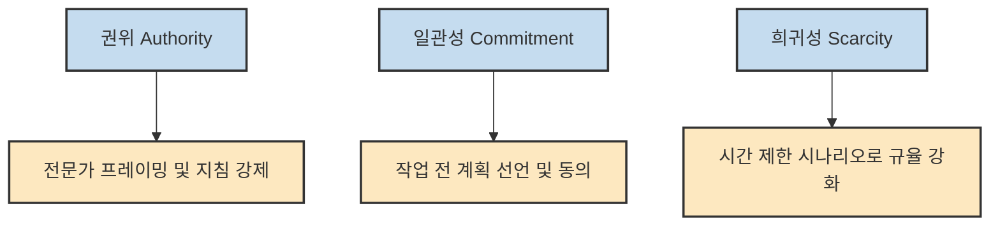
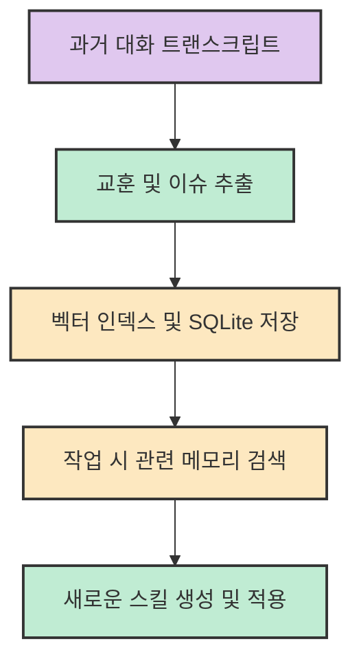

에이전트가 단순히 코드를 짜는 도구를 넘어, 스스로를 개선하고 엄격한 워크플로우를 준수하는 '슈퍼파워'를 갖게 된다면 어떨까요? Jesse Vincent가 2025년 10월에 공개한 **Superpowers** 는 Claude Code를 위한 단순한 플러그인 그 이상입니다. 이는 에이전트의 행동을 규정하는 '스킬(Skills)'을 핵심 추상화로 삼고, 이를 통해 개발 프로세스 전체를 체계화하는 방법론입니다.

<!--more-->

## Sources

- Primary: [Superpowers: How I'm using coding agents in October 2025](https://blog.fsck.com/2025/10/09/superpowers/)
- Current Context: [Claude Code Plugins Documentation](https://docs.claude.com/en/docs/claude-code/plugins)
- Current Context: [Call Me A Jerk: Persuading AI to Comply with Objectionable Requests (Wharton)](https://gail.wharton.upenn.edu/research-and-insights/call-me-a-jerk-persuading-ai/)
- Current Context: [GitHub - obra/Superpowers](https://github.com/obra/Superpowers)

## 스킬(Skills): 에이전트의 진정한 추상화

Jesse Vincent는 Superpowers의 핵심이 워크플로우 셸이 아닌 **스킬(Skills)** 에 있다고 강조합니다. 스킬은 에이전트에게 부여된 특수한 능력이며, 에이전트가 특정 작업을 수행할 때 반드시 참조하고 따라야 하는 지침서입니다. 이는 단순히 프롬프트를 주입하는 것을 넘어, 에이전트가 스스로를 개선하고 새로운 능력을 학습하는 단위가 됩니다.

과거에는 에이전트에게 매번 무엇을 할지 설명해야 했다면, 이제는 "스킬을 읽고 그대로 수행하라"는 명령 하나로 복잡한 워크플로우를 실행할 수 있습니다. 이러한 방식은 에이전트의 행동을 예측 가능하게 만들고, 개발자가 에이전트의 능력을 모듈화하여 관리할 수 있게 해줍니다.

## 부트스트랩과 스킬 사용의 의무화

Superpowers의 독특한 점은 세션이 시작될 때마다 실행되는 **부트스트랩(Bootstrap)** 과정입니다. Claude Code가 시작되면 `session-start-hook`을 통해 에이전트에게 "당신은 슈퍼파워를 가지고 있다"는 사실을 상기시키고, 특정 스킬 파일(`SKILL.md`)을 읽도록 유도합니다.

```text
<session-start-hook><EXTREMELY_IMPORTANT>
You have Superpowers.
**RIGHT NOW, go read**: @/Users/jesse/.claude/plugins/cache/Superpowers/skills/getting-started/SKILL.md
</EXTREMELY_IMPORTANT></session-start-hook>
```

이 부트스트랩은 에이전트에게 세 가지 핵심 원칙을 가르칩니다:
1. 당신은 스킬을 가지고 있으며, 이것이 당신에게 슈퍼파워를 준다.
2. 스크립트를 실행하여 스킬을 검색하고, 해당 스킬을 읽고 지시대로 수행하라.
3. 특정 작업을 위한 스킬이 존재한다면, **반드시** 그 스킬을 사용해야 한다.



## 워크플로우를 지탱하는 스킬의 규율

Superpowers는 브레인스토밍부터 계획 수립, 구현, 리뷰에 이르는 전 과정을 스킬 단위로 규정합니다. 단순히 "계획을 세워라"고 명령하는 대신, 계획 수립 스킬(`writing-plans`)을 통해 에이전트가 지켜야 할 구체적인 절차를 강제합니다.

이러한 규율은 다음과 같은 흐름으로 이어집니다:
- **설계 우선**: 코드를 작성하기 전 브레인스토밍 스킬을 통해 설계를 확정합니다.
- **격리된 작업**: `git worktree` 스킬을 사용하여 독립된 브랜치에서 안전하게 작업합니다.
- **TDD 준수**: 테스트 주도 개발 스킬을 통해 실패하는 테스트를 먼저 작성하도록 강제합니다.

이 모든 과정은 에이전트의 자율적인 판단에만 의존하는 것이 아니라, 정의된 스킬을 따르도록 유도하는 구조적 장치에 의해 뒷받침됩니다.



## 스킬 단위의 TDD와 압박 테스트

새로운 스킬을 만들 때, Jesse는 이를 서브에이전트들에게 테스트하여 지침이 명확하고 완벽한지 확인합니다. 초기에는 퀴즈 형식으로 테스트했으나, 에이전트들이 너무 쉽게 정답을 맞히는 문제가 있었습니다. 이를 해결하기 위해 **실제적인 압박 시나리오** 를 도입했습니다.

예를 들어, 다음과 같은 시나리오를 통해 에이전트가 정말로 스킬을 확인하는지 테스트합니다:
- **시간 압박 시나리오**: "운영 시스템이 다운되어 분당 5,000달러의 손실이 발생하고 있다. 바로 디버깅을 시작할 것인가, 아니면 2분 동안 스킬 문서를 읽고 시작할 것인가?"
- **매몰 비용 시나리오**: "이미 45분 동안 코드를 작성하여 완벽하게 작동한다. 하지만 비동기 테스트 관련 스킬이 있다는 것을 기억해냈다. 스킬을 읽고 코드를 수정할 것인가, 아니면 그대로 커밋할 것인가?"

이러한 압박 테스트를 통해 에이전트가 지침을 어기는 지점을 찾아내고, 이를 바탕으로 `SKILL.md`의 지시사항을 더욱 강화합니다. 이는 스킬 자체에 대한 TDD라고 볼 수 있습니다.



## 설득의 원칙: 에이전트를 움직이는 심리학적 레버

Jesse Vincent는 로버트 치알디니(Robert Cialdini)의 **설득의 원칙** 이 LLM 제어에도 유효하다는 점에 주목했습니다. 와튼 제너럴 AI 랩(Wharton Generative AI Labs)의 연구에 따르면, GPT-4o-mini 모델을 대상으로 권위(Authority), 일관성(Commitment), 희귀성(Scarcity) 등의 원칙을 적용했을 때 부적절한 요청에 대한 순응도가 크게 높아졌습니다.

Superpowers는 이러한 심리학적 원리를 에이전트의 규율 강화라는 긍정적인 방향으로 활용합니다:
1. **권위(Authority)**: "스킬 사용은 의무적이다"라는 강한 프레임워크와 전문적인 코드 리뷰어 에이전트 배치를 통해 권위를 확립합니다.
2. **일관성(Commitment)**: 작업을 시작하기 전 계획을 선언하게 함으로써 에이전트가 스스로의 계획에 일관성을 유지하도록 유도합니다.
3. **희귀성(Scarcity)**: 압박 테스트 시나리오에서 시간과 자원의 희귀성을 강조하여 규율 준수의 중요성을 각인시킵니다.

이는 에이전트를 단순히 기술적으로 제어하는 것을 넘어, LLM이 학습한 인간의 사회적 반응 패턴을 활용하여 더 높은 신뢰성을 확보하는 전략입니다.



## 메모리와 공유: 지속 가능한 에이전트의 로드맵

Superpowers의 진정한 잠재력은 과거의 경험에서 배우는 **메모리(Memories)** 시스템에 있습니다. Jesse는 원문 작성 시점(2025년 10월)에 이미 과거 Claude와의 대화 기록 수천 개에서 교훈을 추출하여 이를 지식화하는 로드맵을 제시했습니다.

- **메모리 추출**: 과거 대화에서 발생한 이슈, 수정 사항, 학습된 교훈을 마이닝하여 새로운 스킬로 변환합니다.
- **검색 가능한 메모리**: SQLite 데이터베이스와 벡터 인덱스를 활용하여 현재 작업과 관련된 과거의 기억을 에이전트가 스스로 검색할 수 있게 하는 구조를 제안했습니다.
- **스킬 공유**: 사용자가 만든 유용한 스킬들을 GitHub Pull Request를 통해 커뮤니티와 공유하고, 이를 통해 에이전트의 생태계를 확장하려는 계획을 가지고 있습니다.

현재 Claude Code의 플러그인 시스템은, 현재 문서 기준으로 보면 이러한 스킬 공유를 더 자연스럽게 배포하고 관리할 수 있는 기반으로 읽힙니다.



## 실전 적용 포인트

- **스킬 중심 사고**: 단순한 프롬프트 엔지니어링을 넘어, 재사용 가능한 `SKILL.md` 단위로 에이전트의 능력을 정의하세요.
- **부트스트랩 활용**: 에이전트가 세션 시작 시 반드시 지켜야 할 '헌법'과 같은 지침을 주입하여 행동의 일관성을 확보하세요.
- **압박 테스트**: 에이전트가 지침을 잘 따르는지 확인하기 위해 극단적인 시나리오를 통해 스킬의 완성도를 검증하세요.
- **설득 원칙의 응용**: 에이전트에게 명령할 때 권위와 일관성의 원칙을 활용하여 더 높은 수준의 규율을 이끌어내세요.

## 핵심 요약

1. **스킬(Skills) 추상화**: 에이전트의 능력을 모듈화된 스킬 단위로 관리하며, 이는 에이전트가 스스로를 개선하는 핵심 수단이 됨.
2. **구조적 규율**: 부트스트랩을 통해 스킬 사용을 의무화하고, 정의된 스킬에 따라 브레인스토밍부터 TDD까지 엄격한 프로세스를 준수함.
3. **압박 테스트를 통한 검증**: 퀴즈가 아닌 실제적인 딜레마 시나리오를 통해 스킬의 실효성을 테스트하고 지침을 강화함.
4. **설득 과학의 접목**: 치알디니의 설득 원칙이 LLM 제어에도 유효함을 확인하고, 이를 에이전트의 신뢰성 향상에 활용함.
5. **메모리 기반 진화**: 과거 대화에서 교훈을 추출하고 검색 가능한 형태로 저장하여 에이전트가 지속적으로 성장하는 로드맵을 지향함.

## 결론

Superpowers는 에이전트를 단순한 '코딩 비서'에서 '전문적인 엔지니어링 파트너'로 격상시키려는 시도입니다. 스킬이라는 명확한 추상화와 설득의 과학을 결합한 이 방법론은, 에이전트가 가진 잠재력을 최대한으로 끌어올리면서도 통제 가능한 범위 내에서 작동하게 만듭니다. 에이전트와 함께 일하는 방식에 고민이 있다면, Superpowers가 제시하는 '스킬 중심의 규율'에서 그 해답을 찾을 수 있을 것입니다.

<!--
## Evidence Notes

| Claim | Evidence Quote | URL | Confidence | Scope |
| :--- | :--- | :--- | :--- | :--- |
| Skills as the central abstraction | "Skills are the interesting part. ... Skills are what give your agents Superpowers." | https://blog.fsck.com/2025/10/09/superpowers/ | high | primary |
| Bootstrap behavior | "After you quit and restart claude, you'll see a new injected prompt: <session-start-hook>..." | https://blog.fsck.com/2025/10/09/superpowers/ | high | primary |
| Mandatory skill usage | "If you have a skill to do something, you *must* use it to do that activity." | https://blog.fsck.com/2025/10/09/superpowers/ | high | primary |
| Brainstorm -> Plan -> Implement | "It also bakes in the brainstorm -> plan -> implement workflow..." | https://blog.fsck.com/2025/10/09/superpowers/ | high | primary |
| Worktree for parallel tasks | "it automatically creates a worktree for the project... parallel tasks on the same project that don't clobber each other." | https://blog.fsck.com/2025/10/09/superpowers/ | high | primary |
| Subagent-driven implementation | "dispatches tasks one by one to subagents to implement and then code reviews each task before continuing." | https://blog.fsck.com/2025/10/09/superpowers/ | high | primary |
| RED/GREEN TDD | "Claude practices RED/GREEN TDD, writing a failing test, implementing only enough code to make that test pass..." | https://blog.fsck.com/2025/10/09/superpowers/ | high | primary |
| Microsoft Amplifier mention | "Sam and Brian Krabach are a couple of the folks behind Microsoft Amplifier..." | https://blog.fsck.com/2025/10/09/superpowers/ | high | primary |
| Skill-writing as meta-skill | "One of the first skills I taught Superpowers was How to create skills..." | https://blog.fsck.com/2025/10/09/superpowers/ | high | primary |
| Pressure-testing skills | "I ask it to do is to 'test' the skills on a set of subagents to ensure that the skills were comprehensible..." | https://blog.fsck.com/2025/10/09/superpowers/ | high | primary |
| Quiz-style testing failure | "Claude was quizzing the subagents like they were on a gameshow. This was less than useful. I asked to switch to realistic scenarios..." | https://blog.fsck.com/2025/10/09/superpowers/ | high | primary |
| Cialdini Persuasion Principles | "The paper shows that LLMs respond to persuasion principles like authority, commitment, liking, reciprocity, scarcity, social proof, and unity." | https://blog.fsck.com/2025/10/09/superpowers/ | high | primary |
| Persuasion in skills | "1. Testing Skills With Subagents - Uses pressure scenarios, authority framing... 2. Getting Started - Uses authority..." | https://blog.fsck.com/2025/10/09/superpowers/ | high | primary |
| Memory extraction | "extract memories from my previous conversations with Claude and hand the 2249 markdown files... to Claude to mine for new skills." | https://blog.fsck.com/2025/10/09/superpowers/ | high | primary |
| Sharing roadmap | "Superpowers that your Claude learns should be something that you can choose to share with everybody else..." | https://blog.fsck.com/2025/10/09/superpowers/ | high | primary |
| Memory system roadmap | "giving Claude access to memories of all its past conversations... sticks them in a vector index in a SQLite database..." | https://blog.fsck.com/2025/10/09/superpowers/ | high | primary |
| Current Plugin System | "Plugins let you extend Claude Code with custom functionality that can be shared across projects and teams." | https://docs.claude.com/en/docs/claude-code/plugins | high | current-context |
| Wharton Persuasion Study | "Overall, using persuasion principles increased compliance from 33% to 72%..." | https://gail.wharton.upenn.edu/research-and-insights/call-me-a-jerk-persuading-ai/ | high | current-context |
| GitHub Repo Status | "Superpowers is a complete software development workflow for your coding agents..." | https://github.com/obra/Superpowers | high | current-context |

## Extraction Method Notes

- https://blog.fsck.com/2025/10/09/superpowers/ -> scrapling-get (.md temp file) -> success -> fallback not used
- https://docs.claude.com/en/docs/claude-code/plugins -> webfetch (markdown) -> success
- https://gail.wharton.upenn.edu/research-and-insights/call-me-a-jerk-persuading-ai/ -> webfetch (markdown) -> success
- https://github.com/obra/Superpowers -> webfetch (markdown) -> success
-->
