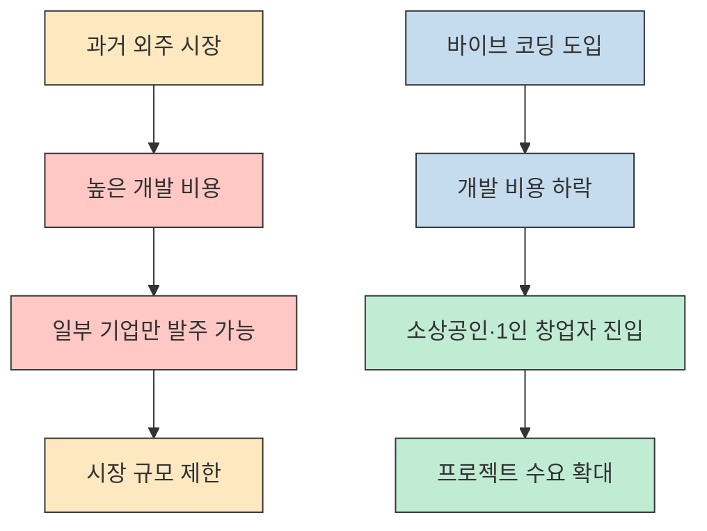
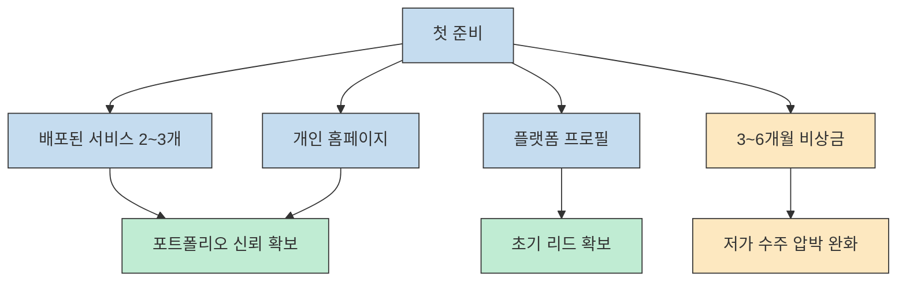
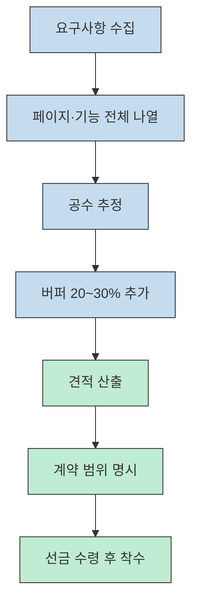
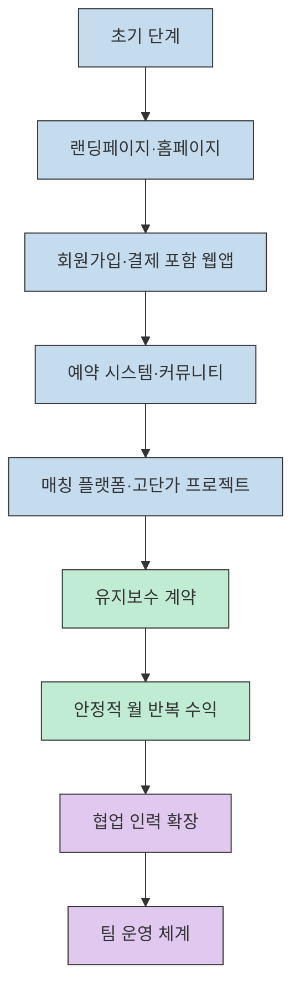

이 영상은 "바이브 코딩으로 외주를 더 싸게 만들 수 있다"는 주장만 반복하지 않습니다. 발표자는 시장 변화, 첫 포트폴리오 준비, 견적과 계약 실수, 그리고 유지보수 기반 성장 전략까지 한 흐름으로 묶어 설명합니다. 다만 글에 등장하는 수익 사례나 시장 확대 수치는 대부분 발표자가 영상에서 제시한 주장과 경험담이므로, 그대로 일반화하기보다 **현장 감각을 담은 실전 가이드** 로 읽는 편이 안전합니다.[^1]

<!--more-->

## Sources

- [https://www.youtube.com/watch?v=UIv9gH3TzEU](https://www.youtube.com/watch?v=UIv9gH3TzEU) - 바이브코딩으로 돈을 버는 가장 빠른 방법 (입력 1)
- [https://www.youtube.com/watch?v=UIv9gH3TzEU](https://www.youtube.com/watch?v=UIv9gH3TzEU) - 바이브코딩으로 돈을 버는 가장 빠른 방법 (입력 2)

## 1) 바이브 코딩이 외주 시장을 어떻게 바꿨다고 보는가

발표자의 핵심 메시지는 단순합니다. 예전에는 수천만 원 단위였던 개발 외주가 이제는 수백만 원 수준에서도 가능해졌고, 그 결과 "원래는 발주 자체를 못 하던 고객"이 시장에 들어오기 시작했다는 것입니다. 즉, 단가 하락이 곧 시장 축소가 아니라 **진입 장벽 하락과 발주자 확대** 로 이어졌다는 해석입니다.[^2]

여기서 말하는 **바이브 코딩** 은 코드를 직접 한 줄씩 작성하는 대신, AI에게 원하는 기능과 흐름을 자연어로 설명하고 결과를 검토·수정하는 작업 방식입니다. 영상에서는 Claude Code, Cursor, Replit 같은 도구가 예시로 등장하고, 핵심 경쟁력은 문법 암기보다 "AI에게 무엇을 어떻게 요구할지"를 분명하게 설명하는 능력이라고 정리합니다.[^3]

중요한 건 발표자도 바이브 코딩을 만능으로 보지 않는다는 점입니다. AI가 코드를 생성하더라도 실제 동작 여부, 보안 문제, 사용자 경험의 적절성은 사람이 판단해야 합니다. 그래서 영상이 말하는 경쟁력은 코딩 숙련도 자체보다도 **기획력, 문제 정의력, 도메인 이해, 품질 판단력** 에 더 가깝습니다.[^4]

이 관점을 뒤집어 보면, 비개발자에게도 기회가 열리는 이유가 보입니다. 고객 비즈니스를 이해하고 필요한 기능을 언어로 구조화할 수 있다면, 구현 일부를 AI가 보조하는 시대에는 오히려 현업 경험이 차별점이 될 수 있기 때문입니다. 영상에서 매장 운영 경험이 있는 사람이 예약 시스템의 불편을 더 잘 짚어낼 수 있다고 말하는 대목이 바로 이 맥락입니다.[^5]

## 2) 시작 전에 무엇을 준비하고, 첫 고객은 어디서 찾는가

발표자가 가장 먼저 강조하는 준비물은 포트폴리오입니다. 특히 정적 소개 문서보다 **실제로 배포되어 돌아가는 서비스 2~3개** 가 훨씬 강한 설득력을 가진다고 말합니다. 바이브 코딩으로 만든 프로젝트라도 직접 실행해볼 수 있으면 충분하며, 고객은 제작 방식보다 결과물의 품질을 본다는 설명입니다.[^6]

두 번째 준비물은 현금 흐름입니다. 영상에서는 최소 3~6개월 생활비를 비상금으로 확보하라고 권하고, 그래야 급한 마음에 낮은 단가를 받거나 까다로운 고객 프로젝트를 억지로 수주하지 않게 된다고 설명합니다. 여기에 사업자등록, 종합소득세 대응, 세무사 기장까지 포함해 "프리랜서 운영 체계" 를 초반부터 갖추라고 조언합니다.[^7]

고객을 찾는 채널은 인맥, 플랫폼, 퍼스널 브랜딩, 기존 고객 소개, 스타트업 커뮤니티 활동의 다섯 가지로 정리됩니다. 다만 순서는 분명합니다. 초반에는 지인과 플랫폼으로 시작하고, 장기적으로는 YouTube·블로그·Threads 같은 퍼스널 브랜딩 채널에서 전문성을 드러내 고객이 먼저 들어오게 만드는 구조가 더 유리하다고 봅니다.[^8]

첫 미팅의 포인트도 실무적입니다. 발표자는 고객이 연락해 왔을 때 바로 견적부터 말하지 말고, 먼저 고객의 비즈니스와 문제를 이해한 뒤 요구사항을 문서화해 보여주라고 권합니다. 이 문서화 작업 자체가 신뢰의 신호가 되고, "이 사람은 개발자가 아니라 문제를 정리해주는 파트너" 라는 인상을 준다는 것입니다.[^9]

또 하나 눈에 띄는 부분은 전문 분야 선택입니다. 영상은 "뭐든지 다 합니다"가 사실상 아무 전문성도 없다는 뜻과 같다고 지적합니다. 홈페이지, 쇼핑몰, 예약 시스템, 매칭 플랫폼처럼 프로젝트 종류별 단가와 복잡도가 다르기 때문에, 초반에는 단순 웹앱으로 시작하되 점차 **복잡도와 단가가 함께 올라가는 구간** 으로 이동해야 한다고 설명합니다.[^10]

## 3) 견적·계약·레드플래그: 돈을 버는 것보다 먼저 돈을 지키는 법

발표자는 프리랜서가 가장 많이 손해 보는 지점을 "개발"이 아니라 "견적과 범위 관리" 에서 찾습니다. 영상에서 추천하는 시작점은 시간 단위 청구이고, 경험이 쌓여 공수 예측이 가능해지면 고정가 프로젝트로 넘어가라는 구조입니다. 핵심은 모든 화면과 기능을 빠짐없이 나열하고, 예상 공수에 반드시 20~30% 버퍼를 더하라는 것입니다.[^11]

이때 빠뜨리기 쉬운 항목도 구체적으로 짚습니다. 화면만 보고 견적을 내면 백엔드 작업량이 사라지고, 결제 연동·소셜 로그인·서버 세팅·테스트·커뮤니케이션 비용이 누락되기 쉽다는 것입니다. 영상에 나오는 대시보드 프로젝트 손해 사례는 결국 "기획이 빈약한 상태에서 대충 견적을 냈을 때 어떤 일이 생기는가"를 보여주는 경고 예시로 읽을 수 있습니다.[^12]

계약 파트도 실전적입니다. 프로젝트 범위, 금액과 결제 조건, 작업 기간, 하자 보수 기간, 지식재산권을 계약서에 반드시 넣고, 결제는 선금 30%·중도금 30%·잔금 40%처럼 쪼개 받으라고 합니다. 특히 선금을 받기 전에는 작업을 시작하지 말라는 조언은 단순한 원칙이 아니라 리스크 통제 장치로 설명됩니다.[^13]

레드플래그 고객사 기준도 명확합니다. 담당자가 자주 바뀌는 곳, 기획 없이 "비슷하게 하나 만들어 달라"고만 하는 곳, 계약서 작성을 꺼리는 곳은 위험 신호로 제시됩니다. 여기에 더해 scope creep, 즉 범위 초과 요청을 초반에 통제하지 못하면 작은 추가 기능이 전체 공수를 두 배로 만들 수 있으므로, 처음부터 "기능 목록 밖의 요청은 추가 비용" 이라고 합의하라고 말합니다.[^14]

결국 이 섹션의 메시지는 단순합니다. 바이브 코딩이 구현 속도를 올려준다 해도, 프리랜서 수익성은 여전히 **범위를 어떻게 정의하고, 견적을 어떻게 산출하고, 계약을 어떻게 방어하느냐** 에서 갈린다는 것입니다.[^15]

## 4) 금액대를 올리고, 유지보수와 팀으로 확장하는 방법

성장 전략 파트에서 발표자는 기술보다 비즈니스 감각을 더 중요한 요소로 놓습니다. 예약 시스템이 고객에게 매달 200만 원의 인건비 절감을 만든다면, 1,000만 원 견적은 비싼 가격이 아니라 오히려 가치 대비 저렴한 가격일 수 있다는 예시가 대표적입니다. 즉, 단가를 올리는 출발점은 공수 설명이 아니라 **고객이 얻는 경제적 가치의 언어** 를 익히는 데 있습니다.[^16]

그래서 영상은 홈페이지 -> 쇼핑몰 -> 예약 시스템 -> 커뮤니티 -> 매칭 플랫폼 순으로 금액대를 높여 가라고 제안합니다. 저가 구간은 경쟁이 치열해 가격 경쟁으로 흐르기 쉽고, 복잡한 프로젝트로 갈수록 경쟁자가 줄어 프리미엄을 붙일 수 있다는 논리입니다. 여기에 업종 특화까지 더하면 "병원 시스템 경험자", "교육 서비스 경험자"처럼 더 강한 차별화가 생긴다고 봅니다.[^17]

이 흐름에서 유지보수 계약은 매우 중요합니다. 프로젝트 납품 후 서버 관리, 버그 수정, 작은 개선을 월 과금으로 묶으면 불규칙한 프로젝트 수익을 반복 매출로 바꿀 수 있기 때문입니다. 영상에서는 유지보수 고객 10곳이면 월 300만~1,000만 원의 고정 수입 구간이 열릴 수 있다고 설명하고, 바이브 코딩 환경에서는 수정 작업의 효율이 높아져 유지보수 수익성이 더 좋아질 수 있다고 말합니다.[^18]

팀 확장 타이밍도 제시합니다. 프로젝트를 거절해야 하거나 번아웃이 오기 시작하면 그때부터 혼자 다 하려 하지 말고, 디자이너·프론트엔드·다른 프리랜서와 협업해 처리량을 늘리라는 것입니다. 이 단계에서는 Notion, Trello, Slack, GitHub 같은 운영 시스템이 필수이며, 혼자 일할 때의 "머릿속 관리" 가 더 이상 통하지 않는다고 정리합니다.[^19]

## 실전 적용 포인트

이 영상을 그대로 실천 과제로 바꾸면 순서는 의외로 명확합니다. 먼저 작은 사이드 프로젝트를 하나 정해 실제로 배포하고, 그 결과를 개인 홈페이지와 플랫폼 프로필의 첫 포트폴리오로 연결해야 합니다. 이후 고객 미팅에서는 견적보다 문제 정의 문서를 먼저 보여주고, 실제 수주 단계에서는 범위·결제 조건·추가 요청 기준을 계약서와 기능 목록에 고정하는 흐름이 가장 중요합니다.[^20]

한 줄로 요약하면, 바이브 코딩 시대의 프리랜서는 "코드를 빨리 만드는 사람"보다 **고객 문제를 구조화하고, AI를 활용해 더 빠르게 납품하며, 범위와 수익을 통제하는 사람** 에 가깝습니다. 영상이 반복해서 강조하는 것도 결국 이 지점입니다.[^21]

### 핵심 요약

1. 바이브 코딩의 본질은 자동 코딩이 아니라 **자연어 기반 구현 지시와 검수 능력** 이다.[^3]
2. 첫 수주는 화려한 소개보다 **직접 써볼 수 있는 배포된 포트폴리오** 가 훨씬 강하다.[^6]
3. 프리랜서 수익성은 개발 속도보다 **견적, 계약, scope creep 통제** 에서 크게 갈린다.[^11]
4. 장기적으로는 단발 프로젝트보다 **유지보수 계약과 업종 특화** 가 더 큰 레버리지다.[^18]

## 결론

이 영상이 흥미로운 이유는 바이브 코딩을 단순한 생산성 도구로 다루지 않고, 외주 비즈니스 전체의 운영 방식과 연결해서 설명한다는 점입니다. 발표자가 제시하는 숫자와 사례는 어디까지나 개인 경험과 마케팅 메시지가 섞인 주장으로 받아들일 필요가 있지만, 포트폴리오 -> 요구사항 정리 -> 견적 방어 -> 유지보수 반복 수익으로 이어지는 프레임 자체는 꽤 실무적입니다.[^22]

그래서 이 글을 읽고 바로 실행할 수 있는 첫 액션은 하나입니다. 거창한 SaaS를 꿈꾸기보다, 실제 고객 문제 하나를 해결하는 작은 웹앱을 만들어 배포해 보세요. 바이브 코딩 시대의 첫 포트폴리오는 완벽한 코드베이스가 아니라 **실제로 돌아가는 결과물** 에서 시작합니다.[^23]

[^1]: [https://youtu.be/UIv9gH3TzEU?t=0](https://youtu.be/UIv9gH3TzEU?t=0)
[^2]: [https://youtu.be/UIv9gH3TzEU?t=27](https://youtu.be/UIv9gH3TzEU?t=27), [https://youtu.be/UIv9gH3TzEU?t=167](https://youtu.be/UIv9gH3TzEU?t=167), [https://youtu.be/UIv9gH3TzEU?t=228](https://youtu.be/UIv9gH3TzEU?t=228)
[^3]: [https://youtu.be/UIv9gH3TzEU?t=69](https://youtu.be/UIv9gH3TzEU?t=69), [https://youtu.be/UIv9gH3TzEU?t=126](https://youtu.be/UIv9gH3TzEU?t=126)
[^4]: [https://youtu.be/UIv9gH3TzEU?t=188](https://youtu.be/UIv9gH3TzEU?t=188), [https://youtu.be/UIv9gH3TzEU?t=201](https://youtu.be/UIv9gH3TzEU?t=201)
[^5]: [https://youtu.be/UIv9gH3TzEU?t=213](https://youtu.be/UIv9gH3TzEU?t=213), [https://youtu.be/UIv9gH3TzEU?t=219](https://youtu.be/UIv9gH3TzEU?t=219), [https://youtu.be/UIv9gH3TzEU?t=260](https://youtu.be/UIv9gH3TzEU?t=260)
[^6]: [https://youtu.be/UIv9gH3TzEU?t=284](https://youtu.be/UIv9gH3TzEU?t=284), [https://youtu.be/UIv9gH3TzEU?t=298](https://youtu.be/UIv9gH3TzEU?t=298), [https://youtu.be/UIv9gH3TzEU?t=303](https://youtu.be/UIv9gH3TzEU?t=303)
[^7]: [https://youtu.be/UIv9gH3TzEU?t=332](https://youtu.be/UIv9gH3TzEU?t=332), [https://youtu.be/UIv9gH3TzEU?t=347](https://youtu.be/UIv9gH3TzEU?t=347), [https://youtu.be/UIv9gH3TzEU?t=370](https://youtu.be/UIv9gH3TzEU?t=370)
[^8]: [https://youtu.be/UIv9gH3TzEU?t=401](https://youtu.be/UIv9gH3TzEU?t=401), [https://youtu.be/UIv9gH3TzEU?t=413](https://youtu.be/UIv9gH3TzEU?t=413), [https://youtu.be/UIv9gH3TzEU?t=464](https://youtu.be/UIv9gH3TzEU?t=464)
[^9]: [https://youtu.be/UIv9gH3TzEU?t=433](https://youtu.be/UIv9gH3TzEU?t=433), [https://youtu.be/UIv9gH3TzEU?t=448](https://youtu.be/UIv9gH3TzEU?t=448)
[^10]: [https://youtu.be/UIv9gH3TzEU?t=500](https://youtu.be/UIv9gH3TzEU?t=500), [https://youtu.be/UIv9gH3TzEU?t=512](https://youtu.be/UIv9gH3TzEU?t=512), [https://youtu.be/UIv9gH3TzEU?t=526](https://youtu.be/UIv9gH3TzEU?t=526)
[^11]: [https://youtu.be/UIv9gH3TzEU?t=556](https://youtu.be/UIv9gH3TzEU?t=556), [https://youtu.be/UIv9gH3TzEU?t=576](https://youtu.be/UIv9gH3TzEU?t=576), [https://youtu.be/UIv9gH3TzEU?t=588](https://youtu.be/UIv9gH3TzEU?t=588)
[^12]: [https://youtu.be/UIv9gH3TzEU?t=602](https://youtu.be/UIv9gH3TzEU?t=602), [https://youtu.be/UIv9gH3TzEU?t=618](https://youtu.be/UIv9gH3TzEU?t=618)
[^13]: [https://youtu.be/UIv9gH3TzEU?t=629](https://youtu.be/UIv9gH3TzEU?t=629), [https://youtu.be/UIv9gH3TzEU?t=649](https://youtu.be/UIv9gH3TzEU?t=649)
[^14]: [https://youtu.be/UIv9gH3TzEU?t=657](https://youtu.be/UIv9gH3TzEU?t=657), [https://youtu.be/UIv9gH3TzEU?t=701](https://youtu.be/UIv9gH3TzEU?t=701), [https://youtu.be/UIv9gH3TzEU?t=718](https://youtu.be/UIv9gH3TzEU?t=718)
[^15]: [https://youtu.be/UIv9gH3TzEU?t=543](https://youtu.be/UIv9gH3TzEU?t=543), [https://youtu.be/UIv9gH3TzEU?t=629](https://youtu.be/UIv9gH3TzEU?t=629), [https://youtu.be/UIv9gH3TzEU?t=734](https://youtu.be/UIv9gH3TzEU?t=734)
[^16]: [https://youtu.be/UIv9gH3TzEU?t=749](https://youtu.be/UIv9gH3TzEU?t=749), [https://youtu.be/UIv9gH3TzEU?t=761](https://youtu.be/UIv9gH3TzEU?t=761), [https://youtu.be/UIv9gH3TzEU?t=769](https://youtu.be/UIv9gH3TzEU?t=769)
[^17]: [https://youtu.be/UIv9gH3TzEU?t=776](https://youtu.be/UIv9gH3TzEU?t=776), [https://youtu.be/UIv9gH3TzEU?t=818](https://youtu.be/UIv9gH3TzEU?t=818), [https://youtu.be/UIv9gH3TzEU?t=841](https://youtu.be/UIv9gH3TzEU?t=841)
[^18]: [https://youtu.be/UIv9gH3TzEU?t=869](https://youtu.be/UIv9gH3TzEU?t=869), [https://youtu.be/UIv9gH3TzEU?t=886](https://youtu.be/UIv9gH3TzEU?t=886), [https://youtu.be/UIv9gH3TzEU?t=900](https://youtu.be/UIv9gH3TzEU?t=900)
[^19]: [https://youtu.be/UIv9gH3TzEU?t=913](https://youtu.be/UIv9gH3TzEU?t=913), [https://youtu.be/UIv9gH3TzEU?t=934](https://youtu.be/UIv9gH3TzEU?t=934), [https://youtu.be/UIv9gH3TzEU?t=941](https://youtu.be/UIv9gH3TzEU?t=941)
[^20]: [https://youtu.be/UIv9gH3TzEU?t=397](https://youtu.be/UIv9gH3TzEU?t=397), [https://youtu.be/UIv9gH3TzEU?t=448](https://youtu.be/UIv9gH3TzEU?t=448), [https://youtu.be/UIv9gH3TzEU?t=649](https://youtu.be/UIv9gH3TzEU?t=649)
[^21]: [https://youtu.be/UIv9gH3TzEU?t=145](https://youtu.be/UIv9gH3TzEU?t=145), [https://youtu.be/UIv9gH3TzEU?t=260](https://youtu.be/UIv9gH3TzEU?t=260), [https://youtu.be/UIv9gH3TzEU?t=954](https://youtu.be/UIv9gH3TzEU?t=954)
[^22]: [https://youtu.be/UIv9gH3TzEU?t=543](https://youtu.be/UIv9gH3TzEU?t=543), [https://youtu.be/UIv9gH3TzEU?t=739](https://youtu.be/UIv9gH3TzEU?t=739), [https://youtu.be/UIv9gH3TzEU?t=1001](https://youtu.be/UIv9gH3TzEU?t=1001)
[^23]: [https://youtu.be/UIv9gH3TzEU?t=977](https://youtu.be/UIv9gH3TzEU?t=977), [https://youtu.be/UIv9gH3TzEU?t=983](https://youtu.be/UIv9gH3TzEU?t=983)
