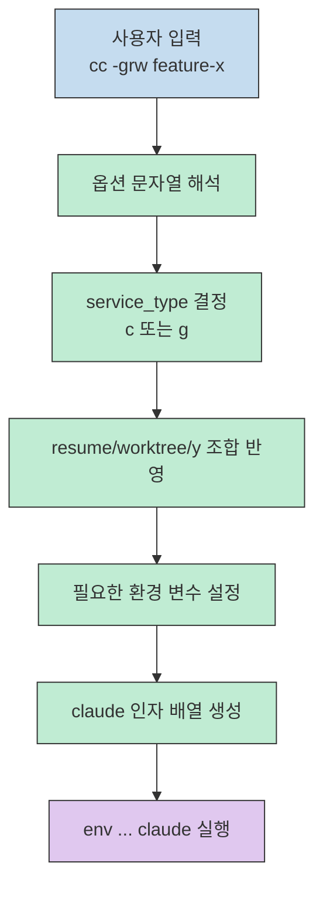
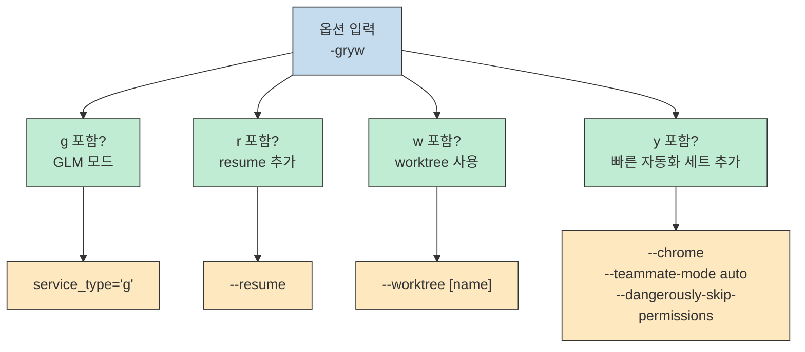
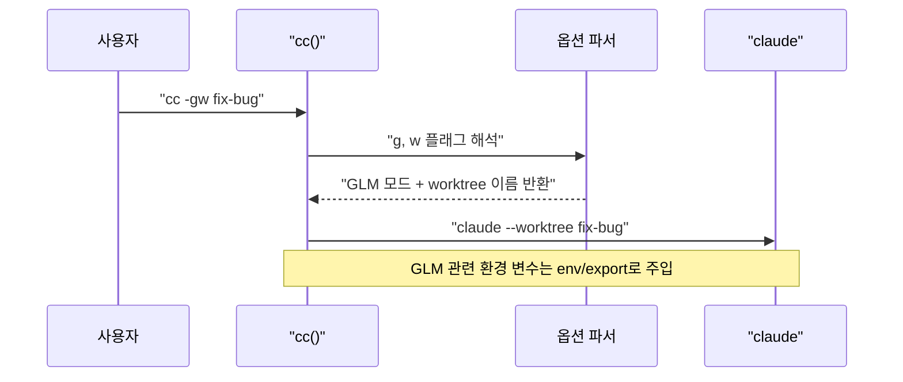
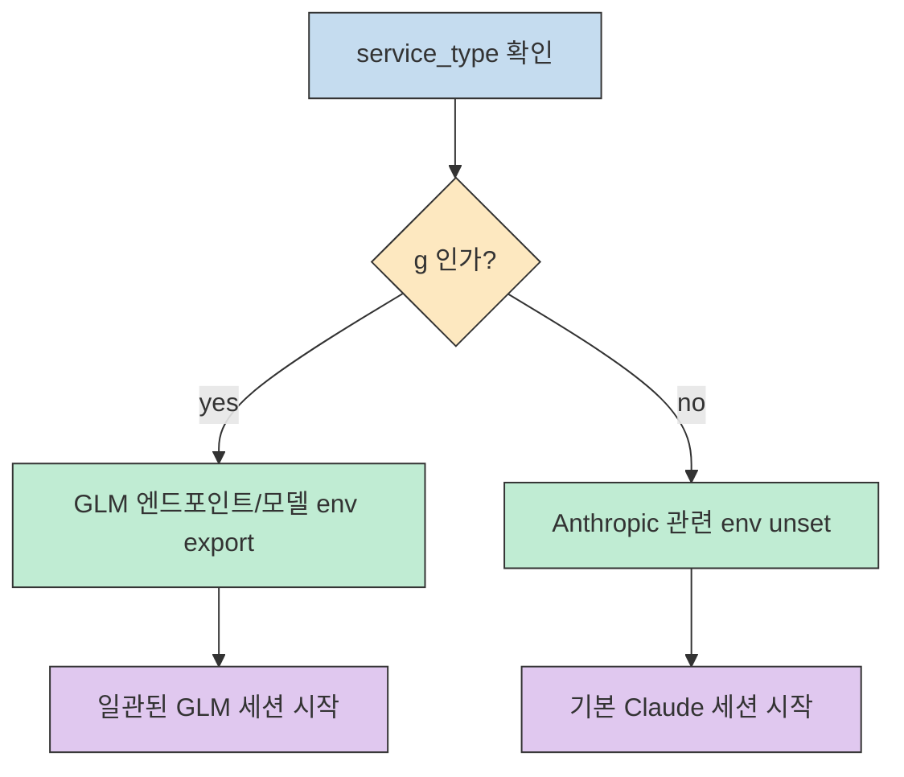

Claude Code를 오래 쓰다 보면 실행 명령이 점점 길어집니다. 기본 실행만 해도 괜찮지만, 여기에 `--resume`, `--worktree`, `--chrome`, `--teammate-mode auto`, `--dangerously-skip-permissions` 같은 옵션이 붙기 시작하면 "이번에는 어떤 조합으로 띄워야 하지?"를 계속 다시 생각하게 됩니다.

이럴 때 가장 단순하면서 효과가 큰 방법이 **실행 래퍼 함수** 하나를 두는 것입니다. 이번 글에서는 실제 `cc()` bash 함수를 기준으로, Claude 모드와 GLM 모드를 전환하고, resume/worktree/skip-permissions 조합을 짧게 호출하는 패턴을 정리합니다.

<!--more-->

## Sources

- 사용자 제공 `cc()` bash 함수
- https://github.com/NEWBIE0413/ccv/blob/main/ccv.bash
- https://code.claude.com/docs/en/cli-reference
- https://code.claude.com/docs/en/common-workflows
- https://code.claude.com/docs/en/chrome
- https://code.claude.com/docs/en/best-practices

## 왜 이런 래퍼가 필요한가

문제는 기능이 부족해서가 아니라, 기능이 많아질수록 **실행 진입 비용**이 커진다는 데 있습니다.

- 기본 세션을 띄울 때와 이어서 작업할 때의 옵션이 다릅니다.
- Claude 기본 모드와 GLM 프록시 모드는 필요한 환경 변수가 다릅니다.
- worktree를 같이 쓰는 날도 있고, 그냥 현재 디렉터리에서 들어가는 날도 있습니다.
- 빠른 실험용 세션과 안전한 기본 세션을 머릿속으로 계속 구분해야 합니다.

즉, 문제는 "명령어를 기억하기 어렵다"보다 "상황별 실행 규칙이 분산된다"에 가깝습니다. `cc()` 함수는 그 규칙을 쉘 레벨에서 묶어둔 작은 런처라고 보면 됩니다.



## `cc()` 함수 전체 코드

먼저 원본 함수는 아래와 같습니다.

```bash
function cc() {
  local env_vars=(
    "ENABLE_BACKGROUND_TASKS=true"
    "FORCE_AUTO_BACKGROUND_TASKS=true"
    "CLAUDE_CODE_DISABLE_NONESSENTIAL_TRAFFIC=true"
    "CLAUDE_CODE_ENABLE_UNIFIED_READ_TOOL=true"
  )

  local claude_args=()
  local opt="${1:-}"
  local service_type="c"
  local worktree_name=""
  local use_worktree=false

  if [[ "$opt" == -* ]]; then
    [[ "$opt" == *g* ]] && service_type="g"
    [[ "$opt" == *r* ]] && claude_args+=("--resume")
    [[ "$opt" == *w* ]] && use_worktree=true
    [[ "$opt" == *y* ]] && claude_args+=("--chrome" "--teammate-mode" "auto" "--dangerously-skip-permissions")

    if [[ "$use_worktree" == true ]]; then
      worktree_name="${2:-}"
    fi
  fi

  if [[ -n "$worktree_name" ]]; then
    claude_args+=("--worktree" "$worktree_name")
  elif [[ "$use_worktree" == true ]]; then
    claude_args+=("--worktree")
  fi

  case "$service_type" in
    "g")
      export ANTHROPIC_AUTH_TOKEN="$GLM_API_KEY"
      export ANTHROPIC_BASE_URL="https://api.z.ai/api/anthropic"
      export API_TIMEOUT_MS="3000000"
      export ANTHROPIC_DEFAULT_HAIKU_MODEL="glm-4.5-air"
      export ANTHROPIC_DEFAULT_SONNET_MODEL="glm-4.7"
      export ANTHROPIC_DEFAULT_OPUS_MODEL="glm-5"
      ;;
    "c")
      unset ANTHROPIC_AUTH_TOKEN
      unset ANTHROPIC_BASE_URL
      unset API_TIMEOUT_MS
      unset ANTHROPIC_DEFAULT_HAIKU_MODEL
      unset ANTHROPIC_DEFAULT_SONNET_MODEL
      unset ANTHROPIC_DEFAULT_OPUS_MODEL
      ;;
  esac

  env "${env_vars[@]}" claude "${claude_args[@]}"
}
```

겉으로 보면 짧은 함수지만, 실제로는 세 가지 책임을 동시에 처리합니다.

1. 짧은 옵션 문자열을 해석한다.
2. 실행 모드에 따라 환경 변수를 바꾼다.
3. 마지막에 `claude` 실행 인자를 일관된 방식으로 조립한다.

대신 범위는 명확합니다. 이 함수는 어디까지나 **세션 시작용 런처**에 가깝고, 임의의 추가 `claude` 인자나 프롬프트를 일반적으로 뒤에 계속 전달하는 형태는 아닙니다. 실제로는 `$1`을 옵션 문자열로 보고, 필요할 때만 `$2`를 worktree 이름으로 사용합니다.

## 1) 옵션 문자열 하나로 여러 실행 패턴을 압축한다

이 함수의 첫 번째 장점은 `-grw`, `-gryw` 같은 문자열을 **조합형 모드 스위치**처럼 쓴다는 점입니다.

공식 CLI 기준으로 보면 `--resume`은 특정 세션을 이어 붙이거나 선택기로 재개하는 옵션이고, `--worktree`는 Git 저장소 아래 격리된 worktree 세션을 시작하는 옵션입니다. 이 함수는 그 공식 플래그를 더 짧은 묶음으로 재배치한 셈입니다.

예를 들어 `cc -grw my-task`는 대략 이렇게 읽으면 됩니다.

- `g`: GLM 모드
- `r`: 이전 세션 이어서 시작
- `w`: worktree 사용

즉, 긴 명령어를 외우는 대신 "오늘 필요한 성격"만 짧게 적는 방식입니다.



이 패턴의 핵심은 **플래그를 나열하는 CLI**를 **의도 중심 단축어**로 다시 감싼다는 데 있습니다. CLI는 원래 세밀할수록 좋지만, 사용자는 매번 세밀하게 입력하기보다 자주 쓰는 조합을 빠르게 부르는 편이 생산성에 더 유리합니다.

## 2) `-w`는 "지금 이 세션을 격리할지"를 즉시 결정하게 해 준다

개인적으로 이 함수에서 가장 실용적인 부분은 worktree 처리입니다.

```bash
cc -w my-feature
cc -gw fix-bug
cc -grw continue-work
```

여기서 좋은 점은 두 가지입니다. 그리고 공식 문서 기준으로도 `--worktree`는 이름을 생략하면 자동 이름을 만들 수 있기 때문에, 이 함수의 분기 구조는 실제 CLI 동작과 잘 맞습니다.

첫째, worktree 이름이 있으면 `--worktree <name>`으로 넘기고, 이름이 없으면 `--worktree`만 넘깁니다. 즉, "명시적 이름이 있는 격리 세션"과 "자동 이름 기반 격리 세션"을 둘 다 수용합니다.

둘째, 사용자가 직접 긴 `claude --worktree ...` 명령을 치는 대신, 처음부터 `cc -w ...`라는 더 짧은 습관으로 worktree 사용을 기본 선택지에 올려둡니다. 이런 래퍼의 진짜 가치는 기능 추가보다 **좋은 기본 행동을 더 싸게 만드는 것**에 있습니다.



## 3) `-g`는 단순 별칭이 아니라 실행 환경 전환이다

이 함수에서 `g`는 단순히 다른 모델 이름을 넘기는 정도가 아닙니다. 실제로는 Claude 기본 연결 대신, GLM 호환 엔드포인트로 향하도록 관련 환경 변수를 한 번에 바꿉니다.

```bash
export ANTHROPIC_AUTH_TOKEN="$GLM_API_KEY"
export ANTHROPIC_BASE_URL="https://api.z.ai/api/anthropic"
export API_TIMEOUT_MS="3000000"
export ANTHROPIC_DEFAULT_HAIKU_MODEL="glm-4.5-air"
export ANTHROPIC_DEFAULT_SONNET_MODEL="glm-4.7"
export ANTHROPIC_DEFAULT_OPUS_MODEL="glm-5"
```

여기서 하나 짚고 가야 할 점이 있습니다. 위 코드는 GLM 값을 `env ... claude`에 인라인으로만 넣는 것이 아니라, 현재 셸에 `export`합니다. 즉, `cc -g`를 한 번 실행하면 그 환경 변수는 해당 `claude` 프로세스에서만 쓰이고 끝나는 것이 아니라, 같은 셸 세션에 그대로 남습니다. 이후 `cc`를 다시 Claude 기본 모드로 실행할 때 `unset`이 호출되기 전까지는 셸 상태가 GLM 쪽으로 기울어져 있는 셈입니다.

반대로 Claude 기본 모드에서는 이 값들을 `unset`해서 이전 세션의 환경이 남지 않게 처리합니다. 이 부분이 중요합니다. 래퍼를 쓰지 않고 셸에서 환경 변수를 수동으로 바꿔가며 실행하면, "어제 켜둔 값"이 오늘 세션에 섞이는 문제가 자주 생깁니다.

즉, `cc()`는 단순 런처가 아니라 **실행 전 상태 정리기** 역할도 합니다.



## 4) `-y`는 "빠른 실험 모드"를 한 번에 묶는다

`y` 플래그는 다음 세 가지를 한 번에 추가합니다.

```bash
--chrome
--teammate-mode auto
--dangerously-skip-permissions
```

공식 문서 관점에서 보면 이 세 개는 성격이 조금 다릅니다.

- `--chrome`: 브라우저 자동화/테스트를 켜는 옵션입니다. 현재 문서상 beta 기능입니다.
- `--teammate-mode auto`: teammate 표시 방식을 정하는 옵션입니다. `auto`는 기본값이라서, 이 조합에서 실질적인 행동 변화라기보다 "이 세션은 자동 teammate 표시 흐름을 전제로 한다"는 의도 표시에 가깝습니다.
- `--dangerously-skip-permissions`: 권한 확인 프롬프트를 건너뛰는 옵션입니다. 이름 그대로 신중하게 써야 합니다.

즉, 이 조합은 이름 그대로 조심해서 써야 하지만, 반복 실험이나 개인 로컬 자동화에서는 매우 강력합니다. 포인트는 위험한 플래그를 숨기는 것이 아니라, **의도를 명확한 별칭으로 분리하는 것**입니다.

예를 들어 평소에는 `cc` 또는 `cc -r`로 안전한 기본 흐름을 타고, 정말 빠른 실험이 필요할 때만 `cc -y`나 `cc -gryw`처럼 "나는 지금 빠른 자동화 모드로 들어간다"를 의식적으로 선택하게 됩니다.

이 구조는 실수 방지에도 도움이 됩니다. 긴 명령에서 위험한 플래그 하나를 빼먹거나 반대로 무심코 복붙하는 것보다, `-y`를 쓸지 말지를 먼저 결정하는 편이 인지적으로 더 안전합니다.

## 5) 실행 시 항상 붙는 공통 환경 변수도 눈여겨볼 만하다

함수 상단의 `env_vars` 배열은 실행할 때마다 공통으로 주입됩니다.

```bash
"ENABLE_BACKGROUND_TASKS=true"
"FORCE_AUTO_BACKGROUND_TASKS=true"
"CLAUDE_CODE_DISABLE_NONESSENTIAL_TRAFFIC=true"
"CLAUDE_CODE_ENABLE_UNIFIED_READ_TOOL=true"
```

이 값들은 사용자의 로컬 운영 철학을 반영한 기본 프로필이라고 볼 수 있습니다. 즉, 이 함수는 단순한 alias보다 더 강합니다. alias는 짧은 이름만 주지만, 이 패턴은 **기본 동작 정책까지 함께 캡슐화**합니다.

특히 팀이나 개인이 Claude Code를 반복적으로 같은 방식으로 운영한다면, 이런 공통 환경 변수를 런처에 고정해 두는 편이 세션별 편차를 줄이는 데 좋습니다.

## 실전에서 어떻게 쓰면 좋은가

아래 정도만 외워도 대부분 커버됩니다.

```bash
cc
```

- 기본 Claude 세션 시작

```bash
cc -r
```

- 직전 흐름을 이어서 시작

```bash
cc -w feature-auth
```

- worktree를 분리해서 새 작업 시작

```bash
cc -gw experiment-ui
```

- GLM 모드로 worktree 세션 시작

```bash
cc -gryw fast-prototype
```

- GLM + resume + 빠른 자동화 + worktree까지 한 번에 시작

여기서 중요한 건 모든 옵션을 다 쓰는 것이 아니라, **내가 자주 반복하는 조합을 몇 개의 습관으로 고정하는 것**입니다.

## 이 패턴에서 배울 수 있는 설계 포인트

이 함수는 길지 않지만, CLI 래퍼를 설계할 때 참고할 포인트가 꽤 많습니다.

1. **옵션을 기능 단위가 아니라 사용 시나리오 단위로 묶는다.** `-g`, `-r`, `-w`, `-y`는 각각 "기술적 세부 옵션"보다 "작업 성격"에 가깝습니다.
2. **상태 전환은 반드시 되돌리는 코드까지 같이 둔다.** GLM 모드에서 `export`만 하고 끝내지 않고, Claude 모드에서 `unset`하는 부분이 그래서 중요합니다.
3. **반복되는 공통 정책은 실행 지점에서 강제한다.** 배경 작업, unified read tool 같은 설정을 실행 함수에 넣으면 세션 편차가 줄어듭니다.
4. **위험한 모드는 숨기지 말고 분리한다.** `-y`처럼 이름 있는 실험 모드가 오히려 안전합니다.

## Practical Takeaways

- `cc()` 같은 래퍼는 긴 CLI 옵션을 줄이는 도구이기도 하지만, 더 본질적으로는 실행 정책을 고정하는 도구입니다.
- `-w`를 짧게 만들면 worktree를 더 자주 쓰게 되고, 결국 작업 격리가 습관이 됩니다.
- `-g`는 모델 이름 변경이 아니라 환경 전환이므로 `unset`까지 함께 설계해야 안전합니다.
- `-y`처럼 빠른 자동화 세트는 생산성을 높이지만, 별도의 의식적인 모드로 분리할 때 더 안전합니다.
- 좋은 런처는 명령을 줄이는 것보다, 매번 같은 품질의 세션을 열게 만드는 데 가치가 있습니다.

## Conclusion

Claude Code를 깊게 쓰는 사람일수록 "프롬프트"보다 먼저 "어떤 세션으로 들어가느냐"가 중요해집니다. `cc()` 같은 작은 함수는 거창한 프레임워크가 아니어도, 매일 반복되는 실행 결정을 정리하고, GLM/Claude 전환과 worktree 습관, 빠른 실험 모드를 한 줄로 묶어주는 꽤 강력한 DX 레이어가 됩니다.

결국 좋은 래퍼의 기준은 복잡한 기능이 아니라, 자주 하는 선택을 더 짧고 더 일관되게 만드는가입니다. 그런 의미에서 이 `cc()` 함수는 Claude Code를 "실행하는 명령어"가 아니라, **내 작업 방식을 호출하는 진입점**에 가깝습니다.
