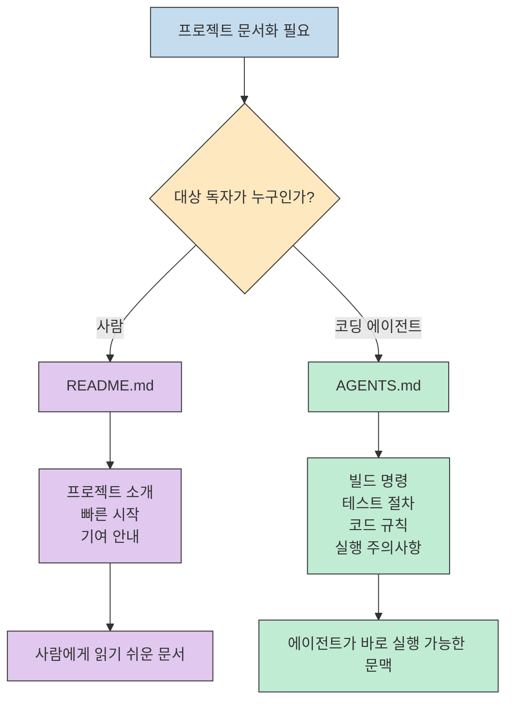
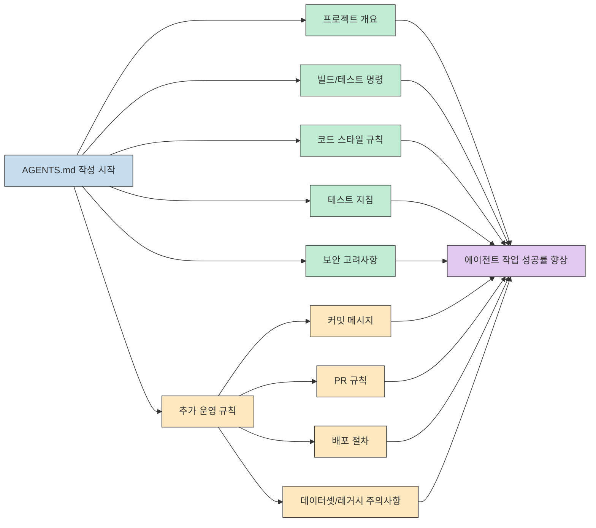
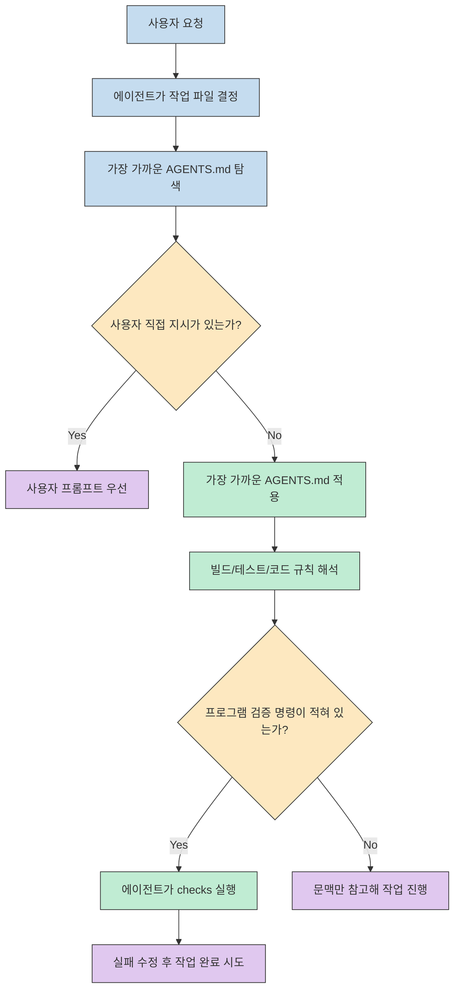
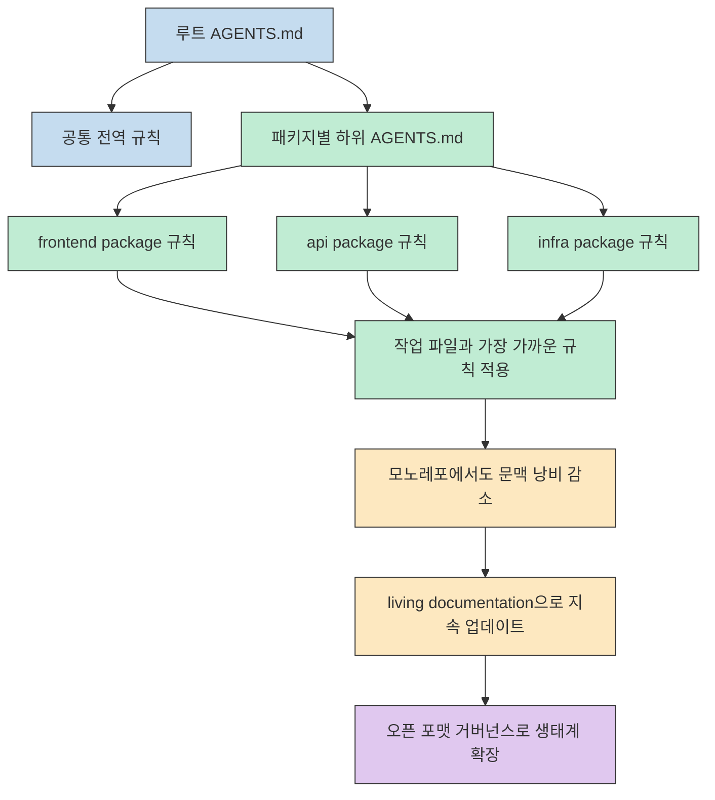

`AGENTS.md` 이야기가 흥미로운 이유는 이 파일이 단순히 새 문서 이름을 제안하는 것이 아니라, **에이전트가 프로젝트를 읽는 방식 자체를 표준화하려는 시도** 이기 때문입니다. [agents.md](https://agents.md/)는 이 포맷을 "README for agents" 라고 설명하는데, 이 표현 하나에 거의 모든 핵심이 들어 있습니다. 사람용 README와 에이전트용 실행 문맥을 분리해 두면, 프로젝트 설명은 깔끔하게 유지하면서도 코딩 에이전트에는 더 구체적인 실행 지침을 안정적으로 줄 수 있습니다.

이 사이트가 설득력 있는 이유는 기능을 과장하기보다, 실제로 어떤 정보가 에이전트에게 필요한지 아주 실무적으로 설명한다는 점입니다. 예를 들어 설정 명령, 테스트 명령, 코드 스타일, PR 규칙, 모노레포 하위 지침, 충돌 우선순위 같은 항목은 사람이 프로젝트 소개 문서에서 늘 보고 싶어 하는 내용은 아니지만, 에이전트가 작업을 끝까지 수행하는 데는 매우 중요합니다. 결국 AGENTS.md는 "문서를 더 하나 만든다" 가 아니라, **사람과 에이전트의 독자층을 분리해 문맥 비용을 줄이는 운영 패턴** 에 가깝습니다. [agents.md](https://agents.md/)

<!--more-->

## Sources

- https://agents.md/

## 1) AGENTS.md는 README를 대체하는 파일이 아니라, 에이전트 전용 실행 문맥을 위한 별도 레이어다

사이트의 가장 강한 메시지는 AGENTS.md가 README의 경쟁자가 아니라는 점입니다. 본문은 README를 "quick starts, project descriptions, and contribution guidelines" 를 담는 인간 중심 문서로 두고, AGENTS.md는 여기에 담기 애매한 추가 실행 문맥을 맡긴다고 설명합니다. 즉 README는 프로젝트를 이해시키는 문서이고, AGENTS.md는 프로젝트 안에서 **어떻게 행동해야 하는지** 를 알려 주는 문서라는 구분입니다. [agents.md](https://agents.md/)

이 분리가 중요한 이유는 정보의 종류가 다르기 때문입니다. 예를 들어 "프로젝트가 무엇인가" 와 "이 레포에서 테스트는 어떻게 돌리는가" 는 같은 문서에 들어갈 수는 있어도, 같은 독자를 위한 정보는 아닙니다. 사람 입장에서는 테스트 명령과 보안 gotcha가 README를 장황하게 만들 수 있지만, 에이전트 입장에서는 오히려 그런 정보가 없으면 안전하게 작업을 끝낼 수 없습니다. 사이트가 AGENTS.md를 "a dedicated, predictable place" 라고 표현하는 이유도 여기에 있습니다. 문서 내용보다도 **문서 위치의 예측 가능성** 이 중요하다는 뜻입니다. [agents.md](https://agents.md/)

사이트가 강조하는 또 하나의 포인트는 이 파일이 어떤 복잡한 스키마를 강요하지 않는다는 점입니다. FAQ는 "AGENTS.md is just standard Markdown" 이라고 못 박고, 필수 필드도 없다고 설명합니다. 이는 표준화를 파일 이름과 위치 중심으로 가져가고, 본문 형식은 Markdown 생태계에 맡기는 접근입니다. 결과적으로 진입 장벽이 낮고, 기존 문서를 AGENTS.md로 옮기거나 링크하는 방식으로도 쉽게 시작할 수 있습니다. [agents.md](https://agents.md/)

## 2) agents.md가 제안하는 핵심은 '파일 형식'보다 '무엇을 넣어야 하는가' 에 대한 운영 기준이다

사이트의 예시를 보면 AGENTS.md는 추상적인 선언문보다 **실행 가능한 정보** 를 담는 데 초점이 맞춰져 있습니다. 앞부분 샘플에는 `pnpm install`, `pnpm dev`, `pnpm test` 같은 setup/test 명령과 함께 TypeScript strict mode, 따옴표 규칙, 함수형 스타일 선호 같은 코드 스타일 지침이 들어갑니다. 뒤쪽 샘플에는 모노레포 탐색 팁, CI 워크플로 확인 위치, 테스트를 녹색으로 만들기 전까지 수정하라는 지시, PR 제목 규칙까지 포함됩니다. [agents.md](https://agents.md/)

이 구성이 시사하는 바는 분명합니다. 좋은 AGENTS.md는 "우리 팀은 품질을 중요하게 생각합니다" 같은 선언보다, **에이전트가 지금 바로 실행할 수 있는 문장** 으로 써야 합니다. 어디서 명령을 실행하는지, 어떤 테스트를 먼저 봐야 하는지, 실패하면 무엇을 고쳐야 하는지, 커밋 전 어떤 검증을 반드시 통과해야 하는지가 적혀 있어야 실제 생산성이 생깁니다. 사람에게는 너무 운영적인 정보가, 에이전트에게는 바로 행동으로 이어지는 명령 셋이 되는 것입니다. [agents.md](https://agents.md/)

사이트가 "Cover what matters" 단계에서 제시하는 항목도 이 철학을 뒷받침합니다. 프로젝트 개요, 빌드/테스트 명령, 코드 스타일, 테스트 지침, 보안 고려사항은 전부 에이전트가 작업 품질을 좌우하는 핵심 입력입니다. 이어서 커밋 메시지 규칙, PR 가이드, 배포 절차, 큰 데이터셋 주의사항까지 "새 팀원에게 말해 줄 것이라면 여기에 넣어라" 라고 정리하는데, 이는 AGENTS.md를 단순한 config 파일이 아니라 **실행형 온보딩 문서** 로 본다는 뜻입니다. [agents.md](https://agents.md/)

실무적으로 보면 이 접근은 프롬프트 의존도를 낮추는 효과도 있습니다. 매번 채팅창에서 "이 레포는 pnpm 쓰고 strict mode고 PR 제목은 이렇게 써" 라고 반복할 필요 없이, 프로젝트에 상주하는 문서가 에이전트의 기본 행동 규칙을 맡게 됩니다. 그래서 AGENTS.md는 프롬프트 엔지니어링의 대체재라기보다, **프롬프트에서 반복되던 팀 지식을 저장소 내부로 끌어오는 장치** 로 이해하는 편이 더 정확합니다. [agents.md](https://agents.md/)

## 3) 이 포맷이 실제로 강한 이유는 여러 에이전트 사이에서 같은 규칙 파일을 공유하게 만든다는 점이다

`agents.md` 사이트는 "One AGENTS.md works across many agents" 라는 문구로 다양한 도구 호환성을 전면에 배치합니다. OpenAI Codex, Google Jules, Aider, Zed, Warp, VS Code, Devin, Cursor, Gemini CLI, GitHub Copilot coding agent 등 여러 제품 이름이 나열되는 방식은, 이 포맷이 특정 벤더의 폐쇄적인 규칙 파일이 아니라 **공통 문맥 인터페이스** 로 자리 잡으려 한다는 신호입니다. [agents.md](https://agents.md/)

이 메시지가 중요한 이유는 팀이 여러 에이전트를 병행할수록 규칙이 도구별로 분산되기 쉽기 때문입니다. 규칙 파일이 도구마다 다르면 결국 같은 팀 지침을 중복 복사해야 하고, 어느 한쪽만 갱신되면서 드리프트가 생깁니다. 반대로 하나의 AGENTS.md를 기준 파일로 두면, 도구를 바꿔도 프로젝트 규칙의 기준면은 유지됩니다. 즉 agents.md가 제안하는 가치는 새로운 기능보다 **운영 비용 절감** 에 더 가깝습니다. [agents.md](https://agents.md/)

또 사이트 FAQ는 충돌 해결 방식도 아주 명확하게 정의합니다. edited file에 가장 가까운 AGENTS.md가 우선하며, 사용자 채팅 프롬프트가 그보다 위에 옵니다. 이 규칙은 단순하지만 중요합니다. 전역 규칙과 하위 프로젝트 규칙이 공존할 수 있고, 여전히 사용자의 직접 지시가 최상위라는 의미이기 때문입니다. 여기에 테스트 명령을 적어 두면 에이전트가 관련 programmatic checks를 실행하고 실패를 고치려 시도한다는 설명까지 더해지면, AGENTS.md는 문서이면서 동시에 **에이전트 실행 정책을 유도하는 인터페이스** 로 보이게 됩니다. [agents.md](https://agents.md/)

이 구조는 특히 에이전트 품질을 "모델이 얼마나 똑똑한가" 만으로 설명하지 않게 만들어 줍니다. 실제 성능은 모델 능력뿐 아니라, 프로젝트가 에이전트에게 어떤 규칙과 검증 경로를 노출하느냐에 크게 좌우됩니다. agents.md가 강조하는 표준 포인트는 바로 이 지점입니다. 규칙을 도구 밖의 대화 맥락에만 두지 않고, 프로젝트 내부의 재사용 가능한 파일로 올려 두자는 것입니다. [agents.md](https://agents.md/)

## 4) 모노레포와 거버넌스 설명을 보면, AGENTS.md는 작은 팁이 아니라 장기 운영을 염두에 둔 포맷이다

사이트의 사용법 섹션에서 가장 실전적인 부분은 large monorepo를 위한 nested AGENTS.md 설명입니다. 각 패키지 안에 AGENTS.md를 두면 에이전트가 디렉터리 트리에서 가장 가까운 파일을 자동으로 읽고, 그 파일이 우선한다고 안내합니다. 이것은 단순한 편의 기능이 아니라, 하나의 거대한 규칙 파일 대신 **프로젝트 구조에 맞춰 문맥을 계층화** 할 수 있다는 의미입니다. 실제로 사이트는 "at time of writing the main OpenAI repo has 88 AGENTS.md files" 라는 예시까지 들어, 대규모 코드베이스에서 이 방식이 자연스럽게 확장된다고 설명합니다. [agents.md](https://agents.md/)

About 섹션 역시 흥미롭습니다. 이 포맷이 OpenAI Codex, Amp, Jules from Google, Cursor, Factory 등 여러 플레이어의 협업적 노력에서 나왔다고 설명하고, 지금은 Linux Foundation 산하 Agentic AI Foundation이 steward 한다고 밝힙니다. 이 문장은 AGENTS.md를 특정 제품의 부속 규칙이 아니라, 생태계 차원의 오픈 포맷으로 자리 잡게 하려는 의도를 보여 줍니다. [agents.md](https://agents.md/)

여기서 핵심은 "누가 만들었는가" 보다 "어떻게 유지하려 하는가" 입니다. 사이트는 이 포맷을 living documentation으로 다루라고 권하고, 나중에 얼마든지 업데이트할 수 있다고 말합니다. 즉 AGENTS.md는 한 번 써 두고 끝나는 정적 설정 파일이 아니라, 코드베이스와 함께 변해야 하는 운영 문서입니다. 이런 관점까지 포함하면 AGENTS.md는 단순한 문서명 제안이 아니라, **에이전트 시대의 저장소 운영 규범** 을 만들려는 시도로 읽힙니다. [agents.md](https://agents.md/)

## 핵심 요약

- `agents.md`는 AGENTS.md를 README 대체재가 아니라 **에이전트 전용 실행 문맥 레이어** 로 정의합니다. [agents.md](https://agents.md/)
- 이 포맷은 필수 스키마가 없는 Markdown 기반 오픈 포맷이라 도입 장벽이 낮고, 기존 문서를 쉽게 이전할 수 있습니다. [agents.md](https://agents.md/)
- 좋은 AGENTS.md에는 프로젝트 개요보다도 빌드, 테스트, 코드 스타일, 보안, PR 규칙처럼 에이전트가 바로 행동할 수 있는 정보가 들어갑니다. [agents.md](https://agents.md/)
- 가장 가까운 AGENTS.md 우선, 사용자 프롬프트 최우선이라는 충돌 규칙 덕분에 모노레포와 하위 프로젝트 운영에 적합합니다. [agents.md](https://agents.md/)
- Linux Foundation 산하 Agentic AI Foundation 거버넌스 설명은 이 포맷이 특정 도구의 부속물이 아니라 생태계 공용 규칙 파일을 지향한다는 신호입니다. [agents.md](https://agents.md/)

## 결론

`agents.md` 사이트를 읽고 나면 AGENTS.md의 본질은 꽤 분명해집니다. 이 파일의 핵심 가치는 새로운 문서 확장이 아니라, **프로젝트가 에이전트에게 안정적으로 문맥을 전달하는 공통 진입점** 을 만든다는 데 있습니다. [agents.md](https://agents.md/)

그래서 앞으로 AGENTS.md를 잘 운영한다는 말은 문서를 길게 쓰는 능력보다, 어떤 규칙을 사람용 README에 남기고 어떤 규칙을 에이전트용 문서로 분리할지, 그리고 그 문서를 얼마나 살아 있는 운영 문서로 유지할지를 결정하는 능력에 더 가까워 보입니다. 결국 이 포맷이 표준이 되느냐의 문제는 파일 이름보다, **팀이 반복 지식을 저장소 안에 얼마나 잘 구조화하느냐** 에 달려 있습니다. [agents.md](https://agents.md/)
