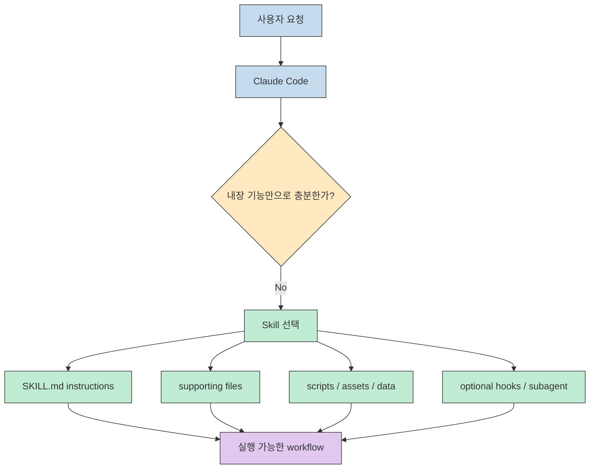
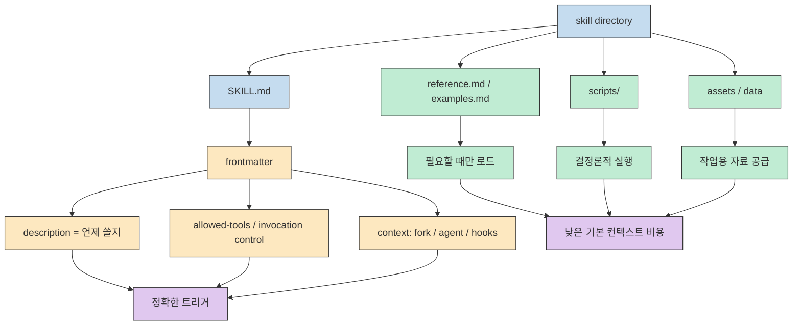
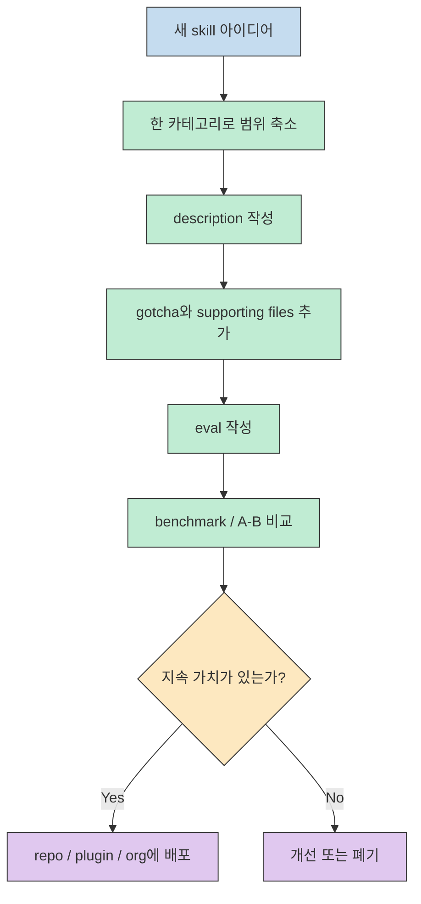

Anthropic이 사내에서 Claude Code 스킬을 어떻게 쓰는지 공개했다는 점이 흥미로운 이유는, 이 이야기가 단순한 기능 소개가 아니라 **실제로 어느 확장 포인트가 내부에서 중요하게 다뤄지는지** 를 보여 주기 때문입니다. 공개된 Threads 포스트 본문은 페이지 자체에서 온전히 노출되지 않았지만, 검색 인덱스에 남은 요약과 그 포스트가 가리키는 Thariq의 글, 그리고 Anthropic 공식 Skills 문서를 함께 보면 핵심 메시지는 비교적 선명합니다. 스킬은 더 이상 부가 기능이 아니라 Claude Code 운영 방식에서 매우 중요한 레이어로 보입니다. [Threads](https://www.threads.com/@unclejobs.ai/post/DWASysgE2MH?xmt=AQF0BFwuu8a_ZzBz9AY3Wc_qL0jAUVN9gWf6n-k6UCrvDL7kUif-anYtuJg9-VTBSl7FF1GG&slof=1) [X](https://x.com/trq212/status/2033949937936085378) [Anthropic Skills Docs](https://docs.anthropic.com/en/docs/claude-code/skills)

특히 공식 문서가 지금은 **"Custom commands have been merged into skills"** 라고 못 박고 있다는 점이 중요합니다. 예전에는 slash command, prompt file, 보조 문서가 따로 놀았다면, 지금은 스킬 디렉터리가 그 모든 것을 묶는 실행 단위가 되고 있습니다. 여기에 Thariq의 공개 설명에서 내부 스킬 활용 규모가 매우 크다고 언급된 맥락까지 더하면, 스킬은 "있으면 좋은 옵션"이라기보다 대규모 AI 작업 흐름을 표준화하는 기본 도구에 가까워 보입니다. [Anthropic Skills Docs](https://docs.anthropic.com/en/docs/claude-code/skills) [X](https://x.com/trq212/status/2033949937936085378)

<!--more-->

## Sources

- https://www.threads.com/@unclejobs.ai/post/DWASysgE2MH?xmt=AQF0BFwuu8a_ZzBz9AY3Wc_qL0jAUVN9gWf6n-k6UCrvDL7kUif-anYtuJg9-VTBSl7FF1GG&slof=1
- https://x.com/trq212/status/2033949937936085378
- https://docs.anthropic.com/en/docs/claude-code/skills
- https://claude.com/blog/improving-skill-creator-test-measure-and-refine-agent-skills

## 1) Anthropic가 말하는 핵심은 "좋은 프롬프트"가 아니라 "좋은 확장 포인트" 다

Threads에서 회수 가능한 공개 스니펫은 이 글의 초점을 꽤 정확하게 보여 줍니다. 공개 스니펫이 가리키는 포인트는 "Claude Code를 만들면서 스킬을 어떻게 쓰고 있는지" 였고, 어떤 스킬이 효과적인지, 어떻게 만들고, 어떻게 팀에 퍼뜨리는지가 핵심 공개 항목이었습니다. 즉 초점은 모델 자체가 아니라 **운영 가능한 작업 단위로서의 스킬** 입니다. [Threads](https://www.threads.com/@unclejobs.ai/post/DWASysgE2MH?xmt=AQF0BFwuu8a_ZzBz9AY3Wc_qL0jAUVN9gWf6n-k6UCrvDL7kUif-anYtuJg9-VTBSl7FF1GG&slof=1)

이 메시지는 Anthropic 공식 문서와 정확히 맞물립니다. 공식 문서는 스킬을 "Create, manage, and share skills to extend Claude's capabilities in Claude Code" 라고 설명하고, `SKILL.md` 파일을 만들면 Claude가 toolkit에 추가하고 관련 상황에서 자동으로 쓰거나 `/skill-name` 으로 직접 호출할 수 있다고 말합니다. 더 중요한 것은 기존 custom commands가 skills로 합쳐졌다는 선언입니다. 이건 기능 추가가 아니라 **Claude Code의 사용자 확장 모델이 재정렬되었다** 는 뜻입니다. [Anthropic Skills Docs](https://docs.anthropic.com/en/docs/claude-code/skills)

Thariq가 공개적으로 전한 핵심 문장도 같은 방향입니다. 스킬은 Claude Code에서 가장 많이 쓰이는 확장 포인트 중 하나가 되었고, Anthropic 내부에서는 수백 개가 활발히 사용 중이라는 설명이 붙습니다. 공개 설명이 가리키는 바를 따르면, 내부 실전에서 살아남은 패턴은 "그때그때 잘 쓴 프롬프트" 가 아니라 **지식, 절차, 도구 접근, supporting file을 패키징한 재사용 가능한 skill 단위** 였다고 해석할 수 있습니다. [X](https://x.com/trq212/status/2033949937936085378)

## 2) Anthropic가 강조한 좋은 스킬의 본질은 "파일 한 장"이 아니라 "폴더 단위 패키지" 다

Thariq가 짚은 가장 중요한 오해는 스킬이 단순한 markdown 파일이라는 생각입니다. 그가 강조한 표현은 스킬이 **folders** 라는 점이었고, 그 안에는 scripts, assets, data 같은 것들을 함께 둘 수 있다는 것입니다. Anthropic 공식 문서도 같은 구조를 보여 줍니다. 하나의 스킬 디렉터리는 `SKILL.md` 를 entrypoint로 삼고, 템플릿, 예시, reference 문서, 실행 스크립트를 함께 묶을 수 있습니다. 이 구조가 중요한 이유는 프롬프트를 길게 쓰는 대신 **필요한 자료를 점진적으로 불러오는 progressive disclosure** 를 설계할 수 있기 때문입니다. [X](https://x.com/trq212/status/2033949937936085378) [Anthropic Skills Docs](https://docs.anthropic.com/en/docs/claude-code/skills)

이 지점에서 스킬의 진짜 가치가 드러납니다. 예전의 커스텀 프롬프트는 한 번 저장해 둔 지시문에 가까웠다면, 지금의 스킬은 실행 정책까지 가진 객체에 가깝습니다. 공식 문서는 `disable-model-invocation`, `user-invocable`, `allowed-tools`, `context: fork`, `agent`, `hooks` 같은 frontmatter를 지원한다고 설명합니다. 즉 스킬은 단순히 "무슨 말을 할지" 를 담는 것이 아니라 **누가 언제 어떤 도구로 어느 컨텍스트에서 실행할지** 까지 포함합니다. [Anthropic Skills Docs](https://docs.anthropic.com/en/docs/claude-code/skills)

Thariq가 말한 "description field is for the model" 이라는 조언도 이 맥락에서 이해해야 합니다. description은 사용자에게 기능을 설명하는 광고 문구가 아니라, 모델이 언제 이 스킬을 켜야 하는지 판단하는 트리거 조건에 가깝습니다. 그래서 좋은 description은 "무엇을 한다" 보다 "언제 써야 하는가" 를 잘 말해야 합니다. 이건 이미 Claude Code를 많이 쓰는 사람일수록 체감하는 문제입니다. 스킬 수가 늘수록 품질은 본문보다도 **trigger precision** 에서 갈립니다. [X](https://x.com/trq212/status/2033949937936085378) [Anthropic Skills Docs](https://docs.anthropic.com/en/docs/claude-code/skills)

## 3) 좋은 스킬은 범위를 좁히고, 실패 포인트를 축적하고, 팀에 배포 가능한 형태여야 한다

Thariq의 글에서 특히 실전적인 부분은 좋은 스킬의 기준이 꽤 보수적이라는 점입니다. 그는 가장 좋은 스킬은 하나의 카테고리에 분명히 속하고, 여러 목적을 동시에 섞은 스킬은 보통 혼란스럽다고 설명합니다. 또 "Don't state the obvious" 라는 조언처럼, 모델이 이미 아는 일반론을 길게 반복하기보다 **모델의 기본 가정을 깨는 정보** 와 **현장에서 반복적으로 틀리는 gotcha** 를 적는 편이 훨씬 가치가 높다고 말합니다. 결국 좋은 스킬은 풍성한 문서가 아니라, Claude가 자주 실패하는 지점을 줄여 주는 고신호 문서입니다. [X](https://x.com/trq212/status/2033949937936085378)

이 운영 감각은 Anthropic가 최근 발표한 `skill-creator` 개선과도 이어집니다. Anthropic는 skill-creator가 이제 eval, benchmark, comparator, multi-agent evaluation을 지원해서 스킬이 실제로 잘 작동하는지, 새 모델에서 퇴화하지 않았는지, 오히려 기본 모델이 이미 그 기능을 흡수했는지를 점검할 수 있다고 설명합니다. 즉 스킬은 한 번 써 두고 잊는 자산이 아니라 **계속 검증하고 폐기 여부까지 판단해야 하는 운영 대상** 입니다. [Improving skill-creator](https://claude.com/blog/improving-skill-creator-test-measure-and-refine-agent-skills)

배포 모델도 흥미롭습니다. 공식 문서는 스킬을 개인(`~/.claude/skills/`), 프로젝트(`.claude/skills/`), 플러그인, 엔터프라이즈 레벨에서 나눠 배치할 수 있다고 설명합니다. 공개 설명에서는 팀 차원의 공유와 확산이 중요한 주제로 다뤄졌고, 동시에 저품질 또는 중복 스킬이 쉽게 생긴다고 경고합니다. 이 조합이 시사하는 것은 분명합니다. 스킬이 많아질수록 중요한 것은 "얼마나 많이 만들었는가" 가 아니라 **리뷰, 중복 제어, description 품질, eval 체계** 입니다. [Anthropic Skills Docs](https://docs.anthropic.com/en/docs/claude-code/skills) [X](https://x.com/trq212/status/2033949937936085378) [Improving skill-creator](https://claude.com/blog/improving-skill-creator-test-measure-and-refine-agent-skills)

## 4) 이 공개가 주는 실전 교훈은 "스킬을 많이 만든다" 가 아니라 "스킬을 운영 가능한 단위로 설계한다" 는 데 있다

이 주제를 한국어 실무 감각으로 번역하면, 앞으로 Claude Code 활용의 경쟁력은 프롬프트 문장력보다 **조직이 어떤 지식을 skill package로 고정하느냐** 에 더 가까워질 가능성이 큽니다. 예를 들어 도메인 규칙, 배포 절차, 레거시 시스템 gotcha, 팀의 코드 리뷰 기준, 특정 사내 도구 사용법 같은 것들은 base model의 일반 지식이 아니라 조직 고유의 운영 지식입니다. 스킬은 바로 이 층을 Claude가 다룰 수 있는 형태로 압축합니다. [Anthropic Skills Docs](https://docs.anthropic.com/en/docs/claude-code/skills) [X](https://x.com/trq212/status/2033949937936085378)

또 하나 중요한 점은, Anthropic 자신도 스킬을 "자동 발동만 잘 되는 마법" 으로 다루지 않는다는 것입니다. description 품질, gotcha 축적, eval, benchmark, comparator 같은 운영 장치를 계속 붙이고 있습니다. 이는 스킬이 강력하다는 말과 동시에, **좋은 스킬은 설계보다도 유지보수와 검증이 더 어렵다** 는 고백이기도 합니다. 그래서 팀이 스킬을 본격적으로 쓰려면 "몇 개 만들까" 보다 "누가 리뷰하고, 언제 폐기하고, 어떤 eval로 검증할까" 를 먼저 정해야 합니다. [Improving skill-creator](https://claude.com/blog/improving-skill-creator-test-measure-and-refine-agent-skills)

## 실전 적용 포인트

- 스킬을 만들 때는 broad prompt를 저장한다는 생각보다, **반복 실패를 줄이는 운영 패키지** 를 만든다는 관점이 더 맞습니다.
- `description` 은 사용자 설명문이 아니라 **모델 트리거 조건** 이므로, "언제 써야 하는가" 중심으로 작성하는 편이 효과적입니다.
- supporting files와 scripts를 적극적으로 분리하면, 기본 컨텍스트를 가볍게 유지하면서도 필요 시 깊은 지식을 불러올 수 있습니다.
- 스킬이 늘어나면 품질 관리는 작성보다 검증이 더 중요해지므로, eval과 benchmark를 함께 설계해야 합니다.
- 프로젝트 단위 공유만으로 부족해지면 plugin이나 organization 배포 모델을 검토하되, 중복과 저품질 스킬을 걸러낼 리뷰 체계가 먼저 필요합니다.

## 핵심 요약

- 공개된 설명의 핵심은 Claude Code 스킬이 내부에서 이미 **주요 확장 포인트로 다뤄지고 있다** 는 점입니다. [X](https://x.com/trq212/status/2033949937936085378)
- 공식 문서는 이제 custom commands를 skills로 통합해 설명하며, 스킬을 Claude Code 확장의 중심 모델로 놓고 있습니다. [Anthropic Skills Docs](https://docs.anthropic.com/en/docs/claude-code/skills)
- 좋은 스킬은 markdown 한 장이 아니라 `SKILL.md` 와 supporting files, scripts, invocation policy를 포함한 **폴더 단위 패키지** 입니다. [Anthropic Skills Docs](https://docs.anthropic.com/en/docs/claude-code/skills)
- Thariq가 강조한 고신호 포인트는 category 명확성, gotcha 축적, 그리고 `description` 의 트리거 정밀도입니다. [X](https://x.com/trq212/status/2033949937936085378)
- Anthropic의 `skill-creator` 개선은 스킬이 이제 프롬프트 자산이 아니라 **평가와 운영 대상** 임을 보여 줍니다. [Improving skill-creator](https://claude.com/blog/improving-skill-creator-test-measure-and-refine-agent-skills)

## 결론

이번 공개를 한 문장으로 요약하면, Anthropic는 Claude Code 스킬을 "사용자 편의 기능" 이 아니라 **조직 지식을 실행 가능한 형태로 묶는 유력한 인터페이스** 로 다루는 듯하다는 뜻입니다. 그래서 앞으로 Claude Code를 잘 쓴다는 말은 프롬프트를 예쁘게 쓰는 능력보다, 팀의 반복 절차와 실패 패턴을 얼마나 잘 스킬로 구조화하느냐에 더 가까워질 가능성이 큽니다. [Anthropic Skills Docs](https://docs.anthropic.com/en/docs/claude-code/skills) [X](https://x.com/trq212/status/2033949937936085378)

다만 이 글에서 함께 확인된 것처럼, 스킬은 만들기보다 운영이 어렵습니다. 자동 발동은 description 품질에 달려 있고, 저품질 중복 스킬은 쉽게 늘어나며, 모델 변화에 따라 필요성이 사라질 수도 있습니다. 결국 Anthropic가 진짜로 공개한 비밀은 "스킬이 있다" 가 아니라, **스킬을 제품처럼 검증하고 배포하고 정리하는 운영법** 에 더 가깝습니다. [Improving skill-creator](https://claude.com/blog/improving-skill-creator-test-measure-and-refine-agent-skills)
