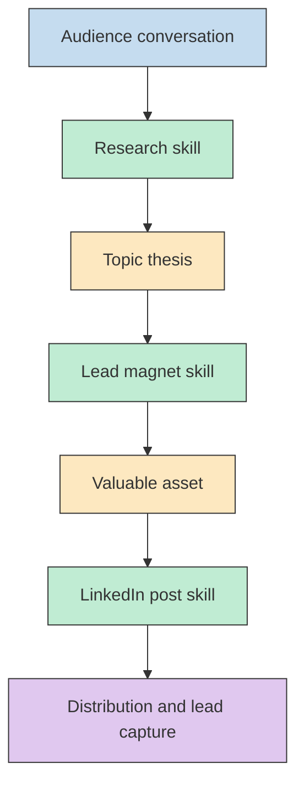
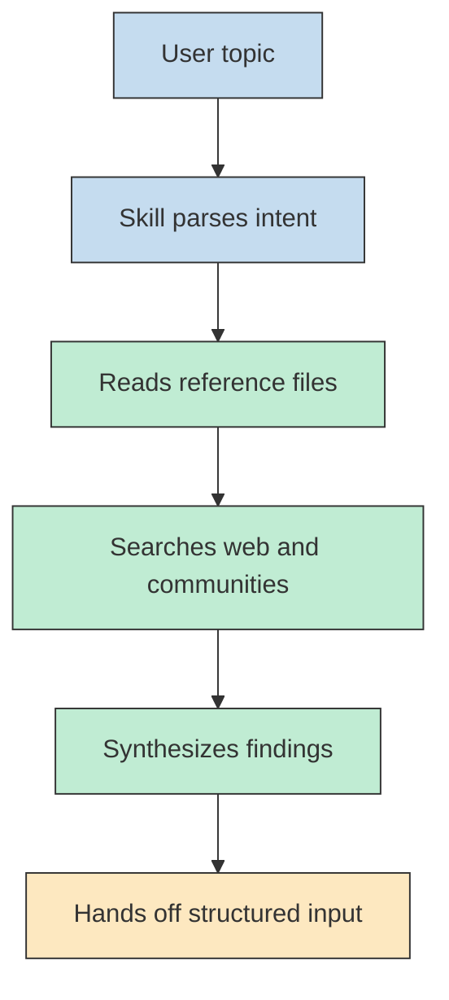
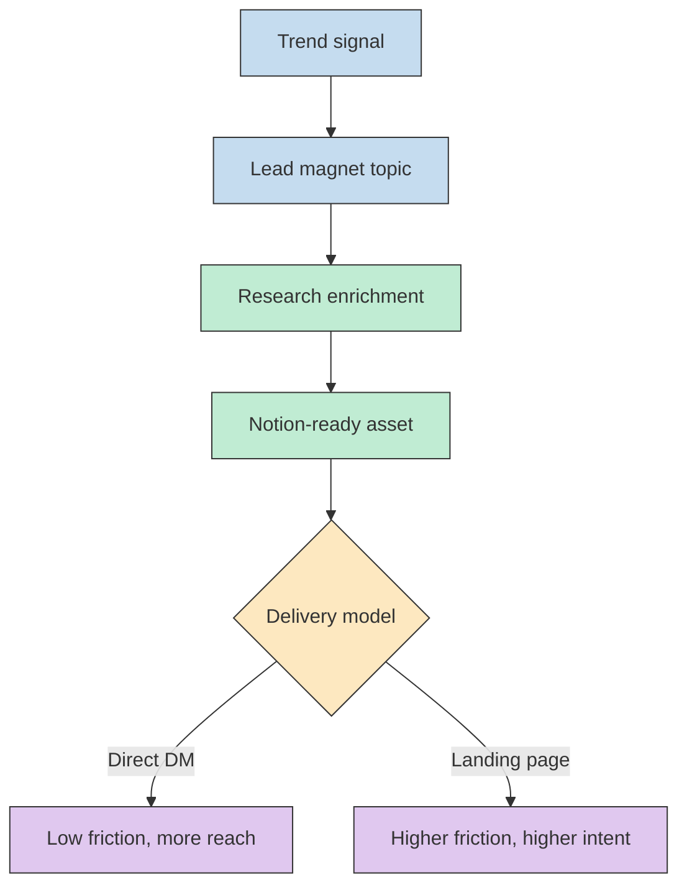
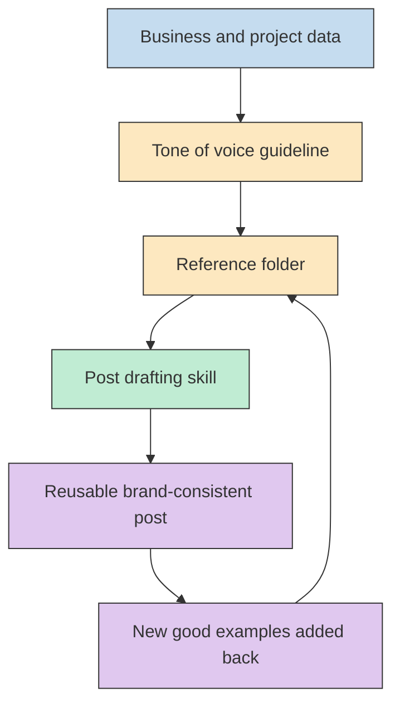

이 영상이 흥미로운 이유는 "Claude Code로 콘텐츠를 빨리 쓴다" 는 수준에서 멈추지 않고, **리서치 -> 리드 마그넷 -> 포스트 작성** 을 하나의 운영 파이프라인으로 묶어 설명하기 때문입니다. 발표자는 이 흐름으로 LinkedIn 팔로워가 1,500명에서 10,000명 이상으로 늘었고 비즈니스 리드도 크게 증가했다고 말하지만, 이런 성장 수치와 리드 수는 어디까지나 발표자 개인이 영상에서 제시한 사례이므로 일반화된 성과 공식으로 보기보다 **재현 가능한 작업 구조** 에 주목해 읽는 편이 안전합니다 (근거: [t=13](https://youtu.be/z_rXNjNnx7s?t=13), [t=19](https://youtu.be/z_rXNjNnx7s?t=19), [t=47](https://youtu.be/z_rXNjNnx7s?t=47), [t=53](https://youtu.be/z_rXNjNnx7s?t=53)).

<!--more-->

## Sources

- https://youtube.com/watch?v=z_rXNjNnx7s&si=3WDLRd4bJlcUMCtg

## 1) 핵심 구조는 "좋은 글쓰기" 가 아니라 "좋은 콘텐츠 운영 파이프라인" 이다

발표자가 처음부터 제시하는 구조는 꽤 명확합니다. 첫 번째 스킬은 내 분야의 트렌딩 토픽을 찾고, 두 번째 스킬은 타깃 오디언스용 리드 마그넷을 만들고, 세 번째 스킬은 자기 톤 오브 보이스에 맞춘 LinkedIn 포스트를 씁니다. 즉, 이 영상의 핵심은 단일 프롬프트로 한 편의 글을 뽑아내는 것이 아니라 **무엇을 말할지 찾는 단계와, 무엇을 줄지 설계하는 단계, 어떻게 말할지 정제하는 단계를 분리한다** 는 데 있습니다 (근거: [t=25](https://youtu.be/z_rXNjNnx7s?t=25), [t=31](https://youtu.be/z_rXNjNnx7s?t=31), [t=35](https://youtu.be/z_rXNjNnx7s?t=35), [t=108](https://youtu.be/z_rXNjNnx7s?t=108)).

이 접근이 설득력 있는 이유는 LinkedIn 성장의 병목을 꽤 현실적으로 짚기 때문입니다. 많은 사람은 "무슨 말을 해야 할지" 부터 막히는데, 발표자는 먼저 시장 대화를 수집해 주제를 정하고, 그다음 오디언스가 실제로 받고 싶어 하는 자료를 만들고, 마지막으로 플랫폼에 맞는 글 포맷으로 배포합니다. 다시 말해 글쓰기 자체만 자동화하려 하기보다 **주제 선택과 자료 설계 단계를 먼저 구조화하는 방식** 에 가깝습니다 (근거: [t=110](https://youtu.be/z_rXNjNnx7s?t=110), [t=117](https://youtu.be/z_rXNjNnx7s?t=117), [t=301](https://youtu.be/z_rXNjNnx7s?t=301), [t=848](https://youtu.be/z_rXNjNnx7s?t=848)).

## 2) 이 영상에서 말하는 스킬은 "프롬프트 저장" 이 아니라 실행 가능한 작업 패키지다

영상 중간에 나오는 설명에서 가장 중요한 대목은 스킬을 단순한 시스템 프롬프트보다 한 단계 높은 단위로 다룬다는 점입니다. 발표자는 스킬을 "반복 가능한 프로세스가 들어 있는 지시 세트" 정도로 설명하면서도, 동시에 이것이 파일을 읽고, 여러 참조 자료를 뒤지고, 코드를 실행하고, 필요한 다음 액션을 정할 수 있다고 말합니다. 여기서 스킬은 긴 프롬프트 문장을 저장하는 도구가 아니라 **파일과 참조 자료, 실행 권한을 함께 묶는 작업 패키지** 로 이해하는 편이 더 정확합니다 (근거: [t=192](https://youtu.be/z_rXNjNnx7s?t=192), [t=204](https://youtu.be/z_rXNjNnx7s?t=204), [t=206](https://youtu.be/z_rXNjNnx7s?t=206), [t=211](https://youtu.be/z_rXNjNnx7s?t=211)).

예를 들어 첫 번째 "last 30 days" 스킬은 사용자의 입력을 해석한 뒤, 최근 30일 기준으로 Reddit, X, Bluesky, YouTube, TikTok, Instagram, 웹 등에서 대화가 실제로 어디서 일어나는지 조사하도록 설계되어 있습니다. 발표자가 굳이 "뉴스만 보지 말고 사람들이 실제로 무엇을 토론하는지 봐야 한다" 고 강조하는 이유도 여기 있습니다. 콘텐츠 생산에서 중요한 것은 정보의 존재 자체보다 **지금 커뮤니티가 어느 지점에 감정적으로 반응하는지** 이기 때문입니다 (근거: [t=116](https://youtu.be/z_rXNjNnx7s?t=116), [t=120](https://youtu.be/z_rXNjNnx7s?t=120), [t=126](https://youtu.be/z_rXNjNnx7s?t=126), [t=254](https://youtu.be/z_rXNjNnx7s?t=254), [t=260](https://youtu.be/z_rXNjNnx7s?t=260)).

여기서 실무적으로 배울 만한 포인트는, 발표자가 리서치 결과를 단순한 아이디어 목록이 아니라 다음 단계로 넘길 수 있는 입력 형식으로 다룬다는 점입니다. 조사 결과에서 "왜 boring-first AI agent 조언이 공감을 얻는가" 같은 질문이 바로 다음 단계의 리드 마그넷 후보로 이어지고, 결국 리서치는 자체 완결 산출물이 아니라 **후속 생성 작업의 연료** 가 됩니다 (근거: [t=292](https://youtu.be/z_rXNjNnx7s?t=292), [t=294](https://youtu.be/z_rXNjNnx7s?t=294), [t=297](https://youtu.be/z_rXNjNnx7s?t=297), [t=299](https://youtu.be/z_rXNjNnx7s?t=299)).

## 3) 리드 마그넷은 그냥 무료 자료가 아니라 "관심 있는 사람만 앞으로 당기는 필터" 다

발표자가 리드 마그넷을 강조하는 이유는 의외로 단순합니다. 작은 계정이 처음부터 자기 생각이나 업계 의견만 말해도 기존 팔로워, 즉 친구·가족·동료 중심 네트워크는 대체로 그 비즈니스에 큰 관심이 없습니다. 그래서 그가 제안하는 전략은 관심도가 높은 사람만 반응할 만한, 아주 구체적이고 타깃팅된 자료를 먼저 던지고 그 반응으로 새로운 네트워크를 여는 것입니다. 말하자면 리드 마그넷은 무료 자료라기보다 **관심도가 높은 사람을 더 쉽게 구분하게 해 주는 장치** 에 가깝습니다 (근거: [t=303](https://youtu.be/z_rXNjNnx7s?t=303), [t=312](https://youtu.be/z_rXNjNnx7s?t=312), [t=344](https://youtu.be/z_rXNjNnx7s?t=344), [t=366](https://youtu.be/z_rXNjNnx7s?t=366), [t=372](https://youtu.be/z_rXNjNnx7s?t=372)).

이 관점은 배포 방식 설명에서도 이어집니다. 발표자는 댓글로 요청한 사람에게 자료를 바로 DM으로 보내는 방식과, 랜딩 페이지 뒤에 이메일 입력을 두는 방식을 모두 실험했다고 말합니다. 전자는 마찰이 적어서 더 많은 사람에게 자료를 전달하기 쉽고, 후자는 이탈이 늘지만 이메일을 남길 정도로 의도가 강한 사람만 남기 때문에 더 높은 인텐트의 리드를 모으는 데 유리합니다. 즉, 이 단계의 고민은 콘텐츠 품질만이 아니라 **배포 마찰과 리드 품질의 트레이드오프** 입니다 (근거: [t=458](https://youtu.be/z_rXNjNnx7s?t=458), [t=467](https://youtu.be/z_rXNjNnx7s?t=467), [t=475](https://youtu.be/z_rXNjNnx7s?t=475), [t=487](https://youtu.be/z_rXNjNnx7s?t=487), [t=497](https://youtu.be/z_rXNjNnx7s?t=497)).

기술적으로 보면 두 번째 스킬의 설계도 상당히 구체적입니다. 발표자는 이 스킬이 주제를 파싱하고, 필요하면 YouTube transcript를 가져오고, 주제를 다시 리서치하고, 결과를 Notion에 바로 넣을 수 있는 JSON으로 만들고, Notion MCP를 통해 적재한 다음, LinkedIn 포스트까지 세 개 변형으로 초안화한다고 설명합니다. 이 설명이 중요한 이유는 "리드 마그넷 생성" 이라는 한 문장 뒤에 실제로는 **리서치, 포맷 변환, 저장소 연동, 배포 텍스트 생성** 이 모두 묶여 있다는 사실을 보여 주기 때문입니다 (근거: [t=509](https://youtu.be/z_rXNjNnx7s?t=509), [t=524](https://youtu.be/z_rXNjNnx7s?t=524), [t=529](https://youtu.be/z_rXNjNnx7s?t=529), [t=536](https://youtu.be/z_rXNjNnx7s?t=536), [t=542](https://youtu.be/z_rXNjNnx7s?t=542)).

게다가 발표자는 스킬 안에 몇 가지 강한 제약도 박아 둡니다. 리드 마그넷은 1,500단어를 넘기지 말 것, 6학년 읽기 수준으로 쉽게 쓸 것, 과도한 전문용어를 피할 것, 서사와 내러티브를 중심으로 전개할 것 같은 조건입니다. 이건 단순한 취향 문제가 아니라, 결과물의 형식을 나중에 배포 채널과 전환 흐름에 맞게 고정하려는 시도입니다. 발표자 설명대로라면 여기서 중요한 것은 자유도를 넓히는 것보다 **원하는 출력 형식을 더 일관되게 반복하는 것** 입니다 (근거: [t=587](https://youtu.be/z_rXNjNnx7s?t=587), [t=596](https://youtu.be/z_rXNjNnx7s?t=596), [t=598](https://youtu.be/z_rXNjNnx7s?t=598), [t=601](https://youtu.be/z_rXNjNnx7s?t=601), [t=607](https://youtu.be/z_rXNjNnx7s?t=607)).

## 4) 톤 오브 보이스 파일과 reference folder가 "나 같은 글" 을 점점 더 잘 만들게 한다

영상 후반부의 핵심은 결국 "자기 스타일을 시스템에 어떻게 이식하느냐" 입니다. 발표자는 먼저 이상적인 고객, 말투 규칙, 절대 쓰지 않을 표현, 즐겨 쓰는 스토리텔링 구조, 실제 경험과 증거 포인트를 묶은 tone-of-voice guideline을 만들라고 권합니다. 그리고 이것을 일회성 프롬프트가 아니라 파일 형태의 자산으로 두라고 말합니다. 중요한 건 이렇게 해야 모델이 단지 그럴듯한 문장을 쓰는 것이 아니라 **누구를 향해 어떤 어조로 어떤 근거를 섞어 말해야 하는지** 를 반복적으로 참조할 수 있다는 점입니다 (근거: [t=638](https://youtu.be/z_rXNjNnx7s?t=638), [t=642](https://youtu.be/z_rXNjNnx7s?t=642), [t=648](https://youtu.be/z_rXNjNnx7s?t=648), [t=652](https://youtu.be/z_rXNjNnx7s?t=652), [t=655](https://youtu.be/z_rXNjNnx7s?t=655)).

그가 말하는 "clone yourself" 개념도 같은 맥락입니다. 비즈니스, 프로젝트, 목표, 커뮤니케이션 스타일을 담은 데이터 패킷을 만들고, 이를 바탕으로 자기 브랜드의 AI business partner를 구성하라는 설명은 결국 모델을 더 똑똑하게 만들겠다는 것이 아니라 **자기 고유 맥락을 재사용 가능한 구조화 자산으로 바꾸겠다** 는 뜻입니다. 발표자는 Claude가 이미 대화 메모리를 가지고 있다면 "나에 대해 아는 모든 것을 바탕으로 200단어 톤 가이드를 작성해 달라" 고 요청해서 초안을 얻을 수 있다고도 말합니다 (근거: [t=671](https://youtu.be/z_rXNjNnx7s?t=671), [t=675](https://youtu.be/z_rXNjNnx7s?t=675), [t=679](https://youtu.be/z_rXNjNnx7s?t=679), [t=698](https://youtu.be/z_rXNjNnx7s?t=698), [t=703](https://youtu.be/z_rXNjNnx7s?t=703)).

별도의 LinkedIn post 스킬 설명도 인상적입니다. 이 스킬은 일상에서 떠오른 아이디어를 입력하면 약간의 리서치 뒤 자기 톤에 맞는 글을 초안화하고, reference folder 안에 저장된 좋은 포스트 예시를 계속 읽어 가며 점점 더 강한 레퍼런스 집합을 갖게 됩니다. 즉, 이 구조의 핵심은 "한 번 잘 쓰는 모델" 이라기보다 **좋은 예시를 계속 누적해 다음 초안의 품질을 높이는 운영 방식** 에 가깝습니다 (근거: [t=873](https://youtu.be/z_rXNjNnx7s?t=873), [t=900](https://youtu.be/z_rXNjNnx7s?t=900), [t=906](https://youtu.be/z_rXNjNnx7s?t=906), [t=918](https://youtu.be/z_rXNjNnx7s?t=918), [t=923](https://youtu.be/z_rXNjNnx7s?t=923)).

## 5) 이 파이프라인이 1인 비즈니스에 맞는 이유는 "노동 절감" 보다 "재사용 가능한 콘텐츠 묶음" 을 만들기 쉽다는 데 있다

발표자가 예시로 보여 주는 출력물은 단순한 글 한 편이 아닙니다. 한 사람짜리 AI business playbook 같은 리드 마그넷, CTA가 녹아든 본문, 그리고 contrarian / pain-first / results-led 같은 여러 LinkedIn 포스트 변형이 함께 나옵니다. 즉 하나의 리서치 주제가 리드 마그넷이 되고, 다시 여러 배포 포맷으로 재가공되는 식입니다. 이건 시간을 아끼는 자동화라기보다 **하나의 주제를 여러 채널용 결과물로 다시 풀어내는 운영 방식** 으로 읽는 편이 더 가깝습니다 (근거: [t=738](https://youtu.be/z_rXNjNnx7s?t=738), [t=742](https://youtu.be/z_rXNjNnx7s?t=742), [t=749](https://youtu.be/z_rXNjNnx7s?t=749), [t=795](https://youtu.be/z_rXNjNnx7s?t=795), [t=803](https://youtu.be/z_rXNjNnx7s?t=803)).

동시에 이 영상은 과장해서 읽을 필요도 있습니다. 발표자가 제시하는 리드 수, 수익 추정, "이게 가장 빠른 성장 방식" 같은 표현은 어디까지나 자기 운영 모델을 판매력 있게 전달하는 맥락 안에 있습니다. 따라서 이 글에서 실무적으로 가져갈 것은 수치 그 자체보다, 리서치-자산-배포를 잇는 구조와, 그 구조를 파일·스킬·레퍼런스 폴더 단위로 쪼개 두는 설계라고 보는 편이 더 안전합니다 (근거: [t=321](https://youtu.be/z_rXNjNnx7s?t=321), [t=497](https://youtu.be/z_rXNjNnx7s?t=497), [t=781](https://youtu.be/z_rXNjNnx7s?t=781), [t=818](https://youtu.be/z_rXNjNnx7s?t=818)).

## 실전 적용 포인트

1. 먼저 글쓰기 프롬프트부터 다듬지 말고, `리서치 -> 자산 생성 -> 배포` 의 세 단계를 별도 스킬이나 문서 단계로 분리하는 편이 결과 재현성이 높습니다 (근거: [t=25](https://youtu.be/z_rXNjNnx7s?t=25), [t=108](https://youtu.be/z_rXNjNnx7s?t=108)).
2. 트렌드 조사 단계에서는 뉴스 헤드라인보다 Reddit·X·YouTube 같은 실제 대화 채널에서 사람들이 반복적으로 반응하는 논점을 먼저 뽑아야 합니다 (근거: [t=120](https://youtu.be/z_rXNjNnx7s?t=120), [t=254](https://youtu.be/z_rXNjNnx7s?t=254)).
3. 리드 마그넷 자동화는 본문 생성 하나로 끝내지 말고, 리서치·포맷 변환·보관 위치·배포 포스트 생성까지 한 파이프라인으로 설계해야 운영 가치가 커집니다 (근거: [t=509](https://youtu.be/z_rXNjNnx7s?t=509), [t=542](https://youtu.be/z_rXNjNnx7s?t=542)).
4. 톤 오브 보이스, ICP, proof point, reference post는 채팅 메시지에 흩어 두지 말고 파일 자산으로 유지해야 시간이 갈수록 품질이 누적됩니다 (근거: [t=642](https://youtu.be/z_rXNjNnx7s?t=642), [t=906](https://youtu.be/z_rXNjNnx7s?t=906), [t=923](https://youtu.be/z_rXNjNnx7s?t=923)).
5. 성장 수치나 수익 사례는 그대로 복제하기보다, 자신의 업종과 고객 전환 구조에 맞춰 마찰 비용과 리드 품질의 균형을 다시 계산해야 합니다 (근거: [t=467](https://youtu.be/z_rXNjNnx7s?t=467), [t=487](https://youtu.be/z_rXNjNnx7s?t=487), [t=781](https://youtu.be/z_rXNjNnx7s?t=781)).

## 핵심 요약

- 이 영상의 본질은 "AI로 글을 빠르게 쓰는 법" 이 아니라 **리서치, 리드 마그넷, 배포 포스트를 단계별로 분리한 콘텐츠 운영 시스템** 입니다 (근거: [t=25](https://youtu.be/z_rXNjNnx7s?t=25), [t=108](https://youtu.be/z_rXNjNnx7s?t=108)).
- 발표자가 말하는 Claude Code 스킬은 단순한 프롬프트 저장소가 아니라 **파일을 읽고 실행까지 연결하는 작업 패키지** 에 가깝습니다 (근거: [t=192](https://youtu.be/z_rXNjNnx7s?t=192), [t=206](https://youtu.be/z_rXNjNnx7s?t=206)).
- 리드 마그넷의 핵심 가치는 무료 자료 배포가 아니라 **관심도 높은 잠재 고객을 드러내는 필터링 장치** 라는 점입니다 (근거: [t=344](https://youtu.be/z_rXNjNnx7s?t=344), [t=372](https://youtu.be/z_rXNjNnx7s?t=372)).
- 톤 오브 보이스 가이드와 reference folder를 파일 자산으로 축적하면, 포스트 작성 스킬은 시간이 갈수록 더 자기다운 결과를 만들 수 있습니다 (근거: [t=642](https://youtu.be/z_rXNjNnx7s?t=642), [t=918](https://youtu.be/z_rXNjNnx7s?t=918)).
- 발표자의 성장 수치와 수익 예시는 흥미롭지만, 재현 포인트는 숫자보다 **자산화된 워크플로우 설계** 에 있습니다 (근거: [t=47](https://youtu.be/z_rXNjNnx7s?t=47), [t=781](https://youtu.be/z_rXNjNnx7s?t=781)).

## 결론

이 영상을 한 문장으로 요약하면, Claude Code는 글을 대신 써 주는 도구라기보다 **퍼스널 브랜딩 작업 흐름을 묶어 주는 도구** 에 가깝습니다. 주제를 찾는 스킬, 가치를 포장하는 리드 마그넷 스킬, 자기 말투를 재현하는 포스트 스킬이 분리되어 있기 때문에, 결과적으로는 글쓰기보다 운영 구조 설계가 더 중요해집니다 (근거: [t=57](https://youtu.be/z_rXNjNnx7s?t=57), [t=108](https://youtu.be/z_rXNjNnx7s?t=108), [t=848](https://youtu.be/z_rXNjNnx7s?t=848)).

그래서 이 영상이 주는 가장 실무적인 교훈은 "더 좋은 프롬프트를 찾자" 가 아니라, **내 콘텐츠 생산의 병목을 파일과 스킬과 참조 자산으로 분해해 재사용 가능한 파이프라인으로 만들자** 는 데 있습니다. 발표자의 성과 수치가 정확히 재현되지 않더라도, 이 구조 자체는 1인 창업자나 작은 팀이 충분히 실험해 볼 만한 운영 모델입니다 (근거: [t=193](https://youtu.be/z_rXNjNnx7s?t=193), [t=509](https://youtu.be/z_rXNjNnx7s?t=509), [t=923](https://youtu.be/z_rXNjNnx7s?t=923)).
