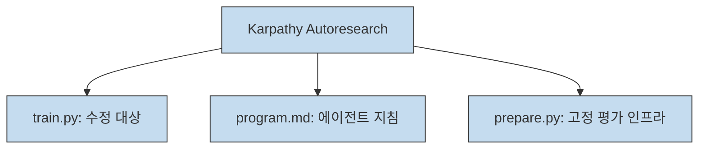
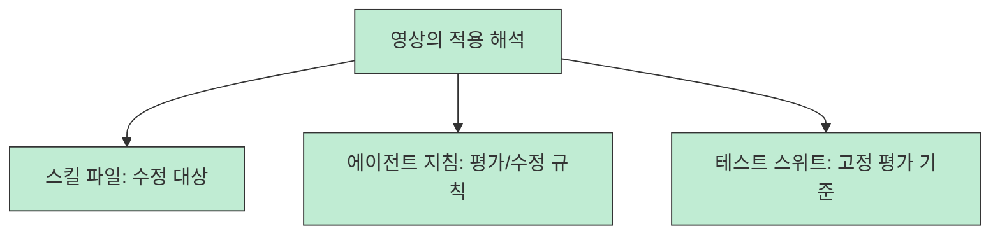
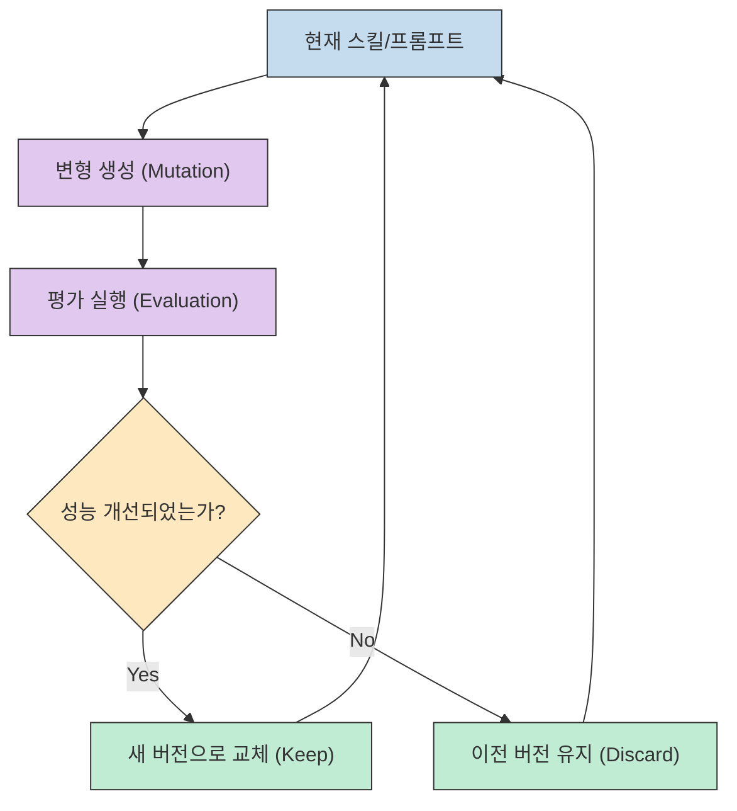
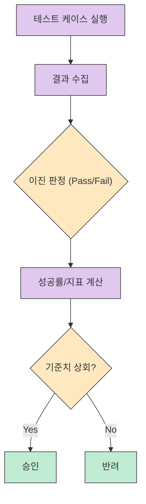
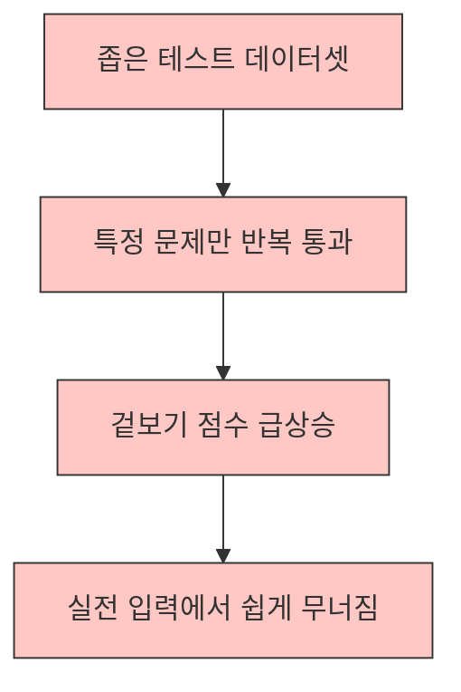
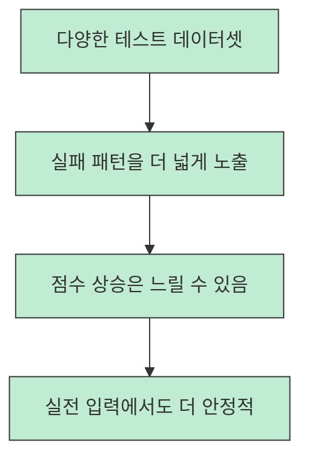

Claude Code를 사용하다 보면 스킬(Skill)이 기대만큼 동작하지 않아 답답할 때가 있습니다. 흔히 "70/30"의 법칙이라고 부르는, 70%는 잘하지만 나머지 30%에서 삐끗하는 불확실성 때문입니다. 이때 많은 개발자가 직접 프롬프트를 수정하며 시행착오를 겪지만, 이는 오히려 다른 케이스에서 성능을 떨어뜨리는 부작용을 낳기도 합니다. 이번 글에서는 안드레이 카파시(Andrej Karpathy)의 **Autoresearch** 개념을 빌려와, Claude Code 스킬을 데이터와 지표 기반으로 자동 개선하는 영리한 접근법을 정리해 보겠습니다.[^1][^2]

<!--more-->

## Sources

- [https://youtube.com/watch?v=7MaUhmZijak&si=3IAk_oFCruvqeZJH](https://youtube.com/watch?v=7MaUhmZijak&si=3IAk_oFCruvqeZJH) - Claude Code 스킬을 직접 고치지 마세요. Autoresearch가 대신 해줍니다

## 안드레이 카파시의 Autoresearch와 Claude Code 스킬의 만남

안드레이 카파시가 공개한 **Autoresearch** 저장소는 AI 에이전트가 스스로 코드를 수정하고 성능을 평가하는 자동화된 루프를 보여줍니다. 이 저장소의 핵심 구조는 세 가지 파일로 나뉩니다. 최적화 대상인 **train.py**, 에이전트에게 지시를 내리는 **program.md**, 그리고 평가 인프라인 **prepare.py** 입니다. 여기서 **train.py** 는 에이전트가 수정하는 가변적인 타겟이 됩니다.[^4]

중요한 점은, 이 저장소가 원래부터 Claude Code 스킬을 위한 공식 도구는 아니라는 것입니다. 영상은 이 구조를 **Claude Code 스킬 개선에 비유적으로 옮겨 보는 해석** 으로 제시합니다. 즉 `train.py` 를 스킬 파일에, `program.md` 를 평가 규칙을 담은 에이전트 지침에 대응시켜 보자는 접근입니다. 영상 사례에서는 이런 해석을 바탕으로 다이어그램 생성 스킬을 반복 평가하며 점수가 32점에서 37점, 최종적으로는 39~40점 수준까지 올라가는 흐름을 보여 줍니다.[^2][^4]

## 왜 직접 고치면 안 되는가? (객관적 지표와 반복 실험의 중요성)

프롬프트 엔지니어링은 본질적으로 노이즈가 많습니다. 같은 프롬프트여도 실행할 때마다 결과가 달라질 수 있기 때문입니다. 사람이 직접 한두 번 테스트해 보고 성능이 좋아졌다고 판단하는 것은 위험합니다. 특정 케이스에만 최적화되는 **과적합(Overfitting)** 의 함정에 빠지기 쉽기 때문입니다.[^3]

Autoresearch 구조가 흥미로운 이유는 **이진 판정(Binary Grading)** 과 **반복 실행** 을 결합한다는 점입니다. Karpathy 저장소에서는 5분 단위의 고정된 평가 루프를 돌리고, 지표가 좋아졌을 때만 변경 사항을 유지(Keep)하며, 그렇지 않으면 버리는(Discard) 단순한 규칙을 씁니다.[^4] 영상은 이 구조를 Claude Code 스킬 평가에도 비슷하게 적용할 수 있다고 해석합니다.[^2]

## 5분 평가 루프와 이진 결정 시스템

실제 Autoresearch 저장소에서는 `val_bpb`(Bits Per Byte)라는 객관적인 지표를 사용합니다. 이 지표가 낮아질수록 모델의 예측 성능이 좋아졌음을 의미합니다. 만약 이 개념을 Claude Code 스킬 쪽에 옮긴다면, `val_bpb` 대신 우리가 정의한 테스트 스위트의 통과율이나 성공률이 비슷한 역할을 맡는 식으로 해석할 수 있습니다. 이것 역시 영상이 제시한 적용 방식이지, Karpathy 저장소의 공식 기능은 아닙니다.[^2][^4]

중요한 것은 평가 설계의 정교함입니다. 단순히 잘 되는가를 묻는 것이 아니라, 에이전트가 빠지기 쉬운 함정들을 테스트 케이스로 촘촘히 배치해야 합니다. 예를 들어 다이어그램 생성 스킬이라면, 복잡한 관계도나 특수 문자가 포함된 케이스를 넣어 실패 패턴이 어디서 반복되는지 드러내는 식입니다. 이런 평가 로그가 쌓여야 프롬프트를 어떤 방향으로 바꿔야 할지 더 분명해집니다.[^2]

## 실전 적용 포인트

Claude Code 스킬을 Autoresearch 방식으로 개선할 때 기억해야 할 실전 포인트는 다음과 같습니다.

1.  **평가 설계가 전부다**: 에이전트가 시험 문제를 외우는 과적합에 빠지지 않도록, 테스트 데이터셋을 다양하게 구성해야 합니다.
2.  **이진 판정을 선호하라**: 1점부터 10점까지 매기는 주관적인 점수보다, 요구사항을 모두 충족했는가라는 Yes/No 판정이 자동화 루프에서 훨씬 안정적입니다.
3.  **반복의 힘을 믿어라**: 한 번의 성공에 일희일비하지 말고, 여러 번의 실행 결과가 통계적으로 우위에 있을 때만 프롬프트를 업데이트하세요.
4.  **가변 타겟 분리**: 어떤 파일 구조를 쓰든, 에이전트가 수정해도 되는 대상과 평가 인프라는 분리해 두는 편이 안전합니다. 그래야 실험 범위가 명확해지고, 실패했을 때도 되돌리기 쉽습니다.

## 핵심 요약

- Claude Code 스킬의 불확실성을 줄이려면 사람이 직접 감으로 고치기보다 **자동화된 평가 루프** 를 붙여 보는 편이 낫습니다.[^1][^2]
- 안드레이 카파시의 Autoresearch는 **가변 타겟(train.py)** 과 **고정 인프라(prepare.py)** 를 분리하여 에이전트가 스스로 성능을 개선하게 만듭니다.[^4]
- 영상은 이 구조를 Claude Code 스킬에도 옮겨볼 수 있다고 해석하며, 여기서는 **이진 판정** 과 **반복 실행** 이 더 안정적인 수정 루프를 만드는 핵심으로 제시됩니다.[^2][^4]
- 과적합을 줄이려면 정교한 테스트 케이스 설계가 필수적이며, 이는 실전 입력에서의 안정성을 높이는 데 도움이 됩니다.[^3]

## 결론

Claude Code 스킬을 직접 고치는 것은 마치 움직이는 과녁을 맞히려는 것과 같습니다. 하지만 Autoresearch의 철학을 빌려 "**평가하는 시스템**" 을 먼저 구축하면, 적어도 감에 의존한 수정보다 더 일관된 비교와 반복 개선이 가능해집니다.

이 방식은 스킬 하나를 즉시 "해결" 하는 만능 열쇠라기보다, AI 에이전트와 협업할 때 무엇을 고칠지보다 무엇을 측정할지를 먼저 정하게 만드는 운영 방식에 가깝습니다. 개발자는 어떻게 고칠까를 고민하는 대신 어떻게 평가할까에 집중하게 되고, 그 결과 스킬 수정 과정도 훨씬 덜 감각 의존적으로 바뀝니다. 지금 바로 여러분의 Claude Code 스킬에 작은 테스트 루프를 만들어 보세요. 적어도 다음 수정이 왜 나아졌는지, 혹은 왜 아니었는지를 더 분명하게 설명할 수 있게 될 것입니다.

[^1]: [https://youtu.be/7MaUhmZijak?t=0](https://youtu.be/7MaUhmZijak?t=0)
[^2]: [https://youtu.be/7MaUhmZijak?t=3](https://youtu.be/7MaUhmZijak?t=3)
[^3]: [https://youtu.be/7MaUhmZijak?t=814](https://youtu.be/7MaUhmZijak?t=814)
[^4]: [https://github.com/karpathy/autoresearch](https://github.com/karpathy/autoresearch)
