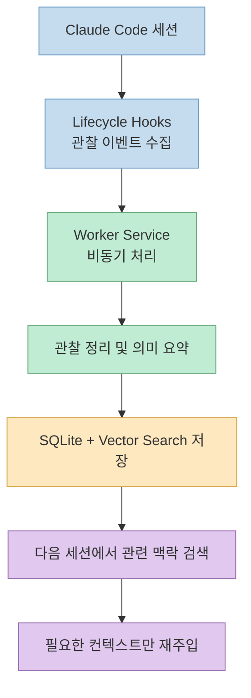
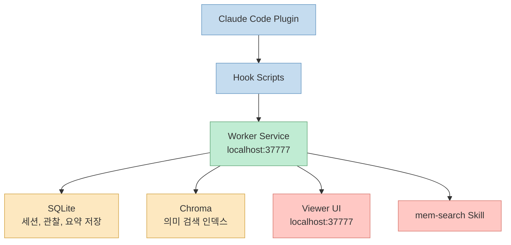
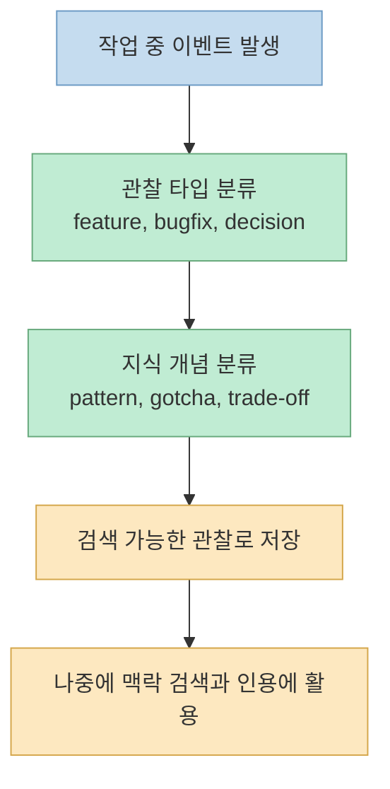
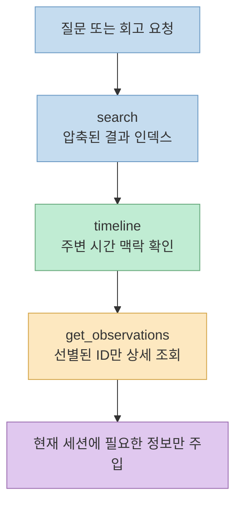
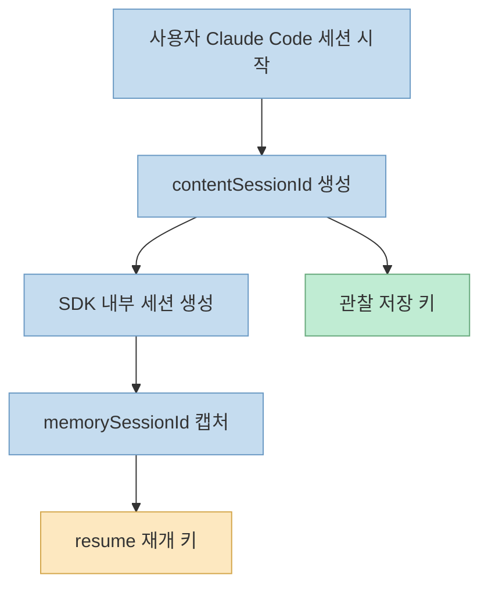

Claude Code를 오래 쓰다 보면 가장 먼저 부딪히는 한계는 모델 성능보다 **세션 단절** 입니다. 방금 전까지 무엇을 조사했고 어떤 결정을 내렸는지 다음 세션에서 다시 설명해야 하는 순간이 반복되기 때문입니다. `thedotmack/claude-mem`은 바로 그 문제를 겨냥한 플러그인입니다. 저장소의 표현을 그대로 옮기면, 이 프로젝트는 Claude Code용 **"persistent memory compression system"** 이고, 세션 동안 발생한 관찰을 자동 수집하고 요약한 뒤 다음 세션에 다시 주입하는 구조를 제공합니다. (`README.md`)

<!--more-->

## Sources

- https://github.com/thedotmack/claude-mem
- https://raw.githubusercontent.com/thedotmack/claude-mem/main/README.md
- https://raw.githubusercontent.com/thedotmack/claude-mem/main/package.json
- https://raw.githubusercontent.com/thedotmack/claude-mem/main/CLAUDE.md
- https://raw.githubusercontent.com/thedotmack/claude-mem/main/docs/SESSION_ID_ARCHITECTURE.md
- https://raw.githubusercontent.com/thedotmack/claude-mem/main/plugin/modes/code.json

## 1. Claude-Mem는 정확히 무엇을 해결하나

Claude-Mem를 단순히 "대화 기록 저장기"로 이해하면 핵심을 놓치게 됩니다. 이 저장소가 내세우는 포인트는 채팅 로그를 길게 붙여 넣는 방식이 아니라, **도구 사용과 작업 진행에서 의미 있는 관찰만 뽑아 압축하고 다시 검색 가능한 형태로 남긴다** 는 점입니다. `README.md`는 이를 "tool usage observations"와 "semantic summaries"라는 표현으로 설명합니다. 즉 전체 세션을 무차별적으로 재주입하는 것이 아니라, 나중에 다시 쓸 가치가 있는 정보만 남기는 쪽에 가깝습니다.

이 구조가 중요한 이유는 분명합니다. 에이전트 코딩 환경에서 필요한 것은 "모든 과거"가 아니라 **지금 작업을 이어 가는 데 필요한 과거** 이기 때문입니다. Claude-Mem는 그 차이를 "저장"보다 "압축과 재검색"으로 해결하려고 합니다.

또 한 가지 중요한 포인트는 설치 방식입니다. README는 `/plugin marketplace add thedotmack/claude-mem`과 `/plugin install claude-mem`을 빠른 시작으로 제시하면서, `npm install -g claude-mem`은 **SDK/library만 설치할 뿐 플러그인 훅과 워커 서비스는 등록하지 않는다** 고 명시합니다. 즉 Claude-Mem를 제대로 쓰려면 npm 전역 패키지가 아니라 Claude Code 플러그인으로 설치해야 합니다. 이 구분은 실제 사용성에 직접 영향을 주는 핵심입니다.

## 2. 설치 후 실제로 무엇이 돌아가나

설치를 끝내고 나면 Claude-Mem는 보이지 않는 백그라운드 계층으로 동작합니다. `CLAUDE.md`와 `README.md`를 합쳐 보면 중심은 세 가지입니다. 첫째, 세션 이벤트를 잡는 훅 계층이 있고, 둘째, 이를 비동기로 처리하는 워커 서비스가 있으며, 셋째, 결과를 저장하고 다시 검색하는 저장소 계층이 있습니다.

저장소가 밝히는 기본 실행 환경도 꽤 명확합니다.

- Node.js `>=18.0.0` (`package.json`)
- Bun `>=1.0.0` (`package.json`)
- `uv` 자동 설치/활용 (`README.md`, `CLAUDE.md`)
- 설정 파일은 `~/.claude-mem/settings.json` (`README.md`, `CLAUDE.md`)
- SQLite DB는 `~/.claude-mem/claude-mem.db` (`CLAUDE.md`)
- 벡터 검색 데이터는 `~/.claude-mem/chroma/` (`CLAUDE.md`)

정리하면 Claude-Mem는 단순 스크립트가 아니라 **플러그인 훅 + 워커 프로세스 + 로컬 저장소 + 검색 인터페이스** 조합입니다. 그래서 사용자는 "메모리가 자동으로 붙는다"고 느끼지만, 내부적으로는 별도의 서비스가 돌아가고 있는 셈입니다.

특히 `README.md`는 웹 뷰어 UI를 `http://localhost:37777`로 설명하고, `CLAUDE.md` 역시 워커 서비스와 뷰어 UI가 모두 그 포트를 중심으로 동작한다고 적고 있습니다. 즉 이 프로젝트는 "메모리 엔진"만 있는 것이 아니라, 사람이 현재 축적된 메모리를 들여다볼 수 있는 로컬 관찰 인터페이스까지 함께 제공합니다.

## 3. 아키텍처의 핵심은 훅, 워커, 저장소의 분리다

`CLAUDE.md`가 적어 둔 구조를 보면 Claude-Mem의 설계 의도가 분명합니다. 훅은 가능한 한 경계면에서 빠르게 이벤트를 받고, 무거운 처리나 검색은 워커 서비스로 넘깁니다. 이렇게 해야 세션 자체를 느리게 만들지 않으면서도 메모리 누적을 지속할 수 있기 때문입니다.

문서가 설명하는 핵심 컴포넌트는 아래처럼 읽을 수 있습니다.

- **5 Lifecycle Hooks**: `SessionStart`, `UserPromptSubmit`, `PostToolUse`, `Stop`, `SessionEnd` (`README.md`, `CLAUDE.md`)
- **Worker Service**: Express 기반 HTTP API, Bun으로 관리 (`README.md`, `CLAUDE.md`)
- **SQLite**: 세션, 관찰, 요약 저장 (`README.md`, `CLAUDE.md`)
- **Chroma**: 의미 기반 검색용 벡터 계층 (`README.md`, `CLAUDE.md`)
- **mem-search skill**: 과거 작업 이력을 자연어로 검색하는 진입점 (`README.md`, `CLAUDE.md`)

여기서 중요한 것은 Claude-Mem가 **메모리 쓰기와 메모리 읽기 모두를 구조화했다** 는 점입니다. 쓰기 단계에서는 훅이 관찰을 수집하고, 읽기 단계에서는 skill/MCP 도구가 필요한 범위만 찾아 옵니다. 즉 저장만 잘하는 시스템이 아니라, 검색 비용까지 같이 설계한 시스템입니다.

또 `plugin/modes/code.json`을 보면 이 메모리가 완전히 자유로운 텍스트 덩어리로 남는 것도 아닙니다. 기본 코드 모드만 봐도 관찰 타입을 `bugfix`, `feature`, `refactor`, `change`, `discovery`, `decision`처럼 나누고, 개념 축도 `how-it-works`, `problem-solution`, `trade-off` 등으로 정리합니다. 이런 분류 체계 덕분에 "무슨 일이 있었는가"뿐 아니라 "그 일이 어떤 성격의 지식인가"까지 같이 구조화됩니다.

## 4. 검색 모델은 왜 "3단계"로 설계됐나

Claude-Mem가 다른 메모리 계층보다 실무적으로 흥미로운 부분은 검색 전략입니다. `README.md`는 이를 **3-Layer Workflow** 라고 부르며 `search -> timeline -> get_observations` 순서로 설명합니다. 핵심 아이디어는 처음부터 모든 상세 메모를 읽지 않고, 먼저 가벼운 인덱스를 보고, 흥미로운 지점의 시간 맥락을 확인한 뒤, 마지막에 필요한 관찰만 자세히 가져오는 것입니다.

이 접근의 장점은 단순합니다. 토큰을 가장 많이 먹는 것은 대부분 "아무거나 많이 읽는 것"인데, Claude-Mem는 그 반대로 **싼 검색 -> 좁히기 -> 비싼 상세 조회** 순서를 강제합니다. README가 언급하는 "~10x token savings"는 바로 이 전략에 대한 주장입니다.

이 설계는 단순한 UX 최적화가 아니라 메모리 시스템의 품질 문제와 연결됩니다. 메모리는 많이 저장하는 것보다 **필요한 순간에 정확히 좁혀 가져오는 것** 이 더 중요합니다. Claude-Mem는 저장 구조, 검색 도구, skill 인터페이스를 모두 이 원칙에 맞춰 묶어 둔 점이 특징입니다.

## 5. 실무에서 꼭 봐야 할 세 가지: 세션 ID, 프라이버시, 문서 일관성

### 5-1) 세션 ID를 둘로 나누는 이유

`docs/SESSION_ID_ARCHITECTURE.md`는 Claude-Mem 내부에서 **`contentSessionId`** 와 **`memorySessionId`** 를 분리한다고 설명합니다. 앞의 것은 사용자의 실제 Claude Code 대화 세션 ID이고, 뒤의 것은 SDK 에이전트 내부 resume용 세션 ID입니다. 문서가 굳이 이 차이를 강조하는 이유는, 둘을 혼동하면 관찰 저장과 세션 재개가 꼬일 수 있기 때문입니다.

특히 이 문서는 관찰 저장 시 `contentSessionId`를 사용하고, resume에는 `memorySessionId`를 사용해야 한다는 점을 "CRITICAL"로 명시합니다. 메모리 시스템에서 세션 경계를 애매하게 다루면 다른 세션의 기록이 섞이거나 재개 지점이 틀어질 수 있는데, Claude-Mem는 그 부분을 문서와 테스트 전략까지 포함해 강하게 관리하려고 합니다.

### 5-2) 프라이버시 태그는 생각보다 중요한 운영 장치다

`README.md`와 `CLAUDE.md`는 모두 `<private>...</private>` 태그를 언급합니다. 핵심은 사용자가 특정 내용을 저장에서 제외하도록 명시적으로 표시할 수 있다는 점이고, `CLAUDE.md`는 이 태그 스트리핑이 **데이터가 워커/DB로 들어가기 전 훅 계층에서 처리된다** 고 적고 있습니다. 즉 나중에 DB에서 숨기는 방식이 아니라, 저장되기 전에 걸러 내는 방식입니다.

이 차이는 실무적으로 큽니다. 민감한 프롬프트나 비밀값이 한 번 저장소에 들어간 뒤 "UI에서만 안 보이게" 처리되는 것과, 애초에 저장 경계면에서 제거되는 것은 보안 성격이 다르기 때문입니다. Claude-Mem는 최소한 설계 의도상 이 부분을 앞단에서 차단하려고 합니다.

### 5-3) 문서에는 약간의 버전 비동기가 있다

이 저장소를 읽으면서 실무자가 한 번쯤 체크해야 할 부분이 있습니다. README 배지는 버전 `6.5.0`처럼 보이지만, `package.json`은 `10.6.0`, GitHub 최신 릴리스도 `v10.6.0`으로 보입니다. 즉 프로젝트는 매우 활발하게 움직이고 있지만, 일부 README 뱃지는 최신 상태와 어긋나 있을 가능성이 있습니다.

이건 치명적인 문제라기보다 **빠르게 성장하는 도구에서 흔히 보이는 문서 동기화 비용** 으로 읽는 편이 맞습니다. 다만 설치나 운영 판단을 할 때는 README 뱃지보다 `package.json`, 릴리스, 실제 문서 페이지를 우선하는 습관이 필요합니다.

## 핵심 요약

1. Claude-Mem는 채팅 로그 저장기가 아니라, Claude Code 세션에서 나온 관찰을 압축하고 다음 세션에 다시 주입하는 **메모리 압축 계층** 에 가깝습니다.
2. 올바른 설치 경로는 npm 전역 설치가 아니라 Claude Code 플러그인 설치이며, 워커 서비스와 훅은 그 경로를 통해 연결됩니다.
3. 내부 구조는 `hooks -> worker -> SQLite/Chroma -> search skill/viewer`로 나뉘고, 그래서 자동 동작과 검색성을 동시에 확보합니다.
4. 검색은 `search -> timeline -> get_observations`의 3단계 워크플로로 설계돼 토큰 낭비를 줄이는 방향을 분명히 드러냅니다.
5. 세션 ID 분리, `<private>` 태그의 경계면 처리, README와 실제 버전 간 비동기 확인은 실무 도입 시 꼭 봐야 할 포인트입니다.

## 결론

Claude-Mem의 흥미로운 지점은 "메모리를 남긴다"가 아니라 **메모리를 검색 가능한 작업 지식으로 바꾼다** 는 데 있습니다. 훅으로 관찰을 모으고, 워커와 저장소로 정리하고, 다시 token-aware 검색 단계로 가져오는 구조가 꽤 일관되게 설계되어 있습니다. Claude Code를 장시간 쓰면서 세션 단절과 컨텍스트 재설명 비용이 아쉬웠다면, Claude-Mem는 현재 오픈소스 진영에서 가장 공격적으로 그 문제를 시스템화한 사례 중 하나로 볼 만합니다.
