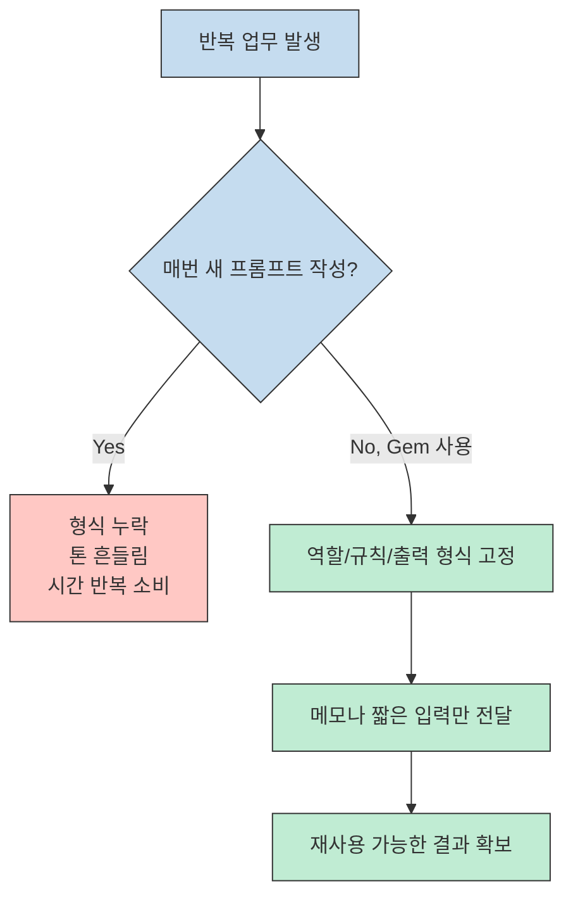
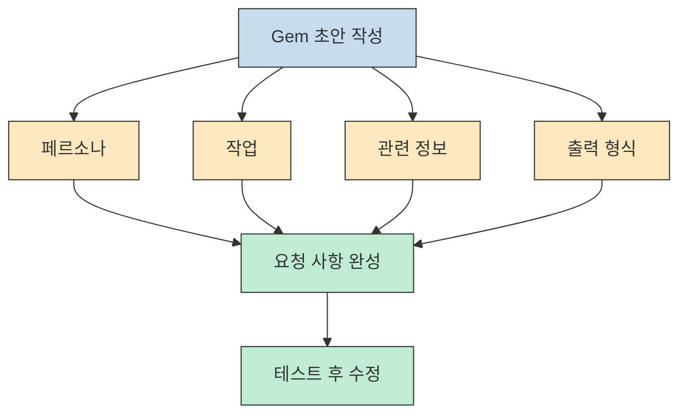
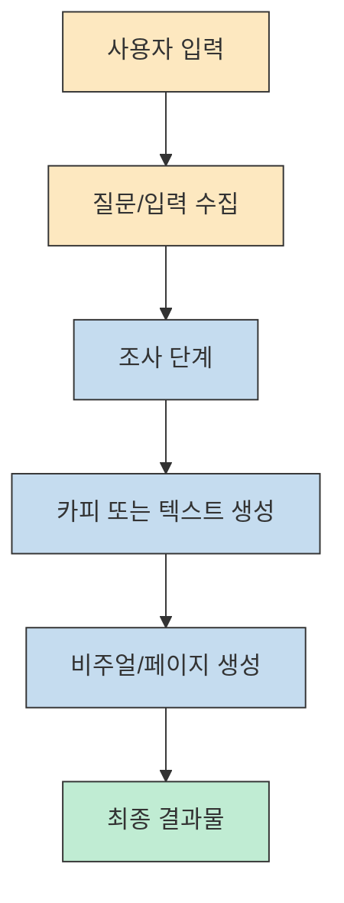
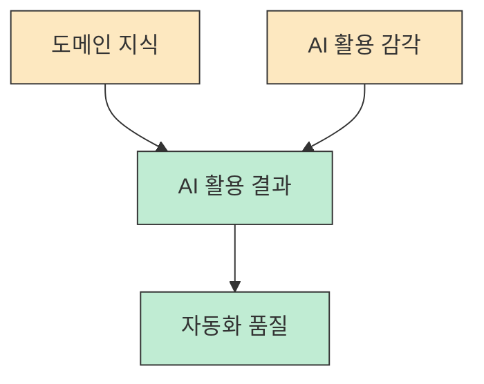

Gemini를 오래 쓴 사람일수록 의외로 가장 많이 반복하는 행동이 있습니다. 바로 비슷한 프롬프트를 매번 다시 붙여 넣는 일입니다. 이 영상이 건드리는 핵심은 단순합니다. **좋은 프롬프트를 한 번 잘 쓰는 것보다, 그 프롬프트를 재사용 가능한 업무 단위로 고정하는 편이 실무 생산성에 훨씬 큰 차이를 만든다** 는 점입니다. [근거 영상](https://youtu.be/35ETAYfX0XM?t=0) [공식 Gems 소개](https://gemini.google/overview/gems/)

다만 영상의 표현은 그대로 받아 적기보다 한 번 보정해서 읽는 편이 좋습니다. 영상은 후반부에서 멀티스텝 자동화를 "슈퍼잼스" 라는 이름으로 소개하지만, 현재 Google 공식 문서 기준의 정식 제품명은 `Gems` 이고, 시각적 워크플로우 기반 기능은 `Opal` 계열 실험 기능으로 설명하는 편이 더 정확합니다. 그래서 이 글은 영상의 실전 팁은 살리되, 용어는 공식 문서 기준으로 다시 정리해 보겠습니다. [근거 영상](https://youtu.be/35ETAYfX0XM?t=95) [공식 Help Center](https://support.google.com/gemini/answer/15236321) [Google Labs Opal](https://blog.google/innovation-and-ai/models-and-research/google-labs/mini-apps-opal-gemini-app-experiment/)

<!--more-->

## Sources

- https://www.youtube.com/watch?v=35ETAYfX0XM
- https://gemini.google/overview/gems/
- https://support.google.com/gemini/answer/15236321
- https://blog.google/products-and-platforms/products/gemini/google-gems-tips/
- https://blog.google/innovation-and-ai/models-and-research/google-labs/opal-agent/
- https://blog.google/innovation-and-ai/models-and-research/google-labs/mini-apps-opal-gemini-app-experiment/

## 1) Gems를 "좋은 프롬프트 보관함" 이 아니라 재사용 가능한 업무 단위로 봐야 하는 이유

영상의 출발점은 아주 현실적입니다. 이메일 초안, 보고 문장 정리, 특정 형식의 요약처럼 비슷한 작업을 할 때 사람들은 같은 프롬프트를 계속 손으로 다시 씁니다. 영상은 이걸 비효율로 보고, Gemini에 내가 원하는 역할과 결과 형식을 미리 고정해 둔 뒤 필요할 때마다 꺼내 쓰는 방식으로 전환하라고 제안합니다. Google 공식 설명도 거의 같은 방향입니다. Gems는 반복 작업을 더 빠르게 처리하거나 특정 분야의 깊은 전문성을 붙여 쓰기 위한 "customized versions of Gemini" 로 소개됩니다. 즉 핵심은 대화 한 번의 품질보다 **업무 패턴의 재사용성** 입니다. [근거 영상](https://youtu.be/35ETAYfX0XM?t=0) [공식 Gems 소개](https://gemini.google/overview/gems/) [공식 Help Center](https://support.google.com/gemini/answer/15236321)

영상이 예시로 드는 "까다로운 김부장님 보고용 이메일 작성기" 가 좋은 이유도 여기에 있습니다. 상사마다 좋아하는 제목 규칙, 핵심 배치 순서, 마감 시점 강조 방식이 다르다면, 프롬프트를 잘 쓰는 능력보다 그 기준을 한번 구조화해 고정하는 편이 더 중요합니다. 나중에는 메모만 던져도 원하는 톤과 형식으로 다시 나오기 때문입니다. 이 지점에서 Gems는 단순한 저장 기능이 아니라, **나만의 업무 규칙을 인터페이스 뒤에 숨겨 둔 실행 단위** 에 가깝습니다. [근거 영상](https://youtu.be/35ETAYfX0XM?t=135)

여기서 실무적으로 중요한 판단은 "무엇을 Gem으로 만들 것인가" 입니다. 매번 완전히 다른 질문을 하는 용도에는 일반 채팅이 더 낫습니다. 반대로 반복적이고, 형식이 있고, 성공 기준이 비교적 명확한 작업은 Gem으로 분리할수록 효율이 올라갑니다. 다시 말해 Gems는 창의적 사고를 대체하는 도구라기보다, **반복되는 판단 순서와 출력 계약을 외부화하는 도구** 로 보는 편이 맞습니다. [근거 영상](https://youtu.be/35ETAYfX0XM?t=65) [Google Keyword blog](https://blog.google/products-and-platforms/products/gemini/google-gems-tips/)

## 2) 클래식 Gems를 잘 만드는 핵심은 "페르소나-작업-배경-형식" 구조다

영상에서 가장 실용적인 부분은 요청 사항을 쓰는 법입니다. 막연히 "이메일 잘 써줘" 라고 적는 대신, 어떤 역할로 일해야 하는지, 무엇을 만들어야 하는지, 어떤 배경 지식을 반영해야 하는지, 어떤 형식으로 결과를 내야 하는지를 나눠서 적으라고 설명합니다. 이것은 영상 안의 팁일 뿐 아니라 Google이 Gems 설명에서 반복적으로 권하는 방향과도 맞닿아 있습니다. Gems의 품질은 모델이 똑똑해서가 아니라, **요청 사항이 작업 계약처럼 구체적일 때** 올라갑니다. [근거 영상](https://youtu.be/35ETAYfX0XM?t=210) [공식 Help Center](https://support.google.com/gemini/answer/15236321)

이 구조가 좋은 이유는 요청을 더 길게 만들기 때문이 아니라, 누락을 줄이기 때문입니다. 예를 들어 페르소나가 없으면 결과의 태도가 흔들리고, 작업 정의가 없으면 산출물이 엉뚱한 방향으로 새고, 관련 정보가 없으면 배경 맥락이 빠지고, 형식이 없으면 최종 출력이 읽기 어려워집니다. 영상이 말하는 "좋은 Gem" 은 화려한 프롬프트가 아니라 **빠뜨리면 안 되는 제약을 먼저 고정한 Gem** 에 가깝습니다. [근거 영상](https://youtu.be/35ETAYfX0XM?t=220)

영상이 추천하는 두 번째 팁도 좋습니다. 먼저 사람이 대충 쓴 요청 사항을 넣고 마법봉 기능으로 더 명확한 버전으로 다시 써 보게 하는 방식입니다. 이때 중요한 건 AI가 다시 써 준 결과를 그대로 믿는 것이 아니라, 내가 원하는 의도와 맞는지 확인하는 검수 단계입니다. 즉 AI는 프롬프트 작성을 도와주는 조수일 수는 있어도, 성공 기준을 대신 정해 주는 책임자는 아닙니다. [근거 영상](https://youtu.be/35ETAYfX0XM?t=255)

업무가 더 복잡해지면 영상은 아예 별도 대화창에서 Gemini에게 "내 업무를 이해하고, Gems용 요청 사항으로 다시 구성해 달라" 고 부탁하라고 제안합니다. 이 접근의 장점은 한 번에 정답을 기대하지 않고, 필요한 추가 질문까지 유도한다는 점입니다. 실무에서 좋은 자동화는 보통 첫 프롬프트에서 나오지 않습니다. 빠진 조건을 질문으로 드러내고, 그 대화를 통해 성공 기준을 보완할 때 비로소 재사용 가능한 템플릿이 됩니다. [근거 영상](https://youtu.be/35ETAYfX0XM?t=295)

영상은 여기에 도구와 배경 지식도 붙입니다. 이미지 생성이 필요하면 해당 도구를 연결하고, 자료 조사가 필요하면 Canvas나 Deep Research 같은 도구를 고려하며, 배경 지식이 있으면 추가로 넣으라고 설명합니다. 다만 후반부의 NotebookLM 연동 표현은 조심해서 읽는 편이 좋습니다. 영상에서는 노트북 지식을 붙여 쓰는 식으로 설명하지만, 공식 문서에서 확인되는 NotebookLM+Gems 연동은 문맥별 제한이 있고 일반 소비자용 Gems의 핵심 설명은 아닙니다. 따라서 계정이나 실험 기능 상태에 따라 다르게 보일 수 있는 부분으로 이해하는 편이 안전합니다. [근거 영상](https://youtu.be/35ETAYfX0XM?t=340) [공식 Gems 소개](https://gemini.google/overview/gems/) [NotebookLM/Gems education context](https://www.instructure.com/resources/blog/enrich-learning-canvas-new-gemini-ltim-enhancements-adding-notebooklm-and-gems)

마지막으로 영상이 반드시 강조하는 것이 테스트와 수정입니다. Gem을 저장했다고 바로 완성품이 되는 것이 아니라, 실제 메모나 초안을 넣어 본 뒤 결과가 원하는 기준에 맞는지 확인하고, 필요하면 요청 사항을 계속 손봐야 한다는 것입니다. 이 부분이 중요합니다. 좋은 Gem은 처음부터 잘 만든 것이 아니라, **반복 테스트 끝에 실패 패턴이 줄어든 Gem** 입니다. [근거 영상](https://youtu.be/35ETAYfX0XM?t=395)

## 3) 영상의 "슈퍼잼스" 는 공식 제품명이 아니라 Opal 기반 워크플로우형 Gems에 가깝다

영상 중반부는 클래식 Gem으로 처리하기 어려운 멀티스텝 자동화를 설명하면서 상단 영역을 "슈퍼잼스" 라고 부릅니다. 영상에서 보여 주는 기능적 특징은 분명합니다. 입력값을 몇 개 주면 조사, 카피 작성, 영상 생성, 웹페이지 초안 같은 서로 다른 작업을 순서대로 실행하는 워크플로우를 구성해 준다는 점입니다. 그래서 실전 감각으로는 "단일 프롬프트 자동화" 에서 "업무 흐름 자동화" 로 올라가는 느낌을 받을 수 있습니다. [근거 영상](https://youtu.be/35ETAYfX0XM?t=550) [근거 영상](https://youtu.be/35ETAYfX0XM?t=600)

하지만 용어는 그대로 쓰면 안 됩니다. 현재 Google 공식 자료에서 정식 제품명은 여전히 `Gems` 이고, 시각적 미니앱 빌더이자 멀티스텝 실행 환경으로 설명되는 쪽은 `Opal` 입니다. 게다가 2026년 2월 발표된 Opal의 `agent step` 은 자연어로 여러 단계를 계획하고, 웹 검색이나 Veo, Google Sheets 같은 도구를 선택하며, 중간에 질문까지 하는 흐름으로 소개됩니다. 즉 영상이 말하는 "슈퍼잼스" 의 실체는 별도 독립 제품이라기보다, **Opal 계열의 워크플로우 기능이 Gemini 안의 실험적 Gem 경험으로 합쳐진 흐름** 으로 이해하는 편이 정확합니다. [공식 Opal agent](https://blog.google/innovation-and-ai/models-and-research/google-labs/opal-agent/) [Google Labs integration](https://blog.google/innovation-and-ai/models-and-research/google-labs/mini-apps-opal-gemini-app-experiment/)

그래서 이 구간을 읽는 가장 좋은 방법은 이렇습니다. 영상의 포인트는 제품명을 새로 외우라는 것이 아니라, **단일 응답을 잘 뽑는 것과 여러 단계를 순서대로 엮는 것은 완전히 다른 문제** 라는 점을 보여 주는 데 있습니다. 제품 정보 입력 -> 조사 -> 카피 작성 -> 영상/페이지 초안 생성처럼 단계가 늘어날수록, 좋은 출력은 더 이상 한 번의 프롬프트 품질만으로 결정되지 않고 워크플로우 설계 품질에 좌우됩니다. [근거 영상](https://youtu.be/35ETAYfX0XM?t=640) [공식 Opal agent](https://blog.google/innovation-and-ai/models-and-research/google-labs/opal-agent/)

영상 후반의 고급 편집 화면 설명도 같은 맥락입니다. 색이 다른 박스로 질문, AI 작업, 최종 출력이 분리되어 있고, 각 단계의 프롬프트와 모델을 확인하거나 수정할 수 있다는 점이 핵심입니다. 이 장면이 중요한 이유는 좋은 자동화가 "버튼 한 번" 의 마법이 아니라, **각 단계가 무슨 역할을 맡는지 사람이 이해하고 손볼 수 있는 설계 문제** 라는 점을 드러내기 때문입니다. 영상이 작업 결과는 따로 저장해야 한다고 말하는 것도, 자동화가 되었다고 해서 산출물 관리 책임까지 사라지는 것은 아니라는 뜻입니다. [근거 영상](https://youtu.be/35ETAYfX0XM?t=730) [근거 영상](https://youtu.be/35ETAYfX0XM?t=790)

## 4) 실전 적용 포인트

이 영상을 실무에 옮길 때 가장 먼저 할 일은 "내가 반복하는 작업이 무엇인가" 를 좁히는 것입니다. 이메일, 보고서, 리서치 요약처럼 하나의 입력 형식과 하나의 성공 기준이 비교적 선명한 작업부터 Gem으로 묶는 편이 좋습니다. 처음부터 동영상 생성, 랜딩 페이지 제작, 조사 자동화까지 한 번에 올리려고 하면 무엇이 병목인지 보이지 않습니다. 작은 단위에서 성공 기준을 고정한 뒤, 그 다음에 워크플로우형 자동화로 넘어가는 편이 안정적입니다. [근거 영상](https://youtu.be/35ETAYfX0XM?t=120) [근거 영상](https://youtu.be/35ETAYfX0XM?t=560)

둘째, 팀 공유는 강력하지만 동시에 위험합니다. 영상은 자신의 노하우를 Gem에 넣어 직원들과 공유하면 작업 품질의 하한선을 맞출 수 있다고 설명합니다. 이 말은 맞습니다. 하지만 반대로 말하면 설계가 허술한 Gem을 공유하면 잘못된 기준도 함께 복제된다는 뜻입니다. 팀 공유 전에는 반드시 입력 예시 몇 개로 테스트하고, 어떤 산출물이 나오면 통과인지 명확히 정의해 두는 편이 좋습니다. [근거 영상](https://youtu.be/35ETAYfX0XM?t=490)

셋째, 자동화는 결과를 대신 검수해 주지 않습니다. 영상 후반이 계속 강조하는 것도 바로 이 부분입니다. 워크플로우와 결과물 검토는 어디까지나 사람 몫이며, 더 쉬운 도구가 나올수록 오히려 좋은 워크플로우를 설계하는 능력이 더 중요해진다고 말합니다. 이 지적은 과장이 아닙니다. 생성형 AI의 진짜 생산성 차이는 툴 사용 여부보다 **무엇을 어떤 순서로 검증할 것인지 아는 사람** 에게서 더 크게 벌어집니다. [근거 영상](https://youtu.be/35ETAYfX0XM?t=815)

넷째, 영상의 마지막 메시지는 의외로 기능 소개보다 더 중요합니다. 발표자는 AI를 "곱셈 기계" 라고 표현하면서, 내 실력이 0에 가까우면 아무리 좋은 자동화 도구를 써도 결과 역시 0에 가까워질 수 있다고 말합니다. 그리고 이를 보완하는 방법으로 독서와 "하루 30분씩 3개월" 의 반복 사용을 제안합니다. 이 조언은 과학적 공식이라기보다 훈련 습관에 가깝지만, 적어도 방향은 분명합니다. **Gem을 잘 만드는 사람은 프롬프트를 외우는 사람이 아니라, 자신의 업무를 단계와 기준으로 설명할 수 있는 사람** 입니다. [근거 영상](https://youtu.be/35ETAYfX0XM?t=850) [근거 영상](https://youtu.be/35ETAYfX0XM?t=890)

## 핵심 요약

- Gemini Gems의 본질은 "좋은 프롬프트 저장" 이 아니라, 반복되는 업무 규칙을 재사용 가능한 단위로 고정하는 데 있습니다. [근거 영상](https://youtu.be/35ETAYfX0XM?t=0) [공식 Gems 소개](https://gemini.google/overview/gems/)
- 클래식 Gems의 품질은 페르소나, 작업, 배경 정보, 출력 형식을 얼마나 명확히 적느냐에 달려 있습니다. 그리고 저장 후 테스트/수정이 반드시 뒤따라야 합니다. [근거 영상](https://youtu.be/35ETAYfX0XM?t=210) [근거 영상](https://youtu.be/35ETAYfX0XM?t=395)
- 영상의 "슈퍼잼스" 는 정식 제품명이라기보다 Opal 계열의 워크플로우형 Gem 경험을 설명하는 표현으로 읽는 편이 정확합니다. [공식 Opal agent](https://blog.google/innovation-and-ai/models-and-research/google-labs/opal-agent/) [Google Labs integration](https://blog.google/innovation-and-ai/models-and-research/google-labs/mini-apps-opal-gemini-app-experiment/)
- 멀티스텝 자동화가 강해질수록 중요한 것은 모델 한 번의 답변 품질이 아니라, 각 단계를 어떻게 설계하고 사람이 어디서 검수할지 정하는 운영 능력입니다. [근거 영상](https://youtu.be/35ETAYfX0XM?t=640) [근거 영상](https://youtu.be/35ETAYfX0XM?t=815)
- 결국 AI 자동화의 상한은 도구 이름이 아니라 도메인 지식과 반복 개선 습관이 결정합니다. [근거 영상](https://youtu.be/35ETAYfX0XM?t=850)

## 결론

이 영상의 진짜 가치는 "새로운 기능이 또 나왔다" 는 소식에 있지 않습니다. 오히려 반복 프롬프트를 개인 업무 시스템으로 바꾸는 사고방식, 그리고 한 번의 답변 생성과 여러 단계의 워크플로우 자동화는 다른 문제라는 점을 입문자 눈높이에서 보여 준 데 있습니다. [근거 영상](https://youtu.be/35ETAYfX0XM?t=0) [근거 영상](https://youtu.be/35ETAYfX0XM?t=560)

그래서 실전에서는 이렇게 이해하면 됩니다. 먼저 클래식 Gems로 반복 업무를 고정하고, 그 다음 정말 여러 단계가 이어지는 일에만 Opal 계열의 워크플로우형 자동화를 검토하세요. 그리고 어느 경우든 마지막 품질 책임은 사람에게 남겨 두세요. 그 원칙만 지키면 Gems는 단순한 기능 소개를 넘어, 실제로 시간을 아껴 주는 개인 업무 자동화 레이어가 됩니다. [공식 Gems 소개](https://gemini.google/overview/gems/) [공식 Opal agent](https://blog.google/innovation-and-ai/models-and-research/google-labs/opal-agent/)
