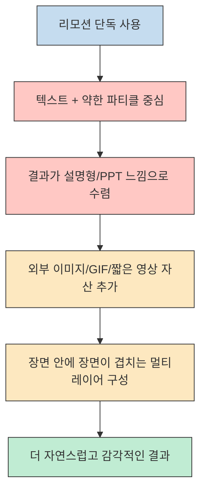
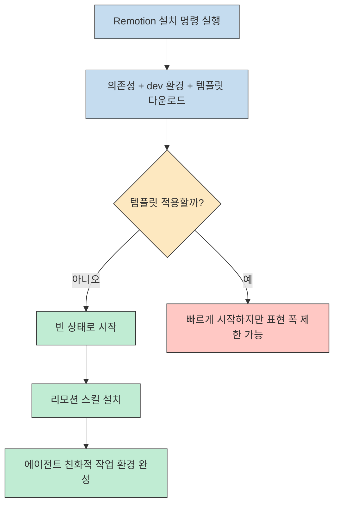
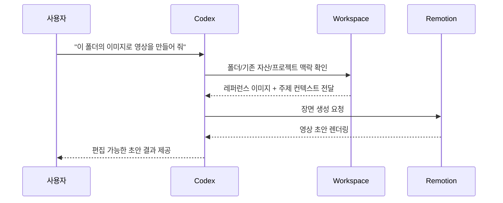
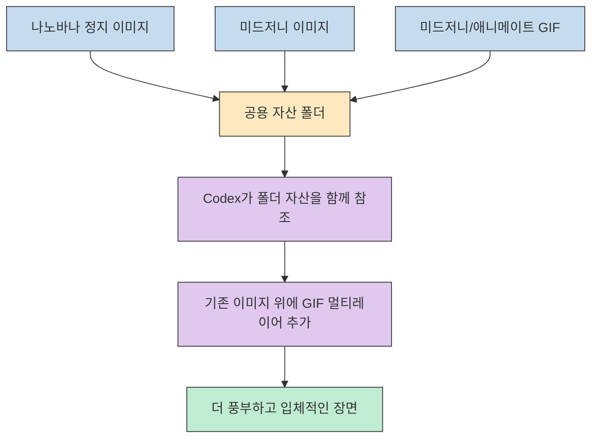
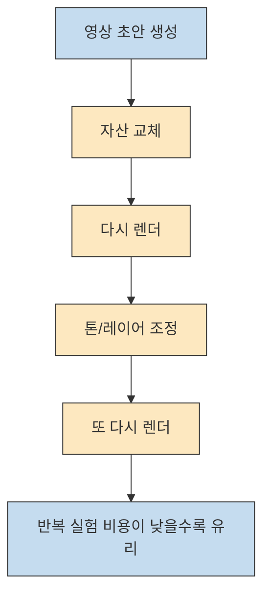
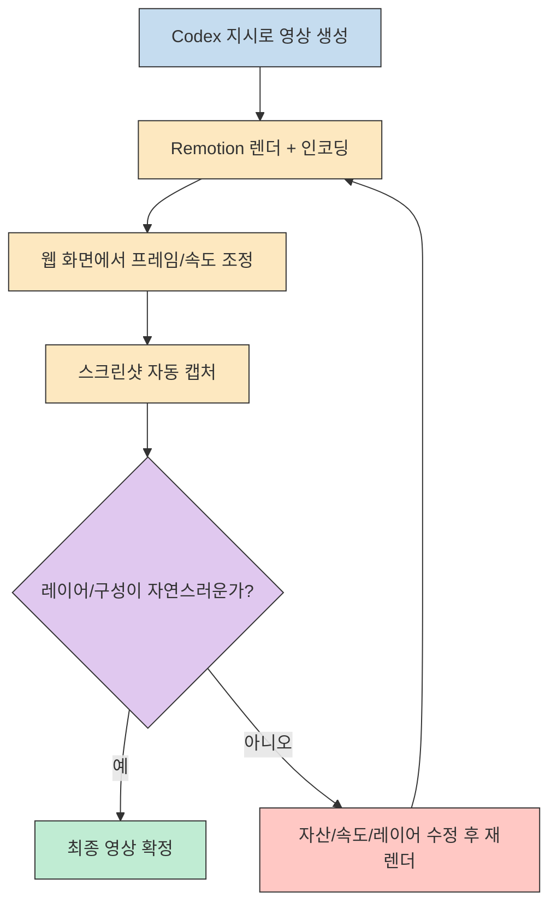

리모션은 원래부터 강력한 툴이지만, 영상에서 반복해서 강조하는 포인트는 분명합니다. **리모션 자체만으로는 설명형 PPT 같은 결과가 나오기 쉽고**, 여기에 외부 이미지와 짧은 모션 자산을 레이어로 섞어야 비로소 "감각적인 영상" 으로 넘어간다는 것입니다. (참고: [0:00](https://youtu.be/cSWpNjXeahE?t=0), [2:54](https://youtu.be/cSWpNjXeahE?t=174), [5:14](https://youtu.be/cSWpNjXeahE?t=314))

이 글은 영상을 그대로 요약하는 대신, 발표자가 실제로 보여 준 제작 흐름을 **설치 → 자산 준비 → 코덱스 지시 → GIF 레이어 추가 → 렌더 검수** 라는 운영 관점으로 다시 정리합니다. 특히 툴의 기능 설명보다, 왜 이런 조합이 결과물을 덜 딱딱하게 만드는지에 집중해 보겠습니다.

<!--more-->

## Sources

- https://www.youtube.com/watch?v=cSWpNjXeahE

## 리모션 단독 사용이 왜 "PPT 느낌" 으로 보일까

영상의 첫 메시지는 단순합니다. 리모션으로 바로 영상을 만들면 기본적으로는 설명 슬라이드처럼 보이기 쉽고, 텍스트와 약간의 파티클 정도만 들어간 정적인 결과가 나오기 쉽다는 것입니다. 발표자는 이 문제를 "리모션의 한계" 라기보다 **입력 자산의 빈약함** 으로 설명합니다. 즉, 리모션이 장면을 잘 조립하지 못하는 게 아니라, 넣어 줄 시각 자산이 부족하면 결과도 건조해진다는 이야기입니다. (참고: [0:05](https://youtu.be/cSWpNjXeahE?t=5), [2:56](https://youtu.be/cSWpNjXeahE?t=176), [3:01](https://youtu.be/cSWpNjXeahE?t=181))

중요한 점은 발표자가 처음부터 "영상 안의 영상", "레이어 안의 레이어" 같은 멀티레이어 감각을 결과 품질의 핵심으로 본다는 것입니다. 그래서 이 워크플로우의 목표는 멋진 트랜지션을 추가하는 것이 아니라, 정지 이미지와 짧은 모션 자산을 겹쳐서 **평면적인 정보 전달 영상에서 입체적인 브랜드 영상 쪽으로 이동** 하는 데 있습니다. (참고: [0:28](https://youtu.be/cSWpNjXeahE?t=28), [0:36](https://youtu.be/cSWpNjXeahE?t=36), [9:36](https://youtu.be/cSWpNjXeahE?t=576))

## 시작 세팅: 템플릿 없이 설치하고 리모션 스킬까지 연결

설치 구간에서 발표자는 리모션 사이트의 설치 명령어를 그대로 복사해 터미널에 넣으면 의존성과 개발 환경, 템플릿까지 한 번에 내려받을 수 있다고 설명합니다. 그런데 여기서 흥미로운 조언이 하나 나옵니다. 여러 템플릿을 고를 수 있게 되어 있어도 **템플릿을 아예 설정하지 않는 쪽이 더 자유로운 결과를 만들기 쉽다** 는 것입니다. 템플릿이 빠른 시작에는 도움이 되지만, 같은 느낌의 결과에 갇히기 쉬워서 브랜드 톤이나 개별 프로젝트에 맞춘 연출을 하려면 빈 상태에서 시작하는 편이 낫다는 맥락입니다. (참고: [0:58](https://youtu.be/cSWpNjXeahE?t=58), [1:12](https://youtu.be/cSWpNjXeahE?t=72), [1:22](https://youtu.be/cSWpNjXeahE?t=82))

이어지는 포인트는 리모션 스킬 설치입니다. 발표자는 리모션 관련 스킬을 바로 내려받을 수 있게 연결되며, 실제 작업 효율을 생각하면 그 스킬도 함께 설치하는 편이 좋다고 말합니다. 여기서 핵심은 "리모션을 단독 툴로 여는 것" 보다, **에이전트가 이해할 수 있는 작업 환경으로 묶어 두는 것** 입니다. 그래야 나중에 자산 폴더를 지정하고 원하는 톤을 텍스트로 설명했을 때, 명령 기반으로 빠르게 결과를 뽑아낼 수 있습니다. (참고: [1:42](https://youtu.be/cSWpNjXeahE?t=102), [1:46](https://youtu.be/cSWpNjXeahE?t=106), [1:52](https://youtu.be/cSWpNjXeahE?t=112))

## 코덱스와 워크스페이스 조합이 중요한 이유

실제 제작 데모는 코덱스 안에서 시작됩니다. 발표자는 리모션이 설치된 워크스페이스에 들어가서, 특정 폴더의 그림을 활용해 영상을 만들어 달라고 말하는 것만으로도 초안을 만들 수 있다고 설명합니다. 여기서 중요한 건 명령 자체가 길지 않다는 점보다, **워크스페이스가 이미 자산과 맥락을 들고 있다는 점** 입니다. 코덱스는 그 폴더 안에 어떤 이미지가 있고 어떤 주제를 다루는지 이미 알고 있으므로, 장면 구성의 출발점이 훨씬 빨라집니다. (참고: [2:25](https://youtu.be/cSWpNjXeahE?t=145), [2:38](https://youtu.be/cSWpNjXeahE?t=158), [2:42](https://youtu.be/cSWpNjXeahE?t=162))

후반 설명에서는 이 장점이 더 분명해집니다. 발표자는 리모션을 "리액트 기반 영상 툴" 로 설명하면서, 기존 워크스페이스의 데이터와 컨텍스트를 그대로 읽어 내용에 반영하고, 이미 들어 있던 레퍼런스 이미지도 바로 활용할 수 있어서 직관적이라고 말합니다. 즉 이 조합의 본질은 단순 자동화가 아니라, **콘텐츠 자산이 이미 정리된 작업 공간을 영상 엔진과 바로 연결하는 것** 입니다. 이것이 같은 프롬프트라도 빈 프로젝트보다 훨씬 풍부한 결과를 낼 수 있는 이유입니다. (참고: [4:10](https://youtu.be/cSWpNjXeahE?t=250), [4:18](https://youtu.be/cSWpNjXeahE?t=258), [4:26](https://youtu.be/cSWpNjXeahE?t=266))

## 이미지와 GIF를 같은 폴더에서 섞어 멀티레이어를 만든다

이 영상에서 가장 실전적인 부분은 자산 전략입니다. 발표자는 먼저 나노바나로 만들어 둔 정지 이미지를 기반으로 초안을 만들고, 여기에 미드저니에서 만든 이미지나 짧은 영상을 더 얹는 방식을 사용합니다. 핵심은 이미지 생성 툴과 영상 조립 툴을 분리하는 것입니다. 리모션이 장면을 조직하는 역할이라면, 미드저니나 나노바나는 장면 안을 채우는 시각 자산을 공급합니다. 그래서 결과물이 건조하다 싶으면 리모션 설정을 건드리기 전에, **장면에 들어갈 소스 자산의 밀도부터 높이는 것** 이 우선이라는 메시지로 읽힙니다. (참고: [2:14](https://youtu.be/cSWpNjXeahE?t=134), [3:13](https://youtu.be/cSWpNjXeahE?t=193), [4:38](https://youtu.be/cSWpNjXeahE?t=278))

특히 발표자는 짧은 모션 자산을 받을 때 MP4보다 GIF를 권합니다. 이유는 명확합니다. 파일이 더 가볍고 작업이 더 수월해지는 느낌이 있으며, 실제로 후반부에서도 GIF로 두면 렌더 속도를 더 빠르게 가져갈 수 있다고 다시 말합니다. 즉 여기서 GIF는 화질 최적화 포맷이라기보다, **반복 실험이 많은 제작 환경에서 다루기 쉬운 중간 자산 포맷** 으로 쓰입니다. 다만 이것은 발표자의 실전 팁이지 모든 프로젝트에 보편적으로 적용되는 성능 규칙은 아니므로, 최종 산출 품질이 더 중요한 작업에서는 직접 비교가 필요합니다. (참고: [5:21](https://youtu.be/cSWpNjXeahE?t=321), [5:33](https://youtu.be/cSWpNjXeahE?t=333), [9:03](https://youtu.be/cSWpNjXeahE?t=543))

그다음 단계는 자산을 같은 공간에 모으고, 기존 이미지 위에 온톨로지 관련 GIF 세 개를 추가해 브랜드 광고 느낌의 영상으로 다시 렌더링하는 흐름입니다. 발표자는 이렇게 하면 기존 이미지와 관련 영상이 겹치면서 중복 레이어가 생기고, 그 결과 영상이 더 입체적이고 풍부해진다고 설명합니다. 이 부분이 이 워크플로우의 핵심입니다. **좋은 결과는 프롬프트 미사여구보다, 이미지와 모션 레이어의 조합 밀도에서 나온다** 는 것이죠. (참고: [6:24](https://youtu.be/cSWpNjXeahE?t=384), [6:42](https://youtu.be/cSWpNjXeahE?t=402), [8:36](https://youtu.be/cSWpNjXeahE?t=516))

## 발표자가 코덱스를 선호한 이유: 토큰 여유가 반복 실험을 만든다

후반부에서 발표자는 이 작업이 제미나이나 클로드 코드에서도 가능하다고 인정합니다. 다만 본인은 결국 **토큰의 효용성**, 즉 여러 번 다시 시도하고 자산을 바꿔 가며 실험할 수 있는 여유 때문에 코덱스를 더 많이 쓰게 된다고 말합니다. 여기서 중요한 건 특정 모델의 절대 우위를 주장하는 것이 아니라, 영상 제작처럼 반복 렌더와 자산 교체가 잦은 작업에서는 "한 번 잘 만드는 능력" 만큼이나 "여러 번 다시 돌릴 수 있는 비용 구조" 가 중요하다는 관점입니다. (참고: [7:30](https://youtu.be/cSWpNjXeahE?t=450), [7:41](https://youtu.be/cSWpNjXeahE?t=461), [8:09](https://youtu.be/cSWpNjXeahE?t=489))

이 대목은 사실상 툴 선택 기준을 보여 줍니다. 프롬프트만 잘 쓰면 되는 문제가 아니라, 영상을 반복해서 바꿔 보고 자산을 갈아 끼우고 광고 톤을 조정해야 하기 때문에, 발표자는 더 넉넉한 토큰 환경을 생산성 우위로 체감하고 있습니다. 따라서 이 영상을 실무 관점에서 읽으면, "어떤 모델이 최고인가" 보다 **내 제작 루프를 버티는 도구가 무엇인가** 라는 질문으로 받아들이는 편이 맞습니다. (참고: [7:56](https://youtu.be/cSWpNjXeahE?t=476), [8:03](https://youtu.be/cSWpNjXeahE?t=483), [8:07](https://youtu.be/cSWpNjXeahE?t=487))

## 최종 품질을 끌어올리는 렌더-인코딩-스크린샷 검수 루프

리모션을 돌리면 웹페이지로 연결되어 프레임과 속도를 조정할 수 있다는 설명도 중요합니다. 즉 이 워크플로우는 CLI만으로 끝나는 게 아니라, **명령 기반 생성 + 웹 기반 미세 조정** 이라는 두 단계를 갖습니다. 그래서 초안 생성은 빠르게, 세부 조정은 눈으로 확인하면서 진행할 수 있습니다. 발표자가 "직관적이고 편리하다" 고 평가한 이유가 여기에 있습니다. (참고: [3:41](https://youtu.be/cSWpNjXeahE?t=221), [3:45](https://youtu.be/cSWpNjXeahE?t=225), [4:33](https://youtu.be/cSWpNjXeahE?t=273))

마지막 부분에서 발표자는 렌더와 인코딩이 빠르게 진행되고, 완료되면 스크린샷을 몇 장 찍어 작업이 잘 되었는지 확인한다고 설명합니다. 이 자동 스크린샷 확인은 단순한 편의 기능이 아니라, 생성형 영상에서 자주 생기는 레이어 깨짐이나 어색한 합성을 빨리 발견하는 데 유용한 검수 장치로 볼 수 있습니다. 즉 이 워크플로우의 완성도는 "좋은 프롬프트" 하나가 아니라, **빠른 렌더와 눈으로 확인 가능한 QA 루프** 에서 올라갑니다. (참고: [8:30](https://youtu.be/cSWpNjXeahE?t=510), [9:09](https://youtu.be/cSWpNjXeahE?t=549), [9:13](https://youtu.be/cSWpNjXeahE?t=553))

## 핵심 요약

1. 이 영상의 본론은 "리모션을 잘 쓰는 법" 보다, **리모션에 넣을 자산을 어떻게 준비하느냐** 에 가깝습니다.
2. 템플릿 없이 시작하고, 작업 폴더의 맥락과 레퍼런스 이미지를 그대로 읽게 하는 구성이 핵심입니다.
3. 정지 이미지 위에 GIF나 짧은 모션 자산을 겹치는 멀티레이어 전략이 결과물을 PPT 느낌에서 빼내는 가장 중요한 요소로 제시됩니다.
4. 빠른 반복 실험, 웹 편집, 스크린샷 검수까지 이어지는 루프가 최종 품질을 결정합니다.

## 결론

이 영상은 단순히 "코덱스로 리모션을 돌려 봤다" 는 데서 끝나지 않습니다. 오히려 생성형 영상 작업에서 무엇이 품질을 결정하는지, 즉 **영상 엔진보다 자산 구성과 반복 검수 루프가 더 중요하다** 는 점을 꽤 분명하게 보여 줍니다.

실무적으로 옮기면 전략은 간단합니다. 리모션을 영상 조립기라고 보고, 코덱스를 워크스페이스 오케스트레이터라고 보며, 미드저니/나노바나/GIF 자산을 장면 밀도를 높이는 재료로 쓰면 됩니다. 그러면 "AI가 영상 하나 뽑아 준다" 는 수준을 넘어, 브랜드 톤에 맞는 모션 콘텐츠를 반복적으로 다듬는 제작 파이프라인으로 확장할 수 있습니다.
