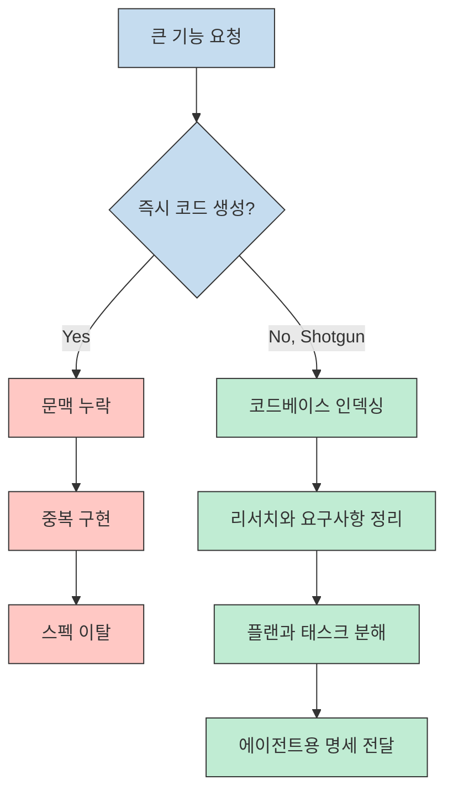
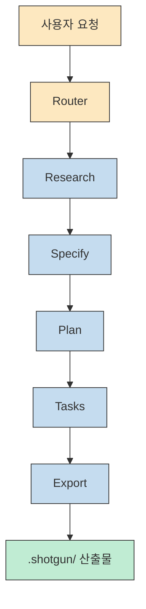
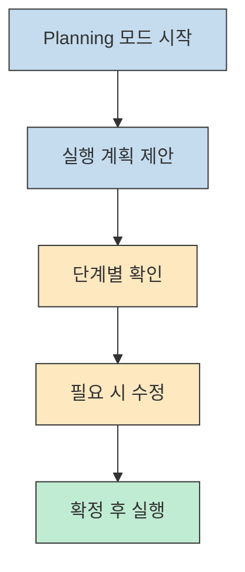
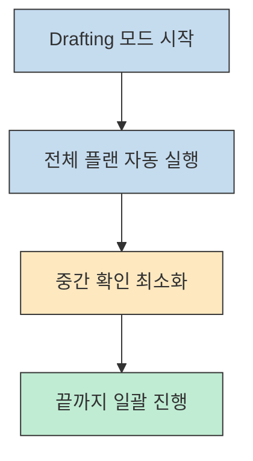
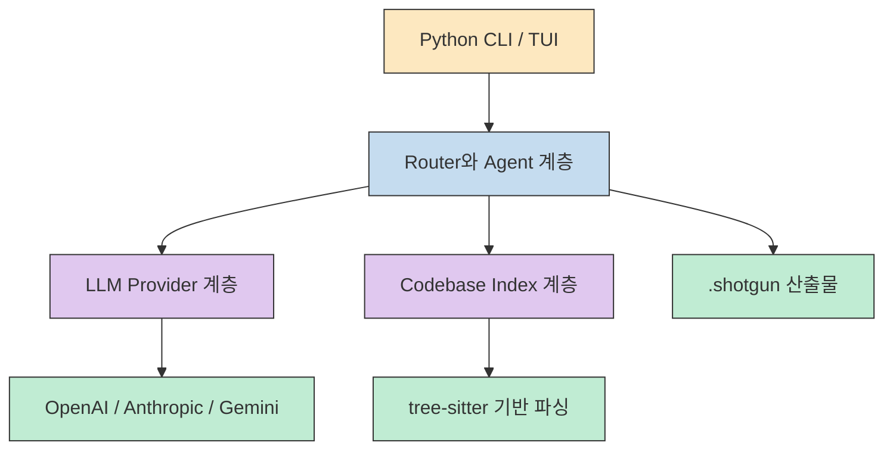
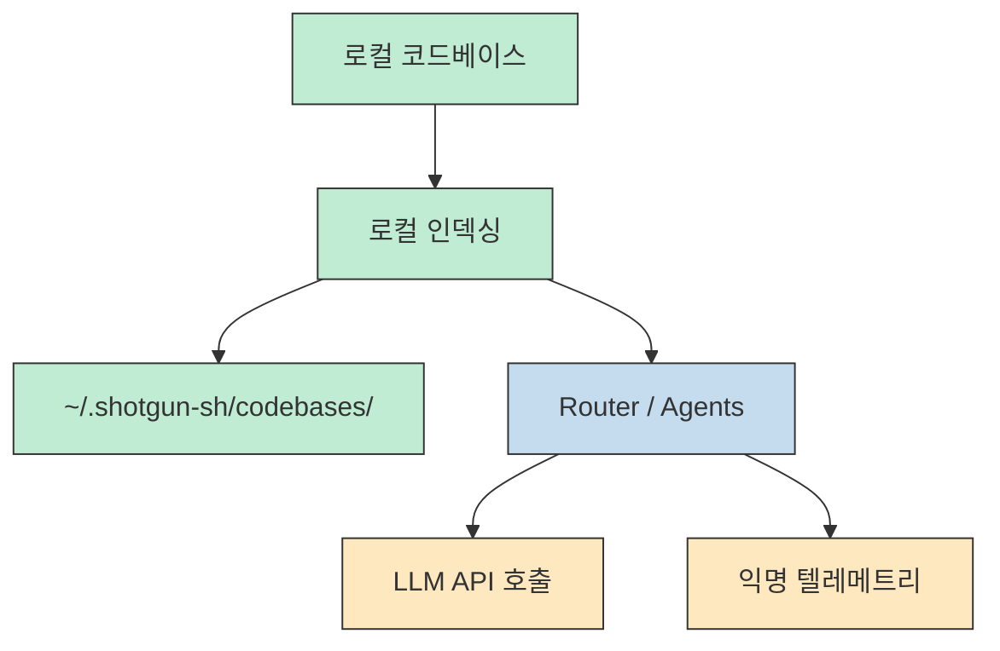
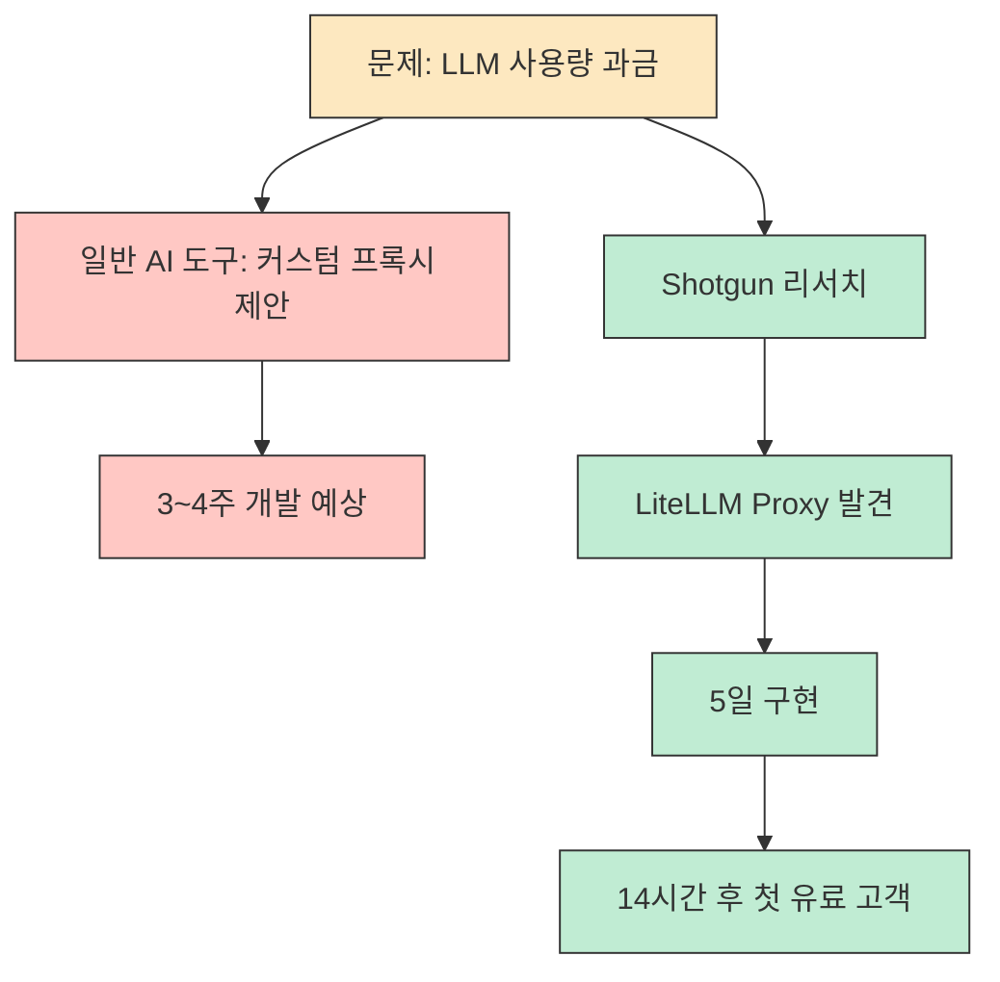

Shotgun은 요즘 흔한 "AI가 코드를 대신 써 준다" 류의 도구와 출발점이 조금 다릅니다. 이 프로젝트가 전면에 내세우는 핵심은 코드 생성 자체가 아니라, **AI 코딩 에이전트가 큰 기능에서 왜 자꾸 탈선하는지 먼저 인정하고 그 앞단의 리서치, 명세, 계획을 구조화하는 것** 입니다. README의 한 문장으로 요약하면 Shotgun은 "codebase-aware specs" 를 만들어 Codex, Cursor, Claude Code 같은 에이전트가 엉뚱한 방향으로 새지 않게 돕는 CLI입니다. [GitHub Repository](https://github.com/shotgun-sh/shotgun) [README](https://github.com/shotgun-sh/shotgun/blob/main/README.md)
<!--more-->

실제로 저장소를 읽어 보면 이 도구는 단순한 프롬프트 래퍼가 아닙니다. 코드베이스를 먼저 인덱싱하고, 리서치와 스펙, 플랜, 태스크, 익스포트 단계를 분리하고, TUI와 CLI 양쪽에서 그 흐름을 운영하도록 설계되어 있습니다. Python 기반 패키지이지만 내부 의존성에는 `textual`, `pydantic-ai`, `tree-sitter` 계열 파서, `typer`, `rich` 같은 구성 요소가 함께 보이기 때문에, 방향성은 명확합니다. **"대화형 개발 경험" 과 "코드베이스 구조 이해" 를 한 툴 안에 결합하려는 시도** 입니다. [pyproject.toml](https://github.com/shotgun-sh/shotgun/blob/main/pyproject.toml) [CLI docs](https://github.com/shotgun-sh/shotgun/blob/main/docs/CLI.md)

## Sources

- https://github.com/shotgun-sh/shotgun
- https://github.com/shotgun-sh/shotgun/blob/main/README.md
- https://github.com/shotgun-sh/shotgun/blob/main/docs/CLI.md
- https://github.com/shotgun-sh/shotgun/blob/main/docs/CASE_STUDY.md
- https://github.com/shotgun-sh/shotgun/blob/main/docs/OBSERVABILITY.md
- https://github.com/shotgun-sh/shotgun/blob/main/pyproject.toml
- https://github.com/shotgun-sh/shotgun/blob/main/CLAUDE.md

## 1) Shotgun이 풀려는 문제는 "코드 생성" 이 아니라 "사전 정렬" 이다

README가 가장 먼저 강조하는 문제 정의는 꽤 현실적입니다. AI 에이전트는 작은 작업에는 강하지만, 큰 기능으로 들어가면 문맥을 잊고, 이미 있는 것을 다시 만들고, 중간에 스펙에서 벗어나기 쉽다는 것입니다. Shotgun은 여기서 "코드를 더 잘 생성하는 모델" 을 약속하지 않습니다. 대신 전체 코드베이스를 읽고, 기능을 먼저 계획하고, 그 결과를 여러 개의 staged PR 혹은 단계적 작업 단위로 나눠서 에이전트가 따라가기 쉬운 형태로 바꾸겠다고 말합니다. 이 점이 중요합니다. **문제를 생성 품질로 보지 않고 작업 구조의 붕괴로 보는 도구** 이기 때문입니다. [README](https://github.com/shotgun-sh/shotgun/blob/main/README.md)

이 관점은 기존 AI 코딩 도구와의 비교 설명에서도 반복됩니다. Shotgun은 다른 도구들이 specification부터 시작하거나 즉시 구현으로 뛰어드는 반면, 자신은 먼저 research phase를 거쳐 현재 코드베이스와 외부 솔루션까지 조사한 뒤 다음 단계로 넘어간다고 설명합니다. 다시 말해 이 프로젝트의 핵심 가치는 "더 똑똑한 한 번의 답변" 이 아니라 **작업 시작 전에 필요한 컨텍스트를 미리 정리해 주는 운영 계층** 에 가깝습니다. [README](https://github.com/shotgun-sh/shotgun/blob/main/README.md) [CASE_STUDY.md](https://github.com/shotgun-sh/shotgun/blob/main/docs/CASE_STUDY.md)

## 2) 내부 파이프라인의 중심은 Router와 단계별 전문 에이전트다

Shotgun 문서를 보면 사용자에게 보이는 실행 모드는 Planning과 Drafting 두 가지뿐이지만, 그 아래에는 더 세분화된 파이프라인이 있습니다. README와 CLI 문서가 공통으로 말하는 내부 흐름은 `Research -> Specify -> Plan -> Tasks -> Export` 입니다. 사용자는 이 다섯 단계를 직접 고르기보다 Router를 통해 상위 수준에서 다루고, 실제로는 프롬프트에 맞춰 적절한 하위 에이전트가 자동으로 배치됩니다. [README](https://github.com/shotgun-sh/shotgun/blob/main/README.md) [CLI docs](https://github.com/shotgun-sh/shotgun/blob/main/docs/CLI.md)

저장소 구조도 이 설명과 잘 맞습니다. `src/shotgun/agents` 아래에는 `research.py`, `specify.py`, `plan.py`, `tasks.py`, `export.py`, `router/`, `context_analyzer/` 같은 모듈이 있고, 별도로 `src/shotgun/codebase` 패키지가 존재합니다. 즉 프로젝트는 처음부터 "한 명의 범용 에이전트" 보다는 **코드베이스 이해와 작업 단계를 명시적으로 분리한 다단계 오케스트레이션** 을 염두에 두고 구성된 것으로 읽힙니다. [GitHub Repository](https://github.com/shotgun-sh/shotgun) [pyproject.toml](https://github.com/shotgun-sh/shotgun/blob/main/pyproject.toml)

CLI 문서에 적힌 산출물 위치도 흥미롭습니다. 결과는 `.shotgun/` 아래에 `research.md`, `specification.md`, `plan.md`, `tasks.md`, `AGENTS.md` 형태로 쌓입니다. 즉 Shotgun은 결과를 단지 화면에 출력하는 것이 아니라, **후속 AI 에이전트가 다시 읽을 수 있는 중간 산출물 체인** 으로 저장합니다. 이 설계 덕분에 "조사 -> 명세 -> 계획 -> 실행 전달" 이라는 흐름이 휘발되지 않고 파일로 남습니다. [CLI docs](https://github.com/shotgun-sh/shotgun/blob/main/docs/CLI.md)

## 3) 사용 경험은 TUI 우선이고, 자동화용 CLI가 그 뒤를 받친다

README는 TUI를 기본 사용 방식으로 강하게 밀고 있습니다. Shotgun을 실행하면 TUI가 자동으로 열리고, `Shift+Tab` 으로 Planning과 Drafting을 바꾸고, `/` 로 커맨드 팔레트를 여는 흐름을 추천합니다. 즉 이 프로젝트는 단순한 커맨드 모음이 아니라, **상태를 보면서 질문-응답-검토를 이어 가는 상호작용형 개발 콘솔** 을 지향합니다. [README](https://github.com/shotgun-sh/shotgun/blob/main/README.md)

반대로 `docs/CLI.md` 는 스크립팅과 자동화를 위한 얇은 표면을 제공합니다. `shotgun run` 으로 라우터를 바로 실행할 수 있고, `shotgun context`, `shotgun clear`, `shotgun compact`, `shotgun codebase index` 같은 유틸리티 명령도 따로 있습니다. 따라서 운영 관점에서 보면 TUI는 사람과의 상호작용을, CLI는 비대화형 배치나 CI/CD 연동을 담당하는 셈입니다. 이 둘을 분리해 둔 덕분에 Shotgun은 **"사람이 보면서 다듬는 도구" 이면서 동시에 "파이프라인에 넣을 수 있는 도구"** 라는 두 성격을 모두 갖게 됩니다. [CLI docs](https://github.com/shotgun-sh/shotgun/blob/main/docs/CLI.md)

## 4) 패키지 구성이 보여 주는 기술적 성격은 "Python 기반 AI 개발 오케스트레이터" 다

`pyproject.toml` 을 보면 Shotgun의 기술 스택은 꽤 선명합니다. CLI와 콘솔 표현에는 `typer`, `rich` 가, TUI에는 `textual` 과 `textual-serve` 가, LLM 오케스트레이션에는 `pydantic-ai`, `openai`, `anthropic`, `sentencepiece`, `tiktoken` 이, 코드베이스 파싱에는 `tree-sitter` 와 Python/JavaScript/TypeScript/Go/Rust용 parser 패키지들이 들어 있습니다. 이 조합은 Shotgun이 단순한 텍스트 래퍼가 아니라 **다중 모델 호출 + 다중 언어 코드 인덱싱 + 인터랙티브 UI** 를 동시에 잡으려는 도구라는 뜻입니다. [pyproject.toml](https://github.com/shotgun-sh/shotgun/blob/main/pyproject.toml)

여기서 중요한 포인트는 "코드베이스를 이해한다" 는 말이 마케팅 문구로만 끝나지 않는다는 점입니다. README는 Shotgun이 "searchable graph of your entire repository" 를 만든다고 설명하고, FAQ는 그 인덱싱이 tree-sitter 기반이며 로컬에서 수행된다고 말합니다. 의존성과 문서 설명을 함께 보면 Shotgun의 구조는 대략 이렇게 읽을 수 있습니다. **코드를 먼저 파싱해 구조 정보를 잡고, 그 위에서 에이전트가 조사와 계획을 세우며, 마지막에 AI 코딩 도구가 읽을 수 있는 명세 파일로 내보내는 방식** 입니다. [README](https://github.com/shotgun-sh/shotgun/blob/main/README.md) [pyproject.toml](https://github.com/shotgun-sh/shotgun/blob/main/pyproject.toml)

## 5) 로컬 우선 도구이지만 완전한 오프라인 툴은 아니다

Shotgun README와 FAQ는 이 부분을 비교적 솔직하게 설명합니다. 코드베이스 인덱싱은 사용자의 컴퓨터에서 로컬로 수행되고, 인덱스는 `~/.shotgun-sh/codebases/` 에 저장되며 서버로 전송되지 않는다고 합니다. 이것은 중요한 약속입니다. 많은 사용자가 가장 민감하게 보는 것은 원본 코드가 외부로 나가느냐는 점인데, Shotgun은 최소한 인덱싱 단계에 대해서는 로컬 처리라고 선을 긋고 있습니다. [README](https://github.com/shotgun-sh/shotgun/blob/main/README.md)

하지만 동시에 완전한 로컬 전용 도구라고 말하지도 않습니다. FAQ는 LLM API 호출을 위해 인터넷 연결이 필요하다고 명시하고, `docs/OBSERVABILITY.md` 는 PostHog와 Logfire를 통한 익명 텔레메트리와 예외 추적을 설명합니다. README 쪽 FAQ도 설치, 서버 시작, 도구 호출 같은 최소 이벤트를 익명으로 수집한다고 적어 둡니다. 즉 Shotgun의 운영 경계는 **"코드 자체는 로컬에 남긴다" 와 "제품 품질 개선용 익명 이벤트는 수집한다"** 의 조합으로 이해하는 편이 정확합니다. [README](https://github.com/shotgun-sh/shotgun/blob/main/README.md) [OBSERVABILITY.md](https://github.com/shotgun-sh/shotgun/blob/main/docs/OBSERVABILITY.md)

이 설계는 장단이 분명합니다. 장점은 인덱싱 프라이버시에 대해 비교적 명확한 모델을 제공한다는 점이고, 단점은 엄격한 의미의 에어갭 환경이나 텔레메트리 민감 환경에서는 추가 검토가 필요하다는 점입니다. 특히 운영 문서를 보면 production build에서는 텔레메트리 토큰이 빌드 시점에 포함된다고 설명하기 때문에, 보안이 매우 보수적인 조직이라면 이 부분을 먼저 확인하고 써야 합니다. [OBSERVABILITY.md](https://github.com/shotgun-sh/shotgun/blob/main/docs/OBSERVABILITY.md)

## 6) 이 도구의 진짜 메시지는 LiteLLM 사례에서 가장 잘 드러난다

`docs/CASE_STUDY.md` 는 Shotgun을 설명하는 가장 강한 문서입니다. 여기서는 사용량 추적과 예산 제한이 필요한 LLM 결제 시스템을 만들 때, Cursor, Claude Code, Copilot 모두가 커스텀 프록시를 직접 구축하는 쪽으로 제안했지만, Shotgun의 리서치 단계가 LiteLLM Proxy를 찾아냈다고 말합니다. 문서가 내세우는 수치는 꽤 공격적입니다. 30분 안에 대안을 발견했고, 구현은 5일, 첫 유료 고객은 배포 14시간 후, 개발 시간은 80% 절감되었다는 주장입니다. [CASE_STUDY.md](https://github.com/shotgun-sh/shotgun/blob/main/docs/CASE_STUDY.md)

이 사례의 핵심은 숫자 자체보다 메커니즘에 있습니다. Shotgun은 "AI가 코드를 더 잘 썼다" 라고 주장하지 않습니다. 대신 **문제를 코드 생성 전에 재정의했다** 고 주장합니다. 즉 "프록시를 어떻게 구현할까" 가 아니라 "이 요구사항을 만족하는 기존 솔루션이 이미 있는가" 를 먼저 묻는 구조를 강제했다는 것입니다. 그래서 Shotgun이 진짜로 팔고 있는 것은 코드가 아니라, **리서치가 빠진 상태에서 AI가 과잉 구현으로 달려가는 패턴을 막는 절차적 안전장치** 라고 볼 수 있습니다. [CASE_STUDY.md](https://github.com/shotgun-sh/shotgun/blob/main/docs/CASE_STUDY.md)

이 케이스는 또한 Shotgun의 포지셔닝을 분명하게 보여 줍니다. 이 도구는 Cursor나 Claude Code를 대체하겠다는 프로젝트가 아니라, 그 앞단에서 "무엇을 만들어야 하는가" 를 정리해 주는 전처리 계층입니다. 그래서 README가 AGENTS.md export를 강조하는 것도 자연스럽습니다. **Shotgun의 목표는 직접 구현하는 것이 아니라, 다른 AI 에이전트가 덜 틀리게 구현하도록 만드는 것** 이기 때문입니다. [README](https://github.com/shotgun-sh/shotgun/blob/main/README.md) [CLI docs](https://github.com/shotgun-sh/shotgun/blob/main/docs/CLI.md)

## 핵심 요약

- Shotgun은 AI 코딩 에이전트의 출력 자체보다, 그 에이전트가 일하기 전에 필요한 코드베이스 이해와 명세 정렬을 담당하는 CLI/TUI 도구입니다. [README](https://github.com/shotgun-sh/shotgun/blob/main/README.md)
- 내부 흐름은 `Research -> Specify -> Plan -> Tasks -> Export` 로 분리되어 있고, 결과는 `.shotgun/` 아래 파일로 남아 다른 AI 도구가 다시 읽을 수 있습니다. [CLI docs](https://github.com/shotgun-sh/shotgun/blob/main/docs/CLI.md)
- 기술 스택은 Python 위에 `textual`, `pydantic-ai`, `tree-sitter` 계열을 얹은 형태라서, 인터랙티브 UI와 코드 인덱싱을 동시에 노린 설계가 보입니다. [pyproject.toml](https://github.com/shotgun-sh/shotgun/blob/main/pyproject.toml)
- 인덱싱은 로컬에서 수행되지만, LLM API 호출과 익명 텔레메트리라는 운영 경계는 분명히 존재합니다. [README](https://github.com/shotgun-sh/shotgun/blob/main/README.md) [OBSERVABILITY.md](https://github.com/shotgun-sh/shotgun/blob/main/docs/OBSERVABILITY.md)
- LiteLLM 사례가 보여 주듯 Shotgun의 실제 가치는 "더 많이 코드를 쓰게 하는 것" 보다 "이미 있는 해법을 먼저 찾게 하는 것" 에 있습니다. [CASE_STUDY.md](https://github.com/shotgun-sh/shotgun/blob/main/docs/CASE_STUDY.md)

## 결론

Shotgun을 한 문장으로 정리하면, "AI 코딩 에이전트용 스펙 기반 프리프로세서" 에 가깝습니다. 이 프로젝트가 흥미로운 이유는 또 하나의 AI 채팅 UI를 만든 것이 아니라, 리서치와 코드베이스 인덱싱, 명세 산출물, 단계별 실행이라는 실제 실패 지점을 제품 설계에 직접 반영했기 때문입니다. [README](https://github.com/shotgun-sh/shotgun/blob/main/README.md) [CLI docs](https://github.com/shotgun-sh/shotgun/blob/main/docs/CLI.md)

그래서 이 저장소를 볼 때는 "Shotgun이 코드를 얼마나 잘 쓰나" 보다 "Shotgun이 다른 에이전트가 틀릴 확률을 얼마나 낮추나" 를 기준으로 읽는 편이 맞습니다. 만약 이미 Cursor, Claude Code, Codex를 쓰고 있는데 큰 기능에서 자주 헤매고 있다면, Shotgun은 그 위에 올리는 보조 도구로 꽤 설득력 있습니다. 반대로 작은 버그 수정 위주라면 이 도구의 전체 파이프라인은 과할 수도 있습니다. 결국 Shotgun의 가치는 모델 성능이 아니라, **무엇을 만들지 정하기 전에 무엇을 알아야 하는지 강제로 앞당기는 데** 있습니다. [GitHub Repository](https://github.com/shotgun-sh/shotgun) [CASE_STUDY.md](https://github.com/shotgun-sh/shotgun/blob/main/docs/CASE_STUDY.md)
